# モジュール 1 - データ エンジニアリング ワークロードのコンピューティングおよびストレージ オプションを確認する

このモジュールでは、データ レイクを構成し、探索、ストリーミング、バッチ ワークロードに備えてファイルを最適化する方法を説明します。受講者は、バッチおよびストリーム処理を通してファイルを変換しながら、データを絞り込めるレベルにデータ レイクを整理する方法を学びます。データセットで CSV、JSON、Parquet ファイルのようなデータセットでインデックスを作成し、潜在的なクエリやワークロードのアクセラレーションにこれを使用する方法を学びます。

このモジュールでは、次のことができるようになります。

- ストリーミングとバッチ処理を 1 つのパイプラインに組み合わせる
- データ レイクをファイル変換のレベルに整理する
- クエリおよびワークロードのアクセラレーション向けにデータ レイク ストレージにインデックスを付ける

## ラボの詳細

- [モジュール 1 - データ エンジニアリング ワークロードのコンピューティングおよびストレージ オプションを確認する](#module-1---explore-compute-and-storage-options-for-data-engineering-workloads)
  - [ラボの詳細](#lab-details)
  - [ラボ 1 - Delta Lake アーキテクチャ](#lab-1---delta-lake-architecture)
    - [実践ラボの前](#before-the-hands-on-lab)
      - [タスク 1: Azure Databricks ワークスペースを作成して構成する](#task-1-create-and-configure-the-azure-databricks-workspace)
    - [演習 1: ラボのノートブックを完了する](#exercise-1-complete-the-lab-notebook)
      - [タスク 1: Databricks アーカイブを複製する](#task-1-clone-the-databricks-archive)
      - [タスク 2: 次のノートブックを完了する](#task-2-complete-the-following-notebook)
  - [ラボ 2 - Synapse Analytics で Apache Spark を使用する](#lab-2---working-with-apache-spark-in-synapse-analytics)
    - [実践ラボの前](#before-the-hands-on-lab-1)
      - [タスク 1: Azure Synapse Analytics ワークスペースを作成して構成する](#task-1-create-and-configure-the-azure-synapse-analytics-workspace)
      - [タスク 2: このラボの追加リソースを作成して構成する](#task-2-create-and-configure-additional-resources-for-this-lab)
    - [演習 1: Spark を使用してデータを読み込む](#exercise-1-load-and-data-with-spark)
      - [タスク 1: Hyperspace を使用して Data Lake ストレージにインデックスを付ける](#task-1-index-the-data-lake-storage-with-hyperspace)
      - [タスク 2: MSSparkUtil lライブラリを使用して Data Lake ストレージを探索する](#task-2-explore-the-data-lake-storage-with-the-mssparkutil-library)
    - [リソース](#resources)

## ラボ 1 - Delta Lake アーキテクチャ

このラボでは、Azure Databricks ワークスペースを使用し、Delta Lake を使ってバッチ ジョブにより構造化ストリーミングを実行します。Databricks Notebooks 内で演習を完了する必要があります。開始するには、Azure Databricks ワークスペースにアクセスできる必要があります。使用可能なワークスペースがない場合は、次の手順に従ってください。それ以外の場合は、このページの下部の「[Databricks アーカイブを複製する](#clone-the-databricks-archive)」までスキップできます。

### 実践ラボの前

> **注:** ホストされたラボ環境を**使用しておらず**、ご自分の Azure サブスクリプションを使用している場合は `Before the hands-on lab` の手順のみを完了してください。その他の場合は、演習 1 にスキップします。

このラボの演習を始める前に、利用可能なクラスターが含まれている Azure Databricks ワークスペースにアクセスできることを確認してください。以下のタスクを実行してワークスペースを構成します。

#### タスク 1: Azure Databricks ワークスペースを作成して構成する

**ホストされたラボ環境を使用していない場合は**、[ラボ 01 セットアップ方法](https://github.com/solliancenet/microsoft-data-engineering-ilt-deploy/blob/main/setup/01/lab-01-setup.md)に従い、手動でワークスペースを作成して構成します。

### 演習 1: ラボのノートブックを完了する

#### タスク 1: Databricks アーカイブを複製する

1. 現在 Azure Databricks ワークスペースを開いていない場合は、Azure portal で、デプロイ済みの Azure Databricks ワークスペースに移動し、「**ワークスペースの起動**」 を選択します。
1. 左側のウィンドウで、「**ワークスペース**」  >  「**ユーザー**」 の順に選択して、ご自分のユーザー名 (家のアイコンのエントリ) を選択します。
1. 表示されたウィンドウで、ご自分の名前の横にある矢印を選択し、「**インポート**」 を選択します。

  

1. 「**ノートブックのインポート**」 ダイアログ ボックスで URL を選択し、次の URL 内に貼り付けます。

 ```
  https://github.com/solliancenet/microsoft-learning-paths-databricks-notebooks/blob/master/data-engineering/DBC/11-Delta-Lake-Architecture.dbc?raw=true
 ```

1. 「**インポート**」 を選択します。
1. 表示される **11-Delta-Lake-Architecture** フォルダーを選択します。

#### タスク 2: 次のノートブックを完了する

**1-Delta-Architecture** ノートブックを開きます。指示に従ってセルで操作を実行する前に、クラスターをノートブックに接続していることを確認してください。

ノートブック内で、ストリーミングとバッチ処理を 1 つのパイプラインに組み合わせる方法について確認します。

> ノートブックを完了した後は、この画面に戻り、次のラボに進みます。

## ラボ 2 - Synapse Analytics で Apache Spark を使用する

このラボでは、Azure Synapse Analytics で Apache Spark を使用する方法も説明します。リンク サービスを使用して Azure Synapse Analytics ワークスペースを Azure Data Explorer ワークスペースに接続する方法を学習した後、Spark ノートブックを使用してデータベースのひとつからデータを読み込みます。また、Hyperspace や MSSparkUtil のようなライブラリを使用して、Spark ノートブックから Data Lake ストレージ アカウントを使用する方法を最適化します。Data Explorer と Data Lake ストレージのほかに、データ強化プロセスでも SQL プールからの履歴データを使用します。最後に、強化されたデータを Data Lake に戻し、SQL 組み込みプールと Power BI を使用してこれを消費します。

ラボを完了すると、Azure Synapse Analytics ワークスペースで Spark を使用するエンドツーエンドのデータ強化プロセスの主要な手順を理解できます。

### 実践ラボの前

> **注:** ホストされたラボ環境を**使用しておらず**、ご自分の Azure サブスクリプションを使用している場合は、`Before the hands-on lab` の手順のみを完了してください。その他の場合は、演習 1 にスキップします。

このラボの演習を始める前に、Azure Synapse Analytics ワークスペースが適切に構成されていることを確認してください。以下のタスクを実行してワークスペースを構成します。

#### タスク 1: Azure Synapse Analytics ワークスペースを作成して構成する

>**注**
>
>利用できる他のラボのひとつを実行している間に、Synapse Analytics ワークスペースをすでに作成して構成している場合は、このタスクを再び実行しないでください。次のタスクに移ることができます。ラボは Synapse Analytics ワークスペースを共有するよう意図されているので、一度だけ作成してください。

**ホストされたラボ環境を使用していない場合は**、[Azure Synapse Analytics ワークスペースのデプロイ](https://github.com/solliancenet/microsoft-data-engineering-ilt-deploy/blob/main/setup/01/asa-workspace-deploy.md)の手順に従い、ワークスペースを作成して構成します。

#### タスク 2: このラボの追加リソースを作成して構成する

**ホストされたラボ環境を使用していない場合は**、[ラボ 02 のリソースをデプロイ](https://github.com/solliancenet/microsoft-data-engineering-ilt-deploy/blob/main/setup/01/lab-02-deploy.md)の手順に従い、このラボの追加リソースをデプロイしてください。デプロイが完了すると、このラボの演習を進めることができます。

### 演習 1: Spark を使用してデータを読み込む

#### タスク 1: Hyperspace を使用して Data Lake ストレージにインデックスを付ける

Azure Data Lake Gen 2 からデータを読み込む際は、最もリソースを消費する操作のひとつでデータを検索します。[Hyperspace](https://github.com/microsoft/hyperspace) では、Apache Spark ユーザーがデータセット (CSV、JSON、Parquet など) にインデックスを作成し、クエリやワークロードのアクセラレーションでそれを使用できるようになります。

Hyperspace では、永続的なデータ ファイルからスキャンされたレコードにインデックスを作成できます。正常に作成されると、インデックスに対応するエントリが Hyperspace のメタデータに追加されます。このメタデータは、後でクエリ処理中に Apache Spark のオプティマイザーによって使用され、適切なインデックスを検索して使えるようにします。基になるデータが変更された場合に、それをキャプチャできるよう既存のインデックスを最新の情報に更新します。

また、Hyperspace では、ユーザーはクエリを実行する前に、元のプランと更新されたインデックス依存プランを比較できます。

1. Synapse Studio (<https://web.azuresynapse.net/>) を開きます。

2. **Develop** ハブを選択します。

    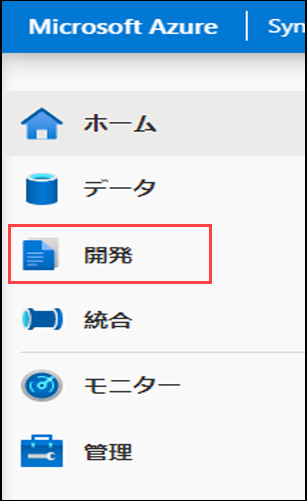

3. **+** を選択してから 「**ノートブック**」 を選び、新しい Synapse ノートブックを作成します。

    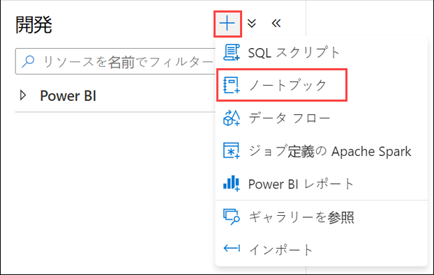

4. ノートブックの名前として「**Hyperspace**」と入力し **(1)**、上にある 「**プロパティ**」 ボタンを選択して **(2)** プロパティ ペインを非表示にします。

    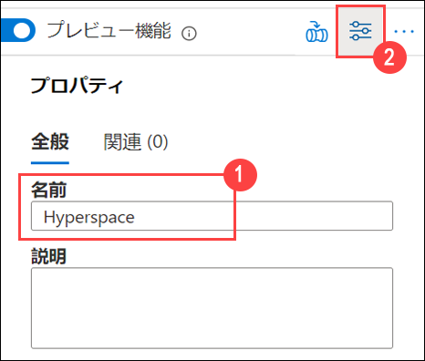

5. ノートブックを Spark クラスターに添付し、言語が **PySpark (Python)** に設定されていることを確認します。

    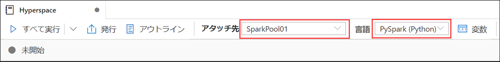

6. ノートブックの新しいセルに以下のコードを追加します。

    ```python
    from hyperspace import *  
    from com.microsoft.hyperspace import *
    from com.microsoft.hyperspace.index import *

    # Disable BroadcastHashJoin, so Spark will use standard SortMergeJoin. Currently, Hyperspace indexes utilize SortMergeJoin to speed up query.
    spark.conf.set("spark.sql.autoBroadcastJoinThreshold", -1)

    # Replace the value below with the name of your primary ADLS Gen2 account for your Synapse workspace
    datalake = 'REPLACE_WITH_YOUR_DATALAKE_NAME'

    dfSales = spark.read.parquet("abfss://wwi-02@" + datalake + ".dfs.core.windows.net/sale-small/Year=2019/Quarter=Q4/Month=12/*/*.parquet")
    dfSales.show(10)

    dfCustomers = spark.read.load("abfss://wwi-02@" + datalake + ".dfs.core.windows.net/data-generators/generator-customer-clean.csv", format="csv", header=True)
    dfCustomers.show(10)

    # Create an instance of Hyperspace
    hyperspace = Hyperspace(spark)
    ```

    `REPLACE_WITH_YOUR_DATALAKE_NAME` の値は、Synapse ワークスペースのプライマリ ADLS Gen2 アカウントの名前に置き換えます。これを行うには以下を実行します。

    1. 「**データ**」 ハブに移動します。

        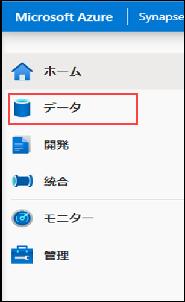

    2. 「**リンク**」 タブ **(1)** を選択し、Azure Data Lake Storage Gen2 グループを展開します。ワークスペース名の隣のプライマリ ADLS Gen2 name **(2)** をメモします。

        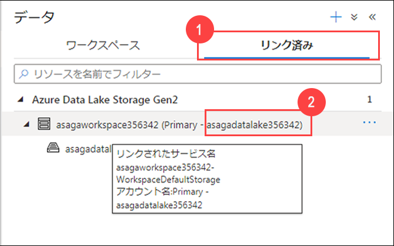

7. 新しいセルを実行します。データ レイクからデータのある DataFrame を 2 つ読み込み、Hyperspace を初期化します。

    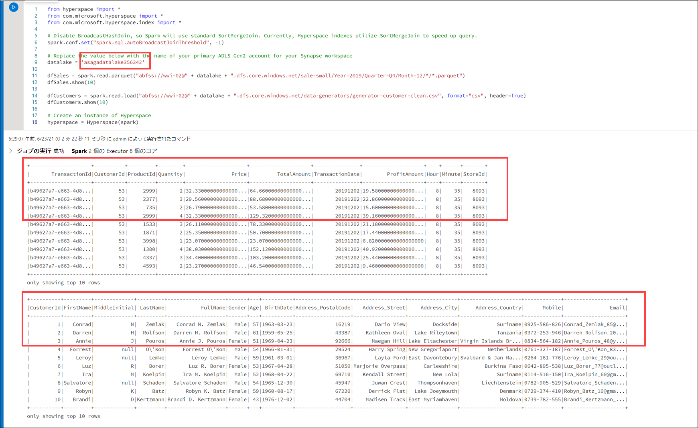

    > **注**: セルの左にある ［実行］ を選択するか、`Shift+Enter` を押すと、セルを実行して新しいセルを作成できます。
    >
    > ノートブックで初めてセルを実行する場合は、新しい Spark クラスターを起動する必要があるため、数分かかります。その後のセルの実行は、これよりも早くなります。

8. 以下のコードを使用してノートブックに新しいコード セルを追加します。

    ```python
    #create indexes: each one contains a name, a set of indexed columns and a set of included columns
    indexConfigSales = IndexConfig("indexSALES", ["CustomerId"], ["TotalAmount"])
    indexConfigCustomers = IndexConfig("indexCUSTOMERS", ["CustomerId"], ["FullName"])

    hyperspace.createIndex(dfSales, indexConfigSales)			# only create index once
    hyperspace.createIndex(dfCustomers, indexConfigCustomers)	# only create index once
    hyperspace.indexes().show()
    ```

9. 新しいセルを実行します。2 つのインデックスが作成され、その構造が表示されます。

    

10. 以下のコードを使用してノートブックに別の新しいコード セルを追加します。

    ```python
    df1 = dfSales.filter("""CustomerId = 200""").select("""TotalAmount""")
    df1.show()
    df1.explain(True)
    ```

11. 新しいセルを実行します。出力は、物理的な実行プランにインデックスがまったく含まれていないことを示します (オリジナル データ ファイルでファイル スキャンを実行します)。

    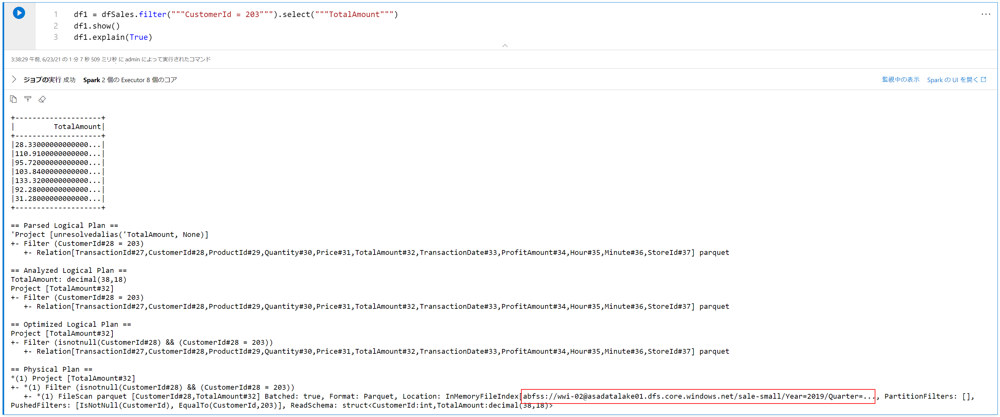

12. ここで以下のコードを使用してノートブックに別の新しいセルを追加します (最初に使われている追加ラインにより Spark エンジンで Hyperspace の最適化が有効になる点に留意してください)。

    ```python
    # Enable Hyperspace - Hyperspace optimization rules become visible to the Spark optimizer and exploit existing Hyperspace indexes to optimize user queries
    Hyperspace.enable(spark)
    df1 = dfSales.filter("""CustomerId = 200""").select("""TotalAmount""")
    df1.show()
    df1.explain(True)
    ```

13. 新しいセルを実行します。出力は、物理的な実行プランがオリジナル データ ファイルではなく、インデックスを使用していることを示します。

    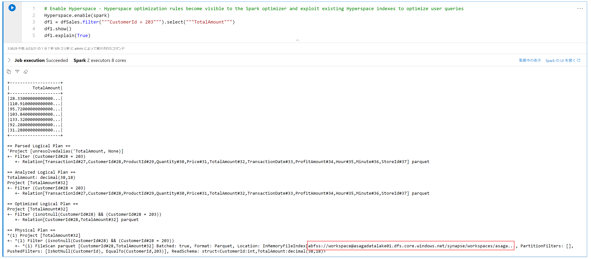

14. Hyperspace は Explain API を提供するので、インデックスのない実行計画とインデックスのある実行計画を比較できます。以下のコードを使用して新しいセルを追加します。

    ```python
    df1 = dfSales.filter("""CustomerId = 200""").select("""TotalAmount""")

    spark.conf.set("spark.hyperspace.explain.displayMode", "html")
    hyperspace.explain(df1, True, displayHTML)
    ```

15. 新しいセルを実行します。出力は `Plan with indexes` と `Plan without indexes` の比較を示します。最初のケースで、インデックス ファイルがどのように使用されているのか、また 2 番目のケースではオリジナル データ ファイルが使用されていることを観察してください。

    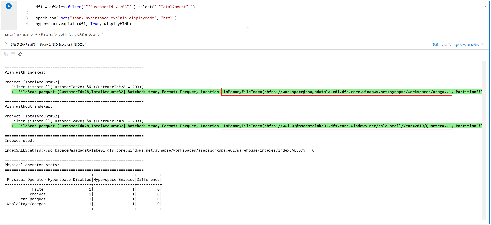

16. それでは、join 操作を含む、より複雑なケースを調べてみましょう。以下のコードを使用して新しいセルを追加します。

    ```python
    eqJoin = dfSales.join(dfCustomers, dfSales.CustomerId == dfCustomers.CustomerId).select(dfSales.TotalAmount, dfCustomers.FullName)

    hyperspace.explain(eqJoin, True, displayHTML)
    ```

17. 新しいセルを実行します。出力には再び `Plan with indexes` と `Plan without indexes` の比較が表示され、インデックスは最初のケース、オリジナル データ ファイルは 2 番目のケースで使用されています。

    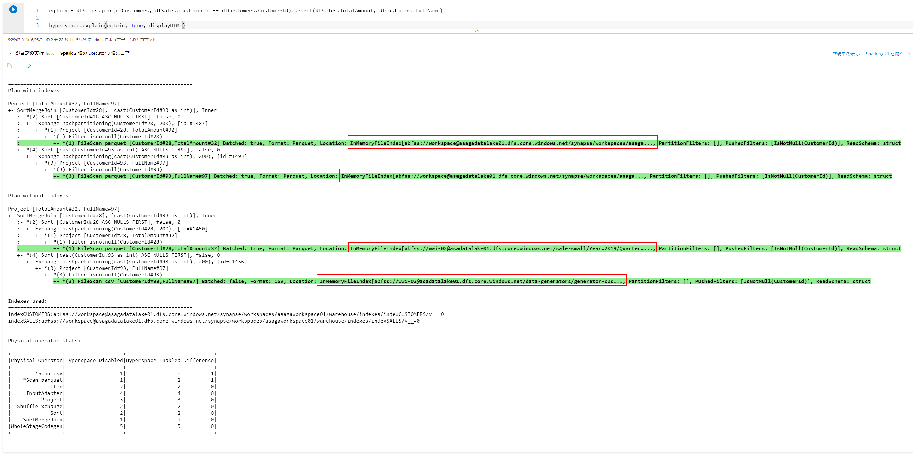

    Hyperspace を無効にしてインデックスをクリーンアップしたい場合は、以下のコードを実行できます。

    ```python
    # Disable Hyperspace - Hyperspace rules no longer apply during query optimization.Disabling Hyperspace has no impact on created indexes because they remain intact
    Hyperspace.disable(spark)

    hyperspace.deleteIndex("indexSALES")
    hyperspace.vacuumIndex("indexSALES")
    hyperspace.deleteIndex("indexCUSTOMERS")
    hyperspace.vacuumIndex("indexCUSTOMERS")
    ```

#### タスク 2: MSSparkUtil lライブラリを使用して Data Lake ストレージを探索する

Microsoft Spark Utilities (MSSparkUtils) は、一般的なタスクを簡単に実行できるようにするための組み込みパッケージです。MSSparkUtils は、ファイルシステムの操作や環境変数の取得、シークレットの処理で使用できます。

1. 前のタスクと同じノートブックを使い、以下のコードで新しいセルを追加します。

    ```python
    from notebookutils import mssparkutils

    #
    # Microsoft Spark Utilities
    #
    # https://docs.microsoft.com/ja-jp/azure/synapse-analytics/spark/microsoft-spark-utilities?pivots=programming-language-python
    #

    # Azure storage access info
    blob_account_name = datalake
    blob_container_name = 'wwi-02'
    blob_relative_path = '/'
    linkedServiceName = datalake
    blob_sas_token = mssparkutils.credentials.getConnectionStringOrCreds(linkedServiceName)

    # Allow SPARK to access from Blob remotely
    spark.conf.set('fs.azure.sas.%s.%s.blob.core.windows.net' % (blob_container_name, blob_account_name), blob_sas_token)

    files = mssparkutils.fs.ls('/')
    for file in files:
        print(file.name, file.isDir, file.isFile, file.path, file.size)

    mssparkutils.fs.mkdirs('/SomeNewFolder')

    files = mssparkutils.fs.ls('/')
    for file in files:
        print(file.name, file.isDir, file.isFile, file.path, file.size)
    ```

2. 新しいセルを実行し、ファイル システムの操作で `mssparkutils` がどのように使われているのか観察してください。

### リソース

このラボで取り上げたトピックの詳細については、以下のリソースを参照してください。

- [Azure Synapse Analytics での Apache Spark](https://docs.microsoft.com/azure/synapse-analytics/spark/apache-spark-overview)
- [Azure Synapse 向けに Azure Data Explorer データ コネクタを発表する](https://techcommunity.microsoft.com/t5/azure-data-explorer/announcing-azure-data-explorer-data-connector-for-azure-synapse/ba-p/1743868)
- [Apache Spark for Azure Synapse Analytics を使用して Azure Data Explorer に接続する](https://docs.microsoft.com/azure/synapse-analytics/quickstart-connect-azure-data-explorer)
- [Azure Synapse Analytics の共有メタデータ](https://docs.microsoft.com/azure/synapse-analytics/metadata/overview)
- [Microsoft Spark Utilities の概要](https://docs.microsoft.com/azure/synapse-analytics/spark/microsoft-spark-utilities?pivots=programming-language-python)
- [Hyperspace - Apache Spark™ とビッグ データ ワークロードでインデックス ベースのクエリ アクセラレーションを可能にするオープン ソースのインデックス作成サブシステム](https://github.com/microsoft/hyperspace)
