# モジュール 2 - サービング レイヤーを設計して実装する

このモジュールでは、最新のデータ ウェアハウスでデータ ストアを設計して実装し、分析ワークロードを最適化する方法を説明します。受講者は、マルチディメンションのスキーマを設計して、ファクトおよびディメンション データを格納する方法を学びます。その後、Azure Data Factory の増分データ読み込みを使用して、ゆっくり変化するディメンションのデータを読み込む方法を学びます。

このモジュールでは、次のことができるようになります。

- 分析ワークロード向けにスター スキーマを設計する (OLAP)
- Azure Data Factory とマッピング データ フローを使用して、ゆっくり変化するディメンションにデータを読み込む

## ラボの詳細

- [モジュール 2 - サービング レイヤーを設計して実装する](#module-2---design-and-implement-the-serving-layer)
  - [ラボの詳細](#lab-details)
    - [ラボの構成と前提条件](#lab-setup-and-pre-requisites)
  - [演習 0: 専用 SQL プールを起動する](#exercise-0-start-the-dedicated-sql-pool)
    - [演習 1: スター スキーマを実装する](#exercise-1-implementing-a-star-schema)
      - [タスク 1: SQL データベースでスター スキーマを作成する](#task-1-create-star-schema-in-sql-database)
    - [演習 2: スノーフレーク スキーマを実装する](#exercise-2-implementing-a-snowflake-schema)
      - [タスク 1: SQL データベースで製品のスノーフレーク スキーマを作成する](#task-1-create-product-snowflake-schema-in-sql-database)
      - [タスク 2: SQL データベースで再販業者のスノーフレーク スキーマを作成する](#task-2-create-reseller-snowflake-schema-in-sql-database)
    - [演習 3: 時間ディメンション テーブルを実装する](#exercise-3-implementing-a-time-dimension-table)
      - [タスク 1: 時間ディメンション テーブルを作成する](#task-1-create-time-dimension-table)
      - [タスク 2: 時間ディメンション テーブルにデータを読み込む](#task-2-populate-the-time-dimension-table)
      - [タスク 3: 他のテーブルにデータを読み込む](#task-3-load-data-into-other-tables)
      - [タスク 4: データのクエリを実行する](#task-4-query-data)
    - [演習 4: Synapse Analytics でスター スキーマを実装する](#exercise-4-implementing-a-star-schema-in-synapse-analytics)
      - [タスク 1: Synapse 専用 SQL でスター スキーマを作成する](#task-1-create-star-schema-in-synapse-dedicated-sql)
      - [タスク 2: Synapse テーブルにデータを読み込む](#task-2-load-data-into-synapse-tables)
      - [タスク 3: Synapse からデータのクエリを実行する](#task-3-query-data-from-synapse)
    - [演習 5: マッピング データ フローを使用してゆっくり変化するディメンションを更新する](#exercise-5-updating-slowly-changing-dimensions-with-mapping-data-flows)
      - [タスク 1: Azure SQL Database のリンクされたサービスを作成する](#task-1-create-the-azure-sql-database-linked-service)
      - [タスク 2: マッピング データ フローを作成する](#task-2-create-a-mapping-data-flow)
      - [タスク 3: パイプラインを作成してデータ フローを実行する](#task-3-create-a-pipeline-and-run-the-data-flow)
      - [タスク 4: 挿入されたデータを表示する](#task-4-view-inserted-data)
      - [タスク 5: ソースの顧客レコードを更新する](#task-5-update-a-source-customer-record)
      - [タスク 6: マッピング データ フローを再実行する](#task-6-re-run-mapping-data-flow)
      - [タスク 7: 更新されたレコードを確認する](#task-7-verify-record-updated)

### ラボの構成と前提条件

> **注:** ホストされたラボ環境を**使用しておらず**、ご自分の Azure サブスクリプションを使用している場合は、`Lab setup and pre-requisites` の手順のみを完了してください。その他の場合は、演習 0 にスキップします。

1. このモジュールの[ラボの構成手順](https://github.com/solliancenet/microsoft-data-engineering-ilt-deploy/blob/main/setup/02/README.md)を完了していない場合は実行してください。

2. 自分のコンピューターまたはラボの仮想マシンで [Azure Data Studio](https://docs.microsoft.com/sql/azure-data-studio/download-azure-data-studio?view=sql-server-ver15) をインストールします。

## 演習 0: 専用 SQL プールを起動する

このラボでは専用 SQL プールを使用します。最初の手順として、これが一時停止状態でないことを確認してください。一時停止している場合は、以下の手順に従って起動します。

1. Synapse Studio (<https://web.azuresynapse.net/>) を開きます。

2. 「**管理**」 ハブを選択します。

    

3. 左側のメニューで 「**SQL プール**」 を選択します **(1)**。専用 SQL プールが一時停止状態の場合は、プールの名前の上にマウスを動かして 「**再開**」  (2) を選択します。

    

4. プロンプトが表示されたら、「**再開**」 を選択します。プールが再開するまでに、1 ～ 2 分かかります。

    

> 専用 SQL プールが再開する間、**続行して次の演習に進みます**。

### 演習 1: スター スキーマを実装する

スター スキーマは、リレーショナル データ ウェアハウスに広く採用されている、成熟したモデリング方法です。モデル テーブルを分析コードまたはファクトとして分類するには、モデラーが必要です。

**ディメンション テーブル**は、モデル化するビジネス エンティティを説明します。エンティティには、製品、人物、場所、および時間自体を含む概念を含めることができます。スター スキーマに含まれる最も一貫したテーブルは、日付分析コード テーブルです。分析コード テーブルには、一意の識別子として機能するキー列 (または列) と、説明的な列が含まれます。

ディメンション テーブルには、変化する可能性はあるが通常は変更頻度が低い属性データが含まれます。たとえば、顧客の名前と住所はディメンション テーブルに格納され、その顧客のプロファイルが変更された場合にのみ更新されます。大規模なファクト テーブルのサイズを最小限に抑えるために、ファクト テーブルのすべての行に顧客の名前と住所を格納する必要はありません。代わりに、ファクト テーブルとディメンション テーブルで顧客 ID を共有できます。クエリで 2 つのテーブルを結合して、顧客のプロファイルとトランザクションに関連付けることができます。

**ファクト テーブル**には、観察事項またはイベントが格納されます。販売注文、在庫残高、交換率、温度などが含まれます。ファクト テーブルには、ディメンション テーブルに関係のあるディメンション キー列と数値測定列が含まれています。分析コード キーの列によってファクト テーブルの次元が決まります。また、分析コード キーの値によってファクト テーブルの粒度が決まります。たとえば、`Date` と `ProductKey` という 2 つのディメンション キー列が含まれている売上目標を格納するよう意図されたファクト テーブルを考えてください。テーブルに 2 つのディメンションがあることは容易に理解できます。ただし、ディメンション キーの値を考慮しなければ、粒度は判定できません。この例では、「Date」 列に格納されている値が各月の最初の日とみなします。この場合、粒度は month-product レベルになります。

一般に、分析コード テーブルに含まれる行の数は比較的少なくなります。一方、ファクト テーブルには、多数の行を含めることができ、時間の経過に伴ってさらに大きくなります。

以下はスター スキーマの例です。ファクト テーブルは中央にあり、ディメンション テーブルに囲まれています。


#### タスク 1: SQL データベースでスター スキーマを作成する

このタスクでは、外部キーの制約を使用し、SQL データベースでスター スキーマを作成します。最初の手順は、ベース ディメンションとファクト　テーブルを作成することです。

1. Azure portal (<https://portal.azure.com>) にログインします。

2. このラボのリソース グループを開き、**SourceDB** SQL データベースを選択します。

    

3. 「概要」 ペインで **サーバー名**の値をコピーします。

    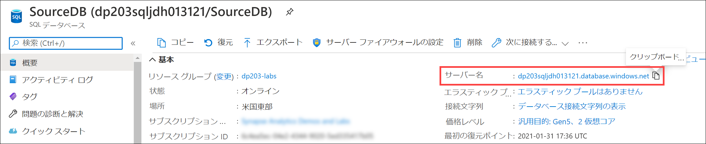

4. Azure Data Studio を開きます。

5. 左側のメニューで 「**サーバー**」 を選択し、「**接続の追加**」 をクリックします。

    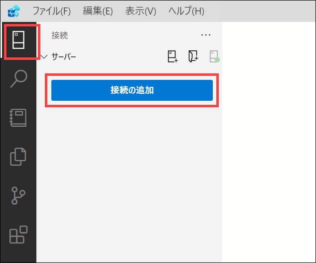

6. 「接続の詳細」 フォームで以下の情報を入力します。

    - **サーバー**: SourceDB のサーバー名の値を貼り付けます。
    - **認証タイプ**: `SQL Login` を選択します。
    - **ユーザー名**: `sqladmin` と入力します。
    - **パスワード**: ラボ環境をデプロイした際に使用したパスワードを入力します。
    - **パスワードを記憶する**: チェックします。
    - **データベース**: `SourceDB` を選択します。

    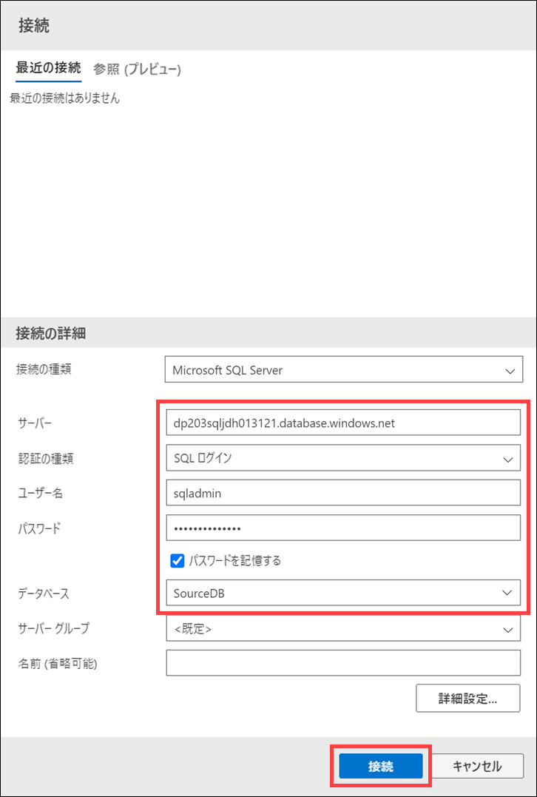

7. 「**接続**」 を選択します。

8. 左側のメニューで 「**サーバー**」 を選択してから、ラボの最初で追加した SQL サーバーを右クリックします。「**新しいクエリ**」 を選択します。

    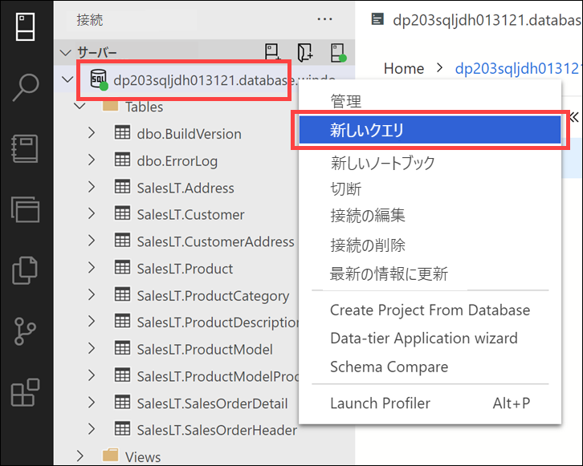

9. 以下をクエリ ウィンドウに貼り付けて、ディメンションおよびファクト　テーブルを作成します。

    ```sql
    CREATE TABLE [dbo].[DimReseller](
        [ResellerKey] [int] IDENTITY(1,1) NOT NULL,
        [GeographyKey] [int] NULL,
        [ResellerAlternateKey] [nvarchar](15) NULL,
        [Phone] [nvarchar](25) NULL,
        [BusinessType] [varchar](20) NOT NULL,
        [ResellerName] [nvarchar](50) NOT NULL,
        [NumberEmployees] [int] NULL,
        [OrderFrequency] [char](1) NULL,
        [OrderMonth] [tinyint] NULL,
        [FirstOrderYear] [int] NULL,
        [LastOrderYear] [int] NULL,
        [ProductLine] [nvarchar](50) NULL,
        [AddressLine1] [nvarchar](60) NULL,
        [AddressLine2] [nvarchar](60) NULL,
        [AnnualSales] [money] NULL,
        [BankName] [nvarchar](50) NULL,
        [MinPaymentType] [tinyint] NULL,
        [MinPaymentAmount] [money] NULL,
        [AnnualRevenue] [money] NULL,
        [YearOpened] [int] NULL
    );
    GO

    CREATE TABLE [dbo].[DimEmployee](
        [EmployeeKey] [int] IDENTITY(1,1) NOT NULL,
        [ParentEmployeeKey] [int] NULL,
        [EmployeeNationalIDAlternateKey] [nvarchar](15) NULL,
        [ParentEmployeeNationalIDAlternateKey] [nvarchar](15) NULL,
        [SalesTerritoryKey] [int] NULL,
        [FirstName] [nvarchar](50) NOT NULL,
        [LastName] [nvarchar](50) NOT NULL,
        [MiddleName] [nvarchar](50) NULL,
        [NameStyle] [bit] NOT NULL,
        [Title] [nvarchar](50) NULL,
        [HireDate] [date] NULL,
        [BirthDate] [date] NULL,
        [LoginID] [nvarchar](256) NULL,
        [EmailAddress] [nvarchar](50) NULL,
        [Phone] [nvarchar](25) NULL,
        [MaritalStatus] [nchar](1) NULL,
        [EmergencyContactName] [nvarchar](50) NULL,
        [EmergencyContactPhone] [nvarchar](25) NULL,
        [SalariedFlag] [bit] NULL,
        [Gender] [nchar](1) NULL,
        [PayFrequency] [tinyint] NULL,
        [BaseRate] [money] NULL,
        [VacationHours] [smallint] NULL,
        [SickLeaveHours] [smallint] NULL,
        [CurrentFlag] [bit] NOT NULL,
        [SalesPersonFlag] [bit] NOT NULL,
        [DepartmentName] [nvarchar](50) NULL,
        [StartDate] [date] NULL,
        [EndDate] [date] NULL,
        [Status] [nvarchar](50) NULL,
	    [EmployeePhoto] [varbinary](max) NULL
    );
    GO

    CREATE TABLE [dbo].[DimProduct](
        [ProductKey] [int] IDENTITY(1,1) NOT NULL,
        [ProductAlternateKey] [nvarchar](25) NULL,
        [ProductSubcategoryKey] [int] NULL,
        [WeightUnitMeasureCode] [nchar](3) NULL,
        [SizeUnitMeasureCode] [nchar](3) NULL,
        [EnglishProductName] [nvarchar](50) NOT NULL,
        [SpanishProductName] [nvarchar](50) NOT NULL,
        [FrenchProductName] [nvarchar](50) NOT NULL,
        [StandardCost] [money] NULL,
        [FinishedGoodsFlag] [bit] NOT NULL,
        [Color] [nvarchar](15) NOT NULL,
        [SafetyStockLevel] [smallint] NULL,
        [ReorderPoint] [smallint] NULL,
        [ListPrice] [money] NULL,
        [Size] [nvarchar](50) NULL,
        [SizeRange] [nvarchar](50) NULL,
        [Weight] [float] NULL,
        [DaysToManufacture] [int] NULL,
        [ProductLine] [nchar](2) NULL,
        [DealerPrice] [money] NULL,
        [Class] [nchar](2) NULL,
        [Style] [nchar](2) NULL,
        [ModelName] [nvarchar](50) NULL,
        [LargePhoto] [varbinary](max) NULL,
        [EnglishDescription] [nvarchar](400) NULL,
        [FrenchDescription] [nvarchar](400) NULL,
        [ChineseDescription] [nvarchar](400) NULL,
        [ArabicDescription] [nvarchar](400) NULL,
        [HebrewDescription] [nvarchar](400) NULL,
        [ThaiDescription] [nvarchar](400) NULL,
        [GermanDescription] [nvarchar](400) NULL,
        [JapaneseDescription] [nvarchar](400) NULL,
        [TurkishDescription] [nvarchar](400) NULL,
        [StartDate] [datetime] NULL,
        [EndDate] [datetime] NULL,
        [Status] [nvarchar](7) NULL
    );
    GO

    CREATE TABLE [dbo].[FactResellerSales](
        [ProductKey] [int] NOT NULL,
        [OrderDateKey] [int] NOT NULL,
        [DueDateKey] [int] NOT NULL,
        [ShipDateKey] [int] NOT NULL,
        [ResellerKey] [int] NOT NULL,
        [EmployeeKey] [int] NOT NULL,
        [PromotionKey] [int] NOT NULL,
        [CurrencyKey] [int] NOT NULL,
        [SalesTerritoryKey] [int] NOT NULL,
        [SalesOrderNumber] [nvarchar](20) NOT NULL,
        [SalesOrderLineNumber] [tinyint] NOT NULL,
        [RevisionNumber] [tinyint] NULL,
        [OrderQuantity] [smallint] NULL,
        [UnitPrice] [money] NULL,
        [ExtendedAmount] [money] NULL,
        [UnitPriceDiscountPct] [float] NULL,
        [DiscountAmount] [float] NULL,
        [ProductStandardCost] [money] NULL,
        [TotalProductCost] [money] NULL,
        [SalesAmount] [money] NULL,
        [TaxAmt] [money] NULL,
        [Freight] [money] NULL,
        [CarrierTrackingNumber] [nvarchar](25) NULL,
        [CustomerPONumber] [nvarchar](25) NULL,
        [OrderDate] [datetime] NULL,
        [DueDate] [datetime] NULL,
        [ShipDate] [datetime] NULL
    );
    GO
    ```

10. [**実行**」 を選択するか、`F5` を押してクエリを実行します。

    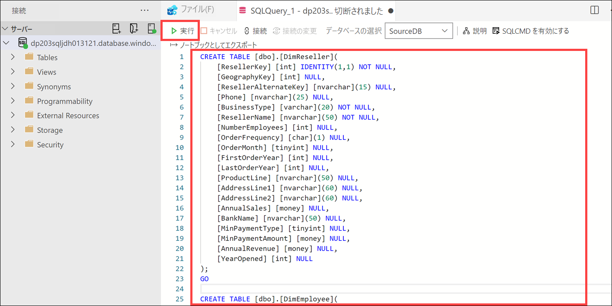

    これで 3 つのディメンション テーブルと 1 つのファクト テーブルができました。これらのテーブルは連携してスター スキーマを表します。

    

    ただし、SQL データベースを使用しているため、外部キーのリレーションシップと制約を追加し、リレーションシップを定義してテーブルの値を強制できます。

11. クエリを以下に置き換えて**実行**すると、`DimReseller` 主キーと制約が作成されます。

    ```sql
    -- Create DimReseller PK
    ALTER TABLE [dbo].[DimReseller] WITH CHECK ADD 
        CONSTRAINT [PK_DimReseller_ResellerKey] PRIMARY KEY CLUSTERED 
        (
            [ResellerKey]
        )  ON [PRIMARY];
    GO

    -- Create DimReseller unique constraint
    ALTER TABLE [dbo].[DimReseller] ADD CONSTRAINT [AK_DimReseller_ResellerAlternateKey] UNIQUE NONCLUSTERED 
    (
        [ResellerAlternateKey] ASC
    )WITH (PAD_INDEX = OFF, STATISTICS_NORECOMPUTE = OFF, SORT_IN_TEMPDB = OFF, IGNORE_DUP_KEY = OFF, ONLINE = OFF, ALLOW_ROW_LOCKS = ON, ALLOW_PAGE_LOCKS = ON)
    GO
    ```

12. クエリをいかに置き換えて**実行**すると、`DimEmployee` プライマリー キーが作成されます。

    ```sql
    -- Create DimEmployee PK
    ALTER TABLE [dbo].[DimEmployee] WITH CHECK ADD 
        CONSTRAINT [PK_DimEmployee_EmployeeKey] PRIMARY KEY CLUSTERED 
        (
        [EmployeeKey]
        )  ON [PRIMARY];
    GO
    ```

13. クエリを以下に置き換えて**実行**すると、`DimProduct` 主キーと制約が作成されます。

    ```sql
    -- Create DimProduct PK
    ALTER TABLE [dbo].[DimProduct] WITH CHECK ADD 
        CONSTRAINT [PK_DimProduct_ProductKey] PRIMARY KEY CLUSTERED 
        (
            [ProductKey]
        )  ON [PRIMARY];
    GO

    -- Create DimProduct unique constraint
    ALTER TABLE [dbo].[DimProduct] ADD CONSTRAINT [AK_DimProduct_ProductAlternateKey_StartDate] UNIQUE NONCLUSTERED 
    (
        [ProductAlternateKey] ASC,
        [StartDate] ASC
    )WITH (PAD_INDEX = OFF, STATISTICS_NORECOMPUTE = OFF, SORT_IN_TEMPDB = OFF, IGNORE_DUP_KEY = OFF, ONLINE = OFF, ALLOW_ROW_LOCKS = ON, ALLOW_PAGE_LOCKS = ON)
    GO
    ```

    > これでファクト テーブルとディメンション テーブルのリレーションシップを作成し、スター スキーマを明確に定義できます。

14. クエリを以下に置き換えて**実行**すると、`FactResellerSales` 主キーと外部キーのリレーションシップが作成されます。

    ```sql
    -- Create FactResellerSales PK
    ALTER TABLE [dbo].[FactResellerSales] WITH CHECK ADD 
        CONSTRAINT [PK_FactResellerSales_SalesOrderNumber_SalesOrderLineNumber] PRIMARY KEY CLUSTERED 
        (
            [SalesOrderNumber], [SalesOrderLineNumber]
        )  ON [PRIMARY];
    GO

    -- Create foreign key relationships to the dimension tables
    ALTER TABLE [dbo].[FactResellerSales] ADD
        CONSTRAINT [FK_FactResellerSales_DimEmployee] FOREIGN KEY([EmployeeKey])
                REFERENCES [dbo].[DimEmployee] ([EmployeeKey]),
        CONSTRAINT [FK_FactResellerSales_DimProduct] FOREIGN KEY([ProductKey])
                REFERENCES [dbo].[DimProduct] ([ProductKey]),
        CONSTRAINT [FK_FactResellerSales_DimReseller] FOREIGN KEY([ResellerKey])
                REFERENCES [dbo].[DimReseller] ([ResellerKey]);
    GO
    ```

    スター スキーマで、ファクト テーブルとディメンション テー物のリレーションシップが定義されました。SQL Server Management Studio のようなツールを使用して、これらのテーブルを図で示すと、リレーションシップがよくわかります。

    

### 演習 2: スノーフレーク スキーマを実装する

**スノーフレーク スキーマ**は、単一のビジネス エンティティ向けに正規化されたテーブルのセットです。たとえば、Adventure Works 社はカテゴリとサブカテゴリを使用して製品を分類しています。カテゴリはサブカテゴリに割り当てられ、製品が順番にサブカテゴリに割り当てられます。Adventure Works のリレーショナル　データ ウェアハウスでは、製品ディメンションが正規化され、関連のある 3 つのテーブルに格納されています。`DimProductCategory`、`DimProductSubcategory`、`DimProduct` です。

スノーフレーク スキーマはスター スキーマの変化形です。正規化されたディメンション テーブルをスター スキーマに追加すると、スノーフレークのパターンができあがります。次のズでは、黄色いディメンション テーブルが青いファクト テーブルに囲まれています。ビジネス エンティティを正規化するため、ディメンション テーブルの多くは相互に関係がある点に留意してください。


#### タスク 1: SQL データベースで製品のスノーフレーク スキーマを作成する

このタスクでは、2 つの新しいディメンション テーブルを追加します。`DimProductCategory` と `DimProductSubcategory` です。この 2 つのテーブルと `DimProduct` テーブルのリレーションシップを作成して、スノーフレーク ディメンションと呼ばれる正規化された製品ディメンションを作成します。これにより、スター スキーマが更新され、正規化された製品ディメンションが含まれるようになり、スノーフレーク スキーマに変わります。

1. Azure Data Explorer を開きます。

2. 左側のメニューで 「**サーバー**」 を選択してから、ラボの最初で追加した SQL サーバーを右クリックします。「**新しいクエリ**」 を選択します。

    

3. 以下をクエリ ウィンドウに貼り付けて**実行**し、新しいディメンション テーブルを作成します。

    ```sql
    CREATE TABLE [dbo].[DimProductCategory](
        [ProductCategoryKey] [int] IDENTITY(1,1) NOT NULL,
        [ProductCategoryAlternateKey] [int] NULL,
        [EnglishProductCategoryName] [nvarchar](50) NOT NULL,
        [SpanishProductCategoryName] [nvarchar](50) NOT NULL,
        [FrenchProductCategoryName] [nvarchar](50) NOT NULL
    );
    GO

    CREATE TABLE [dbo].[DimProductSubcategory](
        [ProductSubcategoryKey] [int] IDENTITY(1,1) NOT NULL,
        [ProductSubcategoryAlternateKey] [int] NULL,
        [EnglishProductSubcategoryName] [nvarchar](50) NOT NULL,
        [SpanishProductSubcategoryName] [nvarchar](50) NOT NULL,
        [FrenchProductSubcategoryName] [nvarchar](50) NOT NULL,
        [ProductCategoryKey] [int] NULL
    );
    GO
    ```

4. クエリを以下に置き換えて**実行**すると、`DimProductCategory` と `DimProductSubcategory` の主キーと制約が作成されます。

    ```sql
    -- Create DimProductCategory PK
    ALTER TABLE [dbo].[DimProductCategory] WITH CHECK ADD 
        CONSTRAINT [PK_DimProductCategory_ProductCategoryKey] PRIMARY KEY CLUSTERED 
        (
            [ProductCategoryKey]
        )  ON [PRIMARY];
    GO

    -- Create DimProductSubcategory PK
    ALTER TABLE [dbo].[DimProductSubcategory] WITH CHECK ADD 
        CONSTRAINT [PK_DimProductSubcategory_ProductSubcategoryKey] PRIMARY KEY CLUSTERED 
        (
            [ProductSubcategoryKey]
        )  ON [PRIMARY];
    GO

    -- Create DimProductCategory unique constraint
    ALTER TABLE [dbo].[DimProductCategory] ADD CONSTRAINT [AK_DimProductCategory_ProductCategoryAlternateKey] UNIQUE NONCLUSTERED 
    (
        [ProductCategoryAlternateKey] ASC
    )WITH (PAD_INDEX = OFF, STATISTICS_NORECOMPUTE = OFF, SORT_IN_TEMPDB = OFF, IGNORE_DUP_KEY = OFF, ONLINE = OFF, ALLOW_ROW_LOCKS = ON, ALLOW_PAGE_LOCKS = ON)
    GO

    -- Create DimProductSubcategory unique constraint
    ALTER TABLE [dbo].[DimProductSubcategory] ADD CONSTRAINT [AK_DimProductSubcategory_ProductSubcategoryAlternateKey] UNIQUE NONCLUSTERED 
    (
        [ProductSubcategoryAlternateKey] ASC
    )WITH (PAD_INDEX = OFF, STATISTICS_NORECOMPUTE = OFF, SORT_IN_TEMPDB = OFF, IGNORE_DUP_KEY = OFF, ONLINE = OFF, ALLOW_ROW_LOCKS = ON, ALLOW_PAGE_LOCKS = ON)
    GO
    ```

5. クエリを以下に置き換えて**実行**すると、`DimProduct` と `DimProductSubcategory` の間、および `DimProductSubcategory` と `DimProductCategory` の間の外部キー リレーションシップが作成されます。

    ```sql
    -- Create foreign key relationship between DimProduct and DimProductSubcategory
    ALTER TABLE [dbo].[DimProduct] ADD 
        CONSTRAINT [FK_DimProduct_DimProductSubcategory] FOREIGN KEY 
        (
            [ProductSubcategoryKey]
        ) REFERENCES [dbo].[DimProductSubcategory] ([ProductSubcategoryKey]);
    GO

    -- Create foreign key relationship between DimProductSubcategory and DimProductCategory
    ALTER TABLE [dbo].[DimProductSubcategory] ADD 
        CONSTRAINT [FK_DimProductSubcategory_DimProductCategory] FOREIGN KEY 
        (
            [ProductCategoryKey]
        ) REFERENCES [dbo].[DimProductCategory] ([ProductCategoryKey]);
    GO
    ```

    3 つの製品テーブルを単一のビジネス エンティティまたは製品ディメンションに正規化することで、スノーフレーク　ディメンションを作成しました。

    

    この図に他のテーブルを追加すると、製品テーブルを正規化することによってスター スキーマがスノーフレーク スキーマに変換したことがわかります。SQL Server Management Studio のようなツールを使用して、これらのテーブルを図で示すと、リレーションシップがよくわかります。

    

#### タスク 2: SQL データベースで再販業者のスノーフレーク スキーマを作成する

このタスクでは、2 つの新しいディメンション テーブルを追加します。`DimCustomer` と `DimGeography` です。この 2 つのテーブルと `DimReseller` テーブルのリレーションシップを作成して、正規化されたリセラーディメンション、またはスノーフレーク ディメンションを作成します。

1. 以下をクエリ ウィンドウに貼り付けて**実行**し、新しいディメンション テーブルを作成します。

    ```sql
    CREATE TABLE [dbo].[DimCustomer](
        [CustomerKey] [int] IDENTITY(1,1) NOT NULL,
        [GeographyKey] [int] NULL,
        [CustomerAlternateKey] [nvarchar](15) NOT NULL,
        [Title] [nvarchar](8) NULL,
        [FirstName] [nvarchar](50) NULL,
        [MiddleName] [nvarchar](50) NULL,
        [LastName] [nvarchar](50) NULL,
        [NameStyle] [bit] NULL,
        [BirthDate] [date] NULL,
        [MaritalStatus] [nchar](1) NULL,
        [Suffix] [nvarchar](10) NULL,
        [Gender] [nvarchar](1) NULL,
        [EmailAddress] [nvarchar](50) NULL,
        [YearlyIncome] [money] NULL,
        [TotalChildren] [tinyint] NULL,
        [NumberChildrenAtHome] [tinyint] NULL,
        [EnglishEducation] [nvarchar](40) NULL,
        [SpanishEducation] [nvarchar](40) NULL,
        [FrenchEducation] [nvarchar](40) NULL,
        [EnglishOccupation] [nvarchar](100) NULL,
        [SpanishOccupation] [nvarchar](100) NULL,
        [FrenchOccupation] [nvarchar](100) NULL,
        [HouseOwnerFlag] [nchar](1) NULL,
        [NumberCarsOwned] [tinyint] NULL,
        [AddressLine1] [nvarchar](120) NULL,
        [AddressLine2] [nvarchar](120) NULL,
        [Phone] [nvarchar](20) NULL,
        [DateFirstPurchase] [date] NULL,
        [CommuteDistance] [nvarchar](15) NULL
    );
    GO

    CREATE TABLE [dbo].[DimGeography](
        [GeographyKey] [int] IDENTITY(1,1) NOT NULL,
        [City] [nvarchar](30) NULL,
        [StateProvinceCode] [nvarchar](3) NULL,
        [StateProvinceName] [nvarchar](50) NULL,
        [CountryRegionCode] [nvarchar](3) NULL,
        [EnglishCountryRegionName] [nvarchar](50) NULL,
        [SpanishCountryRegionName] [nvarchar](50) NULL,
        [FrenchCountryRegionName] [nvarchar](50) NULL,
        [PostalCode] [nvarchar](15) NULL,
        [SalesTerritoryKey] [int] NULL,
        [IpAddressLocator] [nvarchar](15) NULL
    );
    GO
    ```

2. クエリを以下に置き換えて**実行**し、`DimCustomer` と `DimGeography` の主キーおよび一意の非クラスター化インデックスを `DimCustomer` テーブルで作成します。

    ```sql
    -- Create DimCustomer PK
    ALTER TABLE [dbo].[DimCustomer] WITH CHECK ADD 
        CONSTRAINT [PK_DimCustomer_CustomerKey] PRIMARY KEY CLUSTERED
        (
            [CustomerKey]
        )  ON [PRIMARY];
    GO

    -- Create DimGeography PK
    ALTER TABLE [dbo].[DimGeography] WITH CHECK ADD 
        CONSTRAINT [PK_DimGeography_GeographyKey] PRIMARY KEY CLUSTERED 
        (
        [GeographyKey]
        )  ON [PRIMARY];
    GO

    -- Create DimCustomer index
    CREATE UNIQUE NONCLUSTERED INDEX [IX_DimCustomer_CustomerAlternateKey] ON [dbo].[DimCustomer]([CustomerAlternateKey]) ON [PRIMARY];
    GO
    ```

3. クエリを以下に置き換えて**実行**すると、`DimReseller` と `DimGeography` の間、および `DimGeography` と `DimCustomer` の間で外部キー リレーションシップが作成されます。

    ```sql
    -- Create foreign key relationship between DimReseller and DimGeography
    ALTER TABLE [dbo].[DimReseller] ADD
        CONSTRAINT [FK_DimReseller_DimGeography] FOREIGN KEY
        (
            [GeographyKey]
        ) REFERENCES [dbo].[DimGeography] ([GeographyKey]);
    GO

    -- Create foreign key relationship between DimCustomer and DimGeography
    ALTER TABLE [dbo].[DimCustomer] ADD
        CONSTRAINT [FK_DimCustomer_DimGeography] FOREIGN KEY
        (
            [GeographyKey]
        )
        REFERENCES [dbo].[DimGeography] ([GeographyKey])
    GO
    ```

    これで、リセラー データを地理および顧客ディメンションで正規化する新しいスノーフレーク ディメンションができました。

    

    それでは、これらの新しいテーブルがどのようにして別のレベルの詳細をスノーフレーク スキーマに追加するのか見てみましょう。

    

### 演習 3: 時間ディメンション テーブルを実装する

時間ディメンション テーブルは、最も頻繁に使用されているディメンション テーブルのひとつです。このタイプのテーブルでは、一時的な分析と報告で粒度を一貫させることができ、通常は、`Year` > `Quarter` > `Month` > `Day` といった一時的な階層が含まれています。

時間ディメンション テー部にはビジネス固有の属性が含まれており、報告やフィルターの参照情報として役に立ちます (会計期間や公休日など)。

これから作成する時間ディメンション テーブルのスキーマは以下のとおりです。

| 列 | データ型 |
| --- | --- |
| DateKey | `int` |
| DateAltKey | `datetime` |
| CalendarYear | `int` |
| CalendarQuarter | `int` |
| MonthOfYear | `int` |
| MonthName | `nvarchar(15)` |
| DayOfMonth | `int` |
| DayOfWeek | `int` |
| DayName | `nvarchar(15)` |
| FiscalYear | `int` |
| FiscalQuarter | `int` |

#### タスク 1: 時間ディメンション テーブルを作成する

このタスクでは、時間ディメンション テーブルを追加して、`FactRetailerSales` テーブルへの外部キー リレーションシップを作成します。

1. 以下をクエリ ウィンドウに貼り付けて**実行**し、新しい時間ディメンション テーブルを作成します。

    ```sql
    CREATE TABLE DimDate
        (DateKey int NOT NULL,
        DateAltKey datetime NOT NULL,
        CalendarYear int NOT NULL,
        CalendarQuarter int NOT NULL,
        MonthOfYear int NOT NULL,
        [MonthName] nvarchar(15) NOT NULL,
        [DayOfMonth] int NOT NULL,
        [DayOfWeek] int NOT NULL,
        [DayName] nvarchar(15) NOT NULL,
        FiscalYear int NOT NULL,
        FiscalQuarter int NOT NULL)
    GO
    ```

2. クエリを以下に置き換えて**実行**し、 `DimCustomer` テーブルで主キーと一意の非クラスター化インデックスを作成します。

    ```sql
    -- Create DimDate PK
    ALTER TABLE [dbo].[DimDate] WITH CHECK ADD 
        CONSTRAINT [PK_DimDate_DateKey] PRIMARY KEY CLUSTERED 
        (
            [DateKey]
        )  ON [PRIMARY];
    GO

    -- Create unique non-clustered index
    CREATE UNIQUE NONCLUSTERED INDEX [AK_DimDate_DateAltKey] ON [dbo].[DimDate]([DateAltKey]) ON [PRIMARY];
    GO
    ```

3. クエリを以下に置き換えて**実行**すると、`FactRetailerSales` と `DimDate` の間で外部キー リレーションシップが作成されます。

    ```sql
    ALTER TABLE [dbo].[FactResellerSales] ADD
        CONSTRAINT [FK_FactResellerSales_DimDate] FOREIGN KEY([OrderDateKey])
                REFERENCES [dbo].[DimDate] ([DateKey]),
        CONSTRAINT [FK_FactResellerSales_DimDate1] FOREIGN KEY([DueDateKey])
                REFERENCES [dbo].[DimDate] ([DateKey]),
        CONSTRAINT [FK_FactResellerSales_DimDate2] FOREIGN KEY([ShipDateKey])
                REFERENCES [dbo].[DimDate] ([DateKey]);
    GO
    ```

    > 3 つのテーブルが `DimDate` テーブルの主キーをどのように参照しているのかに留意してください。

    これでスノーフレーク スキーマが更新され、時間ディメンション テーブルが含まれるようになりました。

    

#### タスク 2: 時間ディメンション テーブルにデータを読み込む

時間ディメンション テーブルにデータを読み込む方法は多々あります。日時の関数を使用した T-SQL スクリプト、Microsoft Excel 関数、フラット ファイルからのインポート、BI (ビジネス インテリジェンス) ツールによる自動生成などです。このタスクでは、T-SQL を使用して時間ディメンション テーブルにデータを読み込み、その間に生成方法を比較します。

1. 以下をクエリ ウィンドウに貼り付けて**実行**し、新しい時間ディメンション テーブルを作成します。

    ```sql
    DECLARE @StartDate datetime
    DECLARE @EndDate datetime
    SET @StartDate = '01/01/2005'
    SET @EndDate = getdate() 
    DECLARE @LoopDate datetime
    SET @LoopDate = @StartDate
    WHILE @LoopDate <= @EndDate
    BEGIN
    INSERT INTO dbo.DimDate VALUES
        (
            CAST(CONVERT(VARCHAR(8), @LoopDate, 112) AS int) , -- date key
            @LoopDate, -- date alt key
            Year(@LoopDate), -- calendar year
            datepart(qq, @LoopDate), -- calendar quarter
            Month(@LoopDate), -- month number of year
            datename(mm, @LoopDate), -- month name
            Day(@LoopDate), -- day number of month
            datepart(dw, @LoopDate), -- day number of week
            datename(dw, @LoopDate), -- day name of week
            CASE
                WHEN Month(@LoopDate) < 7 THEN Year(@LoopDate)
                ELSE Year(@Loopdate) + 1
            END, -- Fiscal year (assuming fiscal year runs from Jul to June)
            CASE
                WHEN Month(@LoopDate) IN (1, 2, 3) THEN 3
                WHEN Month(@LoopDate) IN (4, 5, 6) THEN 4
                WHEN Month(@LoopDate) IN (7, 8, 9) THEN 1
                WHEN Month(@LoopDate) IN (10, 11, 12) THEN 2
            END -- fiscal quarter 
        )  		  
        SET @LoopDate = DateAdd(dd, 1, @LoopDate)
    END
    ```

    > 現在の環境では、生成された行が挿入されるまでに **18 秒**ほどかかりました。

    このクエリは、2005 年 1 月 1 日の開始日から現在の日付までループされ、値を計算して毎日、テーブルに挿入されます。

2. クエリを以下に置き換えて**実行**すると、時間ディメンション テーブルのデータが表示されます。

    ```sql
    SELECT * FROM dbo.DimDate
    ```

    以下のような出力が表示されるはずです。

    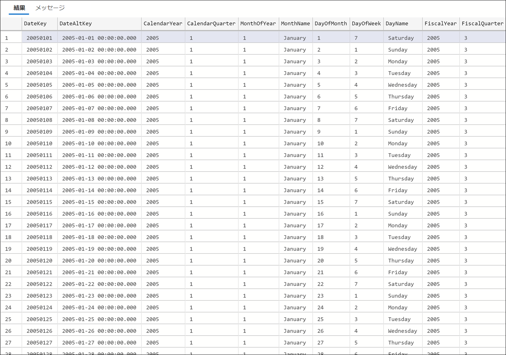

3. 日付をループしてテーブルにデータを読み込む方法は他にもあります。今回は、開始日と終了日を両方とも設定します。クエリを以下に置き換えて**実行**すると、特定の期間内 (1900 年 1 月 1 日から 2050 年 12 月 31 日) で日付がループされ、出力が表示されます。

    ```sql
    DECLARE @BeginDate datetime
    DECLARE @EndDate datetime

    SET @BeginDate = '1/1/1900'
    SET @EndDate = '12/31/2050'

    CREATE TABLE #Dates ([date] datetime)

    WHILE @BeginDate <= @EndDate
    BEGIN
    INSERT #Dates
    VALUES
    (@BeginDate)

    SET @BeginDate = @BeginDate + 1
    END
    SELECT * FROM #Dates
    DROP TABLE #Dates
    ```

    > 現在の環境では、生成された行が挿入されるまでに **4 秒**ほどかかりました。

    このメソッドはうまく機能するのですが、クリーアップが多大で、実行に時間がかかる上、他のフィールドでの追加を考慮するとコードも多くなります。また、ループを使用していますが、これは T-SQL を使用してデータを挿入する際のベスト プラクティスとはみなされていません。

4. クエリを以下に置き換えて**実行**すると、前のメソッドを [CTE](https://docs.microsoft.com/sql/t-sql/queries/with-common-table-expression-transact-sql?view=sql-server-ver15) (共通テーブル式) ステートメントで改善できます。

    ```sql
    WITH mycte AS
    (
        SELECT cast('1900-01-01' as datetime) DateValue
        UNION ALL
        SELECT DateValue + 1
        FROM mycte 
        WHERE DateValue + 1 < '2050-12-31'
    )

    SELECT DateValue
    FROM mycte
    OPTION (MAXRECURSION 0)
    ```

    > 現在の環境では、CTE クエリの実行にかかったのは **1 秒未満**でした。

#### タスク 3: 他のテーブルにデータを読み込む

このタスクでは、公共データ ソースからのデータを使用してディメンション テーブルとファクト テーブルを読み込みます。

1. 以下をクエリ ウィンドウに貼り付けて**実行**すると、マスター キー暗号化、データベース スコープ資格情報、ソース データが含まれている公共 BLOB ストレージ アカウントにアクセスするデータ ソースが作成されます。

    ```sql
    IF NOT EXISTS (SELECT * FROM sys.symmetric_keys) BEGIN
        declare @pasword nvarchar(400) = CAST(newid() as VARCHAR(400));
        EXEC('CREATE MASTER KEY ENCRYPTION BY PASSWORD = ''' + @pasword + '''')
    END

    CREATE DATABASE SCOPED CREDENTIAL [dataengineering]
    WITH IDENTITY='SHARED ACCESS SIGNATURE',  
    SECRET = 'sv=2019-10-10&st=2021-02-01T01%3A23%3A35Z&se=2030-02-02T01%3A23%3A00Z&sr=c&sp=rl&sig=HuizuG29h8FOrEJwIsCm5wfPFc16N1Z2K3IPVoOrrhM%3D'
    GO

    -- Create external data source secured using credential
    CREATE EXTERNAL DATA SOURCE PublicDataSource WITH (
        TYPE = BLOB_STORAGE,
        LOCATION = 'https://solliancepublicdata.blob.core.windows.net/dataengineering',
        CREDENTIAL = dataengineering
    );
    GO
    ```

2. クエリを以下に置き換えて**実行**すると、データがファクト テーブルとディメンション テーブルに挿入されます。

    ```sql
    BULK INSERT[dbo].[DimGeography] FROM 'dp-203/awdata/DimGeography.csv'
    WITH (
        DATA_SOURCE='PublicDataSource',
        CHECK_CONSTRAINTS,
        DATAFILETYPE='widechar',
        FIELDTERMINATOR='|',
        ROWTERMINATOR='\n',
        KEEPIDENTITY,
        TABLOCK
    );
    GO

    BULK INSERT[dbo].[DimCustomer] FROM 'dp-203/awdata/DimCustomer.csv'
    WITH (
        DATA_SOURCE='PublicDataSource',
        CHECK_CONSTRAINTS,
        DATAFILETYPE='widechar',
        FIELDTERMINATOR='|',
        ROWTERMINATOR='\n',
        KEEPIDENTITY,
        TABLOCK
    );
    GO

    BULK INSERT[dbo].[DimReseller] FROM 'dp-203/awdata/DimReseller.csv'
    WITH (
        DATA_SOURCE='PublicDataSource',
        CHECK_CONSTRAINTS,
        DATAFILETYPE='widechar',
        FIELDTERMINATOR='|',
        ROWTERMINATOR='\n',
        KEEPIDENTITY,
        TABLOCK
    );
    GO

    BULK INSERT[dbo].[DimEmployee] FROM 'dp-203/awdata/DimEmployee.csv'
    WITH (
        DATA_SOURCE='PublicDataSource',
        CHECK_CONSTRAINTS,
        DATAFILETYPE='widechar',
        FIELDTERMINATOR='|',
        ROWTERMINATOR='\n',
        KEEPIDENTITY,
        TABLOCK
    );
    GO

    BULK INSERT[dbo].[DimProductCategory] FROM 'dp-203/awdata/DimProductCategory.csv'
    WITH (
        DATA_SOURCE='PublicDataSource',
        CHECK_CONSTRAINTS,
        DATAFILETYPE='widechar',
        FIELDTERMINATOR='|',
        ROWTERMINATOR='\n',
        KEEPIDENTITY,
        TABLOCK
    );
    GO

    BULK INSERT[dbo].[DimProductSubcategory] FROM 'dp-203/awdata/DimProductSubcategory.csv'
    WITH (
        DATA_SOURCE='PublicDataSource',
        CHECK_CONSTRAINTS,
        DATAFILETYPE='widechar',
        FIELDTERMINATOR='|',
        ROWTERMINATOR='\n',
        KEEPIDENTITY,
        TABLOCK
    );
    GO

    BULK INSERT[dbo].[DimProduct] FROM 'dp-203/awdata/DimProduct.csv'
    WITH (
        DATA_SOURCE='PublicDataSource',
        CHECK_CONSTRAINTS,
        DATAFILETYPE='widechar',
        FIELDTERMINATOR='|',
        ROWTERMINATOR='\n',
        KEEPIDENTITY,
        TABLOCK
    );
    GO

    BULK INSERT[dbo].[FactResellerSales] FROM 'dp-203/awdata/FactResellerSales.csv'
    WITH (
        DATA_SOURCE='PublicDataSource',
        CHECK_CONSTRAINTS,
        DATAFILETYPE='widechar',
        FIELDTERMINATOR='|',
        ROWTERMINATOR='\n',
        KEEPIDENTITY,
        TABLOCK
    );
    GO
    ```

#### タスク 4: データのクエリを実行する

1. 以下のクエリを貼り付けて**実行**すると、リセラー、製品、月の粒度でスノーフレーク スキーマからリセラーの売上データを取得できます。

    ```sql
    SELECT
            pc.[EnglishProductCategoryName]
            ,Coalesce(p.[ModelName], p.[EnglishProductName]) AS [Model]
            ,CASE
                WHEN e.[BaseRate] < 25 THEN 'Low'
                WHEN e.[BaseRate] > 40 THEN 'High'
                ELSE 'Moderate'
            END AS [EmployeeIncomeGroup]
            ,g.City AS ResellerCity
            ,g.StateProvinceName AS StateProvince
            ,r.[AnnualSales] AS ResellerAnnualSales
            ,d.[CalendarYear]
            ,d.[FiscalYear]
            ,d.[MonthOfYear] AS [Month]
            ,f.[SalesOrderNumber] AS [OrderNumber]
            ,f.SalesOrderLineNumber AS LineNumber
            ,f.OrderQuantity AS Quantity
            ,f.ExtendedAmount AS Amount  
        FROM
            [dbo].[FactResellerSales] f
        INNER JOIN [dbo].[DimReseller] r
            ON f.ResellerKey = r.ResellerKey
        INNER JOIN [dbo].[DimGeography] g
            ON r.GeographyKey = g.GeographyKey
        INNER JOIN [dbo].[DimEmployee] e
            ON f.EmployeeKey = e.EmployeeKey
        INNER JOIN [dbo].[DimDate] d
            ON f.[OrderDateKey] = d.[DateKey]
        INNER JOIN [dbo].[DimProduct] p
            ON f.[ProductKey] = p.[ProductKey]
        INNER JOIN [dbo].[DimProductSubcategory] psc
            ON p.[ProductSubcategoryKey] = psc.[ProductSubcategoryKey]
        INNER JOIN [dbo].[DimProductCategory] pc
            ON psc.[ProductCategoryKey] = pc.[ProductCategoryKey]
        ORDER BY Amount DESC
    ```

    次のような出力が表示されます。

    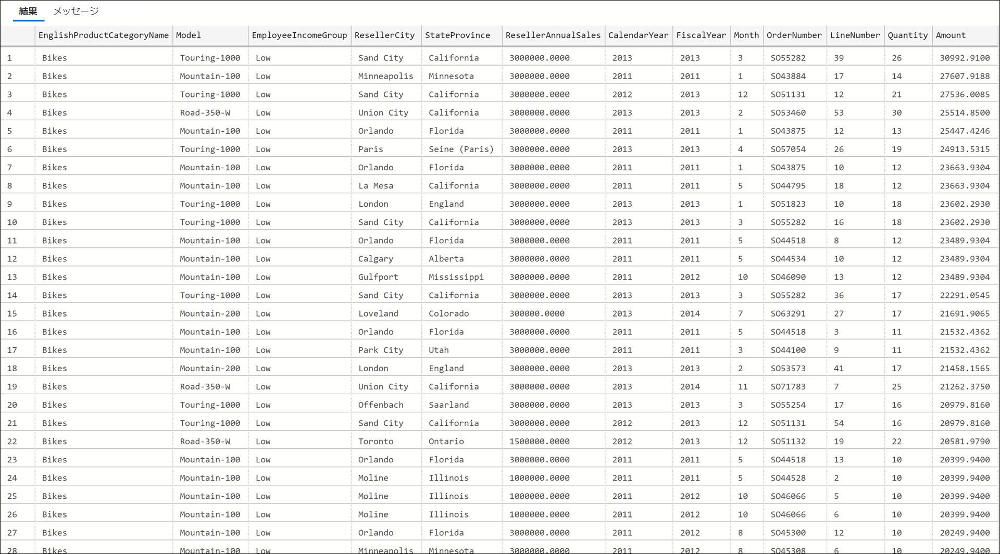

2. クエリを以下に置き換えて**実行**すると、結果が 2012 年と 2013 年の会計年度の 10 月に限定されます。

    ```sql
    SELECT
            pc.[EnglishProductCategoryName]
            ,Coalesce(p.[ModelName], p.[EnglishProductName]) AS [Model]
            ,CASE
                WHEN e.[BaseRate] < 25 THEN 'Low'
                WHEN e.[BaseRate] > 40 THEN 'High'
                ELSE 'Moderate'
            END AS [EmployeeIncomeGroup]
            ,g.City AS ResellerCity
            ,g.StateProvinceName AS StateProvince
            ,r.[AnnualSales] AS ResellerAnnualSales
            ,d.[CalendarYear]
            ,d.[FiscalYear]
            ,d.[MonthOfYear] AS [Month]
            ,f.[SalesOrderNumber] AS [OrderNumber]
            ,f.SalesOrderLineNumber AS LineNumber
            ,f.OrderQuantity AS Quantity
            ,f.ExtendedAmount AS Amount  
        FROM
            [dbo].[FactResellerSales] f
        INNER JOIN [dbo].[DimReseller] r
            ON f.ResellerKey = r.ResellerKey
        INNER JOIN [dbo].[DimGeography] g
            ON r.GeographyKey = g.GeographyKey
        INNER JOIN [dbo].[DimEmployee] e
            ON f.EmployeeKey = e.EmployeeKey
        INNER JOIN [dbo].[DimDate] d
            ON f.[OrderDateKey] = d.[DateKey]
        INNER JOIN [dbo].[DimProduct] p
            ON f.[ProductKey] = p.[ProductKey]
        INNER JOIN [dbo].[DimProductSubcategory] psc
            ON p.[ProductSubcategoryKey] = psc.[ProductSubcategoryKey]
        INNER JOIN [dbo].[DimProductCategory] pc
            ON psc.[ProductCategoryKey] = pc.[ProductCategoryKey]
        WHERE d.[MonthOfYear] = 10 AND d.[FiscalYear] IN (2012, 2013)
        ORDER BY d.[FiscalYear]
    ```

    次のような出力が表示されます。

    

    > **時間ディメンション テーブル**を使用すると、急いで日付関数を計算するよりも、特定の日付部分と日付検査 (会計年度など) によるフィルタリングが容易になり、パフォーマンスが向上します。

### 演習 4: Synapse Analytics でスター スキーマを実装する

日付セットが大きい場合は、SQL Server ではなく Azure Synapse でデータ ウェアハウスを実装できます。それでも、スター スキーマ モデルはまだ、Synapse 専用 SQL プールでのデータ モデリングのベスト プラクティスです。Synapse Analytics と SQL Database ではテーブルの作成方法が異なりますが、同じデータのモデリング原則が適用されます。

 Synapse でスター スキーマまたはスノーフレーク スキーマを作成する場合は、テーブル作成スクリプトを一部変更する必要があります。Synapse では、SQL Server のような外部キーや一意の値の制約はありません。このような規則はデータベース レイヤーでは適用されないため、データの整合性を維持するには、データを読み込むジョブがより重要になります。まだクラスター化インデックスを使用できますが、Synapse のほとんどのディメンション テーブルではクラスター化列ストア インデックス （CCI） を使用すると便利です。

Synapse Analytics は[超並列処理](https://docs.microsoft.com/azure/architecture/data-guide/relational-data/data-warehousing#data-warehousing-in-azure) (MPP) システムなので、Azure SQL Database を含む OLTP のような対称型マルチプロセッシング (SMP) システムに比べて、テーブルのデザインでどのようにデータが配分されているのか考慮する必要があります。テーブル カテゴリは、多くの場合、テーブルの分散について選択するオプションを決定します。

| テーブル カテゴリ | 推奨される分散オプション |
|:---------------|:--------------------|
| ファクト           | クラスター化列ストア インデックスによるハッシュ分散を使用します。2 つのハッシュ テーブルが同じディストリビューション列に結合される場合にパフォーマンスが向上します。 |
| 寸法      | 小さなテーブルにはレプリケートを使用します。各コンピューティング ノードに保存するにはテーブルが大きすぎる場合は、ハッシュ分散を使用します。 |
| ステージング        | ステージング テーブルにはラウンド ロビンを使用します。CTAS での読み込みが高速です。データがステージング テーブルに格納されたら、INSERT...SELECT を使用してデータを運用環境テーブルに移動します。 |

この演習のディメンション テーブルの場合、テーブルごとに格納されているデータの量は、レプリケートされる分散の使用基準内におさまります。

#### タスク 1: Synapse 専用 SQL でスター スキーマを作成する

このタスクでは、Azure Synapse 専用プールでスター スキーマを作成します。最初の手順は、ベース ディメンションとファクト　テーブルを作成することです。

1. Azure portal (<https://portal.azure.com>) にログインします。

2. このラボのリソース グループを開き、**Synapse ワークスペース**を選択します。

    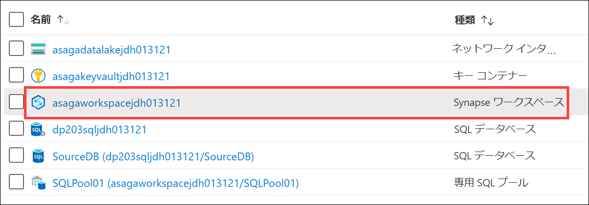

3. Synapse ワークスペースの概要ブレードの `Open Synapse Studio` でリンクを 「**開く**」 を選択します。

    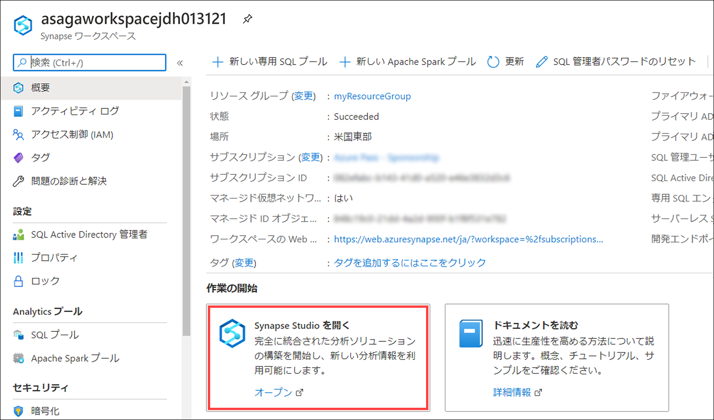

4. Synapse Studio で 「**データ**」 ハブに移動します。

    

5. 「**ワークスペース**」 タブ **(1)** を選択し、データベースを展開してから **SQLPool01 (2)** を右クリックします。「**新しい SQL スクリプト**」 (3) を選択してから 「**空のスクリプト**」 (4) を選択します。

    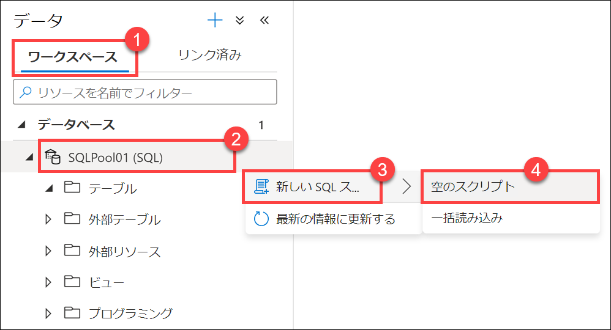

6. 以下のスクリプトを空のスクリプト ウィンドウに貼り付け、「**実行**」 を選択するか、`F5` を押してクエリを実行します。オリジナルの SQL スター スキーマ作成スクリプトに変更が加えられていることに気づくかもしれません。注意すべき変更がいくつかあります。
    - 分散設定が各テーブルに追加されている
    - クラスター化された列ストアのインデックスがほとんどのテーブルで使用されている。
    - HASH 関数がファクト テーブル分散で使用されている (より大きなテーブルで、ノード全体での分散が必要)。
    - いくつかのフィールドが、Azure Synapse のクラスター化列ストア インデックスに含めることのできない varbinary データ型を使用している。簡単なソリューションとして、クラスター化インデックスが使用されています。
    
    ```sql
    CREATE TABLE dbo.[DimCustomer](
        [CustomerID] [int] NOT NULL,
        [Title] [nvarchar](8) NULL,
        [FirstName] [nvarchar](50) NOT NULL,
        [MiddleName] [nvarchar](50) NULL,
        [LastName] [nvarchar](50) NOT NULL,
        [Suffix] [nvarchar](10) NULL,
        [CompanyName] [nvarchar](128) NULL,
        [SalesPerson] [nvarchar](256) NULL,
        [EmailAddress] [nvarchar](50) NULL,
        [Phone] [nvarchar](25) NULL,
        [InsertedDate] [datetime] NOT NULL,
        [ModifiedDate] [datetime] NOT NULL,
        [HashKey] [char](66)
    )
    WITH
    (
        DISTRIBUTION = REPLICATE,
        CLUSTERED COLUMNSTORE INDEX
    );
    GO
    
    CREATE TABLE [dbo].[FactResellerSales](
        [ProductKey] [int] NOT NULL,
        [OrderDateKey] [int] NOT NULL,
        [DueDateKey] [int] NOT NULL,
        [ShipDateKey] [int] NOT NULL,
        [ResellerKey] [int] NOT NULL,
        [EmployeeKey] [int] NOT NULL,
        [PromotionKey] [int] NOT NULL,
        [CurrencyKey] [int] NOT NULL,
        [SalesTerritoryKey] [int] NOT NULL,
        [SalesOrderNumber] [nvarchar](20) NOT NULL,
        [SalesOrderLineNumber] [tinyint] NOT NULL,
        [RevisionNumber] [tinyint] NULL,
        [OrderQuantity] [smallint] NULL,
        [UnitPrice] [money] NULL,
        [ExtendedAmount] [money] NULL,
        [UnitPriceDiscountPct] [float] NULL,
        [DiscountAmount] [float] NULL,
        [ProductStandardCost] [money] NULL,
        [TotalProductCost] [money] NULL,
        [SalesAmount] [money] NULL,
        [TaxAmt] [money] NULL,
        [Freight] [money] NULL,
        [CarrierTrackingNumber] [nvarchar](25) NULL,
        [CustomerPONumber] [nvarchar](25) NULL,
        [OrderDate] [datetime] NULL,
        [DueDate] [datetime] NULL,
        [ShipDate] [datetime] NULL
    )
    WITH
    (
        DISTRIBUTION = HASH([SalesOrderNumber]),
        CLUSTERED COLUMNSTORE INDEX
    );
    GO

    CREATE TABLE [dbo].[DimDate]
    ( 
        [DateKey] [int]  NOT NULL,
        [DateAltKey] [datetime]  NOT NULL,
        [CalendarYear] [int]  NOT NULL,
        [CalendarQuarter] [int]  NOT NULL,
        [MonthOfYear] [int]  NOT NULL,
        [MonthName] [nvarchar](15)  NOT NULL,
        [DayOfMonth] [int]  NOT NULL,
        [DayOfWeek] [int]  NOT NULL,
        [DayName] [nvarchar](15)  NOT NULL,
        [FiscalYear] [int]  NOT NULL,
        [FiscalQuarter] [int]  NOT NULL
    )
    WITH
    (
        DISTRIBUTION = REPLICATE,
        CLUSTERED COLUMNSTORE INDEX
    );
    GO

    CREATE TABLE [dbo].[DimReseller](
        [ResellerKey] [int] NOT NULL,
        [GeographyKey] [int] NULL,
        [ResellerAlternateKey] [nvarchar](15) NULL,
        [Phone] [nvarchar](25) NULL,
        [BusinessType] [varchar](20) NOT NULL,
        [ResellerName] [nvarchar](50) NOT NULL,
        [NumberEmployees] [int] NULL,
        [OrderFrequency] [char](1) NULL,
        [OrderMonth] [tinyint] NULL,
        [FirstOrderYear] [int] NULL,
        [LastOrderYear] [int] NULL,
        [ProductLine] [nvarchar](50) NULL,
        [AddressLine1] [nvarchar](60) NULL,
        [AddressLine2] [nvarchar](60) NULL,
        [AnnualSales] [money] NULL,
        [BankName] [nvarchar](50) NULL,
        [MinPaymentType] [tinyint] NULL,
        [MinPaymentAmount] [money] NULL,
        [AnnualRevenue] [money] NULL,
        [YearOpened] [int] NULL
    )
    WITH
    (
        DISTRIBUTION = REPLICATE,
        CLUSTERED COLUMNSTORE INDEX
    );
    GO
    
    CREATE TABLE [dbo].[DimEmployee](
        [EmployeeKey] [int] NOT NULL,
        [ParentEmployeeKey] [int] NULL,
        [EmployeeNationalIDAlternateKey] [nvarchar](15) NULL,
        [ParentEmployeeNationalIDAlternateKey] [nvarchar](15) NULL,
        [SalesTerritoryKey] [int] NULL,
        [FirstName] [nvarchar](50) NOT NULL,
        [LastName] [nvarchar](50) NOT NULL,
        [MiddleName] [nvarchar](50) NULL,
        [NameStyle] [bit] NOT NULL,
        [Title] [nvarchar](50) NULL,
        [HireDate] [date] NULL,
        [BirthDate] [date] NULL,
        [LoginID] [nvarchar](256) NULL,
        [EmailAddress] [nvarchar](50) NULL,
        [Phone] [nvarchar](25) NULL,
        [MaritalStatus] [nchar](1) NULL,
        [EmergencyContactName] [nvarchar](50) NULL,
        [EmergencyContactPhone] [nvarchar](25) NULL,
        [SalariedFlag] [bit] NULL,
        [Gender] [nchar](1) NULL,
        [PayFrequency] [tinyint] NULL,
        [BaseRate] [money] NULL,
        [VacationHours] [smallint] NULL,
        [SickLeaveHours] [smallint] NULL,
        [CurrentFlag] [bit] NOT NULL,
        [SalesPersonFlag] [bit] NOT NULL,
        [DepartmentName] [nvarchar](50) NULL,
        [StartDate] [date] NULL,
        [EndDate] [date] NULL,
        [Status] [nvarchar](50) NULL,
        [EmployeePhoto] [varbinary](max) NULL
    )
    WITH
    (
        DISTRIBUTION = REPLICATE,
        CLUSTERED INDEX (EmployeeKey)
    );
    GO
    
    CREATE TABLE [dbo].[DimProduct](
        [ProductKey] [int] NOT NULL,
        [ProductAlternateKey] [nvarchar](25) NULL,
        [ProductSubcategoryKey] [int] NULL,
        [WeightUnitMeasureCode] [nchar](3) NULL,
        [SizeUnitMeasureCode] [nchar](3) NULL,
        [EnglishProductName] [nvarchar](50) NOT NULL,
        [SpanishProductName] [nvarchar](50) NULL,
        [FrenchProductName] [nvarchar](50) NULL,
        [StandardCost] [money] NULL,
        [FinishedGoodsFlag] [bit] NOT NULL,
        [Color] [nvarchar](15) NOT NULL,
        [SafetyStockLevel] [smallint] NULL,
        [ReorderPoint] [smallint] NULL,
        [ListPrice] [money] NULL,
        [Size] [nvarchar](50) NULL,
        [SizeRange] [nvarchar](50) NULL,
        [Weight] [float] NULL,
        [DaysToManufacture] [int] NULL,
        [ProductLine] [nchar](2) NULL,
        [DealerPrice] [money] NULL,
        [Class] [nchar](2) NULL,
        [Style] [nchar](2) NULL,
        [ModelName] [nvarchar](50) NULL,
        [LargePhoto] [varbinary](max) NULL,
        [EnglishDescription] [nvarchar](400) NULL,
        [FrenchDescription] [nvarchar](400) NULL,
        [ChineseDescription] [nvarchar](400) NULL,
        [ArabicDescription] [nvarchar](400) NULL,
        [HebrewDescription] [nvarchar](400) NULL,
        [ThaiDescription] [nvarchar](400) NULL,
        [GermanDescription] [nvarchar](400) NULL,
        [JapaneseDescription] [nvarchar](400) NULL,
        [TurkishDescription] [nvarchar](400) NULL,
        [StartDate] [datetime] NULL,
        [EndDate] [datetime] NULL,
        [Status] [nvarchar](7) NULL    
    )
    WITH
    (
        DISTRIBUTION = REPLICATE,
        CLUSTERED INDEX (ProductKey)
    );
    GO

    CREATE TABLE [dbo].[DimGeography](
        [GeographyKey] [int] NOT NULL,
        [City] [nvarchar](30) NULL,
        [StateProvinceCode] [nvarchar](3) NULL,
        [StateProvinceName] [nvarchar](50) NULL,
        [CountryRegionCode] [nvarchar](3) NULL,
        [EnglishCountryRegionName] [nvarchar](50) NULL,
        [SpanishCountryRegionName] [nvarchar](50) NULL,
        [FrenchCountryRegionName] [nvarchar](50) NULL,
        [PostalCode] [nvarchar](15) NULL,
        [SalesTerritoryKey] [int] NULL,
        [IpAddressLocator] [nvarchar](15) NULL
    )
    WITH
    (
        DISTRIBUTION = REPLICATE,
        CLUSTERED COLUMNSTORE INDEX
    );
    GO
    ```
    `Run` はスクリプト ウィンドウの左上コーナーにあります。
    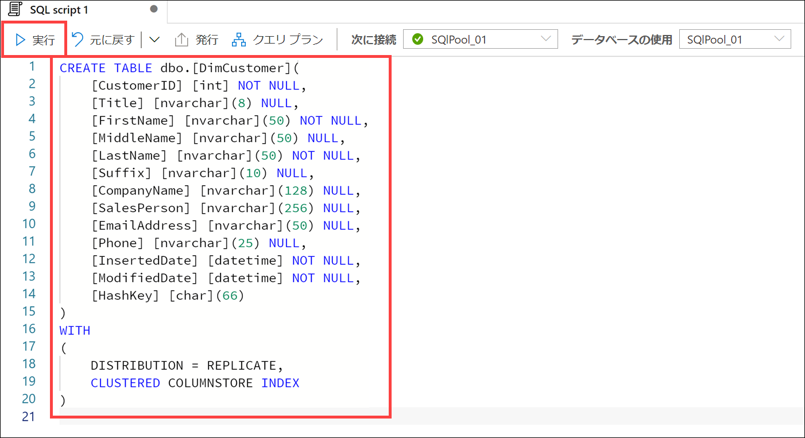

#### タスク 2: Synapse テーブルにデータを読み込む

このタスクでは、公共データ ソースからのデータを使用して Synapse ディメンション テーブルとファクト テーブルを読み込みます。T-SQL を使用してこのデータを Azure Storage ファイルから読み込む方法は 2 通りあります。COPY コマンドの使用、または Polybase を使用した外部テーブルからの選択です。このタスクでは、COPY を使用します。Azure Storage から区切りデータを読み込むにはシンプルで柔軟性のある構文だからです。ソースがプライベート ストレージ アカウントの場合は、CREDENTIAL オプションを含めて、データを読み取る COPY コマンドを許可できます。ただし、この例では必要ありません。

1. クエリを以下に置き換えて**実行**すると、データがファクト テーブルとディメンション テーブルに挿入されます。

    ```sql
    COPY INTO [dbo].[DimProduct]
    FROM 'https://solliancepublicdata.blob.core.windows.net/dataengineering/dp-203/awdata/DimProduct.csv'
    WITH (
        FILE_TYPE='CSV',
        FIELDTERMINATOR='|',
        FIELDQUOTE='',
        ROWTERMINATOR='\n',
        ENCODING = 'UTF16'
    );
    GO

    COPY INTO [dbo].[DimReseller]
    FROM 'https://solliancepublicdata.blob.core.windows.net/dataengineering/dp-203/awdata/DimReseller.csv'
    WITH (
        FILE_TYPE='CSV',
        FIELDTERMINATOR='|',
        FIELDQUOTE='',
        ROWTERMINATOR='\n',
        ENCODING = 'UTF16'
    );
    GO

    COPY INTO [dbo].[DimEmployee]
    FROM 'https://solliancepublicdata.blob.core.windows.net/dataengineering/dp-203/awdata/DimEmployee.csv'
    WITH (
        FILE_TYPE='CSV',
        FIELDTERMINATOR='|',
        FIELDQUOTE='',
        ROWTERMINATOR='\n',
        ENCODING = 'UTF16'
    );
    GO

    COPY INTO [dbo].[DimGeography]
    FROM 'https://solliancepublicdata.blob.core.windows.net/dataengineering/dp-203/awdata/DimGeography.csv'
    WITH (
        FILE_TYPE='CSV',
        FIELDTERMINATOR='|',
        FIELDQUOTE='',
        ROWTERMINATOR='\n',
        ENCODING = 'UTF16'
    );
    GO

    COPY INTO [dbo].[FactResellerSales]
    FROM 'https://solliancepublicdata.blob.core.windows.net/dataengineering/dp-203/awdata/FactResellerSales.csv'
    WITH (
        FILE_TYPE='CSV',
        FIELDTERMINATOR='|',
        FIELDQUOTE='',
        ROWTERMINATOR='\n',
        ENCODING = 'UTF16'
    );
    GO
    ```

2. Azure Synapse で時間ディメンション テーブルにデータを読み込むには、区切りファイルからデータを読み込むと最も早く実行できます。時間データを作成するために使用されるループ メソッドの実行には時間がかかるためです。この重要な時間ディメンションにデータを読み込むには、クエリ ウィンドウで以下を貼り付けて**実行**します。

    ```sql
    COPY INTO [dbo].[DimDate]
    FROM 'https://solliancepublicdata.blob.core.windows.net/dataengineering/dp-203/awdata/DimDate.csv'
    WITH (
        FILE_TYPE='CSV',
        FIELDTERMINATOR='|',
        FIELDQUOTE='',
        ROWTERMINATOR='0x0a',
        ENCODING = 'UTF16'
    );
    GO
    ```

#### タスク 3: Synapse からデータのクエリを実行する

1. 以下のクエリを貼り付けて**実行**すると、リセラーの場所、製品、月の粒度で Synapse スター スキーマからリセラーの売上データを取得できます。

    ```sql
    SELECT
        Coalesce(p.[ModelName], p.[EnglishProductName]) AS [Model]
        ,g.City AS ResellerCity
        ,g.StateProvinceName AS StateProvince
        ,d.[CalendarYear]
        ,d.[FiscalYear]
        ,d.[MonthOfYear] AS [Month]
        ,sum(f.OrderQuantity) AS Quantity
        ,sum(f.ExtendedAmount) AS Amount
        ,approx_count_distinct(f.SalesOrderNumber) AS UniqueOrders  
    FROM
        [dbo].[FactResellerSales] f
    INNER JOIN [dbo].[DimReseller] r
        ON f.ResellerKey = r.ResellerKey
    INNER JOIN [dbo].[DimGeography] g
        ON r.GeographyKey = g.GeographyKey
    INNER JOIN [dbo].[DimDate] d
        ON f.[OrderDateKey] = d.[DateKey]
    INNER JOIN [dbo].[DimProduct] p
        ON f.[ProductKey] = p.[ProductKey]
    GROUP BY
        Coalesce(p.[ModelName], p.[EnglishProductName])
        ,g.City
        ,g.StateProvinceName
        ,d.[CalendarYear]
        ,d.[FiscalYear]
        ,d.[MonthOfYear]
    ORDER BY Amount DESC
    ```

    次のような出力が表示されます。

    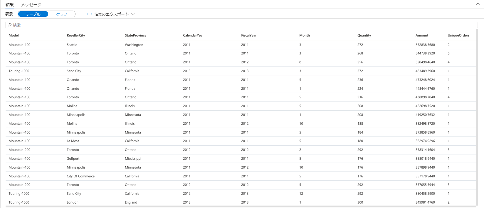

2. クエリを以下に置き換えて**実行**すると、結果が 2012 年と 2013 年の会計年度の 10 月に限定されます。

    ```sql
    SELECT
        Coalesce(p.[ModelName], p.[EnglishProductName]) AS [Model]
        ,g.City AS ResellerCity
        ,g.StateProvinceName AS StateProvince
        ,d.[CalendarYear]
        ,d.[FiscalYear]
        ,d.[MonthOfYear] AS [Month]
        ,sum(f.OrderQuantity) AS Quantity
        ,sum(f.ExtendedAmount) AS Amount
        ,approx_count_distinct(f.SalesOrderNumber) AS UniqueOrders  
    FROM
        [dbo].[FactResellerSales] f
    INNER JOIN [dbo].[DimReseller] r
        ON f.ResellerKey = r.ResellerKey
    INNER JOIN [dbo].[DimGeography] g
        ON r.GeographyKey = g.GeographyKey
    INNER JOIN [dbo].[DimDate] d
        ON f.[OrderDateKey] = d.[DateKey]
    INNER JOIN [dbo].[DimProduct] p
        ON f.[ProductKey] = p.[ProductKey]
    WHERE d.[MonthOfYear] = 10 AND d.[FiscalYear] IN (2012, 2013)
    GROUP BY
        Coalesce(p.[ModelName], p.[EnglishProductName])
        ,g.City
        ,g.StateProvinceName
        ,d.[CalendarYear]
        ,d.[FiscalYear]
        ,d.[MonthOfYear]
    ORDER BY d.[FiscalYear]
    ```

    次のような出力が表示されます。

    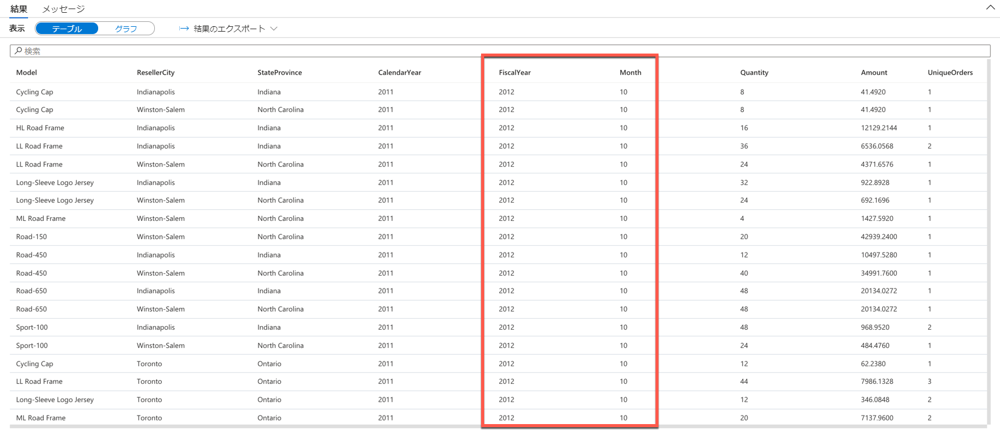

    > **時間ディメンション テーブル**を使用すると、急いで日付関数を計算するよりも、特定の日付部分と日付検査 (会計年度など) によるフィルタリングが容易になり、パフォーマンスが向上します。

### 演習 5: マッピング データ フローを使用してゆっくり変化するディメンションを更新する

**ゆっくり変化するディメンション** (SCD) は、長期間にわたりディメンション メンバーの変化を適切に管理します。時間の経過に伴ってビジネス エンティティの値が変化した場合、およびアドホックで適用されます。ゆっくり変化するディメンションの好例は顧客ディメンション、特にその連絡先詳細列 (メール アドレスや電話番号など) です。これとは対照的に、ディメンションの属性が頻繁に変化すると急速に変化するとみなされるディメンションもあります (株式市場の価格など)。このようなインスタンスの一般的な設計アプローチは、ファクト テーブル メジャーで急速に変化する属性の値を格納することです。

スター スキーマの設計理論は、2 つの一般的な SCD のタイプを参照しています。タイプ 1 とタイプ 2 です。ディメンション タイプ テーブルはタイプ 1 またはタイプ 2 になるか、異なる列で両方のタイプを同時にサポートできます。

**タイプ 1 SCD**

**タイプ 1 SCD** は常に最新の値を反映しており、ソース データの変更が検出されると、ディメンション テーブルのデータが上書きされます。この設計アプローチは、顧客のメール アドレスや電話番号など補助値を格納する列で一般的です。顧客のメール アドレスや電話番号が変わると、ディメンション テーブルは新しい値を使用して顧客の行を更新します。顧客は、いつもこの連絡先情報を持っていたように見えます。

**タイプ 2 SCD**

**タイプ 2 SCD** はディメンション メンバーのバージョン管理をサポートします。ソース システムがバージョンを格納しない場合は通常、データ ウェアハウスの読み込みプロセスが変化を検出し、ディメンション テーブルでその変化を適切に管理します。この場合、ディメンション テーブルでは代理キーを使用して、ディメンション メンバーのバージョンへの一意の参照を提供する必要があります。また、バージョンの日付範囲の有効性 (たとえば、`StartDate` と `EndDate`) を定義する列や、フラグ列が含まれていることもあり (たとえば、`IsCurrent`)、 現在のディメンション メンバーを容易にフィルタリングできます。

たとえば、Adventure Works 社は営業担当者を販売地域に割り当てます。営業担当者が販売地域を変えると、新しい営業担当者のバージョンを作成して、履歴情報が以前のリージョンに関連付けられていることを確認する必要があります。営業担当者による売上の正確な履歴分析に対応するため、ディメンション テーブルは営業担当者のバージョンおよび関連のあるリージョンを格納しなくてはなりません。また、テーブルには、時間の有効性を定義するために開始日と終了日の値も含めるべきです。現在のバージョンは空の終了日 (または 12/31/9999) を定義する可能性があります。これは、行が現在のバージョンであることを示唆します。また、テーブルでは代理キーを定義する必要もあります。ビジネス キー (この場合は従業員 ID) は一意でないためです。

ソース データがバージョンを格納しないのであれば、中間システム (データ ウェアハウスなど)　を使用して変化を検出して格納しなくてはなりません。テーブル読み込みプロセスは、既存のデータを保持して変化を検出する必要があります。変化が検出されると、テーブル読み込みプロセスは現在のバージョンを終了します。`EndDate` の値を更新し、以前の `EndDate` 値から始まる `StartDate` 値を使用して新しいバージョンを挿入することによって、変化を記録します。また、関連のあるファクトは時間ベースの検索を使用し、ファクト日に関係のあるディメンション キー値を取得します。

この演習では、Azure SQL Database をソースとして使用し、Synapse 専用 SQL プールを宛先としてタイプ 1 SCD を作成します。

#### タスク 1: Azure SQL Database のリンクされたサービスを作成する

Synapse Analytics のリンク サービスを使用すると、外部リソースへの接続を管理できます。このタスクでは、`DimCustomer` ディメンション テーブルでデータ ソースとして使用する Azure SQL Database のリンク サービスを作成します。

1. Synapse Studio で 「**管理**」 ハブに移動します。

    

2. 左側で 「**リンク サービス**」 を選択してから、「**+ 新規**」 を選択します。

    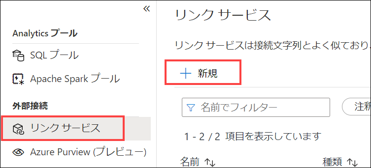

3. 「**Azure SQL Database**」 を選択してから 「**続行**」 を選択します。

    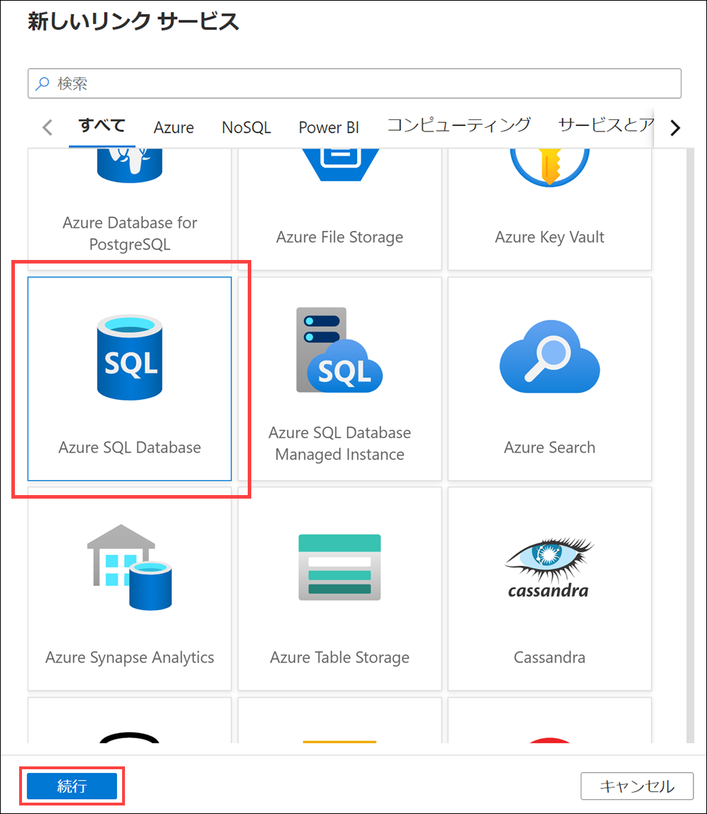

4. 新しいリンク サービス フォームを次のように入力します。

    - **名前**: `AzureSqlDatabaseSource` と入力します
    - **アカウント選択方法**: `From Azure subscription` を選択します
    - **Azure サブスクリプション**: このラボで使用する Azure サブスクリプションを選択する
    - **サーバー名**: `dp203sqlSUFFIX` という名前の Azure SQL サーバーを選択します (SUFFIX は一意のサフィックス)
    - **データベース名**: `SourceDB` を選択します
    - **認証タイプ**: `SQL authentication` を選択します
    - **ユーザー名**: `Sqladmin` と入力します
    - **パスワード**: 環境設定中に使用したパスワード、またはホストされたラボ環境の場合は提供されたパスワード (このラボの最初でも使用したもの) を入力します

    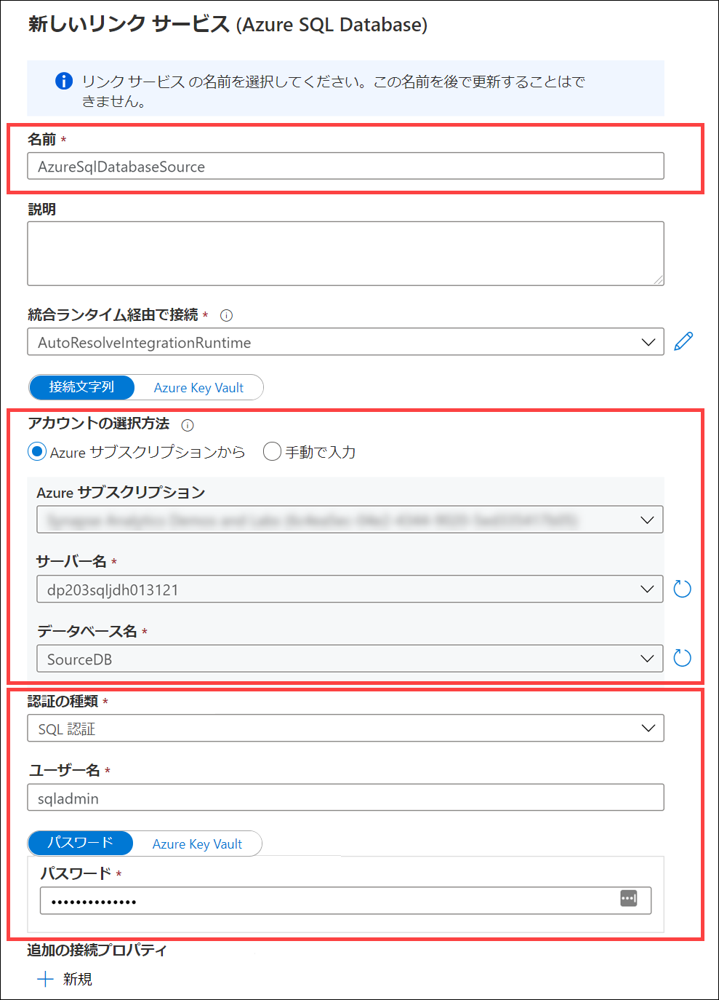

5. 「**作成**」 を選択します。

#### タスク 2: マッピング データ フローを作成する

マッピング データ フローはパイプライン アクティビティで、コードを書かないデータ変換方法を指定する視覚的な方法を提供します。この機能により、データ クレンジング、変換、集計、コンバージョン、結合、データ コピー操作などが可能になります。

このタスクでは、マッピング データ フローを作成してタイプ 1 SCD を作成します。

1. 「**開発**」 ハブに移動します。

    

2. **+** を選択してから 「**データ フロー**」 を選択します。

    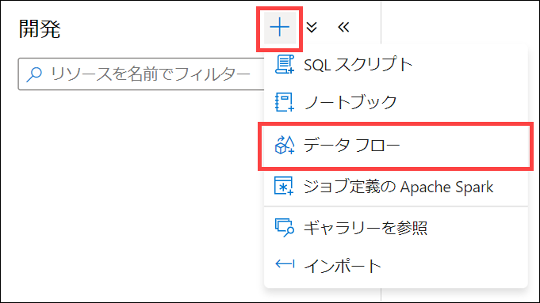

3. 新しいデータ フローのプロパティ ペインで 「**名前**」 フィールド **(1)** に `UpdateCustomerDimension` と入力し、「**プロパティ**」 ボタン **(2)** を選択してプロパティ ペインを非表示にします。

    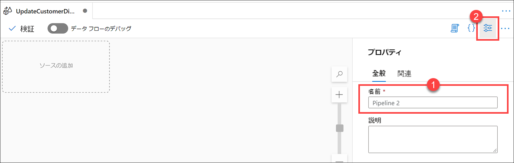

4. 「**データ フローのデバッグ**」 を選択してデバッガーを有効にします。これにより、パイプラインで実行する前にデータの変換をプレビューして、データ フローのデバッグを実行できるようになります。

    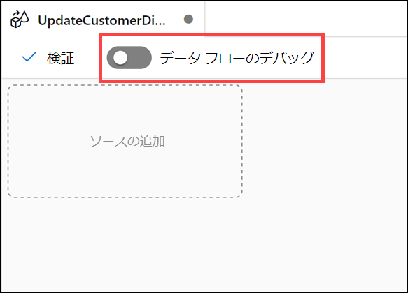

5. 表示されたダイアログで 「**OK**」 を選択し、データ フローのデバッグを有効にします。

    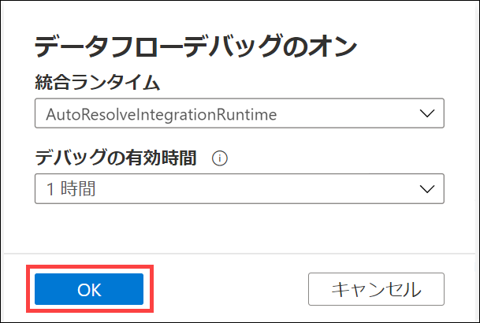

    デバッグ クラスターが数分で起動します。その間、次の手順に進むことができます。

6. キャンバスで 「**ソースの追加**」 を選択します。

    !「データ フロー キャンバスで 「ソースの追加」 ボタンが強調表示されています。](media/data-flow-add-source.png "Add Source")

7. `Source settings` で以下のプロパティを設定します。

    - **出力ストリーム名**: `SourceDB` と入力します
    - **ソースの種類**: `Dataset` を選択します
    - **オプション**: `Allow schema drift` をチェックし、他のオプションはチェックしないままにします
    - **サンプリング**: `Disable` を選択します
    - **データセット**: 「**+ 新規**」 を選択して新しいデータセットを作成します

    

8. 新しい統合データセット ダイアログで 「**Azure SQL Database**」 を選択してから 「**続行**」 を選択します。

    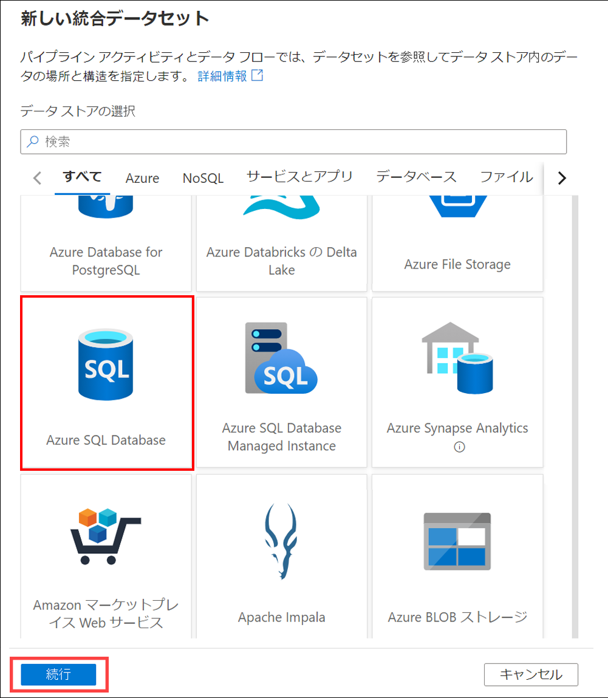

9. データセット プロパティで以下を設定します。

    - **名前**: `SourceCustomer` と入力します
    - **リンク サービス**: `AzureSqlDatabaseSource` を選択します
    - **テーブル名**: `SalesLT.Customer` を選択します。

    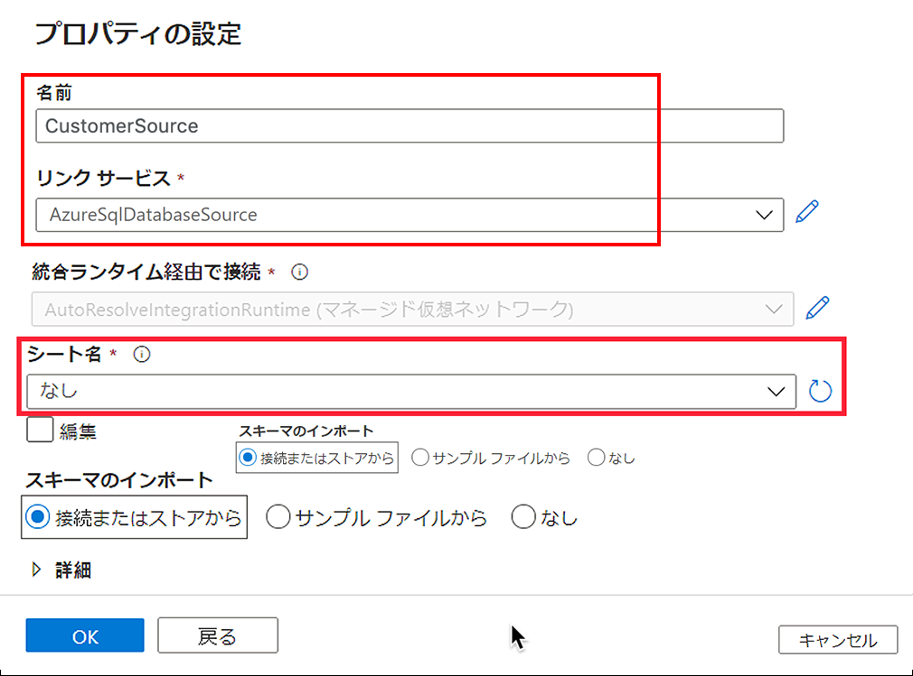

10. 「**OK**」 を選択してデータセットを作成します。

11. `SourceCustomer` データセットが表示され、ソース設定のデータセットとして選択されているはずです。

    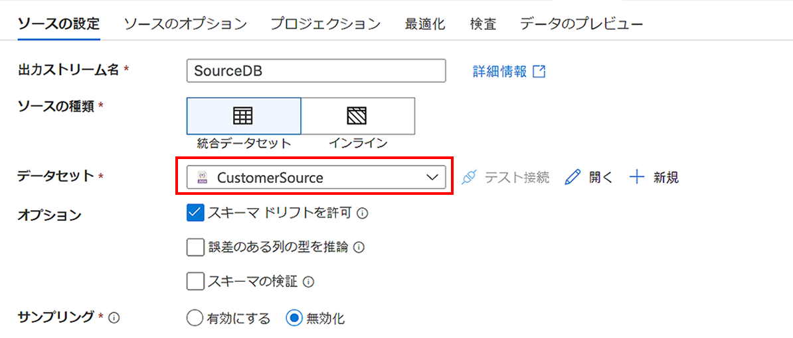

12. キャンバスの `SourceDB` の右側で **+** を選択した後、「**派生列**」 を選択します。

    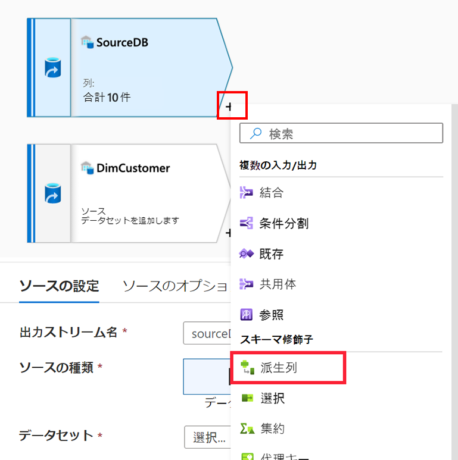

13. `Derived column's settings` で以下のプロパティを設定します。

    - **出力ストリーム名**: `CreateCustomerHash` と入力します。
    - **着信ストリーム**: `SourceDB` を選択します
    - **列**: 次のように入力します。

    | 列 | 式 | 説明 |
    | --- | --- | --- |
    | `HashKey` に入力 | `sha2(256, iifNull(Title,'') +FirstName +iifNull(MiddleName,'') +LastName +iifNull(Suffix,'') +iifNull(CompanyName,'') +iifNull(SalesPerson,'') +iifNull(EmailAddress,'') +iifNull(Phone,''))` | テーブル値の SHA256 ハッシュを作成します。これを使用して、受信記録のハッシュを送信先記録のハッシュ値に比較し、`CustomerID` 値を一致させます。`iifNull` 関数が null 値を空の文字列に置き換えます。その他の場合は、null　エントリがある場合、has 値は複製される傾向があります。 |

    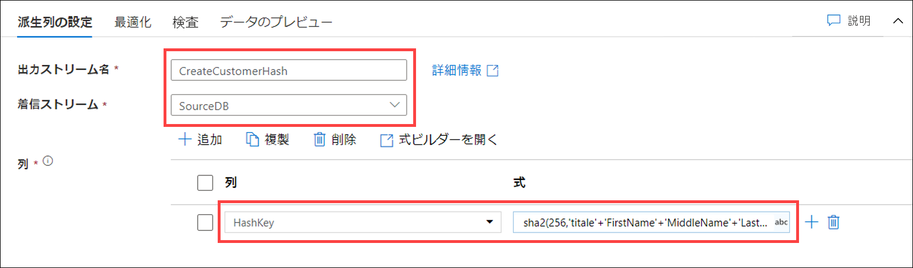

14. 「**式**」 テキスト ボックスをクリックし、「**式ビルダーを開く**」 を選択します。

    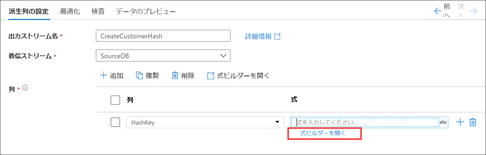

15. `Data preview` の隣にある 「**更新**」 を選択し、`HashKey` 列の出力をプレビューします。ここでは追加済みの `sha2` 関数を使用します。各 hash 値が一意であることがわかります。

    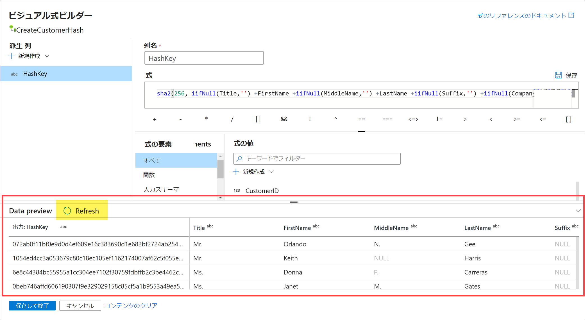

16. 「**保存して終了する**」 を選択して、式ビルダーを閉じます。

17. `SourceDB` ソースの下のキャンバスで 「**ソースの追加**」 を選択します。記録の存在を比較したり、ハッシュを比べる際に使用できるよう、Synapse 専用 SQL プールで `DimCustomer` テーブルを追加する必要があります。

    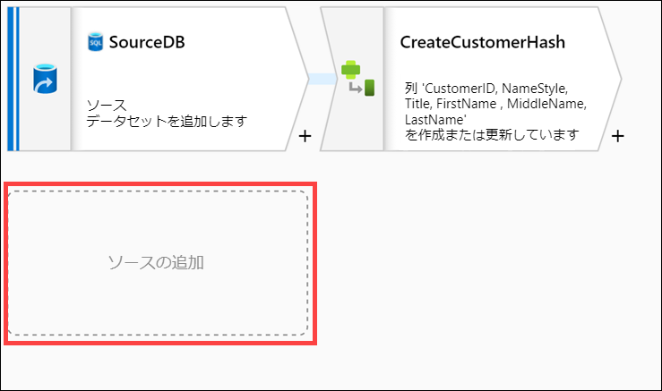

18. `Source settings` で以下のプロパティを設定します。

    - **出力ストリーム名**: `SynapseDimCustomer` と入力します
    - **ソースの種類**: `Dataset` を選択します
    - **オプション**: `Allow schema drift` をチェックし、他のオプションはチェックしないままにします
    - **サンプリング**: `Disable` を選択します
    - **データセット**: 「**+ 新規**」 を選択して新しいデータセットを作成します

    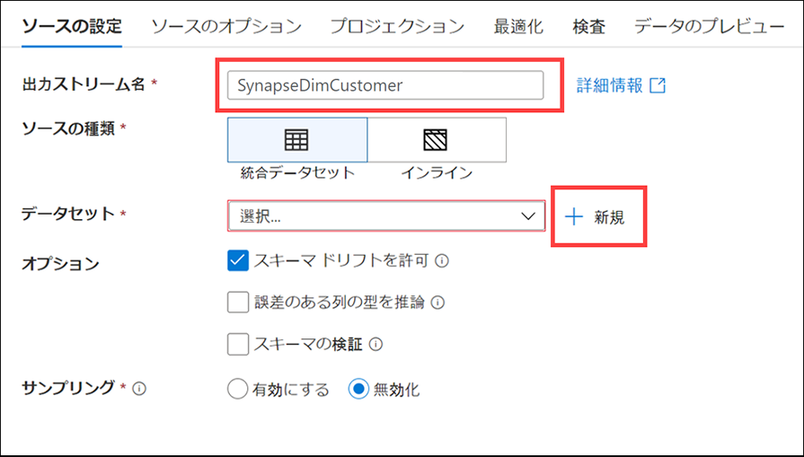

19. 新しい統合データセット ダイアログで 「**Azure Synapse Analytics**」 を選択してから 「**続行**」 を選択します。

    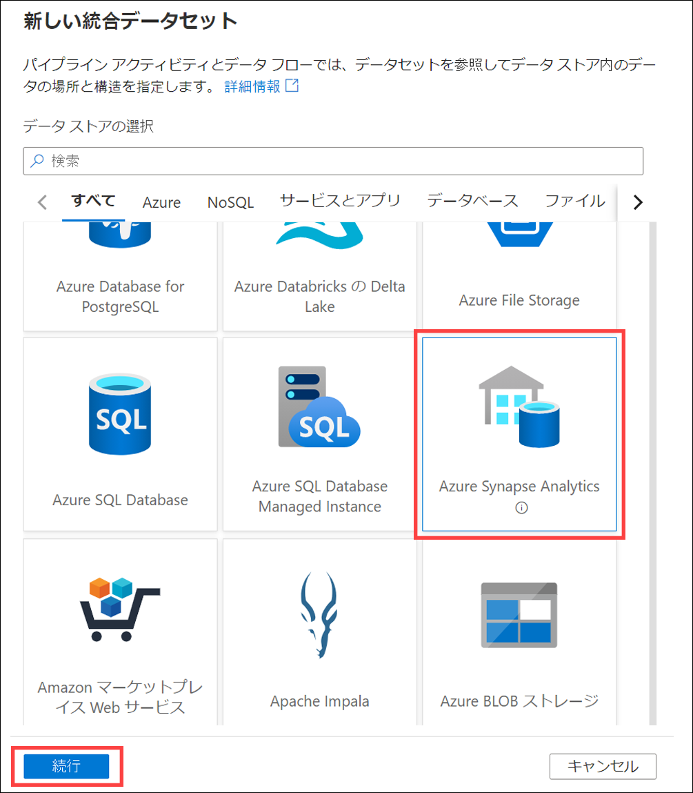

20. データセット プロパティで以下を設定します。

    - **名前**: `DimCustomer` と入力します
    - **リンク サービス**: Synapse ワークスペース リンク サービスを選択します
    - **テーブル名**: ドロップダウンの隣で 「**更新**」 ボタンを選択します

    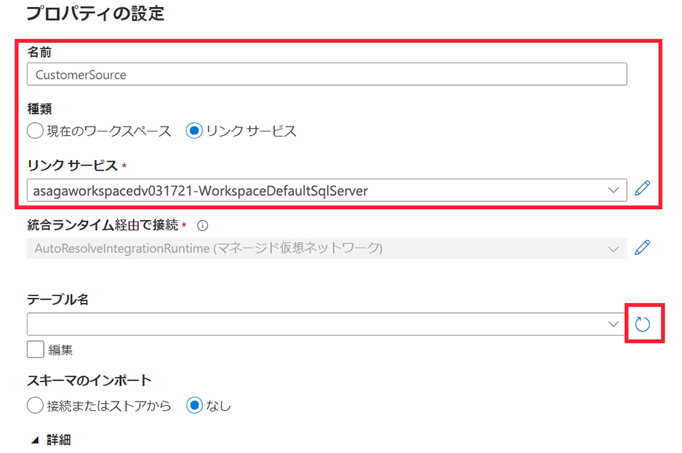

21. 「**値**」 フィールドに `SQLPool01` と入力し、「**OK**」 を選択します。

    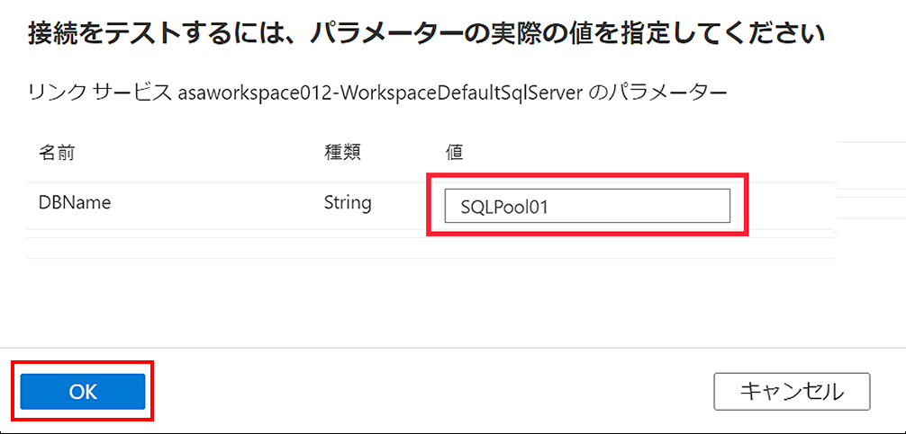

22. 「**テーブル名**」 で `dbo.DimCustomer` を選択し、selectunder 「**スキーマのインポート**」 で `From connection/store` を選択してから 「**OK**」 を選択してデータセットを作成します。

    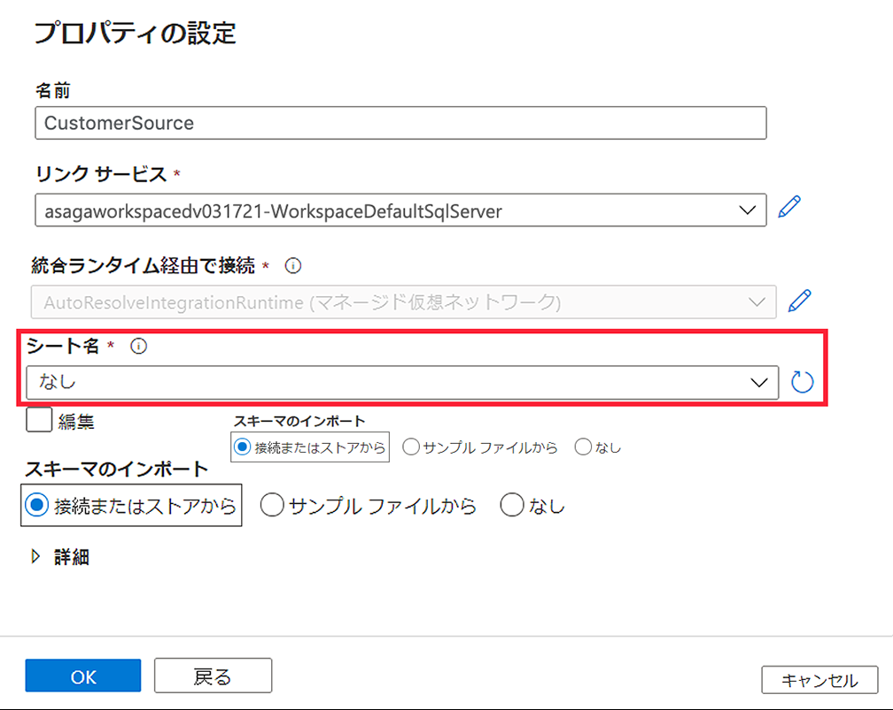

23. `DimCustomer` データセットが表示され、ソース設定のデータセットとして選択されているはずです。

    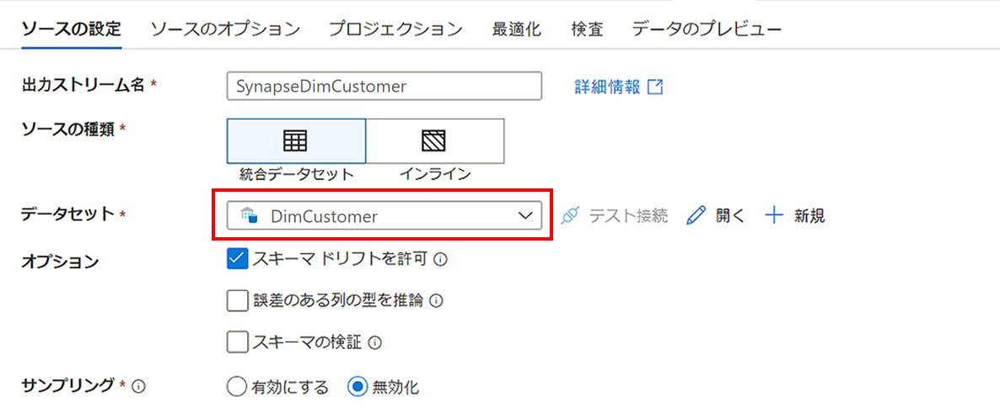

24. 追加した `DimCustomer` データセットの隣で 「**開く**」 を選択します。

    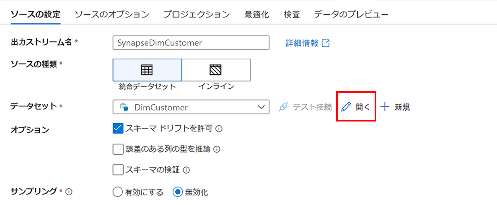

25. `DBName` の隣で 「**値**」 フィールドに `SQLPool01` と入力します。

    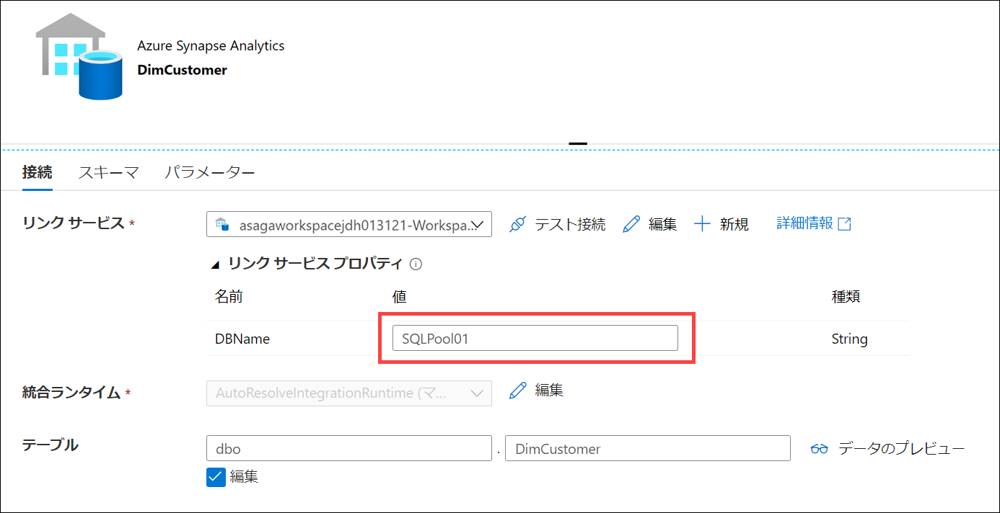

26. データ フローに戻ります。`DimCustomer` データセットは*閉じない*でください。キャンバスで `CreateCustomerHash` 派生列の右側にある **+** を選択してから、「**既存**」 を選択します。

    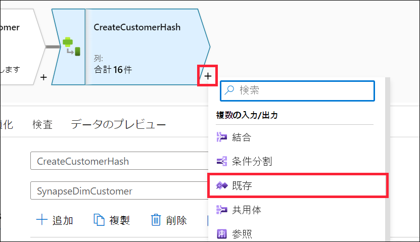

27. `Exists settings` で以下のプロパティを設定します。

    - **出力ストリーム名**: `Exists` と入力します
    - **左側のストリーム**: `CreateCustomerHash` を選択します
    - **右側のストリーム**: `SynapseDimCustomer` を選択します
    - **既存タイプ**: `Doesn't exist` を選択します
    - **既存条件**: 左側と右側で以下を設定します:

    | 左: CreateCustomerHash's column | 右: SynapseDimCustomer's column |
    | --- | --- |
    | `HashKey` | `HashKey` |

    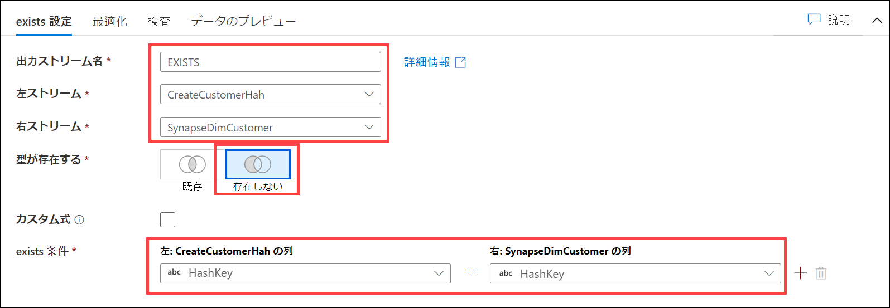

28. キャンバスで `Exists` の右側にある **+** を選択してから、「**参照**」 を選択します。

    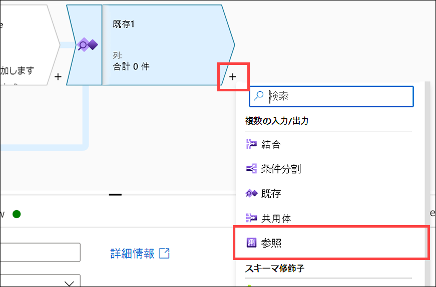

29. `Lookup settings` で以下のプロパティを設定します。

    - **出力ストリーム名**: `LookupCustomerID` と入力します
    - **プライマリ ストリーム**: `Exists` を選択します
    - **参照ストリーム**: `SynapseDimCustomer` を選択します
    - **複数の行の一致**: オフ
    - **一致日**: `Any row` を選択します
    - **参照条件**: 左側と右側で以下を設定します:

    | 左: Exists の列 | 右: SynapseDimCustomer の列 |
    | --- | --- |
    | `CustomerID` | `CustomerID` |

    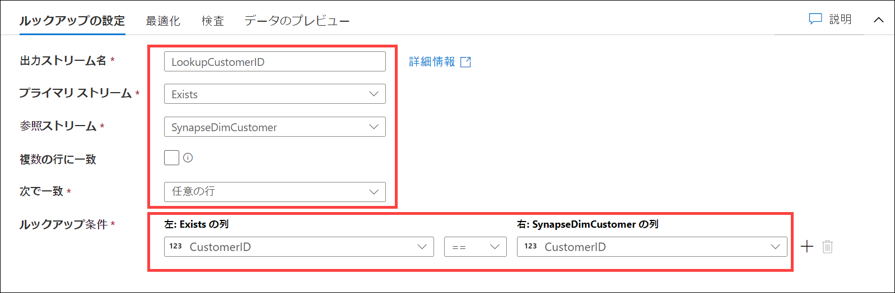

30. キャンバスの `LookupCustomerID` の右側で **+** を選択した後、「**派生列**」 を選択します。

    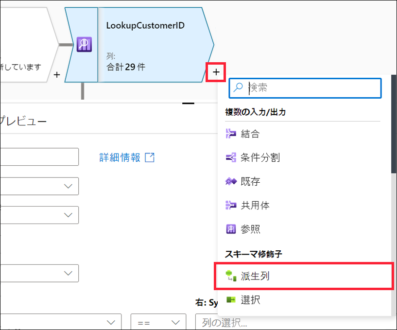

31. `Derived column's settings` で以下のプロパティを設定します。

    - **出力ストリーム名**: `SetDates` と入力します
    - **着信ストリーム**: `LookupCustomerID` を選択します
    - **列**: 次のように入力します。

    | 列 | 式 | 説明 |
    | --- | --- | --- |
    | `InsertedDate` を選択します | `iif(isNull(InsertedDate), currentTimestamp(), {InsertedDate})` | `InsertedDate` 値が null の場合は、現在のタイムスタンプを挿入します。その他の場合は、`InsertedDate` 値を使用します。 |
    | `ModifiedDate` を選択します | `currentTimestamp()` | 常に最新のタイムスタンプで `ModifiedDate` 値を更新します。 |

    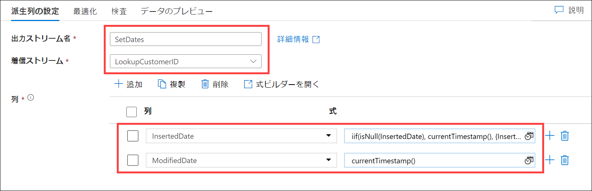

    > **注**: 2 番目の列を挿入するには、列リストの上で 「**+ 追加**」 を選択してから 「**列の追加**」 を選択します。

32. キャンバスで `SetDates` 派生列ステップの右側にある **+** を選択してから、「**行の変更**」 を選択します。

    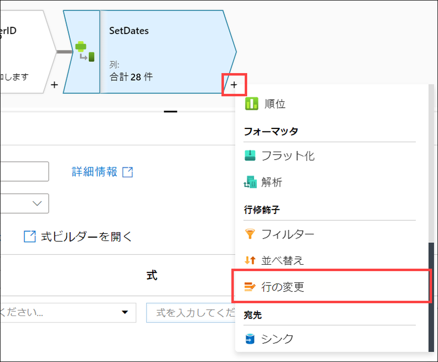

33. `Alter row settings` で以下のプロパティを設定します。

    - **出力ストリーム名**: `AllowUpserts` と入力します
    - **着信ストリーム**: `SetDates` を選択します
    - **行の変更条件**: 次のように入力します。

    | 条件 | 式 | 説明 |
    | --- | --- | --- |
    | `Upsert if` を選択します | `true()` | `Upsert if` 条件を `true()` に設定して upsert を許可します。これにより、マッピング データ　フローの手順を経るデータがすべて、シンクに挿入されているか更新されていることを確認できます。 |

    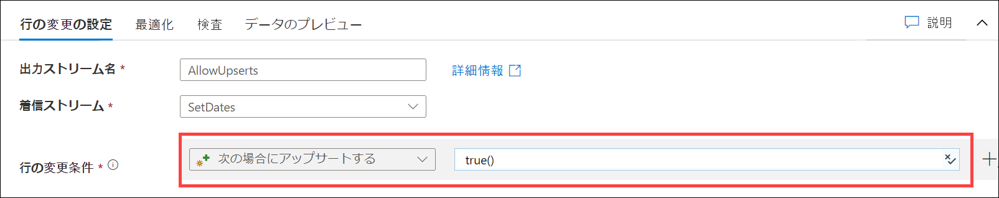

34. キャンバスで `AllowUpserts` 行の変更手順の右側にある **+** を選択してから、「**シンク**」 を選択します。

    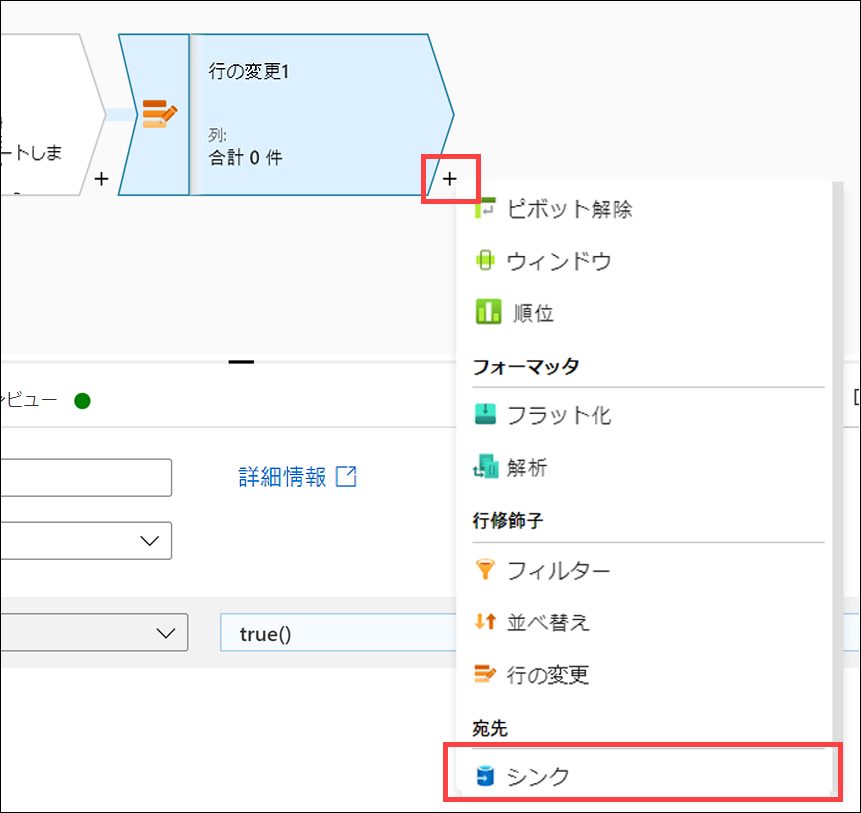

35. `Sink` で以下のプロパティを設定します。

    - **出力ストリーム名**: `Sink` と入力します
    - **着信ストリーム**: `AllowUpserts` を選択します
    - **シンクの種類**: `Dataset` を選択します
    - **データセット**: `DimCustomer` を選択します
    - **オプション**: `Allow schema drift` をチェックし、`Validate schema` はオフにします

    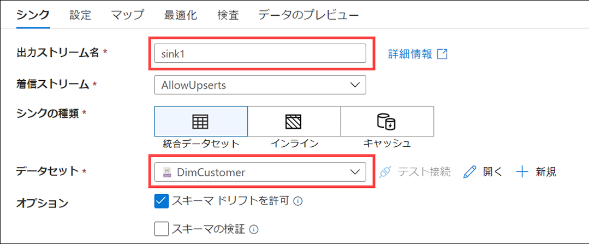

36. 「**設定**」 タブを選択し、以下のプロパティを設定します。

    - **更新方法**: `Allow upsert` をチェックし、他のオプションはすｂてオフにします
    - **キー列**: `List of columns` を選択してから、リストで `CustomerID` を選択します
    - **テーブル アクション**: `None` を選択します
    - **ステージングの有効化**: オフ

    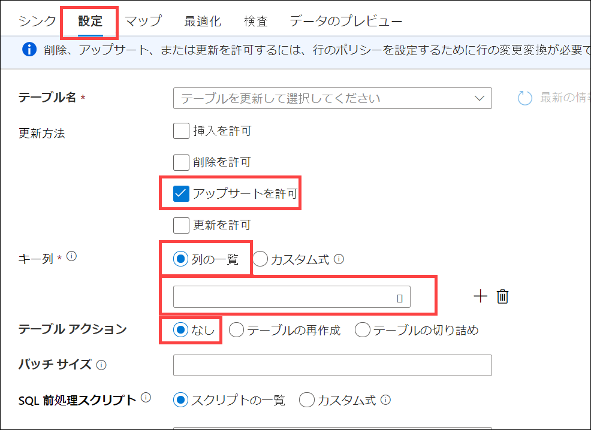

37. 「**マッピング**」 タブを選択してから、「**自動マッピング**」 をオフにします。以下のように入力列マッピングを設定します。

    | 入力列 | 出力列 |
    | --- | --- |
    | `SourceDB@CustomerID` | `CustomerID` |
    | `SourceDB@Title` | `Title` |
    | `SourceDB@FirstName` | `FirstName` |
    | `SourceDB@MiddleName` | `MiddleName` |
    | `SourceDB@LastName` | `LastName` |
    | `SourceDB@Suffix` | `Suffix` |
    | `SourceDB@CompanyName` | `CompanyName` |
    | `SourceDB@SalesPerson` | `SalesPerson` |
    | `SourceDB@EmailAddress` | `EmailAddress` |
    | `SourceDB@Phone` | `Phone` |
    | `InsertedDate` | `InsertedDate` |
    | `ModifiedDate` | `ModifiedDate` |
    | `CreateCustomerHash@HashKey` | `HashKey` |

    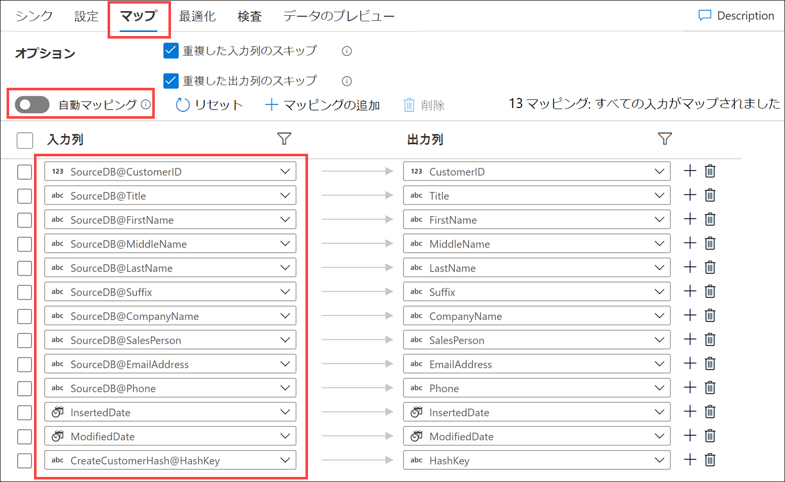

38. 完成したマッピング フローは、次のようになります。「**すべて公開**」 を選択して、変更を保存します。

    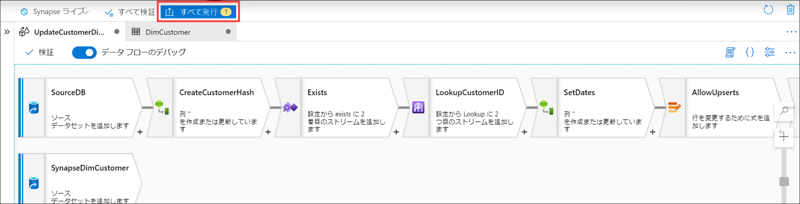

39. 「**公開**」 を選択します。

    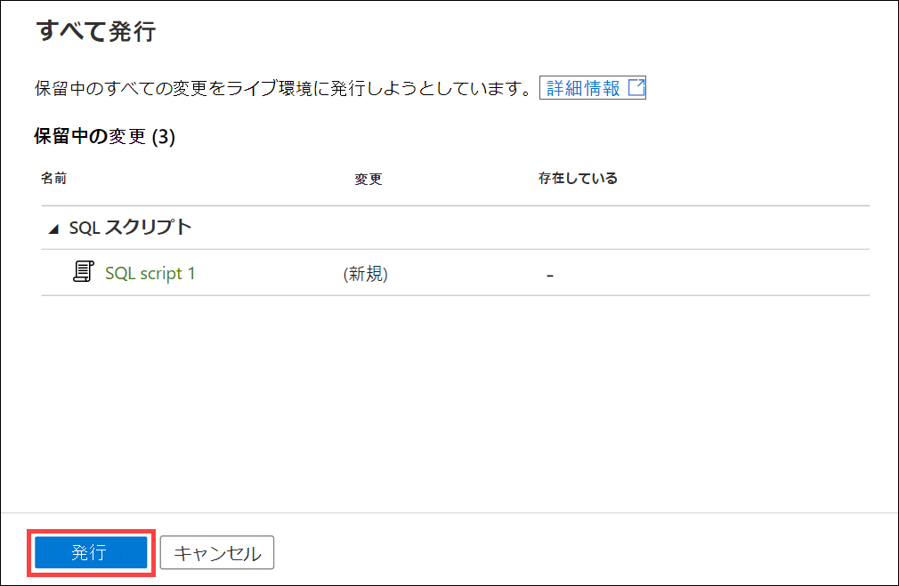

#### タスク 3: パイプラインを作成してデータ フローを実行する

このタスクでは、新しい Synapse 統合パイプラインを作成してマッピング データ フローを実行した後、このパイプラインを実行して顧客レコードを upsert します。

1. 「**統合**」 ハブに移動します。

    

2. **+** を選択してから 「**パイプライン**」 を選択します。

    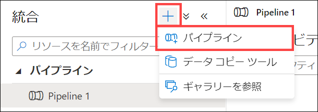

3. 新しいパイプラインのプロパティ ペインで 「**名前**」 フィールド **(1)** に `RunUpdateCustomerDimension` と入力し、「**プロパティ**」 ボタン **(2)** を選択してプロパティ ペインを非表示にします。

    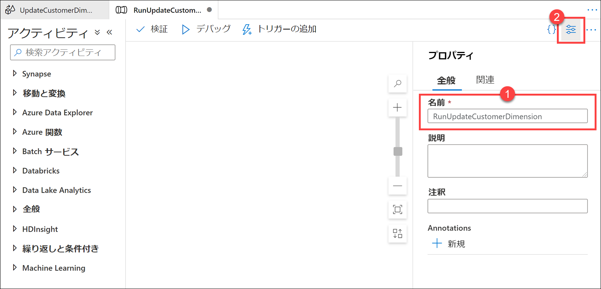

4. デザイン キャンバスの左にある 「アクティビティ」 ペインで `Move & transform` を展開してから 「**データ フロー**」 アクティビティをドラッグしてキャンバスにドロップします。

    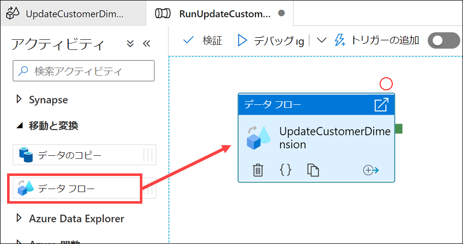

5. `General` タブで名前として 「**UpdateCustomerDimension**」 と入力します。

    

6. `Settings` タブで 「**UpdateCustomerDimension**」 データ フローを選択します。

    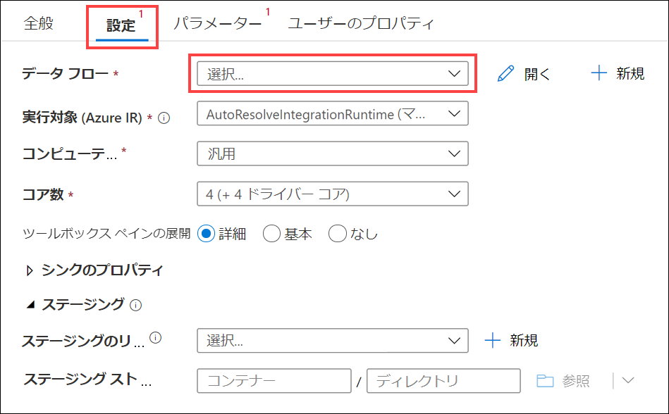

6. 「**すべて公開**」 を選択してから、表示されたダイアログで 「**公開**」 を選択します。

    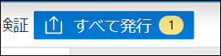

7. 公開が完了した後、パイプライン キャンバスの上で 「**トリガーの追加**」 を選択し、「**今すぐトリガー**」 を選択します。

    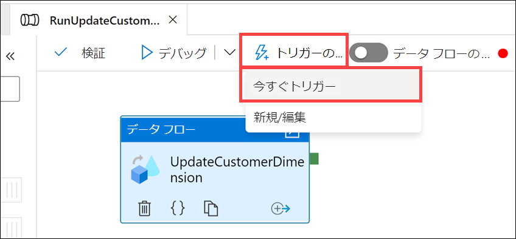

8. `Pipeline run` ダイアログで 「**OK**」 を選択してパイプラインをトリガーします。

    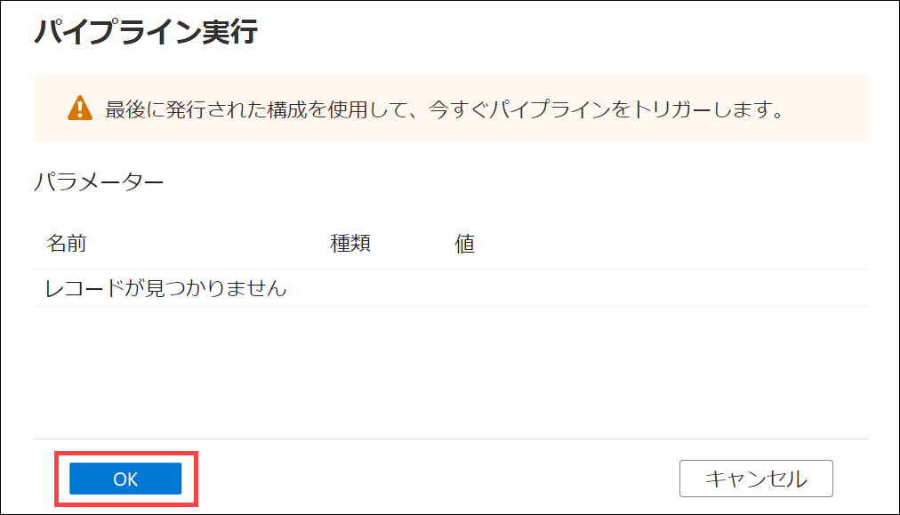

9. 「**監視**」 ハブに移動します。

    

10. 左側のメニューで 「**パイプライン実行**」 を選択し **(1)**、パイプラインの実行が完了するのを待ちます **(2)**。パイプラインが完了するまで 「**更新**」 (3) を数回選択する必要があるかもしれません。

    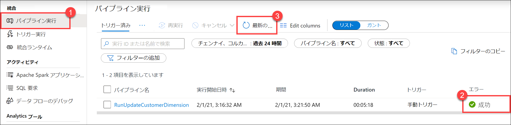

#### タスク 4: 挿入されたデータを表示する

1. 「**データ**」 ハブに移動します。

    

2. 「**ワークスペース**」 タブ **(1)** を選択し、データベースを展開してから **SQLPool01 (2)** を右クリックします。「**新しい SQL スクリプト**」 (3) を選択してから 「**空のスクリプト**」 (4) を選択します。

    

3. クエリ ウィンドウで以下を貼り付けた後、「**実行**」 を選択するか F5 を押して、スクリプトを実行し、結果を表示します。

    ```sql
    SELECT * FROM DimCustomer
    ```

    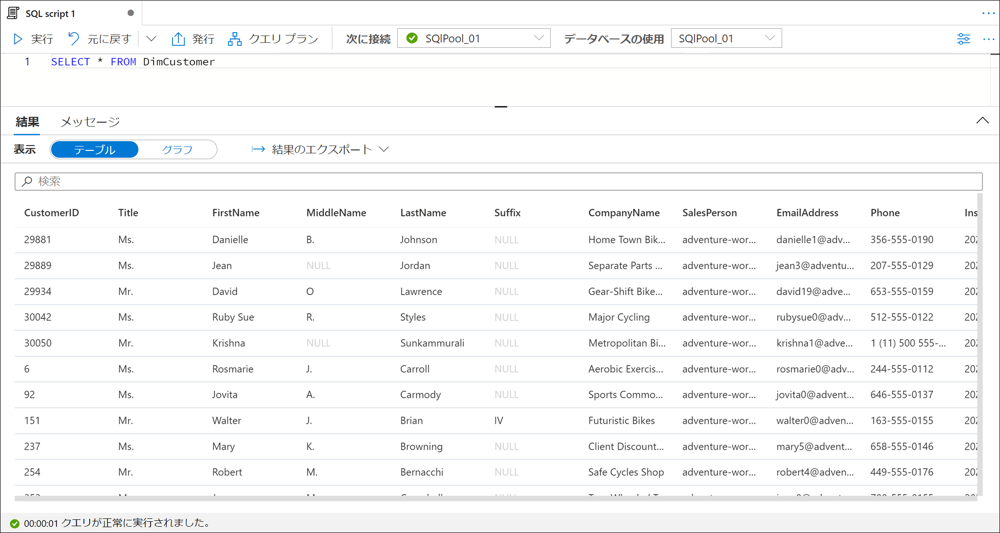

#### タスク 5: ソースの顧客レコードを更新する

1. Azure Data Studio を開くか、まだ開いている場合はこれに戻ります。

2. 左側のメニューで 「**サーバー**」 を選択してから、ラボの最初で追加した SQL サーバーを右クリックします。「**新しいクエリ**」 を選択します。

    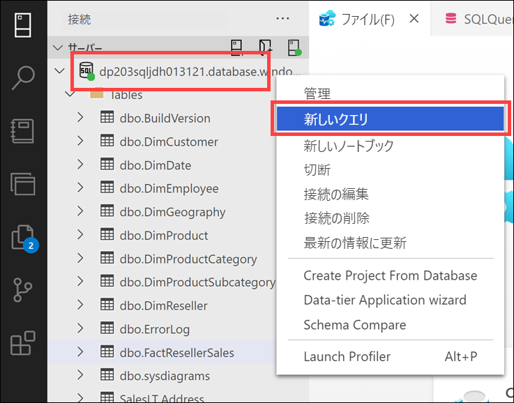

3. 以下をクエリ ウィンドウに貼り付け、`CustomerID` が 10 の顧客を表示します。

    ```sql
    SELECT * FROM [SalesLT].[Customer] WHERE CustomerID = 10
    ```

4. 「**実行**」 を選択するか、`F5` を押してクエリを実行します。

    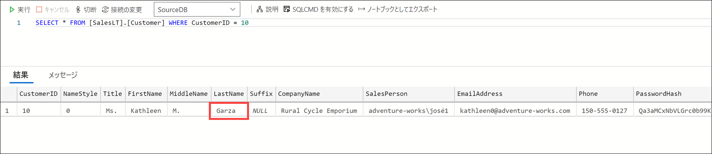

    Ms. Kathleen M. Garza の顧客が表示されます。顧客の姓を変更しましょう。

5. クエリを以下に置き換えて**実行**し、顧客の姓を更新します。

    ```sql
    UPDATE [SalesLT].[Customer] SET LastName = 'Smith' WHERE CustomerID = 10
    SELECT * FROM [SalesLT].[Customer] WHERE CustomerID = 10
    ```

    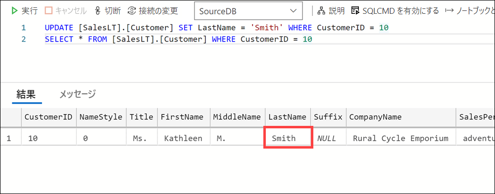

#### タスク 6: マッピング データ フローを再実行する

1. Synapse Studio に戻ります。

2. 「**統合**」 ハブに移動します。

    

3. **RunUpdateCustomerDimension** パイプラインを選択します。

    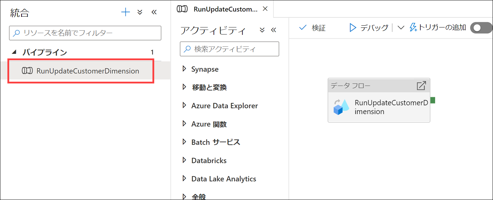

4. パイプライン キャンバスの上で 「**トリガーの追加**」 を選択し、「**今すぐトリガー**」 を選択します。

    

5. `Pipeline run` ダイアログで 「**OK**」 を選択してパイプラインをトリガーします。

    

6. 「**監視**」 ハブに移動します。

    

7. 左側のメニューで 「**パイプライン実行**」 を選択し **(1)**、パイプラインの実行が完了するのを待ちます **(2)**。パイプラインが完了するまで 「**更新**」 (3) を数回選択する必要があるかもしれません。

    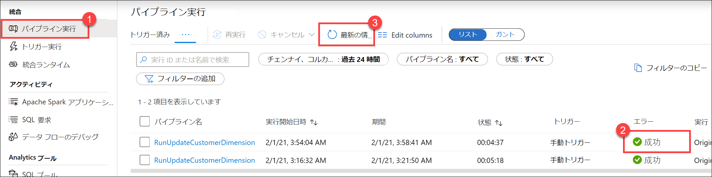

#### タスク 7: 更新されたレコードを確認する

1. 「**データ**」 ハブに移動します。

    

2. 「**ワークスペース**」 タブ **(1)** を選択し、データベースを展開してから **SQLPool01 (2)** を右クリックします。「**新しい SQL スクリプト**」 (3) を選択してから 「**空のスクリプト**」 (4) を選択します。

    

3. クエリ ウィンドウで以下を貼り付けた後、「**実行**」 を選択するか F5 を押して、スクリプトを実行し、結果を表示します。

    ```sql
    SELECT * FROM DimCustomer WHERE CustomerID = 10
    ```

    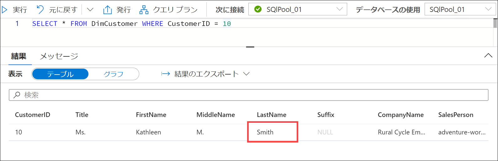

    ご覧のように、顧客記録が更新され、`LastName` の値がソース記録に一致するよう修正されました。
