# モジュール 4 - サーバーレス SQL プールを使用してインタラクティブなクエリを実行する

このモジュールでは、Azure Synapse Analytics のサーバーレス SQL プールで T-SQL ステートメントを実行し、データ レイクと外部ファイル ソースに格納されているファイルを使用する方法を学びます。データ レイクに格納されている Parquet ファイルと、外部データ ストアに格納されている CSV ファイルのクエリを実行します。次に、Azure Active Directory セキュリティ グループを作成し、ロールベースのアクセス制御 (RBAC) とアクセス制御リスト (ACL) を使用してデータ レイクのファイルにアクセスします。

このモジュールでは、次のことができるようになります。

- サーバーレス SQL プール を使用して Parquet データのクエリを実行する
- Parquet ファイルと CSV ファイルの外部テーブルを作成する
- サーバーレス SQL プールでビューを作成する
- サーバーレス SQL プール を使用する際にデータ レイクでデータへのアクセスを保護する
- ロールベースのアクセス制御 (RBAC) とアクセス制御リスト (ACL) を使用してデータ レイクのセキュリティを構成する

## ラボの詳細

- [モジュール 4 - サーバーレス SQL プールを使用してインタラクティブなクエリを実行する](#module-4---run-interactive-queries-using-serverless-sql-pools)
  - [ラボの詳細](#lab-details)
  - [ラボの構成と前提条件](#lab-setup-and-pre-requisites)
  - [演習 1: Azure Synapse Analytics でサーバーレス SQL プールを使用してデータ レイク ストアのクエリを実行する](#exercise-1-querying-a-data-lake-store-using-serverless-sql-pools-in-azure-synapse-analytics)
    - [タスク 1: サーバーレス SQL プール を使用して売上 Parquet データのクエリを実行する](#task-1-query-sales-parquet-data-with-serverless-sql-pools)
    - [タスク 2: 2019 年売上データの外部テーブルを作成する](#task-2-create-an-external-table-for-2019-sales-data)
    - [タスク 3: CSV ファイルの外部テーブルを作成する](#task-3-create-an-external-table-for-csv-files)
    - [タスク 4: サーバーレス SQL プールでビューを作成する](#task-4-create-a-view-with-a-serverless-sql-pool)
  - [演習 2: Azure Synapse Analytics のサーバーレス SQL プールを使用してデータへのアクセスを保護する](#exercise-2-securing-access-to-data-through-using-a-serverless-sql-pool-in-azure-synapse-analytics)
    - [タスク 1: Azure Active Directory セキュリティ グループを作成する](#task-1-create-azure-active-directory-security-groups)
    - [タスク 2: グループ メンバーを追加する](#task-2-add-group-members)
    - [タスク 3: データ レイクのセキュリティを構成する - ロールベースのアクセス制御 (RBAC)](#task-3-configure-data-lake-security---role-based-access-control-rbac)
    - [タスク 4: データ レイクのセキュリティを構成する - アクセス制御リスト (ACL)](#task-4-configure-data-lake-security---access-control-lists-acls)
    - [タスク 5: 許可をテストする](#task-5-test-permissions)

Tailwind Trader 社のデータ エンジニアは、データ　レイクを探索し、データの変換と準備を行い、データ変換パイプラインを簡素化する方法を探しています。さらに、データ アナリストが、使い慣れた T-SQL 言語や、SQL エンドポイントに接続できるお気に入りのツールを使用し、データ サイエンティストまたはデータ エンジニアによって作成されたレイクと Spark 外部テーブルでデータを探索することを希望しています。

## ラボの構成と前提条件

> **注:** ホストされたラボ環境を**使用しておらず**、ご自分の Azure サブスクリプションを使用している場合は、`Lab setup and pre-requisites` の手順のみを完了してください。その他の場合は、演習 1 にスキップします。

新しい Azure Active Directory セキュリティ　グループを作成してメンバーを割り当てる許可が必要です。

このモジュールの**[ラボの構成手順](https://github.com/solliancenet/microsoft-data-engineering-ilt-deploy/blob/main/setup/04/README.md)を完了**してください。

以下のモジュールは、同じ環境を共有している点に留意してください。

- [モジュール 4](labs/04/README.md)
- [モジュール 5](labs/05/README.md)
- [モジュール 7](labs/07/README.md)
- [モジュール 8](labs/08/README.md)
- [モジュール 9](labs/09/README.md)
- [モジュール 10](labs/10/README.md)
- [モジュール 11](labs/11/README.md)
- [モジュール 12](labs/12/README.md)
- [モジュール 13](labs/13/README.md)
- [モジュール 16](labs/16/README.md)

## 演習 1: Azure Synapse Analytics でサーバーレス SQL プールを使用してデータ レイク ストアのクエリを実行する

データ探索を行ってデータを理解することは、データ エンジニアやデータ サイエンティストが現在直面している中核的な問題のひとつです。データの基本的な構造、および探索プロセスに固有の要件に応じて、さまざまなデータ処理エンジンが多様なレベルのパフォーマンス、複雑度、柔軟性を提供しています。

Azure Synapse Analytics では、SQL、Apache Spark for Synapse、またはその両方を使用できます。どのサービスを使用するかは、たいてい個人的な好みと専門知識に左右されます。データ エンジニアリング作業を行う際は、多くの場合、どちらのオプションも同等に有効です。ただし、Apache Spark の機能を利用すれば、ソース データの問題を克服できる場合もあります。Synapse Notebook では、データを使用する際に多数の無料ライブラリからインポートして機能を追加できるためです。また、サーバーレス SQL プールを使用した方が、はるかに容易かつ迅速にデータを探索したり、Power BI のような外部ツールからアクセスできる SQL によってデータ レイク内のデータに表示できることもあります。

この演習では、両方のオプションを使用してデータ レイクを探索します。

### タスク 1: サーバーレス SQL プール を使用して売上 Parquet データのクエリを実行する

サーバーレス SQL プールを使用して Parquet ファイルのクエリを行うと、T-SQL 構文を使用してデータを探索できます。

1. Synapse Studio (<https://web.azuresynapse.net/>) を開き、「**データ**」 ハブに移動します。

    

2. 「**リンク**」 タブ **(1)** を選択して **Azure Data Lake Storage Gen2** を展開します。`asaworkspaceXX` プライマリ ADLS Gen2 アカウント **(2)** を展開し、**`wwi-02`** コンテナー **(3)** を選択します。`sale-small/Year=2016/Quarter=Q4/Month=12/Day=20161231` フォルダー **(4)** に移動します。`Sale-small-20161231-snappy.parquet` ファイル **(5)** を右クリックし、「**新しい SQL スクリプト**」 (6) を選択してから 「**上位 100 行を選択**」 (7) を選びます。

    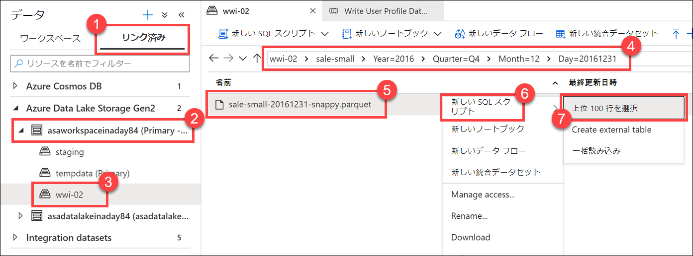

3. クエリ ウィンドウの上にある `Connect to` ドロップダウン リストで 「**組み込み**」 **(1)** が選択されていることを確認し、クエリを実行します **(2)**。サーバーレス SQL エンドポイントによってデータが読み込まれ、通常のリレーショナル データベースからのデータと同様に処理されます。

    

    セル出力には、Parquet ファイルの出力結果が表示されます。

    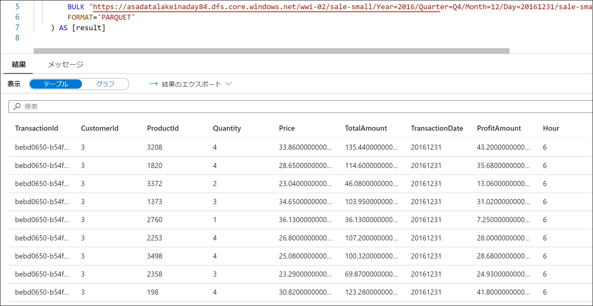

4. データをよりよく理解できるように SQL クエリを修正して集計およびグループ化操作を行います。クエリを以下に置き換えて、`OPENROWSET` のファイル パスが現在のファイル パスに一致していることを確認します。

    ```sql
    SELECT
        TransactionDate, ProductId,
            CAST(SUM(ProfitAmount) AS decimal(18,2)) AS [(sum) Profit],
            CAST(AVG(ProfitAmount) AS decimal(18,2)) AS [(avg) Profit],
            SUM(Quantity) AS [(sum) Quantity]
    FROM
        OPENROWSET(
            BULK 'https://asadatalakeSUFFIX.dfs.core.windows.net/wwi-02/sale-small/Year=2016/Quarter=Q4/Month=12/Day=20161231/sale-small-20161231-snappy.parquet',
            FORMAT='PARQUET'
        ) AS [r] GROUP BY r.TransactionDate, r.ProductId;
    ```

    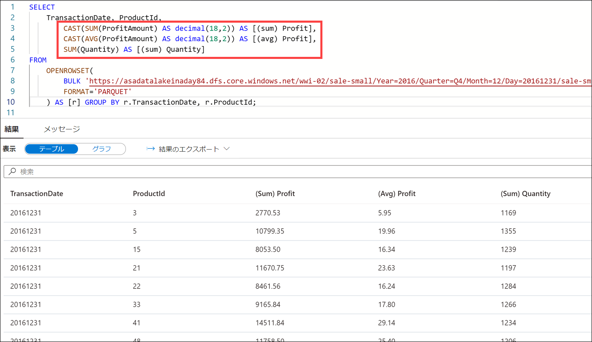

5. この 2016 年の単一ファイルから、より新しいデータ セットに移行しましょう。2019 年のあらゆるデータで Parquet ファイルに記録がいくつ含まれているのか調べます。この情報は、データを Azure Synapse Analytics にインポートするための最適化を計画する上で重要です。このために、クエリを以下に置き換えます (必ず `「asadatalakeSUFFIX」` を置き換えて BULK ステートメントのデータ レイクの名前を更新してください):

    ```sql
    SELECT
        COUNT(*)
    FROM
        OPENROWSET(
            BULK 'https://asadatalakeSUFFIX.dfs.core.windows.net/wwi-02/sale-small/Year=2019/*/*/*/*',
            FORMAT='PARQUET'
        ) AS [r];
    ```

    > `sale-small/Year=2019` のすべてのサブフォルダーにあらゆる Parquet ファイルが含まれるようパスが更新されました。

    出力は **339507246** 件の記録になるはずです。

### タスク 2: 2019 年売上データの外部テーブルを作成する

Parquet ファイルのクエリを行うたびに `OPENROWSET` のスクリプトとルート 2019 フォルダーを作成する代わりに、外部テーブルを作成することができます。

1. Synapse Studio で 「**データ**」 ハブに移動します。

    

2. 「**リンク**」 タブ **(1)** を選択して **Azure Data Lake Storage Gen2** を展開します。`asaworkspaceXX` プライマリ ADLS Gen2 アカウント **(2)** を展開し、**`wwi-02`** コンテナー **(3)** を選択します。`sale-small/Year=2019/Quarter=Q1/Month=1/Day=20190101` フォルダー **(4)** に移動します。`Sale-small-20190101-snappy.parquet` ファイル **(5)** を右クリックし、「**新しい SQL スクリプト**」 を選択してから 「**外部テーブルの作成**」 (7) を選択します。

    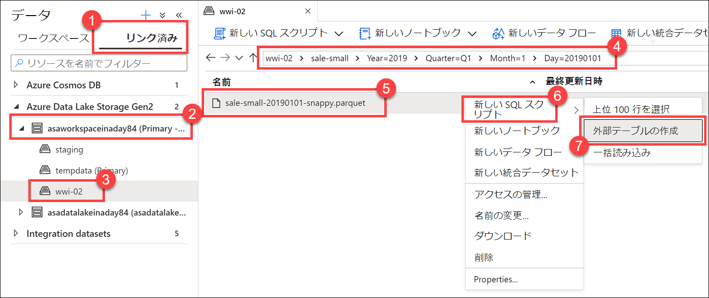

3. **SQL プール (1)** で **`Built-in`** が選択されていることを確認します。「**データベースの選択**」 で 「**+ 新規**」 を選択して `demo` と入力します **(2)**。**外部テーブル名**として `All2019Sales` と入力します **(3)**。「**外部テーブルの作成**」 で 「**SQL スクリプトを使用**」 (4) を選択してから 「**作成**」 (5) を選択します。

    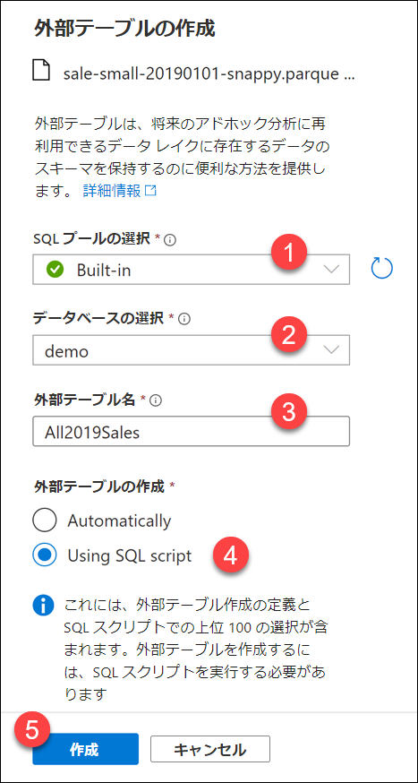

    > **注**: スクリプトがサーバーレス SQL プール (`Built-in`) **(1)** に接続されており、データベースが `demo` **(2)** に設定されていることを確認します。

    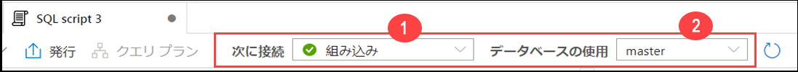

    生成されたスクリプトには、次のコンポーネントが含まれます。

    - **1)** スクリプトではまず、`PARQUET` の `FORMAT_TYPE` を使用して `SynapseParquetFormat` 外部ファイル形式を作成します。
    - **2)** 次に、外部データ ソースを作成し、データ レイク ストレージ アカウントの `wwi-02` コンテナーを指定します。
    - **3)** CREATE EXTERNAL TABLE `WITH` ステートメントでファイルの場所を指定し、上記で作成した新しい外部ファイル形式とデータ ソースを参照します。
    - **4)** 最後に、`2019Sales` 外部テーブルの上位 100 の結果を選択します。

    

4. `CREATE EXTERNAL TABLE` ステートメントの `LOCATION` 値を **`sale-small/Year=2019/*/*/*/*.parquet`** に置き換えます。

    

5. スクリプトを**実行**します。

    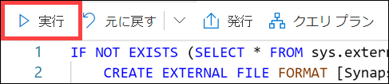

    スクリプトの実行後、`All2019Sales` 外部テーブルに対する SELECT クエリの出力が表示されます。これにより、`YEAR=2019` フォルダーにある Parquet ファイルからの最初の 100 件の記録が表示されます。

    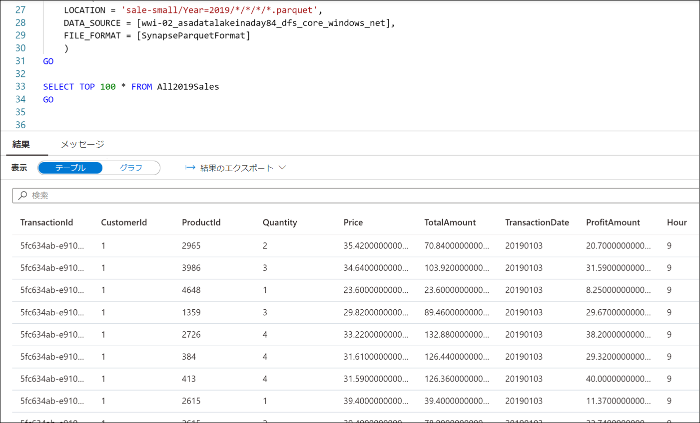

### タスク 3: CSV ファイルの外部テーブルを作成する

Tailwind Traders 社は、使用したい国の人口データのオープン データ ソースを見つけました。これは今後予測される人口で定期的に更新されているため、単にデータをコピーすることは望んでいません。

あなたは、外部データ ソースに接続する外部テーブルを作成することに決めます。

1. SQL スクリプトを以下に置き換えます。

    ```sql
    IF NOT EXISTS (SELECT * FROM sys.symmetric_keys) BEGIN
        declare @pasword nvarchar(400) = CAST(newid() as VARCHAR(400));
        EXEC('CREATE MASTER KEY ENCRYPTION BY PASSWORD = ''' + @pasword + '''')
    END

    CREATE DATABASE SCOPED CREDENTIAL [sqlondemand]
    WITH IDENTITY='SHARED ACCESS SIGNATURE',  
    SECRET = 'sv=2018-03-28&ss=bf&srt=sco&sp=rl&st=2019-10-14T12%3A10%3A25Z&se=2061-12-31T12%3A10%3A00Z&sig=KlSU2ullCscyTS0An0nozEpo4tO5JAgGBvw%2FJX2lguw%3D'
    GO

    -- Create external data source secured using credential
    CREATE EXTERNAL DATA SOURCE SqlOnDemandDemo WITH (
        LOCATION = 'https://sqlondemandstorage.blob.core.windows.net',
        CREDENTIAL = sqlondemand
    );
    GO

    CREATE EXTERNAL FILE FORMAT QuotedCsvWithHeader
    WITH (  
        FORMAT_TYPE = DELIMITEDTEXT,
        FORMAT_OPTIONS (
            FIELD_TERMINATOR = ',',
            STRING_DELIMITER = '"',
            FIRST_ROW = 2
        )
    );
    GO

    CREATE EXTERNAL TABLE [population]
    (
        [country_code] VARCHAR (5) COLLATE Latin1_General_BIN2,
        [country_name] VARCHAR (100) COLLATE Latin1_General_BIN2,
        [year] smallint,
        [population] bigint
    )
    WITH (
        LOCATION = 'csv/population/population.csv',
        DATA_SOURCE = SqlOnDemandDemo,
        FILE_FORMAT = QuotedCsvWithHeader
    );
    GO
    ```

    スクリプトの最上部では、ランダムなパスワードを使用して `MASTER KEY` を作成します **(1)**。次に、代理アクセスで共有アクセス署名 (SAS) を使用し、外部ストレージ アカウントのコンテナー向けデータベーススコープ資格情報を作成します **(2)**。この資格情報は、人口データを含む外部ストレージ アカウントの場所を示す `SqlOnDemandDemo` 外部データ ソース **(3)** を作成する際に使用します。

    

    > データベーススコープ資格情報は、プリンシパルが DATA_SOURCE を使用して OPENROWSET 関数を呼び出すか、パブリック ファイルにアクセスできない外部テーブルからデータを選択する際に使用されます。データベーススコープ資格情報は、ストレージ アカウントの名前と一致する必要はありません。ストレージの場所を定義する DATA SOURCE で明示的に使用されるためです。

    スクリプトの次の部分では、`QuotedCsvWithHeader` と呼ばれる外部ファイル形式を作成します。外部ファイル形式の作成は、外部テーブルを作成するための前提条件です。外部ファイル形式を作成することで、外部テーブルによって参照されるデータの実際のレイアウトを指定します。ここでは、CSV フィールド終端記号、文字列区切り記号を指定し、`FIRST_ROW` 値を 2 に設定します (ファイルにはヘッダー行が含まれているためです)。

    

    最後に、スクリプトの最下部で `population` という名前の外部テーブルを作成します。`WITH` 句は、CSV ファイルの相対的な場所を指定し、上記で作成されたデータ ソースと `QuotedCsvWithHeader` ファイル形式を指します。

    

2. スクリプトを**実行**します。

    

    このクエリにデータ結果はない点に留意してください。

3. SQL スクリプトを以下に置き換えて、2019 年のデータでフィルタリングした人口の外部テーブルから選択します。ここでの人口は 1 億人以上です。

    ```sql
    SELECT [country_code]
        ,[country_name]
        ,[year]
        ,[population]
    FROM [dbo].[population]
    WHERE [year] = 2019 and population > 100000000
    ```

4. スクリプトを**実行**します。

    

5. クエリ結果で 「**グラフ**」 ビューを選択し、以下のように設定します。

    - **グラフの種類**: `Bar` を選択します。
    - **カテゴリ列**: `Country_name` を選択します。
    - **凡例 (シリーズ) 列**: `Population` を選択します。
    - **凡例の位置**: `center - bottom` を選択します。

    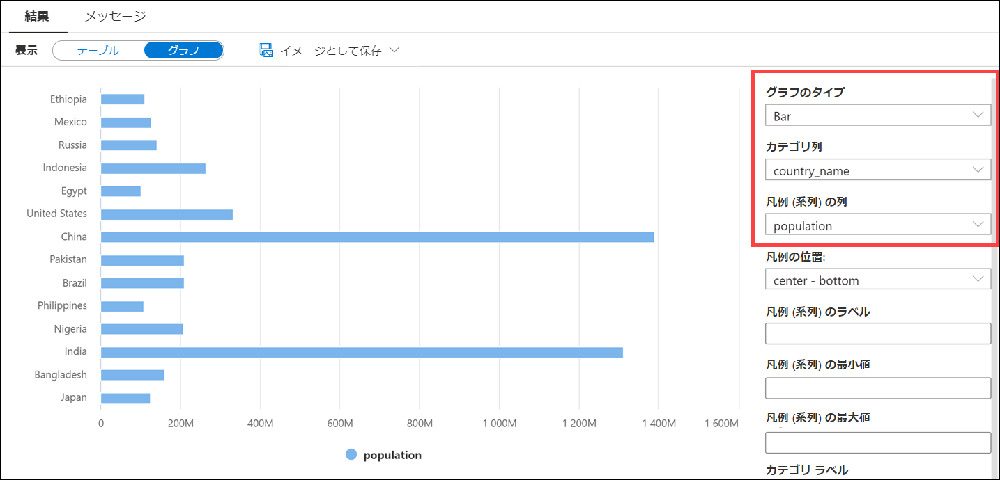

### タスク 4: サーバーレス SQL プールでビューを作成する

SQL クエリをラップするビューを作成してみましょう。ビューでは、クエリを再使用することが可能で、Power BI などのツールをサーバーレス SQL プールと組み合わせて使う場合に必要になります。

1. Synapse Studio で 「**データ**」 ハブに移動します。

    

2. 「**リンク**」 タブ **(1)** を選択して **Azure Data Lake Storage Gen2** を展開します。`asaworkspaceXX` プライマリ ADLS Gen2 アカウント **(2)** を展開し、**`wwi-02`** コンテナー **(3)** を選択します。`Customer-info` フォルダー **(4)** に移動します。`Customerinfo.csv` ファイル **(5)** を右クリックし、「**新しい SQL スクリプト**」 (6) を選択してから 「**上位 100 行を選択**」 を選びます。

    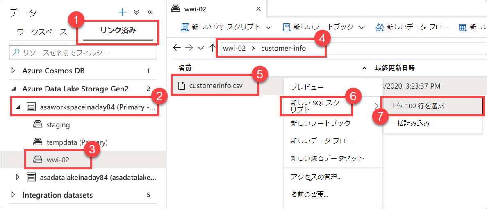

3. 「**実行**」 を選択してスクリプトを実行します **(1)**。CSV ファイルの最初の行は、列のヘッダー行になります **(2)**。

    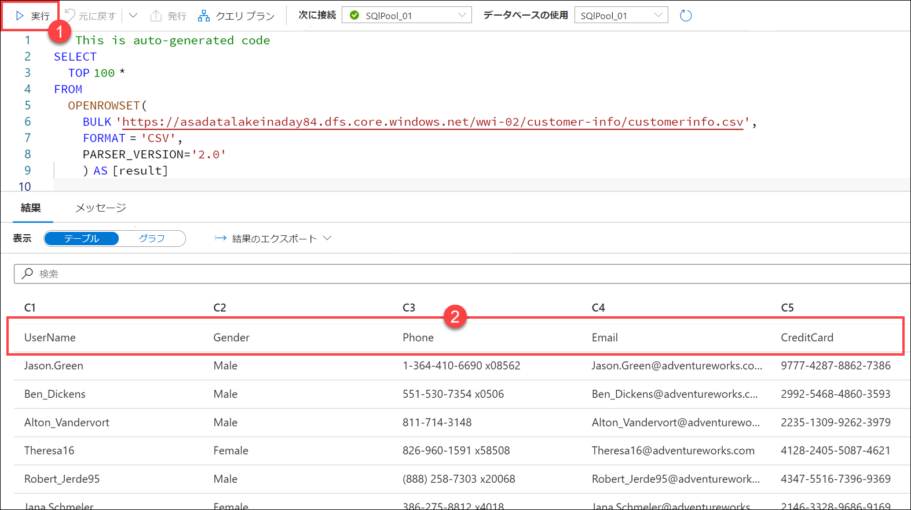

4. 以下を使用してスクリプトを更新し、前の選択ステートメントの値を使用して OPENROWSET BULK パスで**必ず YOUR_DATALAKE_NAME を置き換えます (1)** (プライマリ データ レイク ストレージ　アカウント)。「**Use database**」 の値を **`demo` (2)** に設定します (必要に応じて右側の更新ボタンを使用します)。

    ```sql
    CREATE VIEW CustomerInfo AS
        SELECT * 
    FROM OPENROWSET(
            BULK 'https://YOUR_DATALAKE_NAME.dfs.core.windows.net/wwi-02/customer-info/customerinfo.csv',
            FORMAT = 'CSV',
            PARSER_VERSION='2.0',
            FIRSTROW=2
        )
    WITH (
        [UserName] VARCHAR (50),
        [Gender] VARCHAR (10),
        [Phone] VARCHAR (50),
        [Email] VARCHAR (100),
        [CreditCard] VARCHAR (50)
    ) AS [r];
    GO

    SELECT * FROM CustomerInfo;
    GO
    ```

    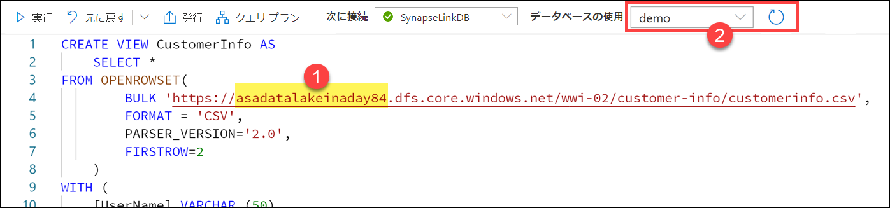

5. 「**実行**」 を選択してスクリプトを実行します。

    

    CSV ファイルからデータを選択する SQL クエリをラップするビューを作成し、ビューから行を選択しました。

    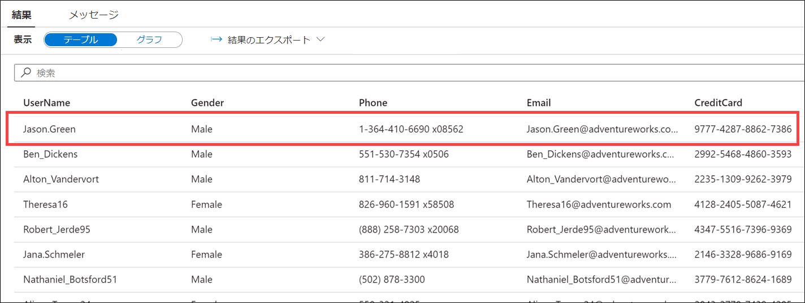

    最初の行には列のヘッダーが含まれていません。これは、ビューの作成時に `OPENROWSET` ステートメントで `FIRSTROW=2` 設定を使用したためです。

6. 「**データ**」 ハブ内で 「**ワークスペース**」 タブ **(1)** を選択します。データベース グループ **(2)** の右にあるアクションの省略記号 **(...)** を選択してから、「**更新**」 を選択します (3)。

    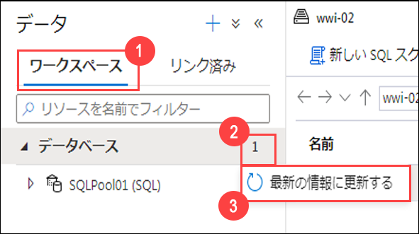

7. `demo` SQL データベースを展開します。

    

    このデータベースには、前の手順で作成した以下のオブジェクトが含まれています。

    - **1) 外部テーブル**: `All2019Sales` および `population`
    - **2) 外部データソース**: `SqlOnDemandDemo` および `wwi-02_asadatalakeinadayXXX_dfs_core_windows_net`
    - **3) 外部ファイル形式**: `QuotedCsvWithHeader` および `SynapseParquetFormat`
    - **4) ビュー**: `CustomerInfo` 

## 演習 2: Azure Synapse Analytics のサーバーレス SQL プールを使用してデータへのアクセスを保護する

Tailwind Traders 社は、売上データへのどのような変更も当年度のみで行い、許可のあるユーザー全員がデータ全体でクエリを実行できるようにしたいと考えています。必要であれば履歴データを修正できる少人数の管理者がいます。

- Tailwind Traders は、AAD でセキュリティ グループ (たとえば `tailwind-history-owners`) を作成する必要があります。このグループに属するユーザー全員が、前年度のデータを修正する許可を得られるようにするためです。
- データ レイクが含まれている Azure Storage アカウントで、`Tailwind-history-owners` セキュリティ グループを Azure Storage 組み込み RBAC の `Storage Blob Data Owner` に割り当てなくてはなりません。これにより、この役割に追加された AAD ユーザーとサービス プリンシパルは、前年度のあらゆるデータを修正できるようになります。
- すべての履歴データを修正する許可のあるユーザー セキュリティ プリンシパルを?`tailwind-history-owners`?セキュリティ グループに追加しなくてはなりません。
- Tailwind Traders は AAD で別のセキュリティ グループ (たとえば、`tailwind-readers`) を作成する必要があります。このグループに属するユーザー全員が、あらゆる履歴データを含むファイル システム (この場合は `prod`) のコンテンツすべてを読み取る許可を得られるようにするためです。
- `Tailwind-readers` セキュリティ グループは、データ レイクが含まれている Azure Storage アカウントで Azure Storage 組み込み RBAC の `Storage Blob Data Reader` に割り当てなくてはなりません。このセキュリティ グループに追加された AAD ユーザーとサービス プリンシパルは、ファイル システムのあらゆるデータを読み取れますが、修正はできません。
- Tailwind Traders は AAD で別のグループ (たとえば、`tailwind-2020-writers`) を背駆使する必要があります。このグループに属するユーザー全員が、2020 年度のデータのみを修正する許可を得られるようにするためです。
- 別のセキュリティ グループ (たとえば、`tailwind-current-writers`) を作成します。セキュリティ　グループのみがこのグループに追加されるようにするためです。このグループは、ACL を使用して設定された現在の年度からのデータのみを修正する許可を得られます。
- `Tailwind-readers` セキュリティ グループを `tailwind-current-writers` セキュリティ　グループに追加する必要があります。
- 2020 年度の始めに、Tailwind Traders は `tailwind-current-writers` を `tailwind-2020-writers` セキュリティ グループに追加します。
- 2020 年度の始めに、`2020` フォルダーで Tailwind Traders は `tailwind-2020-writers` セキュリティ グループの読み取り、書き込み、ACL 実行許可を設定します。
- 2021 年度の始めに、2020 年度のデータへの書き込みアクセスを無効にするため、`tailwind-current-writers` セキュリティ グループを `tailwind-2020-writers` グループから削除します。`tailwind-readers` のメンバーは引き続きファイル システムのコンテンツを読み取れます。ACL ではなく、ファイル システム レベルで RBAC 組み込みロールによって読み取り・実行 (リスト) 許可を与えられているためです。
- このアプローチでは ACL への現在の変更によって許可が継承されないため、書き込み許可を削除するには、あらゆる内容をスキャンして各フォルダーとファイル オブジェクトで許可を削除する書き込みコードが必要です。
- このアプローチは比較的すばやく実行できます。RBAC の役割の割り当ては、保護されるデータの量に関わらず、伝達に最高 5分間かかる可能性があります。

### タスク 1: Azure Active Directory セキュリティ グループを作成する

このセグメントでは、上記に説明されているセキュリティ グループを作成します。ただし、データ セットは 2019 年で終了しているため、2021 年ではなく `tailwind-2019-writers` グループを作成します。

1. 別のブラウザー タブで Azure portal (<https://portal.azure.com>) に戻り、Synapse Studio は開いたままにしておきます。

2. Azure メニュー **(1)** を選択してから **Azure Active Directory (2)** を選択します。

    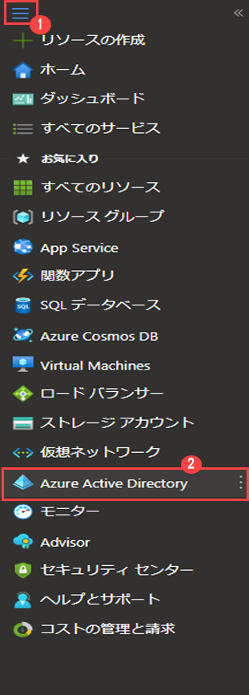

3. 左側のメニューで 「**グループ**」 を選択します。

    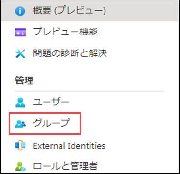

4. 「**+ 新しいグループ**」 を選択します。

    

5. 「**グループの種類**」 で `Security` を選択します。「**グループ名**」 で `tailwind-history-owners-<suffix>` (`<suffix>` は、イニシャルと 2 つ以上の数字など一意の値) と入力し、「**作成**」 を選択します。

    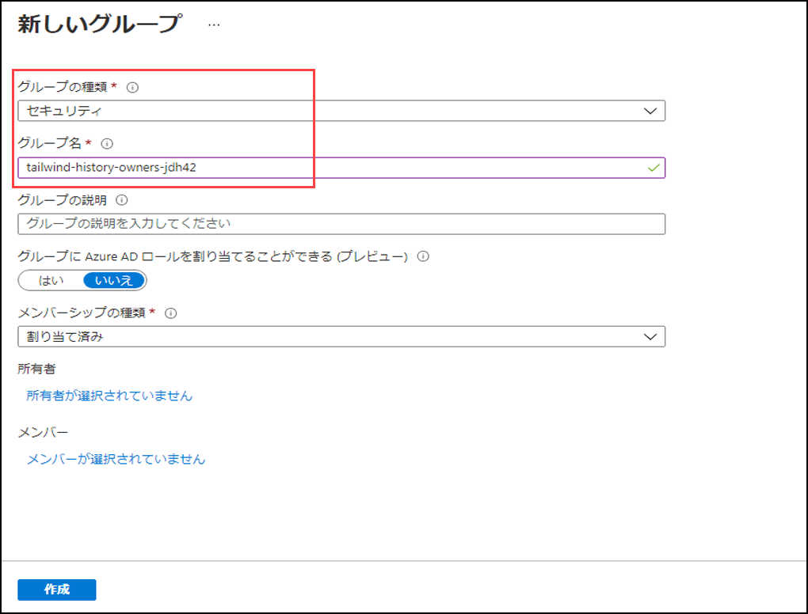

6. 「**+ 新しいグループ**」 を選択します。

    

7. 「**グループの種類**」 で `Security` を選択します。「**グループ名**」 で `tailwind-readers-<suffix>` (`<suffix>` は、イニシャルと 2 つ以上の数字など一意の値) と入力し、「**作成**」 を選択します。

    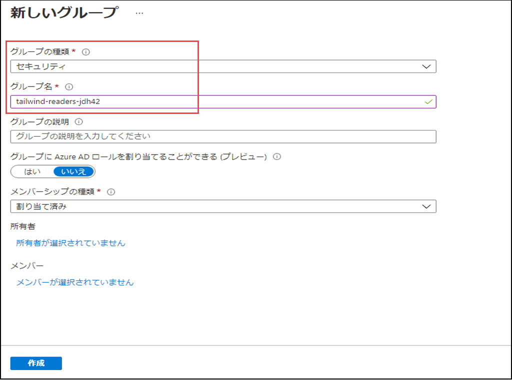

8. 「**+ 新しいグループ**」 を選択します。

    

9. 「**グループの種類**」 で `Security` を選択します。「**グループ名**」 で `tailwind-current-writers-<suffix>` (`<suffix>` は、イニシャルと 2 つ以上の数字など一意の値) と入力し、「**作成**」 を選択します。

    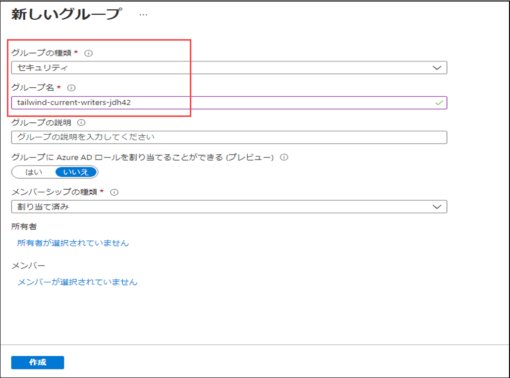

10. 「**+ 新しいグループ**」 を選択します。

    

11. 「**グループの種類**」 で `Security` を選択します。「**グループ名**」 で `tailwind-2019-writers-<suffix>` (`<suffix>` は、イニシャルと 2 つ以上の数字など一意の値) と入力し、「**作成**」 を選択します。

    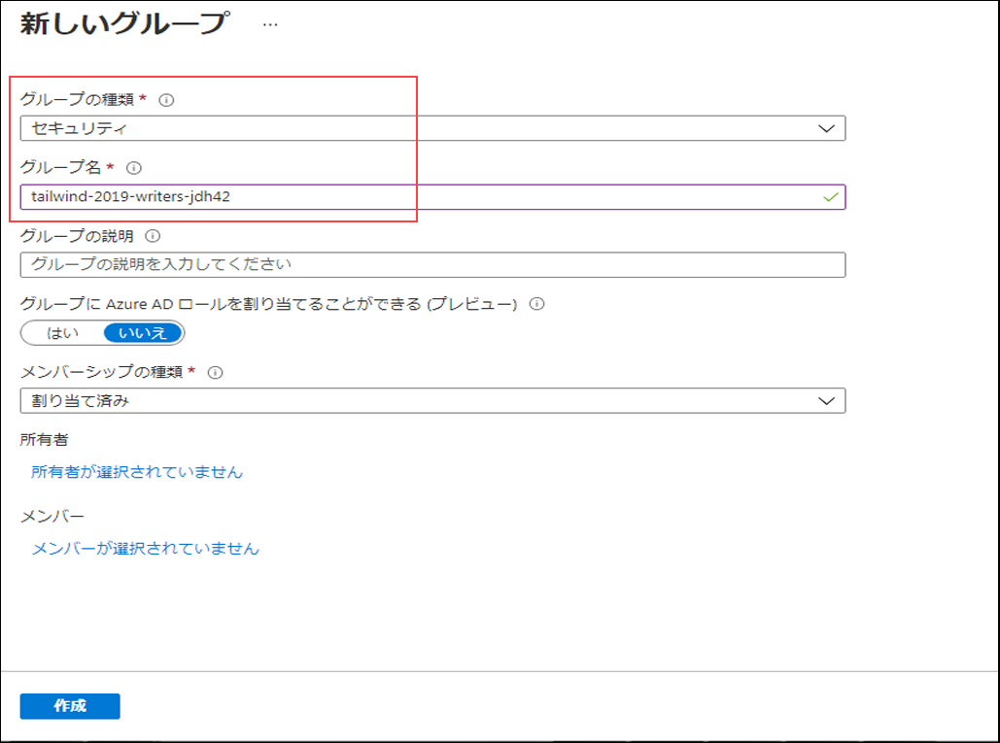

### タスク 2: グループ メンバーを追加する

許可をテストするため、`tailwind-readers-<suffix>` グループに独自のアカウントを追加します。

1. 新しく作成された **`tailwind-readers-<suffix>`** グループを開きます。

2. 左側で 「**メンバー**」 (1) を選択してから 「**+ メンバーの追加**」 (2) を選択します。

    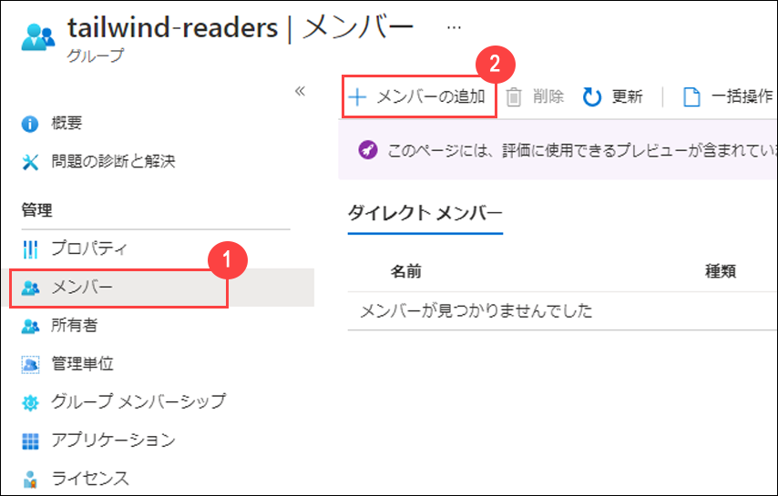

3. ラボにサインインした際に使用したユーザー アカウントを追加し、「**選択**」 を選びます。

    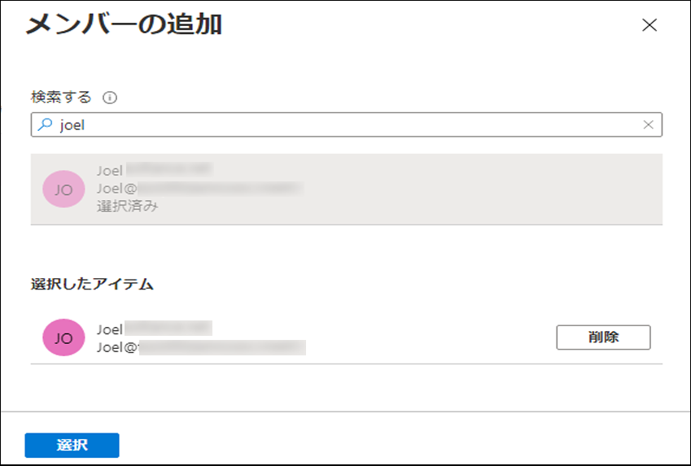

4. **`Tailwind-2019-writers-<suffix>`** グループを開きます。

5. 左側で 「**メンバー**」 (1) を選択してから 「**+ メンバーの追加**」 (2) を選択します。

    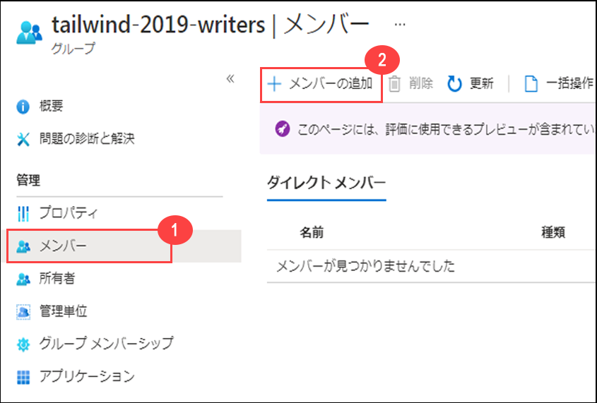

6. `tailwind` を検索し、**`tailwind-current-writers-<suffix>`** グループを選択してから 「**選択**」 を選びます。

    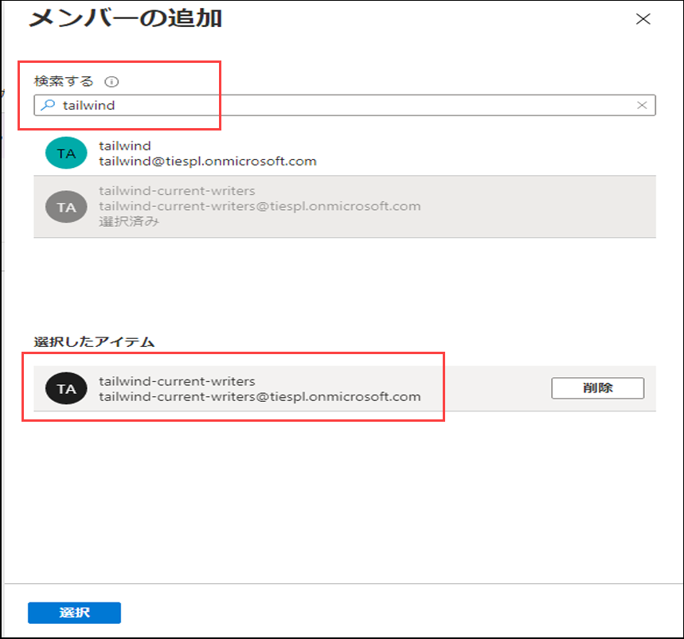

7. 左側のメニューで 「**概要**」 を選択し、**オブジェクト ID** を**コピー**します。

    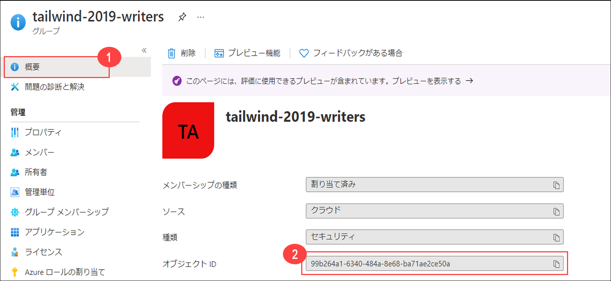

    > **注**: **オブジェクト ID** の値をメモ帳などのテキスト エディターに保存します。これは後ほど、ストレージ アカウントでアクセス制御を割り当てる際に使用されます。

### タスク 3: データ レイクのセキュリティを構成する - ロールベースのアクセス制御 (RBAC)

1. このラボの Azure リソース グループを開きます。この中には Synapse Analytics ワークスペースが含まれています。

2. 既定のデータ レイク ストレージ アカウントを開きます。

    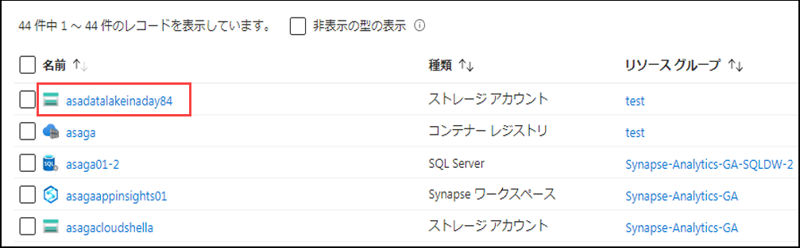

3. 左側のメニューで 「**アクセス制御 (IAM)**」 を選択します。

    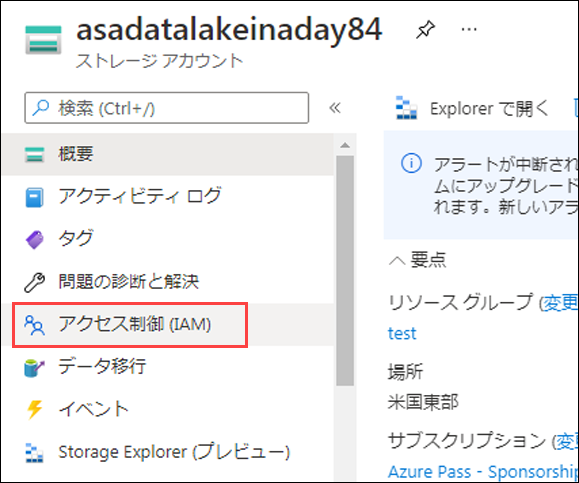

4. 「**ロールの割り当て**」 タブを選択します。

    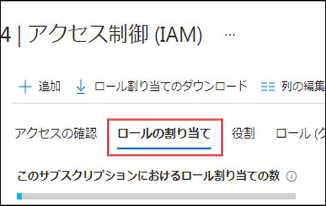

5. 「**+ 追加**」 を選択した後、「**ロールの割り当ての追加**」 を選択します。

    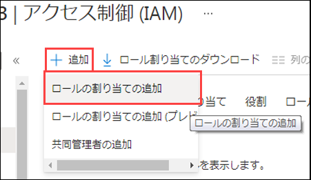

6. 「**ロール**」 で **`Storage Blob Data Reader`** を選択します。**`tailwind-readers`** を検索し、結果から `tailwind-readers-<suffix>` を選択して 「**保存**」 を選択します。

    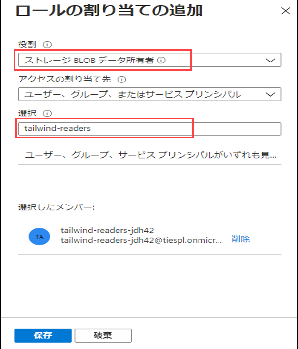

    ユーザー アカウントがこのグループに追加されたので、このアカウントの BLOB コンテナーであらゆるファイルの読み取りアクセスを取得できます。Tailwind Traders はユーザー全員を `tailwind-readers-<suffix>` セキュリティ グループに追加する必要があります。

7. 「**+ 追加**」 を選択した後、「**ロールの割り当ての追加**」 を選択します。

    

8. 「**ロール**」 で **`Storage Blob Data Owner`** を選択します。**`tailwind`** を検索し、結果から **`tailwind-history-owners-<suffix>`** を選択して 「**保存**」 を選択します。

    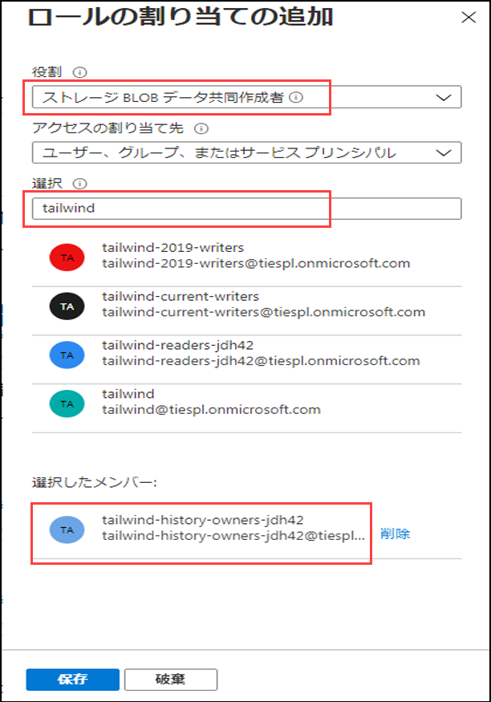

    データ レイクが含まれている Azure Storage アカウントで、`tailwind-history-owners-<suffix>` セキュリティ グループが Azure Storage 組み込み RBAC ロール `Storage Blob Data Owner` に割り当てられました。この役割に追加された Azure AD ユーザーとサービス プリンシパルは、あらゆるデータを修正できるようになります。

    Tailwind Traders は、あらゆる履歴データを修正する許可のあるユーザー セキュリティ プリンシパルを `tailwind-history-owners-<suffix>` セキュリティ グループに追加する必要があります。

9. ストレージ アカウントの 「**アクセス制御 (IAM)**」 リストの 「**Storage Blob Data Owner**」 のロール **(1)** で Azure ユーザー アカウントを選択してから 「**削除**」 (2) を選択します。

    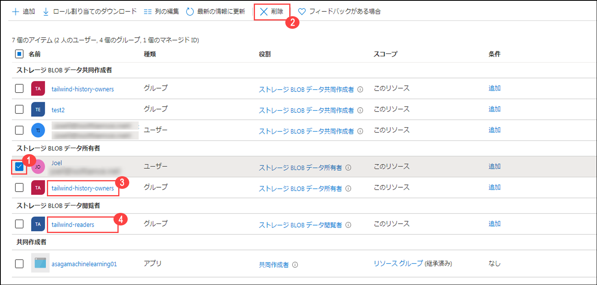

    `Tailwind-history-owners-<suffix>` グループが **Storage Blob Data Owner** グループ **(3)** に割り当てられ、`tailwind-readers-<suffix>` は **Storage Blob Data Reader** グループ **(4)** に割り当てられていることがわかります。

    > **注**: 新しいロールの割り当てをすべて表示するには、リソース グループに戻ってからこの画面に戻る必要があるかもしれません。

### タスク 4: データ レイクのセキュリティを構成する - アクセス制御リスト (ACL)

1. 左側のメニューで 「**ストレージ エクスプローラー (プレビュー)**」 を選択します**(1)**。CONTAINERS を展開し、**wwi-02** コンテナー **(2)** を選択します。**Sale-small** フォルダー **(3)** を開き、**Year=2019** フォルダー **(4)** を右クリックしてから、「**アクセスの管理..**」 ** (5)** を選択します。

    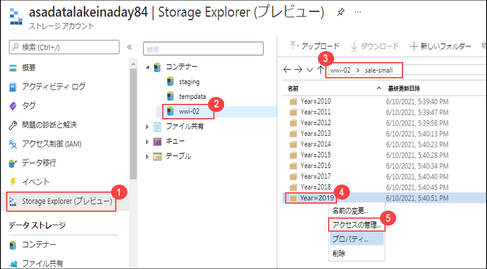

2. **`Tailwind-2019-writers-<suffix>`** セキュリティ グルー鵜からコピーした **オブジェクト ID** の値を 「**ユーザー、グループ、またはサービス プリンシパルを追加する**」 テキスト ボックスに貼り付け、「**追加**」 を選択します。

    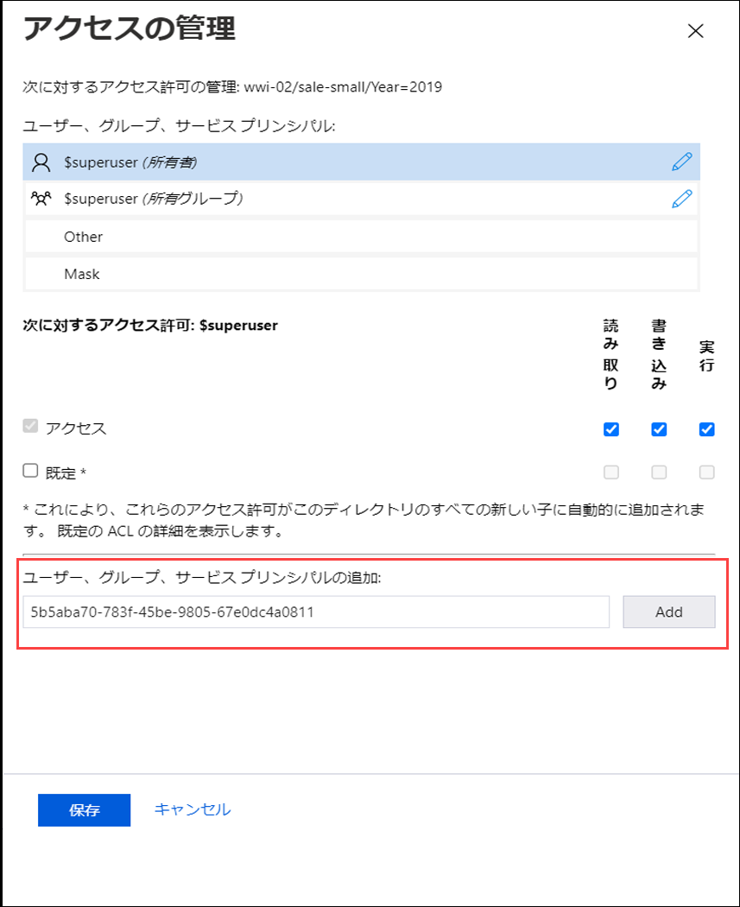

3. これで、`tailwind-2019-writers-<suffix>` グループが 「アクセスの管理」 ダイアログで選択されているはずです **(1)**。「**アクセス**」 と 「**既定**」 チェックボックス、および 「**読み取り**」、「**書き込み**」、「**実行**」 チェックボックスをそれぞれ選択し **(2)**、「**保存**」 を選択します。

    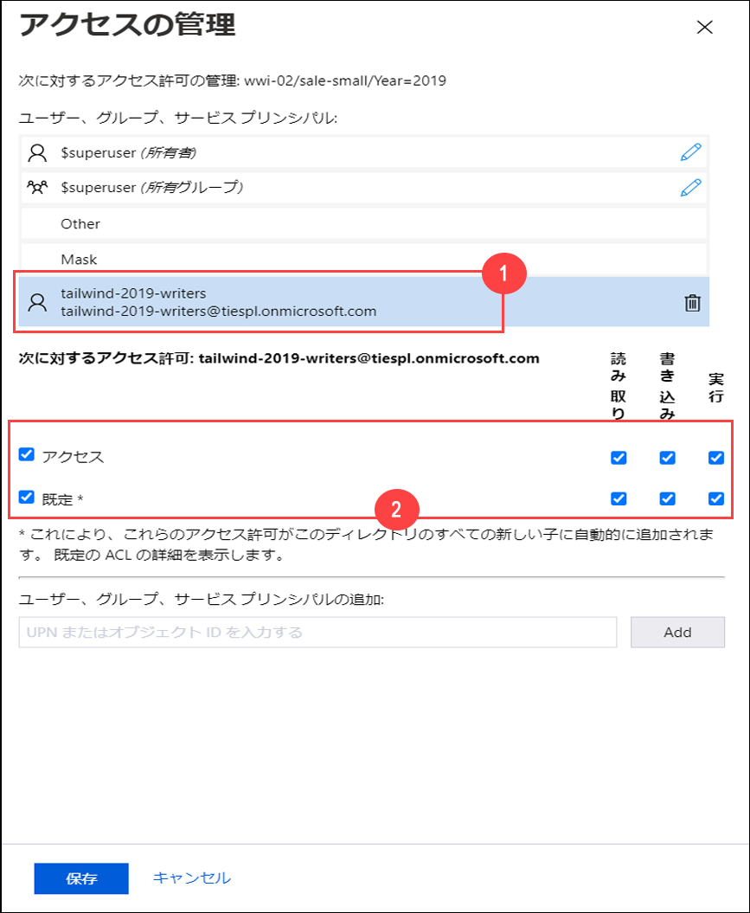

    これで、`tailwind-2019-writers-<suffix>` グループを使用して、`tailwind-current-<suffix>` セキュリティ グループに追加されたユーザーが `Year=2019` フォルダーに書き込めるようにセキュリティ ACL が設定されました。これらのユーザーは現在 (この場合は 2019 年) の売上ファイルのみを管理できます。

    翌年度の始めに、2019 年度のデータへの書き込みアクセスを無効にするには、`tailwind-current-writers-<suffix>` セキュリティ グループを `tailwind-2019-writers-<suffix>` グループから削除します。`Tailwind-readers-<suffix>` のメンバーは引き続きファイル システムのコンテンツを読み取れます。ACL ではなく、ファイル システム レベルで RBAC 組み込みロールによって読み取り・実行 (リスト) 許可を与えられているためです。

    この構成では、_アクセス_ ACL と_既定_ ACL を両方とも設定しました。

    *アクセス* ACL はオブジェクトへのアクセスを制御します。ファイルとディレクトリの両方にアクセス ACL があります。

    *既定* ACL は、ディレクトリに関連付けられた ACL のテンプレートです。この ACL によって、そのディレクトリの下に作成されるすべての子項目のアクセス ACL が決まります。ファイルには既定の ACL がありません。

    アクセス ACL と既定の ACL はどちらも同じ構造です。

### タスク 5: 許可をテストする

1. Synapse Studio で 「**データ**」 ハブに移動します。

    

2. 「**リンク**」 タブ **(1)** を選択して **Azure Data Lake Storage Gen2** を展開します。`asaworkspaceXX` プライマリ ADLS Gen2 アカウント **(2)** を展開し、**`wwi-02`** コンテナー **(3)** を選択します。`sale-small/Year=2016/Quarter=Q4/Month=12/Day=20161231` フォルダー **(4)** に移動します。`Sale-small-20161231-snappy.parquet` ファイル **(5)** を右クリックし、「**新しい SQL スクリプト**」 (6) を選択してから 「**上位 100 行を選択**」 (7) を選びます。

    

3. クエリ ウィンドウの上にある `Connect to` ドロップダウン リストで 「**組み込み**」 **(1)** が選択されていることを確認し、クエリを実行します **(2)**。サーバーレス SQL プール エンドポイントによってデータが読み込まれ、通常のリレーショナル データベースからのデータと同様に処理されます。

    

    セル出力には、Parquet ファイルの出力結果が表示されます。

    

    `tailwind-readers-<suffix>` セキュリティ グループによって割り当てられ、その後、**Storage Blob Data Reader** のロールによってストレージ アカウントで RBAC 許可を授与された Parquet ファイルの読み取り許可を使用することで、ファイルの内容を表示できます。

    ただし、アカウントは **Storage Blob Data Owner** のロールから削除され、`tailwind-history-owners-<suffix>` セキュリティ グループには追加されていないため、このディレクトリに書き込もうとするとどうなるのでしょう?

    試しにやってみましょう。

4. 「**データ**」 ハブで再び 「**リンク**」 タブ **(1)** を選択して **Azure Data Lake Storage Gen2** を展開します。`asaworkspaceXX` プライマリ ADLS Gen2 アカウント **(2)** を展開し、**`wwi-02`** コンテナー **(3)** を選択します。`sale-small/Year=2016/Quarter=Q4/Month=12/Day=20161231` フォルダー **(4)** に移動します。`sale-small-20161231-snappy.parquet` ファイル **(5)** を右クリックし、「**新しいノートブック**」 (6) を選択してから 「**DataFrame に読み込む**」 (7) を選びます。

    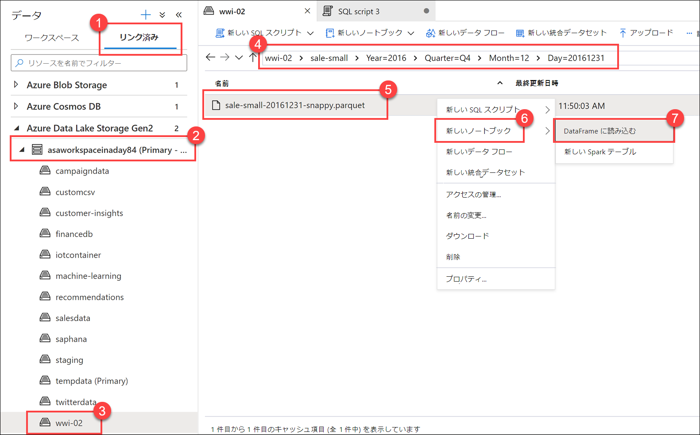

5. Spark プールをノートブックに添付します。

    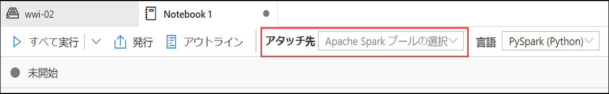

6. ノートブックで **+** を選択した後、セル 1 で **</> コード セル**を選択し、新しいコード セルを追加します。

    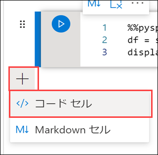

7. 新しいセルに以下を入力し、**Parquet パスをセル 1 からコピー**して、その値を貼り付け、`REPLACE_WITH_PATH` **(1)** を置き換えます。ファイル名の最後に `-test` を追加して Parquet ファイルの名前を変更します **(2)**。

    ```python
    df.write.parquet('REPLACE_WITH_PATH')
    ```

    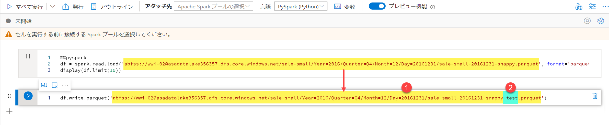

8. ツールバーで 「**すべて実行**」 を選択して両方のセルを実行します。Spark プールを起動してセルを実行すると、数分後にセル 1 の出力にファイル データが表示されます **(1)**。ただし、セル 2 の出力には「**403 エラー**」と表示されるはずです **(2)**。

    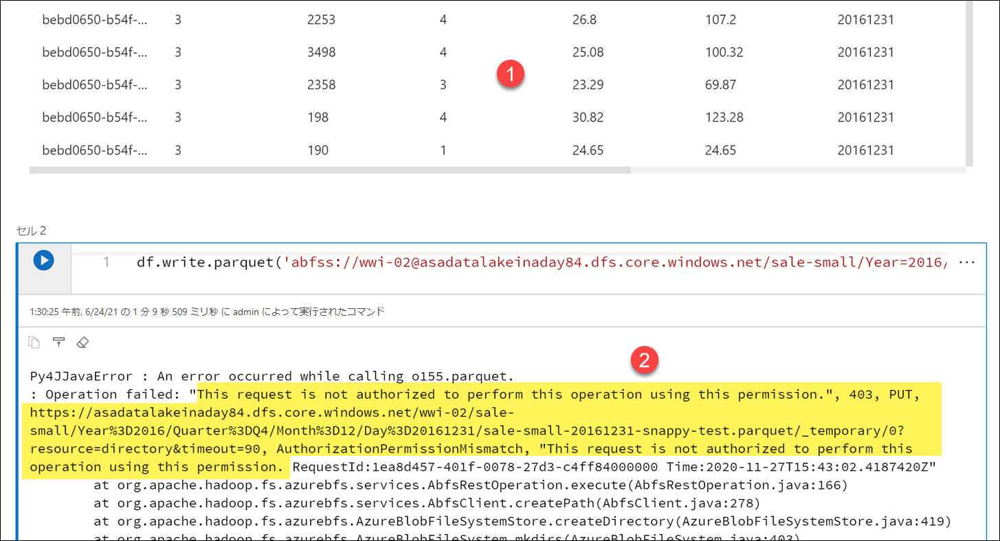

    予想していたとおり、書き込み許可はありません。セル 2 で返されるエラーは、`This request is not authorized to perform this operation using this permission.` というメッセージで、ステータス コードは 403 です。

9. ノートブックを開いたままにして、別のタブで Azure portal (<https://portal.azure.com>) に戻ります。

10. Azure メニュー **(1)** を選択してから **Azure Active Directory (2)** を選択します。

    

11. 左側のメニューで 「**グループ**」 を選択します。

    

12. 検索ボックスに **`tailwind`** と入力し **(1)**、結果で **`tailwind-history-owners-<suffix>`** を選択します **(2)**。

    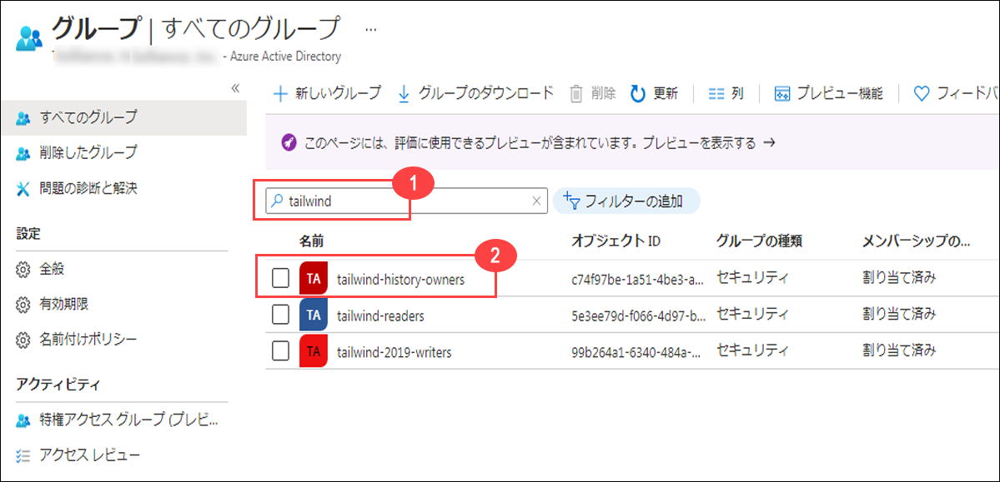

13. 左側で 「**メンバー**」 (1) を選択してから 「**+ メンバーの追加**」 (2) を選択します。

    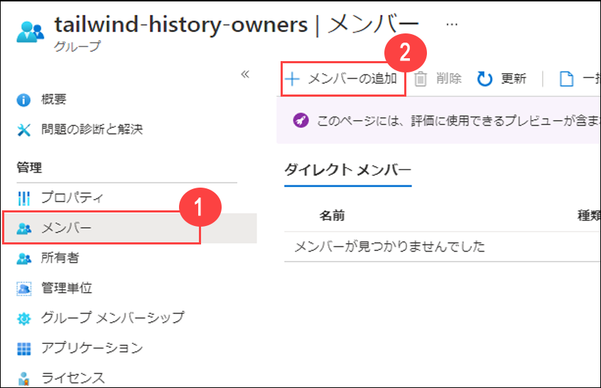

14. ラボにサインインした際に使用したユーザー アカウントを追加し、「**選択**」 を選びます。

    

15. Sunapse Studio で開いたままにしておいた Synapse ノートブックに戻り、セル 　2 をもう一度**実行**します **(1)**。しばらくすると、「**成功**」 (2) というステータスが表示されるはずです。

    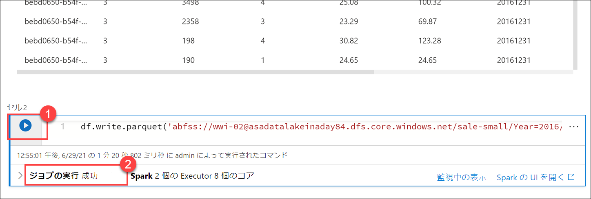

    今回、セルが成功したのは、**Storage Blob Data Owner** のロールを割り当てられているアカウントを `tailwind-history-owners-<suffix>` グループに追加したためです。

    > **注**: 今回も同じエラーが発生した場合は、ノートブックで** Spark セッションを中止**してから 「**すべて公開**」 を選択し、公開してください。変更の公開後、ページの右上コーナーでユーザー プロファイルを選択して**ログアウト**します。ログアウト後に**ブラウザー タブを閉じ**、Synapse Studio (<https://web.azuresynapse.net/>) を再起動してノートブックを再び開き、セルを再実行します。許可を変更するためにセキュリティ トークンを更新しなくてはならない場合に、この操作が必要になります。

    ファイルがデータ レイクに書き込まれているか確認してみましょう。

16. `sale-small/Year=2016/Quarter=Q4/Month=12/Day=20161231` フォルダーに戻ります。ノートブックから書き込んだ新しい `sale-small-20161231-snappy-test.parquet` ファイルのフォルダーが表示されるはずです **(1)**。ここに表示されない場合は、ツールバーで 「**その他**」 **(2)** を選択してから 「**更新**」 (3) を選択してください。

    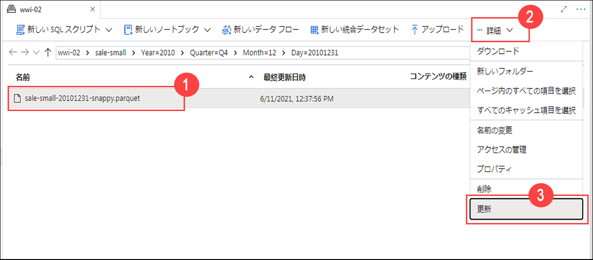
