# モジュール 5 - Apache Spark を使用してデータの探索と変換を行い、データ ウェアハウスに読み込む

このモジュールでは、データ レイクに格納されているデータを探索し、データを変換して、リレーショナル データ ストアにデータを読み込む方法を学びます。受講者は Parquet ファイルと JSON ファイルを探索し、階層構造を使用して JSON ファイルのクエリと変換を実行する技術を使用します。その後、Apache Spark を使用してデータをデータ ウェアハウスに読み込み、データ レイクの Parquet データを専用 SQL プールのデータに統合します。

このモジュールでは、次のことができるようになります。

- Synapse Studio でデータの探索を行う
- Azure Synapse Analytics で Spark ノートブックを使用してデータを取り込む
- Azure Synapse Analytics の Spark プールで DataFrame を使用してデータを変換する
- Azure Synapse Analytics で SQL プールと Spark プールを統合する

## ラボの詳細

- [モジュール 5 - Apache Spark を使用してデータの探索と変換を行い、データ ウェアハウスに読み込む](#module-5---explore-transform-and-load-data-into-the-data-warehouse-using-apache-spark)
  - [ラボの詳細](#lab-details)
  - [ラボの構成と前提条件](#lab-setup-and-pre-requisites)
  - [演習 0: 専用 SQL プールを起動する](#exercise-0-start-the-dedicated-sql-pool)
  - [演習 1: Synapse Studio でデータの探索を行う](#exercise-1-perform-data-exploration-in-synapse-studio)
    - [タスク 1: Azure Synapse Studio でデータ プレビューアを使用してデータを探索する](#task-1-exploring-data-using-the-data-previewer-in-azure-synapse-studio)
    - [タスク 2: サーバーレス SQL プールを使用してファイルを探索する](#task-2-using-serverless-sql-pools-to-explore-files)
    - [タスク 3: Synapse Spark を使用してデータの探索と修正を行う](#task-3-exploring-and-fixing-data-with-synapse-spark)
  - [演習 2: Azure Synapse Analytics で Spark ノートブックを使用してデータを取り込む](#exercise-2-ingesting-data-with-spark-notebooks-in-azure-synapse-analytics)
    - [タスク 1: Azure Synapse 向けの Apache Spark を使用してデータ レイクから Parquet ファイルを取り込んで探索する](#task-1-ingest-and-explore-parquet-files-from-a-data-lake-with-apache-spark-for-azure-synapse)
  - [演習 3: Azure Synapse Analytics の Spark プールで DataFrame を使用してデータを変換する](#exercise-3-transforming-data-with-dataframes-in-spark-pools-in-azure-synapse-analytics)
    - [タスク 1: Azure Synapse で Apache Spark を使用して JSON データのクエリと変換を実行する](#task-1-query-and-transform-json-data-with-apache-spark-for-azure-synapse)
  - [演習 4: Azure Synapse Analytics で SQL プールと Spark プールを統合する](#exercise-4-integrating-sql-and-spark-pools-in-azure-synapse-analytics)
    - [タスク 1: ノートブックを更新する](#task-1-update-notebook)

## ラボの構成と前提条件

> **注:** ホストされたラボ環境を**使用しておらず**、ご自分の Azure サブスクリプションを使用している場合は、`Lab setup and pre-requisites`の手順のみを完了してください。その他の場合は、演習 0 にスキップします。

このモジュールの**[ラボの構成手順](https://github.com/solliancenet/microsoft-data-engineering-ilt-deploy/blob/main/setup/04/README.md)を完了**してください。

以下のモジュールは、同じ環境を共有している点に留意してください。

- [モジュール 4](labs/04/README.md)
- [モジュール 5](labs/05/README.md)
- [モジュール 7](labs/07/README.md)
- [モジュール 8](labs/08/README.md)
- [モジュール 9](labs/09/README.md)
- [モジュール 10](labs/10/README.md)
- [モジュール 11](labs/11/README.md)
- [モジュール 12](labs/12/README.md)
- [モジュール 13](labs/13/README.md)
- [モジュール 16](labs/16/README.md)

## 演習 0: 専用 SQL プールを起動する

このラボでは専用 SQL プールを使用します。最初の手順として、これが一時停止状態でないことを確認してください。一時停止している場合は、以下の手順に従って起動します。

1. Synapse Studio (<https://web.azuresynapse.net/>) を開きます。

2. [**管理**] ハブを選択します。

    

3. 左側のメニューで [**SQL プール**] を選択します **(1)**。専用 SQL プールが一時停止状態の場合は、プールの名前の上にマウスを動かして [**再開**]  (2) を選択します。

    

4. プロンプトが表示されたら、[**再開**] を選択します。プールが再開するまでに、1 ～ 2 分かかります。

    ![[再開] ボタンが強調表示されています。](media/resume-dedicated-sql-pool-confirm.png "Resume")

> 専用 SQL プールが再開する間、**続行して次の演習に進みます**。

## 演習 1: Synapse Studio でデータの探索を行う

データ インジェスト中にデータ エンジニアが最初に行うタスクのひとつは通常、インポートされるデータを探索することです。データ探索により、エンジニアはインジェストされるファイルの内容をよりよく理解できます。このプロセスは、自動インジェスト プロセスの障害になる可能性があるデータの品質の問題を特定する上で役立ちます。探索により、データの種類やデータの品質のほか、データをデータ レイクにインポートする前、または分析ワークロードで使用する前にファイル上で処理が必要かどうかを把握できます。

一部の売上データをデータ ウェアハウスに取り込んでいる際に問題が発生したため、Synapse Studio を使用して問題を解決できる方法を知りたいというリクエストが Tailspin Traders のエンジニアから届きました。このプロセスの最初の手順として、データを探索し、何が問題の原因となっているのか突き止めて解決策を提供する必要があります。

### タスク 1: Azure Synapse Studio でデータ プレビューアを使用してデータを探索する

Azure Synapse Studio には、シンプルなプレビュー インターフェイスから、Synapse Spark ノートブックを使用したより複雑なプログラミング オプションにいたるまで多数のデータ探索方法が備えられています。この演習では、このような機能を利用して、問題のあるファイルの探索、識別、修正を行う方法をが学びます。データ レイクの `wwi-02/sale-poc` フォルダーに格納されている CSV ファイルを探索し、問題の識別・修正方法を学習します。

1. Synapse Studio (<https://web.azuresynapse.net/>) を開き、[**データ**] ハブに移動します。

    ![[データ] ハブが強調表示されています。](media/data-hub.png "Data hub")

    > [データ] ハブから、ワークスペース内のプロビジョニングされた SQL プール データベースと SQL サーバーレス データベースのほか、ストレージ アカウントやその他のリンク サービスなどの外部データ ソースにアクセスできます。

2. ここでは、ワークスペースのプライマリ データ レイクに格納されたファイルにアクセスしたいので、[データ] ハブ内で [**リンク済み**] タブを選択します。

    ![[リンク済み] タブがデータ ハブ内で強調表示されています。](media/data-hub-linked-services.png "Data hub Linked services")

3. [リンク済み] タブで **Azure Data Lake Storage Gen2** を展開した後、ワークスペース用に**プライマリ** データ レイクを展開します。

    ![[リンク済み] タブで ADLS Gen2 が展開され、プライマリ データ レイク アカウントが展開され強調表示されています。](media/data-hub-adls-primary.png "ADLS Gen2 Primary Storage Account")

4. プライマリ データ レイク ストレージ アカウント内のコンテナーのリストで、`wwi-02` コンテナーを選択します。

    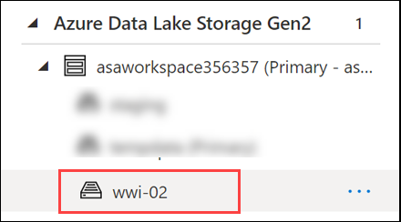

5. コンテナー エクスプローラー ウィンドウで、`sale-poc` フォルダーをダブルクリックして開きます。

    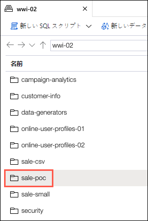

6. `sale-poc` には、2017 年 5 月の売上データが含まれています。フォルダーには、31 ファイルが含まれています。1 日につき 1 つのファイルです。これらのファイルは一時的なプロセスによって、Tailspin のインポート プロセスに関して問題のあるアカウントにインポートされました。数分かけて一部のファイルを探索してみましょう。

7. `Sale-20170501.csv` リストで最初のファイルを右クリックし、コンテキスト メニューから [**プレビュー**] を選択します。

    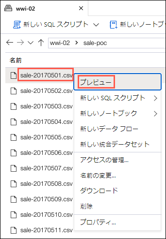

8. Synapse Studio の [**プレビュー**] では、コードを書かなくてもファイルのコンテンツをすばやく調べることができます。これは、個々のファイルに格納されているデータの特徴 (列) と種類を基本的に把握できる効果的な方法です。

    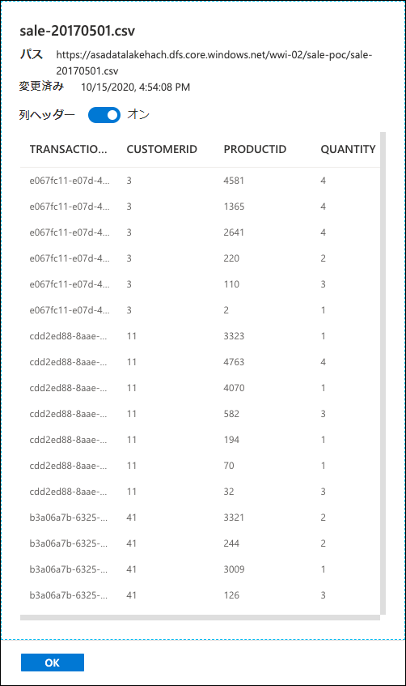

    > `sale-20170501.csv` の [プレビュー] ダイアログをスクロールして、ファイルのプレビューを確認します。スクロール ダウンすると、プレビューに含まれる行数が限定されていますが、ファイルの構造を確認することはできます。右側にスクロールすると、ファイルに含まれているテルの数と名前が表示されます。

9. [**OK**] を選択して、`sale-20170501.csv` ファイルのプレビューを閉じます。

10. データ探索を行う際は、複数のファイルを見てみることが重要です。データのより代表的なサンプルを確認できます。`wwi-02\sale-poc` フォルダーで次のファイルを見てみましょう。`Sale-20170502.csv` ファイルを右クリックして、コンテキスト メニューから [**プレビュー**] を選択します。

    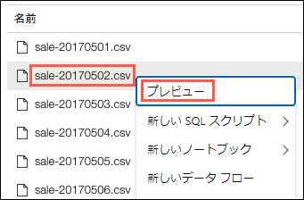

11. [プレビュー] ダイアログで、このファイルの構造が `sale-20170501.csv` ファイルとは異なることがすぐにわかります。プレビューにはデータ行が表示されず、列のヘッダーにはフィールド名ではなくデータが含まれています。

    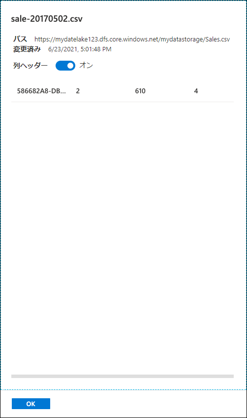

12. [プレビュー] ダイアログで、[**With column header** (列のヘッダーを付ける)] オプションをオフにする必要があります。このファイルには列のヘッダーが含まれていないので、これをオフに設定して、結果を調べます。

    ![sale-20170502.csv ファイルのプレビュー ダイアログが表示され、[列のヘッダーを付ける] オプションがオフになっています。](media/sale-20170502-csv-preview-with-column-header-off.png "CSV File preview")

    > [**With column headers** (列のヘッダーを付ける)] オプションをオフにすると、ファイルに列のヘッダーが含まれていないことを確認できます。ヘッダーではすべての行に "(NO COLUMN NAME)" が含まれています。この設定により、データは適切に下方に移されます。これは 1 行のみのようです。右にスクロールすると、行は 1 行しかないように見える一方、最初にプレビューしたファイルよりも列が多いことがわかります。11 列が含まれています。

13. 2 つの異なるファイル構造を見てきましたが、別のファイルを確認し、`sale-poc` フォルダーではどのファイル形式がより典型的なのかチェックしましょう。`sale-20170503.csv` という名前のファイルを右クリックし、以前と同様に [**プレビュー**] を選択します。

    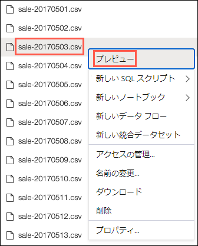

14. プレビューに `sale-20170503.csv` ファイルが表示され、構造は `20170501.csv` に類似しているようです。

    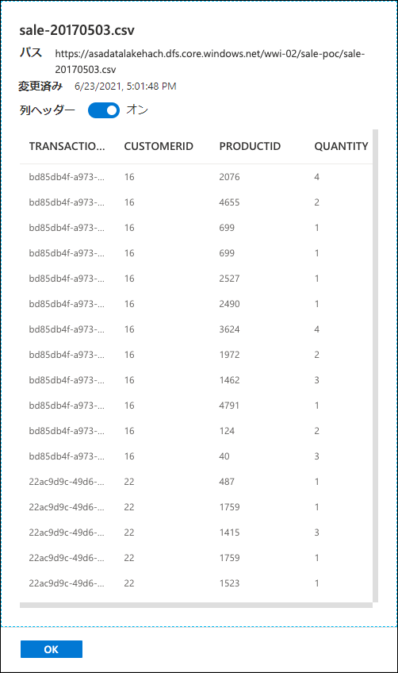

15. [**OK**] を選択してプレビューを閉じます。

16. ここで数分かけて、`sale-poc` フォルダーの他のファイルもプレビューしてみましょう。5 月 1 日および 3 日のファイルと同じ構造でしょうか?

### タスク 2: サーバーレス SQL プールを使用してファイルを探索する

Synapse Studio の**プレビュー**機能を使用すると、ファイルをすばやく探索できますが、データをより詳細に確認したり、問題のあるファイルの情報を得たりすることはできません。このタスクでは、Synapse の**サーバーレス SQL プール (組み込み)** 機能を使用して、T-SQL でこれらのファイルを探索します。

1. `sale-20170501.csv` ファイルを再び右クリックしてください。今回は、コンテキスト メニューから [**新しい SQL スクリプト**] と [**上位 100 行を選択**] を選択します。

    ![sale-20170501.csv ファイルのコンテキスト メニューで、[新しい SQL スクリプト] と [上位 100 行を選択] が強調表示されています。](media/sale-20170501-csv-context-menu-new-sql-script.png "File context menu")

2. 新しい SQL スクリプトのタブが Synapse Studio で開きます。ファイルの最初の 100 行を読み取るための `SELECT` ステートメントが含まれています。これは、ファイルの内容を調べるもうひとつの方法です。調べる行数を限定することで、探索プロセスをスピードアップできます。ファイル内ですべてのデータを読み込むクエリは実行に時間がかかるのです。

    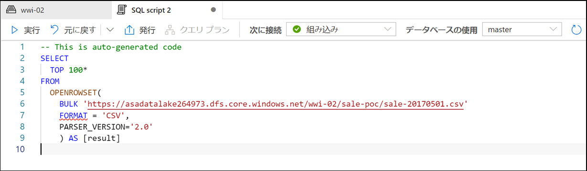

    > データ レイクに格納されているファイルに対する T-SQL クエリでは、`OPENROWSET` 関数を利用します。`OPENROWSET` という名前のテーブルと同様に、`OPENROWSET` 関数はクエリの `FROM` 句で参照できます。組み込み `BULK` プロバイダーによる一括操作がサポートされ、ファイルのデータを行セットとして読み取り、返すことができます。詳細については、[OPENROWSET ドキュメント](https://docs.microsoft.com/azure/synapse-analytics/sql/develop-openrowset)を参照してください。

3. ツールバーで [**実行**] を選択してクエリを実行します。

    ![SQL ツールバーの [実行] ボタンが強調表示されています。](media/sql-on-demand-run.png "Synapse SQL toolbar")

4. [**結果**] ペインで出力を確認します。

    

    > 結果では、列ヘッダーが含まれている最初の行がデータ行となり、列に `C1` - `C11` の名前が割り当てられていることがわかります。`OPENROWSET` 関数の `FIRSTROW` パラメーターを使用すると、データとして表示するファイルの最初の行の数を指定できます。既定値は 1 です。ファイルにヘッダー行が含まれている場合は、値を 2 に設定すると列のヘッダーをスキップできます。その後、`WITH` 句を使用すると、ファイルに関連のあるスキーマを指定できます。

5. クエリを修正して、ヘッダー行をスキップするよう指示してみましょう。クエリ ウィンドウで、以下のコード スニペットを `PARSER_VERSION='2.0'` の直後に挿入します。

    ```sql
    , FIRSTROW = 2
    ```

6. 次に、以下の SQL コードを挿入して、最後の `)` と `AS [result]` の間でスキーマを指定します。

    ```sql
    WITH (
        [TransactionId] varchar(50),
        [CustomerId] int,
        [ProductId] int,
        [Quantity] int,
        [Price] decimal(10,3),
        [TotalAmount] decimal(10,3),
        [TransactionDate] varchar(8),
        [ProfitAmount] decimal(10,3),
        [Hour] int,
        [Minute] int,
        [StoreId] int
    )
    ```

7. 最終的なクエリは以下のようになるはずです (`[YOUR-DATA-LAKE-ACCOUNT-NAME]` はプライマリ データ レイク ストレージ アカウントの名前です)。

    ```sql
    SELECT
        TOP 100 *
    FROM
        OPENROWSET(
            BULK 'https://[YOUR-DATA-LAKE-ACCOUNT-NAME].dfs.core.windows.net/wwi-02/sale-poc/sale-20170501.csv',
            FORMAT = 'CSV',
            PARSER_VERSION='2.0',
            FIRSTROW = 2
        ) WITH (
            [TransactionId] varchar(50),
            [CustomerId] int,
            [ProductId] int,
            [Quantity] int,
            [Price] decimal(10,3),
            [TotalAmount] decimal(10,3),
            [TransactionDate] varchar(8),
            [ProfitAmount] decimal(10,3),
            [Hour] int,
            [Minute] int,
            [StoreId] int
        ) AS [result]
    ```

    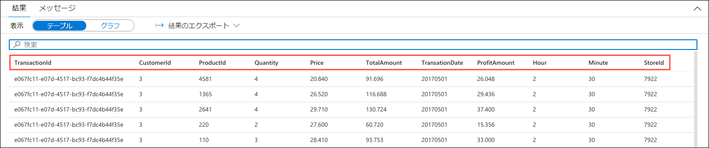

    > `OPENROWSET` 関数を使用すると、T-SQL 構文でデータをさらに探索できます。たとえば、`WHERE` 句を使用すると `null` または高度な分析ワークロードでデータを使用する前に対応する必要のある他の値について、さまざまなフィールドをチェックできます。スキーマを指定すると、名前を使ってフィールドを参照し、このプロセスを容易にすることが可能です。

8. SQL スクリプト タブを閉じるには、タブ名の左にある `X` を選択してください。

    ![[閉じる] (X) ボタンが Synapse Studio の [SQL スクリプト] タブで強調表示されています。](media/sale-20170501-csv-sql-script-close.png "Close SQL script tab")

9. プロンプトが表示されたら、[**変更を破棄しますか?**] ダイアログで [**変更を破棄して閉じる**] を選択します。

    ![[変更を破棄して閉じる] が[変更を破棄する] ダイアログで強調表示されています。](media/sql-script-discard-changes-dialog.png "Discard changes?")

10. **プレビュー**機能を使用している際、`sale-20170502.csv` ファイルの形式が不良であることが判明しました。T-SQL を使用して、このファイルのデータに関する詳しい情報を得られるか見てみましょう。`wwi-02` タブに戻り、`sale-20170502.csv` ファイルを右クリックして [**新しい SQL スクリプト**] と [**上位 100 行を選択**] を選択します。

    ![wwi-02 タブが強調表示され、sale-20170502.csv のコンテキスト メニューが表示されます。[新しい SQL スクリプト] と [上位 100 行を選択] がコンテキスト メニューで強調表示されています。](media/sale-20170502-csv-context-menu-new-sql-script.png "File context menu")

11. 以前と同様、ツールバーで [**実行**] を選択してクエリを実行します。

    ![SQL ツールバーの [実行] ボタンが強調表示されています。](media/sql-on-demand-run.png "Synapse SQL toolbar")

12. このクエリを実行するとエラーが発生し、`Error handling external file: 'Row larger than maximum allowed row size of 8388608 bytes found starting at byte 0.'` と [**メッセージ**] ペインに表示されます。

    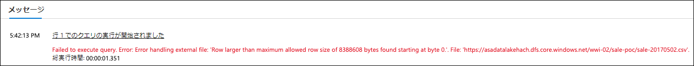

    > このエラーは、このファイルのプレビュー ウィンドウに表示されていたものと同じです。プレビューでは、データは列に分割されていましたが、すべてのデータが 1 行に含まれていました。これは、既定のフィールド区切り記号 (コンマ) を使用してデータが列に分割されていることを示唆します。ただし、行の終端記号 `\r` が欠落しているようです。

13. この時点では、`sale-20170502.csv` ファイルは形式の不良な CSV ファイルであることがわかっており、問題を解決するためにファイルの形式についてよりよく理解する必要があります。T-SQL には、行の終端記号についてファイルのクエリを行う機能がないため、[Notepad++](https://notepad-plus-plus.org/downloads/) のようなツールを利用してこれを確認することができます。

    > Notepad++ がインストールされていない場合は、次の 3 つの手順は参考としてご覧ください。

14. `sale-20170501.csv` と `sale-20170502.csv` ファイルをデータ レイクからダウンロードし、[Notepad++](https://notepad-plus-plus.org/downloads/) で開きます。ファイル内に行の最後の記号が表示されます。

    > 行の終端記号を表示するには、Notepad++ で [**ビュー**] メニューを開き、[**記号の表示**] を選択してから [**行末を表示**] を選択します。
    >
    > ![Notepad++ の [ビュー] メニューが強調表示され、展開されています。[ビュー] メニューで [記号の表示] が選択されており、[行末を表示] が選択され強調表示されています。](media/notepad-plus-plus-view-symbol-eol.png "Notepad++ View menu")

15. Notepad++ で `sale-20170501.csv` ファイルを開くと、形式の良好なファイルには各行の終端に改行 (LF) 記号が含まれていることがわかります。

    

16. Notepad++ で `sale-20170502.csv` ファイルを開くと、行の集団記号がないことがわかります。データは CSV ファイルに 1 行として入力されており、コンマのみで各フィールド値が分離されています。

    

    > このファイルのデータは 1 行で構成されていますが、どこで行を区切るべきなのかわかります。TransactionId GUID の値が、行の 11 番目のフィールドごとに表示されています。これは、処理中にファイルで何らかのエラーが発生したことを示唆します。これにより、列のヘッダーと行の区切り記号がファイルから欠落しているのです。

17. ファイルを修正するには、コードを使う必要があります。T-SQL と Synapse パイプラインには、このタイプの問題に効率よく対応できる機能が備わっていません。このファイルの問題に取り組むために、Synapse Spark ノートブックを使用する必要があります。

### タスク 3: Synapse Spark を使用してデータの探索と修正を行う

このタスクでは、Synapse Spark ノートブックを使用してデータ レイクの `wwi-02/sale-poc` フォルダー内のファイルをいくつか探索します。また、Python コードを使用して `sale-20170502.csv` ファイルの問題を修正し、このラボで後ほど Synapse パイプラインを使用してディレクトリのファイルがすべて取り込まれるようにします。

1. Synapse Studio で、[**開発**] ハブを開きます。

    

2. この演習用に Jupyter ノートブックを <https://solliancepublicdata.blob.core.windows.net/notebooks/Lab%202%20-%20Explore%20with%20Spark.ipynb> からダウンロードしてください。`Lab 2 - Explore with Spark.ipynb` という名前のファイルがダウンロードされます。

    このリンクを使うと、新しいブラウザー ウィンドウにそのファイルの内容が表示されます。[ファイル] メニューで [**名前を付けて保存**] を選択します。既定により、ブラウザーはこれをテキスト ファイルとして保存しようとします。オプションがある場合は、`Save as type` を [**すべてのファイル (*.*)**] に設定します。ファイル名の最後が `.ipynb` であることを確認してください。

    ![[名前を付けて保存] ダイアログ](media/file-save-as.png "Save As")

3. [開発] ハブで [新しいリソースの追加] (**+**) ボタンを選択してから [**インポート**] を選択します。

    ![[開発] ハブで [新しいリソースの追加] (+) ボタンが表示され、メニューでは [インポート] が強調表示されています。](media/develop-hub-add-new-resource-import.png "Develop hub import notebook")

4. 手順 2 でダウンロードした **Lab 2 - Explore with Spark** を選択し、[開く] を選択します。

5. ノートブック内の手順に従い、このタスクの残りの部分を完了します。ノートブックを完了したら、このガイドに戻り、次のセクションに進みます。

6. **Lab 2 - Explore with Spark** ノートブックを完了した後、ツールバーの一番右にある [セッションの停止] ボタンをクリックして、次の演習用に Spark クラスターをリリースします。  

Tailwind Traders には、さまざまなデータ ソースからの非構造化ファイルと半構造化ファイルがあります。同社のエンジニアは Spark の専門知識を活用して、これらのファイルの探索、インジェスト、変換を行いたいと考えています。

あなたは、Synapse Notebooks を使用するよう推奨しました。これは Azure Synapse Analytics ワークスペースに東尾ぐされており、Synapse Studio 内から利用できます。

## 演習 2: Azure Synapse Analytics で Spark ノートブックを使用してデータを取り込む

### タスク 1: Azure Synapse 向けの Apache Spark を使用してデータ レイクから Parquet ファイルを取り込んで探索する

Tailwind Traders 社では、Parquet ファイルがデータ レイクに格納されています。社員は、Apache Spark を使用してファイルにすばやくアクセスし、確認できるようにするにはどうすればよいのか知りたいと考えています。

あなたが推奨しているのは、データ ハブを使用して、接続されているストレージ アカウントの Parquet ファイルを表示したうえで、[_新しいノートブック_] コンテキスト メニューを使用して、Spark データフレームと選択した Parquet ファイルの内容を読み込む新しい Synapse ノートブックを作成する方法です。

1. Synapse Studio (<https://web.azuresynapse.net/>) を開きます。

2. [**データ**] ハブを選択します。

    ![[データ] ハブが強調表示されています。](media/data-hub.png "Data hub")

3. [**リンク済み**] タブ **(1)** を選択し、`Azure Data Lake Storage Gen2` グループを展開した後、プライマリ データ レイク ストレージ アカウントを展開します (*名前は、ここに表示されているものとは異なる場合があります。これは、一覧の最初のストレージ アカウントです*)。**Wwi-02** コンテナー **(2)** を選択し、`sale-small/Year=2010/Quarter=Q4/Month=12/Day=20101231` フォルダーを参照します **(3)**.Parquet ファイル **(4)** を右クリックし、[**新しいノートブック**] (5) を選択してから [**DataFrame に読み込む**] (6) を選びます。

    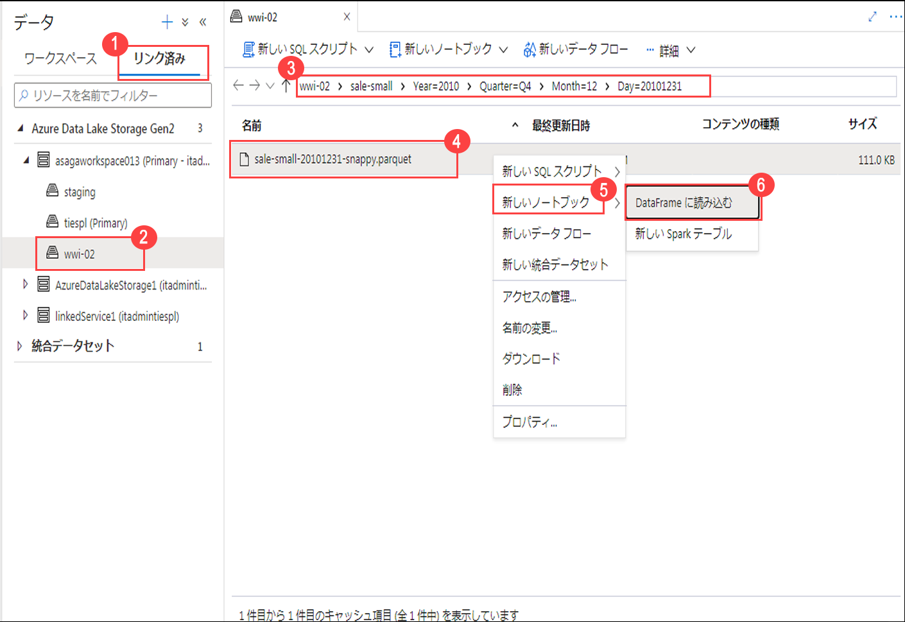

    これにより、Spark データフレームにデータを読み込み、ヘッダー付きで 100 行を表示する PySpark コードを含むノートブックが生成されます。

4. Spark プールがノートブックにアタッチされていることを確認してください。

    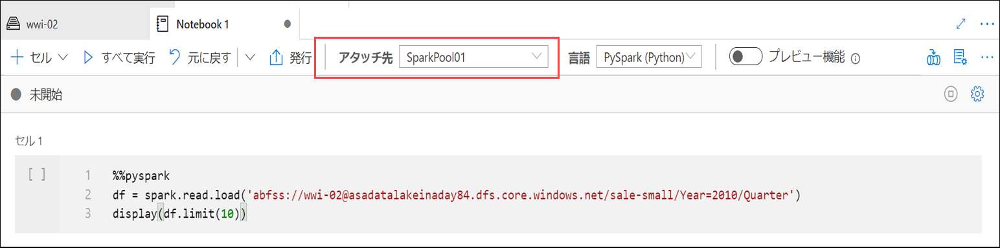

    Spark プールは、すべてのノートブック操作にコンピューティングを提供します。ノートブックの下部を見ると、プールがまだ開始されていないことがわかります。プールがアイドル状態のときにノートブックのセルを実行すると、プールが開始され、リソースが割り当てられます。これは、プールのアイドル状態が長すぎて自動で一時停止しない限り、1 回だけの操作になります。

    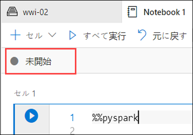

    > 自動一時停止の設定は、[管理] ハブの Spark プール構成で行います。

5. セルのコードの下に以下を追加して、`datalake` という名前の変数を定義します。その値は、プライマリ ストレージ アカウントの名前です (**2 行目で、REPLACE_WITH_YOUR_DATALAKE_NAME 値を、ストレージ アカウントの名前に置き換えます**)。

    ```python
    datalake = 'REPLACE_WITH_YOUR_DATALAKE_NAME'
    ```

    

    この変数は、後でいくつかのセルで使用されます。

6. ノートブックのツールバーで [**すべて実行**] を選択し、ノートブックを実行します。

    ![[すべて実行] が強調表示されています。](media/notebook-run-all.png "Run all")

    > **注:** Spark プールでノートブックを初めて実行すると、Azure Synapse によって新しいセッションが作成されます。これには、3 から 5 分ほどかかる可能性があります。

    > **注:** セルだけを実行するには、セルの上にポインターを合わせ、セルの左側にある [_セルの実行_] アイコンを選択するか、セルを選択してキーボードで **Ctrl + Enter** キーを押します。

7. セルの実行が完了したら、セルの出力でビューを [**グラフ**] に変更します。

    ![[グラフ] ビューが強調表示されています。](media/2010-sale-parquet-table-output.png "Cell 1 output")

    既定では、`display()` 関数を使用すると、セルはテーブル ビューに出力されます。出力には、2010 年 12 月 31 日の Parquet ファイルに格納されている販売トランザクション データが表示されます。**グラフ**の視覚化を選択して、データを別のビューで表示してみましょう。

8. 右側にある [**表示のオプション**] ボタンを選択します。

    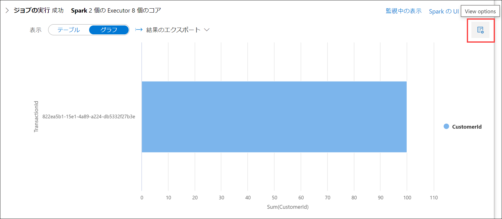

9. キーを **`ProductId`**、値を **`TotalAmount` (1)** に設定し、[**適用**] (2) を選択します。

    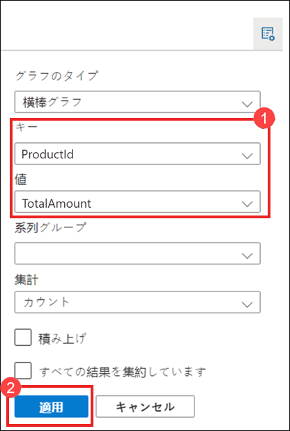

10. グラフを視覚化したものが表示されます。棒の上にポインターを合わせると、詳細が表示されます。

    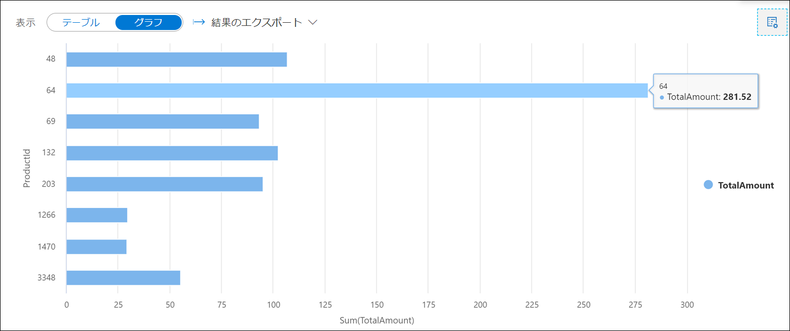

11. その下に新しいセルを作成するには、**+** を選択してから、グラフの下で **</> コード セル** を選択します。

    ![グラフの下にある [コードの追加] ボタンが強調表示されています。](media/chart-add-code.png "Add code")

12. Spark エンジンは、Parquet ファイルを分析し、スキーマを推論できます。そのためには、新しいセルに次のように入力して**実行**します。

    ```python
    df.printSchema()
    ```

    出力は次のようになります。

    ```text
    root
        |-- TransactionId: string (nullable = true)
        |-- CustomerId: integer (nullable = true)
        |-- ProductId: short (nullable = true)
        |-- Quantity: short (nullable = true)
        |-- Price: decimal(29,2) (nullable = true)
        |-- TotalAmount: decimal(29,2) (nullable = true)
        |-- TransactionDate: integer (nullable = true)
        |-- ProfitAmount: decimal(29,2) (nullable = true)
        |-- Hour: byte (nullable = true)
        |-- Minute: byte (nullable = true)
        |-- StoreId: short (nullable = true)
    ```

    Spark がファイルの内容を評価してスキーマを推論します。通常は、この自動推論で、データの探索やほとんどの変換タスクに十分対応できます。ただし、SQL テーブルなどの外部リソースにデータを読み込む場合は、独自のスキーマを宣言し、それをデータセットに適用しなければならない場合があります。ここでは、スキーマは適切であるようです。

13. 次に、データフレームを使用して集計とグループ化の操作を行い、データをより深く理解しましょう。新しいセルを作成し、次のように入力してセルを**実行**します。

    ```python
    from pyspark.sql import SparkSession
    from pyspark.sql.types import *
    from pyspark.sql.functions import *

    profitByDateProduct = (df.groupBy("TransactionDate","ProductId")
        .agg(
            sum("ProfitAmount").alias("(sum)ProfitAmount"),
            round(avg("Quantity"), 4).alias("(avg)Quantity"),
            sum("Quantity").alias("(sum)Quantity"))
        .orderBy("TransactionDate"))
    display(profitByDateProduct.limit(100))
    ```

    > クエリを正常に実行するには、スキーマで定義されている集計関数と型を使用するために、必要な Python ライブラリをインポートします。

    出力には、上のグラフで見たものと同じデータが表示されますが、今度は `sum` と `avg` の集計が含まれています **(1)**。**`alias`** メソッド **(2)** を使用して列名を変更していることに注意してください。

    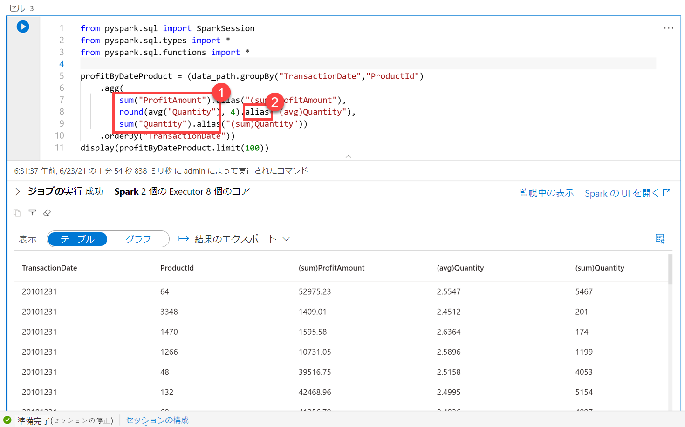

## 演習 3: Azure Synapse Analytics の Spark プールで DataFrame を使用してデータを変換する

### タスク 1: Azure Synapse で Apache Spark を使用して JSON データのクエリと変換を実行する

売上データのほかにも、Tailwind Traders 社には e コマース システムの顧客プロファイル データがあり、過去 12 か月間、サイトの訪問者 (顧客) ごとに上位の商品購入数が提供されます。このデータは、データ レイク内の JSON ファイルに格納されています。これらの JSON ファイルの取り込み、調査、および変換に苦労しているため、ガイダンスを希望しています。これらのファイルには階層構造があり、リレーショナル データ ストアに読み込む前にフラット化したいと考えています。また、データ エンジニアリング プロセスの一部としてグループ化操作と集計操作を適用する必要があります。

Synapse ノートブックを使用して JSON ファイルのデータ変換を探索してから適用することをお勧めします。

1. Spark ノートブックに新しいセルを作成し、次のコードを入力して、セルを実行します。

    ```python
    df = (spark.read \
            .option('inferSchema', 'true') \
            .json('abfss://wwi-02@' + datalake + '.dfs.core.windows.net/online-user-profiles-02/*.json', multiLine=True)
        )

    df.printSchema()
    ```

    > 最初のセルで作成した `datalake` 変数が、ファイル パスの一部としてここで使用されます。

    出力は次のようになります。

    ```text
    root
    |-- topProductPurchases: array (nullable = true)
    |    |-- element: struct (containsNull = true)
    |    |    |-- itemsPurchasedLast12Months: long (nullable = true)
    |    |    |-- productId: long (nullable = true)
    |-- visitorId: long (nullable = true)
    ```

    > `Online-user-profiles-02` ディレクトリ内のすべての JSON ファイルが選択されていることに注意してください。各 JSON ファイルにはいくつかの行が含まれているため、`multiLine=True` オプションを指定しています。また、`inferSchema` オプションを `true` に設定します。これにより、ファイルを確認し、データの性質に基づいてスキーマを作成するように Spark エンジンに指示します。

2. この時点までは、これらのセルで Python コードを使用してきました。SQL 構文を使用してファイルに対してクエリを実行する場合、1 つのオプションとして、データフレーム内のデータの一時ビューを作成する方法があります。`user_profiles` という名前のビューを作成するには、新しいセルで次を実行します。

    ```python
    # create a view called user_profiles
    df.createOrReplaceTempView("user_profiles")
    ```

3. 新しいセルを作成します。Python ではなく SQL を使用するため、`%%sql` マジックを使用してセルの言語を SQL に設定します。セルで次のコードを実行します。

    ```sql
    %%sql

    SELECT * FROM user_profiles LIMIT 10
    ```

    出力には、`productId` と `itemsPurchasedLast12Months` の値の配列を含む `topProductPurchases` の入れ子になったデータが表示されていることに注意してください。各行の右向きの三角形をクリックすると、フィールドを展開できます。

    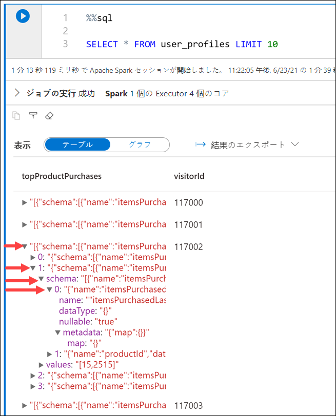

    これにより、データの分析が少し困難になります。これは、JSON ファイルの内容が次のようになっているためです。

    ```json
    「
    {
        "visitorId": 9529082,
        "topProductPurchases": 「
        {
            "productId": 4679,
            "itemsPurchasedLast12Months": 26
        },
        {
            "productId": 1779,
            "itemsPurchasedLast12Months": 32
        },
        {
            "productId": 2125,
            "itemsPurchasedLast12Months": 75
        },
        {
            "productId": 2007,
            "itemsPurchasedLast12Months": 39
        },
        {
            "productId": 1240,
            "itemsPurchasedLast12Months": 31
        },
        {
            "productId": 446,
            "itemsPurchasedLast12Months": 39
        },
        {
            "productId": 3110,
            "itemsPurchasedLast12Months": 40
        },
        {
            "productId": 52,
            "itemsPurchasedLast12Months": 2
        },
        {
            "productId": 978,
            "itemsPurchasedLast12Months": 81
        },
        {
            "productId": 1219,
            "itemsPurchasedLast12Months": 56
        },
        {
            "productId": 2982,
            "itemsPurchasedLast12Months": 59
        }
        ]
    },
    {
        ...
    },
    {
        ...
    }
    ]
    ```

4. PySpark には、配列の各要素に対して新しい行を返す特殊な [`explode` 関数](https://spark.apache.org/docs/latest/api/python/pyspark.sql.html?highlight=explode#pyspark.sql.functions.explode)が含まれています。これにより、読みやすくするため、またはクエリを簡単にするために `topProductPurchases` 列をフラット化できます。新しいセルで次のように実行します。

    ```python
    from pyspark.sql.functions import udf, explode

    flat=df.select('visitorId',explode('topProductPurchases').alias('topProductPurchases_flat'))
    flat.show(100)
    ```

    このセルでは、`flat` という名前の新しいデータフレームを作成しました。このデータフレームには、`visitorId` フィールドと、`topProductPurchases_flat` という名前の新しい別名フィールドが含まれています。ご覧のように、出力は少し読みやすく、拡張によって簡単にクエリを実行できます。

    

5. 新しいセルを作成し、次のコードを実行して、`topProductPurchases_flat.productId` フィールドと `topProductPurchases_flat.itemsPurchasedLast12Months` フィールドを抽出してデータの組み合わせごとに新しい行を作成するデータフレームの新しいフラット化されたバージョンを作成します。

    ```python
    topPurchases = (flat.select('visitorId','topProductPurchases_flat.productId','topProductPurchases_flat.itemsPurchasedLast12Months')
        .orderBy('visitorId'))

    topPurchases.show(100)
    ```

    出力には、それぞれの `visitorId` に対して複数の行があることがわかります。

    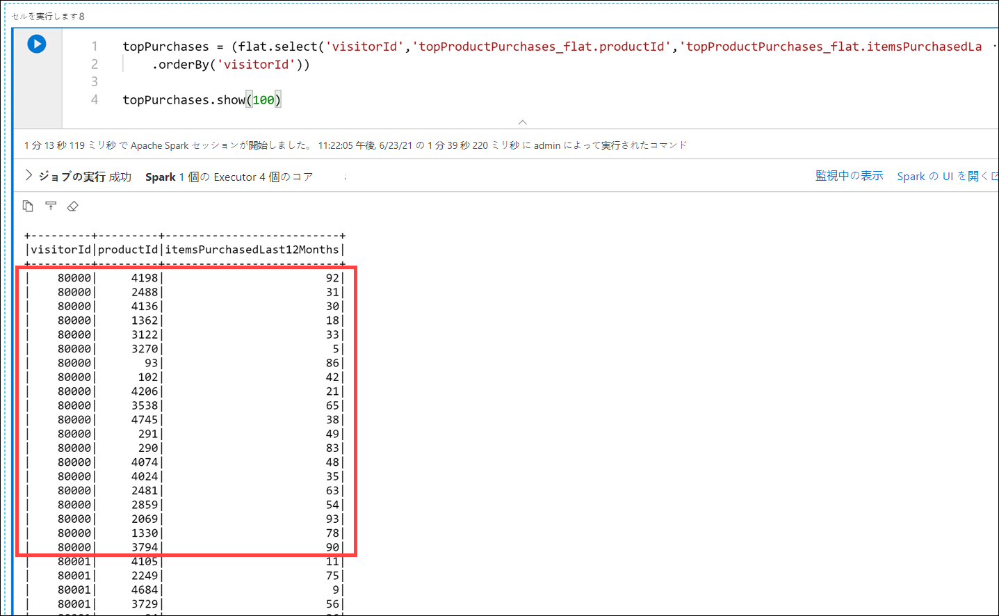

6. 過去 12 か月間に購入した項目の数で行を並べ替えてみましょう。新しいセルを作成し、次のコードを実行します。

    ```python
    # Let's order by the number of items purchased in the last 12 months
    sortedTopPurchases = topPurchases.orderBy("itemsPurchasedLast12Months")

    display(sortedTopPurchases.limit(100))
    ```

    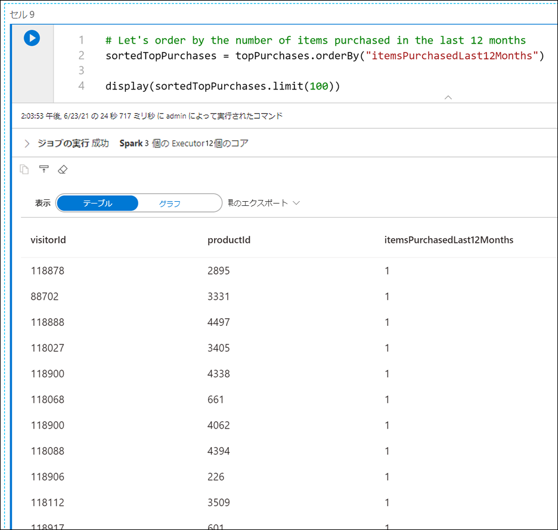

7. 逆の順序で並べ替えるにはどうすればよいでしょうか。以下のような呼び出しを行うことができると思われるかもしれません: `topPurchases.orderBy("itemsPurchasedLast12Months desc")`。新しいセルで試してみてください。

    ```python
    topPurchases.orderBy("itemsPurchasedLast12Months desc")
    ```

    

    `itemsPurchasedLast12Months desc` は列名と一致しないため、`AnalysisException` エラーが発生していることに注意してください。

    これはなぜ機能しないのでしょうか。

    - `DataFrames` API は SQL エンジンに基づいて構築されています。
    - 一般的に、この API と SQL 構文にはさまざまな知識があります。
    - 問題は、`orderBy(..)` では列の名前が想定されていることです。
    - ここで指定したのは、**requests desc** という形式の SQL 式でした。
    - 必要なのは、このような式をプログラムで表現する方法です。
    - これから導かれるのは、2 番目のバリアント `orderBy(Column)` (具体的には `Column` クラス) です。

8. **Column** クラスは列の名前だけでなく、列レベルの変換 (降順での並べ替えなど) も含まれるオブジェクトです。新しいセルで次のコードを実行します。

    ```python
    sortedTopPurchases = (topPurchases
        .orderBy( col("itemsPurchasedLast12Months").desc() ))

    display(sortedTopPurchases.limit(100))
    ```

    **`col`** オブジェクトの **`desc()`** メソッドにより、結果が `itemsPurchasedLast12Months` 列の降順で並べ替えられるようになりました。

    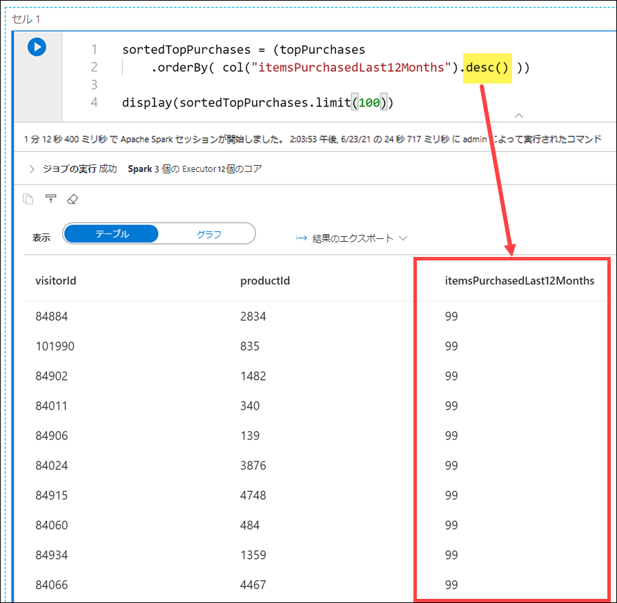

9. 各顧客が購入した商品の*種類*はいくつありますか。これを知るためには、`visitorId` でグループ化して、顧客ごとの行数を集計する必要があります。新しいセルで次のコードを実行します。

    ```python
    groupedTopPurchases = (sortedTopPurchases.select("visitorId")
        .groupBy("visitorId")
        .agg(count("*").alias("total"))
        .orderBy("visitorId") )

    display(groupedTopPurchases.limit(100))
    ```

    `visitorId` 列に対して **`groupBy`** メソッドを使用し、レコード数に対して **`agg`** メソッドを使用して、各顧客の合計数を表示するという方法に注目してください。

    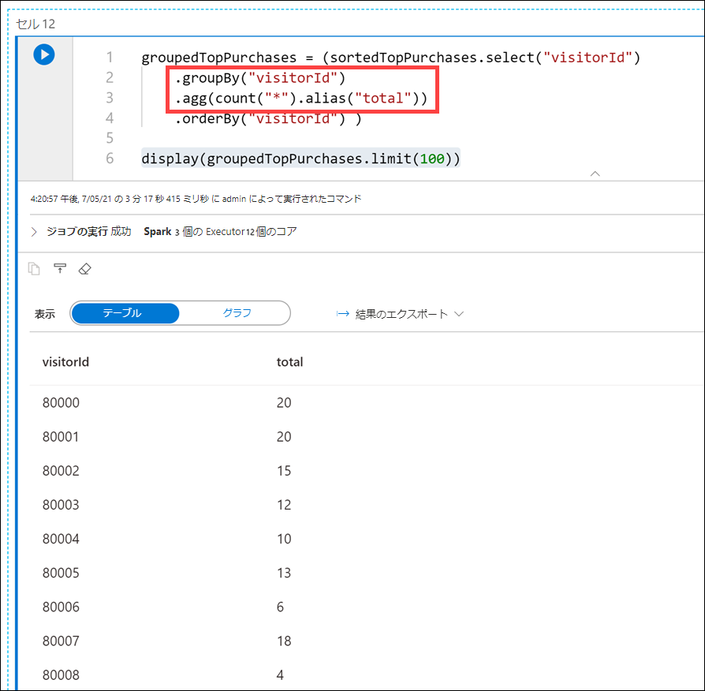

10. 各顧客が購入した*項目の合計数*はいくつですか。これを知るためには、`visitorId` でグループ化して、顧客ごとの `itemsPurchasedLast12Months` の値の合計を集計する必要があります。新しいセルで次のコードを実行します。

    ```python
    groupedTopPurchases = (sortedTopPurchases.select("visitorId","itemsPurchasedLast12Months")
        .groupBy("visitorId")
        .agg(sum("itemsPurchasedLast12Months").alias("totalItemsPurchased"))
        .orderBy("visitorId") )

    display(groupedTopPurchases.limit(100))
    ```

    もう一度、`visitorId` でグループ化しますが、ここでは **`agg`** メソッドの `itemsPurchasedLast12Months` 列に対して **`sum`** を使用します。`select` ステートメントに `itemsPurchasedLast12Months` 列を含めたため、`sum` で使用できるようになったことに注意してください。

    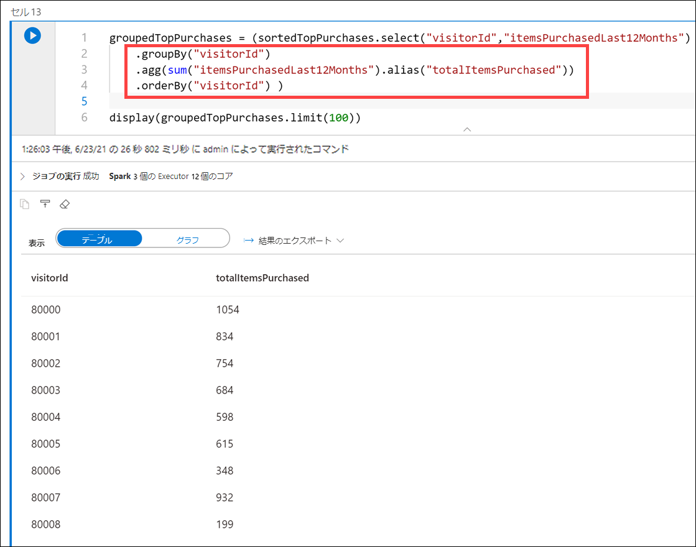

## 演習 4: Azure Synapse Analytics で SQL プールと Spark プールを統合する

Tailwind Traders は、Spark でデータ エンジニアリング タスクを実行した後、専用 SQL プールに関連のある SQL データベースに書き込みを行い、他のファイルからのデータを含む Spark データフレームと結合するためのソースとしてその SQL データベースを参照したいと考えています。

Apache Spark と Synapse SQL のコネクタを使用して、Azure Synapse の Spark データベースと SQL データベースの間でデータを効率的に転送できるようにすることを決めます。

Spark データベースと SQL データベース間でのデータの転送は、JDBC を使用して行うことができます。ただし、Spark プールや SQL プールといった 2 つの分散システムでは、JDBC はシリアル データ転送のボトルネックになる傾向があります。

Synapse SQL コネクタへの Apache Spark プールは、Apache Spark 用のデータ ソースの実装です。これにより、Azure Data Lake Storage Gen2 と専用 SQL プールの PolyBase が使用され、Spark クラスターと Synapse SQL インスタンスの間でデータが効率的に転送されます。

### タスク 1: ノートブックを更新する

1. この時点までは、これらのセルで Python コードを使用してきました。Apache Spark プールと Synapse SQL のコネクタ (`sqlanalytics`) を使用する場合、データフレーム内でデータの一時ビューを作成する方法があります。`top_purchases` という名前のビューを作成するには、新しいセルで次を実行します。

    ```python
    # Create a temporary view for top purchases so we can load from Scala
    topPurchases.createOrReplaceTempView("top_purchases")
    ```

    フラット化された JSON ユーザー購入データが格納されている、以前に作成した `topPurchases` データフレームから新しい一時ビューを作成しました。

2. Apache Spark pool to Synapse SQL コネクタを使用するコードを Scala で実行する必要があります。これを行うには、セルに `%%spark` マジックを追加します。新しいセルで次を実行し、`top_purchases` ビューからの読み取りを行います。

    ```java
    %%spark
    // Make sure the name of the dedcated SQL pool (SQLPool01 below) matches the name of your SQL pool.
    val df = spark.sqlContext.sql("select * from top_purchases")
    df.write.sqlanalytics("SQLPool01.wwi.TopPurchases", Constants.INTERNAL)
    ```

    > **注**: セルの実行には 1 分以上かかる場合があります。この前にこのコマンドを実行すると、テーブルが既に存在しているため、"... という名前のオブジェクトが既に存在します" というエラーが表示されます。

    セルの実行が完了したら、SQL テーブルの一覧を見て、テーブルが正常に作成されたことを確認します。

3. **ノートブックは開いたまま**にして、[**データ**] ハブに移動します (まだ選択されていない場合)。

    ![[データ] ハブが強調表示されています。](media/data-hub.png "Data hub")

4. [**ワークスペース**] タブ **(1)** を選択して SQL データベースを展開し、テーブルで省略記号 **(...)** **(2)** を選択してから [**更新**] (3) を選択します。**`wwi.TopPurchases`** テーブルと列 **(4)** を展開します。

    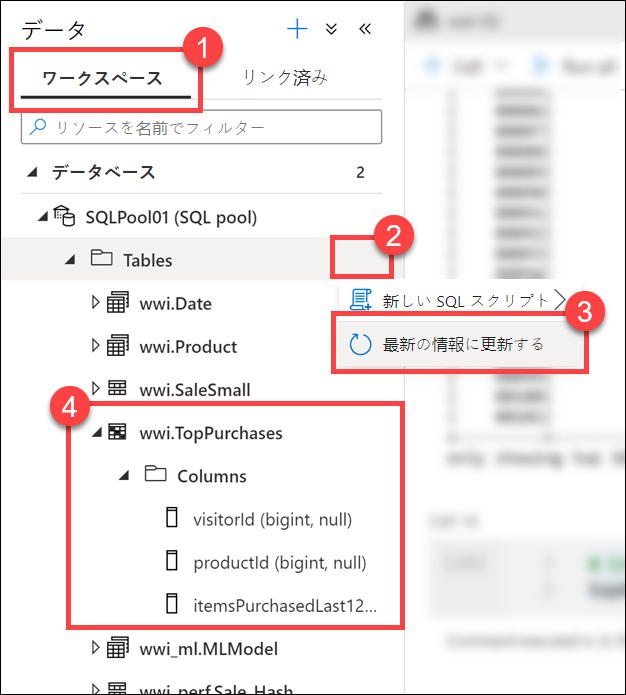

    ご覧のとおり、Spark データフレームの派生スキーマに基づいて、`wwi.TopPurchases` テーブルが自動的に作成されました。Apache Spark pool to Synapse SQL コネクタは、テーブルを作成し、そこへデータを効率的に読み込む役割を担っていました。

5. **ノートブックに戻り**、新しいセルで以下を実行して、`sale-small/Year=2019/Quarter=Q4/Month=12/` フォルダーにあるすべての Parquet ファイルから売上データを読み取ります。

    ```python
    dfsales = spark.read.load('abfss://wwi-02@' + datalake + '.dfs.core.windows.net/sale-small/Year=2019/Quarter=Q4/Month=12/*/*.parquet', format='parquet')
    display(dfsales.limit(10))
    ```

    > **注**: このセルの実行には 3 分以上かかることがあります。
    >
    > 最初のセルで作成した `datalake` 変数が、ファイル パスの一部としてここで使用されます。

    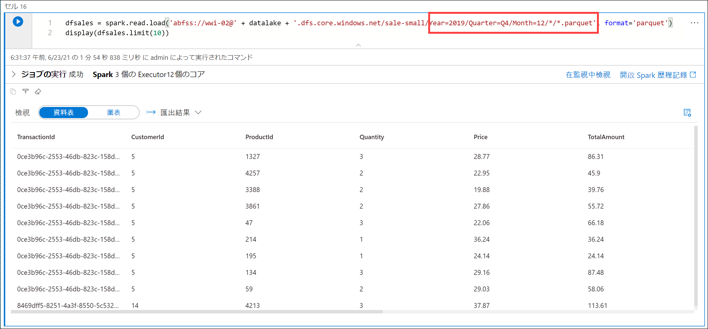

    上のセルのファイル パスを最初のセルのファイル パスと比較します。ここでは、`sale-small` にある Parquet ファイルから、2010 年 12 月 31 日の売上データではなく、**すべての 2019 年 12 月の売上**データを読み込むために相対パスを使用しています。

    次に、前の手順で作成した SQL プールのテーブルから `TopSales` データを新しい Spark データフレームに読み込み、この新しい `dfsales` データフレームと結合してみましょう。これを行うには、Apache Spark プールと Synapse SQL のコネクタを使用して SQL データベースからデータを取得する必要があるため、新しいセルに対して `%%spark` マジックを再度使用する必要があります。次に、Python からデータにアクセスできるように、データフレームの内容を新しい一時ビューに追加する必要があります。

6. 新しいセルで次を実行して、`TopSales` SQL テーブルから読み取りを行い、その内容を一時ビューに保存します。

    ```java
    %%spark
    // Make sure the name of the SQL pool (SQLPool01 below) matches the name of your SQL pool.
    val df2 = spark.read.sqlanalytics("SQLPool01.wwi.TopPurchases")
    df2.createTempView("top_purchases_sql")

    df2.head(10)
    ```

    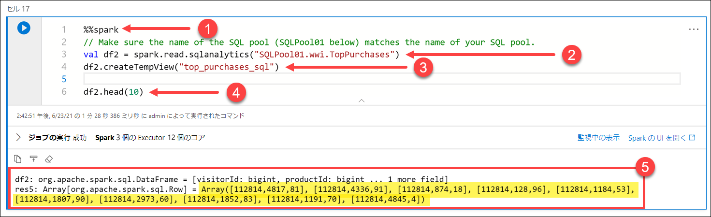

    セルの言語は、セルの上部で `%%spark` マジック **(1)** を使用することによって `Scala` に設定されます。`spark.read.sqlanalytics` メソッドによって作成された新しいデータフレームとして、`df2` という名前の新しい変数を宣言しました。この変数は、SQL データベースの `TopPurchases` テーブルから読み取りを行います **(2)**。次に、`top_purchases_sql` という名前の新しい一時ビューにデータを読み込みました **(3)**。最後に、`df2.head(10))` 行で最初の 10 個のレコードを表示しました **(4)**。セルの出力には、データフレームの値が表示されます **(5)**。

7. 新しいセルで以下を実行して、`top_purchases_sql` 一時ビューから Python で新しいデータフレームを作成し、最初の 10 件の結果を表示します。

    ```python
    dfTopPurchasesFromSql = sqlContext.table("top_purchases_sql")

    display(dfTopPurchasesFromSql.limit(10))
    ```

    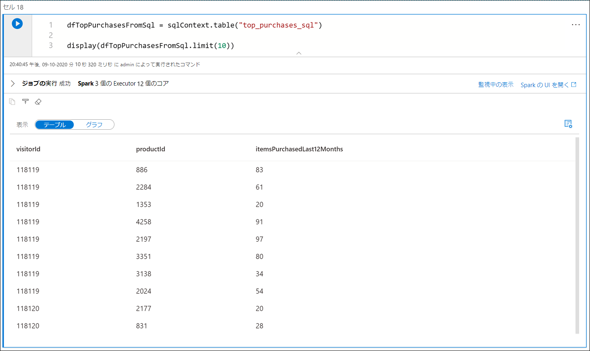

8. 新しいセルで以下を実行して、売上の Parquet ファイルと `TopPurchases` SQL データベースのデータを結合します。

    ```python
    inner_join = dfsales.join(dfTopPurchasesFromSql,
        (dfsales.CustomerId == dfTopPurchasesFromSql.visitorId) & (dfsales.ProductId == dfTopPurchasesFromSql.productId))

    inner_join_agg = (inner_join.select("CustomerId","TotalAmount","Quantity","itemsPurchasedLast12Months","top_purchases_sql.productId")
        .groupBy(["CustomerId","top_purchases_sql.productId"])
        .agg(
            sum("TotalAmount").alias("TotalAmountDecember"),
            sum("Quantity").alias("TotalQuantityDecember"),
            sum("itemsPurchasedLast12Months").alias("TotalItemsPurchasedLast12Months"))
        .orderBy("CustomerId") )

    display(inner_join_agg.limit(100))
    ```

    クエリでは、`dfsales` と `dfTopPurchasesFromSql` データフレームを結合し、`CustomerId` と `ProductId` を一致させました。この結合では、`TopPurchases` SQL テーブルのデータと 2019 年 12 月の売上に関する Parquet データを組み合わせました **(1)**。

    `CustomerId` フィールドと `ProductId` フィールドでグループ化しました。`ProductId` フィールドの名前があいまいである (両方のデータフレームに存在する) ため、`ProductId` の名前を完全に修飾して、その名前を `TopPurchases` データフレームで参照する必要がありました **(2)**。

    その後、各製品への 12 月の支払いの合計金額、12 月の製品項目の合計数、過去 12 か月間に購入した製品項目の合計数の集計を作成しました **(3)**。

    最後に、結合および集計されたデータをテーブル ビューで表示しました。

    > **注**: [テーブル] ビューの列ヘッダーをクリックして、結果セットを並べ替えてみてください。

    
