# モジュール 8 - Azure Data Factory または Azure Synapse パイプラインでデータを変換する

このモジュールでは、データ統合パイプラインを構築して、複数のデータ ソースから取り込み、マッピング データ フローとノートブックを使用してデータを変換し、ひとつ以上のデータシンクにデータを移動する方法を説明します。

このモジュールでは、次のことができるようになります。

- コードを書かずに Azure Synapse パイプラインを使用して大規模な変換を実行する
- データ パイプラインを作成して、形式が不良な CSV ファイルをインポートする
- マッピング データ フローを作成する

## ラボの詳細

- [モジュール 8 - Azure Data Factory または Azure Synapse パイプラインでデータを変換する](#module-8---transform-data-with-azure-data-factory-or-azure-synapse-pipelines)
  - [ラボの詳細](#lab-details)
  - [ラボの構成と前提条件](#lab-setup-and-pre-requisites)
  - [演習 0: 専用 SQL プールを起動する](#exercise-0-start-the-dedicated-sql-pool)
  - [ラボ 1: コードを書かずに Azure Synapse パイプラインを使用した大規模な変換](#lab-1-code-free-transformation-at-scale-with-azure-synapse-pipelines)
    - [演習 1: 成果物を作成する](#exercise-1-create-artifacts)
      - [タスク 1: SQL テーブルを作成する](#task-1-create-sql-table)
      - [タスク 2: リンク サービスを作成する](#task-2-create-linked-service)
      - [タスク 3: データ セットを作成する](#task-3-create-data-sets)
      - [タスク 4: キャンペーン分析データセットを作成する](#task-4-create-campaign-analytics-dataset)
    - [演習 2: データ パイプラインを作成して、形式が不良な CSV をインポートする](#exercise-2-create-data-pipeline-to-import-poorly-formatted-csv)
      - [タスク 1: キャンペーン分析データ フローを作成する](#task-1-create-campaign-analytics-data-flow)
      - [タスク 2: キャンペーン分析データ パイプラインを作成する](#task-2-create-campaign-analytics-data-pipeline)
      - [タスク 3: キャンペーン分析データ パイプラインを実行する](#task-3-run-the-campaign-analytics-data-pipeline)
      - [タスク 4: キャンペーン分析テーブルの内容を表示する](#task-4-view-campaign-analytics-table-contents)
    - [演習 3: 上位製品購入向けのマッピング データ フローを作成する](#exercise-3-create-mapping-data-flow-for-top-product-purchases)
      - [タスク 1: マッピング データ フローを作成する](#task-1-create-mapping-data-flow)
  - [ラボ 2: Azure Synapse パイプラインでデータの移動と変換を調整する](#lab-2-orchestrate-data-movement-and-transformation-in-azure-synapse-pipelines)
    - [演習 1: パイプラインを作成、トリガー、監視する](#exercise-1-create-trigger-and-monitor-pipeline)
      - [タスク 1: パイプラインを作成する](#task-1-create-pipeline)
      - [タスク 2: ユーザー プロファイル データ パイプラインをトリガー、監視、分析する](#task-2-trigger-monitor-and-analyze-the-user-profile-data-pipeline)

## ラボの構成と前提条件

> **注:** ホストされたラボ環境を**使用しておらず**、ご自分の Azure サブスクリプションを使用している場合は、`Lab setup and pre-requisites` の手順のみを完了してください。その他の場合は、演習 0 にスキップします。

このモジュールの**[ラボの構成手順](https://github.com/solliancenet/microsoft-data-engineering-ilt-deploy/blob/main/setup/04/README.md)を完了**してください。

以下のモジュールは、同じ環境を共有している点に留意してください。

- [モジュール 4](labs/04/README.md)
- [モジュール 5](labs/05/README.md)
- [モジュール 7](labs/07/README.md)
- [モジュール 8](labs/08/README.md)
- [モジュール 9](labs/09/README.md)
- [モジュール 10](labs/10/README.md)
- [モジュール 11](labs/11/README.md)
- [モジュール 12](labs/12/README.md)
- [モジュール 13](labs/13/README.md)
- [モジュール 16](labs/16/README.md)

## 演習 0: 専用 SQL プールを起動する

このラボでは専用 SQL プールを使用します。最初の手順として、これが一時停止状態でないことを確認してください。一時停止している場合は、以下の手順に従って起動します。

1. Synapse Studio (<https://web.azuresynapse.net/>) を開きます。

2. 「**管理**」 ハブを選択します。

    

3. 左側のメニューで 「**SQL プール**」 を選択します **(1)**。専用 SQL プールが一時停止状態の場合は、プールの名前の上にマウスを動かして 「**再開**」  (2) を選択します。

    

4. プロンプトが表示されたら、「**再開**」 を選択します。プールが再開するまでに、1 ～ 2 分かかります。

    

> 専用 SQL プールが再開する間、**続行して次の演習に進みます**。

## ラボ 1: コードを書かずに Azure Synapse パイプラインを使用した大規模な変換

Tailwind Traders 社は、データ エンジニアリング タスクでコードを書かないオプションを希望しています。データを理解しているものの開発経験の少ないジュニアレベルのデータ エンジニアがデータ変換操作を構築して維持できるようにしたいというのがその動機です。また、特定のバージョンに固定されたライブラリに依存した複雑なコードによる脆弱性を減らし、コードのテスト要件を排除して、長期的なメンテナンスをさらに容易にするという目的もあります。

もうひとつの要件は、専用 SQL プールに加えて、データ レイクで変換データを維持することです。それにより、ファクト テーブルとディメンション テーブルで格納するよりも多くのフィールドをデータ セットに保持できる柔軟性を得られます。これを行うと、コスト最適化のために専用 SQL プールを一時停止した際でもデータにアクセスできるようになります。

このような要件を考慮して、あなたはマッピング データ フローの構築を推奨します。

マッピング データ フローはパイプライン アクティビティで、コードを書かないデータ変換方法を指定する視覚的な方法を提供します。この機能により、データ クレンジング、変換、集計、コンバージョン、結合、データ コピー操作などが可能になります。

その他の利点

- Spark の実行によるクラウドのスケーリング
- レジリエントなデータ フローを容易に構築できるガイド付きエクスペリエンス
- ユーザーが慣れているレベルでデータを変換できる柔軟性
- 単一のグラスからデータを監視して管理

### 演習 1: 成果物を作成する

#### タスク 1: SQL テーブルを作成する

これから構築するマッピング データ フローは、ユーザーの購入データを専用 SQL プールに書き込みます。Tailwind Traders には、まだ、このデータを格納するためのテーブルがありません。SQL スクリプトを実行し、前提条件として、このテーブルを作成します。

1. Synapse Analytics Studio (<https://web.azuresynapse.net/>) を開き、「**開発**」 ハブに移動します。

    

2. 「**開発**」 メニューで **+** ボタン **(1)** を選択し、コンテキスト 　メニューから 「**SQL スクリプト**」 (2) を選びます。

    

3. ツールバー メニューで、**SQLPool01** データベースに接続してクエリを実行します。

    

4. クエリ ウィンドウでスクリプトを以下に置き換え、Azure Cosmos DB に格納されているユーザーの好みの製品と、データ レイク内で JSON ファイルに格納されている e コマース サイトからのユーザー当たりの上位製品購入を結合する新しいテーブルを作成します。

    ```sql
    CREATE TABLE [wwi].[UserTopProductPurchases]
    (
        [UserId] [int]  NOT NULL,
        [ProductId] [int]  NOT NULL,
        [ItemsPurchasedLast12Months] [int]  NULL,
        [IsTopProduct] [bit]  NOT NULL,
        [IsPreferredProduct] [bit]  NOT NULL
    )
    WITH
    (
        DISTRIBUTION = HASH ( [UserId] ),
        CLUSTERED COLUMNSTORE INDEX
    )
    ```

5. ツールバー メニューから 「**実行**」 を選択して SQL コマンドを実行します。

    

6. クエリ ウィンドウでスクリプトを以下に置き換え、キャンペーン分析 CSV ファイル用に新しいテーブルを作成します。

    ```sql
    CREATE TABLE [wwi].[CampaignAnalytics]
    (
        [Region] [nvarchar](50)  NOT NULL,
        [Country] [nvarchar](30)  NOT NULL,
        [ProductCategory] [nvarchar](50)  NOT NULL,
        [CampaignName] [nvarchar](500)  NOT NULL,
        [Revenue] [decimal](10,2)  NULL,
        [RevenueTarget] [decimal](10,2)  NULL,
        [City] [nvarchar](50)  NULL,
        [State] [nvarchar](25)  NULL
    )
    WITH
    (
        DISTRIBUTION = HASH ( [Region] ),
        CLUSTERED COLUMNSTORE INDEX
    )
    ```

7. ツールバー メニューから 「**実行**」 を選択して SQL コマンドを実行します。

    

#### タスク 2: リンクされたサービスの作成

Azure Cosmos DB は、マッピング フロー データで使用するデータ ソースの 1 つです。Tailwind Traders はまだリンク サービスを作成していません。このセクションの手順に従って作成してください。

> **注**: すでに Cosmos DB リンク サービスを作成している場合は、このセクションをスキップしてください。

1. 「**管理**」 ハブに移動します。

    

2. 「**リンク サービス**」 を開き、「**+ 新規**」 を選択して新しいリンク サービスを作成します。オプションのリストで 「**Azure Cosmos DB (SQL API)**」 を選択し、「**続行**」 を選択します。

    

3. リンク サービスに `asacosmosdb01` **(1)** という名前を付け、「**Cosmos DB アカウント名**」 (`asacosmosdbSUFFIX`) を選択して 「**データベース名**」 の値を `CustomerProfile` **(2)** に設定します。「**テスト接続**」 を選択して接続成功を確認してから **(3)**、「**作成**」 (4) を選択します。

    

#### タスク 3: データ セットを作成する

ユーザー プロファイル データは 2 つの異なるデータ ソースに由来しており、それを今から作成します。`asal400_ecommerce_userprofiles_source` と `asal400_customerprofile_cosmosdb` です。e コマース システムの顧客プロファイル データは、過去 12 か月間のサイトの訪問者 (顧客) ごとに上位の商品購入数を提供するもので、データ レイクの JSON ファイル内に格納されます。ユーザー プロファイル データには製品の好みや製品のレビューなどが含まれており、Cosmos DB に JSON ドキュメントとして格納されています。

このセクションでは、このラボで後ほど作成するデータ パイプライン向けのデータ シンクとして機能する SQL テーブルのデータセットを作成します。

以下の手順を完了して、2 つのデータセットを作成してください。`asal400_ecommerce_userprofiles_source` と `asal400_customerprofile_cosmosdb` です。

1. 「**データ**」 ハブに移動します。

    

2. ツールバーで **+** を選択し **(1)**、「**統合データセット**」 (2) を選択して新しいデータセットを作成します。

    

3. リストから 「**Azure Cosmos DB (SQL API)**」 **(1)** を選択し、「**続行**」 (2) を選択します。

    

4. 以下の特徴でデータセットを構成し、「**OK**」 (4) を選択します。

    - **名前**: `asal400_customerprofile_cosmosdb` **(1)** と入力します。
    - **リンク サービス**: Azure Cosmos DB リンク サービス **(2)** を選択します。
    - **コレクション**: `OnlineUserProfile01` **(3)** を選択します。

    

5. データセットの作成後、「**接続**」 タブで 「**データのプレビュー**」 を選択します。

    

6. データのプレビューで、選択された Azure Cosmos DB コレクションのクエリを実行し、その内部でドキュメントのサンプルを返します。ドキュメントは JSON 形式で格納され、`userId` フィールド、`cartId`、`preferredProducts` (空の可能性がある製品 ID の配列)、`productReviews` (空の可能性がある書き込み済みの製品レビューの配列) が含まれています。

    

7. ツールバーで **+** を選択し **(1)**、「**統合データセット**」 (2) を選択して新しいデータセットを作成します。

    

8. リストから 「**Azure Data Lake Storage Gen2**」 **(1)** を選択し、「**続行**」 (2) を選択します。

    

9. 「**JSON**」 形式 **(1)** を選び、「**続行**」 (2) を選択します。

    

10. 以下の特徴でデータセットを構成し、「**OK**」 (5) を選択します。

    - **名前**: `asal400_ecommerce_userprofiles_source` **(1)** と入力します。
    - **リンク サービス**: すでに存在する `asadatalakeXX` リンク サービスを選択します **(2)**。
    - **ファイル パス**: `Wwi-02/online-user-profiles-02` パスを参照します **(3)**。
    - **スキーマのインポート**: `From connection/store` **(4)** を選択します。

    

11. ツールバーで **+** を選択し **(1)**、「**統合データセット**」 (2) を選択して新しいデータセットを作成します。

    

12. リストから 「**Azure Synapse Analytics**」 **(1)** を選択し、「**続行**」 (2) を選択します。

    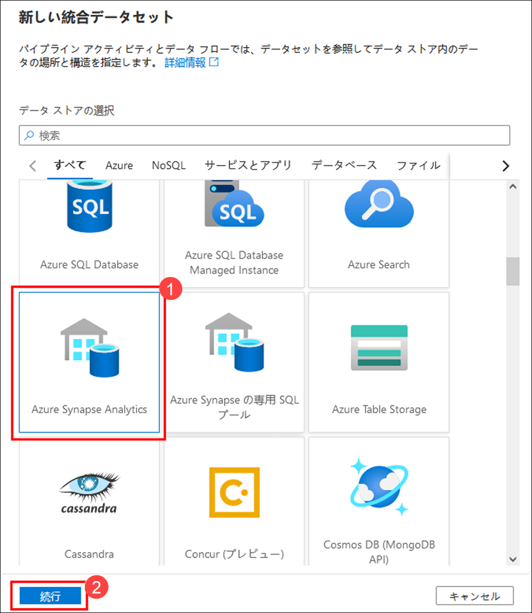

13. 以下の特徴でデータセットを構成し、「**OK**」 (5) を選択します。

    - **名前**: `asal400_wwi_campaign_analytics_asa` **(1)** と入力します。
    - **リンク サービス**: `SqlPool01` service **(2)** を選択します。
    - **テーブル名**: `wwi.CampaignAnalytics` **(3)** を選択します。
    - **スキーマのインポート**: `From connection/store` **(4)** を選択します。

    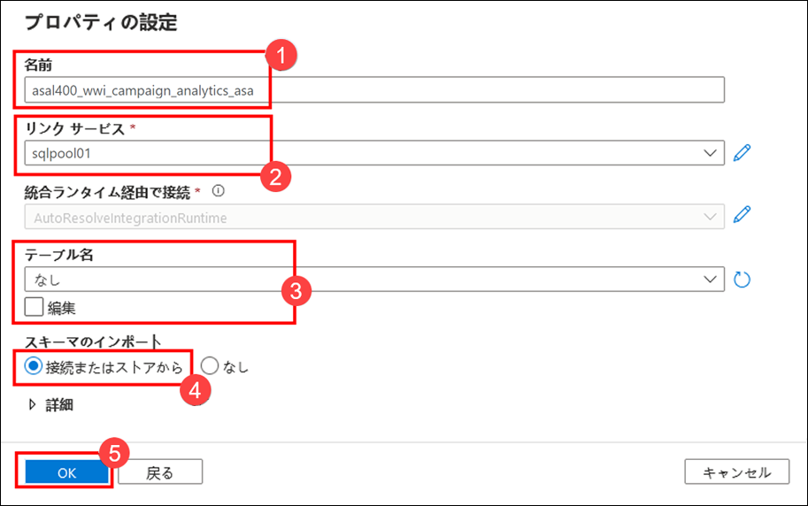

14. ツールバーで **+** を選択し **(1)**、「**統合データセット**」 (2) を選択して新しいデータセットを作成します。

    

15. リストから 「**Azure Synapse Analytics**」 **(1)** を選択し、「**続行**」 (2) を選択します。

    

16. 以下の特徴でデータセットを構成し、「**OK**」 (5) を選択します。

    - **名前**: `asal400_wwi_usertopproductpurchases_asa` **(1)** と入力します。
    - **リンク サービス**: `SqlPool01` service **(2)** を選択します。
    - **テーブル名**: `wwi.UserTopProductPurchases` **(3)** を選択します。
    - **スキーマのインポート**: `From connection/store` **(4)** を選択します。

    

#### タスク 4: キャンペーン分析データセットを作成する

あなたの組織は、マーケティング キャンペーン データが含まれている、形式が不良な CSV ファイルを提供されました。ファイルはデータ レイクにアップロードされていますが、データ ウェアハウスにインポートする必要があります。


収益通貨データの無効な文字、一致しない列といった問題があります。

1. 「**データ**」 ハブに移動します。

    

2. ツールバーで **+** を選択し **(1)**、「**統合データセット**」 (2) を選択して新しいデータセットを作成します。

    

3. リストから 「**Azure Data Lake Storage Gen2**」 **(1)** を選択し、「**続行**」 (2) を選択します。

    

4. 「**DelimitedText**」 形式 **(1)** を選択した後、「**続行**」 (2) を選択します。

    

5. 以下の特徴でデータセットを構成し、「**OK**」 (6) を選択します。

    - **名前**: `asal400_campaign_analytics_source` **(1)** と入力します。
    - **リンク サービス**: `asadatalakeSUFFIX` リンク サービス **(2)** を選択します。
    - **ファイル パス**: `wwi-02/campaign-analytics/campaignanalytics.csv` パス **(3)** を参照します。
    - **先頭の行を見出しとして使用**: `unchecked **(4)** のままにします。見出しの列数とデータ行の列数が一致しないため、**見出しはスキップします**。
    - **スキーマのインポート**: `From connection/store` **(5)** を選択します。

    

6. データセットの作成後、その 「**接続**」 タブに移動します。既定の設定のままにします。以下の構成に一致しなくてはなりません。

    - **圧縮の種類**: `none` を選択します。
    - **列区切り記号**: `Comma (,)` を選択します。
    - **行区切り記号**: `Default (\r,\n, or \r\n)` を選択します。
    - **エンコード**: `Default(UTF-8)` を選択します。
    - **エスケープ文字**: `Backslash (\)` を選択します。
    - **引用符文字**: `Double quote (")` を選択します。
    - **先頭の行を見出しとして使用**: `unchecked` のままにします。
    - **Null 値**: フィールドは空のままにしておきます。

    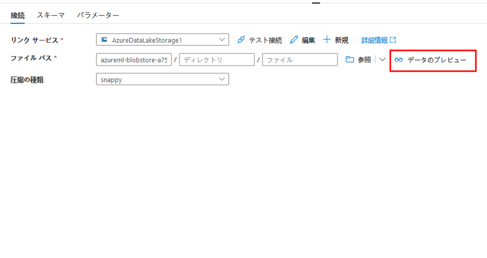

7. 「**データのプレビュー**」 を選択します。

8. CSV ファイルのサンプルが表示されます。このタスクの最初に、スクリーンショットでいくつかの問題を確認できます。最初の行は見出しとして設定しないので、見出し列が最初の行として表示されます。また、以前のスクリーンショットで示されていた市区町村と県・州の値が表示されない点に留意してください。これは、見出し行の列数がファイルの残りの部分と一致しないためです。次の演習でデータ フローを作成する際、最初の行を除外します。

    

9. 「**すべて公開**」 を選択した後、**公開**して新しいリソースを保存します。

    

### 演習 2: データ パイプラインを作成して、形式が不良な CSV をインポートする

#### タスク 1: キャンペーン分析データ フローを作成する

1. 「**開発**」 ハブに移動します。

    

2. + を選択してから 「**データ フロー**」 を選び、新しいデータ フローを作成します。

    

3. 新しいデータ フローの 「**プロパティ**」 ブレードの 「**全般**」 設定で、「**名前**」 を  `Asal400_lab2_writecampaignanalyticstoasa` に更新します。

    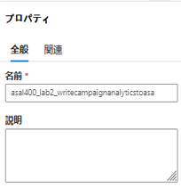

4. データ フロー キャンバスで 「**ソースの追加**」 を選択します。

    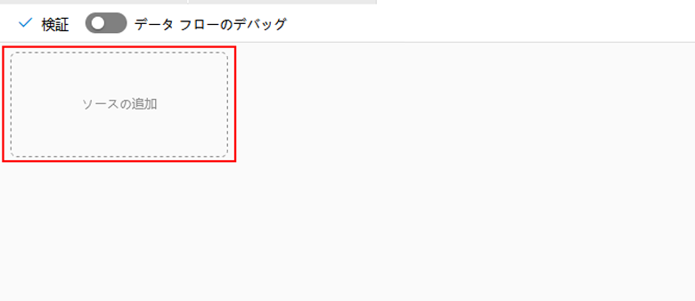

5. 「**ソース設定**」 で次のように構成します。

    - **出力ストリーム名**: `CampaignAnalytics` と入力します。
    - **ソースの種類**: `Dataset` を選択します。
    - **データセット**: `Asal400_campaign_analytics_source` を選択します。
    - **オプション**: `Allow schema drift` を選択し、他のオプションはオフのままにします。
    - **スキップ ライン カウント**: `1` と入力します。これにより、CSV ファイルの残りの行よりも 2 列少ない見出し行をスキップし、最後の 2　つのデータ列を切り詰めます。
    - **サンプリング**: `Disable` を選択します。

    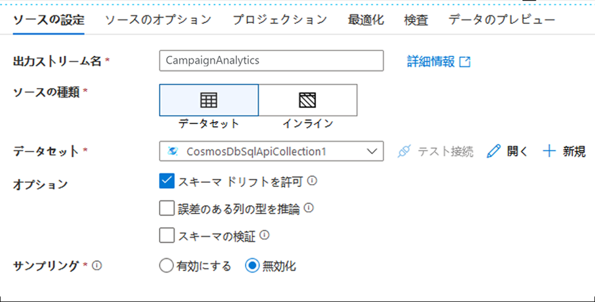

6. データ フローを作成すると、デバッグをオンにして特定の機能が有効になります。データのプレビューやスキーマ (プロジェクション) のインポートなどです。ｓこのオプションを有効にするには時間がかかり、ラボ環境の制約もあるため、これらの機能はバイパスします。データ ソースには、設定する必要のあるスキーマが含まれています。設定するには、設計キャンバスの上で 「**スクリプト**」 を選択します。

    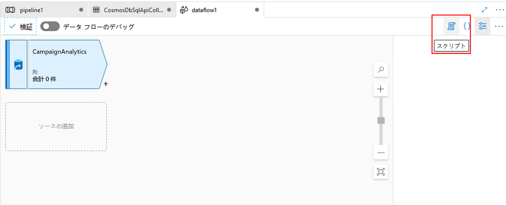

7. スクリプトを以下に置き換え、列のマッピング (`output`) を提供して、「**OK**」 を選択します。

    ```json
    source(output(
            {_col0_} as string,
            {_col1_} as string,
            {_col2_} as string,
            {_col3_} as string,
            {_col4_} as string,
            {_col5_} as double,
            {_col6_} as string,
            {_col7_} as double,
            {_col8_} as string,
            {_col9_} as string
        ),
        allowSchemaDrift: true,
        validateSchema: false,
        ignoreNoFilesFound: false) ~> CampaignAnalytics
    ```

    スクリプトは以下と一致するはずです。

    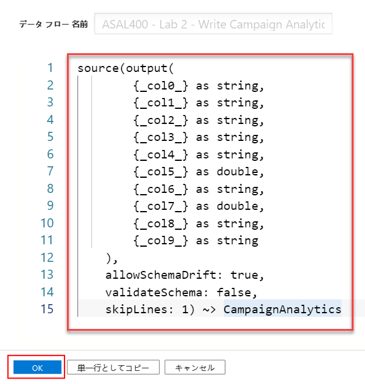

8. 「**CampaignAnalytics**」 データ ソースを選択してから 「**プロジェクション**」 を選択します。プロジェクションには以下のスキーマが表示されるはずです。

    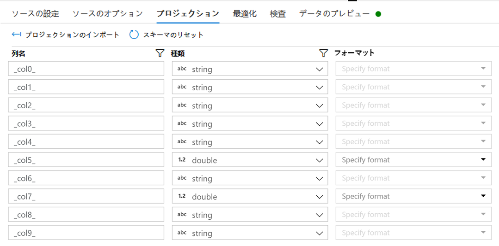

9. `CampaignAnalytics` の右側で **+** を選択し、コンテキスト メニューで 「**選択**」 スキーマ修飾子を選択します。

    

10. 「**設定の選択**」 で以下のように構成します。

    - **出力ストリーム名**: `MapCampaignAnalytics` を入力します。
    - **着信ストリーム**: `CampaignAnalytics` を選択します。
    - **オプション**: 両方のオプションをオンにします。
    - **入力列**: `Auto mapping` がオフになていることを確認し、「**名前を付ける**」 フィールドで以下の値を入力します。
      - Region
      - Country
      - ProductCategory
      - CampaignName
      - RevenuePart1
      - Revenue
      - RevenueTargetPart1
      - RevenueTarget
      - City
      - State

    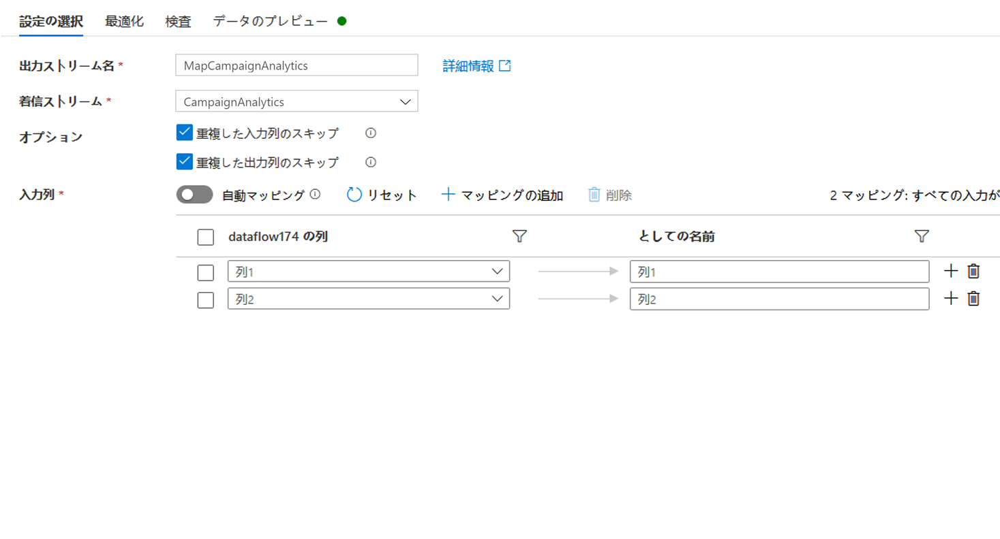

11. `MapCampaignAnalytics` ソースの右側で **+** を選択し、コンテキスト メニューで 「**派生列**」 スキーマ修飾子を選択します。

    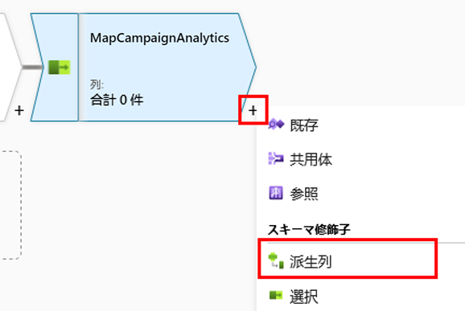

12. 「**派生列の設定**」 で以下を構成します。

    - **出力ストリーム名**: `ConvertColumnTypesAndValues` と入力します。
    - **着信ストリーム**: `MapCampaignAnalytics` を選択します。
    - **列**: 次の情報を指定します。

        | 列 | 式 | 説明 |
        | --- | --- | --- |
        | Revenue | `toDecimal(replace(concat(toString(RevenuePart1), toString(Revenue)), '\\', ''), 10, 2, '$###,###.##')` | `RevenuePart1` と `Revenue` フィールドを連結し、無効な `\` 文字を置き換えてから、データを変換して小数点に書式化します。 |
        | RevenueTarget | `toDecimal(replace(concat(toString(RevenueTargetPart1), toString(RevenueTarget)), '\\', ''), 10, 2, '$###,###.##')` | `RevenueTargetPart1` と `RevenueTarget` フィールドを連結し、無効な `\` 文字を置き換えてから、データを変換して小数点に書式化します。 |

    > **注**: 2 番目の列を挿入するには、列リストの上で 「**+ 追加**」 を選択してから 「**列の追加**」 を選択します。

    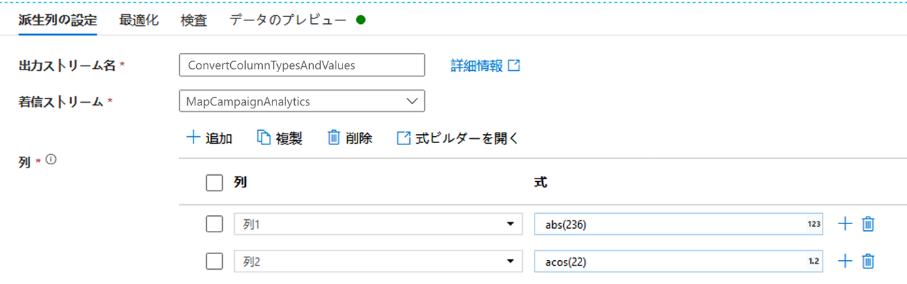

13. `ConvertColumnTypesAndValues` ステップの右側で **+** を選択し、コンテキスト メニューで 「**選択**」 スキーマ修飾子を選択します。

    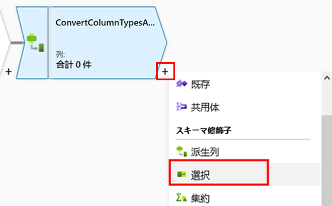

14. 「**設定の選択**」 で以下のように構成します。

    - **出力ストリーム名**: `SelectCampaignAnalyticsColumns` と入力します。
    - **着信ストリーム**: `ConvertColumnTypesAndValues` を選択します。
    - **オプション**: 両方のオプションをオンにします。
    - **入力列**: `Auto mapping` がオフになっていることを確認し、 `RevenuePart1` と `RevenueTargetPart1` を**削除**します。これらのフィールドはもう必要ありません。

    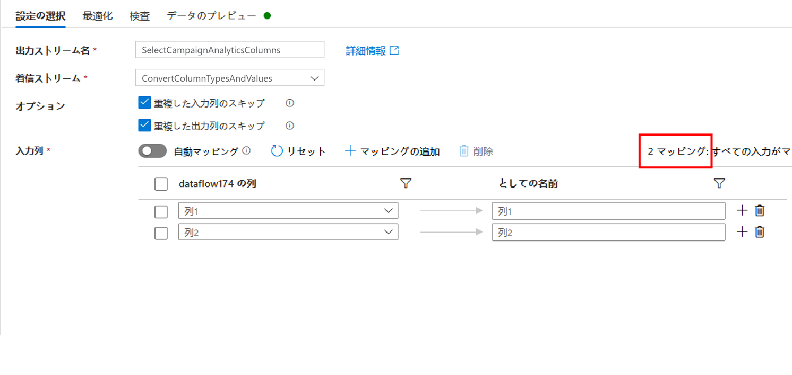

15. `SelectCampaignAnalyticsColumns` ステップの右側で **+** を選択し、コンテキスト メニューで 「**シンク**」 の宛先を選択します。

    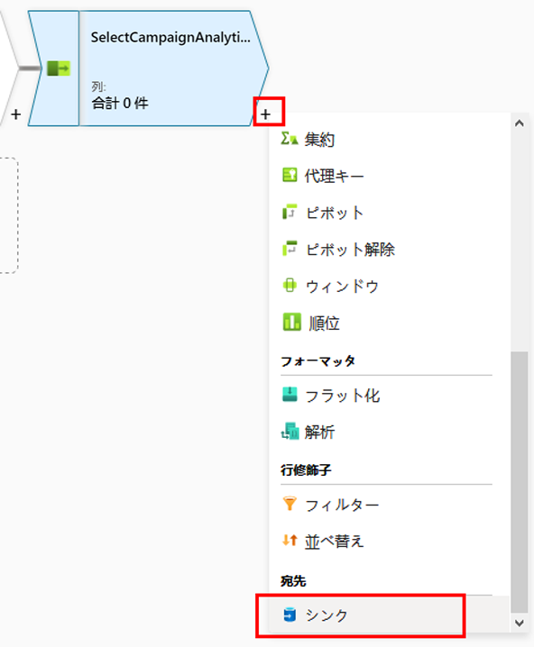

16. 「**シンク**」 で以下を構成します。

    - **出力ストリーム名**: `CampaignAnalyticsASA` と入力します。
    - **着信ストリーム**: `SelectCampaignAnalyticsColumns` を選択します。
    - **シンクの種類**: `Dataset` を選択します。
    - **データセット**: `asal400_wwi_campaign_analytics_asa` を選択します。これは CampaignAnalytics SQL テーブルです。
    - **オプション**: `Allow schema drift` をチェックし、`Validate schema` はオフにします。

    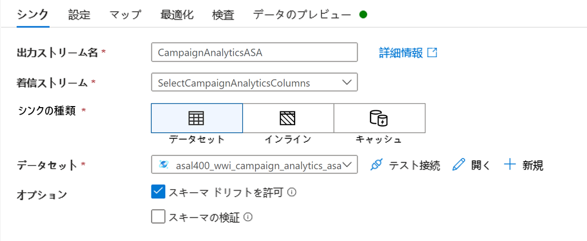

17. 「**設定**」 を選択して以下を構成します。

    - **更新方法**: `Allow insert` をチェックして、残りはオフのままにします。
    - **テーブル アクション**: `Truncate table` を選択します。
    - **ステージングの有効化**: このオプションは不にします。サンプル CSV ファイルは小さいので、ステージング オプションは不要です。

    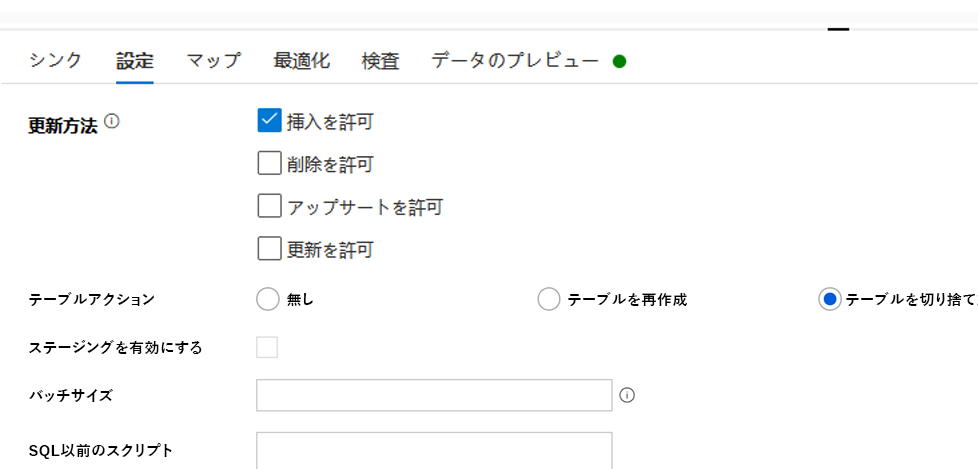

18. 完成したデータ フローは次のようになるはずです。

    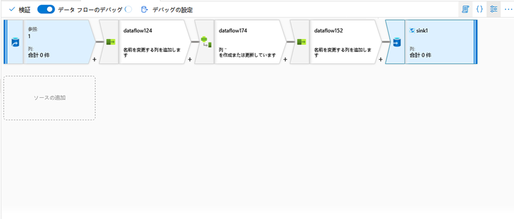

19. 「**すべて公開**」 を選択した後、**公開**して新しいデータ フローを保存します。

    

#### タスク 2: キャンペーン分析データ パイプラインを作成する

新しいデータ フローを実行するには、新しいパイプラインを作成してデータ フロー アクティビティを追加する必要があります。

1. 「**統合**」 ハブに移動します。

    

2. + を選択した後、「**パイプライン**」 を選択して、新しいパイプラインを作成します。

    

3. 新しいパイプラインの 「**プロパティ**」 ブレードの 「**全般**」 セクションに以下の**名前**を入力します:  `Write Campaign Analytics to ASA`。

4. アクティビティ リスト内で 「**移動と変換**」 を展開し、「**データ フロー**」 アクティビティをパイプライン キャンバスにドラッグします。

    

5. 「全般」 セクションで 「**名前**」 の値を `asal400_lab2_writecampaignanalyticstoasa` に設定します。

    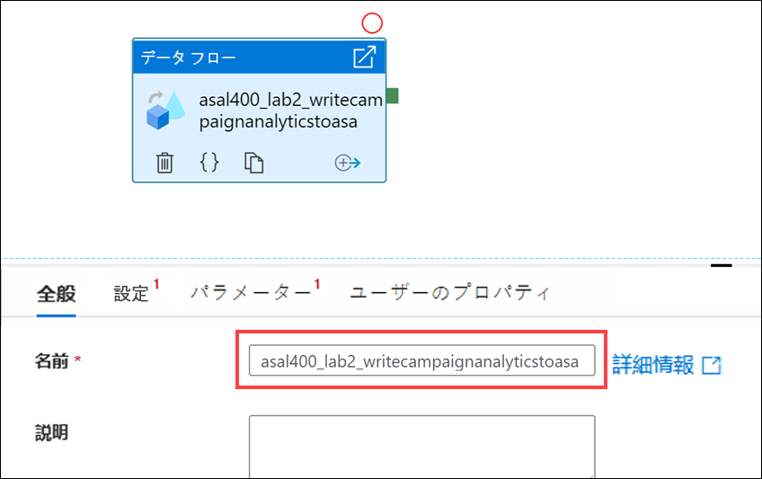

6. 「**設定**」 タブを選択してから、「**データ フロー**」 で `asal400_lab2_writecampaignanalyticstoasa` を選択します。

    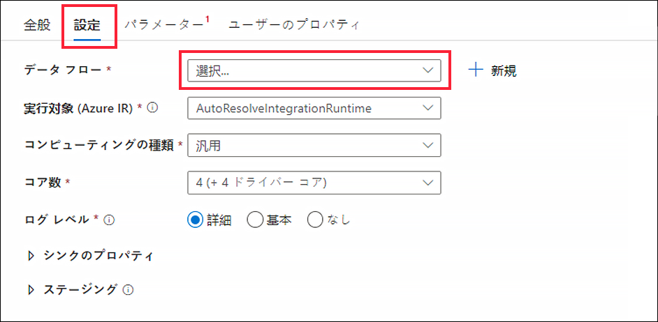

8. 「**すべて公開**」 を選択して、新しいパイプラインを保存します。

    

#### タスク 3: キャンペーン分析データ パイプラインを実行する

1. 「**トリガーの追加**」 を選択し、パイプライン キャンバスの最上部にあるツールバーで 「**今すぐトリガー**」 を選択します。

    

2. `Pipeline run` ブレードで 「**OK**」 を選択してパイプライン実行を開始します。

    

3. 「**監視**」 ハブに移動します。

    

4. パイプラインの実行が完了するまで待ちます。場合によっては、ビューを更新する必要があります。

    > これを実行している間に、ラボの手順の残りを読み、内容をよく理解しておいてください。

    

#### タスク 4: キャンペーン分析テーブルの内容を表示する

パイプライン実行が完了したので、SQL テーブルを見て、データがコピーされていることを確認しましょう。

1. 「**データ**」 ハブに移動します。

    

2. 「**ワークスペース**」 セクションで `SqlPool01` データベースを展開してから `Tables` を展開します。

3. `wwi.CampaignAnalytics` テーブルを右クリックし、新しい SQL スクリプトのコンテキスト メニューで 「**上位 1000 行を選択**」 メニュー項目を選択します。新しいテーブルを表示するには更新が必要な場合があります。

    

4. 適切に変換されたデータがクエリ結果に表示されるはずです。

    

5. クエリを以下に更新して**実行**します。

    ```sql
    SELECT ProductCategory
    ,SUM(Revenue) AS TotalRevenue
    ,SUM(RevenueTarget) AS TotalRevenueTarget
    ,(SUM(RevenueTarget) - SUM(Revenue)) AS Delta
    FROM [wwi].[CampaignAnalytics]
    GROUP BY ProductCategory
    ```

6. クエリ結果で 「**グラフ**」 ビューを選択します。定義されているように列を構成します。

    - **グラフの種類**: `Column` を選択します。
    - **カテゴリ列**: `ProductCategory` を選択します。
    - **凡例 (シリーズ) 列**: `TotalRevenue`、`TotalRevenueTarget`、`Delta` を選択します。

    

### 演習 3: 上位製品購入向けのマッピング データ フローを作成する

Tailwind Traders は、JSON ファイルとして e コマースシステムからインポートされた上位製品購入を、JSON ドキュメントとして Azure Cosmos DB で格納されていたプロファイル データのユーザーの好みの製品に組み合わせる必要があります。組み合わせたデータは専用 SQL プールおよびデータ レイクに格納して、さらなる分析と報告に使いたいと考えています。

これを行うため、以下のタスクを実行するマッピング データ フローを構築する必要があります。

- 2 つの ADLS Gen2 データ ソースを JSON データ向けに追加する
- 両方のファイル セットの階層構造をフラット化する
- データ変換と種類の変換を行う
- 両方のデータ ソースを結合する
- 条件ロジックに基づき、結合したデータで新しいフィールドを作成する
- 必要なフィールドで null 記録をフィルタリングする
- 専用 SQL プールに書き込む
- 同時にデータ レイクに書き込む

#### タスク 1: マッピング データ フローを作成する

1. 「**開発**」 ハブに移動します。

    

2. **+** を選択してから 「**データ フロー**」 を選び、新しいデータ フローを作成します。

    

3. 新しいデータ フローの 「**プロファイル**」 ペインの 「**全般**」 セクションで、「**名前**」 を以下に更新します:  `write_user_profile_to_asa`。

    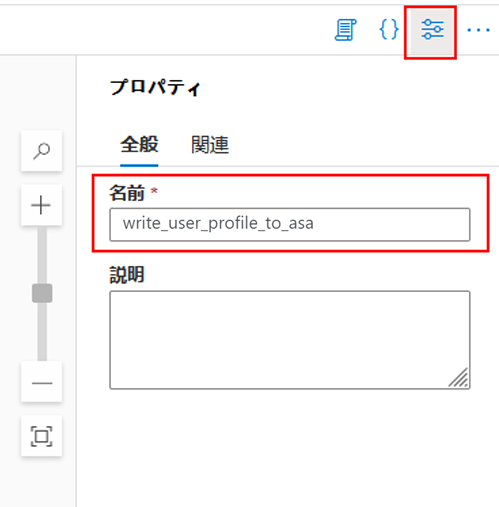

4. 「**プロパティ**」 ボタンを選択してペインを非表示にします。

    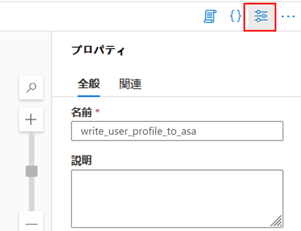

5. データ フロー キャンバスで 「**ソースの追加**」 を選択します。

    

6. 「**ソース設定**」 で次のように構成します。

    - **出力ストリーム名**: `EcommerceUserProfiles` と入力します。
    - **ソースの種類**: `Dataset` を選択します。
    - **データセット**: `asal400_ecommerce_userprofiles_source` を選択します。

    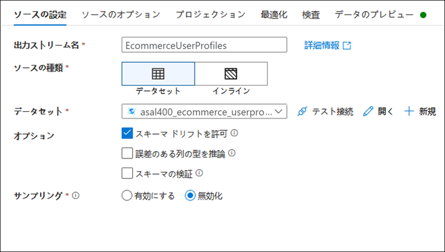

7. 「**ソースのオプション**」 タブを選択し、以下のように構成します。

    - **ワイルドカード パス**: `online-user-profiles-02/.json`*.json` と入力します。
    - **JSON 設定**: このセクションを展開し、「**ドキュメントの配列**」 設定を選択します。これにより、各ファイルに JSON ドキュメントの配列が含まれていることがわかります。

    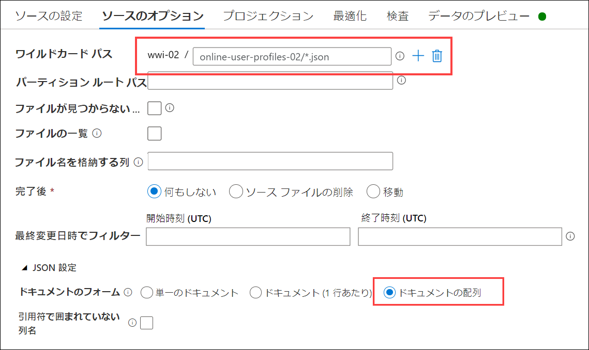

8. `EcommerceUserProfiles` ソースの右側で **+** を選択し、コンテキスト メニューで 「**派生列**」 スキーマ修飾子を選択します。

    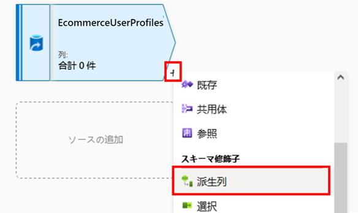

9. 「**派生列の設定**」 で以下を構成します。

    - **出力ストリーム名**: `userId` と入力します。
    - **着信ストリーム**: `EcommerceUserProfiles` を選択します。
    - **列**: 次の情報を指定します。

        | 列 | 式 | 説明 |
        | --- | --- | --- |
        | visitorId | `toInteger(visitorId)` | `visitorId` 列を文字列から整数に変換します。 |

    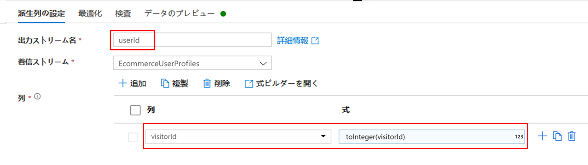

10. `userId` ステップの右側で **+** を選択し、コンテキスト メニューで 「**フラット化**」 を選択します。

    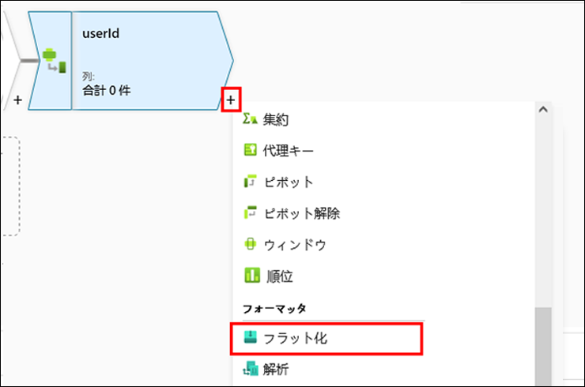

11. 「**設定のフラット化**」 で以下のように構成します。

    - **出力ストリーム名**: `UserTopProducts` を入力します。
    - **着信ストリーム**: `userId` を選択します。
    - **アンロール**: `[] topProductPurchases` を選択します。
    - **入力列**: 次の情報を指定します。

        | userId の列 | 名前を付ける |
        | --- | --- |
        | visitorId | `visitorId` |
        | topProductPurchases.productId | `productId` |
        | topProductPurchases.itemsPurchasedLast12Months | `itemsPurchasedLast12Months` |

        > 「**+ マッピングの追加**」 を選択し、「**固定マッピング**」 を選択して新しい列マッピングをそれぞれ追加します。

    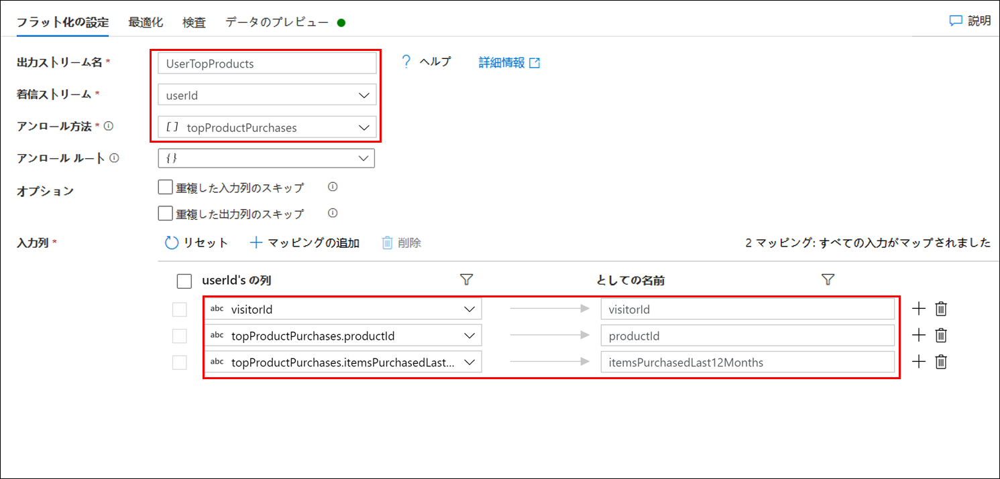

    この設定により、データ ソースのフラット化されたビューが、`visitorId` ごとにひとつまたは複数の行とともに表示されます。前のモジュールで Spark ノートブック内のデータを探索した場合に似ています。データ プレビューを使用するには、デバッグ モードを有効にする必要があります (このラボでは有効にしません)。*次のスクリーンショットは図示目的のみで掲載されています*。

    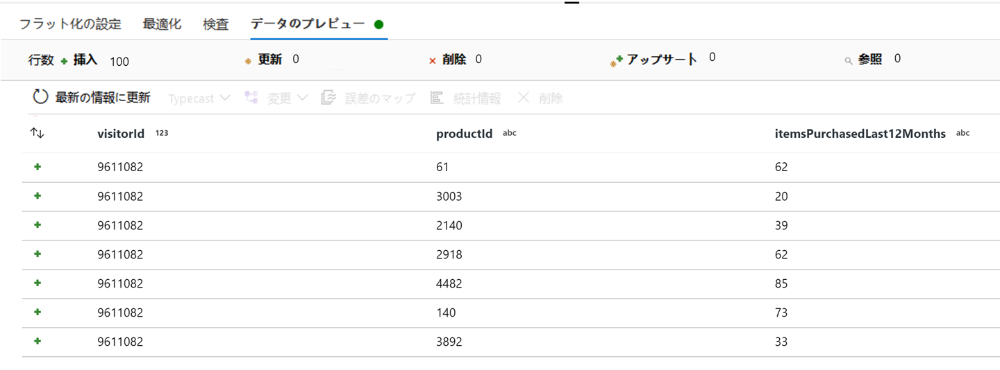

    > **重要**: 最新のリリースとともにバグが導入されました。userId ソース列はユーザー インターフェイスからは更新されません。一時的な修正として、データ フローのスクリプトにアクセスします (ツールバーにあります)。スクリプトで `userId` アクティビティを見つけ、mapColumn 関数で必ず適切なソース フィールドを追加します。`productId` は、ソースが **topProductPurchases.productId**で、**itemsPurchasedLast12Months** は **topProductPurchases.itemsPurchasedLast12Months** がソースであることを確認します。

    

    ```javascript
    userId foldDown(unroll(topProductPurchases),
        mapColumn(
            visitorId,
            productId = topProductPurchases.productId,
            itemsPurchasedLast12Months = topProductPurchases.itemsPurchasedLast12Months
        )
    ```

    

12. `UserTopProducts` ステップの右側で **+** を選択し、コンテキスト メニューで 「**派生列**」 スキーマ修飾子を選択します。

    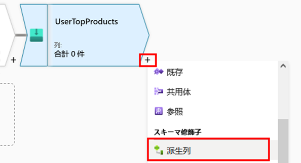

13. 「**派生列の設定**」 で以下を構成します。

    - **出力ストリーム名**: `DeriveProductColumns` と入力します。
    - **着信ストリーム**: `UserTopProducts` を選択します。
    - **列**: 次の情報を指定します。

        | 列 | 式 | 説明 |
        | --- | --- | --- |
        | productId | `toInteger(productId)` | `productId` 列を文字列から整数に変換します。 |
        | itemsPurchasedLast12Months | `toInteger(itemsPurchasedLast12Months)` | `itemsPurchasedLast12Months` 列を文字列から整数に変換します。 |

    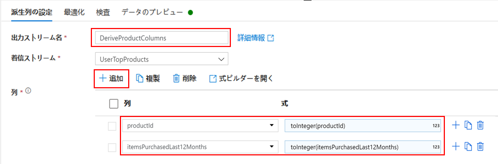

    > **注**: 列を派生列の設定に追加するには、最初の列の右にある **+** を選択し、「**列の追加**」 を選択します。

    

14. `EcommerceUserProfiles` ソースの下のデータ フロー キャンバスで 「**ソースの追加**」 を選択します。

    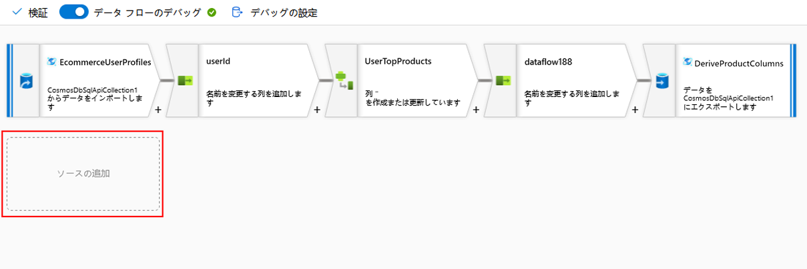

15. 「**ソース設定**」 で次のように構成します。

    - **出力ストリーム名**: `UserProfiles` と入力します。
    - **ソースの種類**: `Dataset` を選択します。
    - **データセット**: `asal400_customerprofile_cosmosdb` を選択します。

    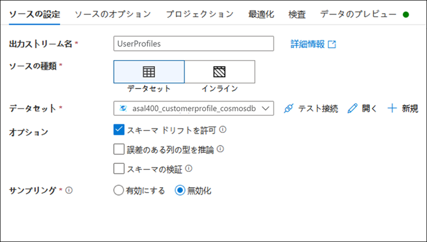

16. ここではデータ フロー デバッガーを使用しないので、データ フローのスクリプト ビューに入り、ソース プロジェクションを更新する必要があります。キャンバスの上のツールバーで 「**スクリプト**」 を選択します。

    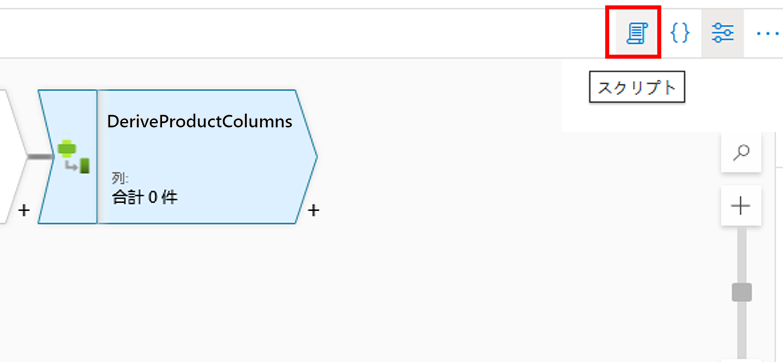

17. スクリプトで **UserProfiles** `source` を見つけ、そのスクリプト ブロックを以下に置き換え、`preferredProducts` を `integer[]` 配列として設定します。`productReviews` 配列内のデータ型が適正に定義されていることを確認してください。

    ```json
    source(output(
            cartId as string,
            preferredProducts as integer[],
            productReviews as (productId as integer, reviewDate as string, reviewText as string)[],
            userId as integer
        ),
        allowSchemaDrift: true,
        validateSchema: false,
        ignoreNoFilesFound: false,
        format: 'document') ~> UserProfiles
    ```

    

18. 「**OK**」 を選択して、スクリプトの変更を適用します。データ ソースが新しいスキーマで更新されました。以下のスクリーンショットは、データ プレビュー オプションで表示した場合にソース データがどのようになるのかを示しています。データ プレビューを使用するには、デバッグ モードを有効にする必要があります (このラボでは有効にしません)。*次のスクリーンショットは図示目的のみで掲載されています*。

    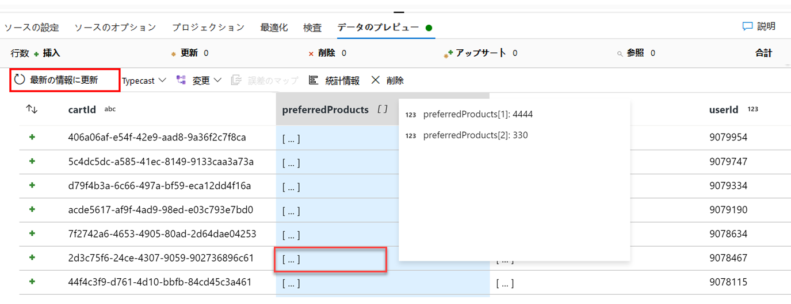

19. `UserProfiles` ソースの右側で **+** を選択し、コンテキスト メニューで 「**フラット化**」 を選択します。

    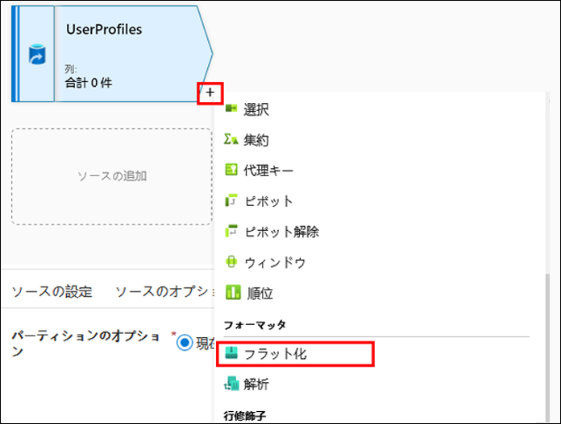

20. 「**設定のフラット化**」 で以下のように構成します。

    - **出力ストリーム名**: `UserPreferredProducts` と入力します。
    - **着信ストリーム**: `UserProfiles` を選択します。
    - **アンロール**: `[] preferredProducts` を選択します。
    - **入力列**: 次の情報を指定します。必ず `cartId` と `[] productReviews` を**削除**してください。

        | UserProfiles の列 | 名前を付ける |
        | --- | --- |
        | [] preferredProducts | `preferredProductId` |
        | userId | `userId` |

        > 「**+ マッピングの追加**」 を選択し、「**固定マッピング**」 を選択して新しい列マッピングをそれぞれ追加します。

    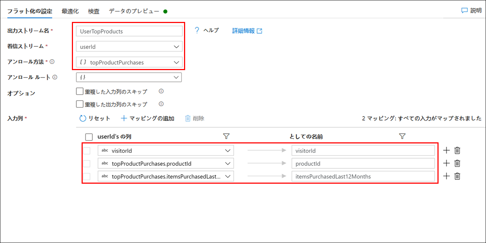

    これらの設定では、`userId` ごとにひとつまたは複数の行を含むデータ ソースのフラット化されたビューが表示されます。データ プレビューを使用するには、デバッグ モードを有効にする必要があります (このラボでは有効にしません)。*次のスクリーンショットは図示目的のみで掲載されています*。

    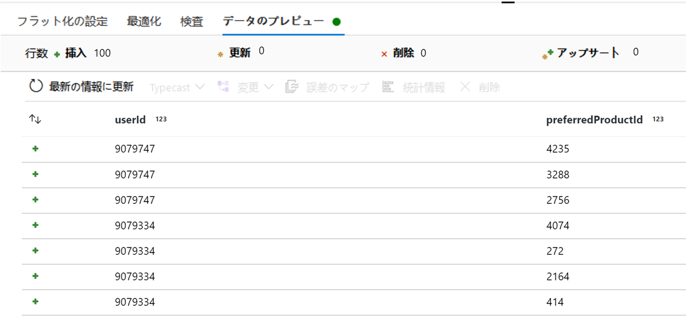

21. これで 2 つのデータ ソースを結合できます。`DeriveProductColumns` ステップの右側で **+** を選択し、コンテキスト メニューで 「**結合**」 オプションを選択します。

    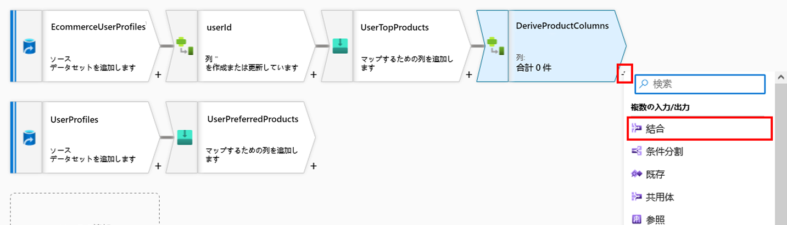

22. 「**結合設定**」 で以下を構成します。

    - **出力ストリーム名**: `JoinTopProductsWithPreferredProducts` と入力します。
    - **左側のストリーム**: `DeriveProductColumns` を選択します。
    - **右側のストリーム**: `UserPreferredProducts` を選択します。
    - **結合の種類**: `Full outer` を選択します。
    - **結合条件**: 次の情報を指定します。

        | 左: DeriveProductColumns's column | 右: UserPreferredProducts's column |
        | --- | --- |
        | `visitorId` | `userId` |

    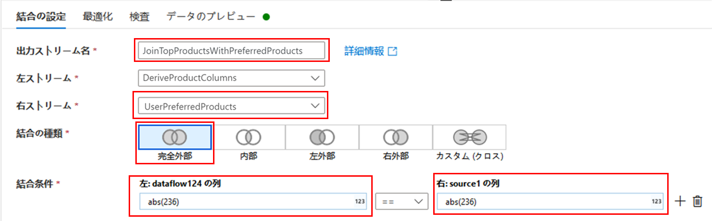

23. 「**最適化**」 を選択して以下のように構成します。

    - **ブロードキャスト**: `Fixed` を選択します。
    - **ブロードキャスト オプション**: `Left:  'DeriveProductColumns'` を選択します。
    - **パーティション オプション**: `Set partitioning` を選択します。
    - **パーティションの種類**: `Hash` を選択します。
    - **パーティションの数**: `30` と入力します。
    - **列**: `productId` を選択します。

    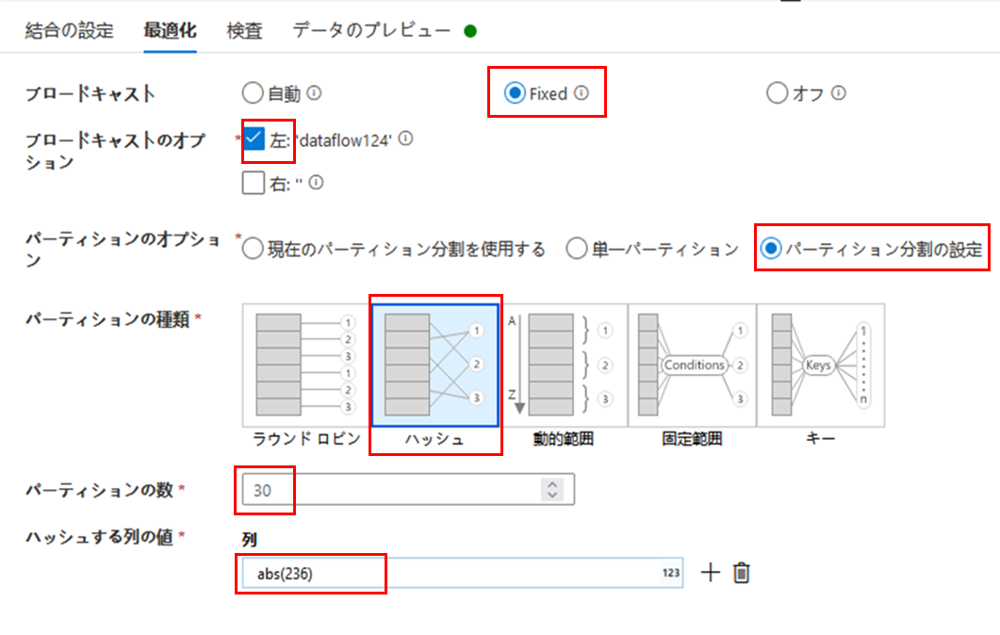

    <!-- **TODO**: 最適化の説明を追加します。-->

24. 「**検査**」 タブを選択して結合のマッピングを表示します。列フィード ソースのほか、列を結合で使用するかどうかが含まれています。

    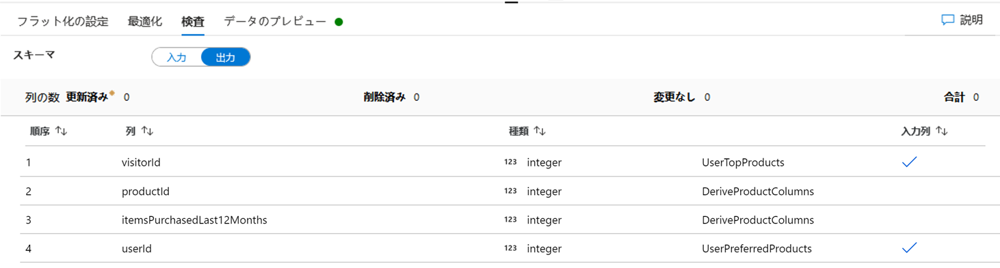

    **データ プレビューの図示目的のみ:** ここではデータ フローのデバッグをオンにしないので、このステップは実行しないでください。この小さいデータのサンプルでは、`userId` と `preferredProductId` 列に null 値のみが表示される可能性があります。これらのフィールドに値が含まれる記録がいくつあるのか感覚をつかみたい場合は、`preferredProductId` などの列を選択し、上のツールバーで 「**統計**」 を選択します。その列のグラフが、値の比率とともに表示されます。

    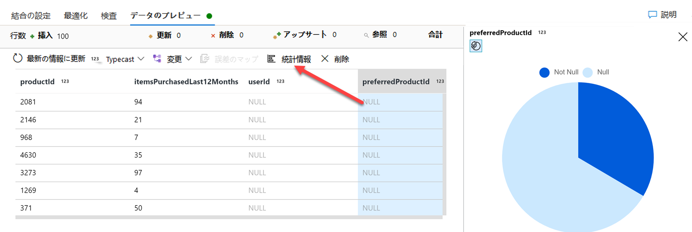

25. `JoinTopProductsWithPreferredProducts` ステップの右側で **+** を選択し、コンテキスト メニューで 「**派生列**」 スキーマ修飾子を選択します。

    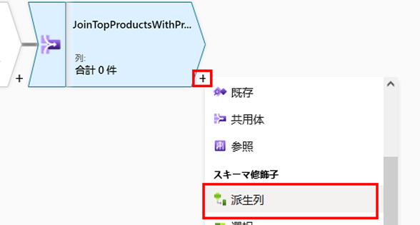

26. 「**派生列の設定**」 で以下を構成します。

    - **出力ストリーム名**: `DerivedColumnsForMerge` と入力します。
    - **着信ストリーム**: `JoinTopProductsWithPreferredProducts` を選択します。
    - **列**: 次の情報を指定します (**__最初の 2 つ_の列の名前で入力**)。

        | 列 | 式 | 説明 |
        | --- | --- | --- |
        | isTopProduct | `toBoolean(iif(isNull(productId), 'false', 'true'))` | `productId` が null でない場合は `true` を返します。`productId` は e コマースの上位ユーザー製品データ系列からフィードされます。 |
        | isPreferredProduct | `toBoolean(iif(isNull(preferredProductId), 'false', 'true'))` | `preferredProductId` が null でない場合は `true` を返します。`preferredProductId` は Azure Cosmos Dbのユーザー プロファイル データ系列からフィードされます。 |
        | productId | `iif(isNull(productId), preferredProductId, productId)` | `productId` が null かどうかによって、`productId` 出力は、`preferredProductId` または `productId` のいずれかの値に設定されます。
        | userId | `iif(isNull(userId), visitorId, userId)` | `userId` が null かどうかによって、`userId` 出力は、`visitorId` または `userId` のいずれかの値に設定されます。

    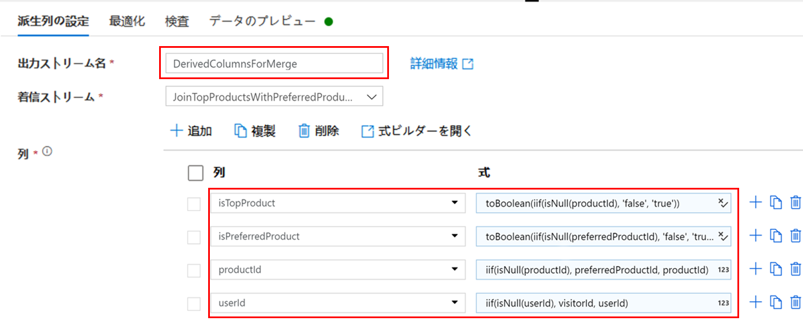

    > **注**: **+** を選択し、派生列の右側で 「**列の追加**」 を選択して新しい列を追加します。

    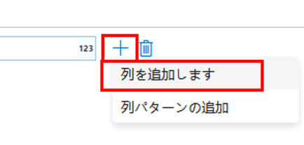

    派生列の設定により以下の結果が返されます。

    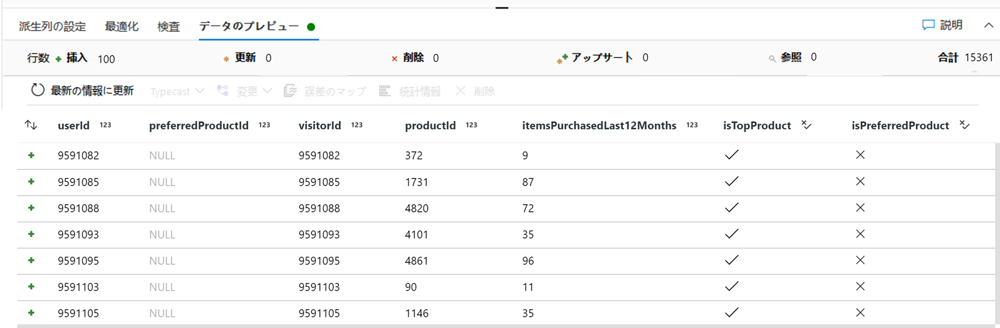

27. `DerivedColumnsForMerge` ステップの右側で **+** を選択し、コンテキスト メニューで 「**フィルター**」 の宛先を選択します。

    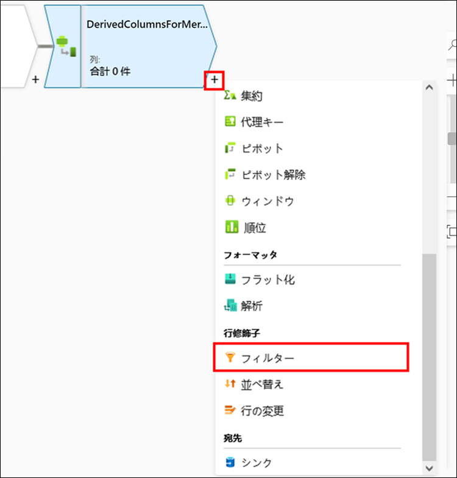

    `ProductId` が null の記録を削除するためにフィルターのステップを追加しています。データ セットには、わずかながら無効の記録が含まれており、null `ProductId` 値により、`UserTopProductPurchases` 専用 SQL プール テーブルに読み込む際にエラーが発生します。

28. 「**フィルター適用**」 式を **`!isNull(productId)`** に設定します。

    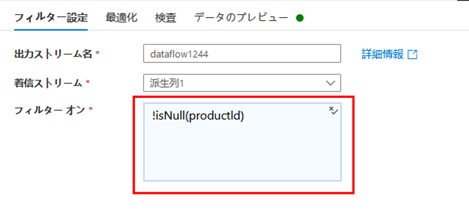

29. `Filter1` ステップの右側で **+** を選択し、コンテキスト メニューで 「**シンク**」 の宛先を選択します。

    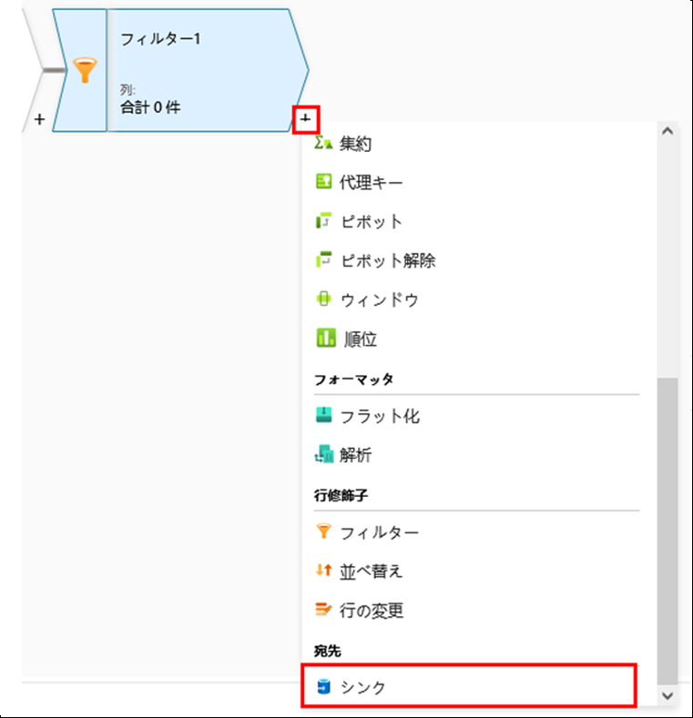

30. 「**シンク**」 で以下を構成します。

    - **出力ストリーム名**: `UserTopProductPurchasesASA` と入力します。
    - **着信ストリーム**: `Filter1` を選択します。
    - **シンクの種類**: `Dataset` を選択します。
    - **データセット**: `asal400_wwi_usertopproductpurchases_asa` を選択します。これは UserTopProductPurchases SQL テーブルです。
    - **オプション**: `Allow schema drift` をチェックし、`Validate schema` はオフにします。

    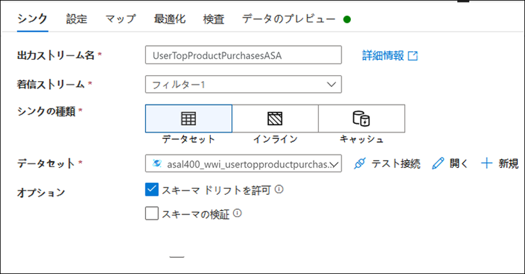

31. 「**設定**」 を選択して以下を構成します。

    - **更新方法**: `Allow insert` をチェックして、残りはオフのままにします。
    - **テーブル アクション**: `Truncate table` を選択します。
    - **ステージングの有効化**: このオプションは `Check` します。大量のデータをインポートするため、ステージングを有効にしてパフォーマンスを向上させることをめざします。

    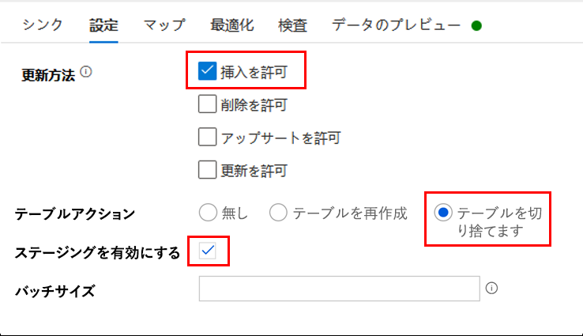

32. 「**マッピング**」 を選択して以下を構成します。

    - **自動マッピング**: このオプションは `Uncheck` にします。
    - **列**: 次の情報を指定します。

        | 入力列 | 出力列 |
        | --- | --- |
        | userId | UserId |
        | productId | ProductId |
        | itemsPurchasedLast12Months | ItemsPurchasedLast12Months |
        | isTopProduct | IsTopProduct |
        | isPreferredProduct | IsPreferredProduct |

    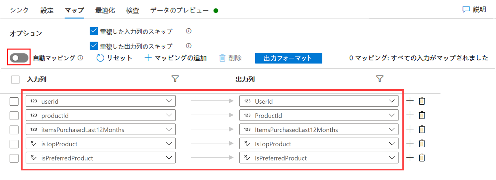

33. `Filter1` ステップの右側で **+** を選択し、コンテキスト メニューで 「**シンク**」 の宛先を選択して 2 番目のシンクを追加します。

    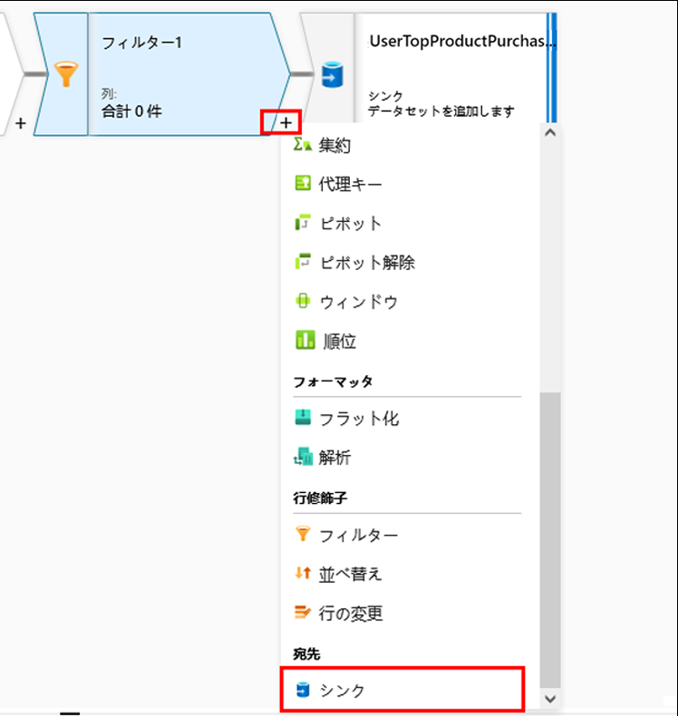

34. 「**シンク**」 で以下を構成します。

    - **出力ストリーム名**: `DataLake` と入力します。
    - **着信ストリーム**: `Filter1` を選択します。
    - **シンクの種類**: `Inline` を選択します。
    - **インライン データセットの種類**: `Delta` を選択します。
    - **リンク サービス**: 既定のワークスペース データ レイク ストレージ アカウントを開きます (例:  `asaworkspaceinaday84-WorspaceDefaultStorage`)。
    - **オプション**: `Allow schema drift` をチェックし、`Validate schema` はオフにします。

    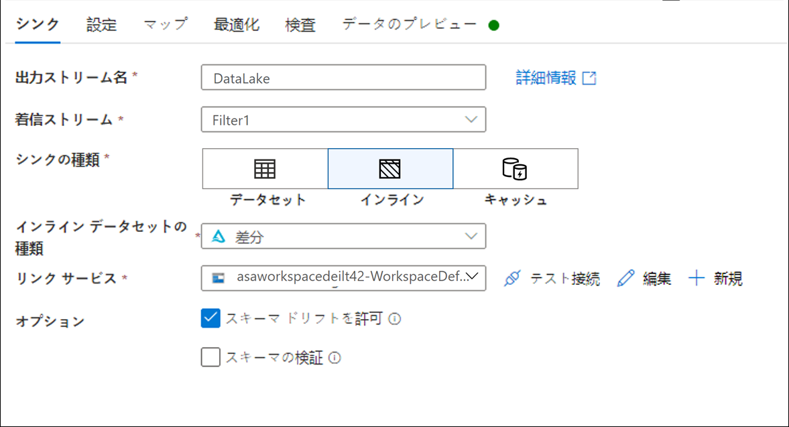

35. 「**設定**」 を選択して以下を構成します。

    - **フォルダー パス**: `wwi-02/top-products` と入力します (**`top-products` フォルダーはまだ存在しないため、これらの 2 つの値をコピーして**フィールドに貼り付けます)。
    - **圧縮の種類**: `Snappy` を選択します。
    - **圧縮レベル**: `Fastest` を選択します。
    - **データ削除**: 「0」と入力します。
    - **テーブルの切り詰め**: 選択します。
    - **更新方法**: `Allow insert` をチェックして、残りはオフのままにします。
    - **スキーマの統合 (Delta オプション)**: オフ。

    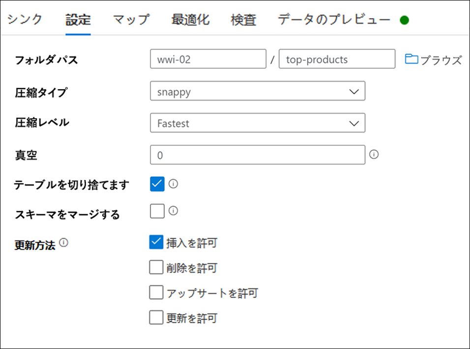

36. 「**マッピング**」 を選択して以下を構成します。

    - **自動マッピング**: このオプションは `Uncheck` にします。
    - **列**: 次の情報を指定します。

        | 入力列 | 出力列 |
        | --- | --- |
        | visitorId | visitorId |
        | productId | productId |
        | itemsPurchasedLast12Months | itemsPurchasedLast12Months |
        | preferredProductId | preferredProductId |
        | userId | userId |
        | isTopProduct | isTopProduct |
        | isPreferredProduct | isPreferredProduct |

    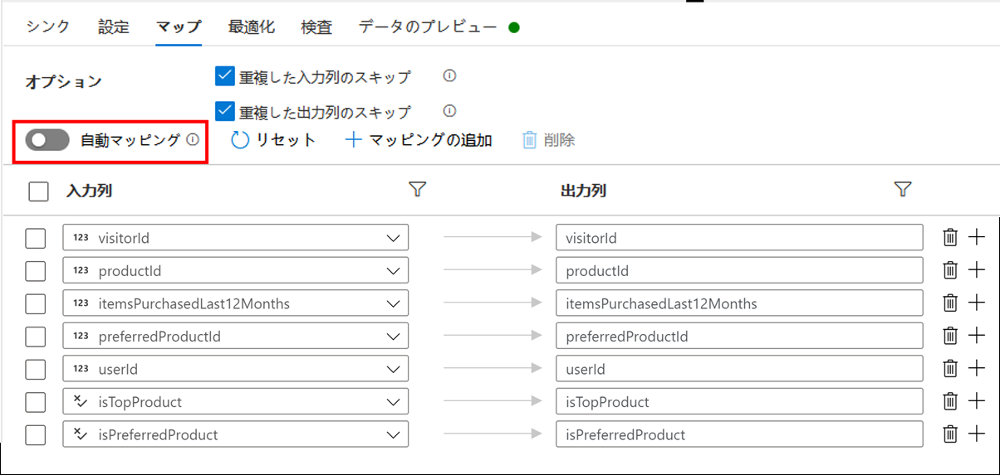

    > SQL プール シンクよりもデータ レイク シンクで多くのフィールドを維持することにした点に留意してください (`visitorId` と `preferredProductId`)。これは、固定宛先スキーマ (SQL テーブルなど) にとらわれず、データ レイクでオリジナル データをなるべく多く保持しようとしているためです。

37. 完成したデータ フローは次のようになるはずです。

    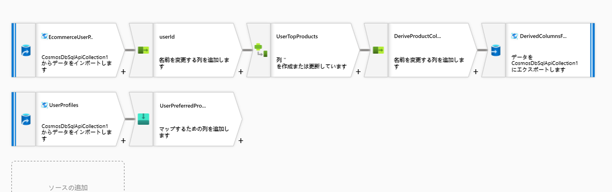

38. 「**すべて公開**」 を選択した後、**公開**して新しいデータ フローを保存します。

    

## ラボ 2: Azure Synapse パイプラインでデータの移動と変換を調整する

Tailwind Traders は Azure Data Factory (ADF) パイプラインの使用に慣れており、Azure Synapse Analytics を ADF に統合できるのか、またはそれに類似した機能があるのか知りたがっています。データ ウェアハウスの内外でデータ インジェスト、変換、読み込みアクティビティをデータ カタログ全体で調整したいと考えています。

あなたは、90 以上の組み込みコネクタが含まれている Synapse パイプラインを使用すると、パイプラインの手動実行または調整によってデータを読み込めるほか、一般的な読み込みパターンをサポートし、データ レイクまたは SQL テーブルへの完全な並列読み込みが可能で、ADF とコード ベースを共有できると推奨します。

Synapse パイプラインを使用すれば、Tailwind Traders は馴染みの深いインターフェイスを ADF として利用でき、Azure Synapse Analytics 以外の調整サービスを使用する必要がありません。

### 演習 1: パイプラインを作成、トリガー、監視する

#### タスク 1: パイプラインの作成

まず、新しいマッピング データ フローを実行しましょう。新しいデータ フローを実行するには、新しいパイプラインを作成してデータ フロー アクティビティを追加する必要があります。

1. 「**統合**」 ハブに移動します。

    

2. **+ (1)** を選択した後、**パイプライン (2)** を選択します。

    

3. 新しいデータ フローの 「**プロファイル**」 ペインの 「**全般**」 セクションで、「**名前**」 を以下に更新します: `Write User Profile Data to ASA`。

    

4. 「**プロパティ**」 ボタンを選択してペインを非表示にします。

    

5. アクティビティ リスト内で 「**移動と変換**」 を展開し、「**データ フロー**」 アクティビティをパイプライン キャンバスにドラッグします。

    

6. 「**全般**」 タブで名前を `write_user_profile_to_asa` に設定します。

    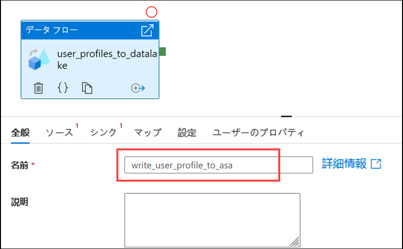

7. **「設定」** タブを選択します **(1)**。「**データ フロー**」 (2) で `write_user_profile_to_asa` を選択し、`AutoResolveIntegrationRuntime` が 「**実行 (Azure IR)**」 (3) で選択されていることを確認します。`General purpose` で 「**コンピューティング型**」 (4) を選び、`8 (+ 8 コア)` を 「**コア数**」 (5) で選択します。

    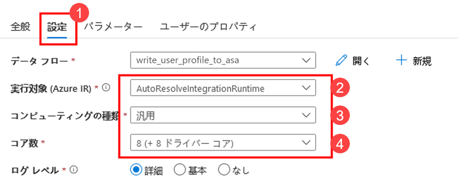

8. 「**ステージング**」 を選択して以下のように構成します。

    - **ステージング リンク サービス**: `asadatalakeSUFFIX` リンク サービスを選択します。
    - **ステージング ストレージ フォルダー**: `Staging/userprofiles` と入力します。最初のパイプライン実行中に `userprofiles` フォルダーが自動的に作成されます。

    > `staging` と `userprofiles` フォルダー名を 2 つのフィールドに**コピーして貼り付け**ます。

    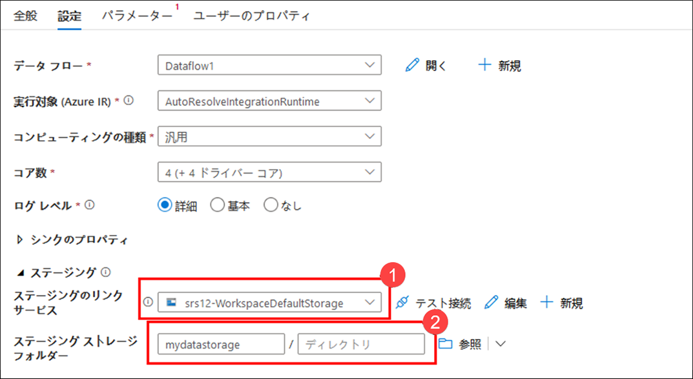

    PolyBase のステージング オプションは、大量のデータを Azure Synapse Analytics との間で移動する際に推奨されます。運用環境でデータ フローのステージングを有効にしたり無効にしたりして、パフォーマンスの差を評価するようお勧めします。

9. 「**すべて公開**」 を選択した後、**公開**してパイプラインを保存します。

    

#### タスク 2: ユーザー プロファイル データ パイプラインをトリガー、監視、分析する

Tailwind Traders は、あらゆるパイプライン実行を監視し、パフォーマンスの調整とトラブすシューティングのために統計情報を表示することを希望しています。

あなたは、手動でパイプライン実行をトリガー、監視、分析する方法を Tailwind Traders に説明することにしました。

1. パイプラインの最上部で 「**トリガーの追加**」 (1) を選択した後、「**今すぐトリガー**」 (2) を選択します。

    

2. このパイプラインにはパラメーターがないため、「**OK**」 を選択してトリガーを実行します。

    !「「OK」 ボタンが強調表示されています。](media/pipeline-run-trigger.png "Pipeline run")

3. 「**監視**」 ハブに移動します。

    

4. 「**パイプライン実行**」 (1) を選択し、パイプラインの実行が完了するのを待ちます **(2)**。場合によっては、ビューを更新する必要があります **(3)**。

    > これを実行している間に、ラボの手順の残りを読み、内容をよく理解しておいてください。

    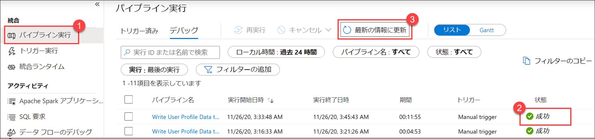

5. パイプラインの名前を選択し、パイプラインのアクティビティ実行を表示します。

    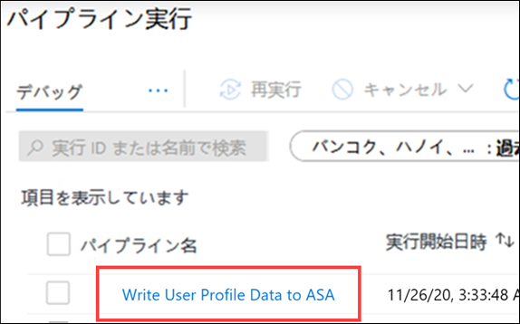

6. `Activity runs` リストでデータ フロー アクティビティの上にマウスを動かし、「**データ フローの詳細**」 アイコンを選択します。

    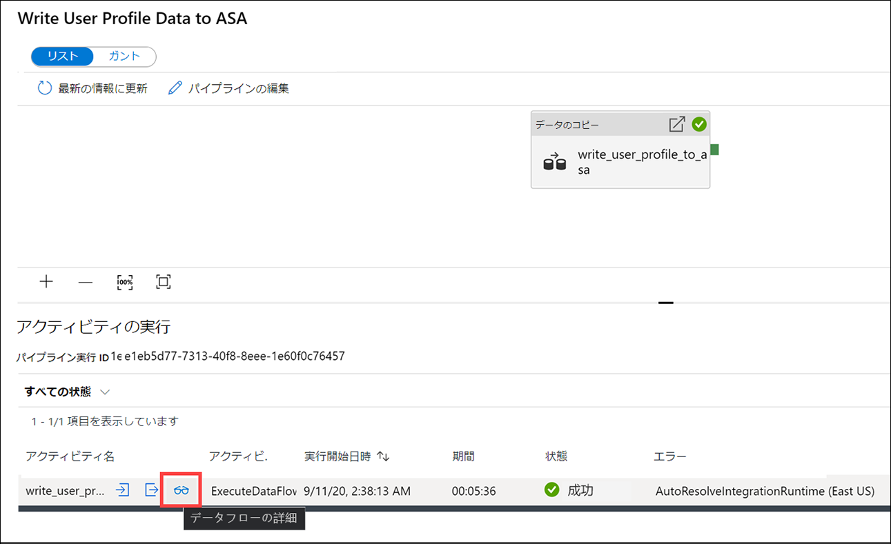

7. データ フローの詳細に、データ フローの手順と処理の詳細が表示されます。この例では、処理時間は SQL プール シンクの処理では約 **44 秒** **(1)**、データ レイク シンクの処理では約 **12 秒** **(2)** でした。Filter1 出力は、どちらでも **100 万行 (3)** 程度でした。どのアクティビティで完了までの時間が最も長かったのか確認できます。クラスター起動時間は合計パイプライン実行のうち **2.5 分 (4)** 以上を占めていました。

    

8. `UserTopProductPurchasesASA` シンク **(1)** を選択して詳細を表示します。**1,622,203 行** が計算されており **(2)**、パーティションは合計 30 だったことがわかります。SQL テーブルにデータを書き込む前、ADLS Gen2 でのデータのステージングには約 **8 秒** かかりました **(3)**。この場合の合計シンク処理時間は約 **44 秒 (4)** でした。また、他のパーティションよりもはるかに大きい**ホット パーティション (5)** があります。このパイプラインのパフォーマンスをもう少し向上させる必要がある場合は、データ パーティションを再評価し、パーティションをもっと均等に広げ、並列データ読み込み・フィルタリングを向上させることができます。また、ステージングを無効にして処理時間が変化するか試してみることも可能です。最後に、専用 SQL プールの大きさは、シンクへのデータの取り込み時間に影響を与えます。

    
