# モジュール 9 - ノートブックのデータを Azure Data Factory または Azure Synapse パイプラインと統合する

Azure Synapse パイプラインでリンク サービスを作成し、データの移動と変換を調整する方法を学習します。

このモジュールでは、次のことができるようになります。

- Azure Synapse パイプラインでデータの移動と変換を調整する

## ラボの詳細

- [モジュール 9 - ノートブックのデータを Azure Data Factory または Azure Synapse パイプラインと統合する](#module-9---integrate-data-from-notebooks-with-azure-data-factory-or-azure-synapse-pipelines)
  - [ラボの詳細](#lab-details)
  - [ラボの構成と前提条件](#lab-setup-and-pre-requisites)
  - [演習 1: リンク サービスとデータセット](#exercise-1-linked-service-and-datasets)
    - [タスク 1: リンク サービスを作成する](#task-1-create-linked-service)
    - [タスク 2: データセットを作成する](#task-2-create-datasets)
  - [演習 2: マッピング データ フローとパイプラインを作成する](#exercise-2-create-mapping-data-flow-and-pipeline)
    - [タスク 1: ADLS Gen2 のリンク サービス名を取得する](#task-1-retrieve-the-adls-gen2-linked-service-name)
    - [タスク 2: マッピング データ フローを作成する](#task-2-create-mapping-data-flow)
    - [タスク 3: パイプラインの作成](#task-3-create-pipeline)
    - [タスク 4: パイプラインをトリガーする](#task-4-trigger-the-pipeline)
  - [演習 3: Synapse Spark ノートブックを作成して上位製品を見つける](#exercise-3-create-synapse-spark-notebook-to-find-top-products)
    - [タスク 1: ノートブックを作成する](#task-1-create-notebook)
    - [タスク 2: ノートブックをパイプラインに追加する](#task-2-add-the-notebook-to-the-pipeline)

> **すること:** モジュール 9 のデータ ソース、マッピング データ フロー、パイプラインをモジュール 10 の設定に含めます。

## ラボの構成と前提条件

> **注:** ホストされたラボ環境を**使用しておらず**、ご自分の Azure サブスクリプションを使用している場合は、`Lab setup and pre-requisites` の手順のみを完了してください。その他の場合は、演習 1 にスキップします。

このモジュールの**[ラボの構成手順](https://github.com/solliancenet/microsoft-data-engineering-ilt-deploy/blob/main/setup/04/README.md)を完了**してください。

以下のモジュールは、同じ環境を共有している点に留意してください。

- [モジュール 4](labs/04/README.md)
- [モジュール 5](labs/05/README.md)
- [モジュール 7](labs/07/README.md)
- [モジュール 8](labs/08/README.md)
- [モジュール 9](labs/09/README.md)
- [モジュール 10](labs/10/README.md)
- [モジュール 11](labs/11/README.md)
- [モジュール 12](labs/12/README.md)
- [モジュール 13](labs/13/README.md)
- [モジュール 16](labs/16/README.md)

## 演習 1: リンク サービスとデータセット

**注**: モジュール 8 を**完了していない**場合、または以下の Synapse 成果物がない場合にこの演習を完了してください。

- リンク サービス:
  - `asacosmosdb01`
- データセット:
  - `asal400_ecommerce_userprofiles_source`
  - `asal400_customerprofile_cosmosdb`

モジュール 8 を完了しているか、すでにこれらの成果物がある場合は、演習 2 に進んでください。

### タスク 1: リンクされたサービスの作成

以下の手順で、Azure Cosmos DB リンク サービスを作成してください。

> **注**: すでに Cosmos DB リンク サービスを作成している場合は、このセクションをスキップしてください。

1. Synapse Studio (<https://web.azuresynapse.net/>) を開き、「**管理**」 ハブまでナビゲートします。

    

2. 「**リンク サービス**」 を開き、「**+ 新規**」 を選択して新しいリンク サービスを作成します。オプションのリストで 「**Azure Cosmos DB (SQL API)**」 を選択し、「**続行**」 を選択します。

    

3. リンク サービスに `asacosmosdb01` **(1)** という名前を付け、「**Cosmos DB アカウント名**」 (`asacosmosdbSUFFIX`) を選択して 「**データベース名**」 の値を `CustomerProfile` **(2)** に設定します。「**テスト接続**」 を選択して接続成功を確認してから **(3)**、「**作成**」 (4) を選択します。

    

### タスク 2: データセットを作成する

以下の手順を完了して、`asal400_customerprofile_cosmosdb` データセットを作成してください。

> **プレゼンターへのメモ**: すでにモジュール 4 を完了している場合は、このセクションをスキップしてください。

1. 「**データ**」 ハブに移動します。

    

2. ツールバーで **+** を選択し **(1)**、「**統合データセット**」 (2) を選択して新しいデータセットを作成します。

    

3. リストから 「**Azure Cosmos DB (SQL API)**」 **(1)** を選択し、「**続行**」 (2) を選択します。

    

4. 以下の特徴でデータセットを構成し、「**OK**」 (4) を選択します。

    - **名前**: `asal400_customerprofile_cosmosdb` **(1)** と入力します。
    - **リンク サービス**: Azure Cosmos DB リンク サービス **(2)** を選択します。
    - **コレクション**: `OnlineUserProfile01` **(3)** を選択します。

    

5. ツールバーで **+** を選択し **(1)**、「**統合データセット**」 (2) を選択して新しいデータセットを作成します。

    

6. リストから 「**Azure Data Lake Storage Gen2**」 **(1)** を選択し、「**続行**」 (2) を選択します。

    

7. 「**JSON**」 形式 **(1)** を選び、「**続行**」 (2) を選択します。

    

8. 以下の特徴でデータセットを構成し、「**OK**」 (5) を選択します。

    - **名前**: `asal400_ecommerce_userprofiles_source` **(1)** と入力します。
    - **リンク サービス**: すでに存在する `asadatalakeXX` リンク サービスを選択します **(2)**。
    - **ファイル パス**: `Wwi-02/online-user-profiles-02` パスを参照します **(3)**。
    - **スキーマのインポート**: `From connection/store` **(4)** を選択します。

    

9. 「**すべて公開**」 を選択した後、**公開**して新しいリソースを保存します。

    

## 演習 2: マッピング データ フローとパイプラインを作成する

この演習では、ユーザー プロファイル データをデータ レイクにコピーするマッピング データ フローを作成した後、データ フローと、このラボで後ほど作成する Spark ノートブックの実行を調整するパイプラインを作成します。

### タスク 1: ADLS Gen2 のリンク サービス名を取得する

1. 「**管理**」 ハブに移動します。

    

2. 左側のメニューで 「**リンク サービス**」 を選択します。リストで **Azure Data Lake Storage Gen2** リンク サービスを見つけ、そのサービスの上にマウスを動かして 「**{} コード**」 を選択します。

    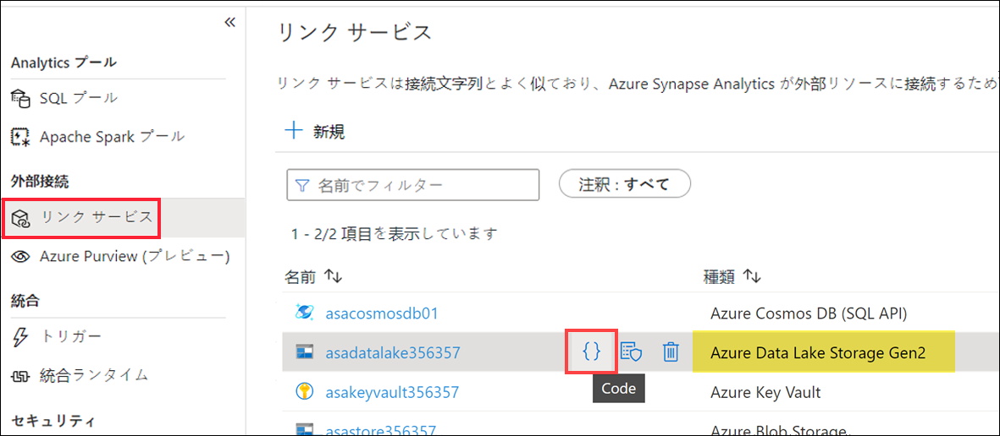

3. リンク サービスの**名前**をコピーし、「**キャンセル**」 を選択してダイアログを閉じます。この値をメモ帳や他のテキスト エディターに保存して、後ほど使えるようにします。

    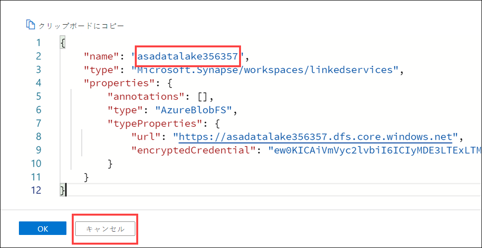

### タスク 2: マッピング データ フローを作成する

1. 「**開発**」 ハブに移動します。

    

2. + を選択してから 「**データ フロー**」 を選び、新しいデータ フローを作成します。

    

3. 新しいデータ フローの 「**プロパティ**」 ブレードの 「**全般**」 設定で、「**名前**」 を`User_profiles_to_datalake` に更新します。名前が正確に一致していることを確認します。一致していなければ、今後、コード ビューを閉じる際にエラー メッセージが表示されます。

    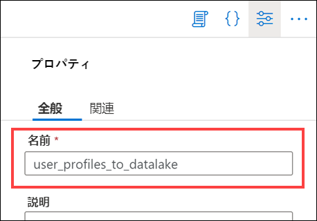

4. データ フロー プロパティの右上で 「**{} コード**」 ボタンを選択します。

    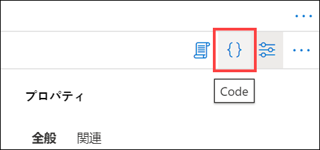

5. 既存のコードを以下に**置き換えます**。

    ```json
    {
        "name": "user_profiles_to_datalake",
        "properties": {
            "type": "MappingDataFlow",
            "typeProperties": {
                "sources": 「
                    {
                        "dataset": {
                            "referenceName": "asal400_ecommerce_userprofiles_source",
                            "type": "DatasetReference"
                        },
                        "name": "EcommerceUserProfiles"
                    },
                    {
                        "dataset": {
                            "referenceName": "asal400_customerprofile_cosmosdb",
                            "type": "DatasetReference"
                        },
                        "name": "UserProfiles"
                    }
                」,
                "sinks": 「
                    {
                        "linkedService": {
                            "referenceName": "INSERT_YOUR_DATALAKE_SERVICE_NAME",
                            "type": "LinkedServiceReference"
                        },
                        "name": "DataLake"
                    }
                」,
                "transformations": 「
                    {
                        "name": "userId"
                    },
                    {
                        "name": "UserTopProducts"
                    },
                    {
                        "name": "DerivedProductColumns"
                    },
                    {
                        "name": "UserPreferredProducts"
                    },
                    {
                        "name": "JoinTopProductsWithPreferredProducts"
                    },
                    {
                        "name": "DerivedColumnsForMerge"
                    },
                    {
                        "name": "Filter1"
                    }
                」,
                "script": "source(output(\n\t\tvisitorId as string,\n\t\ttopProductPurchases as (productId as string, itemsPurchasedLast12Months as string)[]\n\t),\n\tallowSchemaDrift: true,\n\tvalidateSchema: false,\n\tignoreNoFilesFound: false,\n\tdocumentForm: 'arrayOfDocuments',\n\twildcardPaths:['online-user-profiles-02/*.json']) ~> EcommerceUserProfiles\nsource(output(\n\t\tcartId as string,\n\t\tpreferredProducts as integer[],\n\t\tproductReviews as (productId as integer, reviewDate as string, reviewText as string)[],\n\t\tuserId as integer\n\t),\n\tallowSchemaDrift: true,\n\tvalidateSchema: false,\n\tformat: 'document') ~> UserProfiles\nEcommerceUserProfiles derive(visitorId = toInteger(visitorId)) ~> userId\nuserId foldDown(unroll(topProductPurchases),\n\tmapColumn(\n\t\tvisitorId,\n\t\tproductId = topProductPurchases.productId,\n\t\titemsPurchasedLast12Months = topProductPurchases.itemsPurchasedLast12Months\n\t),\n\tskipDuplicateMapInputs: false,\n\tskipDuplicateMapOutputs: false) ~> UserTopProducts\nUserTopProducts derive(productId = toInteger(productId),\n\t\titemsPurchasedLast12Months = toInteger(itemsPurchasedLast12Months)) ~> DerivedProductColumns\nUserProfiles foldDown(unroll(preferredProducts),\n\tmapColumn(\n\t\tpreferredProductId = preferredProducts,\n\t\tuserId\n\t),\n\tskipDuplicateMapInputs: false,\n\tskipDuplicateMapOutputs: false) ~> UserPreferredProducts\nDerivedProductColumns, UserPreferredProducts join(visitorId == userId,\n\tjoinType:'outer',\n\tpartitionBy('hash', 30,\n\t\tproductId\n\t),\n\tbroadcast: 'left')~> JoinTopProductsWithPreferredProducts\nJoinTopProductsWithPreferredProducts derive(isTopProduct = toBoolean(iif(isNull(productId), 'false', 'true')),\n\t\tisPreferredProduct = toBoolean(iif(isNull(preferredProductId), 'false', 'true')),\n\t\tproductId = iif(isNull(productId), preferredProductId, productId),\n\t\tuserId = iif(isNull(userId), visitorId, userId)) ~> DerivedColumnsForMerge\nDerivedColumnsForMerge filter(!isNull(productId)) ~> Filter1\nFilter1 sink(allowSchemaDrift: true,\n\tvalidateSchema: false,\n\tformat: 'delta',\n\tcompressionType: 'snappy',\n\tcompressionLevel: 'Fastest',\n\tfileSystem: 'wwi-02',\n\tfolderPath: 'top-products',\n\ttruncate:true,\n\tmergeSchema: false,\n\tautoCompact: false,\n\toptimizedWrite: false,\n\tvacuum: 0,\n\tdeletable:false,\n\tinsertable:true,\n\tupdateable:false,\n\tupsertable:false,\n\tmapColumn(\n\t\tvisitorId,\n\t\tproductId,\n\t\titemsPurchasedLast12Months,\n\t\tpreferredProductId,\n\t\tuserId,\n\t\tisTopProduct,\n\t\tisPreferredProduct\n\t),\n\tskipDuplicateMapInputs: true,\n\tskipDuplicateMapOutputs: true) ~> DataLake"
            }
        }
    }
    ```

6. `line 25` で **INSERT_YOUR_DATALAKE_SERVICE_NAME** を、前のタスク (タスク 1) でコピーした ADLS Gen2 リンク サービスの名前に置き換えます。

    

    この値には、リンク サービスの名前が含まれているはずです。

    

7. 「**OK**」 を選択します。

8. データ フローは次のようになります。

    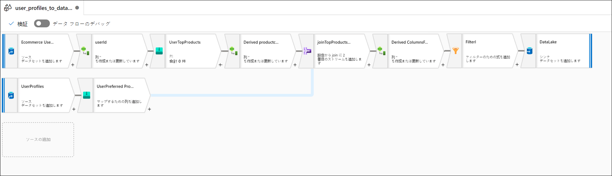

### タスク 3: パイプラインの作成

この手順では、新しい統合パイプラインを作成してデータ フローを実行します。

1. 「**統合**」 ハブに移動します。

    

2. **+ (1)** を選択した後、**パイプライン (2)** を選択します。

    

3. 新しいデータ フローの 「**プロファイル**」 ペインの 「**全般**」 セクションで、「**名前**」 を以下に更新します: `User Profiles to Datalake`。「**プロパティ**」 ボタンを選択してペインを非表示にします。

    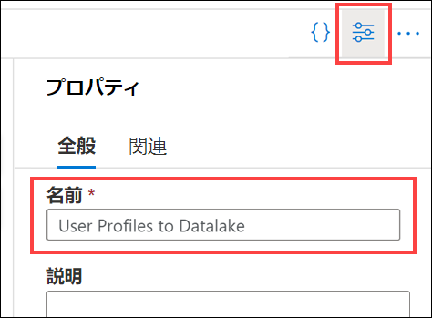

4. アクティビティ リスト内で 「**移動と変換**」 を展開し、「**データ フロー**」 アクティビティをパイプライン キャンバスにドラッグします。

    

5. 「**全般**」 タブで名前を `user_profiles_to_datalake` に設定します。

    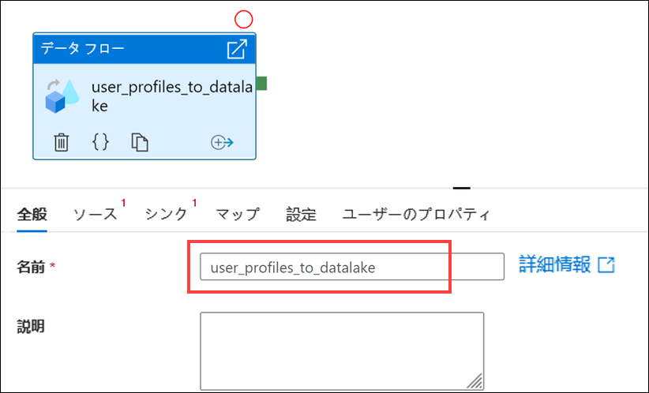

6. **「設定」** タブを選択します **(1)**。「**データ フロー**」 (2) で `user_profiles_to_datalake` を選択し、`AutoResolveIntegrationRuntime` が 「**実行 (Azure IR)**」 (3) で選択されていることを確認します。`General purpose` で 「**コンピューティング型**」 (4) を選び、`8 (+ 8 コア)` を 「**コア数**」 (5) で選択します。

    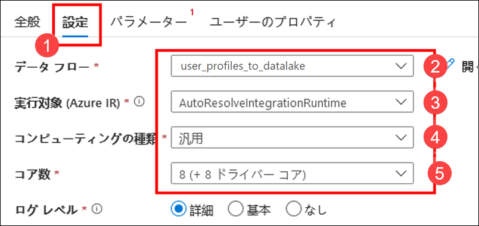

7. 「**すべて公開**」 を選択した後、**公開**してパイプラインを保存します。

    

### タスク 4: パイプラインをトリガーする

1. パイプラインの最上部で 「**トリガーの追加**」 (1) を選択した後、「**今すぐトリガー**」 (2) を選択します。

    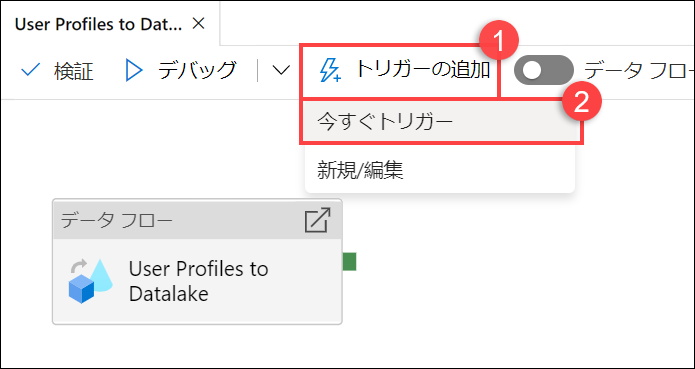

2. このパイプラインにはパラメーターがないため、「**OK**」 を選択してトリガーを実行します。

    

3. 「**監視**」 ハブに移動します。

    

4. 「**パイプライン実行**」 (1) を選択し、パイプラインの実行が完了するのを待ちます **(2)**。場合によっては、ビューを更新する必要があります **(3)**。

    > これを実行している間に、ラボの手順の残りを読み、内容をよく理解しておいてください。

    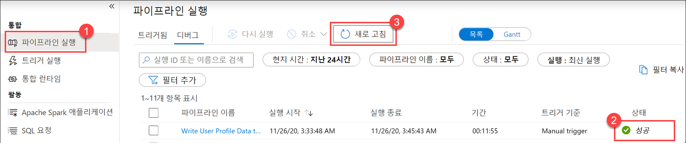

## 演習 3: Synapse Spark ノートブックを作成して上位製品を見つける

Tailwind Traders は Synapse Analytics でマッピング データ フローを使用して、ユーザー プロファイル データの処理、結合、インポートを行っています。どの製品が顧客に好まれ、購入上位なのか、また、過去 12 ヶ月で最も購入されたのはｄの製品かに基づいて各ユーザーの上位 5 製品を把握したいと考えています。その後、全体的な上位 5 製品を計画する予定です。

ラボのこのセグメントでは、Synapse Spark ノートブックを作成して、このような計算を行います。

> データ フローの 2 番目のシンクとして追加されたデータ レイクからデータにアクセスできるようにして、専用 SQL プールへの依存を排除します。

### タスク 1: ノートブックを作成する

1. Synapse Analytics Studio (<https://web.azuresynapse.net/>) を開き、「**データ**」 ハブに移動します。

    

2. 「**リンク済み**」 タブ **(1)** を選択し、**Azure Data Lake Storage Gen2** で**プライマリ　データ レイク ストレージ アカウント (2)** を展開します。**wwi-02** コンテナー **(3)** を選択して **top-products** フォルダー **(4)** を開きます。任意の Parquet ファイル **(5)** を右クリックし、「**新しいノートブック**」 メニュー項目 **(6)** を選択してから 「**DataFrame に読み込む**」 (7) を選択します。フォルダーが表示されない場合は、上にある `Refresh` を選択します。

    

3. ノートブックが Spark プールに添付されていることを確認します。

    

4. Parquet ファイル名を `*.parquet` **(1)** に置き換え、`top-products` のすべての Parquet ファイルを選択します。たとえば、パスは次のようになります:  `abfss://wwi-02@YOUR_DATALAKE_NAME.dfs.core.windows.net/top-products/*.parquet`。

    

5. ノートブックのツールバーで 「**すべて実行**」 を選択し、ノートブックを実行します。

    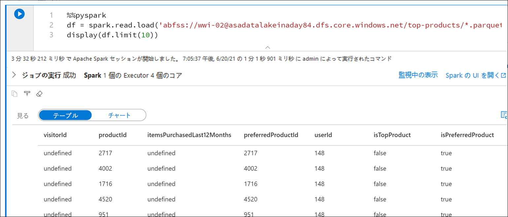

    > **注:** Spark プールでノートブックを初めて実行すると、Synapse によって新しいセッションが作成されます。これには、3 から 5 分ほどかかる可能性があります。

    > **注:** セルだけを実行するには、セルの上にポインターを合わせ、セルの左側にある 「_セルの実行_」 アイコンを選択するか、セルを選択してキーボードで **Ctrl + Enter** キーを押します。

6. **+** ボタンを選択してから 「**</> コード セル**」 項目を選択して新しいセルを作成します。+ ボタンは左側のノートブック セルの下にあります。

    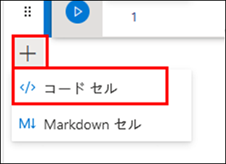

7. 新しいセルで以下を入力して実行し、`topPurchases` という新しいデータフレームにデータを読み込み、`top_purchases` という新しい一時的なビューを作成して最初の 100 行を示します。

    ```python
    topPurchases = df.select(
        "UserId", "ProductId",
        "ItemsPurchasedLast12Months", "IsTopProduct",
        "IsPreferredProduct")

    # Populate a temporary view so we can query from SQL
    topPurchases.createOrReplaceTempView("top_purchases")

    topPurchases.show(100)
    ```

    出力は次のようになります。

    ```text
    +------+---------+--------------------------+------------+------------------+
    |UserId|ProductId|ItemsPurchasedLast12Months|IsTopProduct|IsPreferredProduct|
    +------+---------+--------------------------+------------+------------------+
    |   148|     2717|                      null|       false|              true|
    |   148|     4002|                      null|       false|              true|
    |   148|     1716|                      null|       false|              true|
    |   148|     4520|                      null|       false|              true|
    |   148|      951|                      null|       false|              true|
    |   148|     1817|                      null|       false|              true|
    |   463|     2634|                      null|       false|              true|
    |   463|     2795|                      null|       false|              true|
    |   471|     1946|                      null|       false|              true|
    |   471|     4431|                      null|       false|              true|
    |   471|      566|                      null|       false|              true|
    |   471|     2179|                      null|       false|              true|
    |   471|     3758|                      null|       false|              true|
    |   471|     2434|                      null|       false|              true|
    |   471|     1793|                      null|       false|              true|
    |   471|     1620|                      null|       false|              true|
    |   471|     1572|                      null|       false|              true|
    |   833|      957|                      null|       false|              true|
    |   833|     3140|                      null|       false|              true|
    |   833|     1087|                      null|       false|              true|
    ```

8. 新しいセルで以下を実行し、新しい DataFrame を作成して、`IsTopProduct` と `IsPreferredProduct` が両方とも true の顧客に好まれているトップ製品のみを保持します。

    ```python
    from pyspark.sql.functions import *

    topPreferredProducts = (topPurchases
        .filter( col("IsTopProduct") == True)
        .filter( col("IsPreferredProduct") == True)
        .orderBy( col("ItemsPurchasedLast12Months").desc() ))

    topPreferredProducts.show(100)
    ```

    

9. 新しいセルで以下を実行し、SQL を使用して新しい一時的なビューを作成します。

    ```sql
    %%sql

    CREATE OR REPLACE TEMPORARY VIEW top_5_products
    _AS
        select UserId, ProductId, ItemsPurchasedLast12Months
        from (select *,
                    row_number() over (partition by UserId order by ItemsPurchasedLast12Months desc) as seqnum
            from top_purchases
            ) a
        where seqnum <= 5 and IsTopProduct == true and IsPreferredProduct = true
        order by a.UserId
    ```

    *上記のクエリの出力はない点に留意してください。*クエリでは `top_purchases` 一時的ビューをソースとして使用し、`row_number() over` メソッドを適用して、`ItemsPurchasedLast12Months` が最大の記録の行番号を各ユーザーに適用します。`where` 句が結果をフィルタリングするので、`IsTopProduct` と `IsPreferredProduct` が true に設定されている製品を最大 5 個まで取得できます。このため、各ユーザーが最も多く購入した上位 5 つの製品が表示されます。これらの製品は、Azure Cosmos DB に格納されているユーザー プロファイルに基づき、お気に入りの製品として_も_識別されています。

10. 新しいセルで以下を実行し、前のセルで作成した `top_5_products` 一時ビューの結果が格納されている新しい DataFrame を作成して表示します。

    ```python
    top5Products = sqlContext.table("top_5_products")

    top5Products.show(100)
    ```

    次のような出力が表示され、ユーザーごとに上位 5 つのお気に入り製品が示されるはずです。

    

11. 新しいセルで以下を実行し、お気に入り上位製品の数を顧客ごとの上位 5　つのお気に入り製品に比較します。

    ```python
    print('before filter: ', topPreferredProducts.count(), ', after filter: ', top5Products.count())
    ```

    出力は、`before filter:   997873 , after filter:   85020` のようになるはずです。

12. 顧客のお気に入りと購入トップの両方の製品に基づき、全体的な上位 5 製品を計算します。このために、新しいセルで以下を実行します。

    ```python
    top5ProductsOverall = (top5Products.select("ProductId","ItemsPurchasedLast12Months")
        .groupBy("ProductId")
        .agg( sum("ItemsPurchasedLast12Months").alias("Total") )
        .orderBy( col("Total").desc() )
        .limit(5))

    top5ProductsOverall.show()
    ```

    このセルでは、お気に入り上位 5 製品を製品 ID でグループ化して、過去 12 ヶ月に購入された合計製品数を加算し、この値を降順で並べ替えて上位 5 つの結果を返しました。出力は次のようになります。

    ```text
    +---------+-----+
    |ProductId|Total|
    +---------+-----+
    |      347| 4523|
    |     4833| 4314|
    |     3459| 4233|
    |     2486| 4135|
    |     2107| 4113|
    +---------+-----+
    ```

13. このノートブックはパイプラインから実行します。Parquet ファイルに名前を付けるために使う `runId` 変数値を設定するパラメーターでパスします。新しいセルで次のように実行します。

    ```python
    import uuid

    # Generate random GUID
    runId = uuid.uuid4()
    ```

    ランダム GUID を生成するため、Spark に付随している `uuid` ライブラリを使用しています。パイプラインでパスされたパラメーターを使って `runId` 変数をオーバーライドする計画です。このため、これをパラメーター セルとしてトグルする必要があります。

14. セルの上でアクション省略記号 **(...)** を選択し**(1)**、「**パラメーター セルのトグル**」 (2) を選択します。

    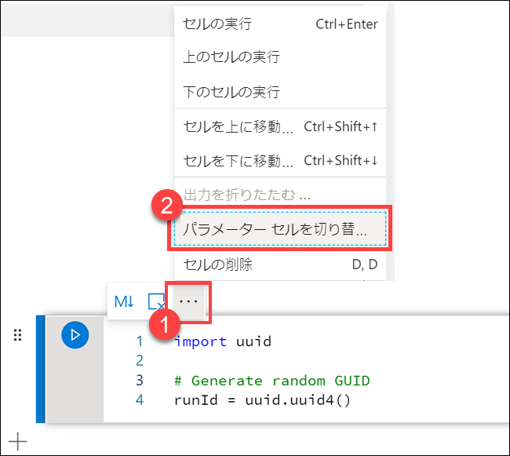

    このオプションをトグルした後、セル上に**パラメーター** タグが表示されます。

    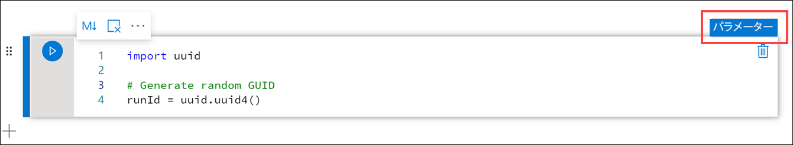

15. 新しいセルで以下のコードを貼り付け、プライマリ データ レイク アカウントの `/top5-products/` パスで Parquet ファイル名として `runId` 変数を使用します。パスで **`YOUR_DATALAKE_NAME`** をプライマリ データ レイク アカウントの名前に置き換えます。これを見つけるには、ページの最上部で **Cell 1** までスクロールアップします **(1)**。パスからデータ レイク ストレージ アカウントをコピーします **(2)**。この値を **`YOUR_DATALAKE_NAME`** と置き換えるために新しいセル内のパス **(3)** に貼り付け、セルを実行します。

    ```python
    %%pyspark

    top5ProductsOverall.write.parquet('abfss://wwi-02@YOUR_DATALAKE_NAME.dfs.core.windows.net/top5-products/' + str(runId) + '.parquet')
    ```

    

16. ファイルがデータ レイクに書き込まれていることを確認します。「**データ**」 ハブに移動し、「**リンク済み**」 タブ **(1)** を選択します。プライマリ データ レイク ストレージ アカウントを展開し、**wwi-02** コンテナー **(2)** を選択します。**top5-products** フォルダー **(3)** に移動します。ディレクトリに Parquet ファイルのフォルダーが表示され、GUID がファイル名になっているはずです **(4)**。

    

    このディレクトリは、以前に存在していなかったため、ノートブック セルのデータフレームで Parquet 書き込みメソッドによって作成されました。

17. ノートブックに戻ります。ノートブックの右上で 「**セッションの停止**」 を選択します。セッションを停止するのは、次のセクションでパイプライン内のノートブックを実行する際に備えてコンピューティング リソースに余裕をもたせるためです。

    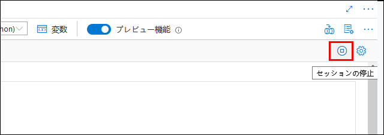

18. 「現在のセッションを停止」 で 「**今すぐ停止**」 を選択します。

    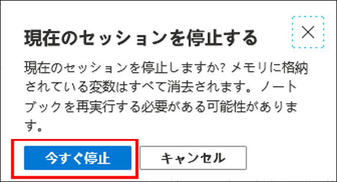

### タスク 2: ノートブックをパイプラインに追加する

Tailwind Traders は、調整プロセスの一環としてマッピング データ フローを実行した後、このノートブックを実行したいと考えています。このため、新しいノートブック アクティビティとしてパイプラインにこのノートブックを追加します。

1. ノートブックに戻ります。ノートブックの右上コーナーで 「**プロパティ**」 ボタン **(1)** を選択し、`Calculate Top 5 Products` を**名前 (2)** として入力します。

    

2. ノートブックの右上コーナーで 「**パイプラインに追加**」 ボタン **(1)** を選択してから 「**既存のパイプライン**」 (2) を選択します。

    

3. 「**ユーザー プロファイルからデータレイク**」 パイプライン **(1)** を選択し、「**追加**」 (2) を選択します。

    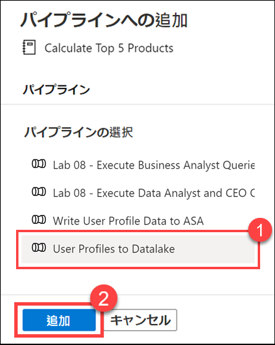

4. Synapse Studio がノートブック アクティビティをパイプラインに追加します。**ノートブック アクティビティ**の配置を変えて、**データ フロー アクティビティ**の右側になるようにします。「**データ フロー アクティビティ**」 を選択し、「**成功**」 アクティビティ パイプライン接続の**緑色のボックス**を**ノートブック アクティビティ**にドラッグします。

    

    成功アクティビティの矢印は、データ フロー アクティビティの実行が成功した後にノートブック アクティビティを実行するようパイプラインに指示します。

5. 「**ノートブック アクティビティ**」 (1) を選択し、「**設定**」 タブ **(2)** を選択して 「**ベース パラメーター**」 (3) を展開し、「**+ 新規**」 (4) を選択します。「**名前**」 フィールド **(5)** に **`runId`** と入力します。「**種類**」 (6) で 「**文字列**」 を選択します。「**値**」 で 「**動的コンテンツを追加**」 (7) を選択します。

    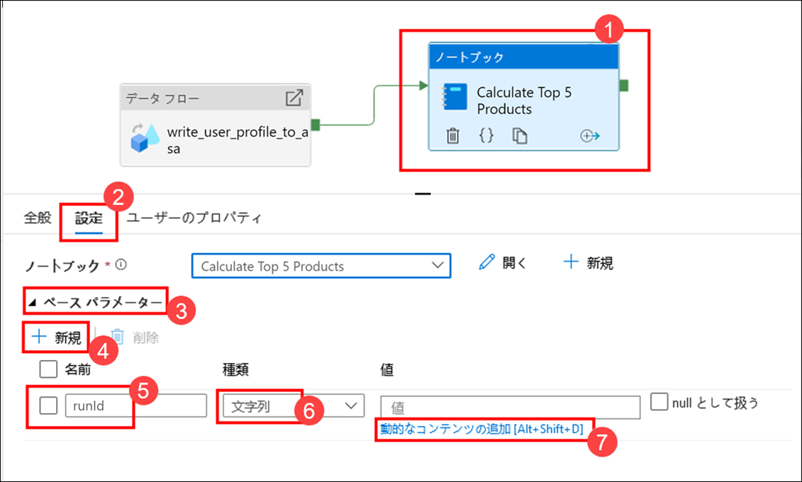

6. 「**システム変数**」 で 「**パイプライン実行 ID**」 (1) を選択します。これにより `@pipeline().RunId` が動的コンテンツ ボックス **(2)** に追加されます。「**終了**］ （3） を選択してダイアログを閉じます。

    

    パイプライン実行 ID 値は、各パイプライン実行に割り当てられている一意の GUID です。この値は、`runId` ノートブック パラメーターとしてパスし、Parquet ファイルの名前で使用します。その後、パイプライン実行履歴を検索し、各パイプライン実行で作成された特定の Parquet ファイルを見つけます。

7. 「**すべて公開**」 を選択した後、**公開**して変更を保存します。

    

8. **オプション - 現在、パイプライン実行には 10 分以上かかります -** 公開の完了後、「**トリガーの追加**」 (1) を選択してから 「**今すぐトリガー**」 (2) を選択し、更新されたパイプラインを実行します。

    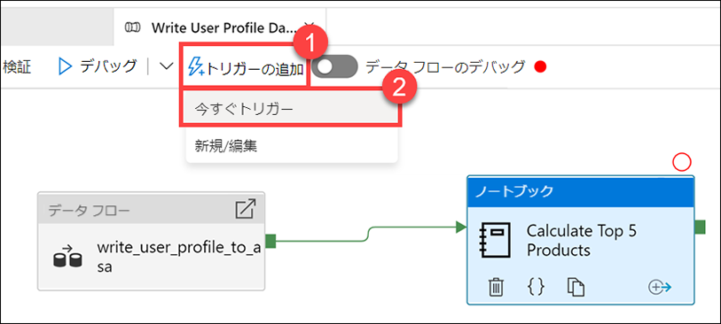

9. 「**OK**」 を選択してトリガーを実行します。

    

10. 「**監視**」 ハブに移動します。

    

11. 「**パイプライン実行**」 (1) を選択し、パイプラインの実行が完了するのを待ちます **(2)**。場合によっては、ビューを更新する必要があります **(3)**。

    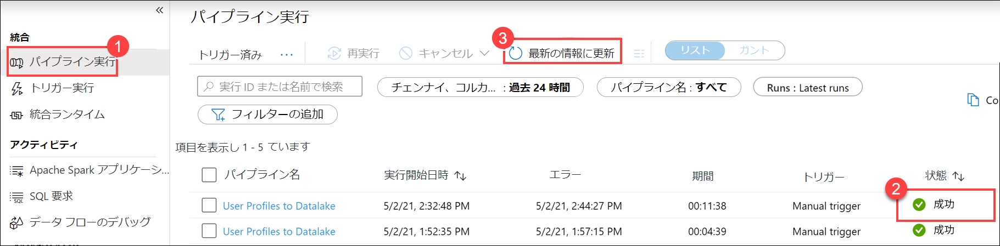

    > ノートブック アクティビティが加わると、実行が完了するまでに 10 分以上かかる場合があります。
    > これを実行している間に、ラボの手順の残りを読み、内容をよく理解しておいてください。

12. パイプラインの名前を選択し、パイプラインのアクティビティ実行を表示します。

    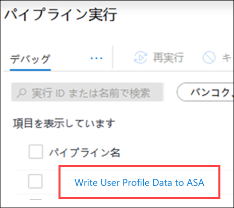

13. 今回は、**データ フロー** アクティビティと新しい**ノートブック** アクティビティが両方とも表示されています **(1)**。**パイプライン実行 ID** の値 **(2)** を書き留めておいてください。これを、ノートブックで生成された Parquet ファイル名に比較します。「**上位 5 製品を計算**」 ノートブック名を選択し、その詳細を表示します **(3)**。

    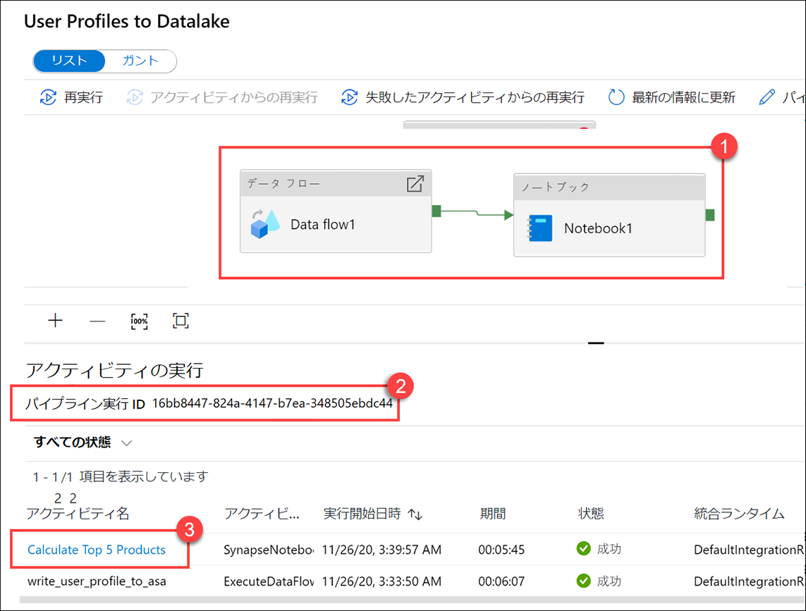

14. ノートブック実行の詳細がここに表示されます。「**再生**」 ボタン **(1)** を選択すると、**ジョブ (2)** の進捗状況を確認できます。最下部には、さまざまなフィルター オプションとともに 「**診断**」 と 「**ログ**」 が表示されます **(3)**。ステージの上にマウスを動かすと、期間や合計タスク数、データ詳細などの詳細な情報を表示できます。詳細を表示したい**ステージ**で 「**詳細の表示**」 リンクを選択してください **(5)**。

    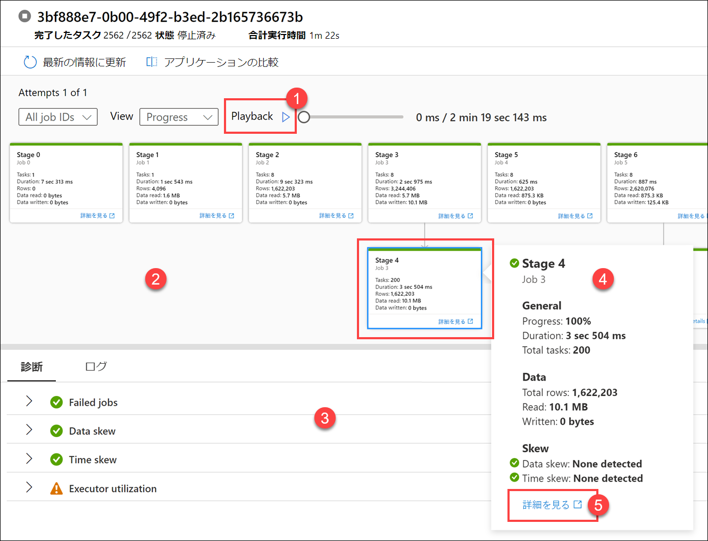

15. Spark アプリケーションの UI が新しいタブで開き、ここにステージの詳細が表示されます。「**DAG 視覚化**」 を展開し、ステージの詳細を表示します。

    

16. 「**データ**」 ハブに戻ります。

    

17. 「**リンク済み**」 タブ **(1)** を選択し、プライマリ データ レイク ストレージ アカウントで **wwi-02** コンテナー **(2)** を選択します。**top5-products** フォルダー **(3)** に移動し、名前が 「**パイプライン実行 ID**」 に一致する Parquet ファイルのフォルダーが存在することを確認します。

    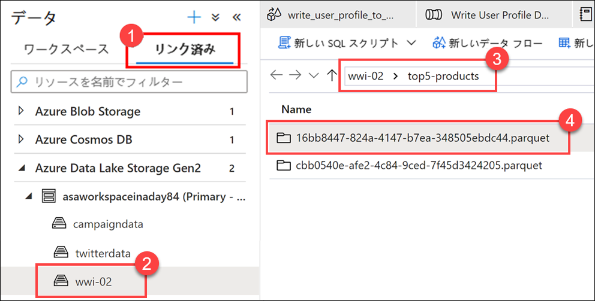

    ご覧のように、名前が 「**パイプライン実行 ID**」 に一致するファイルがあります。

    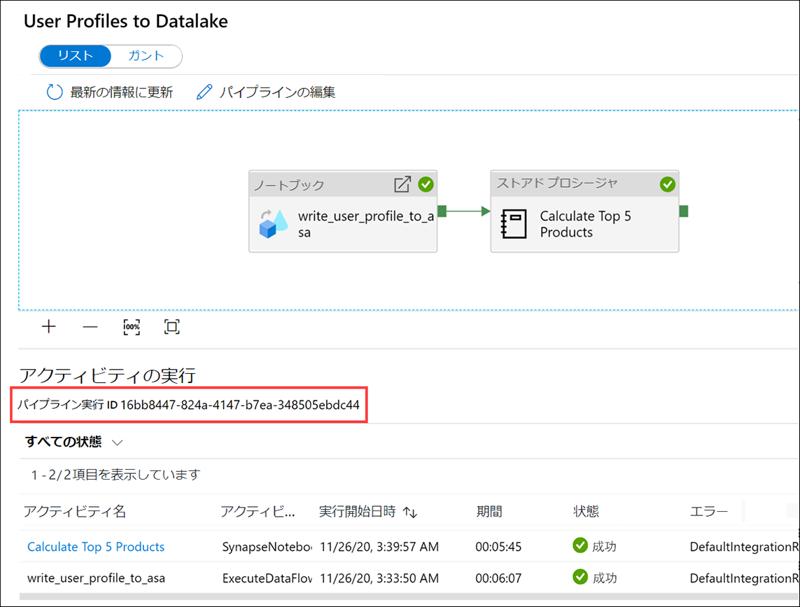

    これらの値が一致するのは、パイプライン実行 ID でノートブック アクティビティの `runId` パラメーターにパスしておいたためです。
