# モジュール 10 - Azure Synapse の専用 SQL プールでクエリのパフォーマンスを最適化する

このモジュールでは、Azure Synapse Analytics で専用 SQL プールを使用する際にデータ ストレージと処理を最適化するための戦略を学びます。受講者は、ウィンドウ化や HyperLogLog 関数など開発者向けの機能の使用、データ読み込みのベスト プラクティスの利用、クエリ パフォーマンスの最適化と向上の方法を学習します。

このモジュールでは、次のことができるようになります。

- Azure Synapse Analytics の開発者向け機能について理解する
- Azure Synapse Analytics 内でデータ ウェアハウスのクエリ パフォーマンスを最適化する
- クエリ パフォーマンスの向上

## ラボの詳細

- [モジュール 10 - Azure Synapse の専用 SQL プールでクエリのパフォーマンスを最適化する](#module-10---optimize-query-performance-with-dedicated-sql-pools-in-azure-synapse)
  - [ラボの詳細](#lab-details)
  - [ラボの構成と前提条件](#lab-setup-and-pre-requisites)
  - [演習 0: 専用 SQL プールを起動する](#exercise-0-start-the-dedicated-sql-pool)
  - [演習 1: Azure Synapse Analytics の開発者向け機能について理解する](#exercise-1-understanding-developer-features-of-azure-synapse-analytics)
    - [タスク 1: テーブルを作成してデータを読み込む](#task-1-create-tables-and-load-data)
    - [タスク 2: ウィンドウ化関数を使用する](#task-2-using-window-functions)
      - [タスク 2.1: OVER 句](#task-21-over-clause)
      - [タスク 2.2: 集計関数](#task-22-aggregate-functions)
      - [タスク 2.3: 分析関数](#task-23-analytic-functions)
      - [タスク 2.4: ROWS 句](#task-24-rows-clause)
    - [タスク 3: HyperLogLog 関数を使用した近似的実行](#task-3-approximate-execution-using-hyperloglog-functions)
  - [演習 2: Azure Synapse Analytics でデータ読み込みのベスト プラクティスを使用する](#exercise-2-using-data-loading-best-practices-in-azure-synapse-analytics)
    - [タスク 1: ワークロード管理を実装する](#task-1-implement-workload-management)
    - [タスク 2: ワークロード分類子を作成して、特定のクエリに重要度を追加する](#task-2-create-a-workload-classifier-to-add-importance-to-certain-queries)
    - [タスク 3: ワークロードの分離を使用して特定のワークロードのリソースを予約する](#task-3-reserve-resources-for-specific-workloads-through-workload-isolation)
  - [演習 3: Azure Synapse Analytics 内でデータ ウェアハウスのクエリ パフォーマンスを最適化する](#exercise-3-optimizing-data-warehouse-query-performance-in-azure-synapse-analytics)
    - [タスク 1: テーブルに関連するパフォーマンスの問題を特定する](#task-1-identify-performance-issues-related-to-tables)
    - [タスク 2: ハッシュ分散と列ストア インデックスを使用してテーブル構造を向上させる](#task-2-improve-table-structure-with-hash-distribution-and-columnstore-index)
    - [タスク 4: パーティションを使用してテーブル構造をさらに向上させる](#task-4-improve-further-the-table-structure-with-partitioning)
      - [タスク 4.1: テーブル分散](#task-41-table-distributions)
      - [タスク 4.2: インデックス](#task-42-indexes)
      - [タスク 4.3: パーティション分割](#task-43-partitioning)
  - [演習 4: クエリ パフォーマンスの向上](#exercise-4-improve-query-performance)
    - [タスク 1: 具体化されたビューを使用する](#task-1-use-materialized-views)
    - [タスク 2: 結果セットのキャッシュを使用する](#task-2-use-result-set-caching)
    - [タスク 3: 統計を作成して更新する](#task-3-create-and-update-statistics)
    - [タスク 4: インデックスを作成して更新する](#task-4-create-and-update-indexes)
    - [タスク 5: 順序指定クラスター化列ストア インデックス](#task-5-ordered-clustered-columnstore-indexes)

## ラボの構成と前提条件

> **注:** ホストされたラボ環境を**使用しておらず**、ご自分の Azure サブスクリプションを使用している場合は、`Lab setup and pre-requisites` の手順のみを完了してください。その他の場合は、演習 0 にスキップします。

このモジュールの**[ラボの構成手順](https://github.com/solliancenet/microsoft-data-engineering-ilt-deploy/blob/main/setup/04/README.md)を完了**してください。

以下のモジュールは、同じ環境を共有している点に留意してください。

- [モジュール 4](labs/04/README.md)
- [モジュール 5](labs/05/README.md)
- [モジュール 7](labs/07/README.md)
- [モジュール 8](labs/08/README.md)
- [モジュール 9](labs/09/README.md)
- [モジュール 10](labs/10/README.md)
- [モジュール 11](labs/11/README.md)
- [モジュール 12](labs/12/README.md)
- [モジュール 13](labs/13/README.md)
- [モジュール 16](labs/16/README.md)

## 演習 0: 専用 SQL プールを起動する

このラボでは専用 SQL プールを使用します。最初の手順として、これが一時停止状態でないことを確認してください。一時停止している場合は、以下の手順に従って起動します。

1. Synapse Studio (<https://web.azuresynapse.net/>) を開きます。

2. 「**管理**」 ハブを選択します。

    

3. 左側のメニューで 「**SQL プール**」 を選択します **(1)**。専用 SQL プールが一時停止状態の場合は、プールの名前の上にマウスを動かして 「**再開**」  (2) を選択します。

    

4. プロンプトが表示されたら、「**再開**」 を選択します。プールが再開するまでに、1 ～ 2 分かかります。

    

> 専用 SQL プールが再開するまで**待ちます**。

## 演習 1: Azure Synapse Analytics の開発者向け機能について理解する

### タスク 1: テーブルを作成してデータを読み込む

始める前に、いくつか新しいテーブルを作成し、データとともに読み込んでおく必要があります。

1. Synapse Studio (<https://web.azuresynapse.net/>) を開きます。

2. 「**開発**」 ハブを選択します。

    

3. 「**開発**」 メニューで **+** ボタン **(1)** を選択し、コンテキスト 　メニューから 「**SQL スクリプト**」 (2) を選びます。

    

4. ツールバー メニューで、**SQLPool01** データベースに接続してクエリを実行します。

    

5. クエリ ウィンドウでスクリプトを以下に置き換え、`wwi_security.Sale` テーブルからのデータで `OVER` 句を使用します。

    ```sql
    IF OBJECT_ID(N'[dbo].[Category]', N'U') IS NOT NULL
    DROP TABLE [dbo].[Category]

    CREATE TABLE [dbo].[Category]
    ( 
        [ID] [float]  NOT NULL,
        [Category] [varchar](255)  NULL,
        [SubCategory] [varchar](255)  NULL
    )
    WITH
    (
        DISTRIBUTION = ROUND_ROBIN,
        CLUSTERED COLUMNSTORE INDEX
    )
    GO

    IF OBJECT_ID(N'[dbo].[Books]', N'U') IS NOT NULL
    DROP TABLE [dbo].[Books]

    CREATE TABLE [dbo].[Books]
    ( 
        [ID] [float]  NOT NULL,
        [BookListID] [float]  NULL,
        [Title] [varchar](255)  NULL,
        [Author] [varchar](255)  NULL,
        [Duration] [float]  NULL,
        [Image] [varchar](255)  NULL
    )
    WITH
    (
        DISTRIBUTION = ROUND_ROBIN,
        CLUSTERED COLUMNSTORE INDEX
    )
    GO

    IF OBJECT_ID(N'[dbo].[BookConsumption]', N'U') IS NOT NULL
    DROP TABLE [dbo].[BookConsumption]

    CREATE TABLE [dbo].[BookConsumption]
    ( 
        [BookID] [float]  NULL,
        [Clicks] [float]  NULL,
        [Downloads] [float]  NULL,
        [Time Spent] [float]  NULL,
        [Country] [varchar](255)  NULL
    )
    WITH
    (
        DISTRIBUTION = ROUND_ROBIN,
        CLUSTERED COLUMNSTORE INDEX
    )
    GO

    IF OBJECT_ID(N'[dbo].[BookList]', N'U') IS NOT NULL
    DROP TABLE [dbo].[BookList]

    CREATE TABLE [dbo].[BookList]
    ( 
        [ID] [float]  NOT NULL,
        [CategoryID] [float]  NULL,
        [BookList] [varchar](255)  NULL
    )
    WITH
    (
        DISTRIBUTION = ROUND_ROBIN,
        CLUSTERED COLUMNSTORE INDEX
    )
    GO

    COPY INTO Category 
    FROM 'https://solliancepublicdata.blob.core.windows.net/cdp/csv/Category.csv'
    WITH (
        FILE_TYPE = 'CSV',
        FIRSTROW = 2
    )
    GO

    COPY INTO Books 
    FROM 'https://solliancepublicdata.blob.core.windows.net/cdp/csv/Books.csv'
    WITH (
        FILE_TYPE = 'CSV',
        FIRSTROW = 2
    )
    GO

    COPY INTO BookConsumption 
    FROM 'https://solliancepublicdata.blob.core.windows.net/cdp/csv/BookConsumption.csv'
    WITH (
        FILE_TYPE = 'CSV',
        FIRSTROW = 2
    )
    GO

    COPY INTO BookList 
    FROM 'https://solliancepublicdata.blob.core.windows.net/cdp/csv/BookList.csv'
    WITH (
        FILE_TYPE = 'CSV',
        FIRSTROW = 2
    )
    GO
    ```

6. ツールバー メニューから 「**実行**」 を選択して SQL コマンドを実行します。

    

    数秒後、クエリが完了したことが表示されます。

### タスク 2: ウィンドウ化関数を使用する

Tailwind Traders は、高価なカーソルやサブクエリのほか、現在使用している古びた方法に頼るのではなく、より効率的に売上データを分析できる方法を探しています。

あなたは、ウィンドウ関数を使用して、行セットに対して計算を行うことを提案します。この関数を使用すると、行のグループをエンティティとして扱うことができます。

#### タスク 2.1: OVER 句

ウィンドウ関数の主要なコンポーネントのひとつが、**`OVER`** 句です。この句は、関連するウィンドウ関数が適用される前に、行セットのパーティション処理と並べ替えを決定します。つまり、OVER 句はクエリ結果セット内のウィンドウまたはユーザー指定の行セットを定義します。その後、ウィンドウ関数はウィンドウ内の各行の値を計算します。関数で OVER 句を使用すると、移動平均、累積集計、集計途中経過、グループ結果ごとの上位 N などの集計値を計算できます。

1. 「**開発**」 ハブを選択します。

    

2. 「**開発**」 メニューで **+** ボタン **(1)** を選択し、コンテキスト 　メニューから 「**SQL スクリプト**」 (2) を選びます。

    

3. ツールバー メニューで、**SQLPool01** データベースに接続してクエリを実行します。

    

4. クエリ ウィンドウでスクリプトを以下に置き換え、`wwi_security.Sale` テーブルからのデータで `OVER` 句を使用します。

    ```sql
    SELECT
      ROW_NUMBER() OVER(PARTITION BY Region ORDER BY Quantity DESC) AS "Row Number",
      Product,
      Quantity,
      Region
    FROM wwi_security.Sale
    WHERE Quantity <> 0  
    ORDER BY Region;
    ```

5. ツールバー メニューから 「**実行**」 を選択して SQL コマンドを実行します。

    

    `PARTITION BY` を `OVER` 句とともに使用する場合は **(1)**、クエリ結果のセットをパーティションに分割します。ウィンドウ関数は各パーティションに対して個別に適用され、各パーティションで計算が再開されます。

    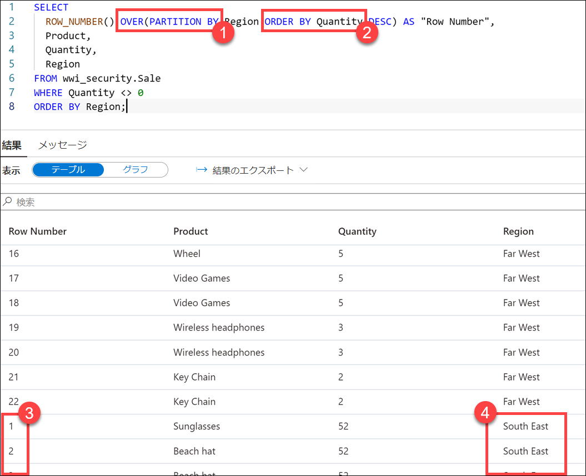

    ここで実行したスクリプトでは、OVER 句と ROW_NUMBER 関数 **(1)** を使用して、パーティション内の各行の行番号を表示します。この場合のパーティションは `Region` 列です。OVER 句で指定した ORDER BY 句 **(2)** によって、`Quantity` 列を基準に各パーティションの行の順序付けが行われます。SELECT ステートメントの ORDER BY 句によって、クエリ結果セット全体が返される順序が決まります。

    「**行番号**」 カウント **(3)** が**さまざまなリージョン (4)** で始まるまで、結果ビューを**スクロール ダウン**します。パーティションが `Region` に設定されているため、リージョンが変わると、`ROW_NUMBER` はリセットされます。基本的に、パーティションはリージョン別に行われており、結果セットはそのリージョンの行数で識別されています。

#### タスク 2.2: 集計関数

OVER 句を使用するクエリを展開して、集計関数をウィンドウで使用してみましょう。

1. クエリ ウィンドウで、スクリプトを次のように置き換えて、集計関数を追加します。

    ```sql
    SELECT
      ROW_NUMBER() OVER(PARTITION BY Region ORDER BY Quantity DESC) AS "Row Number",
      Product,
      Quantity,
      SUM(Quantity) OVER(PARTITION BY Region) AS Total,  
      AVG(Quantity) OVER(PARTITION BY Region) AS Avg,  
      COUNT(Quantity) OVER(PARTITION BY Region) AS Count,  
      MIN(Quantity) OVER(PARTITION BY Region) AS Min,  
      MAX(Quantity) OVER(PARTITION BY Region) AS Max,
      Region
    FROM wwi_security.Sale
    WHERE Quantity <> 0  
    ORDER BY Region;
    ```

2. ツールバー メニューから 「**実行**」 を選択して SQL コマンドを実行します。

    

    このクエリでは、`SUM`、`AVG`、`COUNT`、`MIN`、`MAX` 集計関数を追加しました。OVER 句を使用した方が、サブクエリを使用するより効率的です。

    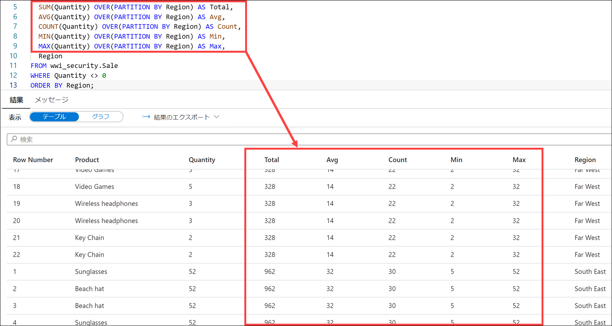

#### タスク 2.3: 分析関数

分析関数によって、行のグループに基づいた集計値が計算されます。ただし集計関数とは異なり、分析関数は各グループについて複数の行を返すことがあります。グループ内の移動平均、集計途中経過、パーセンテージ、または上位 N 位の結果を計算するには、分析関数を使用します。

Tailwind Traders 社にはオンライン ストアからインポートした書籍の売上データがあり、カテゴリ別に書籍のダウンロードの割合を計算したいと考えています。

これを行うために、`PERCENTILE_CONT` 関数と `PERCENTILE_DISC` 関数を使用するウィンドウ関数を構築することにします。

1. クエリ ウィンドウで、スクリプトを次のように置き換えて、集計関数を追加します。

    ```sql
    -- PERCENTILE_CONT, PERCENTILE_DISC
    SELECT DISTINCT c.Category  
    ,PERCENTILE_CONT(0.5) WITHIN GROUP (ORDER BY bc.Downloads)
                          OVER (PARTITION BY Category) AS MedianCont  
    ,PERCENTILE_DISC(0.5) WITHIN GROUP (ORDER BY bc.Downloads)
                          OVER (PARTITION BY Category) AS MedianDisc  
    FROM dbo.Category AS c  
    INNER JOIN dbo.BookList AS bl
        ON bl.CategoryID = c.ID
    INNER JOIN dbo.BookConsumption AS bc  
        ON bc.BookID = bl.ID
    ORDER BY Category
    ```

2. ツールバー メニューから 「**実行**」 を選択して SQL コマンドを実行します。

    

    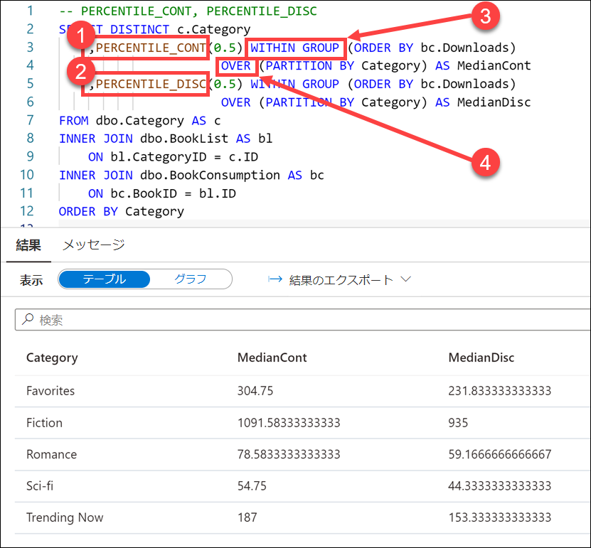

    このクエリでは、**PERCENTILE_CONT (1)** と **PERCENTILE_DISC (2)** を使用して、各書籍カテゴリのダウンロード数の中央値を検索します。これらの関数は同じ値を返さない可能性があります。PERCENTILE_CONT ではデータセットに存在するかどうかに関係なく適切な値が挿入され、PERCENTILE_DISC では常にセットから実際の値を返します。詳しく説明すると、PERCENTILE_DISC は、行セット全体または行セットの別個のパーティション内で並べ替えられた値の特定の百分位数を計算します。

    > **百分位関数 (1 と 2)** に値 `0.5` を渡すと、ダウンロード数の第 50 百分位数 (つまり、中央値) が計算されます。

    **WITHIN GROUP** 式 **(3)** では、並べ替えて百分位数を計算する値のリストを指定します。ORDER BY 式は 1 つだけ使用でき、既定の並べ替え順序は昇順です。

    **OVER** 句 **(4)** は、FROM 句の結果セットをパーティション (この場合は `Category`) に分割します。百分位関数がこれらのパーティションに適用されます。

3. クエリ ウィンドウで、スクリプトを次のように置き換えて、LAG 分析関数を使用します。

    ```sql
    --LAG Function
    SELECT ProductId,
        [Hour],
        [HourSalesTotal],
        LAG(HourSalesTotal,1,0) OVER (ORDER BY [Hour]) AS PreviousHouseSalesTotal,
        [HourSalesTotal] - LAG(HourSalesTotal,1,0) OVER (ORDER BY [Hour]) AS Diff
    FROM ( 
        SELECT ProductId,
            [Hour],
            SUM(TotalAmount) AS HourSalesTotal
        FROM [wwi_perf].[Sale_Index]
        WHERE ProductId = 3848 AND [Hour] BETWEEN 8 AND 20
        GROUP BY ProductID, [Hour]) as HourTotals
    ```

    Tailwind Traders 社は、時間の経過に伴う商品の売上合計を時間単位で比較し、値の違いを示したいと考えています。

    これを実現するには、LAG 分析関数を使用します。この関数は、自己結合を使用せずに同じ結果セットの前の行のデータにアクセスします。LAG によって、現在の行の前にある指定された物理的なオフセットの行にアクセスできます。この分析関数を使用して、現在の行の値と前の行の値を比較します。

4. ツールバー メニューから 「**実行**」 を選択して SQL コマンドを実行します。

    

    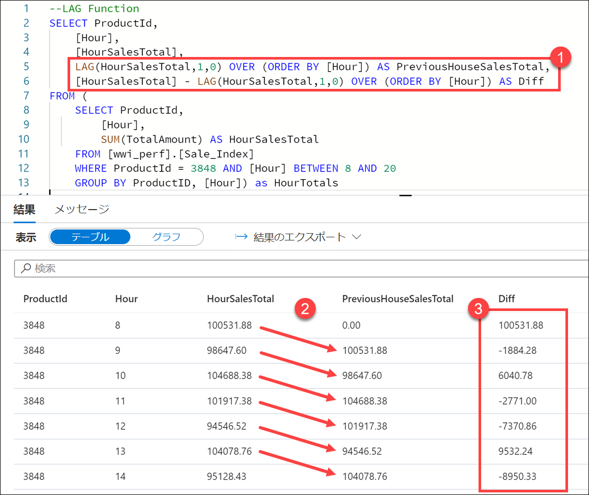

    このクエリでは、**LAG 関数 (1)** を使用して、ピーク営業時間 (8 - 20) での特定の商品の売上 **(2)** の差を返します。また、ある行と次の行の売上の差 **(3)** も計算します。最初の行に使用できるラグ値がないため、既定のゼロ (0) が返されることに注意してください。

#### タスク 2.4: ROWS 句

ROWS 句および RANGE 句は、パーティション内の始点と終点を指定することにより、パーティション内の行をさらに制限します。これは、論理アソシエーションまたは物理アソシエーションによって現在の行を基準に行の範囲を指定することで行います。物理アソシエーションは ROWS 句を使用することで実現されます。

Tailwind Traders 社は、国ごとのダウンロード数が最も少ない書籍を検索し、各国内の書籍ごとのダウンロード総数を昇順で表示したいと考えています。

これを実現するには、ROWS を UNBOUNDED PRECEDING と組み合わせて使用して、`Country` パーティション内の行を制限します。ウィンドウは、パーティションの最初の行から始まるように指定します。

1. クエリ ウィンドウで、スクリプトを次のように置き換えて、集計関数を追加します。

    ```sql
    -- ROWS UNBOUNDED PRECEDING
    SELECT DISTINCT bc.Country, b.Title AS Book, bc.Downloads
        ,FIRST_VALUE(b.Title) OVER (PARTITION BY Country  
            ORDER BY Downloads ASC ROWS UNBOUNDED PRECEDING) AS FewestDownloads
    FROM dbo.BookConsumption AS bc
    INNER JOIN dbo.Books AS b
        ON b.ID = bc.BookID
    ORDER BY Country, Downloads
    ```

2. ツールバー メニューから 「**実行**」 を選択して SQL コマンドを実行します。

    

    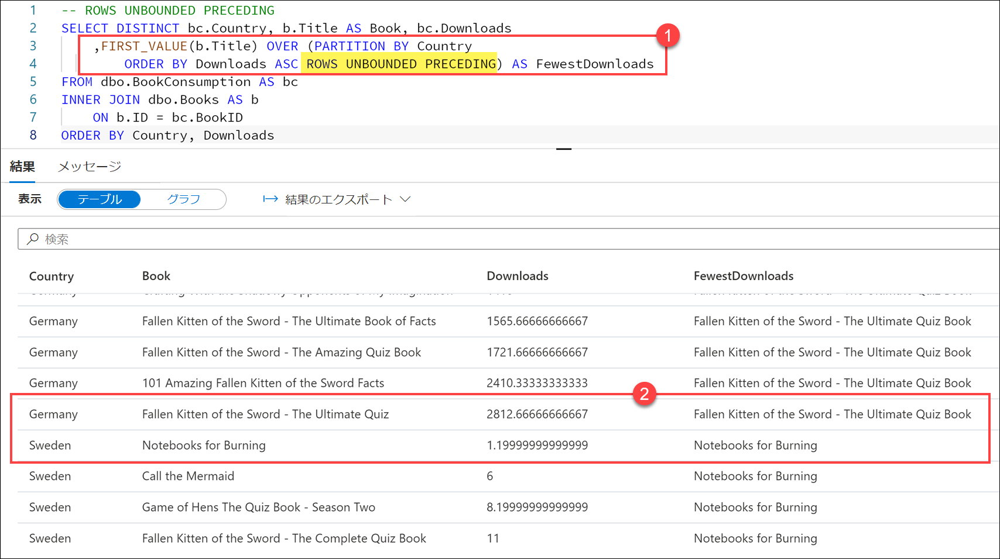

    このクエリでは、`FIRST_VALUE` 分析関数を使用して、ダウンロード数が最も少ない書籍のタイトルを取得します。これは、`Country` パーティションに対する **`ROWS UNBOUNDED PRECEDING`** 句によって示されています **(1)**。`UNBOUNDED PRECEDING` オプションは、パーティションの最初の行にウィンドウの先頭を設定します。これにより、パーティション内の国について、ダウンロード数が最も少ない書籍のタイトルが取得されます。

    結果セットでは、ダウンロード数の昇順で並べ替えられた国別の書籍の一覧をスクロールすることができます。ドイツでは、`Harry Potter - The Ultimate Quiz Book` のダウンロード数が最も少なく (最も多かった `Harry Potter - The Ultimate Quiz` とは別の本です)、スウェーデンでは `Burn for Me` のダウンロードが最小でした **(2)**。

### タスク 3: HyperLogLog 関数を使用した近似的実行

Tailwind Traders 社は、非常に大きいデータセットの操作を開始したところ、クエリの実行速度が低下してしまいました。たとえば、データ探索の初期段階ですべての顧客の個別のカウントを取得すると、プロセスが遅くなります。これらのクエリの速度を向上させるには、どうすればよいでしょうか。

HyperLogLog の精度で近似的実行を使用することにより、精度をわずかに低下させる代わりに、クエリの待機時間を短縮することにします。このトレードオフは、データの感触をつかむだけでかまわないという Tailwind Trader 社の状況に適合します。

これらの要件を理解するために、まず、大きな `Sale_Heap` テーブルに対して個別のカウントを実行して、個別の顧客の数を調べてみましょう。

1. クエリ ウィンドウで、スクリプトを次のように置き換えます。

    ```sql
    SELECT COUNT(DISTINCT CustomerId) from wwi_poc.Sale
    ```

2. ツールバー メニューから 「**実行**」 を選択して SQL コマンドを実行します。

    

    クエリの実行には 50 秒から 70 秒かかります。個別のカウントは、最適化が最も困難なクエリの種類の 1 つなので、これは想定内です。

    結果は `1,000,000` になります。

3. クエリ ウィンドウで、スクリプトを次のように置き換えて、HyperLogLog アプローチを使用します。

    ```sql
    SELECT APPROX_COUNT_DISTINCT(CustomerId) from wwi_poc.Sale
    ```

4. ツールバー メニューから 「**実行**」 を選択して SQL コマンドを実行します。

    

    クエリの実行にかかる時間は大幅に減ります。結果はまったく同じではありません (たとえば、`1,001,619`)。

    APPROX_COUNT_DISTINCT は、平均で **2% の精度**の真のカーディナリティで結果を返します。

    つまり、COUNT (DISTINCT) が `1,000,000` を返す場合、HyperLogLog は `999,736` から `1,016,234` の範囲の値を返します。

## 演習 2: Azure Synapse Analytics でデータ読み込みのベスト プラクティスを使用する

### タスク 1: ワークロード管理を実装する

混合ワークロードを実行すると、ビジー状態のシステムでリソースの問題が発生する可能性があります。ソリューション アーキテクトは、従来のデータ ウェアハウス アクティビティ (データの読み込み、変換、クエリなど) を分離して、SLA の準拠に十分なリソースが確保されるようにするための方法を模索しています。

Azure Synapse での専用 SQL プールのワークロード管理は、3 つの高レベルの概念で構成されています。ワークロードの分類、ワークロードの重要度、そしてワークロードの分離です。これらの機能により、ワークロードによるシステム リソースの活用方法をより細かく制御できます。

ワークロードの重要度は、要求がリソースにアクセスする順序に影響します。ビジー状態のシステムでは、重要度の高い要求がリソースに最初にアクセスします。重要度によって、ロックへの順次アクセスも保証されます。

ワークロードの分離では、ワークロード グループのリソースが予約されます。ワークロード グループに予約されているリソースは、そのワークロード グループのみで実行されるように保証されます。ワークロード グループでは、リソースのクラスと同じように、リクエストに割り当てられるリソースの量も定義できます。ワークロード グループを使用すると、リソースの量を予約したり、リクエストで使用できる量を制限したりできます。最後に、ワークロード グループは、クエリ タイムアウトなどのルールを要求に適用するためのメカニズムです。

### タスク 2: ワークロード分類子を作成して、特定のクエリに重要度を追加する

Tailwind Tradersから、CEO の実行するクエリを他のユーザーより重要なものとしてマークし、大量のデータ読み込みやキュー内の他のワークロードが原因で低速に見えないようにする方法がないか聞かれました。ワークロード分類子を作成し、重要度を追加して、CEO のクエリを優先することにしました。

1. **Develop** ハブを選択します。

    

2. 「**開発**」 メニューで **+** ボタン **(1)** を選択し、コンテキスト 　メニューから 「**SQL スクリプト**」 (2) を選びます。

    

3. ツールバー メニューで、**SQLPool01** データベースに接続してクエリを実行します。

    

4. クエリ ウィンドウで、スクリプトを次のように置き換えて、`asa.sql.workload01` (組織の CEO を表す) または `asa.sql.workload02` (プロジェクトで作業しているデータアナリストを表す) としてログインしているユーザーによる現在実行中のクエリがないことを確認します。

    ```sql
    --First, let's confirm that there are no queries currently being run by users logged in workload01 or workload02

    SELECT s.login_name, r.[Status], r.Importance, submit_time, 
    start_time ,s.session_id FROM sys.dm_pdw_exec_sessions s 
    JOIN sys.dm_pdw_exec_requests r ON s.session_id = r.session_id
    WHERE s.login_name IN ('asa.sql.workload01','asa.sql.workload02') and Importance
    is not NULL AND r.[status] in ('Running','Suspended') 
    --and submit_time>dateadd(minute,-2,getdate())
    ORDER BY submit_time ,s.login_name
    ```

5. ツールバー メニューから 「**実行**」 を選択して SQL コマンドを実行します。

    

    クエリが実行されていないことを確認したので、次に、システムで多くのクエリを実行し、`asa.sql.workload01` と `asa.sql.workload02` の動作を確認する必要があります。これを行うには、クエリをトリガーする Synapse パイプラインを実行します。

6. **Integrate** ハブを選択します。

    

7. 「**ラボ 08 - データ分析と CEO クエリを実行する**」 パイプライン **(1)** を選択します。これは `asa.sql.workload01` と `asa.sql.workload02` クエリを実行/トリガーします。「**トリガーの追加**」 (2) が選択してから、「**今すぐトリガー**」 (3) を選択します。表示されるダイアログで、「**OK**」 を選択します。

    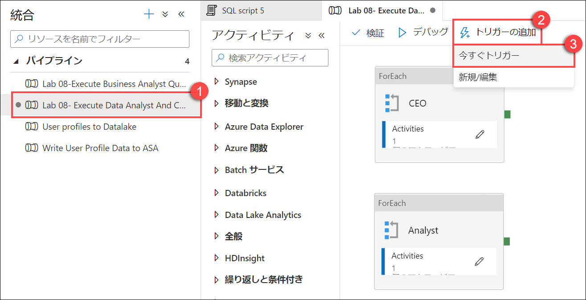

    > **注**: このパイプラインには再び戻ってくるので、このタブは開いたままにしておきます。

8. トリガーされたクエリをシステムに投入ときに何が起こったかを見てみましょう。クエリ ウィンドウで、スクリプトを次のように置き換えます。

    ```sql
    SELECT s.login_name, r.[Status], r.Importance, submit_time, start_time ,s.session_id FROM sys.dm_pdw_exec_sessions s 
    JOIN sys.dm_pdw_exec_requests r ON s.session_id = r.session_id
    WHERE s.login_name IN ('asa.sql.workload01','asa.sql.workload02') and Importance
    is not NULL AND r.[status] in ('Running','Suspended') and submit_time>dateadd(minute,-2,getdate())
    ORDER BY submit_time ,status
    ```

9. ツールバー メニューから 「**実行**」 を選択して SQL コマンドを実行します。

    

    次のような出力が表示されます。

    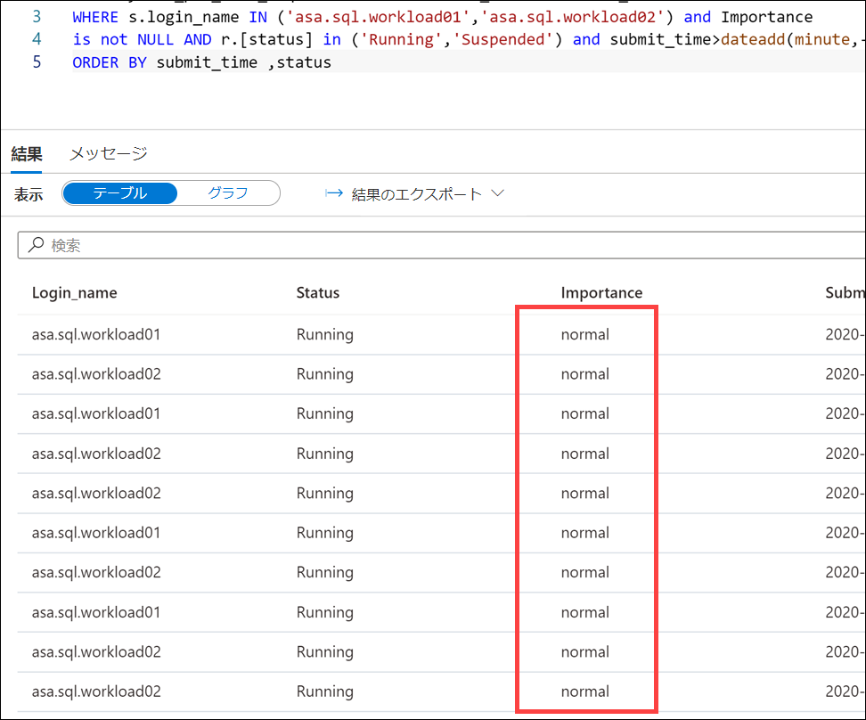

    > **注**: このクエリの実行には 1 分以上かかる場合があります。それよりも長くかかる場合はクエリをキャンセルして、再び実行してください。

    すべてのクエリの**重要**度レベルが **normal** に設定されていることに注意してください。

10. ワークロードの**重要**度機能を実装することによって、`asa.sql.workload01` ユーザー クエリの優先順位を指定します。クエリ ウィンドウで、スクリプトを次のように置き換えます。

    ```sql
    IF EXISTS (SELECT * FROM sys.workload_management_workload_classifiers WHERE name = 'CEO')
    BEGIN
        DROP WORKLOAD CLASSIFIER CEO;
    END
    CREATE WORKLOAD CLASSIFIER CEO
      WITH (WORKLOAD_GROUP = 'largerc'
      ,MEMBERNAME = 'asa.sql.workload01',IMPORTANCE = High);
    ```

    このスクリプトを実行しているのは、`largerc` ワークロード グループを使用してクエリの **重要**度を **High** に設定する、`CEO` という名前の新しい**ワークロード分類子**を作成するためです。

11. ツールバー メニューから 「**実行**」 を選択して SQL コマンドを実行します。

    

12. クエリを再びシステムに投入し、`asa.sql.workload01` と `asa.sql.workload02` クエリの結果を確認してみましょう。これを行うには、クエリをトリガーする Synapse パイプラインを実行します。`Integrate` タブを**選択**し、**Lab 08 - Execute Data Analyst and CEO Queries** パイプラインを**実行**します。これにより、`asa.sql.workload01` と `asa.sql.workload02` クエリが実行/トリガーされます。

13. クエリ ウィンドウで、スクリプトを次のように置き換えて、今回は `asa.sql.workload01` クエリがどのように動作するかを確認します。

    ```sql
    SELECT s.login_name, r.[Status], r.Importance, submit_time, start_time ,s.session_id FROM sys.dm_pdw_exec_sessions s 
    JOIN sys.dm_pdw_exec_requests r ON s.session_id = r.session_id
    WHERE s.login_name IN ('asa.sql.workload01','asa.sql.workload02') and Importance
    is not NULL AND r.[status] in ('Running','Suspended') and submit_time>dateadd(minute,-2,getdate())
    ORDER BY submit_time ,status desc
    ```

14. ツールバー メニューから 「**実行**」 を選択して SQL コマンドを実行します。

    

    次のような出力が表示されます。

    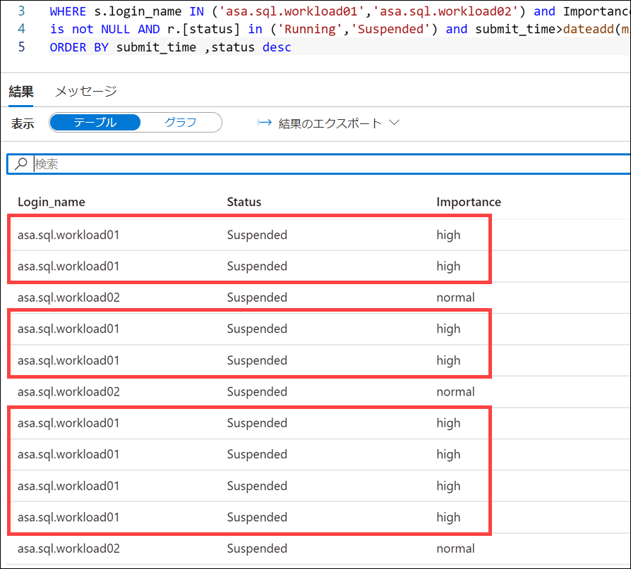

    `asa.sql.workload01` ユーザーによって実行されるクエリの重要度が **high** であることに注意してください。

15. **Monitor** ハブを選択します。

    

16. 「**パイプラインの実行**」 (1) を選択し、「**実行中**」 (3) とマークされ、Lab 08 を実行している各パイプラインで 「**再帰のキャンセル**」 (2) を選択します。これにより、残りのタスクを高速化できます。

    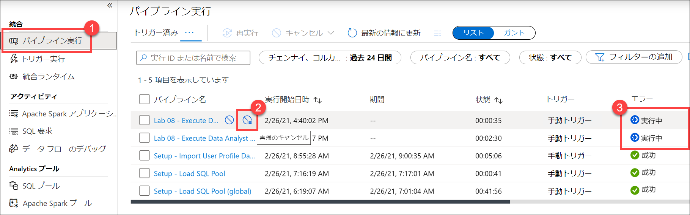

    > **注意**: これらのパイプライン アクティビティが失敗しても大丈夫です。アクティビティに 2 分間のタイムアウトがあるのは、このラボでのクエリ実行の邪魔にならないようにするためです。

### タスク 3: ワークロードの分離を使用して特定のワークロードのリソースを予約する

ワークロードの分離とは、リソースがワークロード グループ専用で予約されることを意味します。ワークロード グループは、一連の要求のコンテナーであり、ワークロードの分離などのワークロードの管理をシステム上で構成するための基礎となります。単純なワークロード管理構成では、データの読み込みとユーザークエリを管理できます。

ワークロードの分離がない場合、リクエストはリソースの共有プールで動作します。共有プール内のリソースへのアクセスは保証されず、重要度基準で割り当てられます。

Tailwind Traders が提供するワークロードの要件を考慮して、CEO によって実行されるクエリのリソースを予約する `CEODemo` という新しいワークロード グループを作成することにしました。

まず、さまざまなパラメーターを試してみましょう。

1. クエリ ウィンドウで、スクリプトを次のように置き換えます。

    ```sql
    IF NOT EXISTS (SELECT * FROM sys.workload_management_workload_groups where name = 'CEODemo')
    開始
        Create WORKLOAD GROUP CEODemo WITH  
        ( MIN_PERCENTAGE_RESOURCE = 50        -- integer value
        ,REQUEST_MIN_RESOURCE_GRANT_PERCENT = 25 --  
        ,CAP_PERCENTAGE_RESOURCE = 100
        )
    END
    ```

    このスクリプトでは、`CEODemo` というワークロード グループを作成し、そのワークロード グループ専用のリソースを予約します。この例では、`MIN_PERCENTAGE_RESOURCE` が 50% に設定され、`REQUEST_MIN_RESOURCE_GRANT_PERCENT` が 25% に設定されているワークロード グループに、2 つの同時実行が保証されます。

    > **注**: このクエリの実行には最高 1 分かかる場合があります。それよりも長くかかる場合はクエリをキャンセルして、再び実行してください。

2. ツールバー メニューから 「**実行**」 を選択して SQL コマンドを実行します。

    

3. クエリ ウィンドウで、スクリプトを次のように置き換えて、ワークロード グループと、着信要求に重要度を割り当てる `CEODreamDemo` というワークロード分類子を作成します。

    ```sql
    IF NOT EXISTS (SELECT * FROM sys.workload_management_workload_classifiers where  name = 'CEODreamDemo')
    BEGIN
        Create Workload Classifier CEODreamDemo with
        ( Workload_Group ='CEODemo',MemberName='asa.sql.workload02',IMPORTANCE = BELOW_NORMAL);
    END
    ```

    このスクリプトは、新しい `CEODreamDemo` ワークロード分類子を使用して、`asa.sql.workload02` ユーザーの重要度を **BELOW_NORMAL** に設定します。

4. ツールバー メニューから 「**実行**」 を選択して SQL コマンドを実行します。

    

5. クエリ ウィンドウで、スクリプトを次のように置き換えて、`asa.sql.workload02` で実行されているアクティブなクエリがないことを確認し ます (中断されたクエリは OK です)。

    ```sql
    SELECT s.login_name, r.[Status], r.Importance, submit_time,
    start_time ,s.session_id FROM sys.dm_pdw_exec_sessions s
    JOIN sys.dm_pdw_exec_requests r ON s.session_id = r.session_id
    WHERE s.login_name IN ('asa.sql.workload02') and Importance
    is not NULL AND r.[status] in ('Running','Suspended')
    ORDER BY submit_time, status
    ```

    > **注:** まだアクティブなクエリがある場合は、1 分または 2 分待ってください。パイプラインをキャンセルしても常にクエリがキャンセルされるわけではないので、クエリは 2 分後にタイムアウトするよう構成されています。

6. ツールバー メニューから 「**実行**」 を選択して SQL コマンドを実行します。

    

7. **Integrate** ハブを選択します。

    

8. 「**ラボ 08 - ビジネス分析クエリを実行する**」 パイプライン **(1)** を選択します。これにより、`asa.sql.workload02` クエリが実行またはトリガーされます。「**トリガーの追加**」 (2) が選択してから、「**今すぐトリガー**」 (3) を選択します。表示されるダイアログで、「**OK**」 を選択します。

    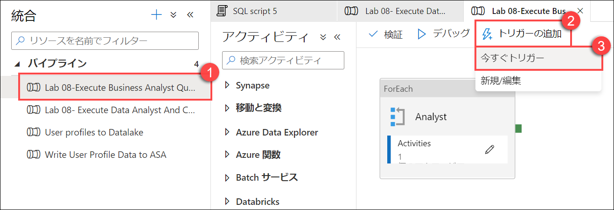

    > **注**: このパイプラインには再び戻ってくるので、このタブは開いたままにしておきます。

9. クエリ ウィンドウで、スクリプトを次のように置き換えて、トリガーされ、システムに投入されたすべての `asa.sql.workload02` クエリに何が起こったかを確認します。

    ```sql
    SELECT s.login_name, r.[Status], r.Importance, submit_time,
    start_time ,s.session_id FROM sys.dm_pdw_exec_sessions s
    JOIN sys.dm_pdw_exec_requests r ON s.session_id = r.session_id
    WHERE s.login_name IN ('asa.sql.workload02') and Importance
    is not NULL AND r.[status] in ('Running','Suspended')
    ORDER BY submit_time, status
    ```

10. ツールバー メニューから 「**実行**」 を選択して SQL コマンドを実行します。

    

    次のような出力が表示され、各セッションの重要度が `below_normal` に設定されています。

    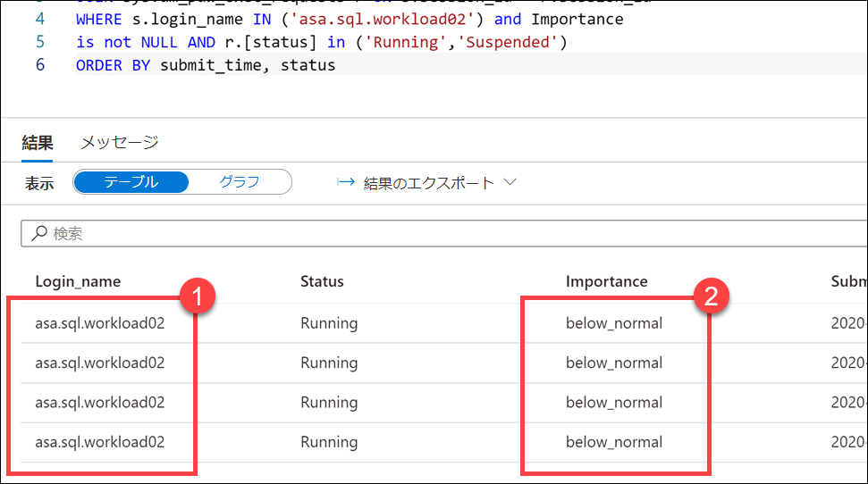

    実行中のスクリプトが `asa.sql.workload02` ユーザー **(1)** によって **below_normal (2)** の重要度レベルで実行されていることに注意してください。CEO のクエリよりも低い重要度で実行するようにビジネス アナリストのクエリを構成することに成功しました。`CEODreamDemo` ワークロード分類子が期待どおりに動作することを確認することもできます。

11. **Monitor** ハブを選択します。

    

12. 「**パイプラインの実行**」 (1) を選択し、「**実行中**」 (3) とマークされ、Lab 08 を実行している各パイプラインで 「**再帰のキャンセル**」 (2) を選択します。これにより、残りのタスクを高速化できます。

    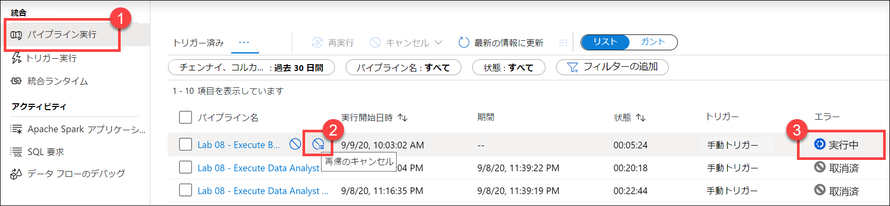

13. 「**開発**」 ハブの下にあるクエリ ウィンドウに戻ります。クエリ ウィンドウで、スクリプトを次のように置き換えて、要求ごとに 3.25% の最小リソースを設定します。

    ```sql
    IF  EXISTS (SELECT * FROM sys.workload_management_workload_classifiers where group_name = 'CEODemo')
    BEGIN
        Drop Workload Classifier CEODreamDemo
        DROP WORKLOAD GROUP CEODemo
    END
    --- Creates a workload group 'CEODemo'.
    Create  WORKLOAD GROUP CEODemo WITH  
    (
        MIN_PERCENTAGE_RESOURCE = 26 -- integer value
        ,REQUEST_MIN_RESOURCE_GRANT_PERCENT = 3.25 -- factor of 26 (guaranteed more than 4 concurrencies)
        ,CAP_PERCENTAGE_RESOURCE = 100
    )
    --- Creates a workload Classifier 'CEODreamDemo'.
    Create Workload Classifier CEODreamDemo with
    (Workload_Group ='CEODemo',MemberName='asa.sql.workload02',IMPORTANCE = BELOW_NORMAL);
    ```

    > **注**: このクエリの実行に 45 分以上かかる場合は、キャンセルしてから再び実行してください。

    > **注**: ワークロードの包含の構成では、コンカレンシーの最大レベルが暗黙的に定義されます。CAP_PERCENTAGE_RESOURCE を 60% に設定し、REQUEST_MIN_RESOURCE_GRANT_PERCENT を 1% に設定した場合、ワークロード グループではレベル 60 のコンカレンシーが保証されます。コンカレンシーの最大数を決定するには、次の方法を検討してください。
    > 
    > [Max Concurrency] = [CAP_PERCENTAGE_RESOURCE] / [REQUEST_MIN_RESOURCE_GRANT_PERCENT]

14. ツールバー メニューから 「**実行**」 を選択して SQL コマンドを実行します。

    

## 演習 3: Azure Synapse Analytics 内でデータ ウェアハウスのクエリ パフォーマンスを最適化する

### タスク 1: テーブルに関連するパフォーマンスの問題を特定する

1. **Develop** ハブを選択します。

    

2. 「**開発**」 メニューで **+** ボタン **(1)** を選択し、コンテキスト 　メニューから 「**SQL スクリプト**」 (2) を選びます。

    

3. ツールバー メニューで、**SQLPool01** データベースに接続してクエリを実行します。

    

4. クエリ ウィンドウでスクリプトを以下に置き換えて、ヒープ テーブルで記録の数をカウントします。

    ```sql
    SELECT  
        COUNT_BIG(*)
    FROM
        [wwi_poc].[Sale]
    ```

5. ツールバー メニューから 「**実行**」 を選択して SQL コマンドを実行します。

    

    このスクリプトの実行には最大 **15 秒**かかり、テーブルの行数 (最大 9 億 8200 万行) が返されます。

    > 45 秒を過ぎてもスクリプトが実行されている場合は、「キャンセル」 をクリックします。

    > **注**: このクエリを事前に_実行しない_でください。実行すると、以降の実行中にクエリの処理速度が上がる可能性があります。

    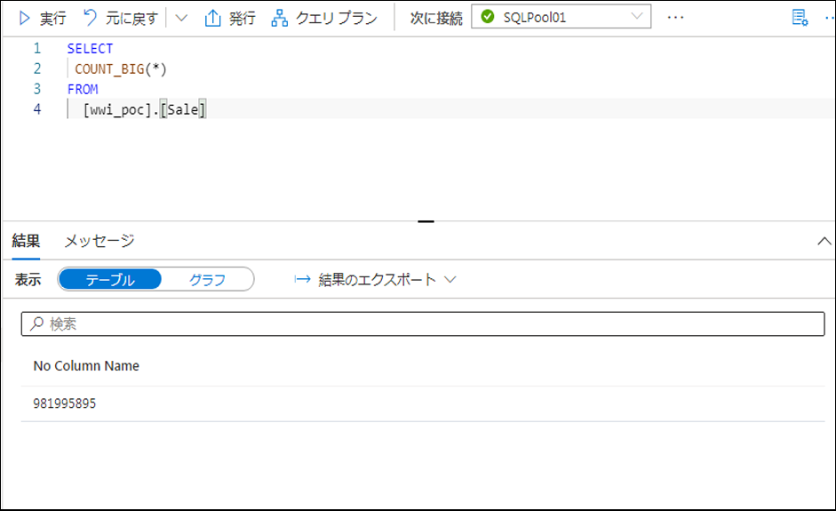

6. クエリ ウィンドウで、スクリプトを次の (さらに複雑な) ステートメントに置き換えます。

    ```sql
    SELECT TOP 1000 * FROM
    (
        SELECT
            S.CustomerId
            ,SUM(S.TotalAmount) as TotalAmount
        FROM
            [wwi_poc].[Sale] S
        GROUP BY
            S.CustomerId
    ) T
    OPTION (LABEL = 'Lab: Heap')
    ```

7. ツールバー メニューから 「**実行**」 を選択して SQL コマンドを実行します。

    
  
    このスクリプトの実行に最大 **60 秒**かかった後、結果が返されます。`Sale_Heap` テーブル内にパフォーマンスの低下を誘発する何らかの問題が発生していることは明らかです。

    > 90 秒を過ぎてもスクリプトが実行されている場合は、「キャンセル」 をクリックします。

    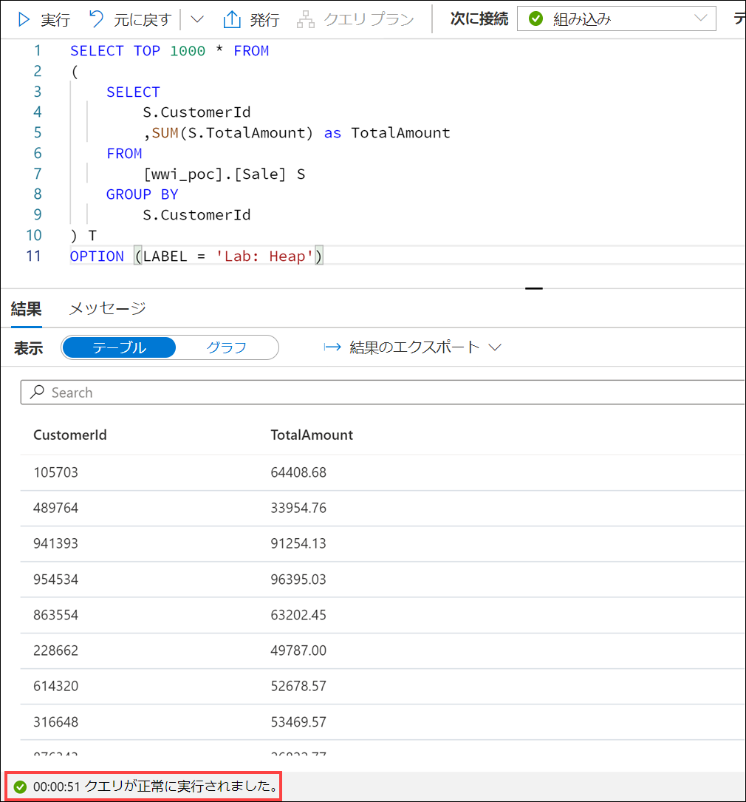

    > このステートメントでは、OPTION 句が使用されている点に留意してください。これは、[sys.dm_pdw_exec_requests](https://docs.microsoft.com/sql/relational-databases/system-dynamic-management-views/sys-dm-pdw-exec-requests-transact-sql) DMV 内でクエリを識別しようとする場合に役立ちます。
    >
    >```sql
    >SELECT  *
    >FROM    sys.dm_pdw_exec_requests
    >WHERE   [label] = 'Lab: Heap';
    >```

8. 「**データ**」 ハブを選択します。

    

9. 「**SQLPool01**」 データベースとそのテーブルの一覧を展開します。**`wwi_poc.Sale`** (1) を右クリックし、「**新しい SQL スクリプト**」 (2)  を選択してから 「**作成**」 (3) を選択します。

    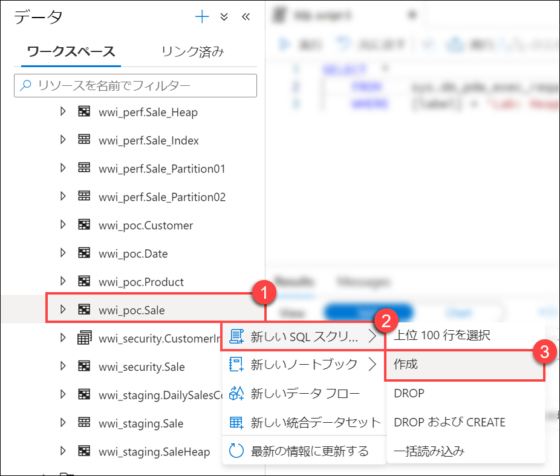

10. テーブルの作成に使用されるスクリプトを確認します。

    ```sql
    CREATE TABLE [wwi_poc].[Sale]
    ( 
        [TransactionId] [uniqueidentifier]  NOT NULL,
        [CustomerId] [int]  NOT NULL,
        [ProductId] [smallint]  NOT NULL,
        [Quantity] [tinyint]  NOT NULL,
        [Price] [decimal](9,2)  NOT NULL,
        [TotalAmount] [decimal](9,2)  NOT NULL,
        [TransactionDateId] [int]  NOT NULL,
        [ProfitAmount] [decimal](9,2)  NOT NULL,
        [Hour] [tinyint]  NOT NULL,
        [Minute] [tinyint]  NOT NULL,
        [StoreId] [smallint]  NOT NULL
    )
    WITH
    (
        DISTRIBUTION = ROUND_ROBIN,
        HEAP
    )
    ```

    > **注**: *Do not* run this script! これは、スキーマを確認するためのデモンストレーション用にのみ使用されます。

    パフォーマンスが低下する少なくとも 2 つの原因をすぐに見つけることができます。

    - `ROUND_ROBIN` ディストリビューション
    - テーブルの `HEAP` 構造

    > **メモ**
    >
    > この場合、応答時間の速いクエリを検索しているときは、一瞬しか表示されないので、ヒープ構造は良い選択肢ではありません。それでも、ヒープ テーブルの使用が、パフォーマンスを低下させるのではなく、パフォーマンスの向上に役立つ場合があります。そのような例の 1 つは、専用 SQL プールに関連のある SQL データベースに大量のデータを取り込むことを検討している場合です。

    クエリ プランを細部にわたって見直せば、パフォーマンス問題の根本的原因である "ディストリビューション間のデータ移動" をはっきりと認識できます。

11. 手順 2 で実行したものと同じスクリプトを実行しますが、今回はその前に `EXPLAIN WITH_RECOMMENDATIONS` ラインを使用します。

    ```sql
    EXPLAIN WITH_RECOMMENDATIONS
    SELECT TOP 1000 * FROM
    (
        SELECT
            S.CustomerId
            ,SUM(S.TotalAmount) as TotalAmount
        FROM
            [wwi_poc].[Sale] S
        GROUP BY
            S.CustomerId
    ) T
    ```

    `EXPLAIN WITH_RECOMMENDATIONS` 句は、Azure Synapse Analytics SQL ステートメントのクエリ プランを返します。ステートメントを実行する必要はありません。EXPLAIN を使用して、どの操作でデータ移動が必要になるかをプレビューし、クエリ操作の推定コストを表示します。既定で、XML 形式の実行プランを取得します。これは、CSV や JSON のような他の形式にエクスポートできます。ツールバーから [クエリ　プラン] を**選択しない**でください。クエリ プランをダウンロードして SQL Server Management Studio で開こうとするためです。

    クエリは以下のような内容を返します。

    ```xml
    <data><row><explain><?xml version="1.0" encoding="utf-8"?>
    <dsql_query number_nodes="4" number_distributions="60" number_distributions_per_node="15">
    <sql>SELECT TOP 1000 * FROM
    (
        SELECT
            S.CustomerId
            ,SUM(S.TotalAmount) as TotalAmount
        FROM
            [wwi_poc].[Sale] S
        GROUP BY
            S.CustomerId
    ) T</sql>
    <materialized_view_candidates>
        <materialized_view_candidates with_constants="False">CREATE MATERIALIZED VIEW View1 WITH (DISTRIBUTION = HASH([Expr0])) AS
    SELECT [S].[CustomerId] AS [Expr0],
        SUM([S].[TotalAmount]) AS [Expr1]
    FROM [wwi_poc].[Sale] [S]
    GROUP BY [S].[CustomerId]</materialized_view_candidates>
    </materialized_view_candidates>
    <dsql_operations total_cost="4.0656044" total_number_operations="5">
        <dsql_operation operation_type="RND_ID">
        <identifier>TEMP_ID_56</identifier>
        </dsql_operation>
        <dsql_operation operation_type="ON">
        <location permanent="false" distribution="AllDistributions" />
        <sql_operations>
            <sql_operation type="statement">CREATE TABLE [qtabledb].[dbo].[TEMP_ID_56] ([CustomerId] INT NOT NULL, [col] DECIMAL(38, 2) NOT NULL ) WITH(DISTRIBUTED_MOVE_FILE='');</sql_operation>
        </sql_operations>
        </dsql_operation>
        <dsql_operation operation_type="SHUFFLE_MOVE">
        <operation_cost cost="4.0656044" accumulative_cost="4.0656044" average_rowsize="13" output_rows="78184.7" GroupNumber="11" />
        <source_statement>SELECT [T1_1].[CustomerId] AS [CustomerId], [T1_1].[col] AS [col] FROM (SELECT SUM([T2_1].[TotalAmount]) AS [col], [T2_1].[CustomerId] AS [CustomerId] FROM [SQLPool01].[wwi_poc].[Sale] AS T2_1 GROUP BY [T2_1].[CustomerId]) AS T1_1
    OPTION (MAXDOP 4, MIN_GRANT_PERCENT = [MIN_GRANT], DISTRIBUTED_MOVE(N''))</source_statement>
        <destination_table>[TEMP_ID_56]</destination_table>
        <shuffle_columns>CustomerId;</shuffle_columns>
        </dsql_operation>
        <dsql_operation operation_type="RETURN">
        <location distribution="AllDistributions" />
        <select>SELECT [T1_1].[CustomerId] AS [CustomerId], [T1_1].[col] AS [col] FROM (SELECT TOP (CAST ((1000) AS BIGINT)) SUM([T2_1].[col]) AS [col], [T2_1].[CustomerId] AS [CustomerId] FROM [qtabledb].[dbo].[TEMP_ID_56] AS T2_1 GROUP BY [T2_1].[CustomerId]) AS T1_1
    OPTION (MAXDOP 4, MIN_GRANT_PERCENT = [MIN_GRANT])</select>
        </dsql_operation>
        <dsql_operation operation_type="ON">
        <location permanent="false" distribution="AllDistributions" />
        <sql_operations>
            <sql_operation type="statement">DROP TABLE [qtabledb].[dbo].[TEMP_ID_56]</sql_operation>
        </sql_operations>
        </dsql_operation>
    </dsql_operations>
    </dsql_query></explain></row></data>
    ```

    MPP システムの内部レイアウトの詳細に留意してください:

    `<dsql_query number_nodes="4" number_distributions="60" number_distributions_per_node="15">`

    このレイアウトは、現在のデータ ウェアハウス ユニット (DWU) の設定によって提供されます。上記の例で使用されている設定では、`DW2000c` で実行していました。つまり、4 つの物理的なノードが 60 のディストリビューションに対応しており、物理的なノードごとに 15 のディストリビューションがあります。各自の DWU 設定に応じて、これらの数字は変わります。

    クエリ プランは、データ移動が必要であることを示しています。これは、`SHUFFLE_MOVE` 分散 SQL 操作で示唆されます。

    データ移動とは、クエリの実行中に分散テーブルの一部が別のノードに移動される操作です。この操作は、ターゲット ノードでデータを使用できない場合 (テーブル間でディストリビューション キーが共有されない場合が最も多い) に必要です。最も一般的なデータ移動操作はシャッフルです。シャッフルの実行中、入力行ごとに、Synapse は結合列を使用してハッシュ値を計算した後、その行をそのハッシュ値を所有するノードに送信します。結合の片方または双方をシャッフルに含めることができます。以下の図は、テーブル T1 と T2 の間の結合を実装するシャッフルを示しています。ここでは、それらのテーブルのどちらも結合列 col2 には分散されません。

    

    それでは現在のアプローチの問題を把握できるようクエリ プランの詳細を説明します。以下のテーブルには、クエリ プランで言及されている操作すべての説明が含まれています。

    操作 | 操作の種類 | 説明
    ---|---|---
    1 | RND_ID | 作成されるオブジェクトを特定します。この場合は、`TEMP_ID_76` 内部テーブルです。
    2 | ON | 操作が実行される場所 (ノードまたはディストリビューション) を指定します。`AllDistributions` は、SQL プールの 60 のディストリビューションそれぞれで操作が行われるということです。この操作は SQL 操作 (`<sql_operations>` を介して指定)で、`TEMP_ID_76` テーブルが作成されます。
    3 | SHUFFLE_MOVE | シャッフル列のリストには、列がひとつしか含まれていません。`CustomerId` です (`<suffle_columns>` を介して指定)。値はハッシュ所有ディストリビューションに分散され、`TEMP_ID_76` テーブルでローカルに保存されます。操作は、見積もられた 41265.25 行を出力します (`<operation_cost>` を介して指定)。同じセクションに基づき、結果的に生じる行の平均サイズは 13 バイトです。
    4 | RETURN | シャッフル操作の結果生じるデータは、一時的な内部テーブル `TEMP_ID_76` のクエリを実行することで、あらゆるディストリビューションから収集されます (`<location>` を参照)。
    5 | ON | `TEMP_ID_76` があらゆるディストリビューションから削除されます。

    これで、パフォーマンスの問題の根本原因が明らかになりました。ディストリビューション間のデータ移動です。これは実際には、シャッフルする必要があるデータのサイズが小さい場合の最も単純な例の 1 つです。シャッフルされる行のサイズが大きくなると、状況はもっと悪くなることが想像できます。

    EXPLAIN ステートメントで生成されるクエリ プランの構造の詳細については、[ここ](https://docs.microsoft.com/ja-jp/sql/t-sql/queries/explain-transact-sql?view=azure-sqldw-latest)を参照してください。

12. `EXPLAIN` ステートメントのほかに、`sys.dm_pdw_request_steps` DMV を使用してプランの詳細を把握することもできます。

    `sys.dm_pdw_exec_requests` DMW のクエリを実行して、クエリ ID を見つけます (これは手順 6 で以前に実行したクエリ用です)。

    ```sql
    SELECT  
        *
    FROM    
        sys.dm_pdw_exec_requests
    WHERE   
        [label] = 'Lab: Heap'
    ```

    結果には、クエリ ID (`Request_id`)、ラベル、最初の SQL ステートメントなどが含まれます。

    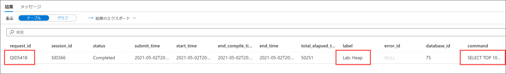

13. クエリ ID を使用すると (この場合は `QID5418`、**自分の ID に置き換えます**)、クエリの各ステップを調査できます。

    ```sql
    SELECT
       *
    FROM
        sys.dm_pdw_request_steps
    WHERE
        request_id = 'QID5418'
    ORDER BY
       step_index
    ```

    ステップ (インデックスは 0 から 4) はクエリ プランの操作 2 から 6 に一致します。原因は明らかです。インデックス 2 のステップは、パーティション間のデータ移動操作を説明しています。`TOTAL_ELAPSED_TIME` 列を見ると、クエリ時間の最大の部分がこのステップによって生成されていることがはっきりします。次のクエリ向けに**ステップのインデックスを書き留めておきます**。

    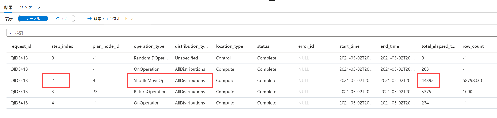

14. 以下の SQL ステートメントを使用して問題のあるステップの詳細を取得します (`request_id` と `step_index` はご自分の値に置き換えてください)。

    ```sql
    SELECT
    *
    FROM
        sys.dm_pdw_sql_requests
    WHERE
        request_id = 'QID5418'
        AND step_index = 2
    ```

    ステートメントの結果は、SQL プール内の各ディストリビューションで何が起きるのかを詳細に説明します。

    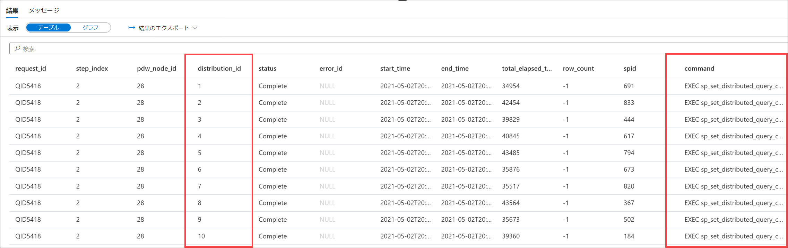

15. 最後に、以下の SQL ステートメントを使用して、分散データベースでのデータの移動を調査します (`request_id` と `step_index` はご自分の値に置き換えてください)。

    ```sql
    SELECT
        *
    FROM
        sys.dm_pdw_dms_workers
    WHERE
        request_id = 'QID5418'
        AND step_index = 2
    ORDER BY
        distribution_id
    ```

    ステートメントの結果は、各ディストリビューションで移動されるデータの詳細を提供します。`ROWS_PROCESSED` 列は特に、クエリの実行時に発生するデータ移動の規模を見積もる上で役に立ちます。

    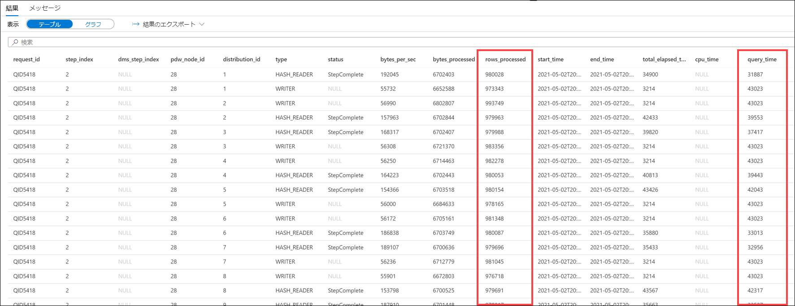

### タスク 2: ハッシュ分散と列ストア インデックスを使用してテーブル構造を向上させる

1. **Develop** ハブを選択します。

    

2. 「**開発**」 メニューで **+** ボタン **(1)** を選択し、コンテキスト 　メニューから 「**SQL スクリプト**」 (2) を選びます。

    

3. ツールバー メニューで、**SQLPool01** データベースに接続してクエリを実行します。

    

4. クエリ ウィンドウでスクリプトを以下に置き換え、CTAS (Create Table As Select) を使用して改善されたバージョンのテーブルを作成します。

     ```sql
    CREATE TABLE [wwi_perf].[Sale_Hash]
    WITH
    (
        DISTRIBUTION = HASH ( [CustomerId] ),
        CLUSTERED COLUMNSTORE INDEX
    )
    _AS
    SELECT
        *
    FROM
        [wwi_poc].[Sale]
    ```

5. ツールバー メニューから 「**実行**」 を選択して SQL コマンドを実行します。

    

    クエリの完了には **10 分**程度かかります。これを実行している間に、ラボの手順の残りを読み、内容をよく理解しておいてください。

    > **メモ**
    >
    > CTAS は、SELECT...INTO ステートメントの、よりカスタマイズ可能なバージョンです。
    > SELECT...INTO では、操作の一部として分散方法とインデックスの種類のいずれも変更することはできません。既定の分散の種類に ROUND_ROBIN を、既定のテーブル構造に CLUSTERED COLUMNSTORE INDEX を使用して、新しいテーブルを作成します。
    >
    > 一方、CTAS を使用すると、テーブル データの分散とテーブル構造の種類の両方を指定できます。

6. クエリ ウィンドウで、スクリプトを次のように置き換えて、パフォーマンスの向上を確認します。

    ```sql
    SELECT TOP 1000 * FROM
    (
        SELECT
            S.CustomerId
            ,SUM(S.TotalAmount) as TotalAmount
        FROM
            [wwi_perf].[Sale_Hash] S
        GROUP BY
            S.CustomerId
    ) T
    ```

7. ツールバー メニューから 「**実行**」 を選択して SQL コマンドを実行します。

    

    Heap テーブルに対して初めてスクリプトを実行したときと比べて、新しい Hash テーブルに対して実行したときのパフォーマンスが向上していることがわかります。この例では、クエリは約 8 秒で実行されました。

    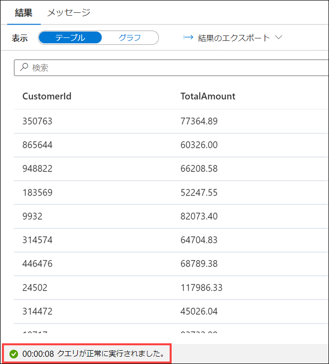

8. 以下の EXPLAIN ステートメントを再び実行して、クエリ プランを取得します (ツールバーから `Query Plan` を選択しないでください。クエリ プランをダウンロードして SQL Server Management Studio で開こうとしてしまいます)。

    ```sql
    EXPLAIN
    SELECT TOP 1000 * FROM
    (
        SELECT
            S.CustomerId
            ,SUM(S.TotalAmount) as TotalAmount
        FROM
            [wwi_perf].[Sale_Hash] S
        GROUP BY
            S.CustomerId
    ) T
    ```

    この結果生成されるクエリ プランは、ディストリビューション間のデータ移動がないため、明らかに以前のプランよりもよくなります。

    ```xml
    <data><row><explain><?xml version="1.0" encoding="utf-8"?>
    <dsql_query number_nodes="5" number_distributions="60" number_distributions_per_node="12">
    <sql>SELECT TOP 1000 * FROM
    (
        SELECT
            S.CustomerId
            ,SUM(S.TotalAmount) as TotalAmount
        FROM
            [wwi_perf].[Sale_Hash] S
        GROUP BY
            S.CustomerId
    ) T</sql>
    <dsql_operations total_cost="0" total_number_operations="1">
        <dsql_operation operation_type="RETURN">
        <location distribution="AllDistributions" />
        <select>SELECT [T1_1].[CustomerId] AS [CustomerId], [T1_1].[col] AS [col] FROM (SELECT TOP (CAST ((1000) AS BIGINT)) SUM([T2_1].[TotalAmount]) AS [col], [T2_1].[CustomerId] AS [CustomerId] FROM [SQLPool01].[wwi_perf].[Sale_Hash] AS T2_1 GROUP BY [T2_1].[CustomerId]) AS T1_1
    OPTION (MAXDOP 4)</select>
        </dsql_operation>
    </dsql_operations>
    </dsql_query></explain></row></data>
    ```

9. より複雑なクエリを実行し、実行プランと実行ステップを調べてください。使用できる、より複雑なクエリの例は以下のとおりです。

    ```sql
    SELECT
        AVG(TotalProfit) as AvgMonthlyCustomerProfit
    FROM
    (
        SELECT
            S.CustomerId
            ,D.Year
            ,D.Month
            ,SUM(S.TotalAmount) as TotalAmount
            ,AVG(S.TotalAmount) as AvgAmount
            ,SUM(S.ProfitAmount) as TotalProfit
            ,AVG(S.ProfitAmount) as AvgProfit
        FROM
            [wwi_perf].[Sale_Partition01] S
            join [wwi].[Date] D on
                D.DateId = S.TransactionDateId
        GROUP BY
            S.CustomerId
            ,D.Year
            ,D.Month
    ) T
    ```

### タスク 4: パーティションを使用してテーブル構造をさらに向上させる

テーブル パーティションを使用すると、データを小さなデータ グループに分割できます。パーティション分割をすると、データのメンテナンスとクエリのパフォーマンスでメリットを得ることができます。両方のメリットを得られるか、片方のみかは、データの読み込み方法と、同じ列を両方の目的で使用できるかどうかによります。その理由は、パーティション分割を実行できるのが 1 つの列のみであるためです。

日付列は通常、ディストリビューション レベルでのテーブル パーティション分割のよい候補になります。Tailwind Trader の売上データの場合、`TransactionDateId` 列に基づくパーティション分割がよい選択肢のように思われます。

専用 SQL プールにはすでに `TransactionDateId` を使用してパーティション分割した `Sale` テーブルの 2 つのバージョンが含まれています。`「wwi_perf」.「Sale_Partition01」` と `「wwi_perf」.「Sale_Partition02」` です。以下は、これらのテーブルの作成に使われた CTAS クエリです。

1. クエリ ウィンドウでスクリプトを、パーティション テーブルを作成する以下の CTAS クエリに置き換えます (**実行しないで**ください)。

    ```sql
    CREATE TABLE [wwi_perf].[Sale_Partition01]
    WITH
    (
      DISTRIBUTION = HASH ( [CustomerId] ),
      CLUSTERED COLUMNSTORE INDEX,
      PARTITION
      (
        [TransactionDateId] RANGE RIGHT FOR VALUES (
                20190101, 20190201, 20190301, 20190401, 20190501, 20190601, 20190701, 20190801, 20190901, 20191001, 20191101, 20191201)
      )
    )
    _AS
    SELECT
      *
    FROM	
      [wwi_perf].[Sale_Heap]
    OPTION  (LABEL  = 'CTAS : Sale_Partition01')

    CREATE TABLE [wwi_perf].[Sale_Partition02]
    WITH
    (
      DISTRIBUTION = HASH ( [CustomerId] ),
      CLUSTERED COLUMNSTORE INDEX,
      PARTITION
      (
        [TransactionDateId] RANGE RIGHT FOR VALUES (
                20190101、20190401、20190701、20191001)
      )
    )
    _AS
    SELECT *
    FROM
        [wwi_perf].[Sale_Heap]
    OPTION  (LABEL  = 'CTAS : Sale_Partition02')
    ```

    > **注**
    >
    > これらのクエリはすでに専用 SQL プールで実行されています。スクリプトは**実行しない**でください。

ここでは 2 つのパーティション分割戦略を使用した点に留意してください。最初のパーティション分割スキームは月ベースで、2 番目のスキームは四半期ベースです **(3)**。


#### タスク 4.1: テーブル分散

ご覧のように、2 つのパーティション分割テーブルがハッシュ分散されています **(1)**。分散テーブルは単一のテーブルとして表示されますが、実際には、行が 60 のディストリビューションにわたって格納されています。行はハッシュ アルゴリズムまたはラウンド ロビン アルゴリズムを使って、分散されます。

分散の種類には以下のものがあります。

- **ラウンド ロビン分散**: ディストリビューション全体でランダムにテーブル行を均等に分散します。
- **ハッシュ分散**: 決定論的なハッシュ関数を使用して各行を 1 つのディストリビューションに割り当て、複数の計算ノードにわたってテーブル行を分散させます。
- **レプリケート**: 各コンピューティング ノードでアクセスできるテーブルの完全なコピー。

ハッシュ分散テーブルでは、決定論的なハッシュ関数を使用して各行を 1 つのディストリビューションに割り当て、複数の計算ノードにわたってテーブル行を分散させます。

同一値は常に同じディストリビューションにハッシュされるため、データ ウェアハウスには行の位置情報に関する組み込みのナレッジがあります。

専用 SQL プールではこのナレッジを使用して、クエリ時のデータ移動を最小化し、クエリのパフォーマンスを向上させます。ハッシュ分散テーブルは、スター スキーマにある大規模なファクト テーブルに適しています。非常に多数の行を格納し、その上で高度なパフォーマンスを実現できます。もちろん、期待通りの分散システムのパフォーマンスを得るために役立つ設計上の考慮事項はいくつかあります。

*ハッシュ分散テーブルの使用は、次の場合に検討してください。*

- ディスク上のテーブル サイズが 2 GB を超えている。
- テーブルで、頻繁な挿入、更新、削除操作が行われる。

#### タスク 4.2: インデックス

クエリを見ると、パーティション分割されたテーブルが**クラスター化列ストア インデックス (2)** で構成されていることもわかります。専用 SQL プールで使用できるインデックスにはさまざまな種類があります。

- **クラスター化列ストア インデックス (既定プライマリ)**: 最高レベルのデータ圧縮と全体的に最高のクエリ パフォーマンスを提供します。
- **クラスター化インデックス (プライマリ)**: 単一の行または複数の行を検索するために実行されます。
- **ヒープ (プライマリ)**: より速い読み込みと一時的なデータのランディングから利点を得られます。小規模な参照テーブルに最適です。
- **非クラスター化インデックス (セカンダリ)**: テーブルで複数の列の順序付けを有効にし、単一のテーブルで複数の非クラスター化を可能にします。これは、上記のプライマリ インデックスのどれにでも作成でき、よりパフォーマンスの高い参照クエリになります。

既定で、専用 SQL プールでは、テーブルにインデックス オプションが指定されていない場合、クラスター化列ストア インデックスが作成されます。クラスター化列ストア テーブルは、クエリの全体的なパフォーマンスを最適化するだけでなく、最上位のレベルのデータ圧縮が可能になります。一般的にクラスター化インデックスまたはヒープ テーブルより優れており、大きなテーブルの選択肢として通常最適です。こうした理由から、テーブルのインデックスを作成する方法に確信がない場合は、クラスター化列ストアを使用することをお勧めします。

クラスター化列ストアが最適なオプションでない可能性があるシナリオを次に示します。

- 列ストア テーブルでは、`varchar(max)`、`nvarchar(max)`、`varbinary(max)` は使用できません。代わりに、ヒープまたはクラスター化インデックスを検討します。
- 列ストア テーブルでは、一時的なデータで効率が低下する可能性があります。ヒープと、場合によっては一時テーブルも検討してください。
- 1 億行未満を格納する小さなテーブルの場合、ヒープ テーブルを検討してください。

#### タスク 4.3: パーティション分割

再度、このクエリでは、2 つのテーブルを異なる方法で分割するため **(3)**、パフォーマンスの差を評価し、長期的にはどのパーティション分割戦略が最良なのか判断できます。最終的に選ぶ戦略は、Tailwind Trader のデータのさまざまな要素によって異なります。両方とも維持してクエリのパフォーマンスを向上させるよう決定できますが、その場合はデータを管理するためのデータ ストレージとメンテナンス要件が倍増します。

パーティション分割は、すべての種類のテーブルでサポートされています。

クエリで使用している **RANGE RIGHT** オプション **(3)** は時間パーティションで使われます。RANGE LEFT は数字パーティションで使用されます。

パーティション分割の主要な利点は以下のとおりです。

- データのサブセットに範囲を限定することで読み込みおよびクエリの効率とパフォーマンスが向上します。
- パーティション キーのフィルタリングによって不要なスキャンと I/O (入力/出力操作) を排除できる場合はクエリのパフォーマンスが大幅に向上します。

異なるパーティション戦略のテーブルを 2 つ作成したのは**(3)**、適切なサイズを試すためです。

パーティション分割を使用するとパフォーマンスが向上する可能性がありますが、パーティションが 多すぎる テーブルを作成するとパフォーマンスが低下することもあります。これらの問題は特に、ここで作成したようなクラスター化列ストア テーブルに当てはまります。パーティション分割が役立つように、パーティション分割を使用する時期と作成するパーティション数を把握することが重要です。パーティションの数が多すぎるかどうかについて厳格なルールはなく、データと、同時に読み込むパーティションの数によります。パーティション分割構成が成功すると、通常、パーティションの数は数十個から数百個程度であり、数千個にまでなることはありません。

*補足情報*:

クラスター化列ストア テーブルでパーティションを作成するときは、各パーティションに属している行数が重要になります。クラスター化列ストア テーブルの圧縮とパフォーマンスを最適化するためには、ディストリビューションおよびパーティションあたり少なくとも 100 万行が必要です。専用 SQL プールでは、パーティションが作成される前に、各テーブルが 60 個の分散データベースに既に分割されています。テーブルに追加されるすべてのパーティション分割は、バックグラウンドで作成されたディストリビューションに追加されたものです。この例では、売上のファクト テーブルに 36 か月のパーティションが含まれる場合、専用 SQL プールに 60 のディストリビューションがあるとすると、売上のファクト テーブルには 1 か月あたり 6 千万行、すべての月を指定する場合は 21 億行を含める必要があります。テーブルに含まれる行が、パーティションごとの推奨される最小の行数よりも少ない場合、パーティションあたりの行数を増やすためにパーティション数を少なくすることを検討する必要があります。

## 演習 4: クエリ パフォーマンスの向上

### タスク 1: 具体化されたビューを使用する

標準的なビューとは異なり、具体化されたビューはテーブルと同様、専用 SQL プールでデータの事前計算、格納、維持を行います。標準ビューと具体化されたビューの基本的な比較は以下のとおりです。

| 比較                     | ビュー                                         | 具体化されたビュー
|:-------------------------------|:---------------------------------------------|:-------------------------------------------------------------|
|ビューの定義                 | Synapse Analytics に格納。              | Synapse Analytics に格納。
|ビューの内容                    | ビューが使用されるたびに生成されます。   | ビューの作成中に Synapse Analytics で事前処理および格納が行われます。基になるテーブルにデータが追加されると更新されます。
|データ更新                    | 常時更新                               | 常時更新
|複雑なクエリからビューのデータを取得する速度     | 低速                                         | 高速  
|追加のストレージ                   | なし                                           | あり
|構文                          | CREATE VIEW                                  | CREATE MATERIALIZED VIEW AS SELECT

1. 以下のクエリを実行して、おおよその実行時間を取得します。

    ```sql
    SELECT TOP 1000 * FROM
    (
        SELECT
            S.CustomerId
            ,D.Year
            ,D.Quarter
            ,SUM(S.TotalAmount) as TotalAmount
        FROM
            [wwi_perf].[Sale_Partition02] S
            join [wwi].[Date] D on
                S.TransactionDateId = D.DateId
        GROUP BY
            S.CustomerId
            ,D.Year
            ,D.Quarter
    ) T
    ```

2. このクエリも実行します (わずかな差があります)

    ```sql
    SELECT TOP 1000 * FROM
    (
        SELECT
            S.CustomerId
            ,D.Year
            ,D.Month
            ,SUM(S.ProfitAmount) as TotalProfit
        FROM
            [wwi_perf].[Sale_Partition02] S
            join [wwi].[Date] D on
                S.TransactionDateId = D.DateId
        GROUP BY
            S.CustomerId
            ,D.Year
            ,D.Month
    ) T
    ```

3. 上記のクエリを両方ともサポートできる具体化されたビューを作成します。

    ```sql
    CREATE MATERIALIZED VIEW
        wwi_perf.mvCustomerSales
    WITH
    (
        DISTRIBUTION = HASH( CustomerId )
    )
    _AS
    SELECT
        S.CustomerId
        ,D.Year
        ,D.Quarter
        ,D.Month
        ,SUM(S.TotalAmount) as TotalAmount
        ,SUM(S.ProfitAmount) as TotalProfit
    FROM
        [wwi_perf].[Sale_Partition02] S
        join [wwi].[Date] D on
            S.TransactionDateId = D.DateId
    GROUP BY
        S.CustomerId
        ,D.Year
        ,D.Quarter
        ,D.Month
    ```

4. 以下のクエリを実行して、予測される実行プランを取得します (ツールバーから `Query Plan` を選択しないでください。クエリ プランをダウンロードして SQL Server Management Studio で開こうとしてしまいます)。

    ```sql
    EXPLAIN
    SELECT TOP 1000 * FROM
    (
        SELECT
            S.CustomerId
            ,D.Year
            ,D.Quarter
            ,SUM(S.TotalAmount) as TotalAmount
        FROM
            [wwi_perf].[Sale_Partition02] S
            join [wwi].[Date] D on
                S.TransactionDateId = D.DateId
        GROUP BY
            S.CustomerId
            ,D.Year
            ,D.Quarter
    ) T
    ```

    この結果、生成された実行プランは、あたらさしく作成された具体化されたビューが実行を最適化するために使用されていることを示します。`<dsql_operations>` 要素の `FROM 「SQLPool01」.「wwi_perf」.「mvCustomerSales」` に留意してください。

    ```xml
    <?xml version="1.0" encoding="utf-8"?>
    <dsql_query number_nodes="5" number_distributions="60" number_distributions_per_node="12">
    <sql>SELECT TOP 1000 * FROM
    (
        SELECT
            S.CustomerId
            ,D.Year
            ,D.Quarter
            ,SUM(S.TotalAmount) as TotalAmount
        FROM
            [wwi_perf].[Sale_Partition02] S
            join [wwi].[Date] D on
                S.TransactionDateId = D.DateId
        GROUP BY
            S.CustomerId
            ,D.Year
            ,D.Quarter
    ) T</sql>
    <dsql_operations total_cost="0" total_number_operations="1">
        <dsql_operation operation_type="RETURN">
        <location distribution="AllDistributions" />
        <select>SELECT [T1_1].[CustomerId] AS [CustomerId], [T1_1].[Year] AS [Year], [T1_1].[Quarter] AS [Quarter], [T1_1].[col] AS [col] FROM (SELECT TOP (CAST ((1000) AS BIGINT)) [T2_1].[CustomerId] AS [CustomerId], [T2_1].[Year] AS [Year], [T2_1].[Quarter] AS [Quarter], [T2_1].[col1] AS [col] FROM (SELECT ISNULL([T3_1].[col1], CONVERT (BIGINT, 0, 0)) AS [col], [T3_1].[CustomerId] AS [CustomerId], [T3_1].[Year] AS [Year], [T3_1].[Quarter] AS [Quarter], [T3_1].[col] AS [col1] FROM (SELECT SUM([T4_1].[TotalAmount]) AS [col], SUM([T4_1].[cb]) AS [col1], [T4_1].[CustomerId] AS [CustomerId], [T4_1].[Year] AS [Year], [T4_1].[Quarter] AS [Quarter] FROM (SELECT [T5_1].[CustomerId] AS [CustomerId], [T5_1].[TotalAmount] AS [TotalAmount], [T5_1].[cb] AS [cb], [T5_1].[Quarter] AS [Quarter], [T5_1].[Year] AS [Year] FROM [SQLPool01].[wwi_perf].[mvCustomerSales] AS T5_1) AS T4_1 GROUP BY [T4_1].[CustomerId], [T4_1].[Year], [T4_1].[Quarter]) AS T3_1) AS T2_1 WHERE ([T2_1].[col] != CAST ((0) AS BIGINT))) AS T1_1
    OPTION (MAXDOP 6)</select>
        </dsql_operation>
    </dsql_operations>
    </dsql_query>
    ```

5. 同じ具体化されたビューを使用して、2 番目のクエリも最適化します。 Get its execution plan:

    ```sql
    EXPLAIN
    SELECT TOP 1000 * FROM
    (
        SELECT
            S.CustomerId
            ,D.Year
            ,D.Month
            ,SUM(S.ProfitAmount) as TotalProfit
        FROM
            [wwi_perf].[Sale_Partition02] S
            join [wwi].[Date] D on
                S.TransactionDateId = D.DateId
        GROUP BY
            S.CustomerId
            ,D.Year
            ,D.Month
    ) T
    ```

    この結果生成された実行プランは、同じ具体化されたビューが実行の最適化に使用されていることを示しています。

    ```xml
    <?xml version="1.0" encoding="utf-8"?>
    <dsql_query number_nodes="5" number_distributions="60" number_distributions_per_node="12">
    <sql>SELECT TOP 1000 * FROM
    (
        SELECT
            S.CustomerId
            ,D.Year
            ,D.Month
            ,SUM(S.ProfitAmount) as TotalProfit
        FROM
            [wwi_perf].[Sale_Partition02] S
            join [wwi].[Date] D on
                S.TransactionDateId = D.DateId
        GROUP BY
            S.CustomerId
            ,D.Year
            ,D.Month
    ) T</sql>
    <dsql_operations total_cost="0" total_number_operations="1">
        <dsql_operation operation_type="RETURN">
        <location distribution="AllDistributions" />
        <select>SELECT [T1_1].[CustomerId] AS [CustomerId], [T1_1].[Year] AS [Year], [T1_1].[Month] AS [Month], [T1_1].[col] AS [col] FROM (SELECT TOP (CAST ((1000) AS BIGINT)) [T2_1].[CustomerId] AS [CustomerId], [T2_1].[Year] AS [Year], [T2_1].[Month] AS [Month], [T2_1].[col1] AS [col] FROM (SELECT ISNULL([T3_1].[col1], CONVERT (BIGINT, 0, 0)) AS [col], [T3_1].[CustomerId] AS [CustomerId], [T3_1].[Year] AS [Year], [T3_1].[Month] AS [Month], [T3_1].[col] AS [col1] FROM (SELECT SUM([T4_1].[TotalProfit]) AS [col], SUM([T4_1].[cb]) AS [col1], [T4_1].[CustomerId] AS [CustomerId], [T4_1].[Year] AS [Year], [T4_1].[Month] AS [Month] FROM (SELECT [T5_1].[CustomerId] AS [CustomerId], [T5_1].[TotalProfit] AS [TotalProfit], [T5_1].[cb] AS [cb], [T5_1].[Month] AS [Month], [T5_1].[Year] AS [Year] FROM [SQLPool01].[wwi_perf].[mvCustomerSales] AS T5_1) AS T4_1 GROUP BY [T4_1].[CustomerId], [T4_1].[Year], [T4_1].[Month]) AS T3_1) AS T2_1 WHERE ([T2_1].[col] != CAST ((0) AS BIGINT))) AS T1_1
    OPTION (MAXDOP 6)</select>
        </dsql_operation>
    </dsql_operations>
    </dsql_query>
    ```

    >**注**
    >
    >2 つのクエリの集計れベルが異なる場合でも、クエリ オプティマイザーは具体化されたビューの使用を推論できます。これは、具体化されたビューが両方の集計レベル (`Quarter` と `Month`) のほか、両方の集計方法 (`TotalAmount` と `ProfitAmount`) にも対応しているためです。

6. 具体化されたビューのオーバーヘッドをチェックしてください。

    ```sql
    DBCC PDW_SHOWMATERIALIZEDVIEWOVERHEAD ( 'wwi_perf.mvCustomerSales' )
    ```

    この結果は、`BASE_VIEW_ROWS` が `TOTAL_ROWS` に等しいことを示します (このため、`OVERHEAD_RATIO` は 1 になります)。具体化されたビューはベース ビューに完璧に揃えられます。基本的なデータが変化し始めると、この状況も変化すると予想されています。

7. 具体化されたビューの基盤となっているオリジナルのデータを更新します。

    ```sql
    UPDATE
        [wwi_perf].[Sale_Partition02]
    SET
        TotalAmount = TotalAmount * 1.01
        ,ProfitAmount = ProfitAmount * 1.01
    WHERE
        CustomerId BETWEEN 100 and 200
    ```

8. 具体化されたビューのオーバーヘッドを再びチェックします。

    ```sql
    DBCC PDW_SHOWMATERIALIZEDVIEWOVERHEAD ( 'wwi_perf.mvCustomerSales' )
    ```

    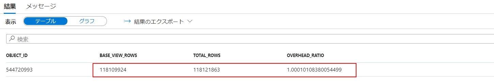

    具体化されたビューによって格納されるデルタができました。これにより、`TOTAL_ROWS` は `BASE_VIEW_ROWS` よりも大きくなり、`OVERHEAD_RATIO` は 1 よりも大きくなります。

9. 具体化されたビューを再構築し、オーバーヘッドが 1 に戻ることを確認します。

    ```sql
    ALTER MATERIALIZED VIEW [wwi_perf].[mvCustomerSales] REBUILD

    DBCC PDW_SHOWMATERIALIZEDVIEWOVERHEAD ( 'wwi_perf.mvCustomerSales' )
    ```

    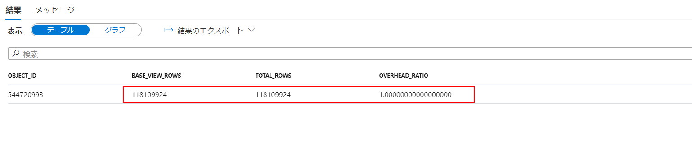

### タスク 2: 結果セットのキャッシュを使用する

Tailwind Trader のダウンストリーム レポートは多くのユーザーに使用されています。つまり、多くの場合、頻繁に変化しないデータに対して同じクエリが繰り返し実行されるということです。このようなクエリのパフォーマンスを向上させるにはどうすればよいですか? 基本的なデータが変化すると、このアプローチはどのように機能しますか?

結果セットのキャッシュを検討する必要があります。

専用 Azure Synapse SQL プール ストレージでクエリの結果をキャッシュします。これにより、データが頻繁に変更されないテーブルに対して繰り返し実行されるクエリの対話型応答時間が可能になります。

> 結果セット キャッシュは、専用 SQL プールが一時停止され、後で再開された場合でも保持されます。

基になるテーブル データまたはクエリ コードが変化すると、クエリ キャッシュは無効になり、更新されます。

結果のキャッシュは、TLRU (time-aware least recently used) アルゴリズムに基づき、定期的に無効にされます。

1. クエリ ウィンドウで、スクリプトを次のように置き換え、結果セットのキャッシュが現在の専用 SQL プールで有効になっているのか確認します。

    ```sql
    SELECT
        name
        ,is_result_set_caching_on
    FROM
        sys.databases
    ```

2. ツールバー メニューから 「**実行**」 を選択して SQL コマンドを実行します。

    

    クエリの出力を確認します。**SQLPool01** の `Is_result_set_caching_on` 値とは何でしょう? ここでは `False` に設定されています。つまり、結果セットのキャッシュは現在、無効です。

    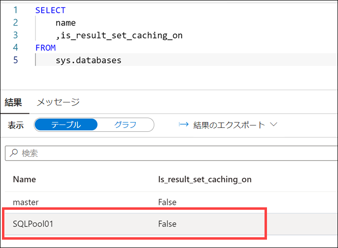

3. クエリ ウィンドウでデータベースを **master (1)** に変更した後、スクリプト **(2)** を以下に置き換えて、結果セットのキャッシュを有効にします。

    ```sql
    ALTER DATABASE SQLPool01
    SET RESULT_SET_CACHING ON
    ```

    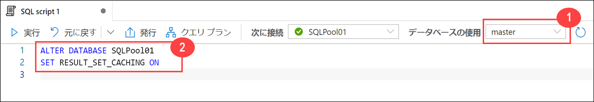

4. ツールバー メニューから 「**実行**」 を選択して SQL コマンドを実行します。

    

    > **重要**
    >
    > 結果セットのキャッシュを作成し、キャッシュからデータを取得する操作は、専用 SQL プール インスタンスの制御ノードで行われます。結果セットのキャッシュを有効にした場合、大きな結果セット (たとえば 1 GB 超) を返すクエリを実行すると、制御ノードでスロットリングが大きくなり、インスタンスでのクエリ応答全体が遅くなる可能性があります。これらのクエリは、通常、データの探索または ETL 操作で使用されます。制御ノードに負荷を与え、パフォーマンスの問題が発生するのを防ぐため、ユーザーは、このようなクエリを実行する前に、データベースの結果セットのキャッシュを無効にする必要があります。

5. ツールバー メニューで、**SQLPool01** データベースに接続して次のクエリを実行します。

    

6. クエリ ウィンドウでスクリプトを次のクエリに置き換え、これがキャッシュをヒットするかどうか、すぐにチェックします。

    ```sql
    SELECT
        D.Year
        ,D.Quarter
        ,D.Month
        ,SUM(S.TotalAmount) as TotalAmount
        ,SUM(S.ProfitAmount) as TotalProfit
    FROM
        [wwi_perf].[Sale_Partition02] S
        join [wwi].[Date] D on
            S.TransactionDateId = D.DateId
    GROUP BY
        D.Year
        ,D.Quarter
        ,D.Month
    OPTION (LABEL = 'Lab: Result set caching')

    SELECT
        result_cache_hit
    FROM
        sys.dm_pdw_exec_requests
    WHERE
        request_id =
        (
            SELECT TOP 1
                request_id
            FROM
                sys.dm_pdw_exec_requests
            WHERE
                [label] = 'Lab: Result set caching'
            ORDER BY
                start_time desc
        )
    ```

7. ツールバー メニューから 「**実行**」 を選択して SQL コマンドを実行します。

    

    予想されていたとおり、結果は **`False` (0)** です。

    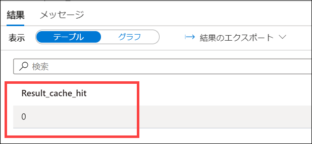

    まだ、クエリの実行中、専用 SQL プールが結果セットをキャッシュしたことがわかります。

8. クエリ ウィンドウでスクリプトを以下に置き換えて、実行手順を取得します。

    ```sql
    SELECT
        step_index
        ,operation_type
        ,location_type
        ,status
        ,total_elapsed_time
        ,command
    FROM
        sys.dm_pdw_request_steps
    WHERE
        request_id =
        (
            SELECT TOP 1
                request_id
            FROM
                sys.dm_pdw_exec_requests
            ただし
                [label] = 'Lab: Result set caching'
            ORDER BY
                start_time desc
        )
    ```

9. ツールバー メニューから 「**実行**」 を選択して SQL コマンドを実行します。

    

    実行プランは、結果セット キャッシュの構築を示しています。

    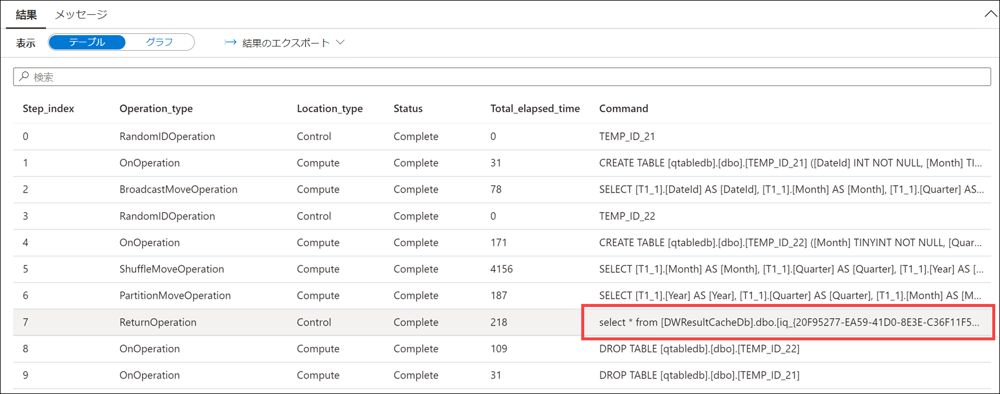

    ユーザー セッション レベルで結果セット キャッシュの使用を制御できます。

10. クエリ ウィンドウでスクリプトを以下に置き換えて、結果キャッシュを無効および有効にできます。

    ```sql  
    SET RESULT_SET_CACHING OFF

    SELECT
        D.Year
        ,D.Quarter
        ,D.Month
        ,SUM(S.TotalAmount) as TotalAmount
        ,SUM(S.ProfitAmount) as TotalProfit
    FROM
        [wwi_perf].[Sale_Partition02] S
        join [wwi].[Date] D on
            S.TransactionDateId = D.DateId
    GROUP BY
        D.Year
        ,D.Quarter
        ,D.Month
    OPTION (LABEL = 'Lab: Result set caching off')

    SET RESULT_SET_CACHING ON

    SELECT
        D.Year
        ,D.Quarter
        ,D.Month
        ,SUM(S.TotalAmount) as TotalAmount
        ,SUM(S.ProfitAmount) as TotalProfit
    FROM
        [wwi_perf].[Sale_Partition02] S
        join [wwi].[Date] D on
            S.TransactionDateId = D.DateId
    GROUP BY
        D.Year
        ,D.Quarter
        ,D.Month
    OPTION (LABEL = 'Lab: Result set caching on')

    SELECT TOP 2
        request_id
        ,[label]
        ,result_cache_hit
    FROM
        sys.dm_pdw_exec_requests
    WHERE
        [label] in ('Lab: Result set caching off', 'Lab: Result set caching on')
    ORDER BY
        start_time desc
    ```

11. ツールバー メニューから 「**実行**」 を選択して SQL コマンドを実行します。

    

    上記のスクリプトの **`SET RESULT_SET_CACHING OFF`** の結果はキャッシュ ヒットのテスト結果に表示されます (`result_cache_hit` 列はキャッシュ ヒットとして `1`、キャッシュ ミスとして `0`、結果セットのキャッシュが使用されなかった理由として *負の値*を返します)。

    !「結果キャッシュのオンおよびオフ。](media/result-set-cache-off.png "Result cache on/off results")

12. クエリ ウィンドウでスクリプトを以下に置き換えて、結果キャッシュで使用する領域をチェックします。

    ```sql
    DBCC SHOWRESULTCACHESPACEUSED
    ```

13. ツールバー メニューから 「**実行**」 を選択して SQL コマンドを実行します。

    

16. クエリ ウィンドウでデータベースを **master (1)** に変更した後、スクリプト **(2)** を以下に置き換えて、結果セットのキャッシュを無効にします。

    ```sql
    ALTER DATABASE SQLPool01
    SET RESULT_SET_CACHING OFF
    ```

    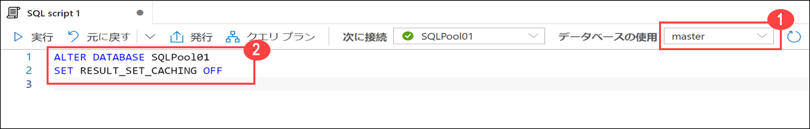

17. ツールバー メニューから 「**実行**」 を選択して SQL コマンドを実行します。

    

    > **注**
    >
    > 専用 SQL プールで結果セットのキャッシュが無効になっていることを確認します。これを怠ると、残りのデモに悪影響が出ます。実行時間がゆがめられ、今後行う複数の演習の目的が失われてしまうためです。

    結果セットのキャッシュの最大サイズは、データベースあたり 1 TB です。基になるクエリ データが変更されると、キャッシュされた結果は自動的に無効になります。

    キャッシュの削除は、このスケジュールに従って専用 SQL で自動的に管理されます。

    - 結果セットが使用されていない場合、または無効になっている場合は、48 時間ごと。
    - 結果セットのキャッシュが最大サイズに近づいた場合。

    ユーザーは、次のいずれかのオプションを使用して、結果セットのキャッシュ全体を手動で空にすることができます。

    - データベースの結果セットのキャッシュ機能をオフにする
    - データベースに接続しているときに DBCC DROPRESULTSETCACHE を実行する

    データベースを一時停止しても、キャッシュされた結果セットは空になりません。

### タスク 3: 統計を作成して更新する

専用 SQL プールのリソースがデータに関する情報を多く持っているほど、クエリをすばやく実行できます。専用 SQL プールにデータを読み込んだ後、データに関する統計を収集することは、クエリ最適化のために実行できる最も重要なことの 1 つです。

専用 SQL プール クエリ オプティマイザーは、コストベースのオプティマイザーです。オプティマイザーでは、さまざまなクエリ プランのコストが比較されて、最も低コストのプランが選択されます。多くの場合、それは最も高速に実行されるプランが選択されます。

たとえば、クエリでフィルター処理されている日付に対して返されるのは 1 行であるとオプティマイザーで推定されると、1 つのプランが選択されます。選択された日付で返されるのが 100 万行であると推定された場合は、別のプランが返されます。

1. 統計がデータベースで自動的に作成されるよう設定されているか確認します。

    ```sql
    SELECT name, is_auto_create_stats_on
    FROM sys.databases
    ```

2. 自動的に作成された統計を確認します (データベースを専用 SQL プールに戻します)。

    ```sql
    SELECT
        *
    FROM
        sys.dm_pdw_exec_requests
    WHERE
        Command like 'CREATE STATISTICS%'
    ```

    自動的に生成された統計では特殊な名前のパターンが使われていることがわかります。

    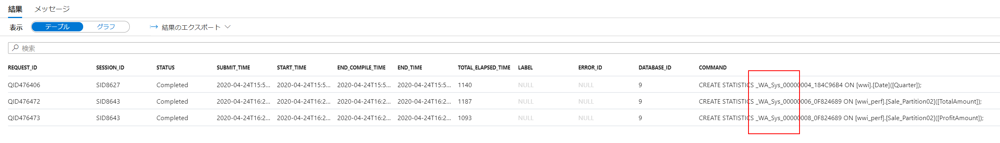

3. `CustomerId` 向けに `wwi_perf.Sale_Has` テーブルで作成された統計があるか確認します。

    ```sql
    DBCC SHOW_STATISTICS ('wwi_perf.Sale_Hash', CustomerId) WITH HISTOGRAM
    ```

    `CustomerId` の統計は存在しないというエラー メッセージが表示されます。

4. `CustomerId` の統計を作成します。

    ```sql
    CREATE STATISTICS Sale_Hash_CustomerId ON wwi_perf.Sale_Hash (CustomerId)
    ```

    新しく作成された統計を表示します。

    ```sql
    DBCC SHOW_STATISTICS([wwi_perf.Sale_Hash], 'Sale_Hash_CustomerId')
    ```

    結果ペインで `Chart` 表示に切り替え、以下のようにプロパティを構成します。

    - **グラフの種類**: 面グラフ
    - **カテゴリ列**: 「RANGE_HI_KEY」
    - **凡例 (シリーズ) 列**: RANGE_ROWS

    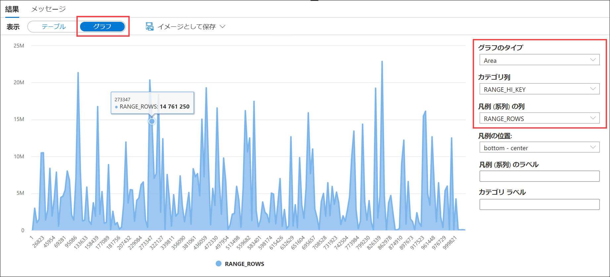

    これで `CustomerId` 列向けに統計のビジュアルが作成されました。

    >**重要**
    >
    >SQL プールがデータに関する情報を多く持っているほど、それに対するクエリを高速に実行できます。SQL プールにデータを読み込んだ後、データに関する統計を収集することは、クエリの最適化のために実行できる最も重要なことの 1 つです。
    >
    >SQL プール クエリ オプティマイザーは、コストベースのオプティマイザーです。オプティマイザーでは、さまざまなクエリ プランのコストが比較されて、最も低コストのプランが選択されます。多くの場合、それは最も高速に実行されるプランが選択されます。
    >
    >たとえば、クエリでフィルター処理されている日付に対して返されるのは 1 行であるとオプティマイザーで推定されると、1 つのプランが選択されます。選択された日付で返されるのが 100 万行であると推定された場合は、別のプランが返されます。

### タスク 4: インデックスを作成して更新する

クラスター化列ストア インデックス、ヒープ、クラスター化と非クラスター化

クラスター化インデックスは、1 つの行をすばやく取得する必要がある場合に、クラスター化列ストア インデックスを上回る可能性があります。極めて高速で実行するために 1 行または極めて少数の行の検索が必要とされるクエリの場合、クラスター化インデックスまたは非クラスター化セカンダリ インデックスを検討してください。クラスター化インデックスを使用するデメリットは、クラスター化インデックスの列で非常に選択的なフィルターを使用するクエリのみに効果が得られることです。他の列のフィルターを改善するには、非クラスター化インデックスを他の列に追加できます。ただし、テーブルに各インデックスを追加すると、領域と読み込みの処理時間の両方が増加します。

1. CCI のあるテーブルから単一の顧客に関する情報を取得します。

    ```sql
    SELECT
        *
    FROM
        [wwi_perf].[Sale_Hash]
    WHERE
        CustomerId = 500000
    ```

    実行時間を書き留めておきます。

2. クラスター化インデックスのあるテーブルから単一の顧客に関する情報を取得します。

    ```sql
    SELECT
        *
    FROM
        [wwi_perf].[Sale_Index]
    WHERE
        CustomerId = 500000
    ```

    実行時間は上記のクエリの時間に類似しています。非常に選択的なクエリを使用した特殊なシナリオでは、クラスター化列ストア インデックスには、クラスター化インデックスに比べて有意な利点はありません。

3. CCI のあるテーブルから複数の顧客に関する情報を取得します。

    ```sql
    SELECT
        *
    FROM
        [wwi_perf].[Sale_Hash]
    WHERE
        CustomerId between 400000 and 400100
    ```

    その後、クラスター化インデックスのあるテーブルから同じ情報を取得します。

    ```sql
    SELECT
        *
    FROM
        [wwi_perf].[Sale_Index]
    WHERE
        CustomerId between 400000 and 400100
    ```

    両方のクエリを何回か実行して、安定した実行時間を取得します。通常の状況では、顧客が比較的少数の場合でも CCI テーブルの方がクラスター化インデックス テーブルより結果がよいことがわかります。

4. ここでクエリに条件を追加します。`StoreId` 列を参照する条件です。

    ```sql
    SELECT
        *
    FROM
        [wwi_perf].[Sale_Index]
    WHERE
        CustomerId between 400000 and 400100
        and StoreId between 2000 and 4000
    ```

    実行時間を書き留めておきます。

5. 非クラスター化インデックスを `StoreId` 列で作成します。

    ```sql
    CREATE INDEX Store_Index on wwi_perf.Sale_Index (StoreId)
    ```

    インデックスの作成は数分で終わるはずです。インデックスが作成された後、再び前のクエリを実行します。新しく作成された非クラスター化インデックスでは実行時間が向上したことがわかります。

    >**注**
    >
    >`wwi_perf.Sale_Index` での非クラスター化インデックスの作成は、すでに存在するクラスター化インデックスに基づいています。ボーナスの演習として、同じ種類のインデックスを `wwi_perf.Sale_Hash` テーブルで作成してみてください。インデックス作成時間の差を説明できますか?

### タスク 5: 順序指定クラスター化列ストア インデックス

既定では、インデックス オプションを指定せずに作成されたテーブルごとに、内部コンポーネント (インデックス ビルダー) によって非順序指定クラスター化列ストア インデックス (CCI) が作成されます。各列のデータは、個別の CCI 行グループ セグメントに圧縮されます。各セグメントの値の範囲にメタデータがあるため、クエリ述語の境界外にあるセグメントがクエリの実行時にディスクから読み取られることはありません。CCI では、最高レベルのデータ圧縮が提供され、読み取るセグメントのサイズが抑制されるため、クエリをより高速に実行できます。ただし、インデックス ビルダーはデータをセグメントに圧縮する前に並べ替えないため、値の範囲が重複するセグメントが発生し、その結果、クエリがディスクから読み取るセグメントが増えて、完了にかかる時間が長くなる可能性があります。

順序指定 CCI を作成する場合、インデックス ビルダーがインデックス セグメントへと圧縮する前に、Synapse SQL エンジンによってメモリ内の既存のデータが順序キーで並べ替えられます。データの並べ替えによってセグメントの重複が減少することで、ディスクから読み取るセグメントの数が少なくなるため、クエリでより効率的なセグメントの除外が行われ、パフォーマンスの高速化が実現します。メモリ内ですべてのデータを一度に並べ替えられる場合、セグメントの重複を回避することができます。データ ウェアハウス内のテーブルが大きいため、このシナリオはあまり発生しません。

次のパターンを持つクエリは、通常、順序指定 CCI でより速く実行されます。

- クエリに、等値、非等値、または範囲の述語がある
- 述語列と順序指定 CCI 列が同じである。
- 述語列が、順序指定 CCI 列の列序数と同じ順序で使用されている。

1. 以下のクエリを実行して、`Sale_Hash` テーブルのセグメント重複を示します。

    ```sql
    select
        OBJ.name as table_name
        ,COL.name as column_name
        ,NT.distribution_id
        ,NP.partition_id
        ,NP.rows as partition_rows
        ,NP.data_compression_desc
        ,NCSS.segment_id
        ,NCSS.version
        ,NCSS.min_data_id
        ,NCSS.max_data_id
        ,NCSS.row_count
    from
        sys.objects OBJ
        JOIN sys.columns as COL ON
            OBJ.object_id = COL.object_id
        JOIN sys.pdw_table_mappings TM ON
            OBJ.object_id = TM.object_id
        JOIN sys.pdw_nodes_tables as NT on
            TM.physical_name = NT.name
        JOIN sys.pdw_nodes_partitions NP on
            NT.object_id = NP.object_id
            and NT.pdw_node_id = NP.pdw_node_id
            and substring(TM.physical_name, 40, 10) = NP.distribution_id
        JOIN sys.pdw_nodes_column_store_segments NCSS on
            NP.partition_id = NCSS.partition_id
            and NP.distribution_id = NCSS.distribution_id
            and COL.column_id = NCSS.column_id
    where
        OBJ.name = 'Sale_Hash'
        and COL.name = 'CustomerId'
        and TM.physical_name  not like '%HdTable%'
    order by
        NT.distribution_id
    ```

    ここでは、クエリに関わるテーブルを簡単に説明します。

    テーブル名 | 説明
    ---|---
    sys.objects | データベースのすべてのオブジェクト。`Sale_Hash` テーブルのみと一致するようフィルタリングされます。
    sys.columns | データベースのすべての列。`Sale_Hash` テーブルの `CustomerId` 列のみと一致するようフィルタリングされます。
    sys.pdw_table_mappings | 物理的なノートと分散上のローカル テーブルに各テーブルをマッピングします。
    sys.pdw_nodes_tables | 各分散の各ローカル テーブルに関する情報が含まれています。
    sys.pdw_nodes_partitions | 各分散で各ローカル テーブルの各ローカル パーティションに関する情報が含まれています。
    sys.pdw_nodes_column_store_segments | 各分散で各ローカル テーブルの各パーティションおよび分散列の各 CCI セグメントに関する情報が含まれています。`Sale_Hash` テーブルの `CustomerId` 列のみと一致するようフィルタリングされます。

    この情報をもとに結果を見てみましょう。

    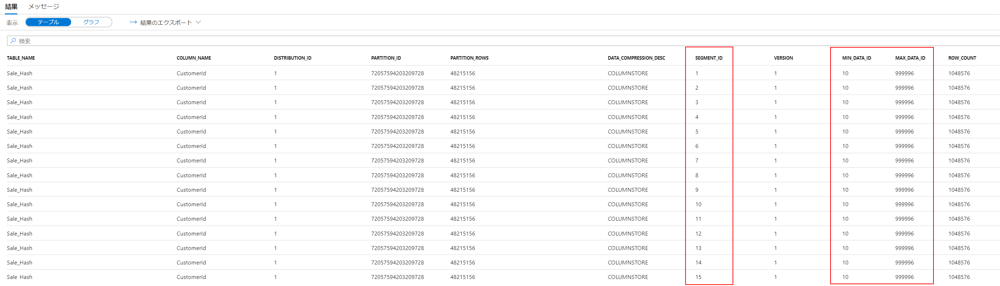

    結果セットを参照すると、セグメント間で大幅な重複があることがわかります。これは、セグメントの単一ペアすべての間での顧客 ID の重複です (データの `CustomerId` 値の範囲は 1 - 1,000,000)。この CCI のセグメント構造は明らかに効率が悪く、ストレージから不要な読み取りが多数行われています。

2. 以下のクエリを実行して、`Sale_Hash_Ordered` テーブルのセグメント重複を示します。

    ```sql
    select
        OBJ.name as table_name
        ,COL.name as column_name
        ,NT.distribution_id
        ,NP.partition_id
        ,NP.rows as partition_rows
        ,NP.data_compression_desc
        ,NCSS.segment_id
        ,NCSS.version
        ,NCSS.min_data_id
        ,NCSS.max_data_id
        ,NCSS.row_count
    from
        sys.objects OBJ
        JOIN sys.columns as COL ON
            OBJ.object_id = COL.object_id
        JOIN sys.pdw_table_mappings TM ON
            OBJ.object_id = TM.object_id
        JOIN sys.pdw_nodes_tables as NT on
            TM.physical_name = NT.name
        JOIN sys.pdw_nodes_partitions NP on
            NT.object_id = NP.object_id
            and NT.pdw_node_id = NP.pdw_node_id
            and substring(TM.physical_name, 40, 10) = NP.distribution_id
        JOIN sys.pdw_nodes_column_store_segments NCSS on
            NP.partition_id = NCSS.partition_id
            and NP.distribution_id = NCSS.distribution_id
            and COL.column_id = NCSS.column_id
    where
        OBJ.name = 'Sale_Hash_Ordered'
        and COL.name = 'CustomerId'
        and TM.physical_name  not like '%HdTable%'
    order by
        NT.distribution_id
    ```

    `wwi_perf.Sale_Hash_Ordered` テーブルの作成で使用された CTAS は以下のとおりです (**実行しないでください**)。

    ```sql
    CREATE TABLE [wwi_perf].[Sale_Hash_Ordered]
    WITH
    (
        DISTRIBUTION = HASH ( [CustomerId] ),
        CLUSTERED COLUMNSTORE INDEX ORDER( [CustomerId] )
    )
    _AS
    SELECT
        *
    FROM
        [wwi_perf].[Sale_Heap]
    OPTION  (LABEL  = 'CTAS : Sale_Hash', MAXDOP 1)
    ```

    順序指定 CCI が MAXDOP = 1 を使用して作成されています。順序指定 CCI の作成に使用される各スレッドでは、データのサブセットが処理され、ローカルで並べ替えられます。異なるスレッドによって並べ替えられたデータ全体での並べ替えは行われません。並列スレッドを使用すると、順序指定 CCI を作成する時間を短縮できますが、単一のスレッドを使用するよりも生成されるセグメントの重複が多くなります。現在、MAXDOP オプションは、CREATE TABLE AS SELECT コマンドを使用した順序指定 CCI テーブルの作成でのみサポートされます。CREATE INDEX コマンドまたは CREATE TABLE コマンドを使用した順序指定 CCI の作成では、MAXDOP オプションはサポートされません。

    この結果は、セグメント間で重複が大幅に減少したことを示しています。

    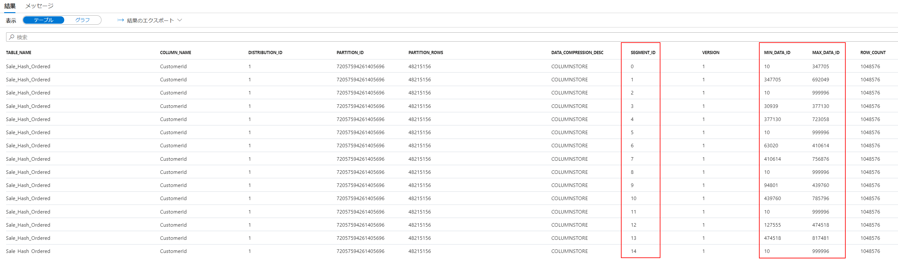
