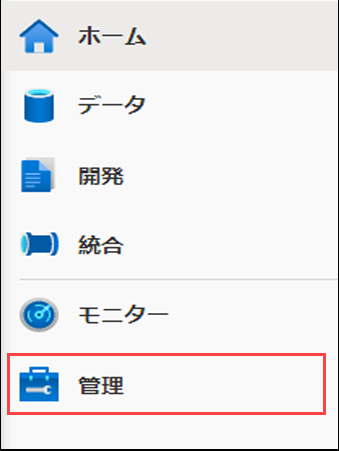
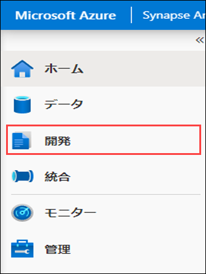
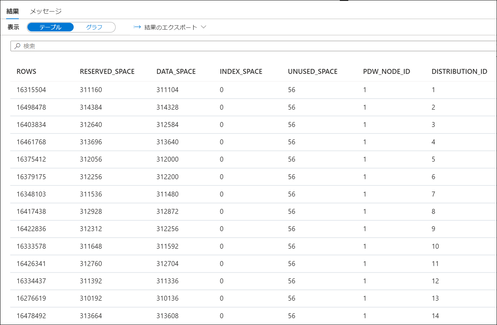
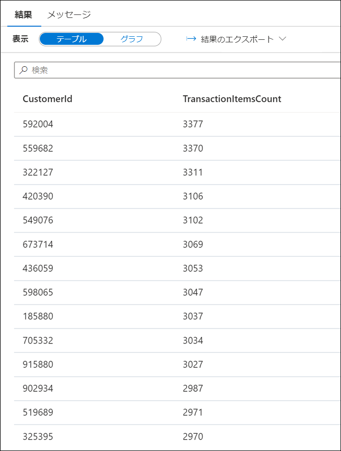
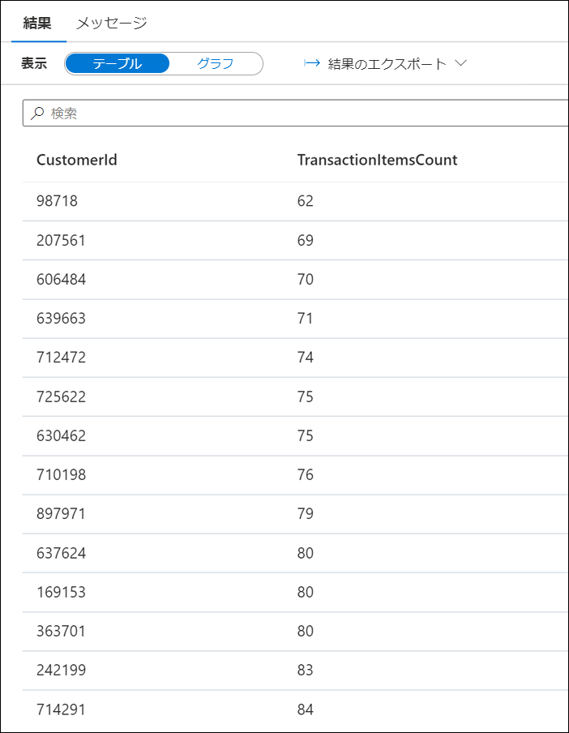
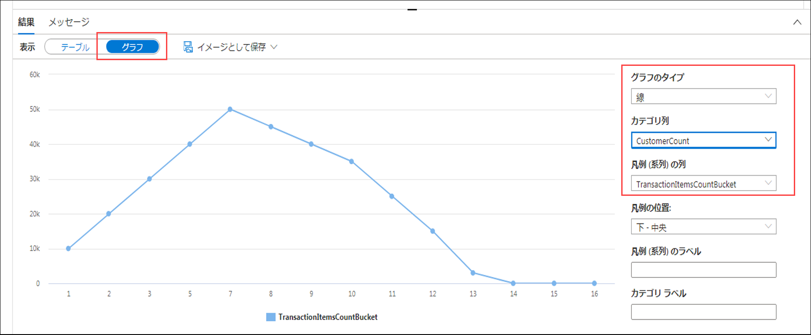
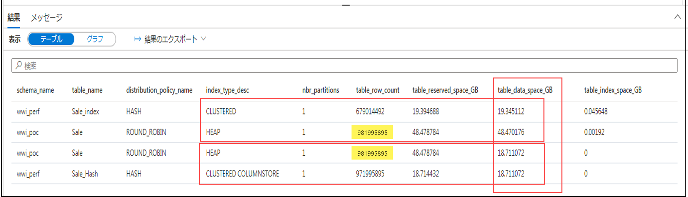
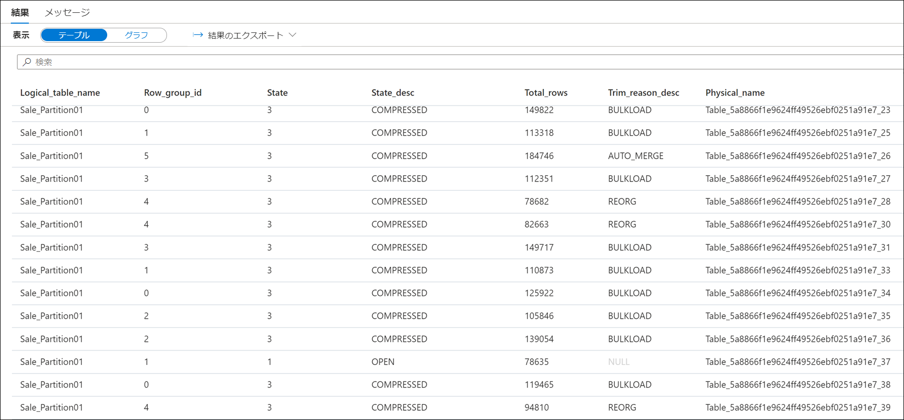
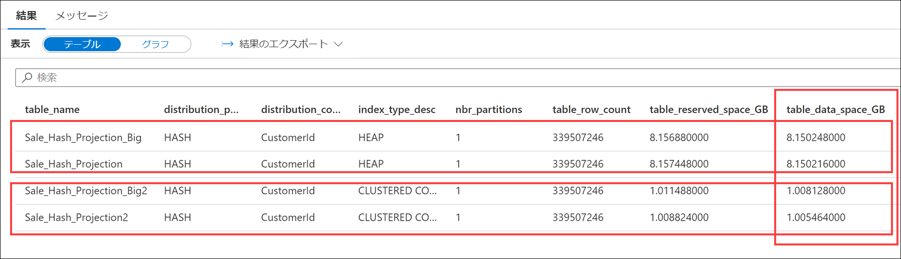

# モジュール 11 - データ ウェアハウス ストレージを分析して最適化する

このモジュールでは、Azure Synapse 専用 SQL プールのデータ ストレージを分析して最適化する方法を学習します。受講者は、テーブルの領域使用量と列ストア ストレージの詳細を把握するテクニックを学びます。次に、異なるデータ型を使用している同一のテーブルでストレージ要件を比較する方法を学習します。最後に、複雑なクエリの代わりに具体化されたビューを実行した場合の影響を観察し、削除操作を最適化することによって膨大なログを回避する方法を学びます。

このモジュールでは、次のことができるようになります。

- 非対称のデータと領域の使用量を確認する
- 列ストア ストレージの詳細を理解する
- 具体化されたビューの影響を調べる
- 最小ログ記録操作のルールを確認する

## ラボの詳細

- [モジュール 11 - データ ウェアハウス ストレージを分析して最適化する](#module-11---analyze-and-optimize-data-warehouse-storage)
  - [ラボの詳細](#lab-details)
  - [ラボの構成と前提条件](#lab-setup-and-pre-requisites)
  - [演習 0: 専用 SQL プールを起動する](#exercise-0-start-the-dedicated-sql-pool)
  - [演習 1 - 非対称のデータと領域の使用量を確認する](#exercise-1---check-for-skewed-data-and-space-usage)
    - [タスク 1 - テーブルで使用する領域を分析する](#task-1---analyze-the-space-used-by-tables)
    - [タスク 2 - より高度なアプローチを使用してテーブル領域の使用を把握する](#task-2---use-a-more-advanced-approach-to-understand-table-space-usage)
  - [演習 2 - 列ストア ストレージの詳細を理解する](#exercise-2---understand-column-store-storage-details)
    - [タスク 1 - 列ストア行グループ統計のビューを作成する](#task-1---create-view-for-column-store-row-group-stats)
    - [タスク 2 - 列ストア ストレージの詳細を探索する](#task-2---explore-column-store-storage-details)
  - [演習 3 - 列データ型の選択を誤った場合の影響を学習する](#exercise-3---study-the-impact-of-wrong-choices-for-column-data-types)
    - [タスク 1 - 最適な列データ型でテーブルを作成してデータを読み込む](#task-1---create-and-populate-tables-with-optimal-column-data-types)
    - [タスク 2 - 最適でない列データ型でテーブルを作成してデータを読み込む](#task-2---create-and-populate-tables-with-sub-optimal-column-data-types)
    - [タスク 3 - ストレージ要件を比較する](#task-3---compare-storage-requirements)
  - [演習 4 - 具体化されたビューの影響を調べる](#exercise-4---study-the-impact-of-materialized-views)
    - [タスク 1 - クエリの実行プランを分析する](#task-1---analyze-the-execution-plan-of-a-query)
    - [タスク 2 - 具体化されたビューでクエリの実行プランを改善する](#task-2---improve-the-execution-plan-of-the-query-with-a-materialized-view)
  - [演習 5 - 膨大なログを回避する](#exercise-5---avoid-extensive-logging)
    - [タスク 1 - 最小ログ記録操作のルールを確認する](#task-1---explore-rules-for-minimally-logged-operations)
    - [タスク 2 - 削除操作を最適化する](#task-2---optimizing-a-delete-operation)

## ラボの構成と前提条件

> **注:** ホストされたラボ環境を**使用しておらず**、ご自分の Azure サブスクリプションを使用している場合は、`Lab setup and pre-requisites` の手順のみを完了してください。その他の場合は、演習 0 にスキップします。

このモジュールの**[ラボの構成手順](https://github.com/solliancenet/microsoft-data-engineering-ilt-deploy/blob/main/setup/04/README.md)を完了**してください。

以下のモジュールは、同じ環境を共有している点に留意してください。

- [モジュール 4](labs/04/README.md)
- [モジュール 5](labs/05/README.md)
- [モジュール 7](labs/07/README.md)
- [モジュール 8](labs/08/README.md)
- [モジュール 9](labs/09/README.md)
- [モジュール 10](labs/10/README.md)
- [モジュール 11](labs/11/README.md)
- [モジュール 12](labs/12/README.md)
- [モジュール 13](labs/13/README.md)
- [モジュール 16](labs/16/README.md)

## 演習 0: 専用 SQL プールを起動する

このラボでは専用 SQL プールを使用します。最初の手順として、これが一時停止状態でないことを確認してください。一時停止している場合は、以下の手順に従って起動します。

1. Synapse Studio (<https://web.azuresynapse.net/>) を開きます。

2. 「**管理**」 ハブを選択します。

    

3. 左側のメニューで 「**SQL プール**」 を選択します **(1)**。専用 SQL プールが一時停止状態の場合は、プールの名前の上にマウスを動かして 「**再開**」  (2) を選択します。

    

4. プロンプトが表示されたら、「**再開**」 を選択します。プールが再開するまでに、1 ～ 2 分かかります。

    

> 専用 SQL プールが再開する間、**続行して次の演習に進みます**。

## 演習 1 - 非対称のデータと領域の使用量を確認する

### タスク 1 - テーブルで使用する領域を分析する

1. Synapse Studio (<https://web.azuresynapse.net/>) を開きます。

2. **Develop** ハブを選択します。

    

3. 「**開発**」 メニューで **+** ボタン **(1)** を選択し、コンテキスト 　メニューから 「**SQL スクリプト**」 (2) を選びます。

    

4. ツールバー メニューで **SQLPool01** 専用 SQL プールと **SQLPool01** データベースに接続します。

    

5. ハッシュ分散クラスター化レ部ストア インデックス (CCI) テーブルがまだない場合は、以下のスクリプトを貼り付け、CTAS (Create Table As Select) を使用して作成します。

     ```sql
    IF OBJECT_ID(N'[wwi_perf].[Sale_Hash]', N'U') IS NULL
    BEGIN
        CREATE TABLE [wwi_perf].[Sale_Hash]
        WITH
        (
            DISTRIBUTION = HASH ( [CustomerId] ),
            CLUSTERED COLUMNSTORE INDEX
        )
        _AS
        SELECT
            *
        FROM
            [wwi_poc].[Sale]
    END
    ```

6. ツールバー メニューから 「**実行**] を選択して SQL コマンドを実行します。

    ![クエリ ツールバーの 「実行] ボタンが強調表示されています。](media/synapse-studio-query-toolbar-run.png "Run")

    **テーブルがまだない場合**、クエリの完了には **10 分**ほどかかります。これを実行している間に、ラボの手順の残りを読み、内容をよく理解しておいてください。

    > **メモ**
    >
    > CTAS は、SELECT...INTO ステートメントの、よりカスタマイズ可能なバージョンです。
    > SELECT...INTO では、操作の一部として分散方法とインデックスの種類のいずれも変更することはできません。既定の分散の種類に ROUND_ROBIN を、既定のテーブル構造に CLUSTERED COLUMNSTORE INDEX を使用して、新しいテーブルを作成します。
    >
    > 一方、CTAS を使用すると、テーブル データの分散とテーブル構造の種類の両方を指定できます。

7. クエリ ウィンドウでスクリプトを以下のデータベース コンソール コマンド (DBCC) に置き換えます。

    ```sql
    DBCC PDW_SHOWSPACEUSED('wwi_perf.Sale_Hash');
    ```

    

8. 各分散の行数を分析します。この数字はなるべく均等にする必要があります。結果から、行が分散前提で行が均等に分布していることがわかります。この分析について、もう少し掘り下げてみましょう。以下のクエリを使用して、売上トランザクション項目が最も多い顧客を取得します。

    ```sql
    SELECT TOP 1000
        CustomerId,
        count(*) as TransactionItemsCount
    FROM
        [wwi_perf].[Sale_Hash]
    GROUP BY
        CustomerId
    ORDER BY
        count(*) DESC
    ```

    

    売上トランザクション項目がもっと少ない顧客を見つけます。

    ```sql
    SELECT TOP 1000
        CustomerId,
        count(*) as TransactionItemsCount
    FROM
        [wwi_perf].[Sale_Hash]
    GROUP BY
        CustomerId
    ORDER BY
        count(*) ASC
    ```

    

    この環境では、トランザクション項目の最大数は 3,377、最小数は 62 であることがわかります。

    それでは、顧客当たりのトランザクション項目数の分散を見てみましょう。次のクエリを実行します。

    ```sql
    SELECT
        T.TransactionItemsCountBucket
        ,count(*) as CustomersCount
    FROM
        (
            SELECT
                CustomerId,
                (count(*) - 62) / 100 as TransactionItemsCountBucket
            FROM
                [wwi_perf].[Sale_Hash]
            GROUP BY
                CustomerId
        ) T
    GROUP BY
        T.TransactionItemsCountBucket
    ORDER BY
        T.TransactionItemsCountBucket
    ```

    `Results` ペインで `Chart` ビューに切り替え、以下のように構成します (右側で設定したオプションを参照してください)。

    

    数学・統計学に深くかかわることなく簡単に説明すると、このヒストグラムには、`Sale_Hash` テーブルのデータ分散にほとんど歪みがない理由が表示されます。まだ把握できていない場合に説明しますが、これについて話しているのは、顧客あたりのトランザクション項目数の分散が準正規なためです。

### タスク 2 - より高度なアプローチを使用してテーブル領域の使用を把握する

1. 次のスクリプトを実行して、`vTableSizes` ビューを作成します。

    ```sql
    CREATE VIEW [wwi_perf].[vTableSizes]
    _AS
    WITH base
    _AS
    (
    SELECT
        GETDATE()                                                              AS  [execution_time]
        , DB_NAME()                                                            AS  [database_name]
        , s.name                                                               AS  [schema_name]
        , t.name                                                               AS  [table_name]
        , QUOTENAME(s.name)+'.'+QUOTENAME(t.name)                              AS  [two_part_name]
        , nt.[name]                                                            AS  [node_table_name]
        , ROW_NUMBER() OVER(PARTITION BY nt.[name] ORDER BY (SELECT NULL))     AS  [node_table_name_seq]
        , tp.[distribution_policy_desc]                                        AS  [distribution_policy_name]
        , c.[name]                                                             AS  [distribution_column]
        , nt.[distribution_id]                                                 AS  [distribution_id]
        , i.[type]                                                             AS  [index_type]
        , i.[type_desc]                                                        AS  [index_type_desc]
        , nt.[pdw_node_id]                                                     AS  [pdw_node_id]
        , pn.[type]                                                            AS  [pdw_node_type]
        , pn.[name]                                                            AS  [pdw_node_name]
        , di.name                                                              AS  [dist_name]
        , di.position                                                          AS  [dist_position]
        , nps.[partition_number]                                               AS  [partition_nmbr]
        , nps.[reserved_page_count]                                            AS  [reserved_space_page_count]
        , nps.[reserved_page_count] - nps.[used_page_count]                    AS  [unused_space_page_count]
        , nps.[in_row_data_page_count]
            + nps.[row_overflow_used_page_count]
            + nps.[lob_used_page_count]                                        AS  [data_space_page_count]
        , nps.[reserved_page_count]
        - (nps.[reserved_page_count] - nps.[used_page_count])
        - ([in_row_data_page_count]
                + [row_overflow_used_page_count]+[lob_used_page_count])        AS  [index_space_page_count]
        , nps.[row_count]                                                      AS  [row_count]
    FROM
        sys.schemas s
    INNER JOIN sys.tables t
        ON s.[schema_id] = t.[schema_id]
    INNER JOIN sys.indexes i
        ON  t.[object_id] = i.[object_id]
        AND i.[index_id] <= 1
    INNER JOIN sys.pdw_table_distribution_properties tp
        ON t.[object_id] = tp.[object_id]
    INNER JOIN sys.pdw_table_mappings tm
        ON t.[object_id] = tm.[object_id]
    INNER JOIN sys.pdw_nodes_tables nt
        ON tm.[physical_name] = nt.[name]
    INNER JOIN sys.dm_pdw_nodes pn
        ON  nt.[pdw_node_id] = pn.[pdw_node_id]
    INNER JOIN sys.pdw_distributions di
        ON  nt.[distribution_id] = di.[distribution_id]
    INNER JOIN sys.dm_pdw_nodes_db_partition_stats nps
        ON nt.[object_id] = nps.[object_id]
        AND nt.[pdw_node_id] = nps.[pdw_node_id]
        AND nt.[distribution_id] = nps.[distribution_id]
    LEFT OUTER JOIN (select * from sys.pdw_column_distribution_properties where distribution_ordinal = 1) cdp
        ON t.[object_id] = cdp.[object_id]
    LEFT OUTER JOIN sys.columns c
        ON cdp.[object_id] = c.[object_id]
        AND cdp.[column_id] = c.[column_id]
    WHERE pn.[type] = 'COMPUTE'
    )
    , size
    _AS
    (
    SELECT
    [execution_time]
    ,  [database_name]
    ,  [schema_name]
    ,  [table_name]
    ,  [two_part_name]
    ,  [node_table_name]
    ,  [node_table_name_seq]
    ,  [distribution_policy_name]
    ,  [distribution_column]
    ,  [distribution_id]
    ,  [index_type]
    ,  [index_type_desc]
    ,  [pdw_node_id]
    ,  [pdw_node_type]
    ,  [pdw_node_name]
    ,  [dist_name]
    ,  [dist_position]
    ,  [partition_nmbr]
    ,  [reserved_space_page_count]
    ,  [unused_space_page_count]
    ,  [data_space_page_count]
    ,  [index_space_page_count]
    ,  [row_count]
    ,  ([reserved_space_page_count] * 8.0)                                 AS [reserved_space_KB]
    ,  ([reserved_space_page_count] * 8.0)/1000                            AS [reserved_space_MB]
    ,  ([reserved_space_page_count] * 8.0)/1000000                         AS [reserved_space_GB]
    ,  ([reserved_space_page_count] * 8.0)/1000000000                      AS [reserved_space_TB]
    ,  ([unused_space_page_count]   * 8.0)                                 AS [unused_space_KB]
    ,  ([unused_space_page_count]   * 8.0)/1000                            AS [unused_space_MB]
    ,  ([unused_space_page_count]   * 8.0)/1000000                         AS [unused_space_GB]
    ,  ([unused_space_page_count]   * 8.0)/1000000000                      AS [unused_space_TB]
    ,  ([data_space_page_count]     * 8.0)                                 AS [data_space_KB]
    ,  ([data_space_page_count]     * 8.0)/1000                            AS [data_space_MB]
    ,  ([data_space_page_count]     * 8.0)/1000000                         AS [data_space_GB]
    ,  ([data_space_page_count]     * 8.0)/1000000000                      AS [data_space_TB]
    ,  ([index_space_page_count]  * 8.0)                                   AS [index_space_KB]
    ,  ([index_space_page_count]  * 8.0)/1000                              AS [index_space_MB]
    ,  ([index_space_page_count]  * 8.0)/1000000                           AS [index_space_GB]
    ,  ([index_space_page_count]  * 8.0)/1000000000                        AS [index_space_TB]
    FROM base
    )
    SELECT *
    FROM サイズ
    ```

    時間をとって上記のスクリプトを分析してください。すでに以前のラボでいくつかテーブルを使用しています。ここでは、テーブルと、クエリに関わる DMV を簡単に説明します。

    テーブル名 | 説明
    ---|---
    sys.schemas | データベースのすべてのスキーマ。
    sys.tables | データベースのすべてのテーブル。
    sys.indexes | データベースのすべてのインデックス。
    sys.columns | データベースのすべての列。
    sys.pdw_table_mappings | 物理的なノートと分散上のローカル テーブルに各テーブルをマッピングします。
    sys.pdw_nodes_tables | 各分散の各ローカル テーブルに関する情報が含まれています。
    sys.pdw_table_distribution_properties | テーブルの分散情報が保持されています (テーブルの分散の種類)。
    sys.pdw_column_distribution_properties | 列の分散情報が保持されています。ペアレント テーブルの分散に使用されている列のみを含むようフィルタリングされます (`distribution_ordinal` = 1)。
    sys.pdw_distributions |  SQL プールからの分散に関する情報を保持します。
    sys.dm_pdw_nodes | SQL プールからのノードに関する情報を保持します。コンピューティング ノードのみを含むようフィルタリングします (`type` = `COMPUTE`)。
    sys.dm_pdw_nodes_db_partition_stats | 現在のデータベースのすべてのパーティションに関するページ数または行数の情報を返します。

2. 以下のスクリプトを実行し、`wwi_perf` スキーマのテーブルおよび `「wwi_poc」.「Sale」` テーブル (`Sale_Hash` テーブルのソースとして使用) の構造に関する詳細を表示します。

    ```sql
    SELECT
        schema_name
    ,    table_name
    ,    distribution_policy_name
    ,      distribution_column
    ,    index_type_desc
    ,    COUNT(distinct partition_nmbr) as nbr_partitions
    ,    SUM(row_count)                 as table_row_count
    ,    SUM(reserved_space_GB)         as table_reserved_space_GB
    ,    SUM(data_space_GB)             as table_data_space_GB
    ,    SUM(index_space_GB)            as table_index_space_GB
    ,    SUM(unused_space_GB)           as table_unused_space_GB
    FROM
        [wwi_perf].[vTableSizes]
    WHERE
        schema_name = 'wwi_perf' OR (schema_name = 'wwi_poc' AND table_name = 'sale')
    GROUP BY
        database_name
    ,    schema_name
    ,    table_name
    ,    distribution_policy_name
    ,      distribution_column
    ,    index_type_desc
    ORDER BY
        table_reserved_space_GB desc
    ```

    結果の分析:

    

    `CLUSTERED COLUMNSTORE` と `HEAP` または `CLUSTERED` テーブルの使用する領域には多大な差があることがわかります。これは、列ストア インデックスの大きな利点を明確に示唆しています。**行数を書き留めておいてください**。

## 演習 2 - 列ストア ストレージの詳細を理解する

### タスク 1 - 列ストア行グループ統計のビューを作成する

1. 以下のクエリを実行して、`vColumnStoreRowGroupStats` を作成します。

    ```sql
    create view [wwi_perf].[vColumnStoreRowGroupStats]
    as
    with cte
    as
    (
    select   tb.[name]                    AS [logical_table_name]
    ,        rg.[row_group_id]            AS [row_group_id]
    ,        rg.[state]                   AS [state]
    ,        rg.[state_desc]              AS [state_desc]
    ,        rg.[total_rows]              AS [total_rows]
    ,        rg.[trim_reason_desc]        AS trim_reason_desc
    ,        mp.[physical_name]           AS physical_name
    FROM    sys.[schemas] sm
    JOIN    sys.[tables] tb               ON  sm.[schema_id]          = tb.[schema_id]
    JOIN    sys.[pdw_table_mappings] mp   ON  tb.[object_id]          = mp.[object_id]
    JOIN    sys.[pdw_nodes_tables] nt     ON  nt.[name]               = mp.[physical_name]
    JOIN    sys.[dm_pdw_nodes_db_column_store_row_group_physical_stats] rg      ON  rg.[object_id]     = nt.[object_id]
                                                                                AND rg.[pdw_node_id]   = nt.[pdw_node_id]
                                            AND rg.[distribution_id]    = nt.[distribution_id]
    )
    select *
    from cte;
    ```

    このクエリでは、`sys.dm_pdw_nodes_db_column_store_row_group_physical_stats` DMV を使用します。これにより、あらゆる列ストア インデックスに関する最新の行グループ レベルの情報が現在のデータベースで適用されます。

    `State_desc` 列には、行グループの状態に関する役に立つ情報が含まれています。

    名前 | 説明
    ---|---
    `INVISIBLE` | 圧縮されている行グループ。
    `OPEN` | 新しい行を受け入れているデルタストアの行グループ。開いている行グループはまだ行ストア形式のままで、列ストア形式に圧縮されていない点に留意してください。
    `CLOSED` | 最大限の行数が含まれ、タプル移動プロセスで列ストアに圧縮されるのを待っているデルタストアの行グループ。
    `COMPRESSED` | 列ストアで圧縮され、列ストアに格納されている行グループ。
    `TOMBSTONE` | 以前はデルタストアにあったものの、もう使用されていない行グループ。

    `Trim_reason_desc` 列は、最大行数よりも少なくなるように `COMPRESSED` 行グループがトリガーされた理由を説明します。

    名前 | 説明
    ---|---
    `UNKNOWN_UPGRADED_FROM_PREVIOUS_VERSION` | 以前のバージョンの SQL サーバーからのアップグレードする際に発生しました。
    `NO_TRIM` | 行グループはトリミングされませんでした。行グループは最大 1,048,476 行で圧縮されました。デルタ行グループが閉じた後に行のサブセットが削除されると、行数が少なくなる可能性があります。
    `BULKLOAD` | バルク読み込みバッチ サイズにより行数が限定されました。データの読み込みを最適化する際は、これを探す必要があります。読み込みプロセス中のリソース スタベーションを示唆しているためです。
    `REORG` | REORG コマンドの一環として圧縮が強制されました。
    `DICTIONARY_SIZE` | すべての行を一度に圧縮するにはディクショナリが大きくなりすぎました。
    `MEMORY_LIMITATION` | すべての行を一度に圧縮するにはメモリが足りません。
    `RESIDUAL_ROW_GROUP` | インデックスの構築操作中に 100 万行未満の最後の行グループの一部として閉じられました。

### タスク 2 - 列ストア ストレージの詳細を探索する

1. 以下のクエリを使用して `Sale_Partition01` テーブルの列ストアの統計情報を探索してください。

    ```sql
    SELECT
        *
    FROM
        [wwi_perf].[vColumnStoreRowGroupStats]
    WHERE
        Logical_Table_Name = 'Sale_Partition01'
    ```

2. クエリの結果を探索:

    

    結果を参照し、行グループの状態の概要を把握します。一部の行は `COMPRESSED` と `OPEN` 状態になっていることがわかります。

3. 同じクエリを使用して、`Sale_Hash_Ordered` テーブルの列ストアの統計情報を探索してください。

    ```sql
    SELECT
        *
    FROM
        [wwi_perf].[vColumnStoreRowGroupStats]
    WHERE
        Logical_Table_Name = 'Sale_Hash_Ordered'
    ```

4. クエリの結果を探索:

    

    行グループの状態は前の場合と比べて大きな差があります。これは、順序指定 CCI の潜在的な可能性のひとつを示唆しています。

## 演習 3 - 列データ型の選択を誤った場合の影響を学習する

### タスク 1 - 最適な列データ型でテーブルを作成してデータを読み込む

以下のクエリを使用して 2 つのテーブル (`Sale_Hash_Projection` と `Sale_Hash_Projection2`) を作成します。これらのテーブルには、`Sale_Hash_Ordered` からの列のサブセットが含まれています。

```sql
CREATE TABLE [wwi_perf].[Sale_Hash_Projection]
WITH
(
	DISTRIBUTION = HASH ( [CustomerId] ),
	HEAP
)
_AS
SELECT
	[CustomerId]
	,[ProductId]
	,[Quantity]
FROM
	[wwi_perf].[Sale_Hash_Ordered]

CREATE TABLE [wwi_perf].[Sale_Hash_Projection2]
WITH
(
	DISTRIBUTION = HASH ( [CustomerId] ),
	CLUSTERED COLUMNSTORE INDEX
)
_AS
SELECT
	[CustomerId]
	,[ProductId]
	,[Quantity]
FROM
	[wwi_perf].[Sale_Hash_Ordered]
```

> クエリは 4 分以内で終了するはずです。これを実行している間に、ラボの手順の残りを読み、内容をよく理解しておいてください。

### タスク 2 - 最適でない列データ型でテーブルを作成してデータを読み込む

以下のクエリを使用して、さらに 2 つのテーブル (`Sale_Hash_Projection_Big` と `Sale_Hash_Projection_Big2`) を作成します。これらのテーブルの列は同じですがデータ型が異なります (sub_optimal)。

```sql
CREATE TABLE [wwi_perf].[Sale_Hash_Projection_Big]
WITH
(
	DISTRIBUTION = HASH ( [CustomerId] ),
	HEAP
)
_AS
SELECT
	[CustomerId]
	,CAST([ProductId] as bigint) as [ProductId]
	,CAST([Quantity] as bigint) as [Quantity]
FROM
	[wwi_perf].[Sale_Hash_Ordered]

CREATE TABLE [wwi_perf].[Sale_Hash_Projection_Big2]
WITH
(
	DISTRIBUTION = HASH ( [CustomerId] ),
	CLUSTERED COLUMNSTORE INDEX
)
_AS
SELECT
	[CustomerId]
	,CAST([ProductId] as bigint) as [ProductId]
	,CAST([Quantity] as bigint) as [Quantity]
FROM
	[wwi_perf].[Sale_Hash_Ordered]
```

> クエリは、同じくらいの時間で終了するはずです。この実行中に、引き続きラボの手順を読んでください。

### タスク 3 - ストレージ要件を比較する

1. 4 つのテーブルには同じ数の行が含まれていることを確認します （それぞれ 339,507,246 行あるはずです)。

    ```sql
    SELECT 'Sale_Hash_Projection', COUNT_BIG(*) FROM [wwi_perf].[Sale_Hash_Projection]
    UNION
    SELECT 'Sale_Hash_Projection2', COUNT_BIG(*) FROM [wwi_perf].[Sale_Hash_Projection2]
    UNION
    SELECT 'Sale_Hash_Projection_Big', COUNT_BIG(*) FROM [wwi_perf].[Sale_Hash_Projection_Big]
    UNION
    SELECT 'Sale_Hash_Projection_Big2', COUNT_BIG(*) FROM [wwi_perf].[Sale_Hash_Projection_Big2]
    ```

2. 以下のクエリを実行して、3 つのテーブルのストレージ要件を比較します。

    ```sql
    SELECT
        table_name
    ,    distribution_policy_name
    ,      distribution_column
    ,    index_type_desc
    ,    COUNT(distinct partition_nmbr) as nbr_partitions
    ,    SUM(row_count)                 as table_row_count
    ,    SUM(reserved_space_GB)         as table_reserved_space_GB
    ,    SUM(data_space_GB)             as table_data_space_GB
    ,    SUM(index_space_GB)            as table_index_space_GB
    ,    SUM(unused_space_GB)           as table_unused_space_GB
    FROM
        [wwi_perf].[vTableSizes]
    WHERE
        schema_name = 'wwi_perf'
        and table_name in ('Sale_Hash_Projection', 'Sale_Hash_Projection2',
            'Sale_Hash_Projection_Big', 'Sale_Hash_Projection_Big2')
    GROUP BY
        database_name
    ,    schema_name
    ,    table_name
    ,    distribution_policy_name
    ,      distribution_column
    ,    index_type_desc
    ORDER BY
        table_data_space_GB desc
    ```

3. 結果の分析:

    

    行数が少ない場合 (3 億 4000 万行程度)、`BIGINT` 列のタイプと `SMALLINT` および `TINYINT` の間では領域に差があることがわかります。
    
    29 億行を読み込んだ後、この同じクエリを実行した結果はさらに明確でした。ここで導くことのできる重要な結論が 2 つあります。

    - `HEAP` テーブルの場合、 `SMALLINT` (`ProductId` 用) と `TINYINT` (`QUANTITY` 用) の代わりに `BIGINT` を使用した際のストレージへの影響は 1 GB 近くになりました (0.8941 GB)。ここでは 2 列と比較的少数の行 (29 億行) しか使用していません。
    - `CLUSTERED COLUMNSTORE` テーブルで圧縮が差の一部を相殺した場合でも、また、12.7 MB の差がありました。

データ型のサイズを最小化すると、行の長さが短くなり、クエリのパフォーマンスの向上につながります。データに適した最小のデータ型を使用:

- 既定の長さで文字列を定義しないようにしてください。たとえば、最長値が 25 文字の場合は、列を VARCHAR(25) として定義します。
- VARCHAR のみが必要な場合は、[NVARCHAR][NVARCHAR] を使用しないようにしてください。
- 可能であれば、NVARCHAR(MAX) または VARCHAR(MAX) の代わりに、NVARCHAR(4000) または VARCHAR(8000) を使用します。

>**注**
>
>SQL プール テーブルの読み込みに PolyBase 外部テーブルを使用している場合は、テーブル行の定義された長さが 1 MB を超えることはできません。可変長データを含む行が 1 MB を超える場合、BCP で行を読み込めますが、PolyBase では読み込めません。

## 演習 4 - 具体化されたビューの影響を調べる

### タスク 1 - クエリの実行プランを分析する

1. 再びクエリを実行して、顧客あたりのトランザクション項目数の各バケットで顧客数を見つけます。

    ```sql
    SELECT
        T.TransactionItemsCountBucket
        ,count(*) as CustomersCount
    FROM
        (
            SELECT
                CustomerId,
                (count(*) - 184) / 100 as TransactionItemsCountBucket
            FROM
                [wwi_perf].[Sale_Hash]
            GROUP BY
                CustomerId
        ) T
    GROUP BY
        T.TransactionItemsCountBucket
    ORDER BY
        T.TransactionItemsCountBucket
    ```

2. 最初の顧客あたりのトランザクション項目数バケットの下端を計算するためにサポートを追加してクエリを改善します。

    ```sql
    SELECT
        T.TransactionItemsCountBucket
        ,count(*) as CustomersCount
    FROM
        (
            SELECT
                CustomerId,
                (
                    COUNT(*) -
                    (
                        SELECT
                            MIN(TransactionItemsCount)
                        FROM
                        (
                            SELECT
                                COUNT(*) as TransactionItemsCount
                            FROM
                                [wwi_perf].[Sale_Hash]
                            GROUP BY
                                CustomerId
                        ) X
                    )
                ) / 100 as TransactionItemsCountBucket
            FROM
                [wwi_perf].[Sale_Hash]
            GROUP BY
                CustomerId
        ) T
    GROUP BY
        T.TransactionItemsCountBucket
    ORDER BY
        T.TransactionItemsCountBucket
    ```

### タスク 2 - 具体化されたビューでクエリの実行プランを改善する

1. `EXPLAIN` ディレクティブを使用してクエリを実行します (`WITH_RECOMMENDATIONS` オプションにも留意してください)。

    ```sql
    EXPLAIN WITH_RECOMMENDATIONS
    SELECT
        T.TransactionItemsCountBucket
        ,count(*) as CustomersCount
    FROM
        (
            SELECT
                CustomerId,
                (
                    COUNT(*) - 
                    (
                        SELECT 
                            MIN(TransactionItemsCount)
                        FROM 
                        (
                            SELECT 
                                COUNT(*) as TransactionItemsCount
                            FROM 
                                [wwi_perf].[Sale_Hash] 
                            GROUP BY 
                                CustomerId 
                        ) X 
                    )
                ) / 100 as TransactionItemsCountBucket
            FROM
                [wwi_perf].[Sale_Hash]
            GROUP BY
                CustomerId
        ) T
    GROUP BY
        T.TransactionItemsCountBucket
    ORDER BY
        T.TransactionItemsCountBucket
    ```

2. 結果的な実行プランを分析します。`<Materialized_view_candidates>` セクションをよく見てください。クエリのパフォーマンスを改善できる可能性のある具体化されたビューが提案されています。

    ```xml
    <?xml version="1.0" encoding="utf-8"?>
    <dsql_query number_nodes="5" number_distributions="60" number_distributions_per_node="12">
    <sql>SELECT
        T.TransactionItemsCountBucket
        ,count(*) as CustomersCount
    FROM
        (
            SELECT
                CustomerId,
                (
                    COUNT(*) -
                    (
                        SELECT
                            MIN(TransactionItemsCount)
                        FROM
                        (
                            SELECT
                                COUNT(*) as TransactionItemsCount
                            FROM
                                [wwi_perf].[Sale_Hash]
                            GROUP BY
                                CustomerId
                        ) X
                    )
                ) / 100 as TransactionItemsCountBucket
            FROM
                [wwi_perf].[Sale_Hash]
            GROUP BY
                CustomerId
        ) T
    GROUP BY
        T.TransactionItemsCountBucket
    ORDER BY
        T.TransactionItemsCountBucket</sql>
    <materialized_view_candidates>
        <materialized_view_candidates with_constants="False">CREATE MATERIALIZED VIEW View1 WITH (DISTRIBUTION = HASH([Expr0])) AS
    SELECT [SQLPool01].[wwi_perf].[Sale_Hash].[CustomerId] AS [Expr0],
        COUNT(*) AS [Expr1]
    FROM [wwi_perf].[Sale_Hash]
    GROUP BY [SQLPool01].[wwi_perf].[Sale_Hash].[CustomerId]</materialized_view_candidates>
    </materialized_view_candidates>
    <dsql_operations total_cost="0.0242811172881356" total_number_operations="9">
        <dsql_operation operation_type="RND_ID">
        <identifier>TEMP_ID_99</identifier>
        </dsql_operation>
        <dsql_operation operation_type="ON">
        <location permanent="false" distribution="AllComputeNodes" />
        <sql_operations>
            <sql_operation type="statement">CREATE TABLE [qtabledb].[dbo].[TEMP_ID_99] ([col] INT ) WITH(DISTRIBUTED_MOVE_FILE='');</sql_operation>
        </sql_operations>
        </dsql_operation>
        <dsql_operation operation_type="BROADCAST_MOVE">
        <operation_cost cost="0.00096" accumulative_cost="0.00096" average_rowsize="4" output_rows="1" GroupNumber="69" />
        <source_statement>SELECT [T1_1].[col] AS [col] FROM (SELECT MIN([T2_1].[col]) AS [col] FROM (SELECT COUNT(CAST ((0) AS INT)) AS [col], 0 AS [col1] FROM [SQLPool01].[wwi_perf].[Sale_Hash] AS T3_1 GROUP BY [T3_1].[CustomerId]) AS T2_1 GROUP BY [T2_1].[col1]) AS T1_1
    OPTION (MAXDOP 6, MIN_GRANT_PERCENT = [MIN_GRANT], DISTRIBUTED_MOVE(N''))</source_statement>
        <destination_table>[TEMP_ID_99]</destination_table>
        </dsql_operation>
        <dsql_operation operation_type="RND_ID">
        <identifier>TEMP_ID_100</identifier>
        </dsql_operation>
        <dsql_operation operation_type="ON">
        <location permanent="false" distribution="AllDistributions" />
        <sql_operations>
            <sql_operation type="statement">CREATE TABLE [qtabledb].[dbo].[TEMP_ID_100] ([col] INT, [col1] BIGINT ) WITH(DISTRIBUTED_MOVE_FILE='');</sql_operation>
        </sql_operations>
        </dsql_operation>
        <dsql_operation operation_type="SHUFFLE_MOVE">
        <operation_cost cost="0.0233211172881356" accumulative_cost="0.0242811172881356" average_rowsize="12" output_rows="95.5518" GroupNumber="75" />
        <source_statement>SELECT [T1_1].[col1] AS [col], [T1_1].[col] AS [col1] FROM (SELECT COUNT_BIG(CAST ((0) AS INT)) AS [col], [T2_1].[col] AS [col1] FROM (SELECT (([T3_2].[col] - [T3_1].[col]) / CAST ((100) AS INT)) AS [col] FROM (SELECT MIN([T4_1].[col]) AS [col] FROM [qtabledb].[dbo].[TEMP_ID_99] AS T4_1) AS T3_1 INNER JOIN
    (SELECT COUNT(CAST ((0) AS INT)) AS [col] FROM [SQLPool01].[wwi_perf].[Sale_Hash] AS T4_1 GROUP BY [T4_1].[CustomerId]) AS T3_2
    ON (0 = 0)) AS T2_1 GROUP BY [T2_1].[col]) AS T1_1
    OPTION (MAXDOP 6, MIN_GRANT_PERCENT = [MIN_GRANT], DISTRIBUTED_MOVE(N''))</source_statement>
        <destination_table>[TEMP_ID_100]</destination_table>
        <shuffle_columns>col;</shuffle_columns>
        </dsql_operation>
        <dsql_operation operation_type="RETURN">
        <location distribution="AllDistributions" />
        <select>SELECT [T1_1].[col1] AS [col], [T1_1].[col] AS [col1] FROM (SELECT CONVERT (INT, [T2_1].[col], 0) AS [col], [T2_1].[col1] AS [col1] FROM (SELECT ISNULL([T3_1].[col], CONVERT (BIGINT, 0, 0)) AS [col], [T3_1].[col1] AS [col1] FROM (SELECT SUM([T4_1].[col1]) AS [col], [T4_1].[col] AS [col1] FROM [qtabledb].[dbo].[TEMP_ID_100] AS T4_1 GROUP BY [T4_1].[col]) AS T3_1) AS T2_1) AS T1_1 ORDER BY [T1_1].[col1] ASC
    OPTION (MAXDOP 6, MIN_GRANT_PERCENT = [MIN_GRANT])</select>
        </dsql_operation>
        <dsql_operation operation_type="ON">
        <location permanent="false" distribution="AllDistributions" />
        <sql_operations>
            <sql_operation type="statement">DROP TABLE [qtabledb].[dbo].[TEMP_ID_100]</sql_operation>
        </sql_operations>
        </dsql_operation>
        <dsql_operation operation_type="ON">
        <location permanent="false" distribution="AllComputeNodes" />
        <sql_operations>
            <sql_operation type="statement">DROP TABLE [qtabledb].[dbo].[TEMP_ID_99]</sql_operation>
        </sql_operations>
        </dsql_operation>
    </dsql_operations>
    </dsql_query>
    ```

3. 提案されている具体化されたビューを作成:

    ```sql
    CREATE MATERIALIZED VIEW
        mvTransactionItemsCounts
    WITH
    (
        DISTRIBUTION = HASH([CustomerId])
    )
    _AS
    SELECT
        CustomerId
        ,COUNT(*) AS ItemsCount
    FROM
        [wwi_perf].[Sale_Hash]
    GROUP BY
        CustomerId
    ```

4. 再び実行プランをチェック:

    ```sql
    EXPLAIN WITH_RECOMMENDATIONS
    SELECT
        T.TransactionItemsCountBucket
        ,count(*) as CustomersCount
    FROM
        (
            SELECT
                CustomerId,
                (
                    COUNT(*) - 
                    (
                        SELECT 
                            MIN(TransactionItemsCount)
                        FROM 
                        (
                            SELECT 
                                COUNT(*) as TransactionItemsCount
                            FROM 
                                [wwi_perf].[Sale_Hash] 
                            GROUP BY 
                                CustomerId 
                        ) X 
                    )
                ) / 100 as TransactionItemsCountBucket
            FROM
                [wwi_perf].[Sale_Hash]
            GROUP BY
                CustomerId
        ) T
    GROUP BY
        T.TransactionItemsCountBucket
    ORDER BY
        T.TransactionItemsCountBucket
    ```

    この結果生じる実行プランは、`mvTransactionItemsCounts` (`BROADCAST_MOVE` 分散 SQL 操作) の具体化されたビューを使用すると、クエリ実行時間が改善することを示唆しています。

    ```xml
    <?xml version="1.0" encoding="utf-8"?>
    <dsql_query number_nodes="5" number_distributions="60" number_distributions_per_node="12">
    <sql>SELECT
        T.TransactionItemsCountBucket
        ,count(*) as CustomersCount
    FROM
        (
            SELECT
                CustomerId,
                (
                    COUNT(*) -
                    (
                        SELECT
                            MIN(TransactionItemsCount)
                        FROM
                        (
                            SELECT
                                COUNT(*) as TransactionItemsCount
                            FROM
                                [wwi_perf].[Sale_Hash]
                            GROUP BY
                                CustomerId
                        ) X
                    )
                ) / 100 as TransactionItemsCountBucket
            FROM
                [wwi_perf].[Sale_Hash]
            GROUP BY
                CustomerId
        ) T
    GROUP BY
        T.TransactionItemsCountBucket
    ORDER BY
        T.TransactionItemsCountBucket</sql>
    <materialized_view_candidates>
        <materialized_view_candidates with_constants="False">CREATE MATERIALIZED VIEW View1 WITH (DISTRIBUTION = HASH([Expr0])) AS
    SELECT [SQLPool01].[wwi_perf].[Sale_Hash].[CustomerId] AS [Expr0],
        COUNT(*) AS [Expr1]
    FROM [wwi_perf].[Sale_Hash]
    GROUP BY [SQLPool01].[wwi_perf].[Sale_Hash].[CustomerId]</materialized_view_candidates>
    </materialized_view_candidates>
    <dsql_operations total_cost="0.0242811172881356" total_number_operations="9">
        <dsql_operation operation_type="RND_ID">
        <identifier>TEMP_ID_111</identifier>
        </dsql_operation>
        <dsql_operation operation_type="ON">
        <location permanent="false" distribution="AllComputeNodes" />
        <sql_operations>
            <sql_operation type="statement">CREATE TABLE [qtabledb].[dbo].[TEMP_ID_111] ([col] INT ) WITH(DISTRIBUTED_MOVE_FILE='');</sql_operation>
        </sql_operations>
        </dsql_operation>
        <dsql_operation operation_type="BROADCAST_MOVE">
        <operation_cost cost="0.00096" accumulative_cost="0.00096" average_rowsize="4" output_rows="1" GroupNumber="134" />
        <source_statement>SELECT [T1_1].[col] AS [col] FROM (SELECT MIN([T2_1].[col]) AS [col] FROM (SELECT CONVERT (INT, [T3_1].[col], 0) AS [col], 0 AS [col1] FROM (SELECT ISNULL([T4_1].[col], CONVERT (BIGINT, 0, 0)) AS [col] FROM (SELECT SUM([T5_1].[ItemsCount]) AS [col] FROM (SELECT [T6_1].[CustomerId] AS [CustomerId], [T6_1].[ItemsCount] AS [ItemsCount] FROM [SQLPool01].[dbo].[mvTransactionItemsCounts] AS T6_1) AS T5_1 GROUP BY [T5_1].[CustomerId]) AS T4_1) AS T3_1 WHERE ([T3_1].[col] != CAST ((0) AS BIGINT))) AS T2_1 GROUP BY [T2_1].[col1]) AS T1_1
    OPTION (MAXDOP 6, MIN_GRANT_PERCENT = [MIN_GRANT], DISTRIBUTED_MOVE(N''))</source_statement>
        <destination_table>[TEMP_ID_111]</destination_table>
        </dsql_operation>
        <dsql_operation operation_type="RND_ID">
        <identifier>TEMP_ID_112</identifier>
        </dsql_operation>
        <dsql_operation operation_type="ON">
        <location permanent="false" distribution="AllDistributions" />
        <sql_operations>
            <sql_operation type="statement">CREATE TABLE [qtabledb].[dbo].[TEMP_ID_112] ([col] INT, [col1] BIGINT ) WITH(DISTRIBUTED_MOVE_FILE='');</sql_operation>
        </sql_operations>
        </dsql_operation>
        <dsql_operation operation_type="SHUFFLE_MOVE">
        <operation_cost cost="0.0233211172881356" accumulative_cost="0.0242811172881356" average_rowsize="12" output_rows="95.5518" GroupNumber="140" />
        <source_statement>SELECT [T1_1].[col1] AS [col], [T1_1].[col] AS [col1] FROM (SELECT COUNT_BIG(CAST ((0) AS INT)) AS [col], [T2_1].[col] AS [col1] FROM (SELECT (([T3_2].[col] - [T3_1].[col]) / CAST ((100) AS INT)) AS [col] FROM (SELECT MIN([T4_1].[col]) AS [col] FROM [qtabledb].[dbo].[TEMP_ID_111] AS T4_1) AS T3_1 INNER JOIN
    (SELECT CONVERT (INT, [T4_1].[col], 0) AS [col] FROM (SELECT ISNULL([T5_1].[col], CONVERT (BIGINT, 0, 0)) AS [col] FROM (SELECT SUM([T6_1].[ItemsCount]) AS [col] FROM (SELECT [T7_1].[CustomerId] AS [CustomerId], [T7_1].[ItemsCount] AS [ItemsCount] FROM [SQLPool01].[dbo].[mvTransactionItemsCounts] AS T7_1) AS T6_1 GROUP BY [T6_1].[CustomerId]) AS T5_1) AS T4_1 WHERE ([T4_1].[col] != CAST ((0) AS BIGINT))) AS T3_2
    ON (0 = 0)) AS T2_1 GROUP BY [T2_1].[col]) AS T1_1
    OPTION (MAXDOP 6, MIN_GRANT_PERCENT = [MIN_GRANT], DISTRIBUTED_MOVE(N''))</source_statement>
        <destination_table>[TEMP_ID_112]</destination_table>
        <shuffle_columns>col;</shuffle_columns>
        </dsql_operation>
        <dsql_operation operation_type="RETURN">
        <location distribution="AllDistributions" />
        <select>SELECT [T1_1].[col1] AS [col], [T1_1].[col] AS [col1] FROM (SELECT CONVERT (INT, [T2_1].[col], 0) AS [col], [T2_1].[col1] AS [col1] FROM (SELECT ISNULL([T3_1].[col], CONVERT (BIGINT, 0, 0)) AS [col], [T3_1].[col1] AS [col1] FROM (SELECT SUM([T4_1].[col1]) AS [col], [T4_1].[col] AS [col1] FROM [qtabledb].[dbo].[TEMP_ID_112] AS T4_1 GROUP BY [T4_1].[col]) AS T3_1) AS T2_1) AS T1_1 ORDER BY [T1_1].[col1] ASC
    OPTION (MAXDOP 6, MIN_GRANT_PERCENT = [MIN_GRANT])</select>
        </dsql_operation>
        <dsql_operation operation_type="ON">
        <location permanent="false" distribution="AllDistributions" />
        <sql_operations>
            <sql_operation type="statement">DROP TABLE [qtabledb].[dbo].[TEMP_ID_112]</sql_operation>
        </sql_operations>
        </dsql_operation>
        <dsql_operation operation_type="ON">
        <location permanent="false" distribution="AllComputeNodes" />
        <sql_operations>
            <sql_operation type="statement">DROP TABLE [qtabledb].[dbo].[TEMP_ID_111]</sql_operation>
        </sql_operations>
        </dsql_operation>
    </dsql_operations>
    </dsql_query>
    ```

## 演習 5 - 膨大なログを回避する

### タスク 1 - 最小ログ記録操作のルールを確認する

次の操作は、最小ログ記録が可能です。

- CREATE TABLE AS SELECT (CTAS)
- INSERT..SELECT
- CREATE INDEX
- ALTER INDEX REBUILD
- DROP INDEX
- TRUNCATE TABLE
- DROP TABLE
- ALTER TABLE SWITCH PARTITION

**一括読み込みを使用した最小ログ記録**
  
CTAS と INSERT...SELECT は、どちらも一括読み込み操作です。ただし、どちらもターゲットのテーブル定義や読み込みシナリオによる影響を受けます。次の表で、一括操作が完全に記録される場合と最小で記録される場合について説明します。  

| プライマリ インデックス | 読み込みシナリオ | ログ モード |
| --- | --- | --- |
| ヒープ |任意 |**最小限** |
| クラスター化インデックス |空のターゲット テーブル |**最小限** |
| クラスター化インデックス |読み込まれる行がターゲットの既存のページと重複しない |**最小限** |
| クラスター化インデックス |読み込まれる行がターゲットの既存のページと重複する |「完全」 |
| クラスター化列ストア インデックス |パーティションに合わせて整列されたディストリビューションあたりのバッチ サイズが 102,400 以上 |**最小限** |
| クラスター化列ストア インデックス |パーティションに合わせて整列されたディストリビューションあたりのバッチ サイズが 102,400 未満 |「完全」 |

セカンダリ インデックスや非クラスター化インデックスを更新するための書き込みは常に完全ログ記録操作である点に注意してください。

> **重要**
> 
> Synapse Analytics SQL プールには 60 のディストリビューションが含まれています。そのため、すべての行が均等に分散されると仮定すると、1 つのパーティションに格納される場合、クラスター化列ストア インデックスに書き込む際に最小ログ記録が適用されるには、バッチに 6,144,000 行以上を含める必要があります。テーブルがパーティション分割されていて、行がパーティション境界をまたいで挿入される場合は、すべての行が均等に分散されると仮定すると、パーティション境界あたり 6,144,000 行を含める必要があります。各ディストリビューション内の各パーティションに含める行は、ディストリビューションへの挿入に対する最小ログ記録のしきい値である 102,400 行を超える必要があります。

クラスター化インデックスを持つ空でないテーブルにデータを読み込むと、完全ログ記録の行と最小ログ記録の行が混在する場合がよくあります。クラスター化インデックスは、ページのバランス木 (B ツリー) です。既に書き込みが行われているページに別のトランザクションの行が含まれている場合、この書き込みは完全ログ記録になります。一方、ページが空の場合は、そのページへの書き込みは最小ログ記録になります。

### タスク 2 - 削除操作を最適化する

1. 以下のクエリを使用して、ID が 900000 未満の顧客のトランザクション項目数をチェックします。

    ```sql
    SELECT
        COUNT_BIG(*) as TransactionItemsCount
    FROM
        [wwi_perf].[Sale_Hash]
    WHERE
        CustomerId < 900000
    ```

2. 最小ログ アプローチで、ID が 900000 未満の顧客のトランザクション項目を削除します。以下の CTAS クエリを使用すると、維持すべきトランザクション項目を分離できます。

    ```sql
    CREATE TABLE [wwi_perf].[Sale_Hash_v2]
    WITH
    (
        DISTRIBUTION = ROUND_ROBIN,
        HEAP
    )
    _AS
    SELECT
        *
    FROM
        [wwi_perf].[Sale_Hash]
    WHERE
        CustomerId >= 900000
    ```

    このクエリは、約 90 秒で実行できるはずです。プロセスで残っているのは、`Sale_Heap` テーブルを削除して、`Sale_Heap_v2` の名前を `Sale_Heap` に変更することだけです。

3. 前の操作を従来の削除に比較してください。

    ```sql
    DELETE
        [wwi_perf].[Sale_Hash]
    WHERE
        CustomerId < 900000
    ```

    >**注**
    >
    >クエリの実行には長時間かかります (12 分超)。前の CTAS クエリの実行時間を大幅に超過する場合はキャンセルできます (すでに CTAS ベースのアプローチに利点は把握できています)。
