# モジュール 13 - Azure Synapse Analytics を使用したエンドツーエンドのセキュリティ

このモジュールでは、Synapse Analytics ワークスペースとその補助インフラストラクチャを保護する方法を学習します。SQL Active Directory Admin の観察、IP ファイアウォール ルールの管理、Azure Key Vault を使用したシークレットの管理、Key Vault にリンクされたサービスとパイプライン アクティビティによるシークレットへのアクセスを実行します。専用 SQL プールを使用する際の列レベルのセキュリティ、行レベルのセキュリティ、動的データ マスクの実装方法を学びます。

このモジュールでは、次のことができるようになります。

- Azure Synapse Analytics の補助インフラストラクチャを保護する
- Azure Synapse Analytics ワークスペースとマネージド サービスを保護する
- Azure Synapse Analytics ワークスペース データを保護する

## ラボの詳細

- [モジュール 13 - Azure Synapse Analytics を使用したエンドツーエンドのセキュリティ](#module-13---end-to-end-security-with-azure-synapse-analytics)
  - [ラボの詳細](#lab-details)
  - [このラボで使用するリソース名](#resource-naming-throughout-this-lab)
  - [ラボの構成と前提条件](#lab-setup-and-pre-requisites)
  - [演習 0: 専用 SQL プールを起動する](#exercise-0-start-the-dedicated-sql-pool)
  - [演習 1 - Azure Synapse Analytics の補助インフラストラクチャを保護する](#exercise-1---securing-azure-synapse-analytics-supporting-infrastructure)
    - [タスク 1 - SQL Active Directory 管理者を観察する](#task-1---observing-the-sql-active-directory-admin)
    - [タスク 2 - IP ファイアウォール規則を管理する](#task-2---manage-ip-firewall-rules)
  - [演習 2 - Azure Synapse Analytics ワークスペースとマネージド サービスを保護する](#exercise-2---securing-the-azure-synapse-analytics-workspace-and-managed-services)
    - [タスク 1 - Azure Key Vault を使用してシークレットを管理する](#task-1---managing-secrets-with-azure-key-vault)
    - [タスク 2 - リンク サービスの作成時にシークレット向けに Azure Key Vault を使用する](#task-2---use-azure-key-vault-for-secrets-when-creating-linked-services)
    - [タスク 3 - ワークスペース パイプライン実行を保護する](#task-3---secure-workspace-pipeline-runs)
    - [タスク 4 - Azure Synapse Analytics 専用 SQL プールを保護する](#task-4---secure-azure-synapse-analytics-dedicated-sql-pools)
  - [演習 3 - Azure Synapse Analytics ワークスペース データを保護する](#exercise-3---securing-azure-synapse-analytics-workspace-data)
    - [タスク 1 - 列 レベルのセキュリティ](#task-1---column-level-security)
    - [タスク 2 - 行レベルのセキュリティ](#task-2---row-level-security)
    - [タスク 3 - 動的データ マスク](#task-3---dynamic-data-masking)
  - [照会](#reference)
  - [その他のリソース](#other-resources)

このラボでは、Azure Synapse Analytics のエンドツーエンドのセキュリティを対象とした複数のセキュリティ関連の手順を説明します。このラボのキー ポイントのいくつかは以下のとおりです。

1. Azure Key Vault を利用すると機密の接続情報を格納できます (アクセス キー、リンク サービスやパイプラインのパスワードなど)。

2. 潜在的な機密データの開示という観点から SQL プール内に含まれているデータを調べます。機密データを代表する列を識別し、列レベルのセキュリティを追加して保護します。特定のユーザー グループからどのデータを非表示にすべきかについてテーブル レベルで判断し、セキュリティ述語を定義して、テーブルで行レベルのセキュリティ (フィルター) を適用します。希望する場合は、動的データ マスクを適用して、列ごとにクエリで返された機密データをマスキングするオプションもあります。

## このラボで使用するリソース名

このガイドの残りの部分では、さまざまな ASA 関連のリソースに関して以下の用語を使用します (必ずこれを実際の名前を値に置き換えてください)。

| Azure Synapse Analytics Resource  | 呼称                                                                  |
|-----------------------------------|------------------------------------------------------------------------------------|
| ワークスペース リソース グループ          | `WorkspaceResourceGroup`                                                           |
| ワークスペース / ワークスペース名        | `Workspace`                                                                        |
| プライマリ ストレージ アカウント           | `PrimaryStorage`                                                                   |
| 既定のファイル システム コンテナー     | `DefaultFileSystem`                                                                |
| SQL プール                          | `SqlPool01`                                                                        |
| SQL サーバーレス エンドポイント           | `SqlServerless01`                                                                  |
| 新規ユーザーの Active Directory プリンシパル         | `user@domain.com`                                                    |
| 新規ユーザーの SQL ユーザー名          | `newuser`                                                                          |
| Azure Key Vault                   | `KeyVault01`                                                                       |
| Azure Key Vault プライベート エンドポイント名  | `KeyVaultPrivateEndpointName`                                                 |
| Azure サブスクリプション                | `WorkspaceSubscription`                                                            |
| Azure リージョン                      | `WorkspaceRegion`                                                                  |

## ラボの構成と前提条件

> **注:** ホストされたラボ環境を**使用しておらず**、ご自分の Azure サブスクリプションを使用している場合は、`Lab setup and pre-requisites` の手順のみを完了してください。その他の場合は、演習 0 にスキップします。

このモジュールの**[ラボの構成手順](https://github.com/solliancenet/microsoft-data-engineering-ilt-deploy/blob/main/setup/04/README.md)を完了**してください。

以下のモジュールは、同じ環境を共有している点に留意してください。

- [モジュール 4](labs/04/README.md)
- [モジュール 5](labs/05/README.md)
- [モジュール 7](labs/07/README.md)
- [モジュール 8](labs/08/README.md)
- [モジュール 9](labs/09/README.md)
- [モジュール 10](labs/10/README.md)
- [モジュール 11](labs/11/README.md)
- [モジュール 12](labs/12/README.md)
- [モジュール 13](labs/13/README.md)
- [モジュール 16](labs/16/README.md)

## 演習 0: 専用 SQL プールを起動する

このラボでは専用 SQL プールを使用します。最初の手順として、これが一時停止状態でないことを確認してください。一時停止している場合は、以下の手順に従って起動します。

1. Synapse Studio (<https://web.azuresynapse.net/>) を開きます。

2. 「**管理**」 ハブを選択します。

    

3. 左側のメニューで 「**SQL プール**」 を選択します **(1)**。専用 SQL プールが一時停止状態の場合は、プールの名前の上にマウスを動かして 「**再開**」  (2) を選択します。

    

4. プロンプトが表示されたら、「**再開**」 を選択します。プールが再開するまでに、1 ～ 2 分かかります。

    

> 専用 SQL プールが再開する間、**続行して次の演習に進みます**。

## 演習 1 - Azure Synapse Analytics の補助インフラストラクチャを保護する

Azure Synapse Analytics (ASA) は、作成して管理する多くのリソースのセキュリティに対応する強力なソリューションです。ただし、ASA を実行するには、基本的なセキュリティ対策を講じて、依存するインフラストラクチャのセキュリティを確保する必要があります。この演習では、ASA の補助インフラストラクチャの保護について説明します。

### タスク 1 - SQL Active Directory 管理者を観察する

 SQL Active Directory 管理者は、ユーザー (既定) またはグループ (複数のユーザーに強化を提供できるのでベスト プラクティス) のセキュリティ プリンシパルです。これを割り当てられたプリンシパルには、ワークスペースに含まれている SQL プールへの管理権限が与えられます。

1. **Azure Portal** (<https://portal.azure.com>) で、ラボのリソース グループを参照し、リソース リストから Synapse ワークスペースを開きます (Synapse Studio を起動しないでください)。

2. 左側のメニューから 「**SQL Active Directory 管理者**」 を選択し、SQL Active Directory 管理者として誰がリストされているのか確認します。ユーザーですか、グループですか?

    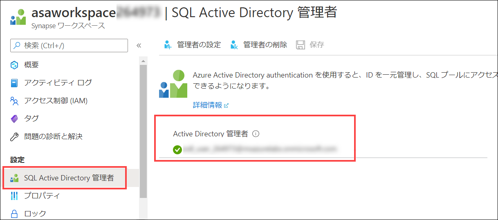

### タスク 2 - IP ファイアウォール規則を管理する

強健なインターネット セキュリティは、あらゆる技術システムの必須要素です。インターネットの脅威ベクターを緩和するひとつの方法が、IP ファイアウォール規則を使用してAzure Synapse Analytics ワークスペースにアクセスできるパブリック IP アドレスの数を減らすことです。その後、Azure Synapse Analytics ワークスペースは、SQL プールと SQL サーバーレス エンドポイントなど、ワークスペースのあらゆるマネージド パブリック エンドポイントに同じ規則を付与します。

1. **Azure Portal** で Synapse ワークスペースを開きます (Studio を起動しないでください)。

2. **Azure Synapse Analytics** ページの左側のメニューで 「**ファイアウォール**」 を選択します。

   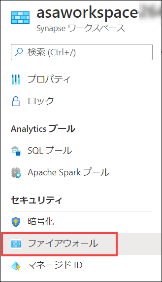

3. `Allow All` の IP ファイアウォール規則がすでにラボ環境で作成されていることがわかります。特定の IP アドレスを追加したい場合は、「**+ クライアント IP の追加**」 をタスクバー メニューで選びます (これは今、実行する必要はありません)。

    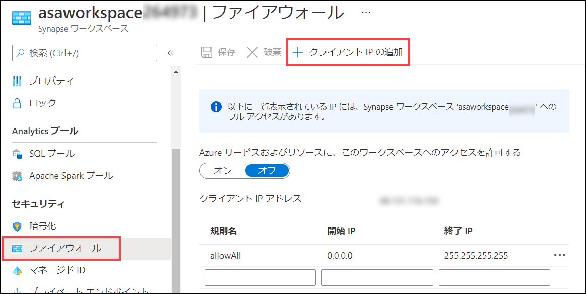

> **注**: ローカル ネットワークから Synapse に接続する際、特定のポートを開く必要があります。Synapse Studio の関数に対応できるよう、送信 TCP ポート 80、443、1143、および UDP ポート 53 が開いていることを確認してください。

## 演習 2 - Azure Synapse Analytics ワークスペースとマネージド サービスを保護する

### タスク 1 - Azure Key Vault を使用してシークレットを管理する

外部データ ソースとサービスへの接続を行う際、パスワードやアクセス キーなどの機密接続情報を適切に扱う必要があります。このような情報は、Azure Key Vault で格納することが推奨されます。Azure Key Vault を使用すると、シークレットを保護できるだけでなく、中心的な事実のソースにもなります。つまり、シークレットの値を更新する必要がある場合 (ストレージ アカウントでアクセス キーのサイクリングを行う場合など)、一か所で変更することができ、このキーを使用するすべてのサービスは即時、新しい値を利用できます。Azure Key Vault は、256 ビット AES 暗号化 (FIPS 140-2 準拠) を利用して透過的に情報を暗号化および復号化します。

1. **Azure Portal** で、このラボのリソース グループを開き、リソースのリストから 「**キー コンテナー**」 リソースを選択します。

    

2. 左側のメニューの 「設定」 で 「**アクセス ポリシー**」 を選択します。

3. 使用している Synapse ワークスペースを表すマネージド サービス ID (MSI) (名前は `asaworkspaceNNNNNN` に類似) がすでに 「アプリケーション」 にリストされており、4 つのシークレット許可があることを確認します。

    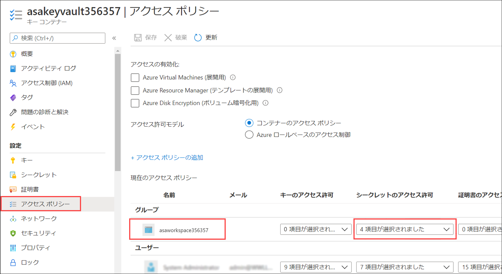

4. `Secret Permissions` (シークレット許可) の `4 selected` (4 つを選択) というドロップダウンを選択し、Get (ワークスペースでキー コンテナーからシークレットの値を取得することが可能) と List (ワークスペースでシークレットを列挙することが可能) が設定されていることを確認します。

### タスク 2 - リンク サービスの作成時にシークレット向けに Azure Key Vault を使用する

リンク サービスは Azure Synapse Analytics の接続文字列の同意語です。Azure Synapse Analytics リンク サービスでは、Azure ストレージ アカウントから Amazon S3 にいたるまで 100 種類近くの外部サービスに接続することが可能です。外部サービスに接続する際は、ほぼ必ず接続情報に関するシークレットが含まれています。このようなシークレットの格納に最適な場所が Azure Key Vault です。Azure Synapse Analytics には、Azure Key Vault からの値を使用してあらゆるリンク サービス接続を構成する機能が備わっています。

リンク サービスで Azure Key Vault を利用するには、まず、リンク サービスとして `asakeyvaultXX` を Azure Synapse Analytics で追加する必要があります。

1. **Azure Synapse Studio** (<https://web.azuresynapse.net/>) に移動し、Azure portal の場合と同じユーザー アカウントを使用してサインインします。

2. 左側のメニューで 「**管理**」 ハブを選択します。

    

3. 「**外部接続**」 で 「**リンク サービス**」 を選択し、キー コンテナーを指すリンク サービスが環境内で提供されていることを確認します。

    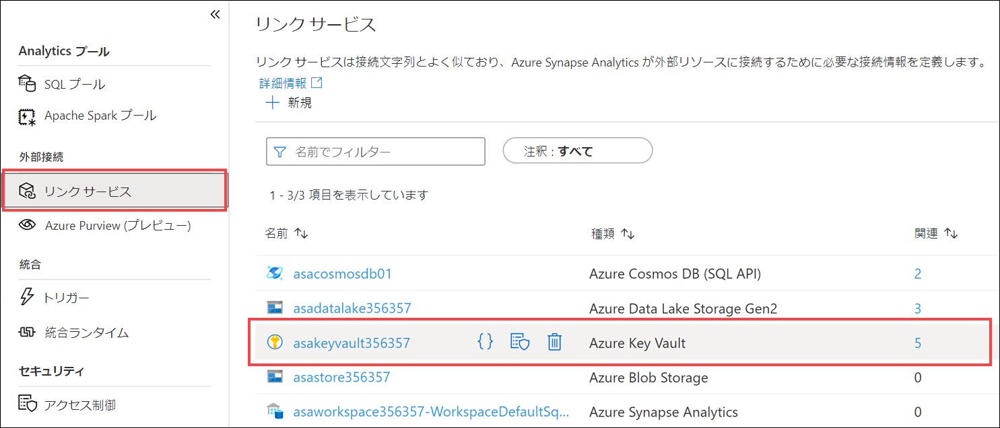

Azure Key Vault はリンク サービスとして設定されているため、新しいリンク サービスを定義する際にこれを活用できます。新しいリンク サービスすべてに、Azure Key Vault からシークレットを取得するオプションが含まれています。フォームでは、Azure Key Vault リンク サービス、シークレット名のほか、オプションでシークレットの特定のバージョンを選択するよう求められます。

### タスク 3 - ワークスペース パイプライン実行を保護する

パイプラインの一部であるシークレットは Azure Key Vault に格納するよう推奨されています。このタスクでは、Web アクティビティを使用し、これらの値を取得してその仕組みを示します。このタスクの 2 番目の部分では、パイプラインで Web アクティビティを使用し、Key Vault からシークレットを取得します。

1. Azure portal に戻ります。

2. `asakeyvaultXX` Azure Key Vault リソースを開き、左側のメニューで 「**シークレット**」 を選択します。上部のツールバーで 「**+ 生成/インポート**」 を選択します。

   

3. シークレットを作成して **PipelineSecret** という名前を付け、**IsNotASecret** の値を割り当てます。「**作成**」 ボタンを選択します。

   

4. 作成したばかりのシークレットを開き、現在のバージョンまで進み、「シークレット ID」 フィールドで値をコピーします。テキスト エディターでこの値を保存するか、クリップボードに維持して今後の手順で使用できるようにします。

    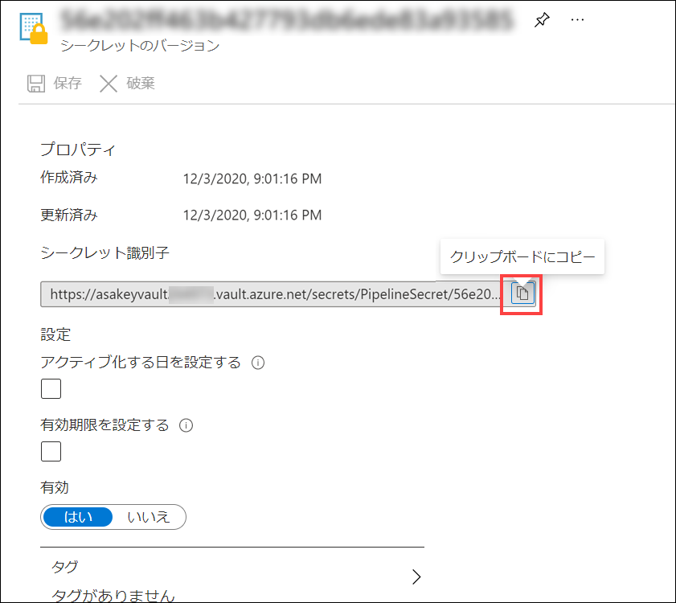

5. Synapse Studio に戻り、左側のメニューで 「**統合**」 ハブを選択します。

    

6. 「**統合**」 ブレードで **+** ボタンを選択し、新しい**パイプライン**を追加します。

    

7. 「**パイプライン**」 タブの 「**アクティビティ**」 ペインで 「**Web**」 を検索し、**Web** アクティビティのインスタンスを設計エリアにドラッグします。

    ![「アクティビティ」 ペインで検索フィールドに「Web」と入力されています。「全般」 で検索結果に Web アクティビティが表示されています。矢印は、パイプラインのデザイン領域へのアクティビティのドラッグ アンド ドロップの動きを示しています。Web アクティビティは、デザイン領域に表示されています。」(media/lab5_pipelinewebactivitynew.png)

8. **Web1** Web アクティビティを選択し、「**設定**」 タブを選択します。以下のようにフォームに入力します。

    1. **URL**: 上記の手順 4 でコピーしたキー コンテナー シークレット ID を貼り付け、`?api-version=7.0` をこの値の最後に**追加**します。たとえば、次のようになります。`https://asakeyvaultNNNNN.vault.azure.net/secrets/PipelineSecret/f808d4fa99d84861872010f6c8d25c68?api-version=7.0`
  
    2. **メソッド**: 「**Get**」 を選択します。

    3. 「**詳細**」 セクションを展開し、「**認証**」 で 「**MSI**」 を選択します。Synapse ワークスペースのマネージド サービス ID 向けのアクセス ポリシーはすでに確立されています。つまり、パイプライン アクティビティには、HTTP 呼び出しでキー コンテナーにアクセスする許可があります。
  
    4. **リソース**: **<Https://vault.azure.net>** を入力します

    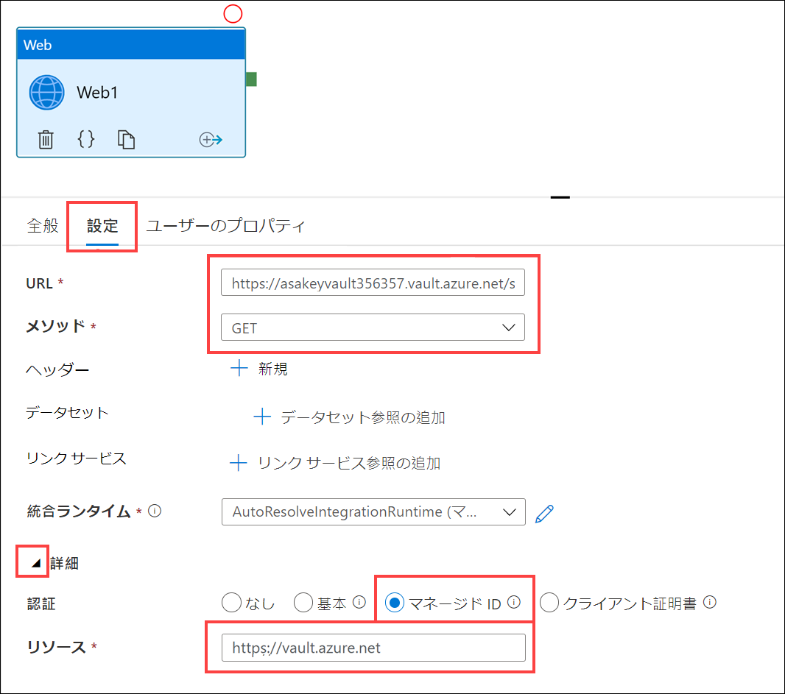

9. 「アクティビティ」 ペインで 「**変数の設定**」 アクティビティをパイプラインのデザイン領域に追加します。

    

10. パイプラインのデザイン領域で 「**Web1**」 アクティビティを選択し、「**成功**」 アクティビティのパイプライン接続 (緑色のボックス) を 「**変数1 の設定**」 アクティビティにドラッグします。

11. デザイナーで選択したパイプラインを選択した状態で (どちらのアクティビティも選択されていない場合など)、「**変数**」 タブを選択し、**SecretValue** という名前の新しい**文字列**パラメーターを追加します。

      

13. ツールバー メニューで 「**デバッグ**」 を選択してパイプラインのデバッグを行います。実行時には、パイプラインの 「**出力**」 タブで両方のアクティビティの入力と出力を確認します。

    

    

    > **注**: 「**Web1**」 アクティビティで、「**全般**」 タブには 「**セキュリティで保護された出力**」 チェックボックスがあります。これがチェックされていると、シークレット値がプレーン テキストでログされることを防ぎます。たとえば、パイプライン実行で、キー コンテナーから取得した実際の値の代わりにマスキングされた値 が表示されます。この値を使用するアクティビティでは、「**セキュリティで保護された入力**」 チェックボックスもチェックされています。

### タスク 4 - Azure Synapse Analytics 専用 SQL プールを保護する

Transparent Data Encryption (TDE) は SQL サーバーの機能で、保存中のデータ (データベース、ログ ファイル、バックアップなど) の暗号化と復号化を行います。Synapse Analytics 専用 SQL プールでこの機能を使用する場合は、プールによって提要された組み込み対象データベース暗号化キー (DEK) を使用します。TDE を使用すると、格納されているデータがすべてディスクで暗号化されます。データを要請すると、TDE がこのデータをページ レベルで復号化します (メモリに読み込まれているため)。また、ディスクに再び書き込む前にメモリ内のデータを暗号化します。名前と同様、これは透過的に行われ、アプリケーション コードには影響しません。Synapse Analytics を介して専用 SQL プールを作成する際、Transparent Data Encryption は有効ではありません。このタスクの最初の部分には、この機能を有効にする方法が示されます。

1. **Azure Portal** でリソース グループを開き、`SqlPool01` 専用 SQL プール リソースを見つけて開きます。

    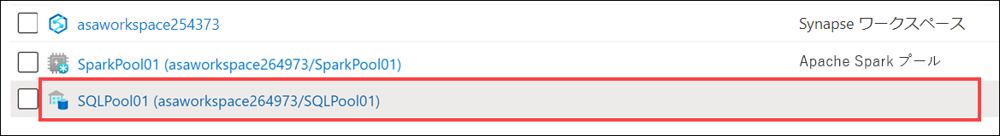

2. 「**SQL プール**」 リソース画面で左側のメニューから 「**Transparent data encryption**」 を選択します。データ暗号化は**有効にしない**でください。

   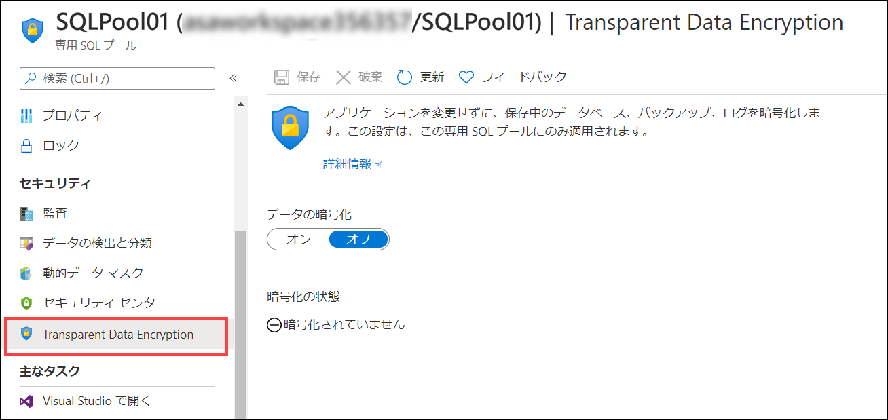

    既定で、このオプションはオフになっています。この専用 SQL プールでデータ暗号化を有効にすると、TDE が適用される間、プールは数分間、オフラインになります。

## 演習 3 - Azure Synapse Analytics ワークスペース データを保護する

### タスク 1 - 列 レベルのセキュリティ

機密情報を保持しているデータ列を特定することが重要です。機密の種類は、社会保障番号、メール アドレス、クレジットカード番号、財務合計などです。Azure Synapse Analytics では、許可を定義し、ユーザーまたはロールが特定の列の権限を選択することを防ぎます。

1. **Azure Synapse Studio** で左側のメニューから 「**開発**」 を選択します。

   

2. 「**開発**」 メニューで 「**SQL スクリプト**」 セクションを展開し、「**ラボ 05 - 演習 3 - 列レベルのセキュリティ**」 を選択します。

   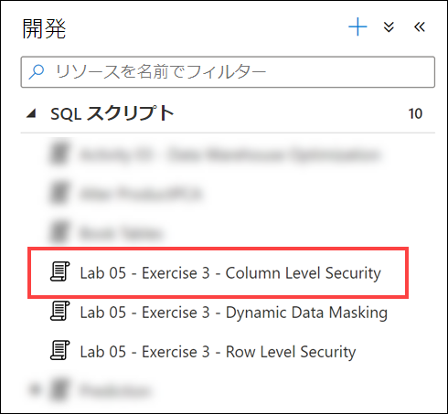

3. ツールバー メニューで、クエリ `SQLPool01` を実行したいデータベースに接続します。

    

4. クエリ ウィンドウで、ステップのステートメントを強調表示し、ツールバーから 「**実行**」 ボタンを選択して**各ステップを個々に実行**します。

   

5. これで 「スクリプト」 タブを閉じることができます。プロンプトで指示されたら 「**すべての変更を破棄**」 を選択します。

### タスク 2 - 行レベルのセキュリティ

1. **Azure Synapse Studio** で左側のメニューから 「**開発**」 を選択します。

   

2. 「**開発**」 メニューで 「**SQL スクリプト**」 セクションを展開し、「**ラボ 05 - 演習 3 - 行レベルのセキュリティ**」 を選択します。

    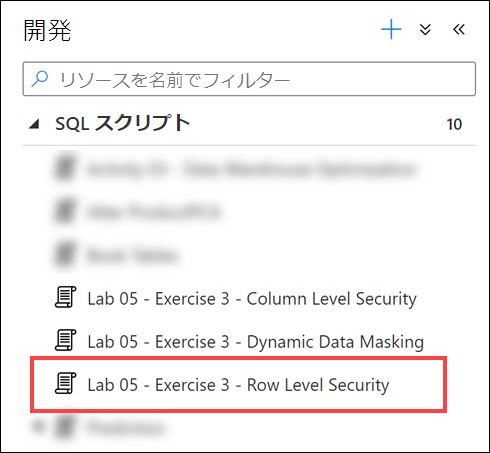

3. ツールバー メニューで、クエリ `SQLPool01` を実行したいデータベースに接続します。

    

4. クエリ ウィンドウで、ステップのステートメントを強調表示し、ツールバーから 「**実行**」 ボタンを選択して**各ステップを個々に実行**します。

   

5. これで 「スクリプト」 タブを閉じることができます。プロンプトで指示されたら 「**すべての変更を破棄**」 を選択します。

### タスク 3 - 動的データ マスク

1. **Azure Synapse Studio** で左側のメニューから 「**開発**」 を選択します。

   

2. 「**開発**」 メニューで 「**SQL スクリプト**」 セクションを展開し、「**ラボ 05 - 演習 3 - 動的データ マスク**」 を選択します。
  
   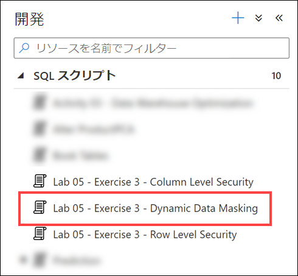

3. ツールバー メニューで、クエリ `SQLPool01` を実行したいデータベースに接続します。

    

4. クエリ ウィンドウで、ステップのステートメントを強調表示し、ツールバーから 「**実行**」 ボタンを選択して**各ステップを個々に実行**します。

   

5. これで 「スクリプト」 タブを閉じることができます。プロンプトで指示されたら 「**すべての変更を破棄**」 を選択します。

## 照会

- [IP ファイアウォール](https://docs.microsoft.com/azure/synapse-analytics/security/synapse-workspace-ip-firewall)
- [Synapse ワークスペース マネージド ID](https://docs.microsoft.com/azure/synapse-analytics/security/synapse-workspace-managed-identity)
- [Synapse マネージド VNet](https://docs.microsoft.com/azure/synapse-analytics/security/synapse-workspace-managed-vnet)
- [Synapse マネージド プライベート エンドポイント](https://docs.microsoft.com/azure/synapse-analytics/security/synapse-workspace-managed-private-endpoints)
- [Synapse ワークスペースのセキュリティ保護](https://docs.microsoft.com/azure/synapse-analytics/security/how-to-set-up-access-control)
- [プライベート リンクを使用して Synapse ワークスペースに接続する](https://docs.microsoft.com/azure/synapse-analytics/security/how-to-connect-to-workspace-with-private-links)
- [データ ソースへのマネージド プライベート エンドポイントを作成する](https://docs.microsoft.com/azure/synapse-analytics/security/how-to-create-managed-private-endpoints)
- [ワークスペースのマネージド ID にアクセス許可を付与する](https://docs.microsoft.com/azure/synapse-analytics/security/how-to-grant-workspace-managed-identity-permissions)

## その他のリソース

- [ワークスペース、データ、およびパイプラインへのアクセスを管理する](https://docs.microsoft.com/azure/synapse-analytics/sql/access-control)
- [Apache Spark を使用して分析を行う](https://docs.microsoft.com/azure/synapse-analytics/get-started-analyze-spark)
- [Power BI でデータを視覚化する](https://docs.microsoft.com/azure/synapse-analytics/get-started-visualize-power-bi)
- [SQL オンデマンドのストレージ アカウント アクセスを制御する](https://docs.microsoft.com/azure/synapse-analytics/sql/develop-storage-files-storage-access-control)
