# モジュール 14 - Stream Analytics によるリアルタイムのストリーム処理

このモジュールでは、Azure Stream Analytics を使用してストリーミング データを処理する方法を学習します。車両のテレメトリ データを Event Hubs に取り込んだ後、Azure Stream Analytics のさまざまなウィンドウ化関数を使用してリアルタイムでそのデータを処理します。データは Azure Synapse Analytics に出力されます。最後に、スループットを増やすために Stream Analytics ジョブのスケーリングを行う方法を学びます。

このモジュールでは、次のことができるようになります。

- Stream Analytics を使用して Event Hubs からリアルタイムのデータを処理する
- Stream Analytics ウィンドウ化関数を使用して、集計と Synapse Analytics への出力を構築する
- Azure Stream Analytics ジョブをスケーリングし、パーティション分割によってスループットを増やす
- ストリーム入力の分割をやり直し、並列処理を最適化する

## ラボの詳細

- [モジュール 14 - Stream Analytics によるリアルタイムのストリーム処理](#module-14---real-time-stream-processing-with-stream-analytics)
  - [ラボの詳細](#lab-details)
  - [テクノロジの概要](#technology-overview)
    - [Azure Stream Analytics](#azure-stream-analytics)
    - [Azure Event Hubs](#azure-event-hubs)
    - [Power BI](#power-bi)
  - [シナリオの概要](#scenario-overview)
  - [ラボの構成と前提条件](#lab-setup-and-pre-requisites)
  - [演習 1: サービスを構成する](#exercise-1-configure-services)
    - [タスク 1: Event Hubs を構成する](#task-1-configure-event-hubs)
    - [タスク 2:  Synapse Analytics を構成する](#task-2-configure-synapse-analytics)
    - [タスク 3: Stream Analytics を構成する](#task-3-configure-stream-analytics)
  - [演習 2: データを生成して視覚化する](#exercise-2-generate-and-visualize-data)
    - [タスク 1: データ ジェネレーターを実行する](#task-1-run-data-generator)
    - [タスク 2: Power BI  ダッシュボードを作成する](#task-2-create-power-bi-dashboard)
    - [タスク 3: synapse Analytics で集計データを表示する](#task-3-view-aggregate-data-in-synapse-analytics)

## テクノロジの概要

### Azure Stream Analytics

接続されているさまざまなデバイスやセンサーから生成されるデータ量の増加に伴い、現在、ほぼリアルタイムでこのデータを使用可能な分析情報と予測に変換することが運用で必要になってきています。[Azure Stream Analytics](https://docs.microsoft.com/azure/stream-analytics/stream-analytics-introduction) は、お使いになっているリアルタイムのアプリケーション アーキテクチャとシームレスに統合し、量に関わりなくデータに関するリアルタイムの強力な分析を可能にします。

Azure Stream Analytics を使用すると、超並列型の複雑なイベント処理 (CEP) パイプラインを容易に作成できます。一時的なロジックのサポートが組み込まれた非常にシンプルな宣言型の [SQL に類似した言語](https://docs.microsoft.com/stream-analytics-query/stream-analytics-query-language-reference)を使用して協力なリアルタイムの強力な分析ソリューションを作成できます。広範な[既定のコネクタ](https://docs.microsoft.com/azure/stream-analytics/stream-analytics-define-outputs)、高度なデバッグ、ジョブ管理機能により、開発者に必要なスキルを大幅に減らす一方、コストを抑えられます。さらに、Azure Stream Analytics は高度な拡張性を備え、[JavaScript ユーザー定義関数](https://docs.microsoft.com/azure/stream-analytics/stream-analytics-javascript-user-defined-functions)によるカスタム コードに対応しており、SQL に書き込まれたストリーミング ロジックをさらに延長できます。

Azure Stream Analytics では、懸念すべきインフラストラクチャや、管理の必要なサーバー、仮想マシン、クラスターはないので、あっという間に使い始められます。どのようなジョブでも、ひとつのストリーミング ユニットから数百にいたるまで、[処理能力を即時スケールアウト](https://docs.microsoft.com/azure/stream-analytics/stream-analytics-streaming-unit-consumption)できます。料金は、ジョブ 1 件辺りに使用した処理量に応じて発生します。

[保証付きのイベント 配信](https://docs.microsoft.com/stream-analytics-query/event-delivery-guarantees-azure-stream-analytics)とエンタープライズ レベルの SLA により、3 つの「9」を利用でき、ミッション クリティカルなワークロードに Azure Stream Analytics が適していることを確認できます。自動チェックポイントを備えているため、フォールト トレラントな操作が可能で、データを損失することなく、すぐに再起動できます。

Azure Stream Analytics では、ライブ コマンドと制御ビューでPower BI を使用してリアルタイムのダッシュボードをすばやく構築できます。[リアルタイムのダッシュボード」(https://docs.microsoft.com/azure/stream-analytics/stream-analytics-power-bi-dashboard)は、ライブ データを対応可能で情報満載の視覚資料に変換し、最も重要なことに注力する上で役立ちます。

### Azure Event Hubs

[Azure Event Hubs](https://docs.microsoft.com/azure/event-hubs/event-hubs-about) は、毎秒数百万のイベントを取り込むことのできるビッグ データ パイプラインです。HTTPS、AMQP、AMQP のような標準プロトコルを WebSocket や Kafka で使用し、テレメトリおよびイベント ストリーム データのキャプチャ、保持、再生を促します。データは多数の同時ソースからもたらされる可能性があり、最大 20 のコンシューマー グループが独自のペースで独立してアプリケーションを使い、イベント ハブ全体を読み取ることができます。

### Power BI

[Power BI](https://docs.microsoft.com/power-bi/) はビジネス分析サービスで、情報に基づく迅速な意思決定を可能にする分析情報を提供します。データをすばらしいビジュアルに変換し、どのようなデバイスでも同僚と共有できます。Power BI には、視覚的に[データを探索して分析](https://docs.microsoft.com/power-bi/service-basic-concepts)できる充実したキャンバスが備えらえています。カスタマイズされた[ダッシュボード](https://docs.microsoft.com/azure/stream-analytics/stream-analytics-power-bi-dashboard)とインタラクティブなレポートを共有して協力できれば、組み込みガバナンスおよびセキュリティにより組織全体でスケーリングを行えるようになります。

## シナリオの概要

Contoso Auto は車両テレメトリを収集しており、Event Hubs を利用して迅速にデータを取り込み、生データとして格納し、ほぼリアルタイムで何らかの処理を行いたいと考えています。最終的には、処理後の新しいデータを受信して自動的に更新されるダッシュボードの作成を希望しています。このダッシュボードには、エンジンの加熱や異常な油圧、攻撃的な運転など検出された異常を示すさまざまな可視化機能を備えることを望んでいます。都市に関する異常を示すマップや、この情報を明確に表す多様なグラフなどのコンポーネントを使用できます。

ここでは、Azure Event Hubs を使用し、Event Hubs、Azure Stream Analytics、Power BI に基づいて構築されたほぼリアルタイムの分析パイプラインの入り口としててストリーミング車両テレメトリ データを取り込みます。Azure Stream Analytics は Event Hubs から車両センサー データを抽出し、特定の時間枠で集計を行い、データの視覚化と分析を行えるように集計データを Azure Synapse Analytics と Power BI に送信します。車両テレメトリ データ ジェネレーターを使用して、車両テレメトリ データを Event Hubs に送信します。

## ラボの構成と前提条件

> **注:** ホストされたラボ環境を**使用しておらず**、ご自分の Azure サブスクリプションを使用している場合は、`Lab setup and pre-requisites` の手順のみを完了してください。その他の場合は、演習 1 にスキップします。

- Azure サブスクリプション
- Power BI アカウント (<https://powerbi.microsoft.com> でサインアップ)
- [ラボ環境のセットアップ](https://github.com/solliancenet/microsoft-data-engineering-ilt-deploy/tree/main/setup/14)

## 演習 1: サービスを構成する

### タスク 1: Event Hubs を構成する

Azure Event Hubs はビッグ データ ストリーミング プラットフォームであり、毎秒数百万のイベントを受け取って処理できるイベント インジェスト サービスです。これを使用して、処理が行われ、リアルタイムのダッシュボードへの送信準備ができている車両テレメトリ データを一時的に格納します。データは Event Hubs に移されるため、Azure Stream Analytics はデータのクエリを行い、集計を適用して異常にタグを付け、Azure Synapse Analytics と Power BI に送信します。

このタスクでは、提供された Event Hubs 名前空間内で新しいイベント ハブを作成して構成します。これを使用して、処理後の車両テレメトリを捕捉し、後ほど作成する Azure 関数で強化します。

1. [Azure portal](https://portal.azure.com) に移動します。

2. 左側のメニューから、「**リソース グループ**」 を選択します。その後、**ms-dataengineering-14** という名前のリソース グループを選択します。

3. リソース グループ内のリソース リストから 「**Event Hubs 名前空間**」 (`eventhubYOUR_UNIQUE_ID`) を選択します。

    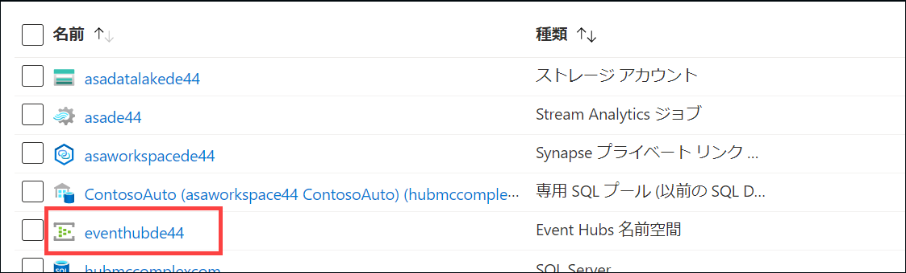

4. 「Event Hubs 名前空間」 ブレードで、左側のメニューから 「**Event Hubs**」 を選択します。

    

5. リストから**テレメトリ** イベント ハブを選択します。

    

6. 左側のメニューで 「**共有アクセス ポリシー**」 を選択します。

    

7. 最上部のツールバーで 「**+ 追加**」 を選択し、新しい共有アクセス ポリシーを作成します。

    

8. 「**SAS ポリシーの追加**」 ブレードで以下のように構成します。

    - **名前:** "Read" と入力します。
    - **マネージド:** オフにします。
    - **送信:** オフにします。
    - **リッスン:** チェックします。

    

    > イベントの読み取り、書き込み、管理で別個のポリシーを作成するのがベスト プラクティスです。サービスとアプリケーションが許可のない操作を行うことを防ぐため、裁定権限の原則に従います。

9. 値の入力が終わったら、フォームの最下部で 「**作成**」 を選択します。

10. 最上部のツールバーで 「**+ 追加**」 を選択し、新しい共有アクセス ポリシーを作成します。

    

11. 「**SAS ポリシーの追加**」 ブレードで以下のように構成します。

    - **名前:** "Write" と入力します。
    - **マネージド:** オフにします。
    - **送信:** チェックします。
    - **リッスン:** オフにします。

    

12. 値の入力が終わったら、フォームの最下部で 「**作成**」 を選択します。

13. リストからご自分の**書き込み**ポリシーを選択します。フィールドの右側で 「コピー」 ボタンを選択して、「**接続文字列 - 主キー**」 の値をコピーします。メモ帳や他のテキスト エディターに**この値を保存**して、後ほど使えるようにします。

    

### タスク 2: Synapse Analytics を構成する

Azure Synapse はエンドツーエンドの分析プラットフォームで、SQL データ ウェアハウス、ビッグ データ分析、単一の環境へのデータ統合を組み合わせます。ユーザーは、あらゆるデータにすばやくアクセスして分析情報を得られるので、業界で比類のない新しいレベルのパフォーマンスとスケーリングが可能です。

このタスクでは、Synapse 専用 SQL プールでテーブルを作成し、Stream Analytics ジョブ (Event Hubs で取り込まれた車両テレメトリを処理) によって提供された集計車両データを格納します。

1. [Azure portal](https://portal.azure.com) に移動します。

2. 左側のメニューから、「**リソース グループ**」 を選択します。その後、**ms-dataengineering-14** という名前のリソース グループを選択します。

3. リソース グループ内のリソース リストから 「**Synapse ワークスペース**」  (`asaworkspaceYOUR_UNIQUE_ID`) を選択します。

    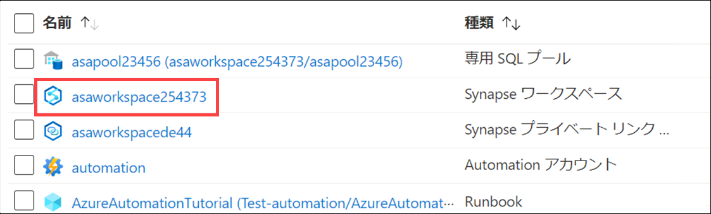

4. 「概要」 ペイン内の 「**Synapse Studio を開く**」 ボックスで 「**開く**」 を選択します。

    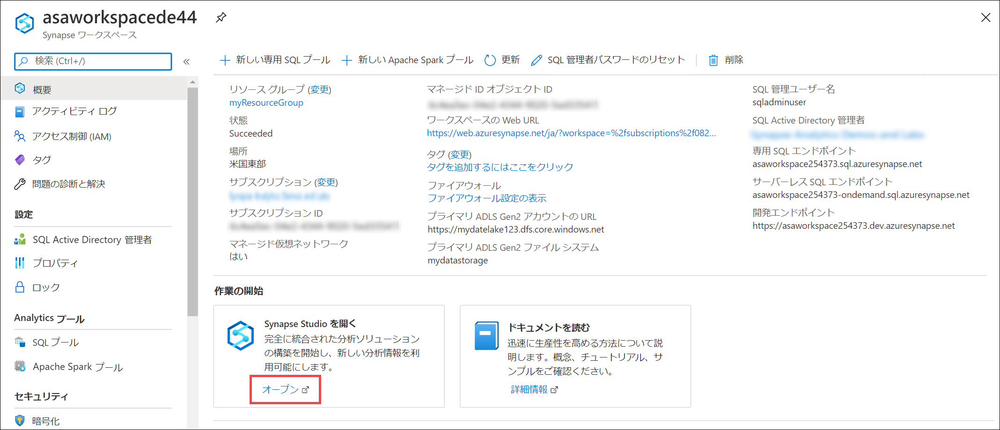

5. Synapse Studio で左側のメニューにある 「**データ**」 を選択して、「データ」 ハブに移動します。

    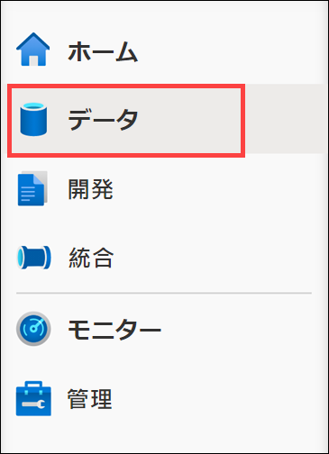

6. 「**ワークスペース**」 タブ **(1)** を選択し、データベースを展開して 「**ContosoAuto**」 (2) を右クリックします。「**新しい SQL スクリプト**」 (3) を選択してから 「**空のスクリプト**」 (4) を選択します。

    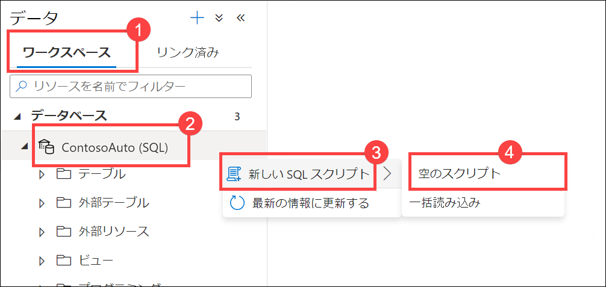

7. スクリプトが `ContosoAuto` に接続されていることを確認し、スクリプトを次のように置き換えて 「**実行**] を選択し、新しいテーブルを作成します。

    ```sql
    CREATE TABLE dbo.VehicleAverages
    ( 
        [AverageEngineTemperature] [float] NOT  NULL,
        [AverageSpeed] [float] NOT  NULL,
        [Snapshot] [datetime] NOT  NULL
    )
    WITH
    (
        DISTRIBUTION = ROUND_ROBIN,
        CLUSTERED COLUMNSTORE INDEX
    )
    GO
    ```

    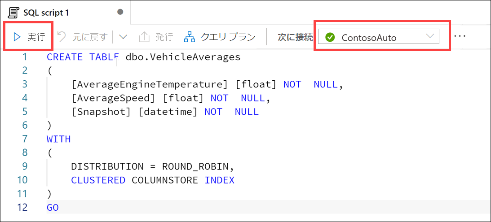

### タスク 3: Stream Analytics を構成する

Azure Stream Analytics は、デバイスからの大量のデータ ストリームを分析することができるイベント処理エンジンです。受信データは、デバイス、センサー、Web サイト、ソーシャル メディア フィード、アプリケーションなどから得ることができます。また、データ ストリームから情報を抽出し、パターンや関係を把握することもできます。これらのパターンを使用して、アラートの作成、レポート ツールへの情報のフィード、後で使用するための情報の保存など、別のアクションをダウンストリームでトリガーすることができます。

このタスクでは、Stream Analytics を構成し、作成済みのイベント ハブをソースとして使用し、そのデータのクエリと分析を行い、報告用に Power BI に送信して、集計データを Azure Synapse Analytics に送れるようにします。

1. [Azure portal](https://portal.azure.com) に移動します。

2. 左側のメニューから、「**リソース グループ**」 を選択します。その後、**ms-dataengineering-14** という名前のリソース グループを選択します。

3. リソース グループのリソース リストで 「**Stream Analytics ジョブ**」 (`asaYOUR_UNIQUE_ID`) を選択します。

    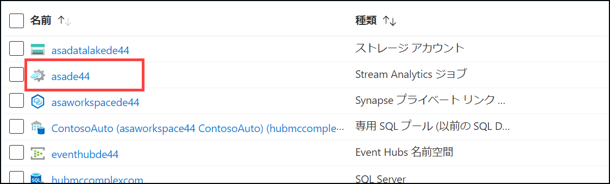

4. Stream Analytics ジョブ内で左側のメニューから 「**ストレージ アカウント設定**」 を選択し、「**ストレージ アカウントの設定**」 を選択します。出力のひとつとして Synapse Analytics を使用するので、まず、ジョブ ストレージ アカウントを構成する必要があります。

    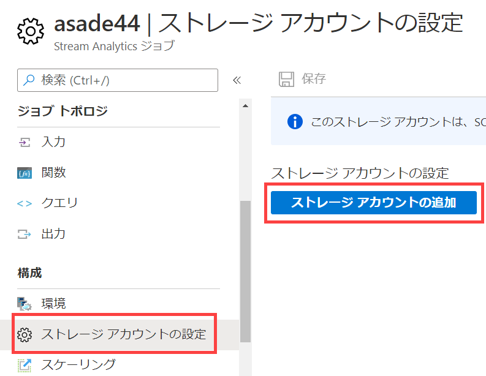

5. 「**ストレージ アカウント設定**」 フォームで次のように構成します。

   - **サブスクリプションからストレージ アカウントを選択する:** 選択します。
   - **サブスクリプション:** このラボで使用するサブスクリプションが選択されていることを確認します。
   - **ストレージ アカウント:** **asadatalakeYOUR_UNIQUE_ID** という名前のストレージ アカウントを選択します。
   - **認証モード:** 「接続文字列」 を選択します。

   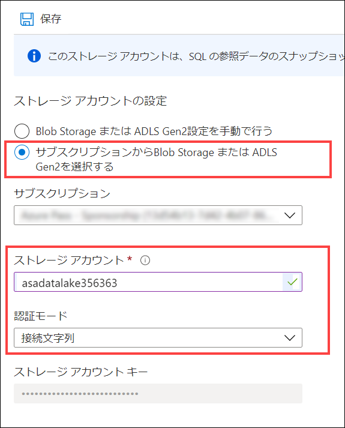

6. 「**保存**」 を選択した後、プロンプトで指示されたら 「**はい**」 を選択し、ストレージ アカウントの設定を保存します。

7. Stream Analytics ジョブの左側のメニューで 「**入力**」 を選択します。

    

8. 最上部のツールバーで 「**+ ストリーム入力を追加**」 を選択してから 「**イベント ハブ**」 を選択し、新しいイベント ハブ入力を作成します。

    

9. 「**新しい入力**」 ブレードで次のように構成します。

    - **名前:** "eventhub" と入力します。
    - **サブスクリプションからイベント ハブを選択する: ** 選択します。
    - **サブスクリプション:** このラボで使用するサブスクリプションが選択されていることを確認します。
    - **イベント ハブの名前空間:** このラボで使用しているイベント ハブの名前空間を選択します。
    - **イベント ハブ名:** 「**既存のものを使用**」 を選択し、先ほど作成した**テレメトリ**を選択します。
    - **イベント ハブ コンシューマー グループ:** 「**既存のものを使用**」 を選択してから、「**$Default**」 を選択します。
    - **認証モード:** 「**接続文字列**」 を選択します。
    - **イベント ハブ ポリシー名:** 「**既存のものを使用**」 を選択してから、「**読み取り**」 を選択します。
    - その他の値はすべて、既定のままにします。

    

10. 値の入力が終わったら、フォームの最下部で 「**保存**」 を選択します。

11. Stream Analytics ジョブ ブレードの左側のメニューで 「**出力**」 を選択します。

    

12. 最上部のツールバーで 「**+ 追加**」 を選択してから 「**Power BI**」 を選択し、新しい Power BI 出力を作成します。

    

13. 「**新しい出力**」 ブレードで 「**承認**」 ボタンを選択して、Stream Analytics から Power BI アカウントへの接続を承認します。

    

14. プロンプトで指示されたら Power BI アカウントにサインインします。ユーザー名とパスワードは、Azure Portal へのログインで使用したものと同じです。

    

15. Power BI アカウントにサインインした後、「新しい出力」 ブレードが更新され、あなたが現在承認されていることを示します。

    

16. 「**新しい出力**」 ブレードで次のように構成します。

    - **出力エイリアス:** "powerBIAlerts" と入力します。
    - **認証モード:** 「ユーザー トークン」 を選択します。
    - **グループ ワークスペース:** 「マイ ワークスペース」 を選択します (このオプションが表示されない場合は、最初に 「ユーザー トークン」 認証モードを選択します)。
    - **データセット名:** "ContosoAutoVehicleAnomalies" と入力します。
    - **テーブル名:** "Alerts" と入力します。

    

17. 値の入力が終わったら、フォームの最下部で 「**保存**」 を選択します。

18. 最上部のツールバーで 「**+ 追加**」 を選択してから 「**Azure Synapse Analytics (旧称 SQL DW)**」 を選択し、新しい Synapse Analytics 出力を作成します。

    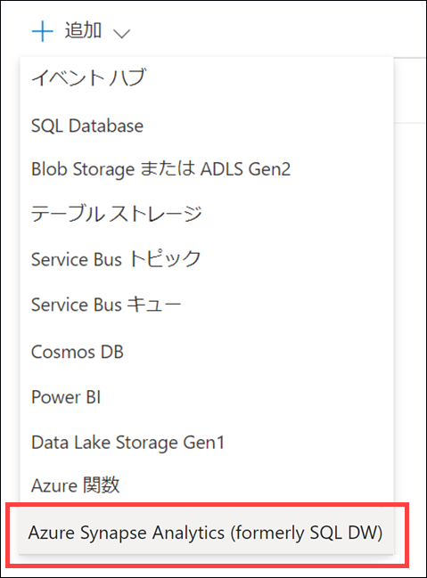

19. 「**新しい出力**」 ブレードで次のように構成します。

    - **出力エイリアス:** "synapse" と入力します。
    - **サブスクリプションから Azure Synapse Analytics を選択する:** 選択します。
    - **サブスクリプション:** このラボで使用しているサブスクリプションを選択します。
    - **データベース:** "ContosoAuto" を選択します。適正な Synapse ワークスペース名が 「サーバー名」 に表示されていることを確認します。
    - **表:** `dbo.VehicleAverages` と入力します。
    - **認証モード:** 「接続文字列」 を選択します。
    - **ユーザー名:** `asa.sql.admin` と入力します。
    - **パスワード:** ラボ環境を展開する際に入力した SQL 管理者のパスワードを入力します。

    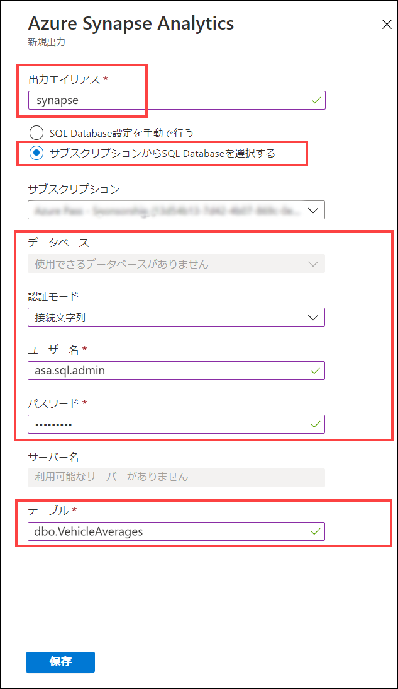

20. 値の入力が終わったら、フォームの最下部で 「**保存**」 を選択します。

21. Stream Analytics ジョブ ブレードの左側のメニューで 「**クエリ**」 を選択します。

    

22. **クエリ**編集ウィンドウをクリアして、そこに以下を貼り付けます。

    ```sql
    WITH
        Averages AS (
        select
            AVG(engineTemperature) averageEngineTemperature,
            AVG(speed) averageSpeed
        FROM
            eventhub TIMESTAMP BY [timestamp]
        GROUP BY
            TumblingWindow(Duration(second, 2))
    ),
    Anomalies AS (
        select
            t.vin,
            t.[timestamp],
            t.city,
            t.region,
            t.outsideTemperature,
            t.engineTemperature,
            a.averageEngineTemperature,
            t.speed,
            a.averageSpeed,
            t.fuel,
            t.engineoil,
            t.tirepressure,
            t.odometer,
            t.accelerator_pedal_position,
            t.parking_brake_status,
            t.headlamp_status,
            t.brake_pedal_status,
            t.transmission_gear_position,
            t.ignition_status,
            t.windshield_wiper_status,
            t.abs,
            (case when a.averageEngineTemperature >= 405 OR a.averageEngineTemperature <= 15 then 1 else 0 end) as enginetempanomaly,
            (case when t.engineoil <= 1 then 1 else 0 end) as oilanomaly,
            (case when (t.transmission_gear_position = 'first' OR
                t.transmission_gear_position = 'second' OR
                t.transmission_gear_position = 'third') AND
                t.brake_pedal_status = 1 AND
                t.accelerator_pedal_position >= 90 AND
                a.averageSpeed >= 55 then 1 else 0 end) as aggressivedriving
        from eventhub t TIMESTAMP BY [timestamp]
        INNER JOIN Averages a ON DATEDIFF(second, t, a) BETWEEN 0 And 2
    ),
    VehicleAverages AS (
        select
            AVG(engineTemperature) averageEngineTemperature,
            AVG(speed) averageSpeed,
            System.TimeStamp() as snapshot
        FROM
            eventhub TIMESTAMP BY [timestamp]
        GROUP BY
            TumblingWindow(Duration(minute, 2))
    )
    -- INSERT INTO POWER BI
    SELECT
        *
    INTO
        powerBIAlerts
    FROM
        Anomalies
    where aggressivedriving = 1 OR enginetempanomaly = 1 OR oilanomaly = 1
    -- INSERT INTO SYNAPSE ANALYTICS
    SELECT
        *
    INTO
        synapse
    FROM
        VehicleAverages
    ```

    

    クエリは 2 秒間のエンジン温度と速度を平均化します。その後、あらゆるテレメトリ データ (前のステップの平均値など) を選択し、以下の異常を新しいフィールドとして指定します。

    a. **enginetempanomaly**: 平均エンジン温度が 405 度以上または 15 度以下の場合。

    b. **oilanomaly**: エンジン オイルが 1 以下の場合。

    c. **aggressivedriving**: トランスミッション ギヤの位置がファースト、セカンド、またはサードで、ブレーキ ペダルのステータスが 1、アクセル ペダルの位置が 90 以上、平均速度が 55 以上の場合。

    このクエリは、異常ステップのあらゆるフィールドが `powerBIAlerts` に出力されます (報告用の aggressivedriving = 1 または enginetempanomaly = 1 または oilanomaly = 1 の場合)。このクエリは、`TumblingWindow(Duration(minute, 2))` を使用して過去 2 分間のあらゆる車両の平均エンジン温度および速度を集計し、これらのフィールドを `synapse` に出力します。

23. クエリの更新が終了したら、最上部のツールバーで 「**クエリの保存**」 を選択します。

24. Stream Analytics ジョブ ブレードの左側のメニューで 「**概要**」 を選択します。「概要」 ブレードの上で 「**開始**」 を選択します。

    

25. 表示された 「ジョブの開始」 ブレードで、ジョブ出力開始時間の 「**今すぐ**」 を選択してから 「**開始**」 を選択します。これにより Stream Analytics ジョブが始まるので、後ほどイベントを処理して Power BI に送信する準備ができます。

    

## 演習 2: データを生成して視覚化する

### タスク 1: データ ジェネレーターを実行する

データ ジェネレーターのコンソール アプリケーションが車両 (車両識別番号 (VIN) で表示) の配列向けにシミュレートされた車両センサー テレメトリを作成し、直接 Event Hubs に送信します。そのためには、まず、イベント ハブ接続文字列を使用して構成する必要があります。

このタスクでは、データ ジェネレーターを構成して実行します。データ ジェネレーターはシミュレートされた車両テレメトリ データを Event Hubs に保存します。これにより、Stream Analytics ジョブは強化されたデータを集計して分析し、Power BI と Synapse Analytics に送信します。最後のステップは、その後のタスクで Power BI レポートを作成することです。

1. ラボの VM またはコンピューターで、[TransactionGeneratorExecutable.zip](https://solliancepublicdata.blob.core.windows.net/dataengineering/dp-203/TransactionGeneratorExecutable.zip) ファイルをダウンロードします。

2. コンピューターにこの zip ファイルを抽出し、抽出した場所を書き留めておきます。

3. 抽出されたファイルが含まれているフォルダーを開き、お使いになっている環境に応じて `linux-x64`、`osx-x64`、または `win-x64` サブフォルダーを開きます。

4. 適切なサブフォルダー内で **appsettings.json** ファイルを開きます。`EVENT_HUB_CONNECTION_STRING` の隣に `telemetry` イベント ハブ接続文字列の値を貼り付けます。以下のように値のまわりには必ず引用符 ("") を使用してください。ファイルを**保存**します。

    

    `SECONDS_TO_LEAD` は、車両テレメトリ データを送信する前に待つ時間です。既定値は `0` です。

    `SECONDS_TO_RUN` は、データの送信を止めるまでジェネレーターを実行できる最大時間です。既定値は `1800` です。ジェネレーターの実行中に Ctrl+C を押すか、ウィンドウを閉じて、データの送信を止めることもできます。

5. お使いになっているプラットフォームに基づき、以下のいずれかのメソッドを使用してデータ ジェネレーターを実行します。

   1. Windows:

      * `win-x64` フォルダー内で **DataGenerator.exe** を実行します。

   2. Linux:

      * `linux-x64` フォルダーに移動します。
      * `chmod 777 DataGenerator` を実行して、バイナリへのアクセスを提供します。
      * `./DataGenerator` を実行します。

   3. MacOS:

      * 新しいターミナルを開きます。
      * `osx-x64` ディレクトリに移動します。
      * `./DataGenerator` を実行します。

6.  新しいコンソール ウィンドウが開き、数秒後にデータの送信が始まるはずです。Event Hubs にデータが送信されるようになったら、ウィンドウを_最小化_して背景で実行中のままにします。

    

    500 件の記録の送信が要求されるたびに、出力統計情報が表示されます。

### タスク 2: Power BI  ダッシュボードを作成する

このタスクでは、Power BI を使用して、捕捉された車両異常データを示すレポートを作成します。その後、ライブ ダッシュボードにレポートをピン留めして、ほぼリアルタイムで更新されるようにします。

1. Web ブラウザーを開き、<https://powerbi.microsoft.com/> に移動します。右上で 「**サインイン**」 を選択します。

    

2. Stream Analytics 向けに Power BI 出力の作成時に使用した Power BI 認証情報を入力します。

3. サインイン後に左側のメニューで 「**マイ ワークスペース**」 を選択します。

    

4. ワークフローの最上部で 「**データセット + データフロー**」 タブを選択します。**ContosoAutoVehicleAnomalies** という名前のデータセットを見つけ、名前の右側で 「**レポートの作成**」 アクションを選択します。データセットが表示されない場合は、ページが更新されるまで数分間待つ必要があるかもしれません。

    

    > **注:** データセットが表示されるまでに数分かかることがあります。「データセット」 タブが表示されるまで、ページを定期的に更新する必要があるかもしてません。

5. 一番右に、フィールドのリストが含まれた VehicleAnomalies の新しい空白のレポートが表示されるはずです。

    

6. 右側の 「視覚化」 セクションで 「**マップ**」 を選択します。

    

7. **city** フィールドを 「**場所**」 までドラッグし、**aggressivedriving** は 「**サイズ**」 にドラッグします。これにより、攻撃的な運転記録の件数に応じて、マップ上の町にさまざまな大きさのポイントが配置されます。

    

8. マップは次のようになります。

    

9. マップを選択解除するには、レポートの空白の部分を選択します。次に 「**ツリーマップ**」 を選択します。

    

10. **Enginetemperature** フィールドを 「**値**」 にドラッグした後、**transmission_gear_position** フィールドを 「**グループ**」 にドラッグします。これにより、エンジン温度の値がツリーマップ上でトランスミッション ギヤ別にグループ化されるので、どのギヤが最も高いエンジン温度または最も低い温度に関連があるのか把握できます。ツリーマップでは値に応じてグループのサイズが決まり、最も大きいものは左上、最も小さいものは右下に表示されます。

    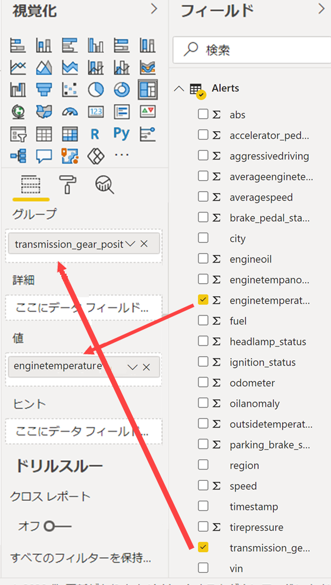

11. 「**値**」 で **enginetemperature** フィールドの隣にある下向き矢印を選択します。メニューから 「**平均**」 を選択し、合計ではなく平均で値を集計します。

    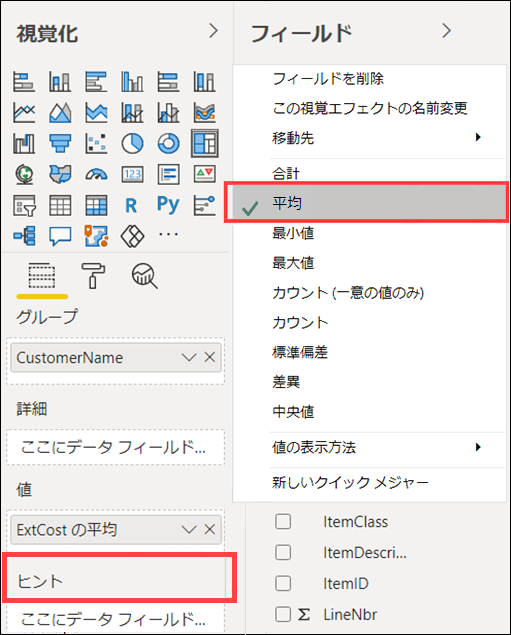

12. ツリーマップは次のようになります。

    

13. ツリーマップを選択解除するには、レポートの空白の部分を選択します。次に、「**面グラフ**」 を選択します。

    

14. **region** フィールドを 「**凡例**」、**speed** フィールドを 「**値**」、**timestamp** フィールドを 「**軸**」 までドラッグします。これにより、異なる色でリージョンと、そのリージョン内でのドライバーの運転速度を示した面グラフが表示されます。

    

15. 「**値**」 で **speed** フィールドの隣にある下向き矢印を選択します。メニューから 「**平均**」 を選択し、合計ではなく平均で値を集計します。

    

16. 面グラフは次のようになります。

    

17. 面グラフを選択解除するには、レポートの空白の部分を選択します。次に 「**複数の行カード**」 を選択します。

    

18. **aggressivedriving**、**enginetempanomaly**、**oilanomaly** フィールドを 「**フィールド**」 にドラッグします。

    

19. 複数の行カード設定で 「**形式**」 タブを選択し、「**データ ラベル**」 を展開します。「**テキスト サイズ**」 を 30 に設定します。「**カテゴリ ラベル**」 を展開し、「**テキスト サイズ**」 を 12 に設定します。

    

20. 複数の行カードは次のようになります。

    

21. ページの右上で 「**保存**」 を選択します。

    

22. 名前 ("Contoso Auto Vehicle Anomalies" など) を入力し、「**保存**」 を選択します。

    

23. それではこのレポートをダッシュボードに追加しましょう。レポートの最上部で 「**ダッシュボードにピン留め**」 を選択します (省略記号 ... を選択する必要があるかもしれません)。

    

24. 「**新しいダッシュボード**」 を選択した後、名前 ("Contoso Auto Vehicle Anomalies Dashboard" など) を入力します。「**ライブをピン留めする**」 を選択します。プロンプトで指示されたら、ダッシュボードを表示するオプションを選択します。プロンプトが表示されない場合は、左側のメニューの 「マイ ワークスペース」 にダッシュボードがあります。

    

25. データが捕捉されると、ライブ ダッシュボードは自動的に更新されます。グラフ上の任意の場所にマウスを動かすと、その項目に関する情報が表示されます。平均速度グラフの上にある凡例でリージョンをひとつ選択します。他のグラフはすべて、自動的にそのリージョンによってフィルタリングされます。再びそのリージョンをクリックしてフィルターをクリアします。

    

### タスク 3: synapse Analytics で集計データを表示する

Stream Analytics でクエリを作成した際は、2 分間隔でエンジン温度と車両の速度データを集計し、そのデータを Synapse Analytics に保存しました。この機能は、Stream Analytics のクエリがさまざまな間隔で複数の出力にデータを書き込めることを示しています。Synapse Analytics 専用 SQL プールに書き込めるため、履歴および最新の集計データをデータ ウェアハウスの一部として保持できます。ETL/ELT プロセスは必要ありません。

このタスクでは、Synapse Analytics 内の異常データを表示します。

1. まだ行っていない場合は、**TransactionGenerator** を**停止**します。

2. [Azure portal](https://portal.azure.com) に移動します。

3. 左側のメニューから、「**リソース グループ**」 を選択します。その後、**ms-dataengineering-14** という名前のリソース グループを選択します。

4. リソース グループ内のリソース リストから 「**Synapse ワークスペース**」  (`asaworkspaceYOUR_UNIQUE_ID`) を選択します。

    

5. 「概要」 ペイン内の 「**Synapse Studio を開く**」 ボックスで 「**開く**」 を選択します。

    

6. Synapse Studio で左側のメニューにある 「**データ**」 を選択して、「データ」 ハブに移動します。

    !「データ ハブが強調表示されています。」(media/data-hub.png "Data hub")

7. ［**ワークスペース**］ タブ **(1)** を選択し、`ContosoAuto` データベースを展開します。`Tables` を展開してから **dbo.VehicleAverages** テーブル **(2)** を右クリックします。このテーブルがリストに表示されない場合は、テーブル リストを更新します。「**新しい SQL スクリプト**」 (3) を選択してから 「**上位 100 行を選択**」 (4) を選びます。

    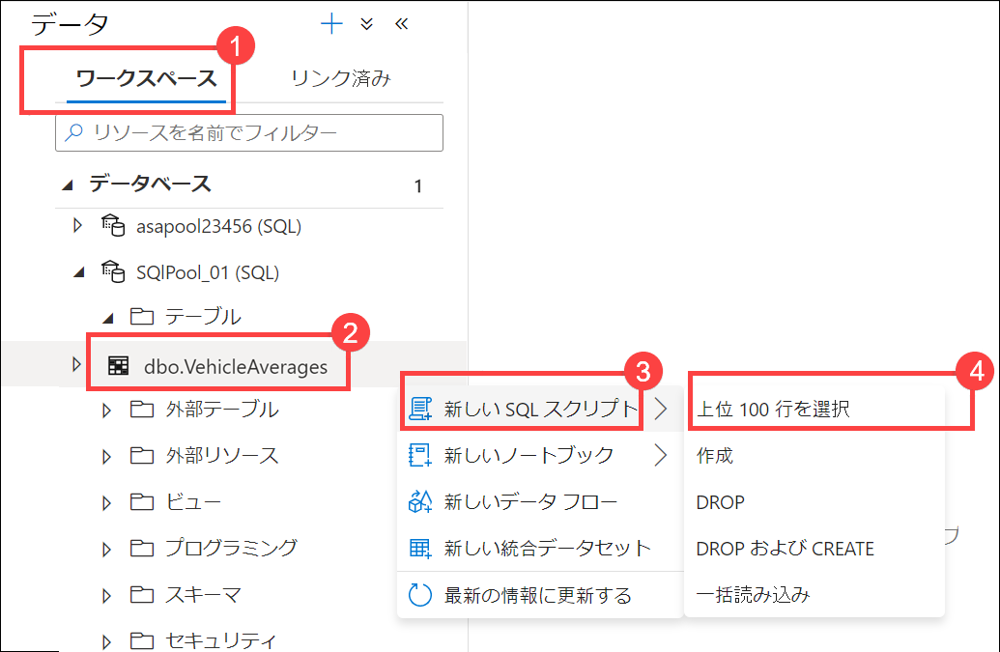

8. クエリの結果を表示し、`AverageEngineTemperature` と `AverageSpeed` に格納されている集計データを確認します。これらの記録の間で `Snapshot` の値は 2 分間隔で変化します。

   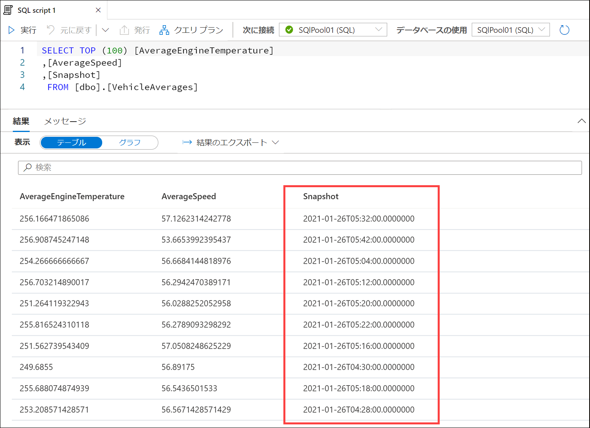

9. ［結果］ 出力で 「**グラフ**」 ビューを選択し、グラフの種類を 「**面グラフ**」 に設定します。この視覚化では、時間の経過に伴う平均速度に関連した平均エンジン温度が示されます。グラフの設定をいろいろ試してみてください。

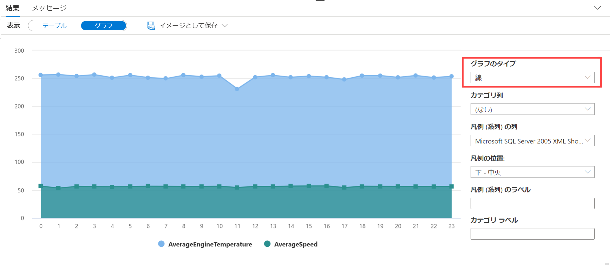
