# モジュール 16 - Power BI と Azure Synapse Analytics の統合を使用してレポートを作成する

このモジュールでは、Power BI を Synapse ワークスペースと統合して Power BI でレポートを作成する方法を学習します。受講者は Synapse Studio で新しいデータ ソースと Power BI レポートを作成します。その後、具体化されたビューと結果セットのキャッシュを使用してクエリのパフォーマンスを向上させる方法を学びます。最後に、サーバーレス SQL プールのあるデータ レイクを確認し、Power BI でそのデータに対する視覚化を作成します。

このモジュールでは、次のことができるようになります。

- Synapse ワークスペースと Power BI を統合する
- Power BI との統合を最適化する
- 具体化されたビューと結果セットのキャッシュでクエリのパフォーマンスを向上させる
- SQL サーバーレスでデータを視覚化し、Power BI レポートを作成する

## ラボの詳細

- [モジュール 16 - Power BI と Azure Synapse Analytics の統合を使用してレポートを作成する](#module-16---build-reports-using-power-bi-integration-with-azure-synapse-analytics)
  - [ラボの詳細](#lab-details)
  - [このラボで使用するリソース名](#resource-naming-throughout-this-lab)
  - [ラボの構成と前提条件](#lab-setup-and-pre-requisites)
  - [演習 0: 専用 SQL プールを起動する](#exercise-0-start-the-dedicated-sql-pool)
  - [演習 1: Power BI と Synapse ワークスペースの統合](#exercise-1-power-bi-and-synapse-workspace-integration)
    - [タスク 1: Power BI にログインする](#task-1-login-to-power-bi)
    - [タスク 2: Power BI ワークスペースを作成する](#task-2-create-a-power-bi-workspace)
    - [タスク 3: Synapse から Power BI に接続する](#task-3-connect-to-power-bi-from-synapse)
    - [タスク 4: Synapse Studio で Power BI リンク サービスを探索する](#task-4-explore-the-power-bi-linked-service-in-synapse-studio)
    - [タスク 5: Power BI Desktop で使用する新しいデータソースを作成する](#task-5-create-a-new-datasource-to-use-in-power-bi-desktop)
    - [タスク 6: Synapse Studio で新しい Power BI レポートを作成する](#task-6-create-a-new-power-bi-report-in-synapse-studio)
  - [演習 2: Power BI との統合を最適化する](#exercise-2-optimizing-integration-with-power-bi)
    - [タスク 1: Power BI の最適化オプションを確認する](#task-1-explore-power-bi-optimization-options)
    - [タスク 2: 具体化されたビューを使用してパフォーマンスを向上させる](#task-2-improve-performance-with-materialized-views)
    - [タスク 3: 結果セットのキャッシュを使用してパフォーマンスを向上させる](#task-3-improve-performance-with-result-set-caching)
  - [演習 3: SQL サーバーレスでデータを視覚化する](#exercise-3-visualize-data-with-sql-serverless)
    - [タスク 1: SQL サーバーレスを使用してデータ レイクを探索する](#task-1-explore-the-data-lake-with-sql-serverless)
    - [タスク 2: SQL サーバーレスでデータを視覚化し、Power BI レポートを作成する](#task-2-visualize-data-with-sql-serverless-and-create-a-power-bi-report)

## このラボで使用するリソース名

このガイドの残りの部分では、さまざまな ASA 関連のリソースに関して以下の用語を使用します (必ずこれを実際の名前を値に置き換えてください)。

| Azure Synapse Analytics Resource  | 呼称 |
| --- | --- |
| ワークスペース / ワークスペース名 | `Workspace` |
| Power BI ワークスペース名 | `Synapse 01` |
| SQL プール | `SqlPool01` |
| ラボのスキーマ名 | `pbi` |

## ラボの構成と前提条件

> **注:** ホストされたラボ環境を**使用しておらず**、ご自分の Azure サブスクリプションを使用している場合は、「ラボの構成と前提条件」の手順のみを完了してください。その他の場合は、演習 0 にスキップします。

ラボのコンピューターまたは VM で [Power BI Desktop](https://www.microsoft.com/download/details.aspx?id=58494) を起動します。

このモジュールの**[ラボの構成手順](https://github.com/solliancenet/microsoft-data-engineering-ilt-deploy/blob/main/setup/04/README.md)を完了**してください。

以下のモジュールは、同じ環境を共有している点に留意してください。

- [モジュール 4](labs/04/README.md)
- [モジュール 5](labs/05/README.md)
- [モジュール 7](labs/07/README.md)
- [モジュール 8](labs/08/README.md)
- [モジュール 9](labs/09/README.md)
- [モジュール 10](labs/10/README.md)
- [モジュール 11](labs/11/README.md)
- [モジュール 12](labs/12/README.md)
- [モジュール 13](labs/13/README.md)
- [モジュール 16](labs/16/README.md)

## 演習 0: 専用 SQL プールを起動する

このラボでは専用 SQL プールを使用します。最初の手順として、これが一時停止状態でないことを確認してください。一時停止している場合は、以下の手順に従って起動します。

1. Synapse Studio (<https://web.azuresynapse.net/>) を開きます。

2. 「**管理**」 ハブを選択します。

    

3. 左側のメニューで 「**SQL プール**」 を選択します **(1)**。専用 SQL プールが一時停止状態の場合は、プールの名前の上にマウスを動かして 「**再開**」  (2) を選択します。

    

4. プロンプトが表示されたら、「**再開**」 を選択します。プールが再開するまでに、1 ～ 2 分かかります。

    

> 専用 SQL プールが再開する間、**続行して次の演習に進みます**。

## 演習 1: Power BI と Synapse ワークスペースの統合

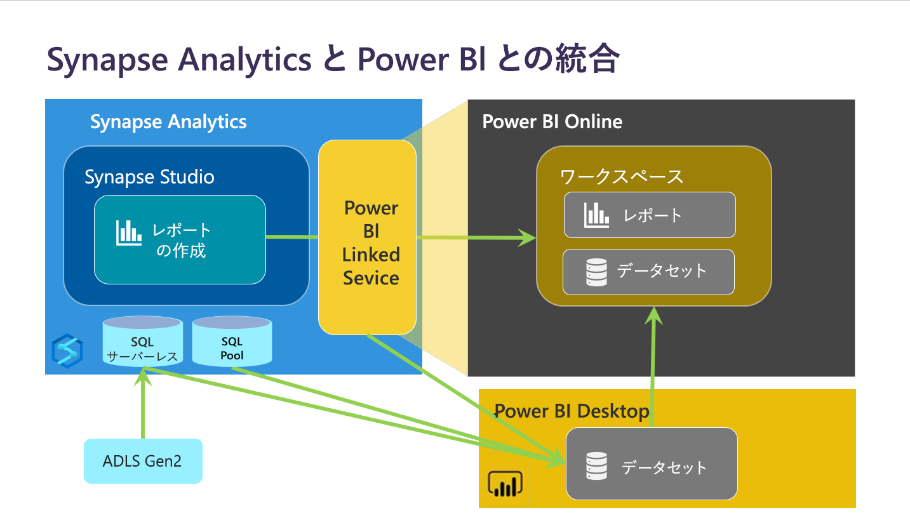

### タスク 1: Power BI にログインする

1. 新しいブラウザー タブで、<https://powerbi.microsoft.com/> に移動します。

2. Azure にサインインした場合と同じアカウントを使用してサインインします。右上コーナーで 「**サインイン**」 リンクを選択してください。

3. このアカウントに初めてサインインする場合は、既定のオプションを使ってセットアップ ウィザードを完了してください。

### タスク 2: Power BI ワークスペースを作成する

1. 「**ワークスペース**」 を選択してから 「**ワークスペースの作成**」 を選択します。

    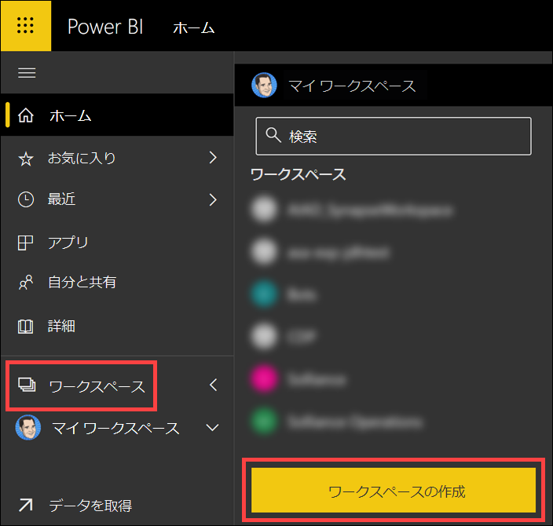

2. Power BI Pro にアップグレードするよう指示するプロンプトが表示されたら、「**無料で試す**」 を選択します。

    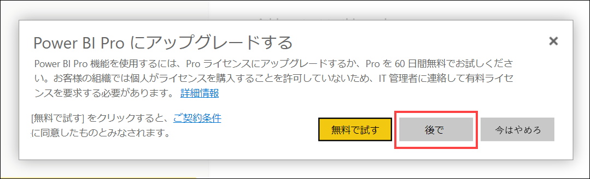

    「**了解**」 を選択して Pro のサブスクリプションを確認します。

    

3. 名前を「**synapse-training**」に設定し、「**保存**」 を選択します。`synapse-training` は利用できませんというメッセージが表示されたら、イニシャルまたは他の文字を付記して、ワークスペース名を所属組織固有のものにします。

    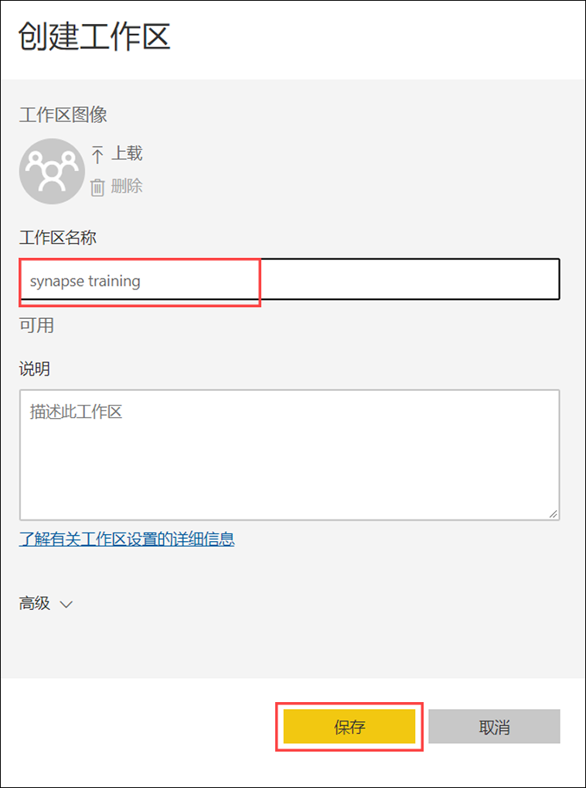

### タスク 3: Synapse から Power BI に接続する

1. Synapse Studio (<https://web.azuresynapse.net/>) を開き、「**管理**」 ハブに移動します。

    

2. 左側のメニューで 「**リンク サービス**」 を選択してから、「**+ 新規**」 を選択します。

    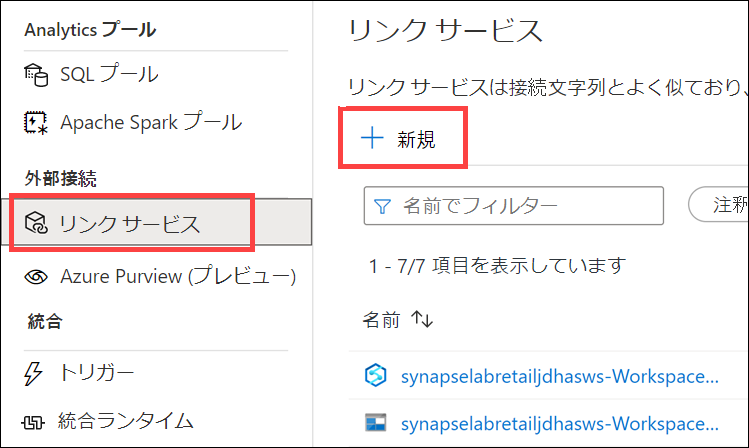

3. 「**Power BI**」 を選択してから 「**続行**」 を選択します。

    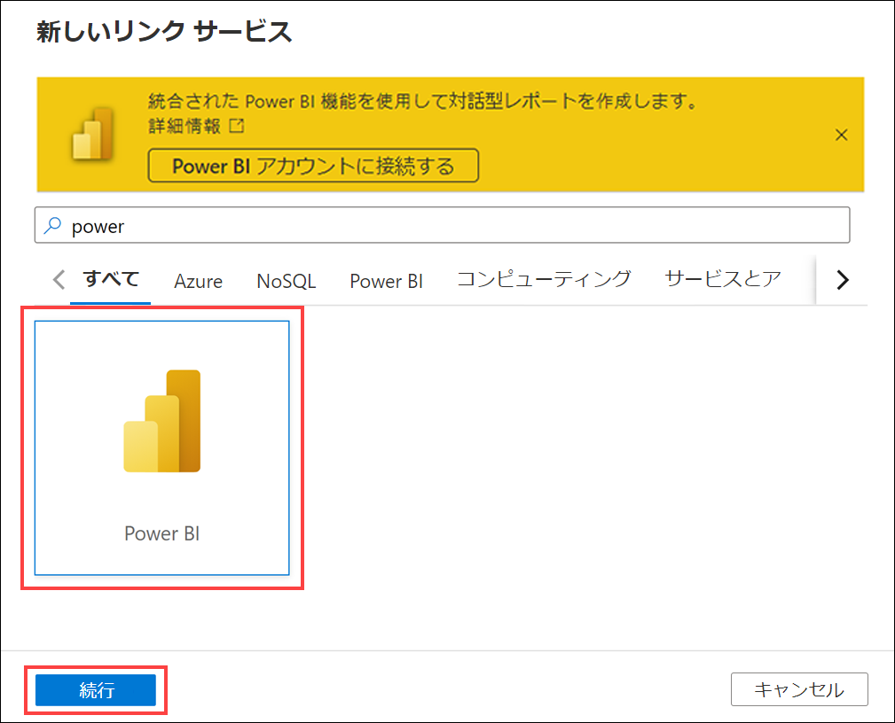

4. データセットのプロパティ フォームで以下を完了します。

    | フィールド                          | 値                                              |
    | ------------------------------ | ------------------------------------------         |
    | 名前 | _`handson_powerbi` を入力_ |
    | ワークスペース名 | _`synapse-training` を選択_ |

    

5. 「**作成**」 を選択します。

6. 「**すべて公開**」 を選択した後、「**公開**」 を選択します。

    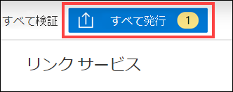

### タスク 4: Synapse Studio で Power BI リンク サービスを探索する

1. 「**Azure Synapse Studio**](<https://web.azuresynapse.net/>) で左側のメニュー オプションを使い、「**開発**」 ハブに移動します。

    

2. `Power BI` と `handson_powerbi` を展開し、Power BI データセットとレポートに Synapse Studio から直接アクセスできることを確認します。

    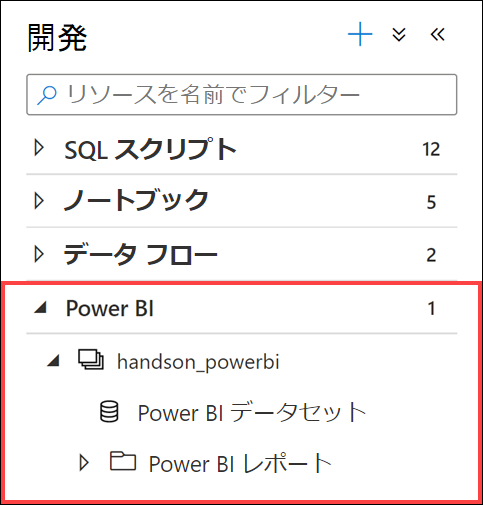

    新しいレポートを作成するには、「**開発**」 タブの上部にある **+** をクリックします。既存のレポートを編集するには、レポート名を選択します。保存した変更は、Power BI ワークスペースに書き戻されます。

### タスク 5: Power BI Desktop で使用する新しいデータソースを作成する

1. リンクされた Power BI ワークステーションの **Power BI** で 「**Power BI データセット**」 を選択します。

2. 上部アクション メニューから 「**新しい Power BI データセット**」 を選択します。

    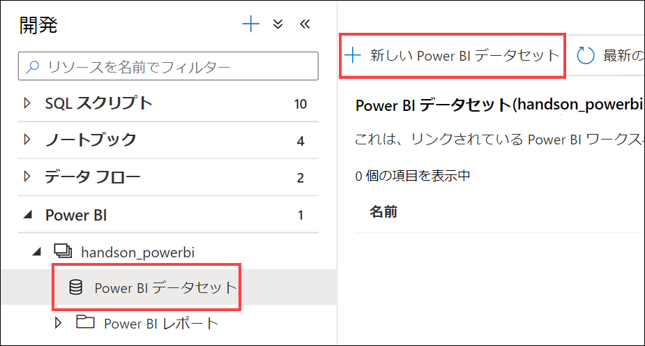

3. 「**スタート**」 を選択し、Power BI Desktop がお使いになっている環境のコンピューターにインストールされていることを確認します。

    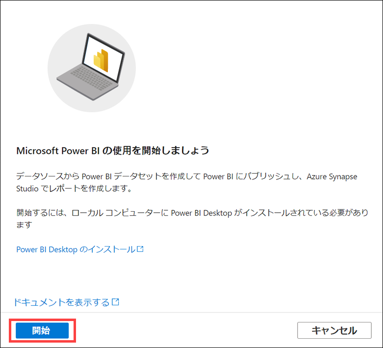

4. 「**SQLPool01**」 を選択してから 「**続行**」 を選択します。

    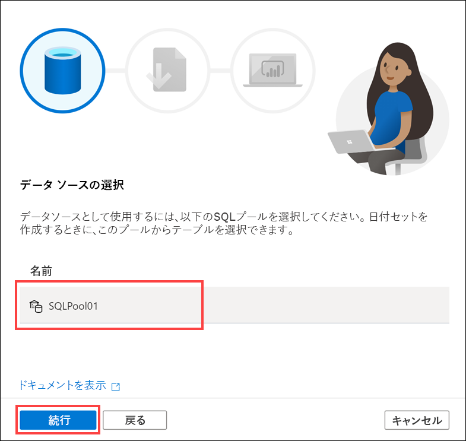

5. 次に、「**ダウンロード**」 を選択して `.pbids` ファイルをダウンロードします。

    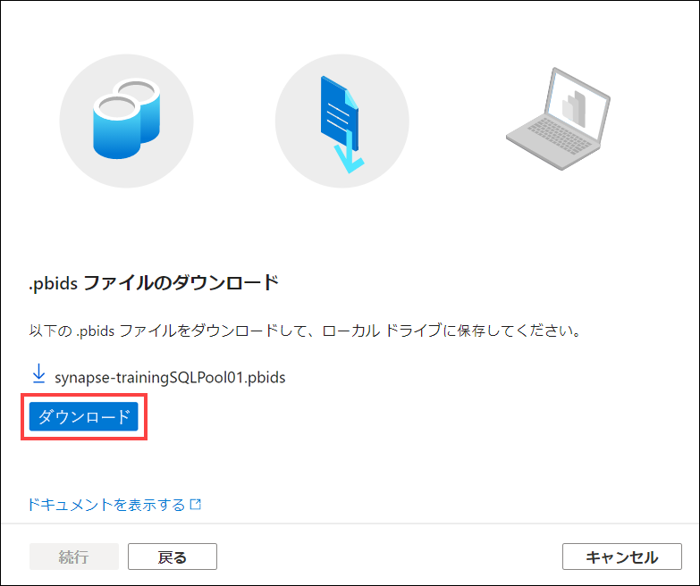

6. 「**続行**」 を選択してから 「**終了して更新**」 を選び、公開ダイアログを閉じます。

### タスク 6: Synapse Studio で新しい Power BI レポートを作成する

1. [**Azure Synapse Studio**](<https://web.azuresynapse.net/>) で左側のメニューから 「**開発**」 を選択します。

    

2. **+** を選択してから 「**SQL スクリプト**」 を選択します。

    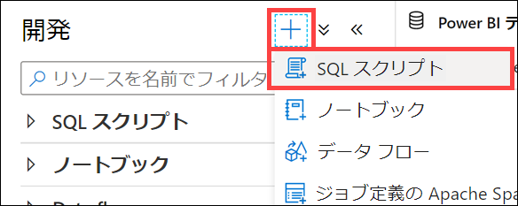

3. **SQLPool01** に接続した後、以下のクエリを実行しておおよその実行時間を確認します (おそらく 1 分程度)。このクエリは、この演習で後ほど作成する Power BI レポートでデータを取得する際にも使用します。

    ```sql
    SELECT count(*) FROM
    (
        SELECT
            FS.CustomerID
            ,P.Seasonality
            ,D.Year
            ,D.Quarter
            ,D.Month
            ,avg(FS.TotalAmount) as AvgTotalAmount
            ,avg(FS.ProfitAmount) as AvgProfitAmount
            ,sum(FS.TotalAmount) as TotalAmount
            ,sum(FS.ProfitAmount) as ProfitAmount
        FROM
            wwi.SaleSmall FS
            JOIN wwi.Product P ON P.ProductId = FS.ProductId
            JOIN wwi.Date D ON FS.TransactionDateId = D.DateId
        GROUP BY
            FS.CustomerID
            ,P.Seasonality
            ,D.Year
            ,D.Quarter
            ,D.Month
    ) T
    ```

    194683820 というクエリ結果が表示されるはずです。

    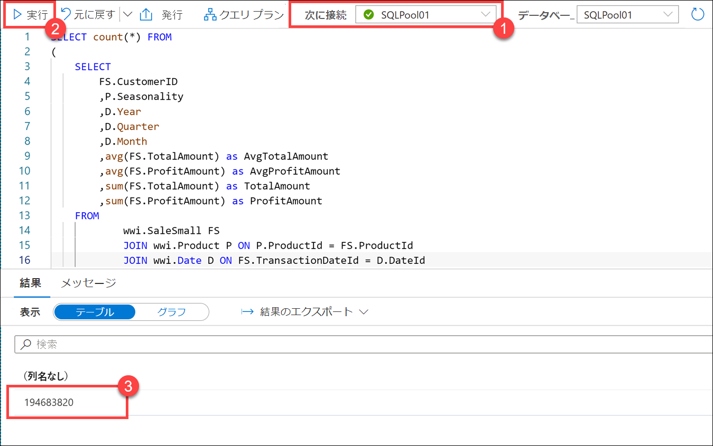

4. データソースに接続するには、Power BI Desktop でダウンロードした .pbids ファイルを開きます。左側で 「**Microsoft アカウント**」 オプションを選択し、**サインイン** (Synapse ワークスペースに接続したサイト同じ資格情報を使用) して 「**接続**」 をクリックします。

    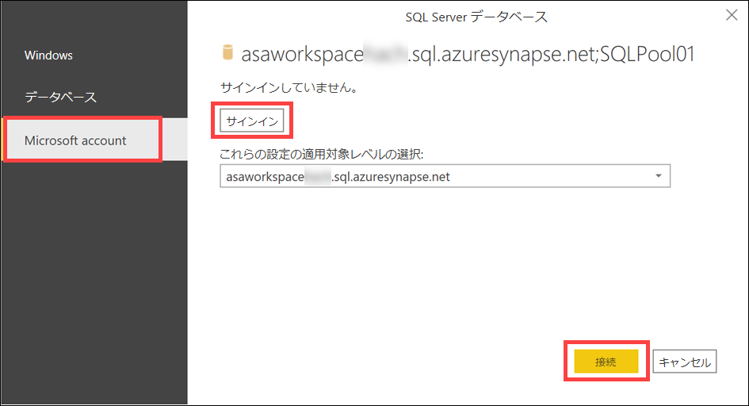

5. 「ナビゲーター」 ダイアログでルート データベース ノードを右クリックし、「**データの変換**」 を選択します。

    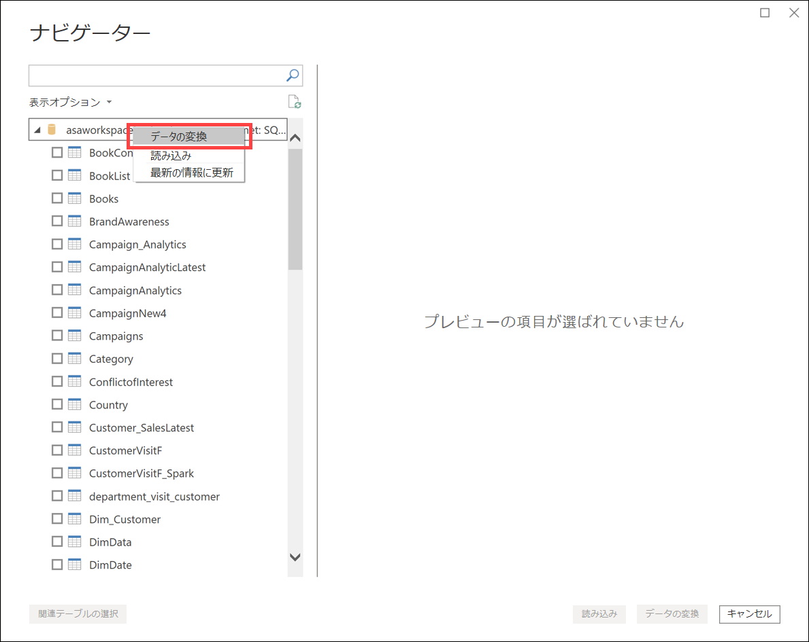

6. 接続設定ダイアログで **DirectQuery** オプションを選択します。Power BI にデータをコピーすることが目的ではなく、レポートの視覚化を使用している間にデータ ソースのクエリを実行できるようになることをめざしているためです。「**OK**」 をクリックし、接続が構成されるまで数秒間待ちます。

    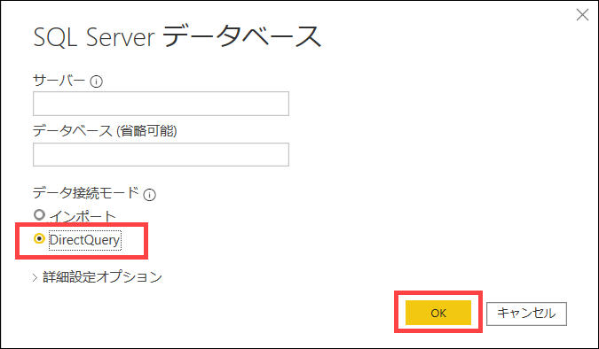

7. Power Query エディターで、クエリの 「**ソース**」 ステップの設定ページを開きます。「**詳細オプション**」 セクションを展開し、以下のクエリを貼り付けて 「**OK**」 をクリックします。

    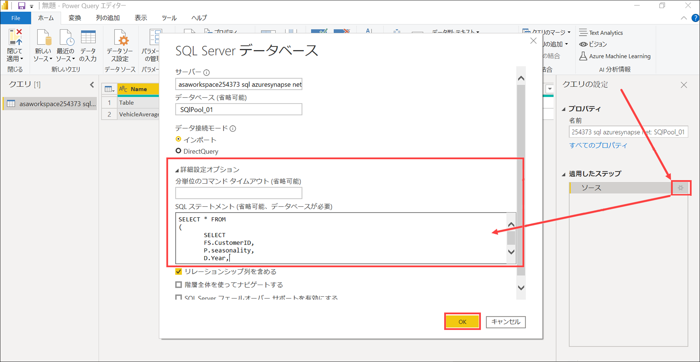

    ```sql
    SELECT * FROM
    (
        SELECT
            FS.CustomerID
            ,P.Seasonality
            ,D.Year
            ,D.Quarter
            ,D.Month
            ,avg(FS.TotalAmount) as AvgTotalAmount
            ,avg(FS.ProfitAmount) as AvgProfitAmount
            ,sum(FS.TotalAmount) as TotalAmount
            ,sum(FS.ProfitAmount) as ProfitAmount
        FROM
            wwi.SaleSmall FS
            JOIN wwi.Product P ON P.ProductId = FS.ProductId
            JOIN wwi.Date D ON FS.TransactionDateId = D.DateId
        GROUP BY
            FS.CustomerID
            ,P.Seasonality
            ,D.Year
            ,D.Quarter
            ,D.Month
    ) T
    ```

    > このステップを実行するには、40-60 秒以上かかりました。クエリを直接、Synapse SQL プール接続で送信するためです。

8. エディター ウィンドウの左上コーナーで 「**閉じて適用**」 を選択し、クエリを適用して、Power BI デザイナー ウィンドウで最初のスキーマを取得します。

    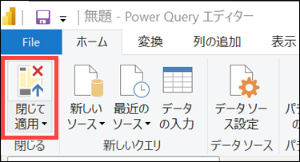

9. Power BI レポート エディターに戻り、右側で 「**視覚化**」 メニューを展開し、「**折れ線グラフおよび積み上げ縦棒グラフ**」 を選択します。

    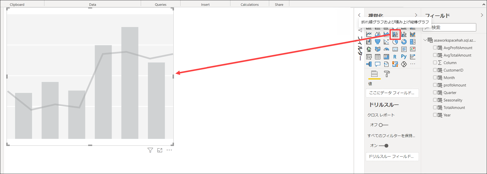

10. 新しく作成されたグラフを選択し、プロパティ ペインを展開します。展開された 「**フィールド**」 メニューを使用して、以下のように視覚化を構成します。

     - **共有の軸**: `Year`、`Quarter`
     - **縦棒**: `Seasonality`
     - **各棒の値**: `TotalAmount`
     - **線の値**: `ProfitAmount`

    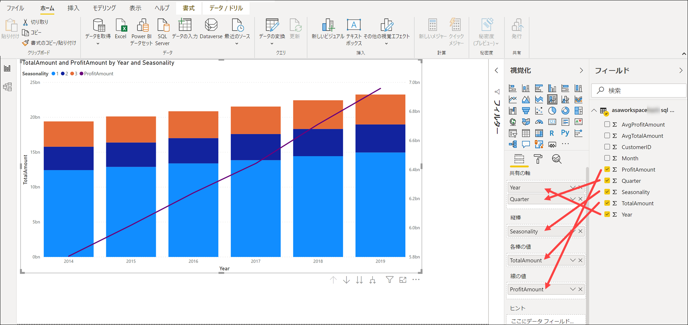

    > 視覚化を行うには 40-60 秒ほどかかります。Synapse 専用 SQL プールでライブ クエリが実行されているためです。

11. Power BI Desktop アプリケーションで視覚化の構成中に実行されたクエリをチェックできます。Synapse Studio に戻り、左側のメニューから 「**監視**」 ハブを選択してください。

    

12. 「**アクティビティ**」 セクションで 「**SQL リクエスト**」 モニターを開きます。プール フィルターで必ず **SQLPool01** を選択してください。既定では 「組み込み」 が選択されています。

    

13. ログの最上部のリクエストで視覚化の間に行われるクエリを特定し、その期間を確認してください (20-30 秒程度です)。リクエストで 「**その他**」 を選択し、Power BI Desktop から送信された実際のクエリを確認します。

    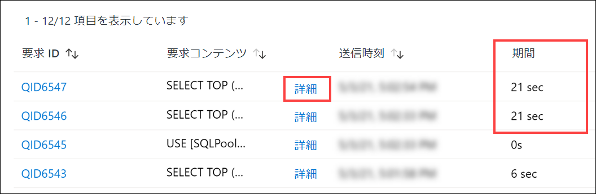

    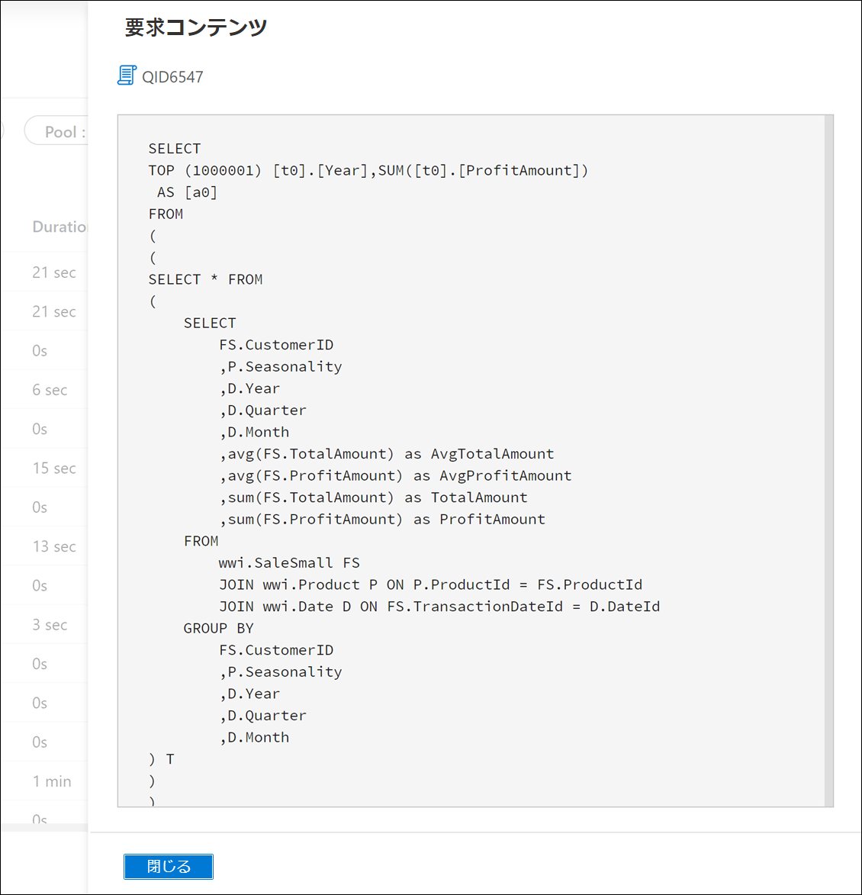

14. Power BI Desktop アプリケーションに戻り、左上コーナーで 「**保存**」 をクリックします。

    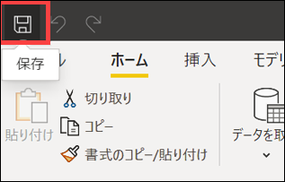

15. ファイル名 (`synapse-lab` など) を指定して 「**保存**」 をクリックします。

    

16. 保存されたレポートの上で 「**公開**」 をクリックします。Power BI ポータルおよび Synapse Studio と同じアカウントを使用して、Power BI Desktop にサインインしていることを確認してください。ウィンドウの右上コーナーから適切なアカウントに切り替えられます。

    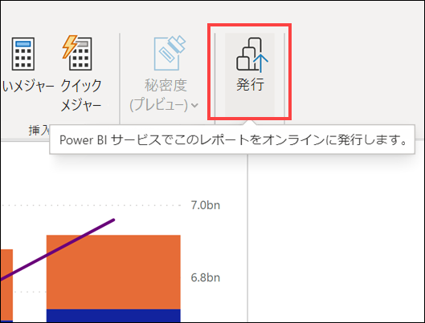

    現在、Power BI Desktop にログインしていない場合は、メール アドレスを入力するように求められます。このラボで Azure ポータルと Synapse Studio に接続した際のアカウント資格情報を使用します。

    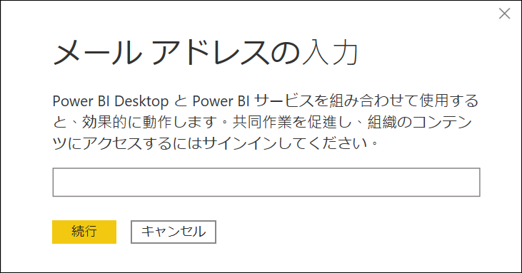

    プロンプトに従って、アカウントのサインインを完了します。

17. 「**Power BI へ発行**」 ダイアログで、Synapse にリンクしたワークスペースを選択し (たとえば、**synapse-training**)、「**選択**」 をクリックします。

    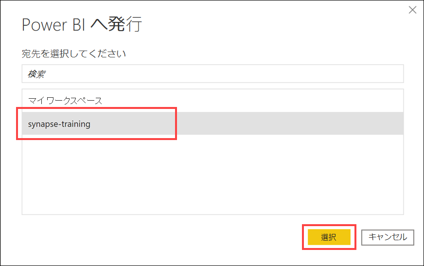

18. 発行操作が完了するまで待ちます。

    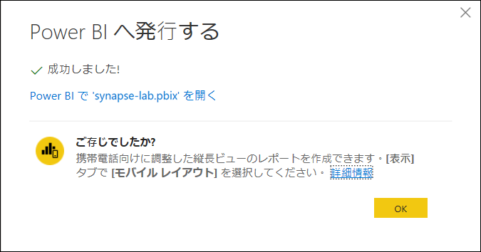

19. Power BI サービスに戻るか、これを閉じていた場合は新しいブラウザー タブでそこまで移動します (<https://powerbi.microsoft.com/>)。

20. 先ほど作成した **synapse-training** ワークスペースを選択します。これがすでに開いている場合は、ページをリフレッシュして新しいレポートとデータセットが表示されるようにします。

    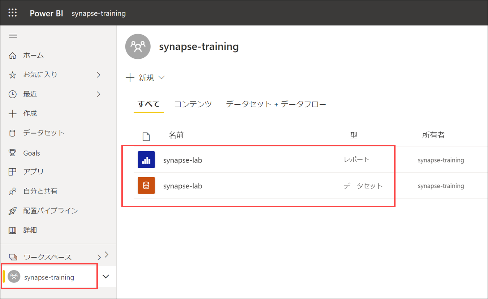

21. ページの右上で 「**設定**」 歯車アイコンを選択し、「**設定**」 を選択します。歯車アイコンが表示されていない場合は、省略記号 (...) を使用してメニュー項目を表示する必要があります。

    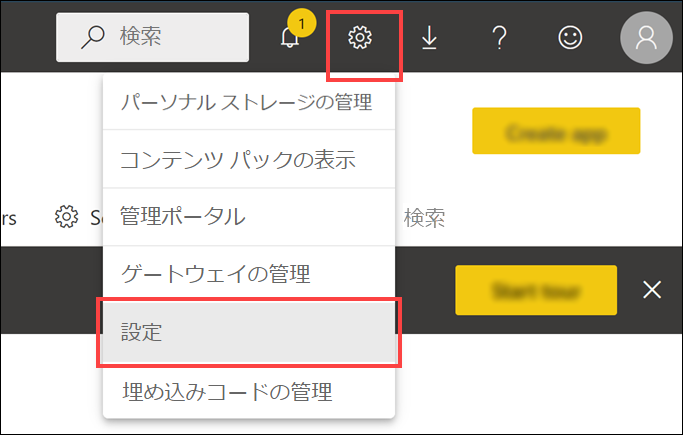

22. 「**データセット**」 タブを選択します。`Data source credentials` に、資格情報が無効なのでデータ ソースを更新できないというエラー メッセージが表示されたら、「**資格情報を編集**」 を選択します。このセクションが表示されるまで数秒かかるかもしれません。

    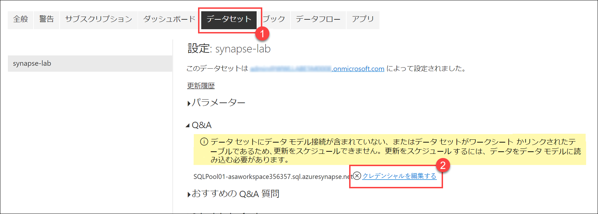

23. 表示されるダイアログで、「**OAuth2**」 認証方法を選択し、「**サインイン**」 を選択します。プロンプトで指示されたら資格情報を入力します。

    

24. これで、Synapse Studio で発行済みのレポートが表示されるはずです。Synapse Studio に戻り、「**開発**」 ハブを選択して Power BI レポート ノードを更新します。

    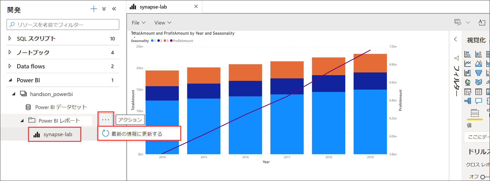

## 演習 2: Power BI との統合を最適化する

### タスク 1: Power BI の最適化オプションを確認する

Azure Synapse Analytics で Power BI レポートを統合する際に利用できるパフォーマンス最適化オプションを思い出してみましょう。この演習では後ほど、そのうちの結果セットのキャッシュと具体化されたビューのオプションを使用してみます。

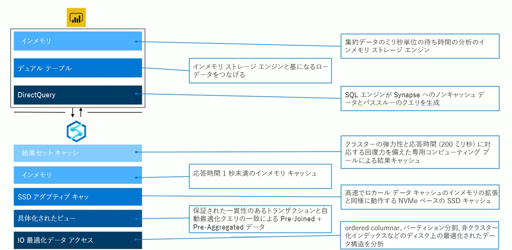

### タスク 2: 具体化されたビューを使用してパフォーマンスを向上させる

1. [**Azure Synapse Studio**](<https://web.azuresynapse.net/>) で左側のメニューから 「**開発**」 を選択します。

    

2. **+** を選択してから 「**SQL スクリプト**」 を選択します。

    

3. **SQLPool01** に接続し、以下のクエリを実行して予想されている実行プランを取得し、合計コストと運用件数を確認します。

    ```sql
    EXPLAIN
    SELECT * FROM
    (
        SELECT
        FS.CustomerID
        ,P.Seasonality
        ,D.Year
        ,D.Quarter
        ,D.Month
        ,avg(FS.TotalAmount) as AvgTotalAmount
        ,avg(FS.ProfitAmount) as AvgProfitAmount
        ,sum(FS.TotalAmount) as TotalAmount
        ,sum(FS.ProfitAmount) as ProfitAmount
    FROM
        wwi.SaleSmall FS
        JOIN wwi.Product P ON P.ProductId = FS.ProductId
        JOIN wwi.Date D ON FS.TransactionDateId = D.DateId
    GROUP BY
        FS.CustomerID
        ,P.Seasonality
        ,D.Year
        ,D.Quarter
        ,D.Month
    ) T
    ```

4. 結果は次のようになります。

    ```xml
    <?xml version="1.0" encoding="utf-8"?>
    <dsql_query number_nodes="1" number_distributions="60" number_distributions_per_node="60">
        <sql>SELECT count(*) FROM
    (
        SELECT
        FS.CustomerID
        ,P.Seasonality
        ,D.Year
        ,D.Quarter
        ,D.Month
        ,avg(FS.TotalAmount) as AvgTotalAmount
        ,avg(FS.ProfitAmount) as AvgProfitAmount
        ,sum(FS.TotalAmount) as TotalAmount
        ,sum(FS.ProfitAmount) as ProfitAmount
    FROM
        wwi.SaleSmall FS
        JOIN wwi.Product P ON P.ProductId = FS.ProductId
        JOIN wwi.Date D ON FS.TransactionDateId = D.DateId
    GROUP BY
        FS.CustomerID
        ,P.Seasonality
        ,D.Year
        ,D.Quarter
        ,D.Month
    ) T</sql>
        <dsql_operations total_cost="10.61376" total_number_operations="12">
    ```

5. クエリを以下に置き換えて、上記のクエリをサポートする具体化されたビューを作成します。

    ```sql
    IF EXISTS(select * FROM sys.views where name = 'mvCustomerSales')
        DROP VIEW wwi_perf.mvCustomerSales
        GO

    CREATE MATERIALIZED VIEW
        wwi_perf.mvCustomerSales
    WITH
    (
        DISTRIBUTION = HASH( CustomerId )
    )
    _AS
    SELECT
        FS.CustomerID
        ,P.Seasonality
        ,D.Year
        ,D.Quarter
        ,D.Month
        ,avg(FS.TotalAmount) as AvgTotalAmount
        ,avg(FS.ProfitAmount) as AvgProfitAmount
        ,sum(FS.TotalAmount) as TotalAmount
        ,sum(FS.ProfitAmount) as ProfitAmount
    FROM
        wwi.SaleSmall FS
        JOIN wwi.Product P ON P.ProductId = FS.ProductId
        JOIN wwi.Date D ON FS.TransactionDateId = D.DateId
    GROUP BY
        FS.CustomerID
        ,P.Seasonality
        ,D.Year
        ,D.Quarter
        ,D.Month
    GO
    ```

    > このクエリは完了するまでに 60 秒から 150 秒かかります。
    >
    > ビューがある場合 (以前のラボですでに作成していたもの) は最初にこれをドロップします。

6. 以下のクエリを実行して、作成済みの愚痴明かされたビューを実際にヒットするか確認します。

    ```sql
    EXPLAIN
    SELECT * FROM
    (
        SELECT
        FS.CustomerID
        ,P.Seasonality
        ,D.Year
        ,D.Quarter
        ,D.Month
        ,avg(FS.TotalAmount) as AvgTotalAmount
        ,avg(FS.ProfitAmount) as AvgProfitAmount
        ,sum(FS.TotalAmount) as TotalAmount
        ,sum(FS.ProfitAmount) as ProfitAmount
    FROM
        wwi.SaleSmall FS
        JOIN wwi.Product P ON P.ProductId = FS.ProductId
        JOIN wwi.Date D ON FS.TransactionDateId = D.DateId
    GROUP BY
        FS.CustomerID
        ,P.Seasonality
        ,D.Year
        ,D.Quarter
        ,D.Month
    ) T
    ```

7. Power BI Desktop レポートに戻り、レポートの上にある 「**更新**」 ボタンをクリックしてクエリを送信します。クエリ オプティマイザーは新しい具体化されたビューを使用するはずです。

    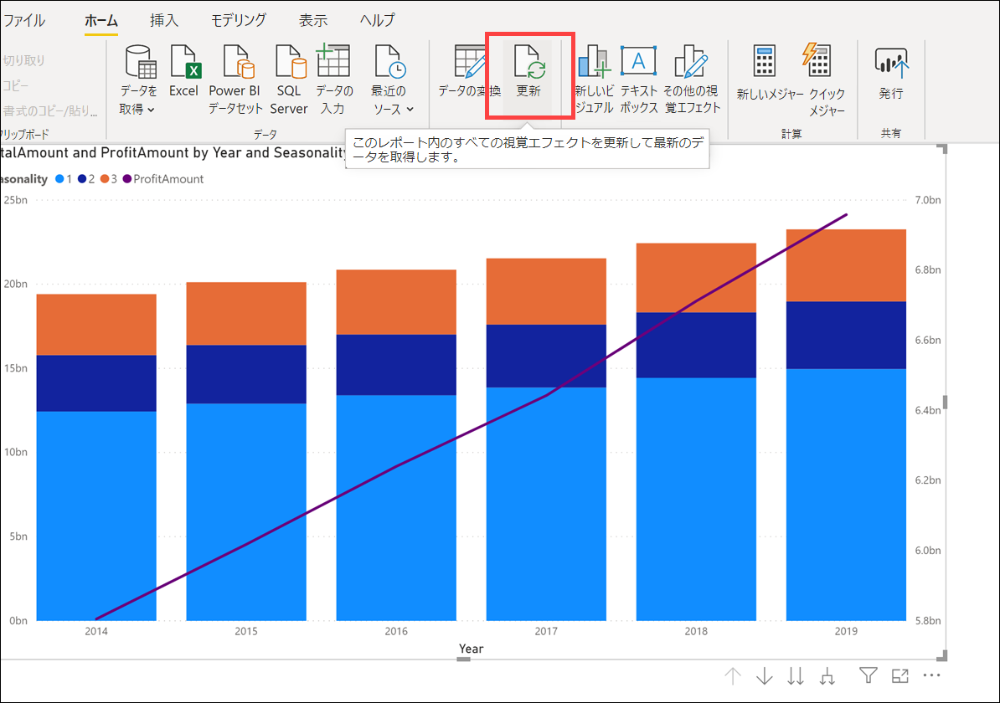

    > 以前と比べて、データのリフレッシュには数秒しかかかりませんでした。

8. Synapse Studio の SQL リクエストの下にある監視ハブで再びクエリの所要時間を確認します。新しい具体化されたビューを使用した Power BI のクエリの方がはるかに速かったことがわかります (所要時間は 10 秒未満)。

    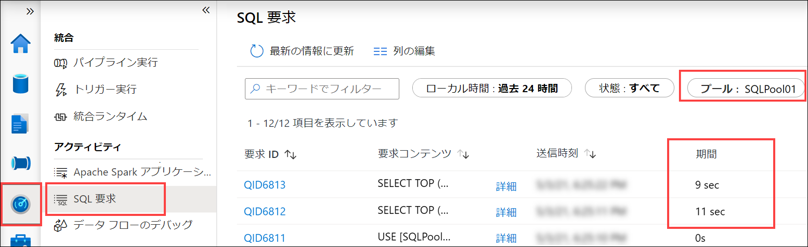

### タスク 3: 結果セットのキャッシュを使用してパフォーマンスを向上させる

1. [**Azure Synapse Studio**」(<https://web.azuresynapse.net/>) で左側のメニューから 「**開発**」 を選択します。

    

2. **+** を選択してから 「**SQL スクリプト**」 を選択します。

    

3. **SQLPool01** に接続し、以下のクエリを実行して、結果セットのキャッシュが現在の SQL プールでオンになっているか確認します。

    ```sql
    SELECT
        name
        ,is_result_set_caching_on
    FROM
        sys.databases
    ```

4. `SQLPool01` で `False` が返されたら、以下のクエリを実行して有効にします (`master` データベースで実行する必要があります)。

    ```sql
    ALTER DATABASE [SQLPool01]
    SET RESULT_SET_CACHING ON
    ```

    **SQLPool01** に接続し、**master** データベースを使用します。

    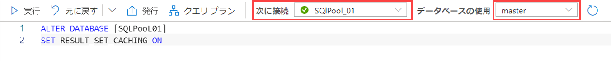

    > このプロセスが完了するまでに数分かかります。これが実行している間、ラボの残りの内容をよく理解できるように読み進めてください。
    
    >**重要**
    >
    >結果セットのキャッシュを作成し、キャッシュからデータを取得する操作は、Synapse SQL プール インスタンスの制御ノードで行われます。結果セットのキャッシュを有効にした場合、大きな結果セット (たとえば 1 GB 超) を返すクエリを実行すると、制御ノードでスロットリングが大きくなり、インスタンスでのクエリ応答全体が遅くなる可能性があります。これらのクエリは、通常、データの探索または ETL 操作で使用されます。制御ノードに負荷を与え、パフォーマンスの問題が発生するのを防ぐため、ユーザーは、このようなクエリを実行する前に、データベースの結果セットのキャッシュを無効にする必要があります。

5. 次に、Power BI Desktop レポートに戻り、「**更新**」 ボタンをクリックして再びクエリを送信します。

    

6. データの更新後、「**もう一度更新**」 をクリックして、結果セットのキャッシュを必ずヒットするようにします。

7. SQL リクエスト ページの 「監視」 ハブの Synapse Studio で再びクエリの所要時間を確認します。ほぼ即時に実行されたことがわかります (所要時間 = 0 秒)。

    

8. 専用 SQL プールに接続している間に SQL スクリプトに戻り (または、閉じている場合は新しいスクリプトを作成し)、**master** データベースで以下を実行して結果セットのキャッシュを再びオフにします。

    ```sql
    ALTER DATABASE [SQLPool01]
    SET RESULT_SET_CACHING OFF
    ```

    

## 演習 3: SQL サーバーレスでデータを視覚化する


### タスク 1: SQL サーバーレスを使用してデータ レイクを探索する

まず、視覚化で使用するデータ ソースを探索し、Power BI レポート クエリの準備をします。この演習では、Synapse ワークスペースから SQL オンデマンド インスタンスを使用します。

1. [Azure Synapse Studio](https://web.azuresynapse.net) で 「**データ**」 ハブに移動します。

    

2. 「**リンク済み**」 タブを選択します **(1)**。**Azure Data Lake Storage Gen2** グループでプライマリ データ レイク (最初のノード) **(2)** を選択し、**wwi-02** コンテナー **(3)** を選択します。**`wwi-02/sale-small/Year=2019/Quarter=Q1/Month=1/Day=20190101` (4)** に移動します。Parquet ファイル **(5)** を右クリックし、「**新しい SQL スクリプト**」 (6) を選択してから 「**上位 100 行を選択**」 (7) を選択します。

    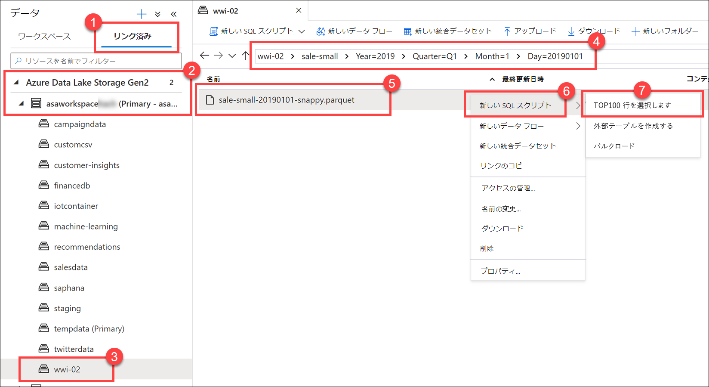

3. 生成されたスクリプトを実行し、Parquet ファイルに格納されているデータをプレビューします。

    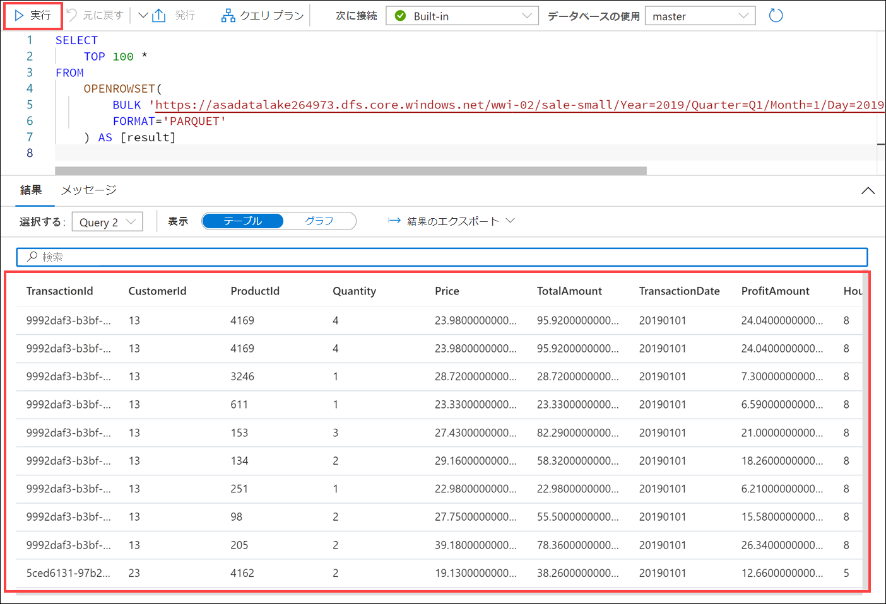

4. プライマリ データ レイク ストレージ アカウントの名前をクエリから**コピー**して、メモ帳や他のテキスト エディターに保存します。この情報は、次の手順で必要になります。

    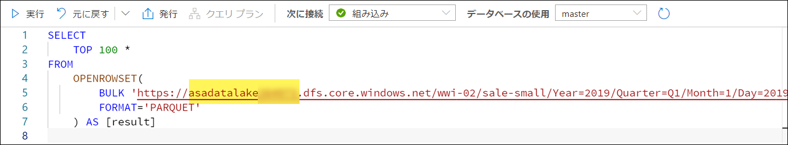

5. Power BI レポートで次に使用するクエリを準備しましょう。このクエリは特定の月の日にち別に合計金額と利益を抽出します。2019 年 1 月を例にとってみましょう。1 ヶ月に相当するファイルすべてを参照するファイルパスのワイルドカードが使われています。SQL オンデマンド インスタンスで以下のクエリを貼り付けて実行し、**`YOUR_STORAGE_ACCOUNT_NAME`** を、上記の手順でコピーしたストレージ アカウントの名前に置き換えます。

    ```sql
    DROP DATABASE IF EXISTS demo;
    GO

    CREATE DATABASE demo;
    GO

    USE demo;
    GO

    CREATE VIEW [2019Q1Sales] AS
    SELECT
        SUBSTRING(result.filename(), 12, 4) as Year
        ,SUBSTRING(result.filename(), 16, 2) as Month
        ,SUBSTRING(result.filename(), 18, 2) as Day
        ,SUM(TotalAmount) as TotalAmount
        ,SUM(ProfitAmount) as ProfitAmount
        ,COUNT(*) as TransactionsCount
    FROM
        OPENROWSET(
            BULK 'https://YOUR_STORAGE_ACCOUNT_NAME.dfs.core.windows.net/wwi-02/sale-small/Year=2019/Quarter=Q1/Month=1/*/*.parquet',
            FORMAT='PARQUET'
        ) AS [result]
    GROUP BY
        [result].filename()
    GO
    ```

    次のようなクエリ出力が表示されるはずです。

    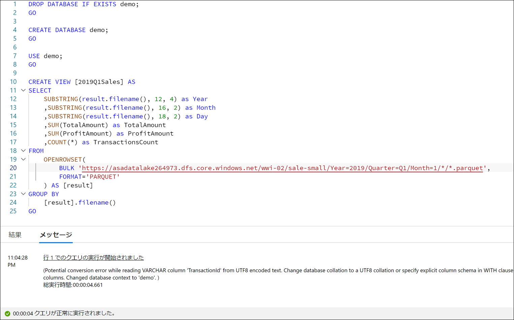

6. クエリを以下に置き換えて、作成済みの新しいビューから選択します。

    ```sql
    USE demo;

    SELECT TOP (100) [Year]
    ,[Month]
    ,[Day]
    ,[TotalAmount]
    ,[ProfitAmount]
    ,[TransactionsCount]
    FROM [dbo].[2019Q1Sales]
    ```

    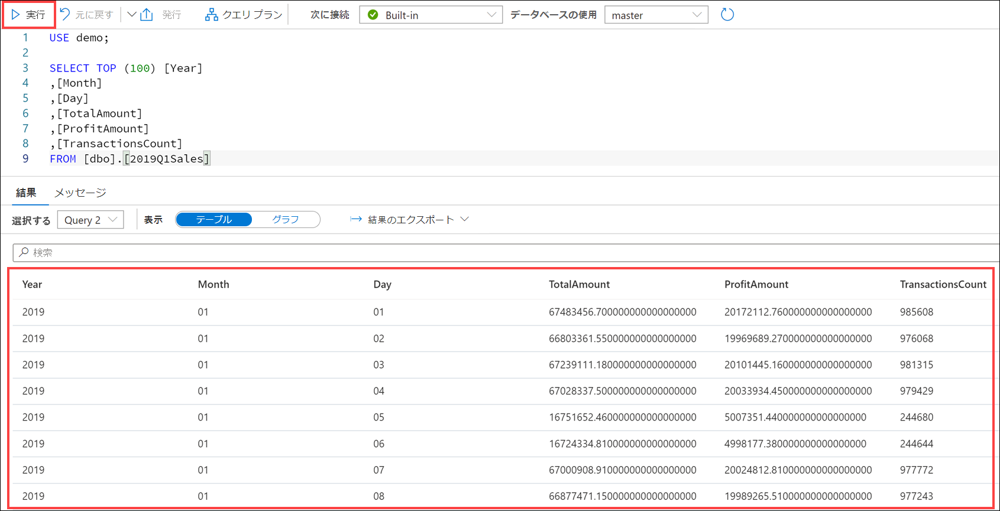

7. 左側のメニューで 「**データ**」 ハブに移動します。

    

8. 「**ワークスペース**」 タブ **(1)** を選択し、「**データベース**」 グループを右クリックして 「**更新**」 を選択し、データベースのリストを更新します。データベース グループを展開し、作成済みの新しい **demo (SQL on-demand)** データベースを展開します **(2)**。ビュー グループ内に **dbo.2019Q1Sales** ビューが含まれているはずです **(3)**。

    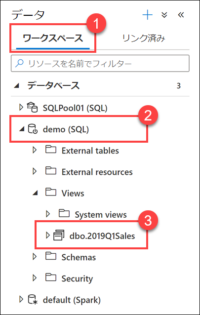

    > **注**
    >
    > Synapse サーバーレス SQL データベースは、実際のデータではなくメタデータを表示する場合にのみ使用されます。

### タスク 2: SQL サーバーレスでデータを視覚化し、Power BI レポートを作成する

1. [Azure Portal](https://portal.azure.com) で、お使いの Synapse ワークスペースに移動します。「**概要**」 タブで**サーバーレス SQL エンドポイント**を**コピー**します。

    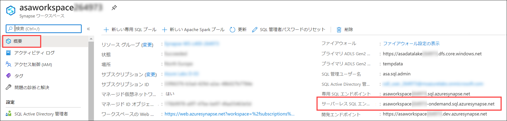

2. Power BI Desktop に戻ります。新しいレポートを作成してから 「**データの取得**」 をクリックします。

    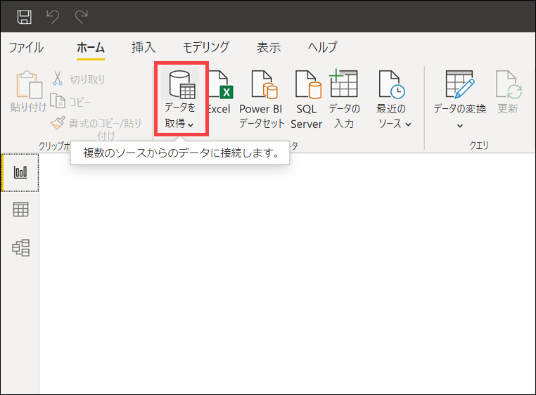

3. 左側のメニューで 「**Azure**」 を選択し、**Azure Synapse Analytics (SQL DW)** を選択します。最後に 「**接続**」 をクリックします。

    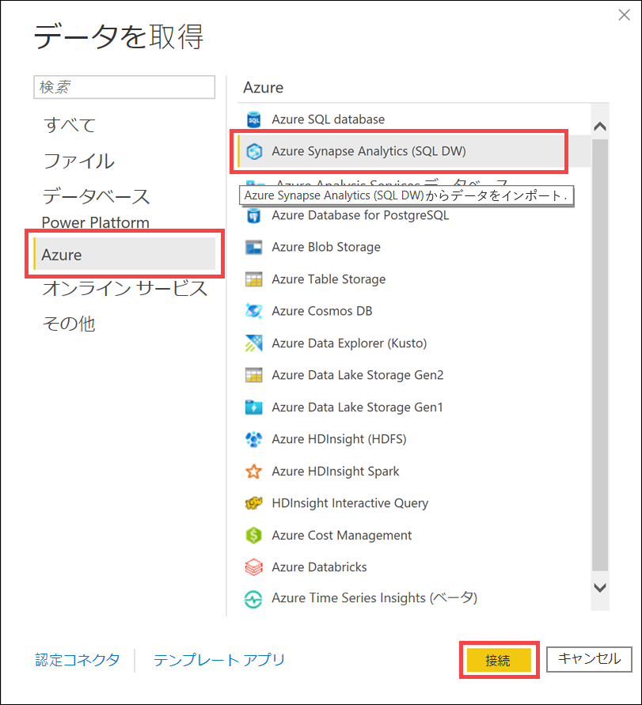

4. エンドポイントを、最初のステップで識別したサーバーレス SQL エンドポイントへのエンドポイントを 「**サーバー**」 フィールド **(1)** に貼り付け、**データベース (2)** に **`demo`** と入力します。「**DirectQuery**」 (3) を選択し、**その下のクエリ (4)** を SQL サーバー データベース ダイアログで展開済みの 「**詳細オプション**」 セクションに貼り付けます。最後に 「**OK**] をクリックします (5)。

    ```sql
    SELECT TOP (100) [Year]
    ,[Month]
    ,[Day]
    ,[TotalAmount]
    ,[ProfitAmount]
    ,[TransactionsCount]
    FROM [dbo].[2019Q1Sales]
    ```

    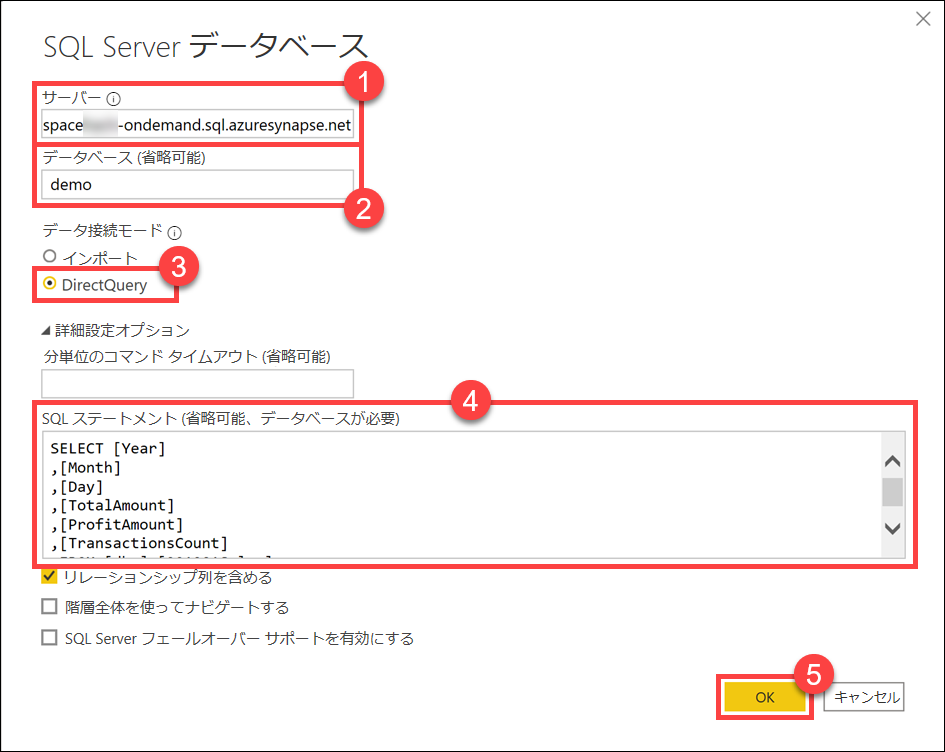

5. (プロンプトで指示されたら) 左側で [**Microsoft アカウント**」 オプションを選択し、**サインイン** (Synapse ワークスペースに接続したサイト同じ資格情報を使用) して 「**接続**」 をクリックします。

    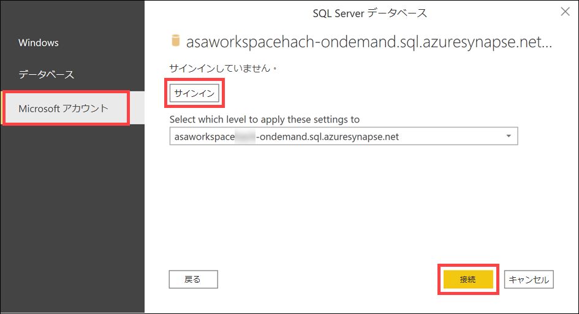

6. データのプレビュー ウィンドウで 「**読み込み**」 を選択し、接続が構成されるまで待ちます。

    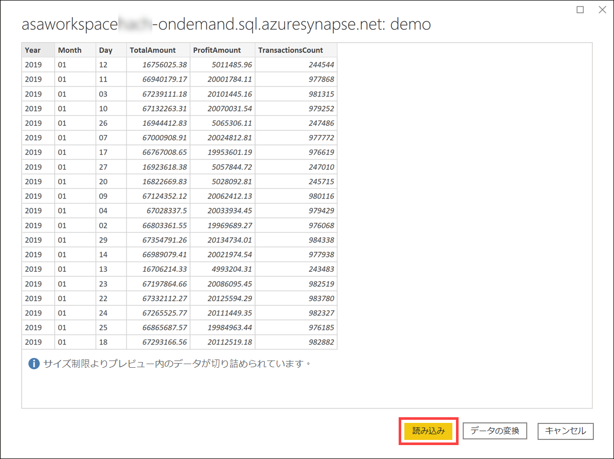

7. データを読み込んだ後、「**視覚化**」 メニューで 「**折れ線グラフ**」 を選択します。

    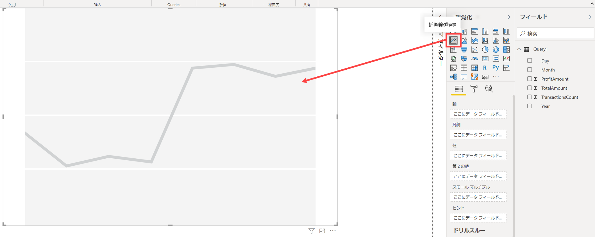

8. 折れ線グラフの視覚化を選択し、以下のように構成して毎日の Provit、Amount、Transactions カウントが表示されるようにします。

    - **軸**: `Day`
    - **値**: `ProfitAmount`、`TotalAmount`
    - **第 2 の値**: `TransactionsCount`

    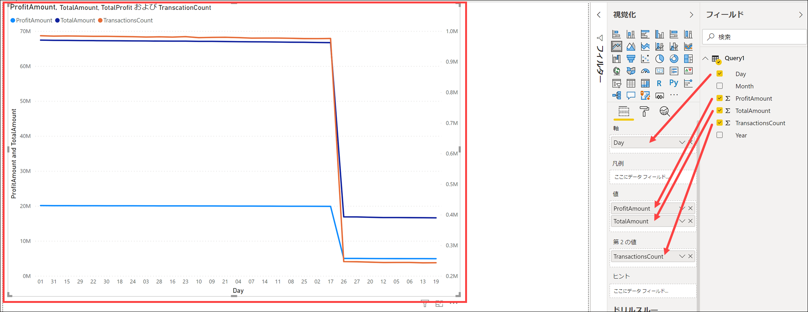

9. 折れ線グラフの視覚化を選択し、トランザクションに日にちで昇順に並べ替えられるように構成します。このためには、グラフの視覚化の隣にある 「**その他のオプション**」 を選択します。

    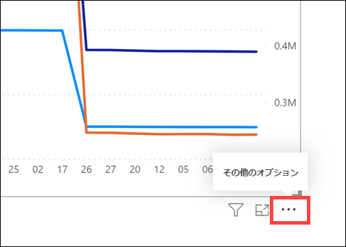

    「**昇順で並べ替え**」 を選択します。

    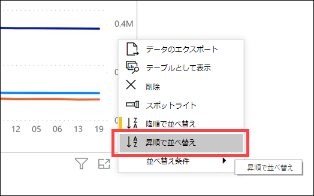

    再びグラフの視覚化の隣にある 「**その他のオプション**」 を選択します。

    

    「**並べ替え**」 を選択した後、「**日付**」 を選択します。

    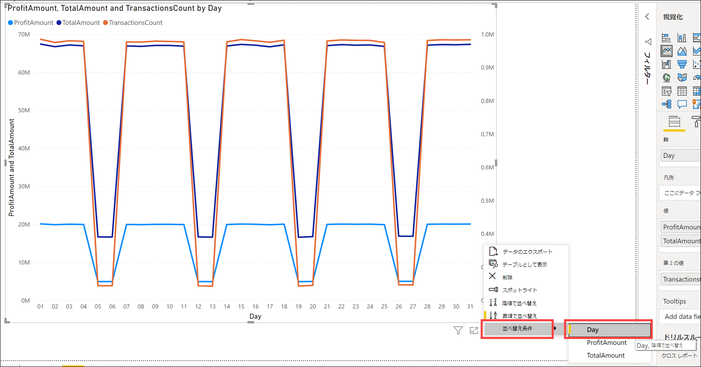

10. 左上コーナーで 「**保存**」 をクリックします。

    

11. ファイル名 (`synapse-sql-serverless` など) を指定し、「**保存**」 をクリックします。

    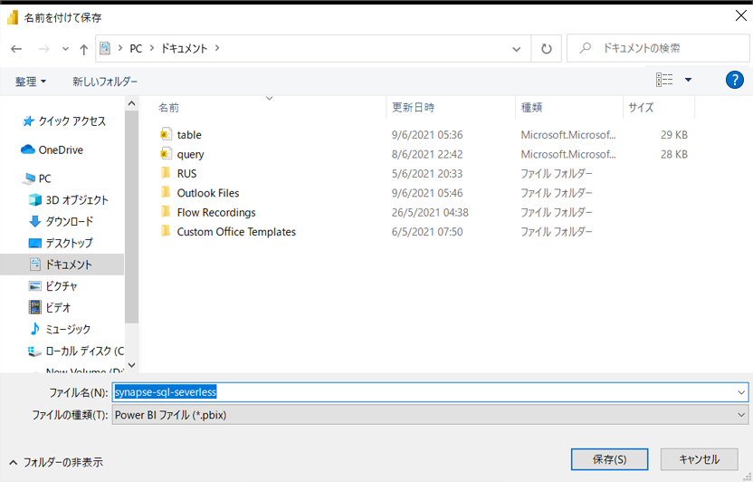

12. 保存されたレポートの上で 「**公開**」 をクリックします。Power BI ポータルおよび Synapse Studio と同じアカウントを使用して、Power BI Desktop にサインインしていることを確認してください。ウィンドウの右上コーナーから適切なアカウントに切り替えられます。「**Power BI へ発行**」 ダイアログで、Synapse にリンクしたワークスペースを選択し (たとえば、**synapse-training**)、「**選択**」 をクリックします。

    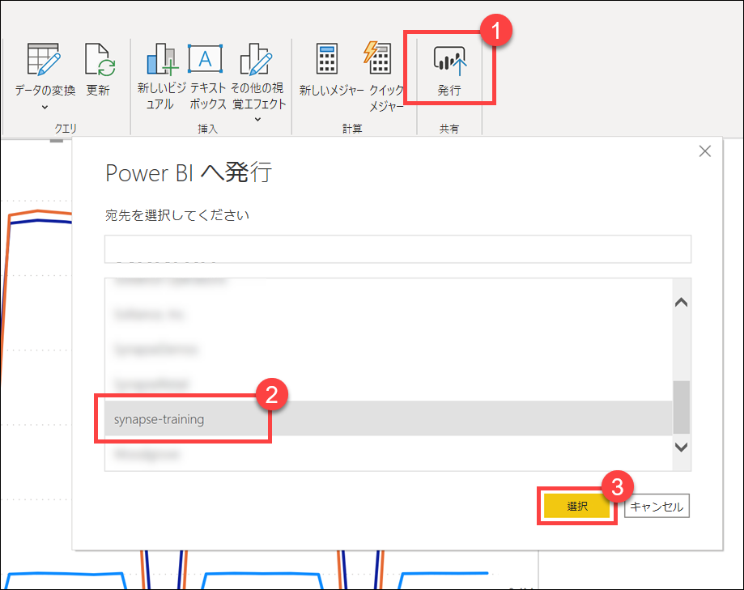

13. 発行操作が完了するまで待ちます。

    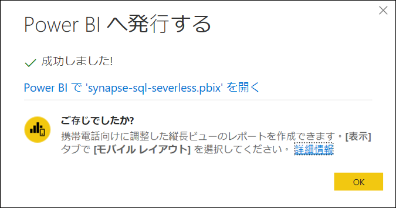


14. Power BI サービスに戻るか、これを閉じていた場合は新しいブラウザー タブでそこまで移動します (<https://powerbi.microsoft.com/>)。

15. 先ほど作成した **synapse-training** ワークスペースを選択します。これがすでに開いている場合は、ページをリフレッシュして新しいレポートとデータセットが表示されるようにします。

    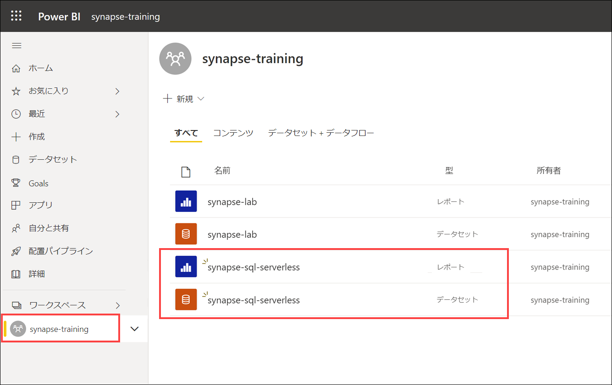

16. ページの右上で 「**設定**」 歯車アイコンを選択し、「**設定**」 を選択します。歯車アイコンが表示されていない場合は、省略記号 (...) を使用してメニュー項目を表示する必要があります。

    

17. 「**データセット**」 タブ **(1)** を選択してから **synapse-sql-serverless** データセット **(2)** を選択します。`Data source credentials` に、資格情報が無効なのでデータ ソースを更新できないというエラー メッセージが表示されたら、「**資格情報を編集**」 を選択します (3)。このセクションが表示されるまで数秒かかるかもしれません。

    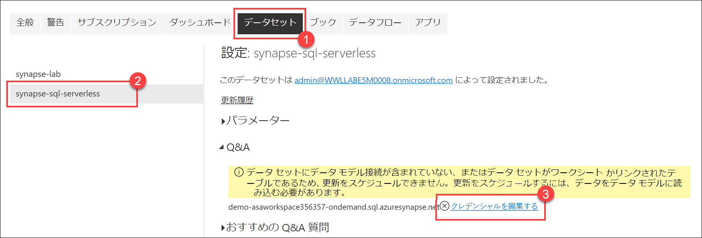

18. 表示されるダイアログで、「**OAuth2**」 認証方法を選択し、「**サインイン**」 を選択します。プロンプトで指示されたら資格情報を入力します。

    

19. [Azure Synapse Studio](https://web.azuresynapse.net) で 「**開発**」 ハブに移動します。

    

20. Power BI グループを展開し、Power BI リンク サービス (`handson_powerbi` など) を展開して 「**Power BI レポート**」 を右クリックします。「**更新**」 を選択して、レポートのリストを更新します。このラボで作成された 2 つの Power BI レポートが表示されるはずです (`synapse-lab` と `synapse-sql-serverless`)。

    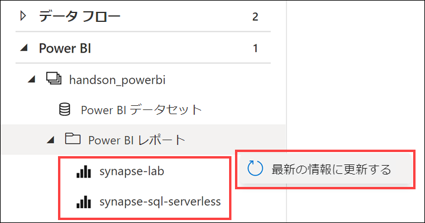

21. **`Synapse-lab`** レポートを選択します。Synapse Studio 内で直接、レポートを表示して編集できます!

    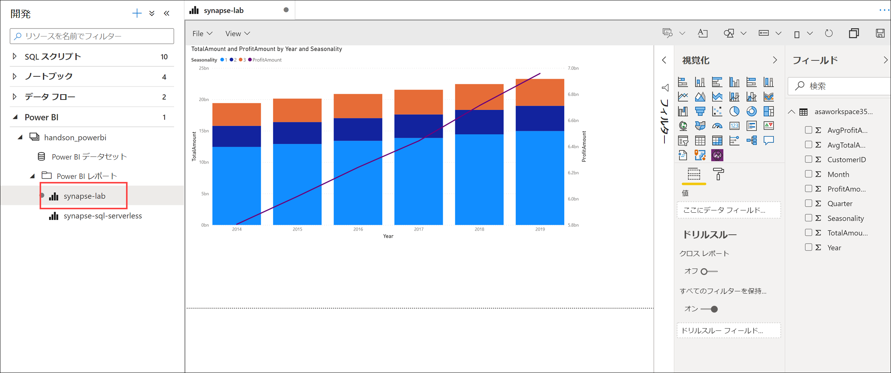

22. **`Synapse-sql-serverless`** レポートを選択します。このレポートも表示して編集できるはずです。

    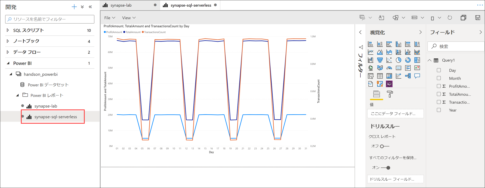
