# モジュール 17 ? Azure Synapse Analytics で統合された機械学習プロセスを実行する

このラボでは、Azure Synapse Analytics で統合されたエンドツーエンドの Azure Machine Learning および Azure Cognitive Services について説明します。リンク サービスを使用して Azure Synapse Analytics ワークスペースを Azure Machine Learning ワークスペースに接続する方法を学習した後、Spark テーブルからのデータを使用する Automated ML 実験を開始します。また、Azure Machine Learning または Azure Cognitive Services からトレーニング済みのモデルを使用して SQL プール テーブルでデータを強化し、Power BI で予測結果を提示する方法も学びます。

ラボを完了すると、Azure Synapse Analytics と Azure Machine Learning 間の統合をもとに構築されたエンドツーエンドの機械学習プロセスの主要な手順を理解できます。

## ラボの詳細

- [モジュール 17 ? Azure Synapse Analytics で統合された機械学習プロセスを実行する](#module-17---perform-integrated-machine-learning-processes-in-azure-synapse-analytics)
  - [ラボの詳細](#lab-details)
  - [前提条件](#pre-requisites)
  - [実践ラボの前](#before-the-hands-on-lab)
    - [タスク 1: Azure Synapse Analytics ワークスペースを作成して構成する](#task-1-create-and-configure-the-azure-synapse-analytics-workspace)
    - [タスク 2: このラボの追加リソースを作成して構成する](#task-2-create-and-configure-additional-resources-for-this-lab)
  - [演習 0: 専用 SQL プールを起動する](#exercise-0-start-the-dedicated-sql-pool)
  - [演習 1: Azure Machine Learning のリンク サービスを作成する](#exercise-1-create-an-azure-machine-learning-linked-service)
    - [タスク 1: Synapse Srudio で Azure Machine Learning のリンク サービスを作成して構成する](#task-1-create-and-configure-an-azure-machine-learning-linked-service-in-synapse-studio)
    - [タスク 2: Synapse Studio で Explore Azure Machine Learning 統合機能を確認する](#task-2-explore-azure-machine-learning-integration-features-in-synapse-studio)
  - [演習 2: Spark テーブルからのデータを使用して Auto ML 実験を開始する](#exercise-2-trigger-an-auto-ml-experiment-using-data-from-a-spark-table)
    - [タスク 1: Spark テーブルで回帰 Auto ML 実験をトリガーする](#task-1-trigger-a-regression-auto-ml-experiment-on-a-spark-table)
    - [タスク 2: Azure Machine Learning ワークスペースの実験詳細を表示する](#task-2-view-experiment-details-in-azure-machine-learning-workspace)
  - [演習 3: 訓練されたモデルを使用してデータを強化する](#exercise-3-enrich-data-using-trained-models)
    - [タスク 1: Azure Machine Learning のトレーニングされたモデルを使用して SQL プール テーブルのデータを強化する](#task-1-enrich-data-in-a-sql-pool-table-using-a-trained-model-from-azure-machine-learning)
    - [タスク 2: Azure Cognitive Services のトレーニングされたモデルを使用して Spark テーブルのデータを強化する](#task-2-enrich-data-in-a-spark-table-using-a-trained-model-from-azure-cognitive-services)
    - [タスク 3: Machine Learning ベースの強化手順を Synapse パイプラインで統合する](#task-3-integrate-a-machine-learning-based-enrichment-procedure-in-a-synapse-pipeline)
  - [演習 4: Power BI を使用して予測結果を提供する](#exercise-4-serve-prediction-results-using-power-bi)
    - [タスク 1: Power BI レポートで予測結果を表示する](#task-1-display-prediction-results-in-a-power-bi-report)
  - [リソース](#resources)

## 前提条件

ラボのコンピューターまたは VM で [Power BI Desktop](https://www.microsoft.com/download/details.aspx?id=58494) を起動します。

## 実践ラボの前

> **注:** ホストされたラボ環境を**使用しておらず**、ご自分の Azure サブスクリプションを使用している場合は、`Before the hands-on lab` の手順のみを完了してください。その他の場合は、演習 0 にスキップします。

このラボの演習を始める前に、Azure Synapse Analytics ワークスペースが適切に構成されていることを確認してください。以下のタスクを実行してワークスペースを構成します。

### タスク 1: Azure Synapse Analytics ワークスペースを作成して構成する

>**注**
>
>利用できる他のラボのひとつを実行している間に、Synapse Analytics ワークスペースをすでに作成して構成している場合は、このタスクを再び実行しないでください。次のタスクに移ることができます。ラボは Synapse Analytics ワークスペースを共有するよう意図されているので、一度だけ作成してください。

**ホストされたラボ環境を使用していない場合は**、[Azure Synapse Analytics ワークスペースのデプロイ](https://github.com/solliancenet/microsoft-data-engineering-ilt-deploy/blob/main/setup/17/asa-workspace-deploy.md)の手順に従い、ワークスペースを作成して構成します。

### タスク 2: このラボの追加リソースを作成して構成する

**ホストされたラボ環境を使用していない場合は**、[ラボ 01 のリソースをデプロイ](https://github.com/solliancenet/microsoft-data-engineering-ilt-deploy/blob/main/setup/17/lab-01-deploy.md)の手順に従い、このラボの追加リソースをデプロイしてください。デプロイが完了すると、このラボの演習を進めることができます。

## 演習 0: 専用 SQL プールを起動する

このラボでは専用 SQL プールを使用します。最初の手順として、これが一時停止状態でないことを確認してください。一時停止している場合は、以下の手順に従って起動します。

1. Synapse Studio (<https://web.azuresynapse.net/>) を開きます。

2. 「**管理**」 ハブを選択します。

    

3. 左側のメニューで 「**SQL プール**」 を選択します **(1)**。専用 SQL プールが一時停止状態の場合は、プールの名前の上にマウスを動かして 「**再開**」  (2) を選択します。

    

4. プロンプトが表示されたら、「**再開**」 を選択します。プールが再開するまでに、1 ～ 2 分かかります。

    ![「再開] ボタンが強調表示されています。](media/resume-dedicated-sql-pool-confirm.png "Resume")

> 専用 SQL プールが再開する間、**続行して次の演習に進みます**。

## 演習 1: Azure Machine Learning のリンク サービスを作成する

この演習では、Synapse Srudio で Azure Machine Learning のリンク サービスを作成して構成します。リンク サービスを利用できるようになったら、Synapse Studio で Azure Machine Learning 統合を確認します。

### タスク 1: Synapse Srudio で Azure Machine Learning のリンク サービスを作成して構成する

Synapse Analytics リンク サービスはサービス プリンシパルを使用して Azure Machine Learning で認証を行います。サービス プリンシパルは、`Azure Synapse Analytics GA Labs` という Azure Active Directory のアプリケーションに基づいており、すでにデプロイ手順で作成されています。サービス プリンシパルに関連のあるシークレットも作成され、`ASA-GA-LABS` という名前で Azure Key Vault インスタンスに保存されています。

>**注**
>
>このレポートのラボでは、単一の Azure AD テナントで Azure AD アプリケーションを使用します。つまり、関連のあるサービス プリンシパルはひとつだけになります。このため、Azure AD アプリケーションとサービス プリンシパルという言葉は互換的に使用されます。Azure AD アプリケーションとセキュリティ プリンシパルの詳細な説明については、[Azure Active Directory でのアプリケーションおよびサービス プリンシパル オブジェクト](https://docs.microsoft.com/azure/active-directory/develop/app-objects-and-service-principals)を参照してください。

1. サービス プリンシパルを表示するには、Azure portal を開き、Azure Active Directory でお使いになっているインスタンスに移動してください。`App registrations` セクションを選択すると、「所有アプリケーション」 タブに `Azure Synapse Analytics GA Labs SUFFIX` (`SUFFIX` はラボのデプロイ中に使用されたあなたの一意のサフィックス) アプリケーションが表示されるはずです。

    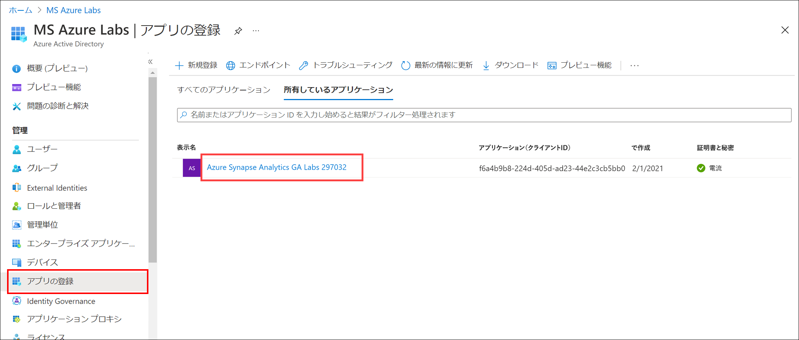

2. プロパティを表示したいアプリケーションを選択し、`Application (client) ID` プロパティの値をコピーします (リンク サービスを構成する際、必要になります)。

    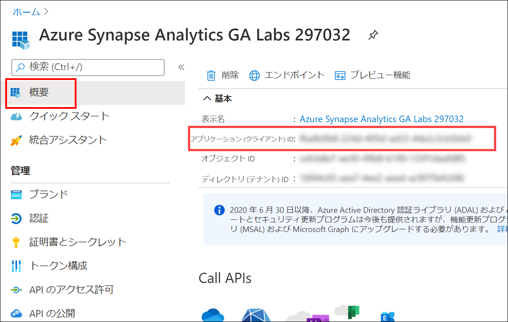

3. シークレットを表示するには、Azure Portal を開き、リソース グループで作成された Azure Key Vault インスタンスに移動します。「シークレット」 セクションを選択すると、`ASA-GA-LABS` シークレットが表示されます。

    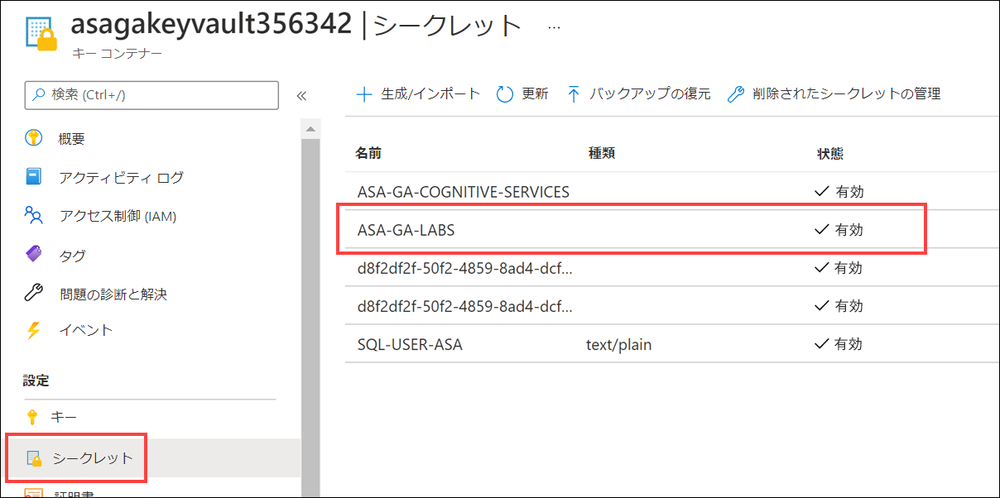

4. まず、サービス プリンシパルに Azure Machine Learning ワークスペースを使用する許可があることを確認する必要があります。Azure Portal を開き、リソース グループで作成された Azure Machine Learning ワークスペースに移動します。左側で 「アクセス制御 (IAM)」 セクションを選択した後、「+ 追加」 と 「ロールの割り当てを追加」 を選択します。「ロールの割り当てを追加」 ダイアログで 「共同作成者」 の役割を選択し、「Azure Synapse Analytics GA Labs SUFFIX」 (`SUFFIX` はラボのデプロイ中に使用した一意のサフィックス) サービス プリンシパルを選んだ後、「保存」 を選択します。

    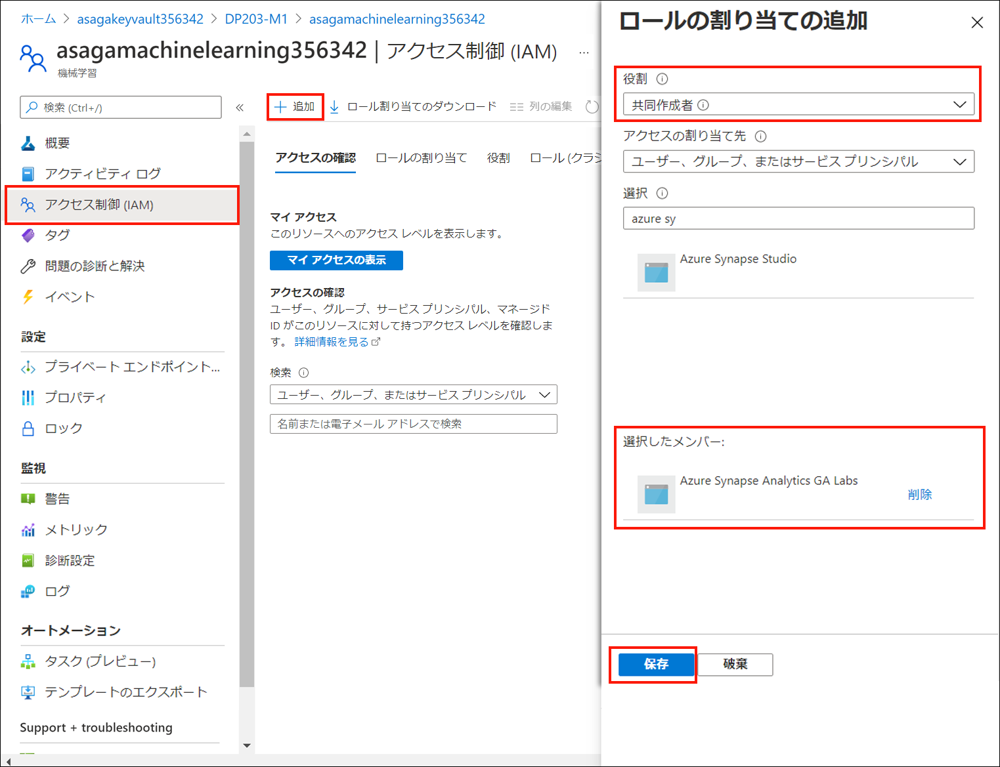

    これで Azure Machine Learning リンク サービスを作成できます。

1. Synapse Studio (<https://web.azuresynapse.net/>) を開きます。

2. 「**管理**」 ハブを選択します。

    

3. `Linked services` を選択してから `+ New` を選択します。`New linked service` の検索フィールドに`Azure Machine Learning` と入力します。`Azure Machine Learning` オプションを選択してから `Continue` を選択します。

    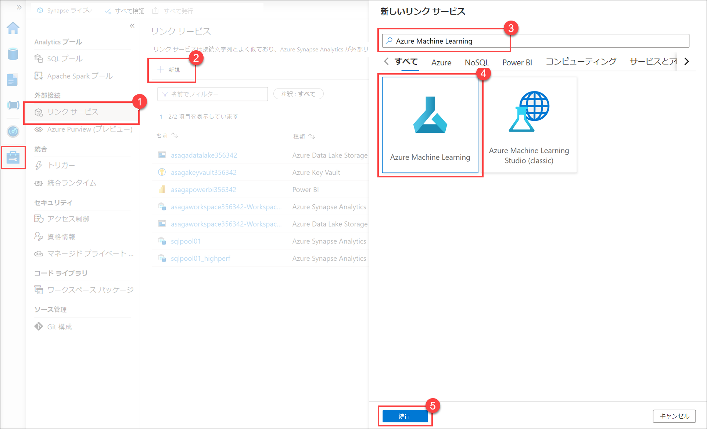

4. `New linked service (Azure Machine Learning)` ダイアログで、以下のプロパティを入力します。

   - 名前: `asagamachinelearning01` と入力します。
   - Azure サブスクリプション: お使いになっているリソース グループが含まれている Azure サブスクリプションが選択されていることを確認します。
   - Azure Machine Learning ワークスペース名: Azure Machine Learning ワークスペースが選択されていることを確認します。
   - `Tenant identifier` がすでに入力されていることがわかります。
   - サービス プリンシパル ID: 先ほどコピーしたアプリケーション クライアント ID を入力します。
   - `Azure Key Vault` オプションを選択します。
   - AKV リンク サービス: Azure Key Vault サービスが選択されていることを確認します。
   - シークレット名: `ASA-GA-LABS` と入力します。

    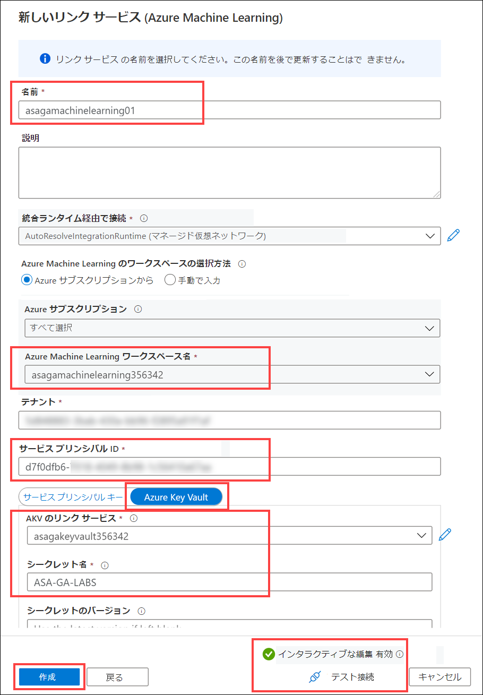

5. 次に `Test connection` を選択し、すべての設定が適正なことを確認します。その後、`Create` を選択します。これで Azure Machine Learning リンク サービスを Synapse Analytics ワークスペースで作成できます。

    >**重要**
    >
    >リンク サービスは、ワークスペースで公開するまで完了しません。Azure Machine Learning リンク サービスのそばにインジケーターがあります。発行するには、`Publish all` を選択してから `Publish` を選択してください。

    

### タスク 2: Synapse Studio で Explore Azure Machine Learning 統合機能を確認する

まず、機械学習モデルのトレーニング プロセスの起点として Spark テーブルを作成する必要があります。

1. 「**データ**」 ハブを選択します。

    

2. 「**リンク**」 タブを選択します。

3. プライマリ `Azure Data Lake Storage Gen 2` アカウントで `wwi-02` ファイル システムを選択した後、`wwi-02\sale-small\Year=2019\Quarter=Q4\Month=12\Day=20191201` で `sale-small-20191201-snappy.parquet` ファイルを選択します。ファイルを右クリックして 「新しいノートブック」 → 「新しい Spark テーブル」 を選択します。

    

4. Spark クラスターをノートブックに添付し、言語が `PySpark (Python)` に設定されていることを確認します。

    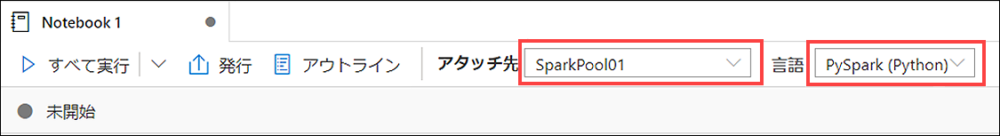

5. ノートブック セルの内容を以下のコードに置き換えて、セルを実行します。

    ```python
    import pyspark.sql.functions as f

    df = spark.read.load('abfss://wwi-02@<data_lake_account_name>.dfs.core.windows.net/sale-small/Year=2019/Quarter=Q4/Month=12/*/*.parquet',
        format='parquet')
    df_consolidated = df.groupBy('ProductId', 'TransactionDate', 'Hour').agg(f.sum('Quantity').alias('TotalQuantity'))
    df_consolidated.write.mode("overwrite").saveAsTable("default.SaleConsolidated")
    ```

    >**注**:
    >
    >`<data_lake_account_name>` は Synapse Analytics プライマリ データ レイク アカウントの実際の名前に置き換えてください。

    コードは 2019 年 12 月の利用可能なデータをすべて取得して `ProductId`、`TransactionDate`、`Hour` レベルで集計し、販売された製品の合計数量を `TotalQuantity` として計算します。その結果は、`SaleConsolidated` という名前で Spark テーブルに保存されます。「データ」 ハブでこのテーブルを表示するには、「ワークスペース」 セクションで `default (Spark)` データベースを展開します。テーブルが `Tables` フォルダーに表示されます。テーブル名の右側にある 3 つの点を選択すると、コンテキスト メニューで 「Machine Learning」 オプションを表示できます。

    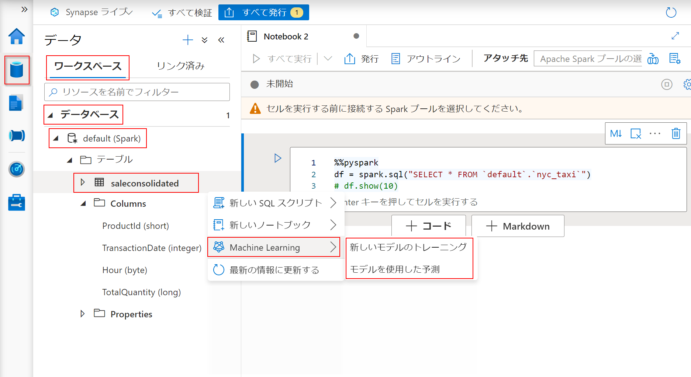

    `Machine Learning` セクションでは以下のオプションを利用できます。

    - 新しいモデルで強化: AutoML 実験を開始して新しいモデルのトレーニングを実行できます。
    - 既存のモデルで強化: 既存の Azure Cognitive Services モデルを使用できます。

## 演習 2: Spark テーブルからのデータを使用して Auto ML 実験を開始する

この演習では、Auto ML 実験の実行を開始し、その進捗状況を Azure Machine Learning Studio で表示します。

### タスク 1: Spark テーブルで回帰 Auto ML 実験をトリガーする

1. 新しい AutoML 実験の実行を開始するには、「データ」 ハブを選択した後、`saleconsolidated` Spark テーブルの右側で `...` を選択し、コンテキスト メニューを有効にします。

    

2. コンテキスト メニューで `Enrich with new model` を選択します。

    

    `Enrich with new model` ダイアログでは、Azure Machine Learning 実験のプロパティを設定できます。値は次のように指定します。

    - **Azure Machine Learning ワークスペース**: 変更しません。Azure Machine Learning ワークスペース名が自動的に読み込まれるはずです。
    - **実験名**: 変更しません。名前は自動的に提案されます。
    - **最良のモデル名**: 変更しません。名前は自動的に提案されます。この名前は後ほど、Azure Machine Learning Studio でモデルを識別する際、必要になるので保存しておいてください。
    - **ターゲット列**: `TotalQuantity(long)` を選択します - これは予測するための機能です。
    - **Spark プール**: 変更しません。Spark プール名が自動的に読み込まれます。

    

    Apache Spark の構成の詳細に留意してください。

    - 使用する実行子の数
    - 実行子のサイズ

3. `Continue` を選択し、Auto ML 実験の構成を進めます。

4. 次にモデルのタイプを選択します。この場合は、`Regression` になります。連続する数値を予測しようとしているためです。モデルのタイプを選択した後、`Continue` を選択して先に進みます。

    

5. `Configure regression model` ダイアログで次のように値を入力します。

   - **プライマリ メトリック**: 変更しません。既定で `Spearman correlation` が提案されているはずです。
   - **トレーニング ジョブ時間 (時間)**: 0.25 に設定し、プロセスが 15 分後に終了するよう強制的に設定します。
   - **最大同時反復**: 変更しません。
   - **ONNX モデルの互換性**: `Enable` に設定します。現在、Synapse Studio 統合実験をサポートしているのは ONNX モデルだけなので、これは非常に重要です。

6. すべての値を設定したら `Create run` を選択して続行します。

    

    実行を送信すると、通知が表示され、Auto ML の実行が送信されるまで待つよう指示されます。画面右上で `Notifications` アイコンを選択すると、通知のステータスをチェックできます。

    

    実行が送信されると、別の通知が届き、Auto ML 実験実行の実際の開始について知らせてくれます。

    

    >**注**
    >
    >`Create run`  オプションのほかにも、`Open in notebook option` オプションがあります。このオプションを選択すると、Auto ML 実行の送信に使用される実際の Python コードを確認できます。演習として、このタスクの手順をすべてやり直すことができますが、`Create run` の代わりに `Open in notebook` を選択してください。次のようなノートブックが表示されます。
    >
    >
    >
    >少し時間をかけて、生成されたコードに目を通してください。

### タスク 2: Azure Machine Learning ワークスペースの実験詳細を表示する

1. 開始したばかりの実験の実行を表示するには、Azure Portal を開き、リソース グループを選択します。その後、リソース グループから Azure Machine Learning ワークスペースを選択します。

    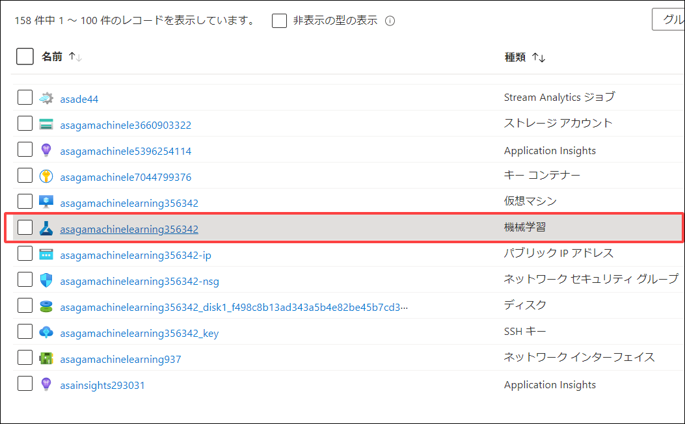

2. `Launch studio` ボタンを探して選択し、Azure Machine Learning Studio を起動します。

    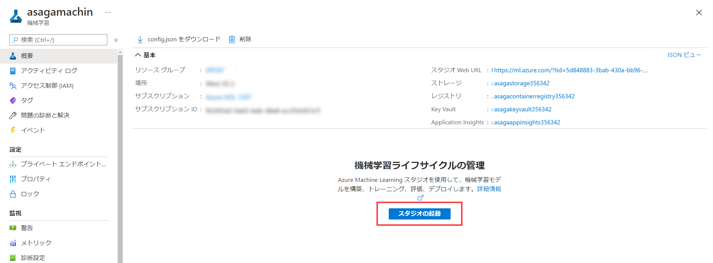

3. Azure Machine Learning Studio で左側にある `Automated ML` セクションを選択し、開始したばかりの実験の実行を特定します。実験名、`Running status`、`local` コンピューティング先を確認してください。

    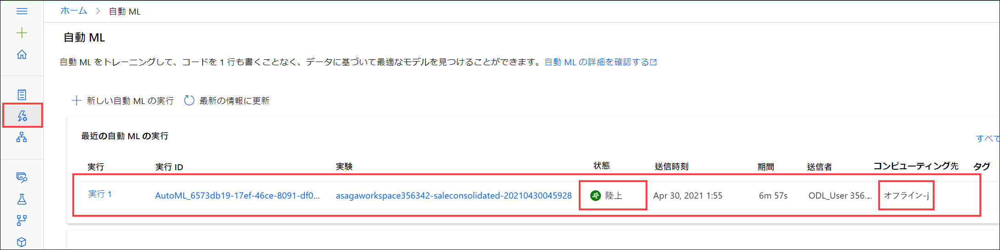

    コンピューティング先が `local` になっているのは、AutoML 実験を Synapse Analytics 内の Spark プールで実行しているためです。Azure Machine Learning の観点からすると、Azure Machine Learning のコンピューティング リソースではなく、「ローカル」 コンピューティング リソースで実験を行っているのです。

4. 実行を選択した後、`Models` タブを選択して、この実行で構築されるモデルの最新リストを表示します。モデルはメトリック値 (この場合は`Spearman correlation`) の降順で列記され、最高のものが最初に表示されます。

    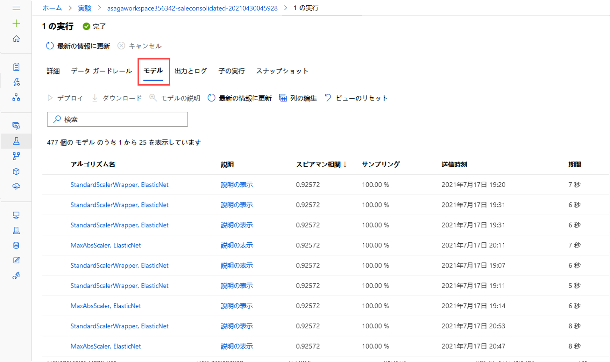

5. 最良のモデル (リストの最上部にあるモデル) を選択し、`View Explanations` をクリックして `Explanations (preview)`」 タブでモデルの説明を確認します。

6. 「**集計機能の重要度**」 タブを選択します。これで、入力機能のグローバルな重要性を確認できます。お使いになっているモデルで予測値に最も影響を与える機能は `ProductId` です。

    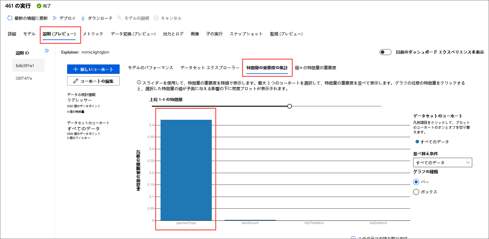

7. 次に、Azure Machine Learning Studio の左側で `Models` セクションを選択し、Azure Machine Learning で登録されている最良のモデルを確認します。これにより、このラボで後ほど、このモデルを参照できます。

    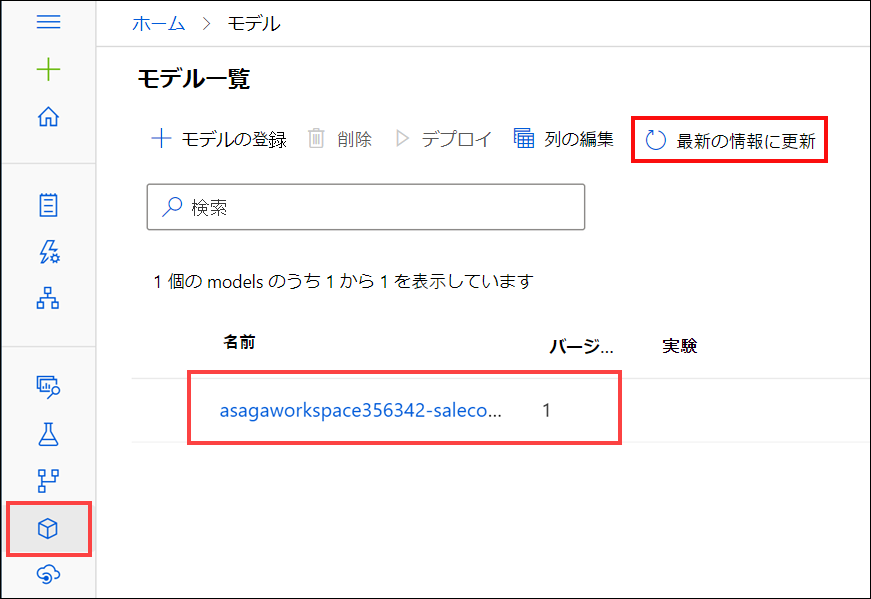

## 演習 3: 訓練されたモデルを使用してデータを強化する

この演習では、トレーニングが行われた既存のモデルを使用して、データを予測します。タスク 1 では Azure Machine Learning サービスのトレーニング済みモデルを使用し、タスク 2 では Azure Cognitive Services のモデルを利用します。最後に、タスク 1 で作成された予測格納手順を Synapse パイプラインに含めます。

### タスク 1: Azure Machine Learning のトレーニングされたモデルを使用して SQL プール テーブルのデータを強化する

1. Synapse Studio に戻り、「**データ**」 ハブを選択します。

    

2. 「Workspace」 タブを選択し、`SQLPool01 (SQL)` データベースで `wwi.ProductQuantityForecast` テーブルを見つけます (「データベース」 に含まれています)。テーブル名の右側で `...` を選択してコンテキスト メニューを開き、「新しい SQL スクリプト」 > 「上位 100 行を選択」 の順に選択します。テーブルには次の列が含まれています。

- **ProductId**: 予測したい製品の識別子
- **TransactionDate**: 予測したい将来の日付
- **Hour**: 予測したい将来の日付の時間
- **TotalQuantity**: 指定された製品、日付、時間で予測したい値

    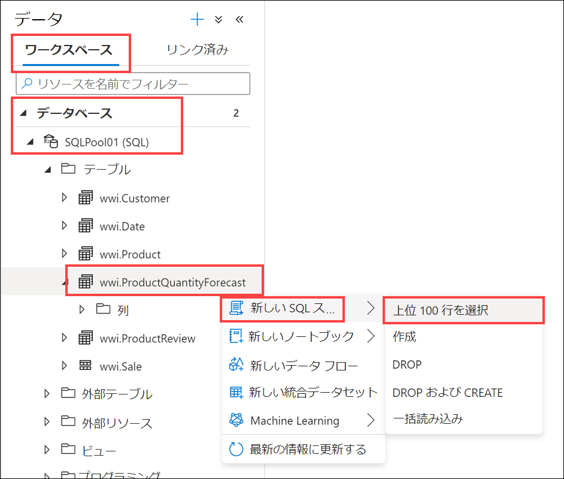

    > すべての行で `TotalQuantity` はゼロになっています。これは、取得したい予測値のプレースホルダーだからです。

3. Azure Machine Learning でトレーニングを行ったばかりのモデルを使用するには、`wwi.ProductQuantityForecast` のコンテキスト メニューを有効にし、「Machine Learning」 > 「既存のモデルで強化」 の順に選択します。

    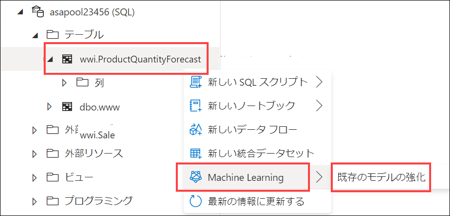

4. これにより `Enrich with existing model` ダイアログが開き、モデルを選択できます。最も直近のモデルを選択し、`Continue` を選択します。

    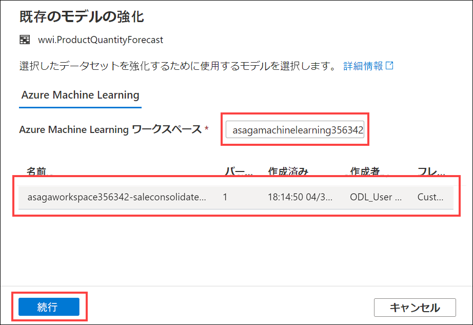

5. 次に入力および出力列のマッピングを管理します。ターゲット テーブルおよびモデルのトレーニングで使用されたテーブルの列名は一致するため、すべてのマッピングは既定の提案どおりのままにできます。`Continue` を選択して先に進みます。

    

6. 最後の手順では、予測を行うストアド プロシージャと、シリアル化された形式のモデルを格納するテーブルに名前を付けるオプションがあります。次の値を指定します。

   - **ストアド プロシージャ名:** `「wwi」.「ForecastProductQuantity」`
   - **ターゲット テーブルの選択**: `Create new`
   - **新しいテーブル**: `「wwi」.「Model」`

    「**モデルをデプロイしてスクリプトを開く**」 を選択し、モデルを SQL プールにデプロイします。

    

7. 作成された新しい SQL スクリプトからモデルの ID をコピーします。

    

8. 生成される T-SQL コードは、予測の結果を返すのみで、実際にこれを保存することはありません。予測結果を直接 `「wwi」.「ProductQuantityForecast」` テーブルに保存するには、生成されたコードを以下に置き換え、スクリプトを実行してください (`<your_model_id>` を置き換えた後)。

    ```sql
    CREATE PROC [wwi].[ForecastProductQuantity] AS
    BEGIN

    SELECT
        CAST([ProductId] AS [bigint]) AS [ProductId],
        CAST([TransactionDate] AS [bigint]) AS [TransactionDate],
        CAST([Hour] AS [bigint]) AS [Hour]
    INTO #ProductQuantityForecast
    FROM [wwi].[ProductQuantityForecast]
    WHERE TotalQuantity = 0;

    SELECT
        ProductId
        ,TransactionDate
        ,Hour
        ,CAST(variable_out1 as INT) as TotalQuantity
    INTO
        #Pred
    FROM PREDICT (MODEL = (SELECT [model] FROM wwi.Model WHERE [ID] = '<your_model_id>'),
                DATA = #ProductQuantityForecast,
                RUNTIME = ONNX) WITH ([variable_out1] [real])

    MERGE [wwi].[ProductQuantityForecast] AS target  
        USING (select * from #Pred) AS source (ProductId, TransactionDate, Hour, TotalQuantity)  
    ON (target.ProductId = source.ProductId and target.TransactionDate = source.TransactionDate and target.Hour = source.Hour)  
        WHEN MATCHED THEN
            UPDATE SET target.TotalQuantity = source.TotalQuantity;
    END
    GO
    ```

    上記のコードでは、必ず `<your_model_id>` を実際のモデルの ID (前の手順でコピーしたもの) に置き換えてください。

    >**注**:
    >
    >このストアド プロシージャのバージョンでは、`MERGE` コマンドを使用して `TotalQuantity` フィールドの値を `wwi.ProductQuantityForecast` テーブルで更新します。`MERGE` コマンドは最近、Azure Synapse Analytics に追加されました。詳細については、「Azure Synapse Analytics の新しい MERGE コマンド」(https://azure.microsoft.com/updates/new-merge-command-for-azure-synapse-analytics/)をご覧ください。

9. これで、`TotalQuantity` 列で予測を行う準備が整いました。SQL スクリプトを置き換え、以下のステートメントを実行してください。

    ```sql
    EXEC
        wwi.ForecastProductQuantity
    SELECT
        *
    FROM
        wwi.ProductQuantityForecast
    ```

    `TotalQuantity` 列の値がゼロからゼロ以外の予測中に変わったことがわかります。

    

### タスク 2: Azure Cognitive Services のトレーニングされたモデルを使用して Spark テーブルのデータを強化する

まず、Cognitive Services モデルで入力として使用する Spark テーブルを作成する必要があります。

1. 「**データ**」 ハブを選択します。

    

2. 「リンク済み」 タブを選択します。プライマリ `Azure Data Lake Storage Gen 2` アカウントで、`wwi-02` ファイル システムを選択した後、`wwi-02\sale-small-product-reviews` で `ProductReviews.csv` ファイルを選択します。ファイルを右クリックして 「新しいノートブック」 → 「新しい Spark テーブル」 を選択します。

    

3. Apache Spark プールをノートブックに添付して、`PySpark (Python)` 言語が選択されていることを確認します。

    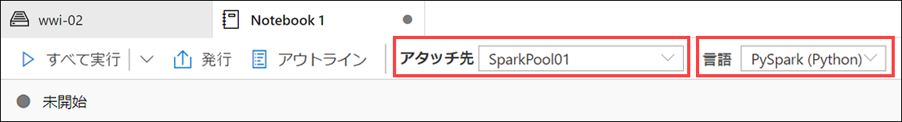

4. ノートブック セルの内容を以下のコードに置き換えて、セルを実行します。

    ```python
    %%pyspark
    df = spark.read.load('abfss://wwi-02@<data_lake_account_name>.dfs.core.windows.net/sale-small-product-reviews/ProductReviews.csv', format='csv'
    ,header=True
    )
    df.write.mode("overwrite").saveAsTable("default.ProductReview")
    ```

    >**注**:
    >
    >`<data_lake_account_name>` は Synapse Analytics プライマリ データ レイク アカウントの実際の名前に置き換えてください。

5. 「データ」 ハブでテーブルを表示するには、「ワークスペース」 セクションで 「既定 (Spark)」 データベースを展開します。**Productreview** テーブルが `Tables` フォルダーに表示されます。テーブル名の右側にある 3 つの点を選択すると、コンテキスト メニューで 「Machine Learning」 オプションが表示されます。その後、「Machine Learning」 > 「既存のモデルで強化」 の順に選択します。 

    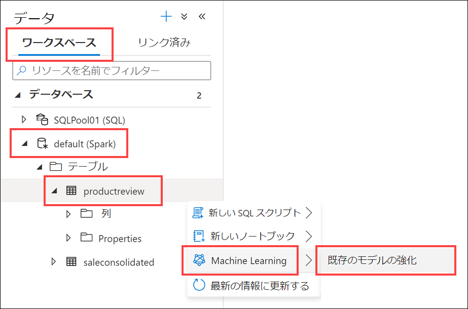

6. `Enrich with existing model` ダイアログで、`Azure Cognitive Services` に含まれている `Text Analytics - Sentiment Analysis` を選択し、`Continue` を選択します。

    

7. 次に、値を以下のように指定します。

   - **Azure サブスクリプション**: お使いになっているリソース グループの Azure サブスクリプションを選択します。
   - **Cognitive Services アカウント**: リソース グループで提供された Cogntive Services アカウントを選択します。`asagacognitiveservices<unique_suffix>` という名前のはずです。ここで `<unique_suffix>` は、Synapse Analytics ワークスペースをデプロイした際にあなたが提供した一意のサフィックスです。
   - **Azure Key Vault リンク サービス**: Synapse Analytics ワークスペースで提供された Azure Key Vault リンク サービスを選択します。`asagakeyvault<unique_suffix>` という名前のはずです。ここで `<unique_suffix>` は Synapse Analytics ワークスペースをデプロイした際にあなたが提供した一意のサフィックスです。
   - **シークレット名**: `ASA-GA-COGNITIVE-SERVICES` と入力します (指定された Cognitive Services アカウントのキーが含まれているシークレットの名前)。

8. `Continue` を選択して次に進みます。

    

9. 次に、値を以下のように指定します。

   - **言語**: `English` を選択します
   - **テキスト列**: `ReviewText (string)` を選択します

10. `Open notebook` を選択して、生成されたコードを表示します。

    >**注**:
    >
    >ノートブックのセルを実行して `ProductReview` Spark テーブルを作成した際、そのノートブックで Spark セッションを開始しました。Synapse Analytics ワークスペースの既定の設定では、これを並行して実行する新しいノートブックを開始することはできません。
    2 つのセルの内容を Cognitive Services 統合コードからそのノートブックにコピーして、すでに開始している Spark セッションで実行する必要があります。2 つのセルをコピーすると、次のような画面になります。
    >
    >

    >**注**:
    >セルをコピーせずに Synapse Studio で生成したノートブックを実行するには、`Monitor` ハブの `Apache Spark applications` セクションを使用すると、実行中の Spark セッションを表示してキャンセルできます。詳細については、「Synapse Studio を使用して Apache Spark アプリケーションを監視する」(https://docs.microsoft.com/azure/synapse-analytics/monitoring/apache-spark-applications)を参照してください。このラボでは、セルをコピーするアプローチを使用して、実行中の Spark セッションをキャンセルして新しいセッションを始める手間暇を省きました。

    ノートブックでセル 2 および 3 を実行すると、データのセンチメント分析結果を得られます。

    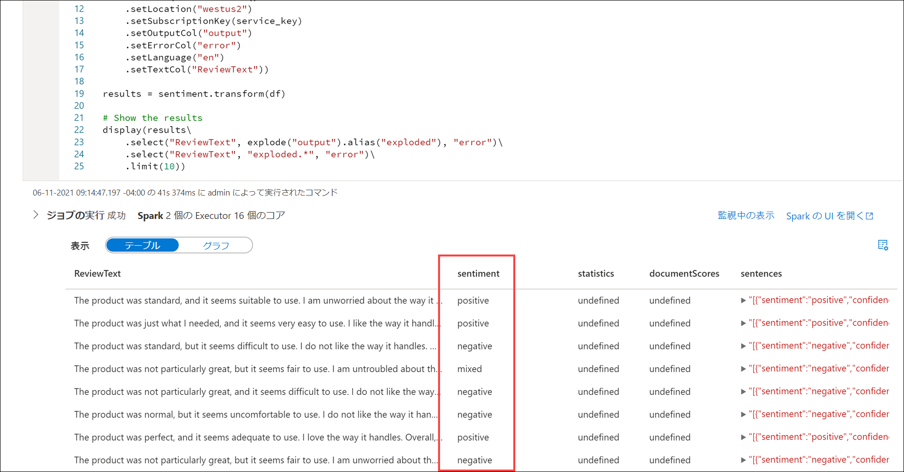

### タスク 3: Machine Learning ベースの強化手順を Synapse パイプラインで統合する

1. **Integrate** ハブを選択します。

    

2. **+** を選択した後、「**パイプライン**」 を選択して新しい Synapse パイプラインを作成します。

    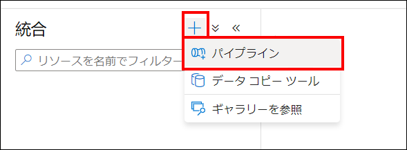

3. プロパティ ペインでパイプラインの名前として `Product Quantity Forecast` と入力し、「**プロパティ**」 ボタンを選択してペインを閉じます。

    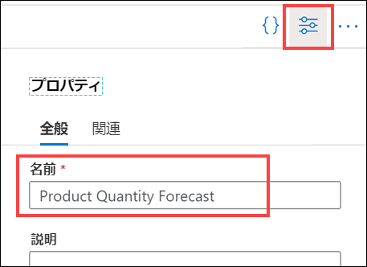

4. 「移動と変換」 セクションで 「データのコピー」 アクティビティを追加し、`Import forecast requests` という名前を付けます。

    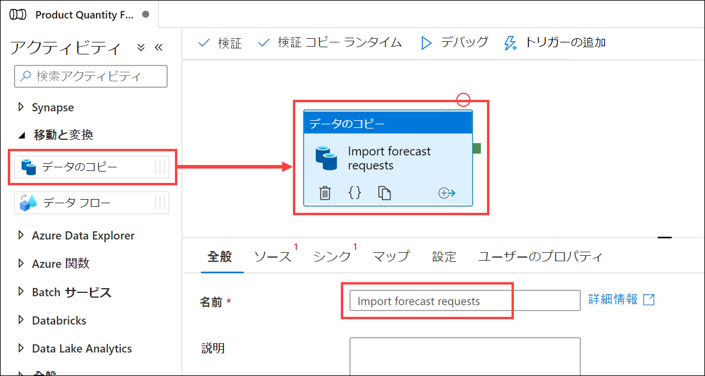

5. コピー アクティビティのプロパティの `Source` セクションで以下の値を入力します。

   - **ソース データベース**: `wwi02_sale_small_product_quantity_forecast_adls` データセットを選択します。
   - **ファイル パスの種類**: `Wildcard file path` を選択します。
   - **ワイルドカード パス**: 最初のテキストボックスに `sale-small-product-quantity-forecast` と入力し、2 番目のボックスには `*.csv` と入力します。

    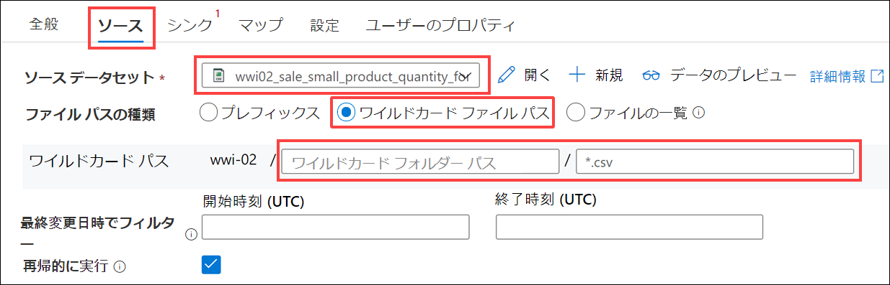

6. コピー アクティビティのプロパティの `Sink` セクションで以下の値を入力します。

   - **シンク データセット**: `wwi02_sale_small_product_quantity_forecast_asa` データセットを選択します。

    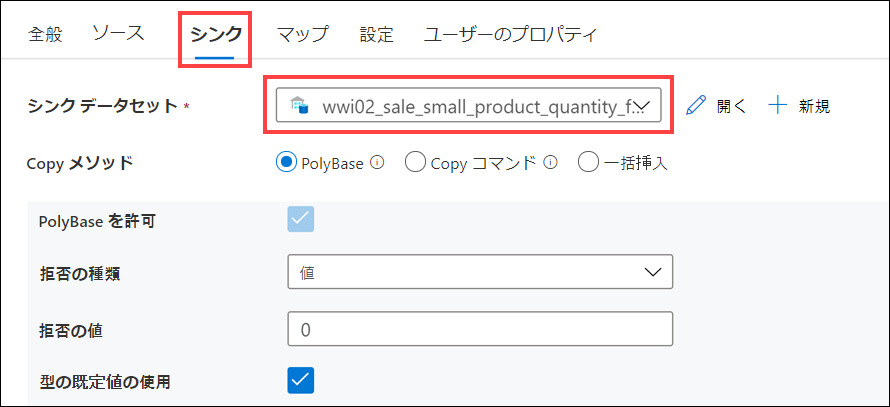

7. コピー アクティビティのプロパティの `Mapping` セクションで、`Import schemas` を選択し、ソースとシンク間のフィールド マッピングをチェックします。

    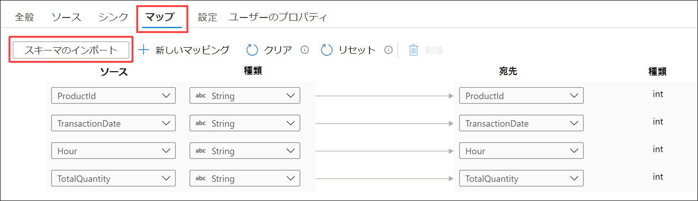

8. コピー アクティビティのプロパティの `Settings` セクションで以下の値を入力します。

   - **ステージングの有効化**: オプションを選択します。
   - **ステージング アカウントのリンク サービス**: `asagadatalake<unique_suffix>` リンク サービスを選択します (`<unique_suffix>` は Synapse Analytics ワークスペースをデプロイした際に提供した一意のサフィックス)。
   - **ストレージ パス**: `staging` と入力します。

    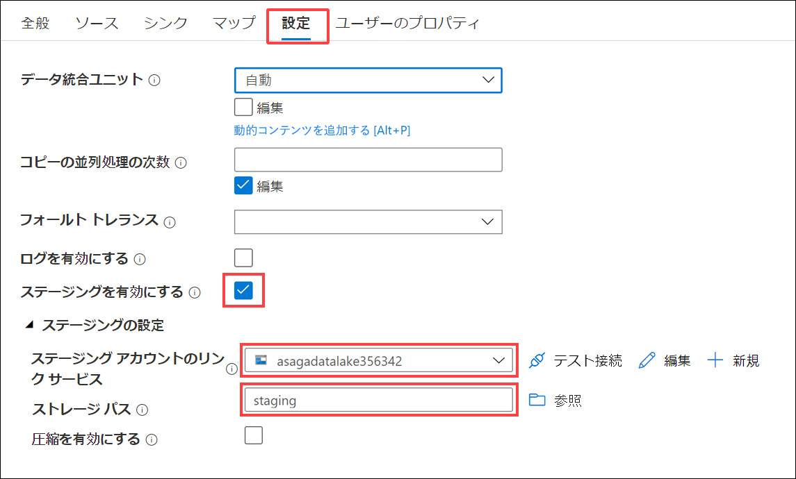

9. 「Synapse」 セクションで 「SQL プール ストアド プロシージャ」 アクティビティを追加し、`Forecast product quantities` という名前を付けます。2 つのパイプライン アクティビティを接続し、データのインポート後にストアド プロシージャが実行することを確認します。

    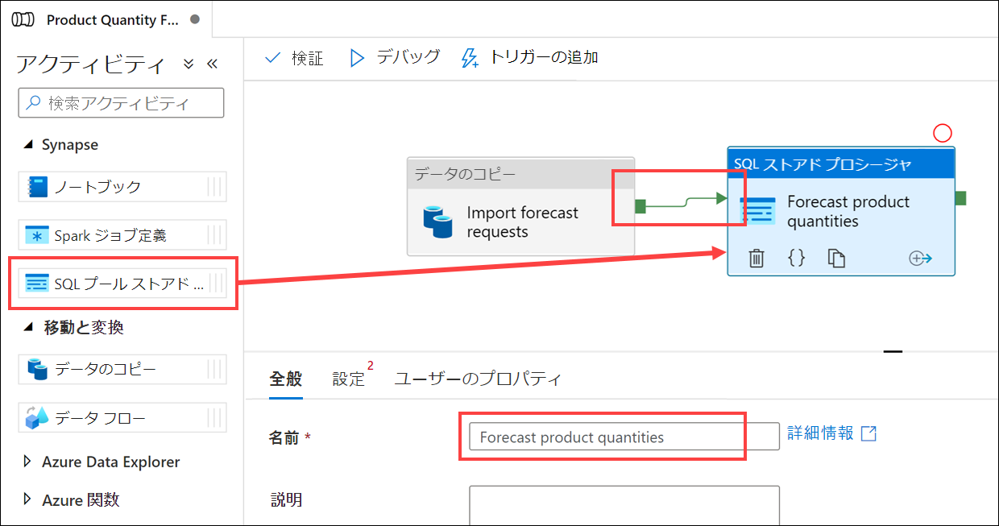

10. ストアド プロシージャ アクティビティのプロパティの `Settings` セクションで以下の値を入力します。

    - **Azure Synapse 専用 SQL プール**: お使いになっている専用 SQL プールを選択します (例: `SQLPool01`)。
    - **ストアド プロシージャ名**: `「wwi」.「ForecastProductQuantity」` を選択します。

    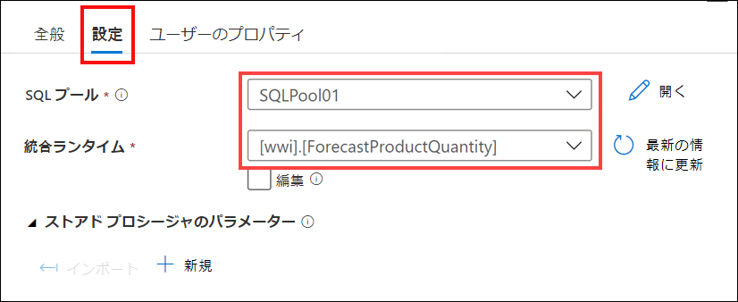

11. 「**デバッグ**」 を選択し、パイプラインが適正に機能することを確認します。

    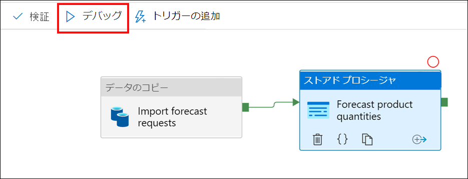

    パイプラインの 「**出力**」 タブにデバッグのステータスが表示されます。両方のアクティビティのステータスが `Succeeded` になるまで待ちます。

    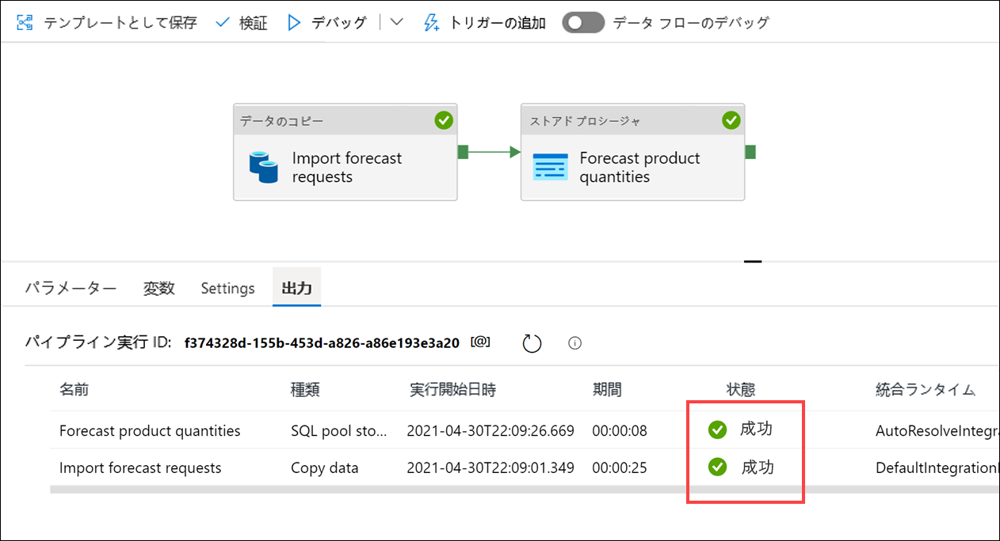

12. 「**すべて公開**」 を選択した後、**公開**してパイプラインを発行します。

13. 「**開発**」 ハブを選択します。

    

14. **+** を選択してから 「**SQL スクリプト**」 を選択します。

    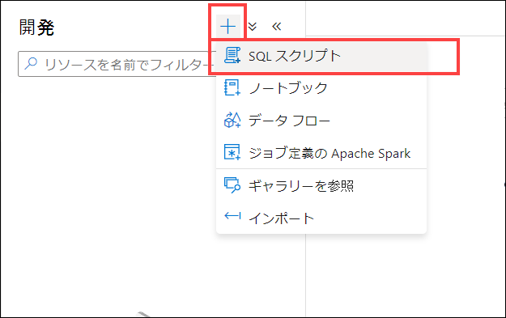

15. 専用 SQL プールに接続し、以下のスクリプトを実行します。

    ```sql
    SELECT  
        *
    FROM
        wwi.ProductQuantityForecast
    ```

    結果には、「時間 = 11」という予測値が表示されるはずです (パイプラインでインポートして行数に対応)。

    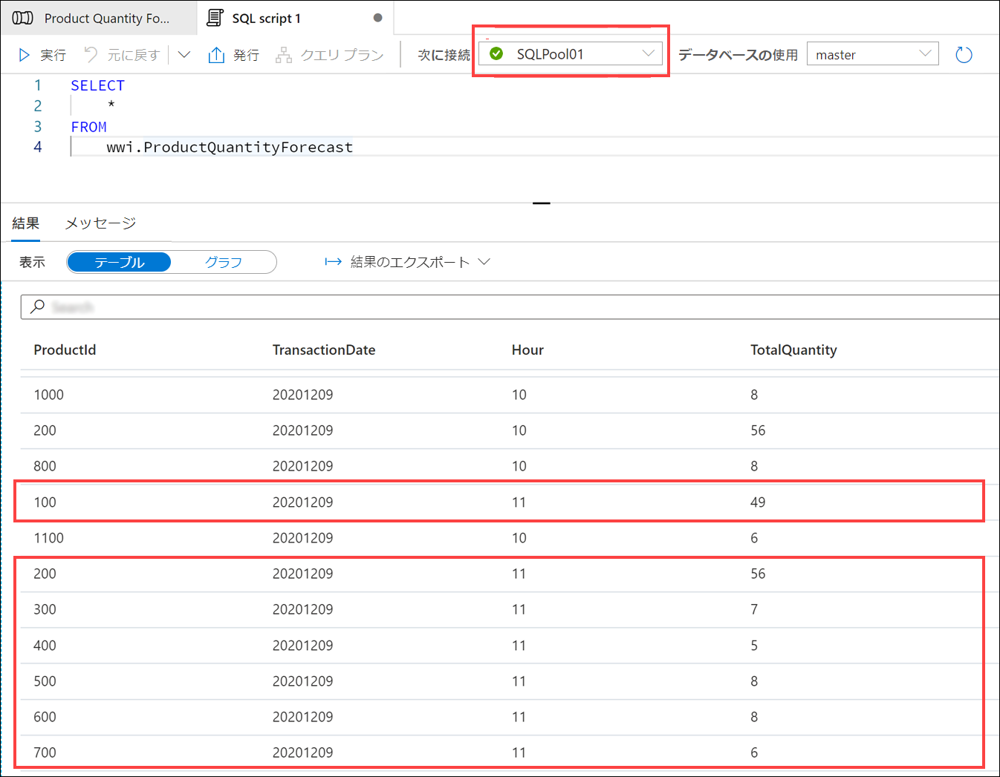

## 演習 4: Power BI を使用して予測結果を提供する

この演習では、Power BI レポートで予測結果を表示します。また、新しい予測データを使用して予測パイプラインをトリガーし、Power BI レポートで更新された数量を表示します。

### タスク 1: Power BI レポートで予測結果を表示する

まず、シンプルな製品数量予測レポートを Power BI に発行します。

1. `ProductQuantityForecast.pbix` ファイルをGitHub リポジトリ[ProductQuantityForecast.pbix](ProductQuantityForecast.pbix) (GitHub ページで ［ダウンロード］ を選択) から ダウンロードしてください。

2. Power BI Desktop でこのファイルを開きます (資格情報がないという警告は無視します)。また、資格情報を更新するよう最初に指示されたら、このメッセージを無視し、接続情報を更新せずにポップアップを閉じてください。

3. レポートの `Home` セクションで [**データの変換**」 を選択します。

    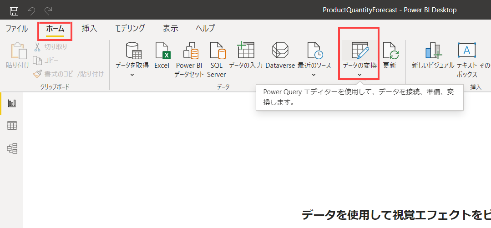

4. `ProductQuantityForecast` クエリの `APPLIED STEPS` リストで [ソース」 エントリの**歯車アイコン**を選択します。

    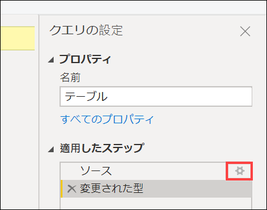

5. サーバーの名前を `asagaworkspace<unique_suffix>.sql.azuresynapse.net` に変更します (`<unique_suffix>` は Synapse Analytics ワークスペースの一意のサフィックス)。[**OK**」 を選択します。

    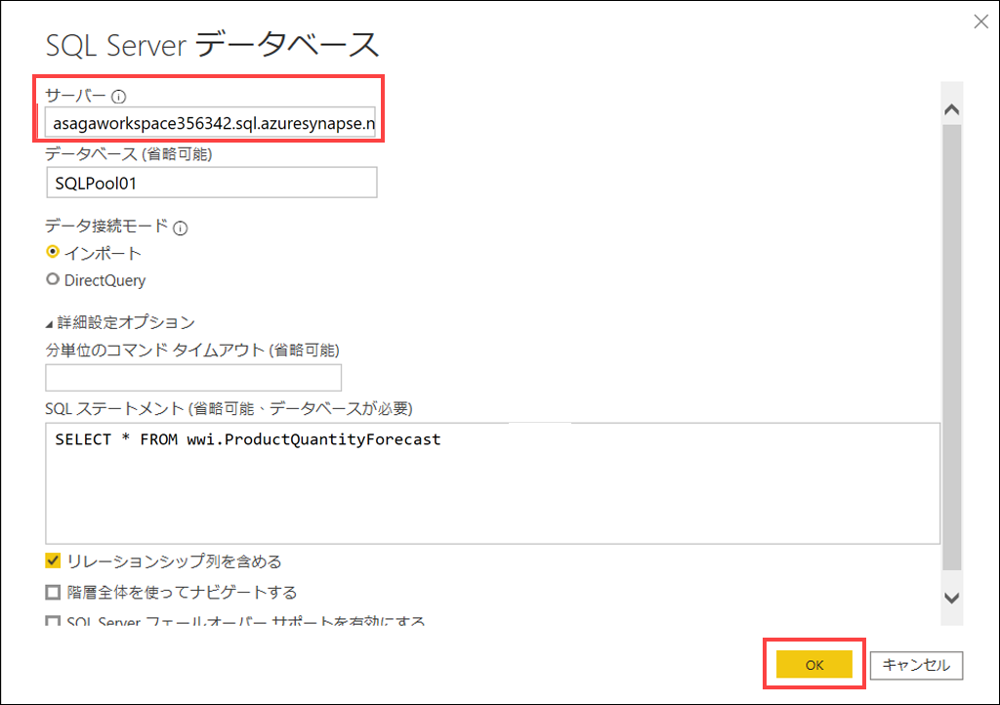

6. 資格情報ウィンドウが表示され、Synapse Analytics SQL プールに接続するために資格情報を入力するよう求められます (これが表示されない場合はリボンで `Data source settings` を選択してデータソースを選び、`Edit Permissions...` を選択してから `Credentials` で `Edit...` を選択します)。

7. 資格情報ウィンドウで `Microsoft account` を選択してから `Sign in` を選択します。ご自分の Power BI Pro アカウントを使用してサインインします。

    

8. サインインした後、[**接続**」 を選択して専用 SQL プールへの接続を確立します。

    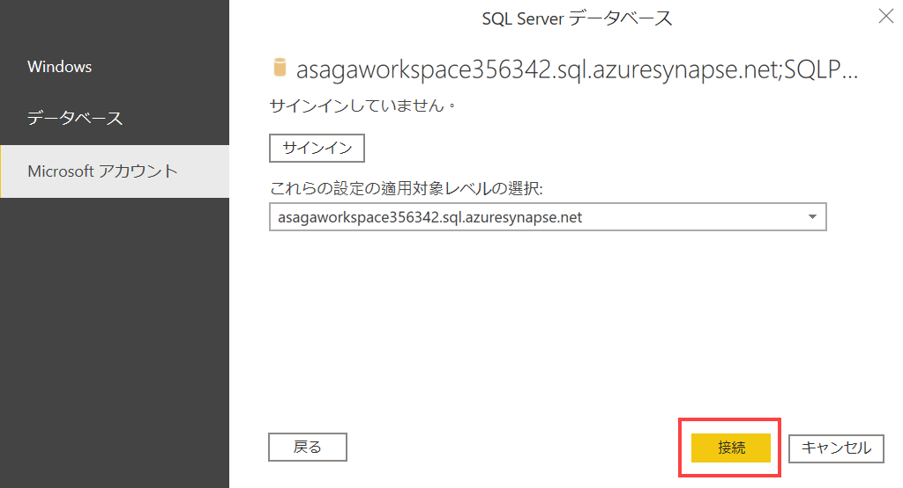

9. 開いているポップアップ ウィンドウをすべて閉じて、[**閉じて適用**」 を選択します。

    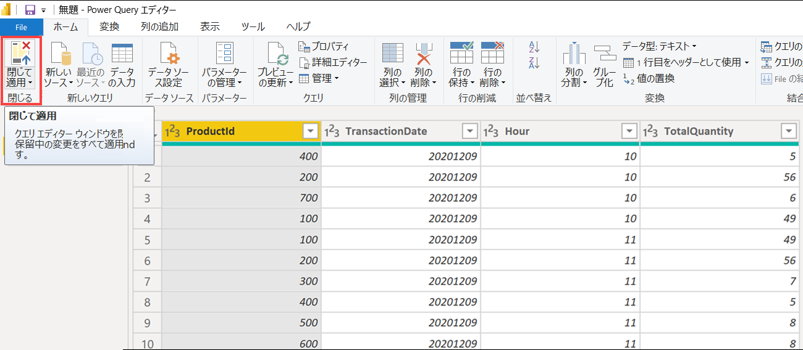

10. レポートが読み込まれたら、リボン上で [**公開**」 を選択します。変更を保存するよう指示されたら、[**保存**」 を選択します。

    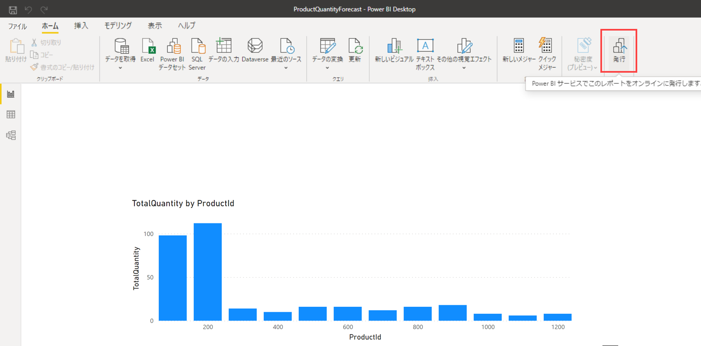

11. プロンプトで指示されたら、このラボで使用している Azure アカウントのメール アドレスを入力し、[**続行**」 を選択します。指示されたら、パスワードを入力するか、リストからユーザーを選択します。

    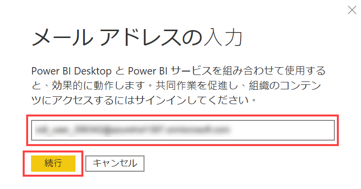

12. このラボで作成した Synapse Analytics Power BI Pro ワークスペースを選択し、[**保存**」 を選択します。

    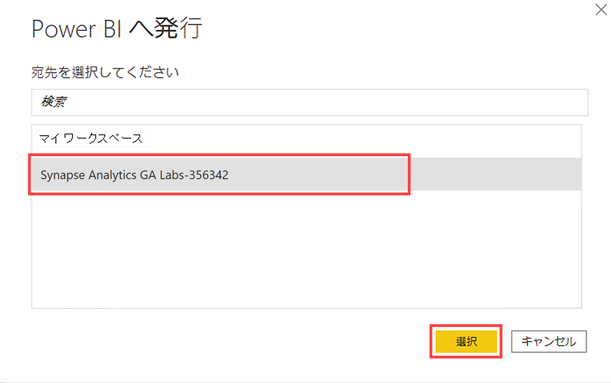

    公開が成功するまで待ちます。

    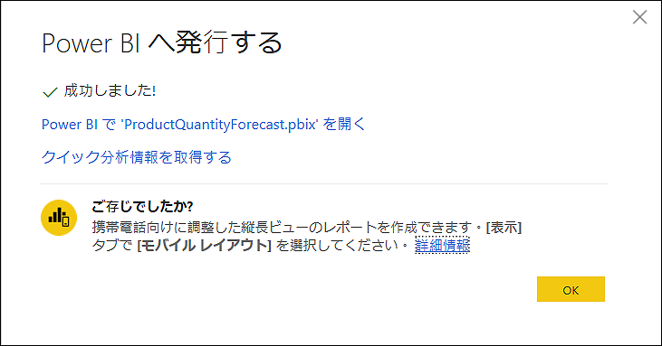

13. 新しい Web ブラウザー タブで、<https://powerbi.com> に移動します。

14. [**サインイン**」 を選択し、プロンプトで指示されたら、このラボで使用している Azure 資格情報を入力します。

15. 左側のメニューで [**ワークスペース**」 を選択した後、このラボで作成した Synapse Analytics Power BI ワークスペースを選択します。これは先ほど公開したワークスペースと同じものです。

    

16. 一番上のメニューで [**設定**」 を選択してから [**設定**」 を選択します。

    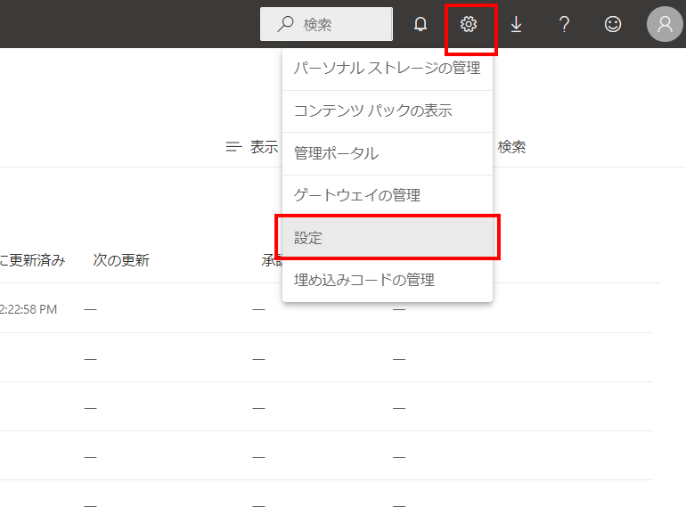

17. [**データベース**」 タブを選択してから [**資格情報の編集**」 を選択します。

    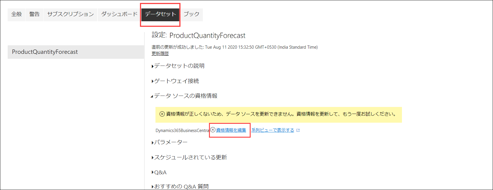

18. `Authentication method` で **OAuth2** を選択した後、[**サインイン**」 を選択します。プロンプトで指示されたら資格情報を入力します。

    

19. レポートの結果を表示するには、Synapse Studio に戻ります。

20. 左側で `Develop` ハブを選択します。

    

21. `Power BI` セクションを展開し、ワークスペースの `Power BI reports` セクションで `ProductQuantityForecast` レポートを選択します。

    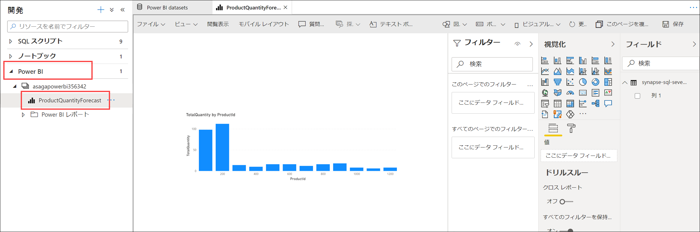

<!-- ### タスク 2: イベントベースのトリガーを使用してパイプラインをトリガーする

1. Synapse Studio で左側にある [**統合**」 ハブを選択します。

    

2. `Product Quantity Forecast` パイプラインを開きます。[**+ トリガーの追加**」 を選択してから [**新規作成/編集**」 を選択します。

    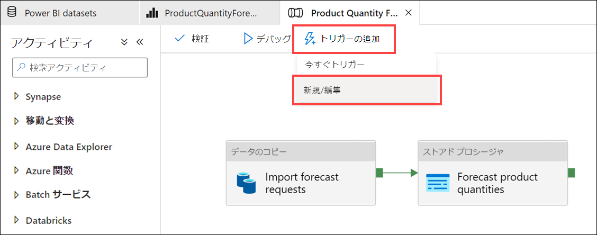

3. `Add triggers` ダイアログで [**トリガーの選択...**」 を選んでから [**+ 新規作成**」 を選択します。

    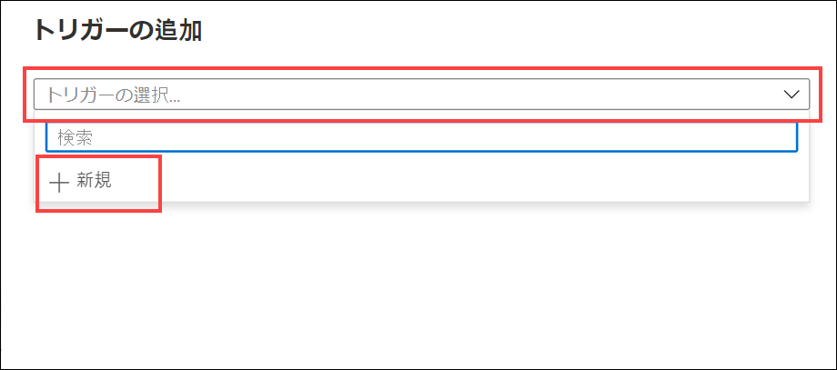

4. `New trigger` ウィンドウに次の値を入力します。

   - **名前**: `New data trigger` と入力します。
   - **種類**: `Storage events` と入力します。
   - **Azure サブスクリプション**: 正しい Azure サブスクリプションが選択されていることを確認します (お使いになっているリソース グループが含まれているもの)。
   - **ストレージ アカウント名**: `asagadatalake<uniqu_prefix>` アカウントを選択します (`<unique_suffix>` は Synapse Analytics ワークスペースの一意のサフィックス)。
   - **コンテナー名**: `wwi-02` を選択します。
   - **Blob パスは次の値で始まる**: `sale-small-product-quantity-forecast/ProductQuantity` と入力します。
   - **イベント**: `Blob created` を選択します。

   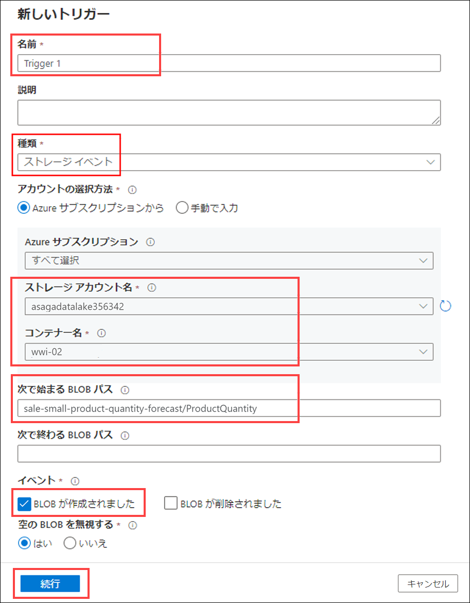

5. [**続行**」 を選択してトリガーを作成し、`Data preview` ダイアログでもう一度 `Continue` を選択して `OK` を選択します。もう一度、`OK` を選択してトリガーを保存します。

    

6. Synapse Studio で `Publish all` を選択した後、`Publish` を選択してあらゆる変更を公開します。

7. https://solliancepublicdata.blob.core.windows.net/wwi-02/sale-small-product-quantity-forecast/ProductQuantity-20201209-12.csv から `ProductQuantity-20201209-12.csv` ファイルをダウンロードします。

8. Synapse Studio で左側にある `Data` ハブを選択し、`Linked` セクションのプライマリ データ レイク アカウントに移動します。`wwi-02 > sale-small-product-quantity-forecast` パスを開きます。既存の `ProductQuantity-20201209-11.csv` ファイルを削除し、`ProductQuantity-20201209-12.csv` ファイルをアップロードします。これにより、[製品数量予測」 パイプラインがトリガーされ、予測リクエストが CSV ファイルからインポートされ、予測ストアド プロシージャを実行します。

9. Synapse Studio で左側にある `Monitor` ハブを選択し、`Trigger runs` を選択すると、新しく有効になったパイプライン実行が表示されます。パイプラインが終了すると、Synapse Studio で Power BI レポートが更新され、更新されたデータが表示されます。-->

## リソース

このラボで取り上げたトピックの詳細については、以下のリソースを参照してください。

- [クイック スタート: Synapse で Azure Machine Learning のリンクされたサービスを新規作成する](https://docs.microsoft.com/azure/synapse-analytics/machine-learning/quickstart-integrate-azure-machine-learning)
- [チュートリアル: 専用 SQL プール向けの機械学習モデル スコアリング ウィザード](https://docs.microsoft.com/azure/synapse-analytics/machine-learning/tutorial-sql-pool-model-scoring-wizard)
